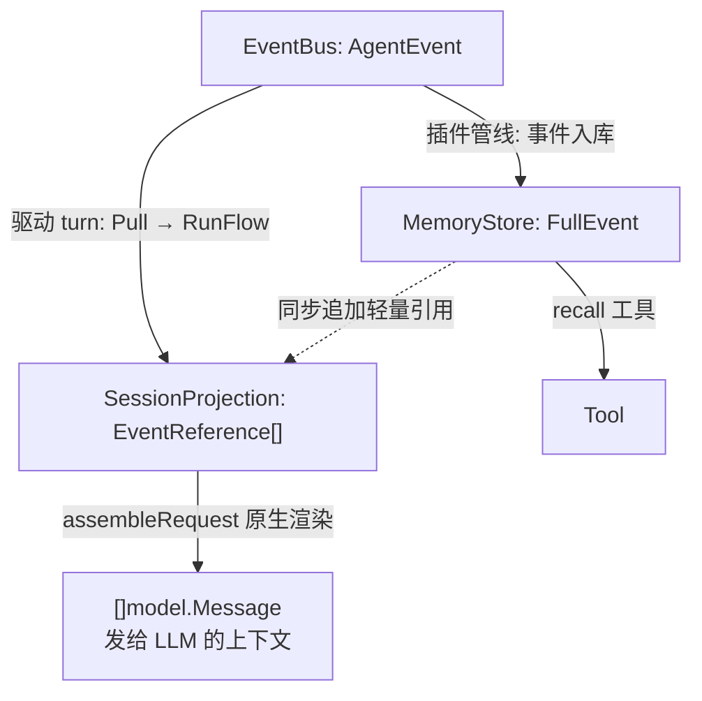
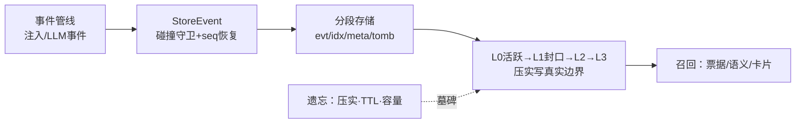
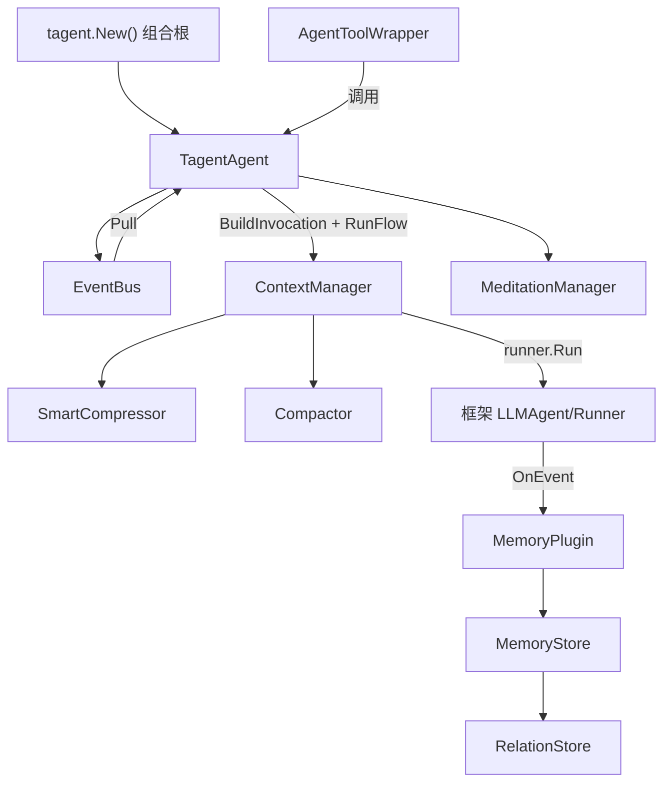

# tagent

**记忆驱动的长期运行 Agent 框架** —— 基于 [trpc-agent-go](https://github.com/trpc-group/trpc-agent-go)，用事件驱动引擎替代同步 ReAct 循环：事件永久入库、上下文按需压缩、历史随时召回，让 Agent 可以**连续运行数天而不失忆、不失控**。

[English](README_EN.md) | 中文

---

## ✨ 特性一览

| 特性 | 一句话说明 |
|------|-----------|
| 🔄 **持久事件循环** | `StartLoop` 后常驻运行；消息、工具结果、定时事件统一经 EventBus 驱动 turn |
| 🧠 **记忆三原语** | store（事件不可变入库）/ compress（总结+自然遗忘）/ recall（票据或语义召回） |
| 🗂 **卡片序列** | 压缩后的历史浓缩为索引卡片行——模型始终"看得见做过什么"，每张卡自带召回票据 |
| ⚡ **异步任务层** | 长命令/服务经 tmux 后台运行：快命令内联返回，慢任务 ACK + `task_settled` 通知回写 |
| 🔁 **任务重入** | `resume_task` 对存活服务续输入（REPL 式）、对完成的子 Agent 续指令（自动还原上下文） |
| 🤖 **子 Agent 编排** | 本地 `AgentToolWrapper` / 远程 A2A 协议统一封装；事件跨 Agent 按 key 精确传递 |
| 🧘 **冥想心跳** | 自我改进引擎：空闲期(novelty+idle 门控)反思近期工作，产出脚本/skill/prompt 三类改进产物并经 `refine register` 登记（git 留痕+评估窗口）——不是被动日记 |
| 🎓 **RL 集成** | HTTPAPI + SwappableModel + TrajectoryRecorder，与 AReaL 对接采集训练轨迹 |
| 🔌 **MCP 闭环** | `mcp_servers` 声明式注册表（增删热同步）+ `mcp_call` 网关 + `mcp_discover` 发现——工具知识按需渗透进上下文，工具声明区恒定（缓存友好） |
| 🔍 **混合语义召回** | `memory.engine.embedding` 开启后向量∪关键词 RRF 融合召回；语义发现→票据取回两段式不变；未配置时行为与纯关键词逐字节一致 |
| 📊 **统一可观测** | turn root span + trace_id 三投影互链（事件 Metadata / RL 轨迹 / OTel span 树）；设 OTLP endpoint 导出，未设 noop 零开销 |
| 🛡 **治理闸**（默认关） | RiskClassifier 四级风险 + 预算滑窗 + critical 异步审批（**审批消息流**：请求渗透为消息→人工回复 approve/reject <digest> 或 CLI 批准→白名单校验→落盘生效）+ DenialLedger 审计 + **goal 五工具**（goal_declare/goal_list/goal_resolve/denial_query/approval_list，entry only）+ **负反馈 guardrail 判据**；GovernanceTool 装饰全部 leaf 工具 |
| 🔁 **回执-反馈闭环** | 任务结算自动写 task_settle feedback（completed→positive/failed→negative，suspect 不写）+ `POST /feedback` 外部评分 + FeedbackBinder 因果边绑定产出事件；negative_feedback_rate 进入改进窗口 guardrail 判据（跨版本误归因防线=改进版本章精确 join） |
| 🧬 **自进化**（默认关） | **git 原生**改进通道：文件即真源（热重载直生效）+ git 版本层（`[self-improve]` 标记 commit/revert/log）+ refine 工具（register 登记/status 台账/rollback 安全回滚）+ 后验评估（guardrail/judge 劣化**只出建议**——执行权永远在 agent） |
| 🚡 **常驻可靠性**（默认关） | EventBus 磁盘溢出（at-least-once 不丢事件）+ DegradationManager 五依赖退化追踪 + mem_spill 存储失败兜底重放 |

## 🎬 一个长期运行的日常


## 📦 环境依赖

| 依赖 | 要求 | 用途 |
|---|---|---|
| Go | ≥ 1.24 | 构建（`go build ./...`；go.mod 声明为准） |
| tmux | 任意近期版本 | exec 工具命令执行 + 异步任务层（fast 路径内联返回 / slow 路径 tmux 后台 + `task_settled` 回写） |
| rustviking | 可选 | 仅 `memory.type: file` 持久后端的 KV；缺省用 `memory`/`localfile` 后端（零外部二进制依赖） |
| ZAI_API_KEY | 按需 | **GLM Coding Plan 系**（zhipu glm 模型 + zhipu embedding + web-search-prime MCP，一把 key 通吃；examples 默认）；**全部单测使用 mock，无需任何 key** |
| TENCENT_HY_API_KEY | 按需 | **混元系**（tencent_hy provider 的 hy3 模型，仅 tests/hy3_thinking_test.go 使用）——与 ZAI 分属两家供应商，按所用模型配置，二者均可选 |
| OTLP endpoint | 可选 | 设 `OTEL_EXPORTER_OTLP_ENDPOINT` 启用 trace 导出（Jaeger/Tempo 等）；未设为 noop，零开销零行为变化 |

## 🚀 快速开始

**1. 声明式配置（YAML）**

```yaml
entry: tagent
prompt_dir: resources/prompts
model: glm-4-flash
providers:
  openai:
    api_endpoint: "https://open.bigmodel.cn/api/paas/v4"
    api_key_env: "ZAI_API_KEY"

agents:
  tagent:
    system_prompt:
      files: [AGENTS.md, SOUL.md, TOOLS.md]
    memory:
      type: localfile
      path: /data/tagent/events
    tools:
      - kind: tool
        id: recall               # 统一召回入口：票据/因果链/关键词检索（参数即路由）
      - kind: tool
        id: exec                 # tmux 命令执行（异步任务层）
        description_file: action_tool_desc.md

  recall:
    system_prompt:
      files: [recall_agent.md]
    memory:
      type: memory
    max_tool_iterations: 10
```

**2. 三行进入持久循环（Go）**

```go
ta, _ := tagent.New(cfg, tagent.WithModel(model))
defer ta.Close()

outputCh, _ := ta.StartLoop("userID", "sessionID")
ta.InjectMessage(model.Message{Role: model.RoleUser, Content: "帮我执行一个命令"})

for evt := range outputCh {
    if evt.IsFinalResponse() {
        println("Final:", evt.Message.Content)
    }
}
```

**3. 跑通完整示例（WeChat Bot）**

**本地裸机部署（推荐，个人助手场景）**——交互式向导一步到位：

```bash
cd examples/wechat-bot
./wizard.sh    # 7 步向导：① 检查依赖(go≥1.24/tmux 硬性;node/openspec/rustviking 软性)
               # ② 引导填 ZAI_API_KEY(不回显、不入 history) ③ 设 agent 工作根(TAGENT_WORKING_DIR)
               # ④ 生成 .env(chmod 600) ⑤ 工作区 ACL 权限初始化 ⑥ 验证连通性(embedding 端点,
               # 不耗 chat 额度) ⑦ 下一步指引
./run.sh       # 前台启动（./run.sh start 后台；./run.sh --help 看全部命令；./run.sh setup 亦触发向导）
```

密钥写入 `.env`（已被 `examples/wechat-bot/.gitignore` 白名单模式天然忽略，绝不入库）；`run.sh`
启动时自动加载 `.env`，**已导出的环境变量优先**（支持 `ZAI_API_KEY=x ./run.sh` 临时覆盖）。
子命令：`wizard.sh --check` 仅查依赖、`--verify` 仅验连通、`--perms` 仅重做工作区权限。

**远端常驻部署（裸机 systemd）**——`./run.sh build` 构建纯静态二进制（`CGO_ENABLED=0`，无需 gcc）→
安装 `deploy/tagent-wechat.service`（非 root / `ProtectSystem=strict` + `ReadWritePaths` 白名单 /
`Restart=always` 崩溃自愈 / SIGTERM 优雅关闭 / 资源上限）→ `systemctl enable --now`。
完整步骤、数据目录与备份、工作根 ACL 两道放行、运维与故障排查见
[examples/wechat-bot/deploy/README.md](examples/wechat-bot/deploy/README.md)（或 `./run.sh systemd` 打印指引）。

或直接 `go run`（需已 `export ZAI_API_KEY`）：

```bash
cd examples/wechat-bot && go run .    # 微信机器人：持久循环+全部机制实战
```

其他运行模式：容器部署（`examples/wechat-bot/Dockerfile` + `docker-compose.yml`，podman/docker 兼容，密钥经 env 注入）、A2A 服务端（`agent.NewA2AServer`）、RL rollout worker（`agent.NewHTTPAPI` 对接 AReaL，`./run.sh rl`）——见 [docs/wiki/](docs/wiki/)。

## 🧠 心智模型

### 三层数据表示

| 层 | 位置 | 职责 | 生命周期 |
|-----|------|------|----------|
| **EventBus AgentEvent** | Agent 内存 | 事件触发队列 | Publish → Pull 后丢弃 |
| **SessionProjection EventReference[]** | Agent 内存 | 投影（有界工作内存） | 可被 Compactor 清理 |
| **MemoryStore FullEvent** | 内存/文件/DB | 永久存储（不可变） | 永久 |



**关键约束**：投影只存轻量引用（key+type+summary）；MemoryStore 是唯一完整事件链；压缩只改 LLM 视图与投影，永不动存储。

### 记忆三原语与压缩级联


- **双层折叠**：L3 整段离场时，工程票据层（卡片行 + `[evt_key]` 召回票据）恒在；配置 `summary_model` 时叠加单行 `〔历史综述〕` LLM 滚动综述（增量合成、编译期常量限长，失败降级纯工程）
- **成本可控**：骨架定级与票据层纯工程零 LLM，开销只与新增段有关；LLM 仅两处低频叠加——L3 滚动综述（每轮折叠 1 次）与卡片超限浓缩（`condenseCardLines`），无模型时均降级为工程形态
- **卡片序列**：压缩后的历史保持为可读的卡片行（`[Compacted N] + 〔历史综述〕 + 卡片行 + recent keys`），冥想沉淀带 ★ 高亮
- **原文可忘，票据长存**：卡片里的 `[hex]` key 就是召回票据——随时用 `recall` 取回原文（旧 legacy 管线的 L3 LLM 段摘要/固化物已移除，存量固化物保留 TTL 豁免、自然清退）

### 记忆数据模型（LSM）

存储按 **LSM 树**组织：事件从两条现役管线（EventBus 注入 / 框架 LLM 事件）汇入唯一写入路径（旧 legacy 压缩固化物管线已移除，存量固化物只读不清），顺序追加进按写入时间分段的存储；层级表示写入新近度与压实代数，封口/压实写入真实时间边界供查询剪枝；遗忘由压实、TTL、容量三层各自负责。



- **召回与压缩同向**：压缩丢旧留新，召回新先于旧——`timestamp_desc` 下截断只牺牲最旧，永不丢最新记忆
- **两条时间轴**：`Timestamp`（事件时刻）是唯一语义时间轴；EventKey 内嵌时间（写入时刻）仅用于段放置与同毫秒决胜
- **事件不可变**：EventKey 是事件身份，重复写入被拒绝；重启后 seq 从已有最大值恢复，不覆写旧事件
- **遗忘可配置**：TTL 按事件类型衰减（固化物豁免），经 `memory.lifecycle` 声明；负全局 TTL = 总开关关闭遗忘

完整数据流、隐式连接与硬契约见 [wiki/memory §16](docs/wiki/memory/memory-architecture.md)。

## ⚙️ 六大机制速览

| 机制 | 亮点 | 详解 |
|------|------|------|
| 持久事件循环 | Pull 批处理；async 结果排队不打断进行中 turn | [wiki/agent](docs/wiki/agent/event-flow.md) |
| 上下文压缩 | 双层设计：发给 LLM 的视图分级压缩 + 工作内存滚动成卡片；**容量单维触发**（token 超阈才整理）+ 整理间渲染冻结（前缀字节稳定，缓存友好）；进行中段工具调用历史折叠为工具链行（有界化，无零信息占位符）；超大 settle 结果转储文件（事件本体有界，防召回复发）；被丢弃的执行过程经 `recall(turn_key=...)` 因果链召回；永不修改已存储的事件 | [wiki/memory](docs/wiki/memory/memory-architecture.md) |
| 事件驱动记忆 | 每个事件有全局唯一 key（时间有序）；Agent 间存储隔离，跨 Agent 读需显式授权 | [wiki/memory](docs/wiki/memory/memory-architecture.md) |
| 子 Agent 调用 | `event_params: [event_keys]` 按 key 传事件（数据隔离）；A2A 远程透明 | [wiki/tool](docs/wiki/tool/tool-architecture.md) |
| 异步任务层 | 快命令秒回、慢任务后台通知；实时任务看板；`resume_task` 随时续跑；退出不留孤儿进程 | [wiki/tool](docs/wiki/tool/tool-architecture.md) |
| 冥想心跳 | 自我改进引擎（空闲门控反思）：产出脚本/skill/prompt 三类改进并 `refine register` 登记；输出以 ★ 高亮卡片进长期记忆 | [wiki/agent](docs/wiki/agent/agent-architecture.md) |

## 🏗 架构



| 模块 | 职责 |
|------|------|
| `agent/` | 事件驱动引擎：EventBus、runEventLoop、ContextManager（粘合层）、冥想、子 Agent 封装 |
| `agent/task/` | 任务生命周期：TaskManager、完成探测、任务看板、重入 |
| `agent/compress/` | 压缩域：上下文压缩、卡片序列、投影、token 计量 |
| `memory/` + `memory/engine/` + `memory/embedder/` + `memory/kv/` | 结构化事件存储：InMemoryStore、FileSegmentStore、RelationStore、生命周期；C6/KVStore/Embedder 契约居核心，语义引擎适配器（bridge/hybrid RRF/诊断）、嵌入供应商（zhipu/mock/traced）、KV 存储后端（localfile/rustviking）各居独立子包——新增引擎/嵌入供应商/后端只进对应子包，接入指南见 `memory/kv.go` 与 `memory/embedder.go` |
| `plugin/` | 框架插件：MemoryPlugin（持久化+因果链）、SummaryPlugin（元数据标注） |
| `tool/` | 工具：ActionTool（tmux）、recall/knowledge 子工具、任务工具族、文件工具 |
| `event/` | 事件类型系统与元数据契约（`FormatEventKey`/`ParseEventMeta`）；EventTypeSpec 注册表（类型元数据单点声明） |
| `rl/` | RL 集成：TrajectoryRecorder（含 trace 关联字段）、SwappableModel、HTTPAPI |
| `tool/mcp/` | MCP server 注册表（YAML 声明 + 热同步）+ `mcp_call` 网关（声明恒定） |
| `tool/memoryx/` | 记忆策展工具：memory_consolidate（服务端指纹防伪造）、memory_health（维度诊断） |
| `agent/governance/` | 治理闸（默认关）：RiskClassifier、Budget/Approval/DenialLedger/Goal、GovernanceTool 装饰器 |
| `agent/reliability/` | 常驻可靠性（默认关）：DegradationManager、ReliableBus 磁盘溢出、AnchorStore、mem_spill |
| `evolution/` | git 原生自进化（默认关）：GitEvolution 装配单元、gitrefine 纯函数、refine 工具、judge/guardrail |
| `tagent.go` + `config.go` | 组合根与声明式配置 |

依赖全部单向无循环：`root → agent → plugin → memory`，`tool/* → memory`。

## 📐 设计哲学

四条承诺，贯穿所有机制：

1. **事件不可变**：发生过的事永久入库、永不修改——压缩、遗忘都只作用于"视图"，不作用于事实
2. **上下文有界**：发给 LLM 的工作内存永远有预算上限，超限自动压缩——不靠无限窗口，靠分层记忆
3. **召回精确**：压缩掉的内容都留有票据（事件 key），按票取回原文，零幻觉
4. **异步不失联**：长任务先应答、完成后通知；通知自带完整上下文，压缩或乱序都不会产生"断线"的任务

自进化子系统另有四原则（默认 agent 自迭代 / 文件即真源 / 版本管理复用 git / 信号建议式——框架永不动手），见 [wiki/platform](docs/wiki/platform/platform-subsystems.md)。

更完整的设计论证（不变量、时间线渲染规则、元数据契约）见 [docs/wiki/](docs/wiki/) 与 [openspec/specs/](openspec/specs/)。

## 🔧 配置参考

### 全局选项

| 选项 | 默认值 | 说明 |
|------|--------|------|
| `entry` | `tagent` | 入口 Agent 名称 |
| `prompt_dir` | `resources/prompts` | 全局 prompt 目录 |
| `model` | （必填） | 默认模型名称 |
| `provider` | `openai` | 默认 provider |
| `providers` | `{}` | provider 连接信息 |
| `log_level` | `info` | 日志级别 |
| `request_timeout_seconds` | `3600` | 请求超时 |
| `trajectory_dump` | `false` | 启用轨迹记录 |
| `trajectory_dir` | `data/trajectories` | 轨迹文件目录 |
| `working_dir` | `""` | **agent 统一工作根**——file 工具 `base_dir` 与 exec 命令 cwd 的共同基准（二者恒一致，保模型单一文件系统视图）。空 = 继承进程工作目录；设为项目 clone 根即让 agent 操作该目录下所有仓库，而 tagent 自身配置/资源/数据路径不受影响。优先级 `properties.base_dir`/`workspace` > `working_dir` > 进程 cwd。可经环境变量 `TAGENT_WORKING_DIR` 覆盖（部署时免改 YAML） |
| `api_key_env` | `ZAI_API_KEY` | 全局 API key 环境变量名（`providers.<name>.api_key_env` 优先） |
| `mcp_servers` | `{}` | MCP server 声明式注册表：每项 `transport`（stdio/sse/streamable-http）/`url`/`headers`/`api_key_env`/`command`/`args`/`timeout`；增删保存即热生效（无需重启），经 `mcp_discover`/`mcp_call` 使用 |

### Agent 级选项

| 选项 | 默认值 | 说明 |
|------|--------|------|
| `model` / `provider` | （继承全局） | LLM 模型与 provider |
| `system_prompt.files` | `[]` | 加载的 prompt 文件 |
| `memory.type` | `memory` | `memory`（进程内）/`file`（rustviking CLI 持久）/`localfile`（JSON 文件 KV 持久，零外部依赖） |
| `memory.path` | `""` | 存储路径/标识；`memory` 型下同 path 的 agent 共享同一实例，空 = 隔离存储 |
| `memory.read_namespaces` | `[]` | 可读取的其他 agent 分区（跨 agent 记忆访问须显式授权） |
| `memory.rustviking_binary` | `rustviking` | 仅 `type: file`：rustviking CLI 路径（空则走 PATH 查找） |
| `memory.lifecycle` | 内置默认 | 遗忘策略：`global_ttl_days`（默认 7，**负值 = 关闭 TTL 遗忘**）/`type_ttl`（按事件类型覆盖，负值豁免）/`check_interval`（默认 `1h`）/`max_events_per_partition`（默认 0 = 不限） |
| `memory.engine` | （关闭） | 语义检索引擎：`backend`（memory/rustviking，MVP 阶段等价，差异在向量持久化底座）/`embedding`（见下）/`vector_top_k`（20）/`keyword_top_k`（20）/`rrf_k`（60） |
| `memory.engine.embedding` | （关闭） | `provider`（zhipu/mock）/`model`（embedding-3）/`api_key_env`（ZAI_API_KEY）/`endpoint`/`dimensions`（512/1024/2048）；开启后 recall 升级向量∪关键词 RRF 融合，key 缺失优雅降级纯关键词 |
| `memory.engine.consolidation` | （关闭） | 巩固建议式触发（不依赖 embedding）：`capacity_threshold`（边界事件计数超阈发 consolidation_hint 渗透消息+冥想 digest 附候选，0=关）/`min_source_events`（memory_consolidate 硬门控，源不足显式拒绝）/`snooze`（提示静默窗，如 24h）。触发只是建议——执行权在 LLM+工具 |
| `workspace_root` | `.tagent-workspace` | **scratch 根**（非工作根）：超大工具输出落 `<root>/tool-output`、tmux 命令目录 `<root>/exec`；与 `working_dir`（file/exec 的路径基准）是两个不同概念 |
| `max_tool_iterations` | 入口 50 / 子 10 | 最大 ReAct 迭代次数 |
| `max_tokens` | 入口 8000 / 子 4096 | 上下文 token 预算 |
| `compress_threshold` | `0.8` | 压缩触发比例——**整理（compaction）的唯一触发条件**（容量超阈才整理）；task_settled 通知全文内联，整理间上下文前缀稳定以利缓存复用 |
| `keep_recent_tasks` | `2` | **整理后**保留的最近任务数（L0 保留区与全文窗口派生的状态参数，不参与触发） |
| `task_terminal_ttl` | `"2m"` | 终态任务回收前保留期（也是终态任务的 resume_task 重入窗口） |
| `resume_context_rounds` | `3` | 子 Agent 重入还原的前序轮次数 |
| `temperature` | 入口 0.7 / 子 0.3 | LLM 温度 |
| `meditation.enabled` | `false` | 启用冥想（`interval`/`min_gap`/`prompt_file`） |

### compress 块（压缩家族）

| 选项 | 默认值 | 说明 |
|------|--------|------|
| `summary_model` / `summary_provider` | （继承 agent） | 压缩摘要专用模型（可用廉价模型） |
| `card_max_chars` | `6000` | 卡片序列长度上限；超限旧卡 LLM 整理或沉底 |
| `compact_keys_listed` | `32` | 滚动摘要列出的 recent keys 上限 |
| `recent_full_count` | `keep_recent_tasks × 4` | 全文解析窗口大小（未配置时派生，显式配置优先）；**在整理轮锚定、整理间冻结**——锚点后的既有引用保持摘要渲染，新追加事件全文（活跃前沿），前缀字节稳定 |
| `summary_max_tokens` | `8192` | 每次摘要 LLM 调用的输出 token 预算下限（防 reasoning 模型挤空 Content） |

### 工具引用（ToolRef）

| 字段 | 说明 |
|------|------|
| `kind` | `agent`（默认）或 `tool` |
| `agent` / `id` | 子 Agent 名称 / 工具 ID |
| `description` / `description_file` | 工具描述：内联文本 / prompt 文件（相对 `prompt_dir`）。`kind: agent` 必须二者其一 |
| `event_params` | 事件参数，如 `[event_keys]` |
| `extra_params` | 附加路由参数声明（如 plan 的 `action` enum + `name`）；调用时随 `request` 打包为 JSON 消息体透传子 Agent，未声明则消息体保持纯文本 |
| `async` | 子 Agent 是否走异步任务层（默认 true；false = 恒同步，减轻弱模型对 ack/通知语义的负担） |
| `remote.url` | 远程 A2A Agent URL（设置后创建 A2AAgent 而非本地 TagentAgent） |
| `properties` | 工具专属配置：exec 的 `workspace`（命令 cwd）/`run_as_user`/`run_as_group`/`monitor`（轮询参数）；file 工具族的 `base_dir`（沙箱根）。二者缺省时回退全局 `working_dir`，再回退进程 cwd |
| `factory` | 自定义工厂路径（非内置工具/agent 的扩展点） |

> agent 运行参数（`max_tool_iterations`/`max_tokens`/`temperature`）**只在被引用 agent 自身的 `agents.<name>` 定义处配置**——ToolRef 只声明引用关系。

### 平台子系统（默认全部关闭 = 零行为变化；按需开启）

| 配置块 | 关键字段 | 说明 |
|--------|---------|------|
| `governance:` | `enabled` / `enforcement`（warn 放行记账 \| strict 拒绝）/ `dir`（空=纯内存）/ `budget_window_minutes` / `max_high_risk` / `max_medium_risk` / `goal_required_for` | 治理闸：全部 agent 的 leaf 工具过 RiskClassifier 分级 + 预算滑窗 + critical 异步审批（外部落盘 `approvals/` 目录即生效；**审批请求渗透为消息、人工回复 approve/reject <digest> 即生效**，`app.wechat.approvers` 白名单校验发送者）；DenialLedger 审计事件写 entry memStore；goal 五工具（entry only）登记自治目标 |
| `evolution:` | `enabled` / `protected_paths`（默认 `resources/prompts/**`,`skills/**`,`scripts/**`）/ `judge_delay_seconds` / `judge_min_samples` / `judge_pass_threshold` / `judge_timeout_seconds` | git 原生自进化：refine register 登记改进（`[self-improve]` commit+improvement 事件+评估窗口）；judge_delay 后 guardrail/judge 评估一次，劣化只出建议（evaluation 事件→冥想 digest）；rollback 安全 revert。⚠ 生产=独立部署仓 |
| `reliability:` | `degradation_enabled`（五依赖退化状态机总开关）/ `bus_spill_dir`（非空启用事件溢出）/ `mem_spill_dir`（StoreEvent 失败兜底重放，重放双写投影）/ `meditation_anchor_dir`（冥想锚点跨重启）/ **降级行为层**（默认全关）：`degradation_model_backoff`（model 退化时 turn 间退避，如 5s）/ `degradation_mcp_probe_every`（mcp 退化时熔断半开探测间隔 N）/ `degradation_disk_block_spawn`（disk 退化时禁新任务 spawn，进行中任务不受影响） | 常驻可靠性：每 agent 子目录隔离；**退化追踪由 `degradation_enabled` 独立开关控制**（ErrorTrackingStore 最外层包裹 memStore + event_loop 上报 model 失败 + mcp_call 上报），与 governance 配置无耦合；`mem_spill_dir` 仅在 `degradation_enabled` 为真时接线；降级行为是「闸不是墙」——每项独立开关，恢复即回正常路径 |

详见 [docs/wiki/platform/platform-subsystems.md](docs/wiki/platform/platform-subsystems.md)。

## 📚 深入阅读

| 主题 | 文档 |
|------|------|
| 记忆架构 / 策展 / recall 协议 | [docs/wiki/memory/memory-architecture.md](docs/wiki/memory/memory-architecture.md) |
| 平台子系统（治理 / 自进化 / 可靠性 / 可观测 / 记忆引擎 / MCP） | [docs/wiki/platform/platform-subsystems.md](docs/wiki/platform/platform-subsystems.md) |
| 启用子系统后 agent 在各复杂场景的行为反应 | [docs/wiki/platform/agent-behavior-matrix.md](docs/wiki/platform/agent-behavior-matrix.md) |
| 工具架构 / 任务重入 / 会话回收 | [docs/wiki/tool/tool-architecture.md](docs/wiki/tool/tool-architecture.md) |
| Agent 架构 / 事件流 | [docs/wiki/agent/](docs/wiki/agent/) |
| 事件系统 / 插件 / Prompt | [docs/wiki/](docs/wiki/) |
| 设计规格（OpenSpec） | [openspec/specs/](openspec/specs/) |
| 完整示例（WeChat Bot：五 agent 编排 / 消息链路 / RL 模式） | [examples/wechat-bot/README.md](examples/wechat-bot/README.md) |
| 裸机 systemd 部署（含可观测后端 Jaeger） | [examples/wechat-bot/deploy/README.md](examples/wechat-bot/deploy/README.md) |
| 真实 LLM 契约守护矩阵 | [tests/README.md](tests/README.md) |

## 开发

```bash
go build ./... && go vet ./...         # 构建 + 静态检查
go test ./... -short                   # 测试（CI 同款：short + 新子系统 -race，见 .github/workflows/ci.yml）
go test ./evals/                       # 组件级行为评估（票据可召回率/工具选择/Bad Case 资产）
bash scripts/race_check.sh             # race 门禁（本地全量）
cd examples/wechat-bot && go run .     # 运行示例
```

CI（GitHub Actions）在 push/PR 触发：build + vet + 全量 short 测试 + 新子系统（memory/governance/reliability/evolution/event/tool 等）`-race`；tests/ 下真实 LLM 契约测试无 key 自动跳过，不阻塞 CI。

## License

Apache License 2.0
