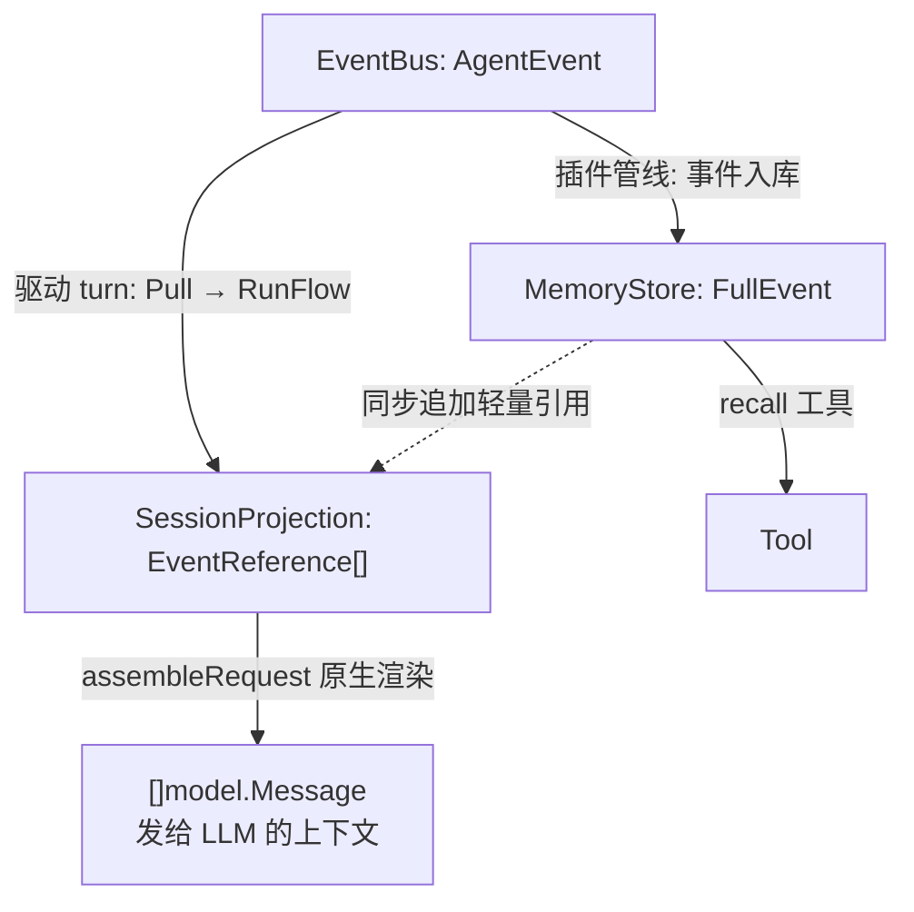
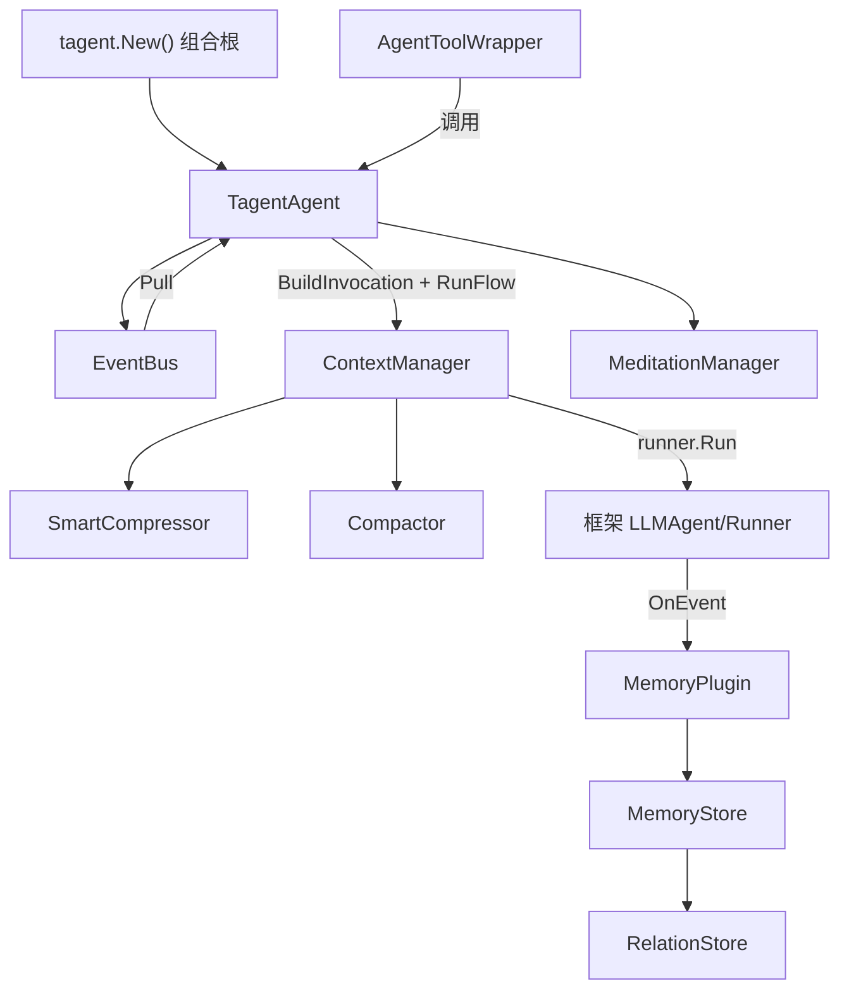

# tagent

**记忆驱动的长期运行 Agent 框架** —— 基于 [trpc-agent-go](https://github.com/trpc-group/trpc-agent-go)，用事件驱动引擎替代同步 ReAct 循环：事件永久入库、上下文按需压缩、历史随时召回，让 Agent 可以**连续运行数天而不失忆、不失控**。

[English](README_EN.md) | 中文

---

## ✨ 长期运行的七个问题，tagent 怎么接

tagent 为「连续运行数天而不失忆、不失控」而设计。以下每组对应长期运行中的一类真实问题——先说场景，再说实际行为。

### 🧠 跑得越久记得越多，上下文会不会爆？

会超，但不会丢。所有发生过的事件**不可变入库**；发给模型的只是一份**有界投影**——超出预算时旧历史自动压缩为索引卡片行（`[evt_1a2b] 部署成功…`），原文随时凭票据 `recall` 精确取回（零幻觉）。配置 embedding 后还能按语义找回「没有票据时想不起来」的事。

*机制：记忆三原语 · 卡片序列 · 混合语义召回 → [wiki/memory](docs/wiki/memory/memory-architecture.md)*

### ⚡ 一条部署命令要跑十分钟，对话是不是就卡死了？

不会。长命令自动转入 tmux 后台：立刻收到 ACK（「已在后台运行 task-42」），完成后 `task_settled` 通知自动回写并唤醒 Agent 处理结果，期间对话照常。任务看板实时可见全部在跑任务；对存活服务可 `resume_task` 续输入；进程退出不留孤儿。

*机制：异步任务层 · 任务重入 · 任务看板 → [wiki/tool](docs/wiki/tool/tool-architecture.md)*

### 🤖 任务太复杂，一个 Agent 转不过来？

拆给子 Agent。本地子 Agent 与远程 A2A Agent 统一封装为工具，事件跨 Agent 按 key 精确传递（存储隔离，跨读需显式授权）；被压缩掉的历史，子 Agent 凭票据回补。

*机制：子 Agent 编排 · A2A → [wiki/tool](docs/wiki/tool/tool-architecture.md)*

### 🧘 无人值守时，Agent 能不能自己变得更好？

能，但有边界。空闲期（双门控防自触发永动）反思近期工作，产出脚本/skill/prompt 三类改进并 `refine register` 登记（git 留痕、可回滚）；任务结算自动生成反馈，外部也可经 `POST /feedback` 评分回写——负反馈率成为改进的守门判据。**评估劣化只出建议，执行权永远在 agent 与人**。

*机制：冥想心跳 · 自进化 · 回执-反馈闭环 → [wiki/agent](docs/wiki/agent/agent-architecture.md)*

### 🔄 进程总要重启，跑了一半的状态丢了怎么办？

不丢。对话投影 / 任务板 / 常驻会话三层状态全部从事实链（不可变事件存储）重建：重启后上下文**逐字节复原**（LLM prefix-cache 继续命中）、在跑任务自动重挂、tmux 会话重新接管。改配置同样不必重启：保存后校验通过自动换新执行器（校验失败则旧执行器原样服务），进行中的回合不受影响，可回滚。

*机制：重启连续 · 非重启热更 → [wiki/agent §2.13](docs/wiki/agent/agent-architecture.md)*

### 🛡 放开手让它跑，怎么保证不失控、不静默瘫掉？

两道防线（默认关闭，按需开启）：**治理闸**——全部工具调用过风险分级 + 预算滑窗 + critical 操作异步人工审批（审批请求直接渗透为消息，回复即生效）+ 全程审计；**常驻可靠性**——事件总线磁盘溢出不丢事件、模型/MCP/磁盘等外部依赖退化逐一追踪并按策略降级，恢复即回正常路径。

*机制：治理闸 · 常驻可靠性 → [wiki/platform](docs/wiki/platform/platform-subsystems.md)*

### 🔌 接得上我的工具和训练管线吗？

接得上。MCP server 声明式注册（增删热同步、声明区恒定缓存友好）；训练侧全量记录 LLM 调用轨迹、模型热切换、HTTP API 直接对接 AReaL 做 RL；全链路 turn 级 trace（设 OTLP endpoint 导出，未设零开销）。

*机制：MCP 闭环 · RL 集成 · 统一可观测 → [docs/wiki/](docs/wiki/)*

## 🎬 一个长期运行的日常


## 📦 环境依赖

| 依赖 | 要求 | 用途 |
|---|---|---|
| Go | ≥ 1.24 | 构建 |
| tmux | 任意近期版本 | exec 命令执行 + 异步任务层 |
| rustviking | 可选 | 仅 `memory.type: file` 持久后端；缺省用 localfile（零外部依赖） |
| ZAI_API_KEY / TENCENT_HY_API_KEY | 按需 | 模型 API key（examples 默认 GLM 系）；**全部单测使用 mock，无需任何 key** |
| OTLP endpoint | 可选 | 设 `OTEL_EXPORTER_OTLP_ENDPOINT` 启用 trace 导出；未设 noop |

## 🚀 快速开始

**1. 声明式配置（YAML）**

```yaml
entry: tagent
prompt_dir: resources/prompts
model: glm-4-flash
providers:
  openai:
    api_endpoint: "https://open.bigmodel.cn/api/paas/v4"
    api_key_env: "ZAI_API_KEY"

agents:
  tagent:
    system_prompt:
      files: [AGENTS.md, SOUL.md, TOOLS.md]
    memory:
      type: localfile
      path: /data/tagent/events
    tools:
      - kind: tool
        id: recall               # 统一召回入口：票据/因果链/关键词检索（参数即路由）
      - kind: tool
        id: exec                 # tmux 命令执行（异步任务层）
        description_file: action_tool_desc.md

  recall:
    system_prompt:
      files: [recall_agent.md]
    memory:
      type: memory
    max_tool_iterations: 10
```

**2. 三行进入持久循环（Go）**

```go
ta, _ := tagent.New(cfg, tagent.WithModel(model))
defer ta.Close()

outputCh, _ := ta.StartLoop("userID", "sessionID")
ta.InjectMessage(model.Message{Role: model.RoleUser, Content: "帮我执行一个命令"})

for evt := range outputCh {
    if evt.IsFinalResponse() {
        println("Final:", evt.Message.Content)
    }
}
```

**3. 跑通完整示例（WeChat Bot）**

**本地裸机部署（推荐，个人助手场景）**——交互式向导一步到位：

```bash
cd examples/wechat-bot
./wizard.sh    # 7 步向导：① 检查依赖(go≥1.24/tmux 硬性;node/openspec/rustviking 软性)
               # ② 引导填 ZAI_API_KEY(不回显、不入 history) ③ 设 agent 工作根(TAGENT_WORKING_DIR)
               # ④ 生成 .env(chmod 600) ⑤ 工作区 ACL 权限初始化 ⑥ 验证连通性(embedding 端点,
               # 不耗 chat 额度) ⑦ 下一步指引
./run.sh       # 前台启动（./run.sh start 后台；./run.sh --help 看全部命令；./run.sh setup 亦触发向导）
```

密钥写入 `.env`（已被 `examples/wechat-bot/.gitignore` 白名单模式天然忽略，绝不入库）；`run.sh`
启动时自动加载 `.env`，**已导出的环境变量优先**（支持 `ZAI_API_KEY=x ./run.sh` 临时覆盖）。
子命令：`wizard.sh --check` 仅查依赖、`--verify` 仅验连通、`--perms` 仅重做工作区权限。

**远端常驻部署（裸机 systemd）**——`./run.sh build` 构建纯静态二进制（`CGO_ENABLED=0`，无需 gcc）→
安装 `deploy/tagent-wechat.service`（非 root / `ProtectSystem=strict` + `ReadWritePaths` 白名单 /
`Restart=always` 崩溃自愈 / SIGTERM 优雅关闭 / 资源上限）→ `systemctl enable --now`。
完整步骤、数据目录与备份、工作根 ACL 两道放行、运维与故障排查见
[examples/wechat-bot/deploy/README.md](examples/wechat-bot/deploy/README.md)（或 `./run.sh systemd` 打印指引）。

或直接 `go run`（需已 `export ZAI_API_KEY`）：

```bash
cd examples/wechat-bot && go run .    # 微信机器人：持久循环+全部机制实战
```

其他运行模式：容器部署（`examples/wechat-bot/Dockerfile` + `docker-compose.yml`，podman/docker 兼容，密钥经 env 注入）、A2A 服务端（`agent.NewA2AServer`）、RL rollout worker（`agent.NewHTTPAPI` 对接 AReaL，`./run.sh rl`）——见 [docs/wiki/](docs/wiki/)。

## 🧠 心智模型

### 三层数据表示

| 层 | 位置 | 职责 | 生命周期 |
|-----|------|------|----------|
| **EventBus AgentEvent** | Agent 内存 | 事件触发队列 | Publish → Pull 后丢弃 |
| **SessionProjection EventReference[]** | Agent 内存 | 投影（有界工作内存） | 可被 Compactor 清理 |
| **MemoryStore FullEvent** | 内存/文件/DB | 永久存储（不可变） | 永久 |



**关键约束**：投影只存轻量引用（key+type+summary）；MemoryStore 是唯一完整事件链；压缩只改 LLM 视图与投影，永不动存储。

### 记忆三原语与压缩级联


- **双层折叠**：L3 离场时工程票据层（卡片行 + `[evt_key]` 召回票据）恒在；配置 `summary_model` 时叠加单行 `〔历史综述〕` LLM 滚动综述，失败降级纯工程
- **卡片序列**：压缩后的历史保持为可读卡片行，冥想沉淀带 ★ 高亮；`[hex]` key 随时用 `recall` 取回原文（零幻觉）
- **成本可控**：骨架定级与票据层纯工程零 LLM；LLM 仅两处低频叠加（L3 综述 / 卡片浓缩）

存储按 **LSM 树**组织（L0 活跃→L1 封口→L2→L3 压实），遗忘由压实、TTL、容量三层各自负责；事件不可变、重复写入被拒；压缩丢旧留新、召回新先于旧——截断永不丢最新记忆。完整数据流、隐式连接与硬契约见 [wiki/memory](docs/wiki/memory/memory-architecture.md)。

## 🏗 架构



| 模块 | 职责 |
|------|------|
| `agent/` | 事件驱动引擎：EventBus、runEventLoop、ContextManager（粘合层）、冥想、子 Agent 封装 |
| `agent/task/` | 任务生命周期：TaskManager、完成探测、任务看板、重入 |
| `agent/compress/` | 压缩域：上下文压缩、卡片序列、投影、token 计量 |
| `memory/` + `memory/engine/` + `memory/embedder/` + `memory/kv/` | 结构化事件存储：InMemoryStore、FileSegmentStore、RelationStore、生命周期；C6/KVStore/Embedder 契约居核心，语义引擎适配器（bridge/hybrid RRF/诊断）、嵌入供应商（zhipu/mock/traced）、KV 存储后端（localfile/rustviking）各居独立子包——新增引擎/嵌入供应商/后端只进对应子包，接入指南见 `memory/kv.go` 与 `memory/embedder.go` |
| `plugin/` | 框架插件：MemoryPlugin（持久化+因果链）、SummaryPlugin（元数据标注） |
| `tool/` | 工具：ActionTool（tmux）、recall/knowledge 子工具、任务工具族、文件工具 |
| `event/` | 事件类型系统与元数据契约（`FormatEventKey`/`ParseEventMeta`）；EventTypeSpec 注册表（类型元数据单点声明） |
| `rl/` | RL 集成：TrajectoryRecorder（含 trace 关联字段）、SwappableModel、HTTPAPI |
| `tool/mcp/` | MCP server 注册表（YAML 声明 + 热同步）+ `mcp_call` 网关（声明恒定） |
| `tool/memoryx/` | 记忆策展工具：memory_consolidate（服务端指纹防伪造）、memory_health（维度诊断） |
| `agent/governance/` | 治理闸（默认关）：RiskClassifier、Budget/Approval/DenialLedger/Goal、GovernanceTool 装饰器 |
| `agent/reliability/` | 常驻可靠性（默认关）：DegradationManager、ReliableBus 磁盘溢出、AnchorStore、mem_spill |
| `evolution/` | git 原生自进化（默认关）：GitEvolution 装配单元、gitrefine 纯函数、refine 工具、judge/guardrail |
| `tagent.go` + `build_agent.go` + `wiring.go` + `config.go` | 组合根（类型/Option/New · agent 装配族 · resolve+wire 族）与声明式配置 |

依赖全部单向无循环：`root → agent → plugin → memory`，`tool/* → memory`。

## 📐 设计哲学

四条承诺，贯穿所有机制：

1. **事件不可变**：发生过的事永久入库、永不修改——压缩、遗忘都只作用于"视图"，不作用于事实
2. **上下文有界**：发给 LLM 的工作内存永远有预算上限，超限自动压缩——不靠无限窗口，靠分层记忆
3. **召回精确**：压缩掉的内容都留有票据（事件 key），按票取回原文，零幻觉
4. **异步不失联**：长任务先应答、完成后通知；通知自带完整上下文，压缩或乱序都不会产生"断线"的任务

自进化子系统另有四原则（默认 agent 自迭代 / 文件即真源 / 版本管理复用 git / 信号建议式——框架永不动手），见 [wiki/platform](docs/wiki/platform/platform-subsystems.md)。

更完整的设计论证（不变量、时间线渲染规则、元数据契约）见 [docs/wiki/](docs/wiki/) 与 [openspec/specs/](openspec/specs/)。

## 🔧 配置参考

### 全局选项

| 选项 | 默认值 | 说明 |
|------|--------|------|
| `entry` | `tagent` | 入口 Agent 名称 |
| `prompt_dir` | `resources/prompts` | 全局 prompt 目录 |
| `model` | （必填） | 默认模型名称 |
| `provider` | `openai` | 默认 provider |
| `providers` | `{}` | provider 连接信息 |
| `log_level` | `info` | 日志级别 |
| `request_timeout_seconds` | `3600` | 请求超时 |
| `trajectory_dump` | `false` | 启用轨迹记录 |
| `trajectory_dir` | `data/trajectories` | 轨迹文件目录 |
| `working_dir` | `""` | **agent 统一工作根**——file 工具与 exec 命令的共同路径基准；空 = 继承进程 cwd。可经 `TAGENT_WORKING_DIR` 覆盖 |
| `api_key_env` | `ZAI_API_KEY` | 全局 API key 环境变量名 |
| `mcp_servers` | `{}` | MCP server 声明式注册表；增删保存即热生效，经 `mcp_discover`/`mcp_call` 使用 |

### Agent 级选项

| 选项 | 默认值 | 说明 |
|------|--------|------|
| `model` / `provider` | （继承全局） | LLM 模型与 provider |
| `system_prompt.files` | `[]` | 加载的 prompt 文件 |
| `memory.type` | `memory` | `memory`（进程内）/`file`（rustviking CLI 持久）/`localfile`（JSON 文件 KV 持久，零外部依赖） |
| `memory.path` | `""` | 存储路径/标识；`memory` 型下同 path 的 agent 共享同一实例，空 = 隔离存储 |
| `memory.read_namespaces` | `[]` | 可读取的其他 agent 分区（跨 agent 记忆访问须显式授权） |
| `memory.lifecycle` | 内置默认 | 遗忘策略：`global_ttl_days`（默认 7，负值=关闭）/`type_ttl`/`check_interval`/`max_events_per_partition` |
| `memory.engine` | （关闭） | 语义检索引擎：`embedding`（provider/model/dimensions，开启后 recall 升级向量∪关键词 RRF 融合，缺 key 优雅降级）/`consolidation`（巩固建议式触发：`capacity_threshold`/`min_source_events`/`snooze`——触发只是建议，执行权在 LLM+工具） |
| `workspace_root` | `.tagent-workspace` | **scratch 根**（非工作根）：超大工具输出与 tmux 命令目录的落点 |
| `max_tool_iterations` / `max_tokens` / `temperature` | 入口 50/8000/0.7 · 子 10/4096/0.3 | ReAct 迭代 / token 预算 / 温度（只在被引用 agent 自身定义处配置） |
| `compress_threshold` | `0.8` | 整理（compaction）的唯一触发条件；整理间前缀字节稳定以利缓存复用 |
| `keep_recent_tasks` | `2` | 整理后保留的最近任务数（不参与触发） |
| `task_terminal_ttl` | `"2m"` | 终态任务回收保留期（也是 resume_task 重入窗口） |
| `resume_context_rounds` | `3` | 子 Agent 重入还原的前序轮次数 |
| `meditation.enabled` | `false` | 启用冥想（`interval`/`min_gap`/`prompt_file`） |

### compress 块（压缩家族）

| 选项 | 默认值 | 说明 |
|------|--------|------|
| `summary_model` / `summary_provider` | （继承 agent） | 压缩摘要专用模型（可用廉价模型） |
| `card_max_chars` / `compact_keys_listed` / `summary_max_tokens` | `6000` / `32` / `8192` | 卡片序列上限 / recent keys 上限 / 摘要输出预算下限 |
| `recent_full_count` | `keep_recent_tasks × 4` | 全文解析窗口；整理轮锚定、整理间冻结（前缀字节稳定） |

### 工具引用（ToolRef）

| 字段 | 说明 |
|------|------|
| `kind` | `agent`（默认）或 `tool` |
| `agent` / `id` | 子 Agent 名称 / 工具 ID |
| `description` / `description_file` | 工具描述：内联文本 / prompt 文件；`kind: agent` 必须二者其一 |
| `event_params` | 事件参数，如 `[event_keys]` |
| `extra_params` | 附加路由参数声明；调用时随 `request` 打包为 JSON 消息体透传子 Agent |
| `async` | 子 Agent 是否走异步任务层（默认 true） |
| `remote.url` | 远程 A2A Agent URL |
| `properties` | 工具专属配置：exec 的 `workspace`/`run_as_user`/`monitor`；file 工具族的 `base_dir`；缺省回退全局 `working_dir` |
| `factory` | 自定义工厂路径（非内置工具/agent 的扩展点） |

> agent 运行参数**只在被引用 agent 自身的 `agents.<name>` 定义处配置**——ToolRef 只声明引用关系。

### 平台子系统（默认全部关闭 = 零行为变化；按需开启）

| 配置块 | 关键字段 | 说明 |
|--------|---------|------|
| `governance:` | `enabled` / `enforcement`（warn\|strict）/ `dir` / 预算窗口与阈值 / `goal_required_for` | 治理闸：全部 leaf 工具过风险分级 + 预算滑窗 + critical 异步审批（审批请求渗透为消息，人工回复即生效）；DenialLedger 审计；goal 五工具 |
| `evolution:` | `enabled` / `protected_paths` / judge 四参数 | git 原生自进化：refine 登记 + 后验评估（劣化只出建议）；rollback 安全 revert。⚠ 生产=独立部署仓 |
| `reliability:` | `degradation_enabled` / `bus_spill_dir` / `mem_spill_dir` / `meditation_anchor_dir` / 降级行为三项 | 常驻可靠性：五依赖退化追踪独立开关，与 governance 无耦合；降级行为是「闸不是墙」 |

完整字段与行为矩阵见 [docs/wiki/platform/](docs/wiki/platform/platform-subsystems.md)。

## 📚 深入阅读

| 主题 | 文档 |
|------|------|
| 记忆架构 / 策展 / recall 协议 | [docs/wiki/memory/memory-architecture.md](docs/wiki/memory/memory-architecture.md) |
| 平台子系统（治理 / 自进化 / 可靠性 / 可观测 / 记忆引擎 / MCP） | [docs/wiki/platform/platform-subsystems.md](docs/wiki/platform/platform-subsystems.md) |
| 启用子系统后 agent 在各复杂场景的行为反应 | [docs/wiki/platform/agent-behavior-matrix.md](docs/wiki/platform/agent-behavior-matrix.md) |
| 工具架构 / 任务重入 / 会话回收 | [docs/wiki/tool/tool-architecture.md](docs/wiki/tool/tool-architecture.md) |
| Agent 架构 / 事件流 | [docs/wiki/agent/](docs/wiki/agent/) |
| 事件系统 / 插件 / Prompt | [docs/wiki/](docs/wiki/) |
| 设计规格（OpenSpec） | [openspec/specs/](openspec/specs/) |
| 完整示例（WeChat Bot：五 agent 编排 / 消息链路 / RL 模式） | [examples/wechat-bot/README.md](examples/wechat-bot/README.md) |
| 裸机 systemd 部署（含可观测后端 Jaeger） | [examples/wechat-bot/deploy/README.md](examples/wechat-bot/deploy/README.md) |
| 真实 LLM 契约守护矩阵 | [tests/README.md](tests/README.md) |

## 开发

```bash
go build ./... && go vet ./...         # 构建 + 静态检查
go test ./... -short                   # 测试（CI 同款：short + 新子系统 -race，见 .github/workflows/ci.yml）
go test ./evals/                       # 组件级行为评估（票据可召回率/工具选择/Bad Case 资产）
bash scripts/race_check.sh             # race 门禁（本地全量）
cd examples/wechat-bot && go run .     # 运行示例
```

CI（GitHub Actions）在 push/PR 触发：build + vet + 全量 short 测试 + 新子系统（memory/governance/reliability/evolution/event/tool 等）`-race`；tests/ 下真实 LLM 契约测试无 key 自动跳过，不阻塞 CI。

## License

Apache License 2.0
