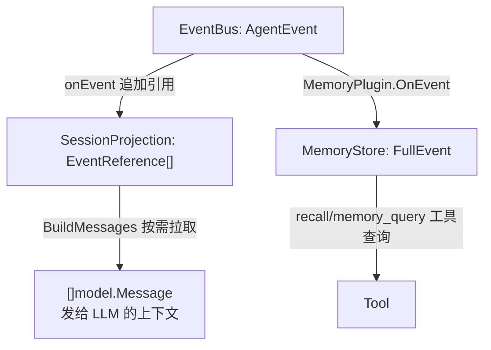
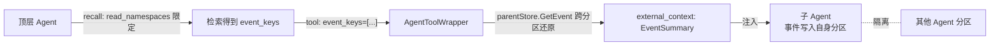
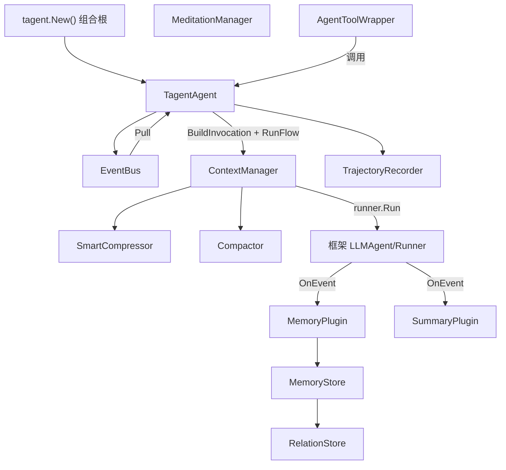
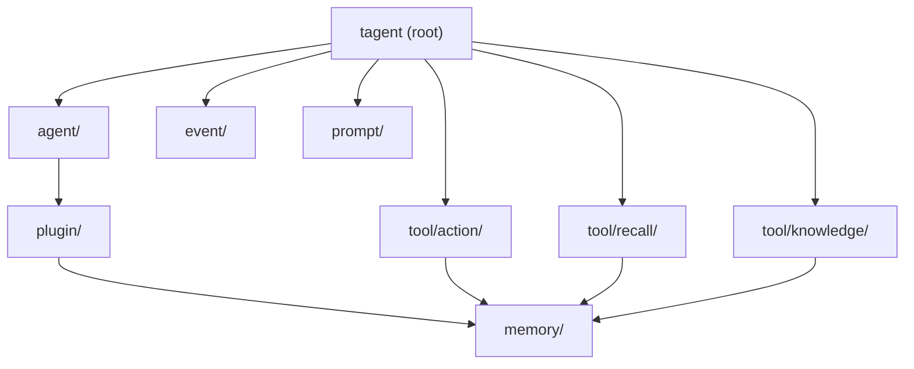
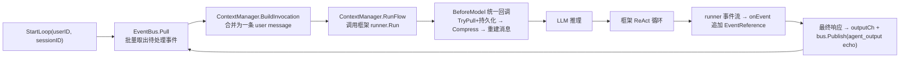
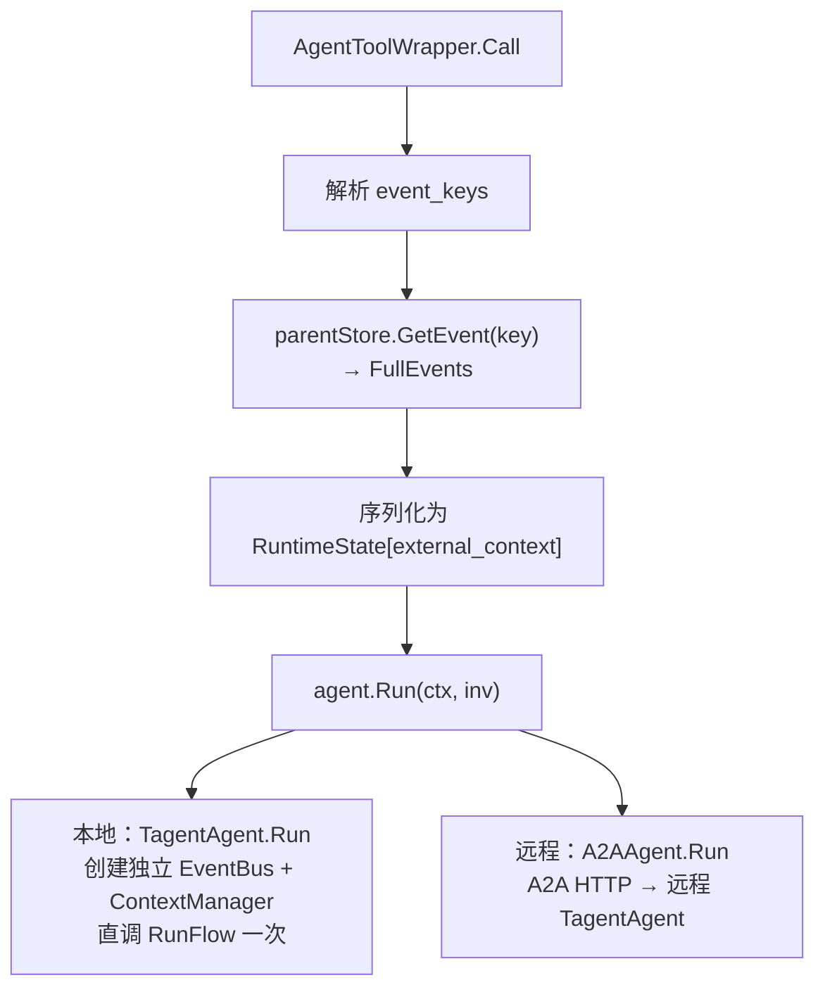
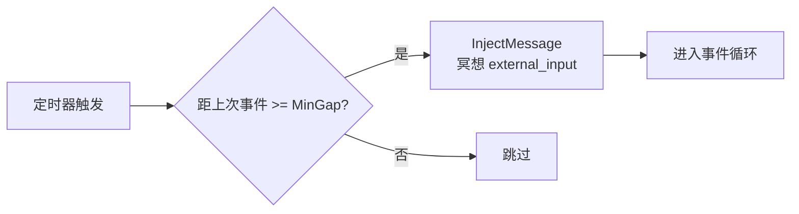
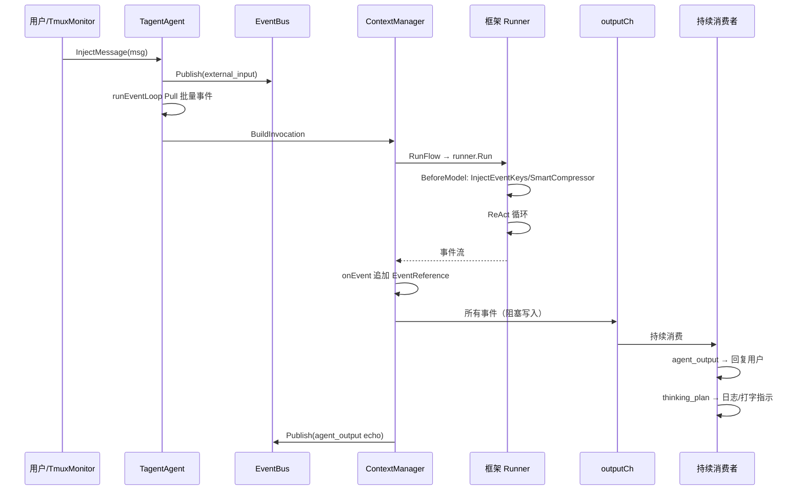
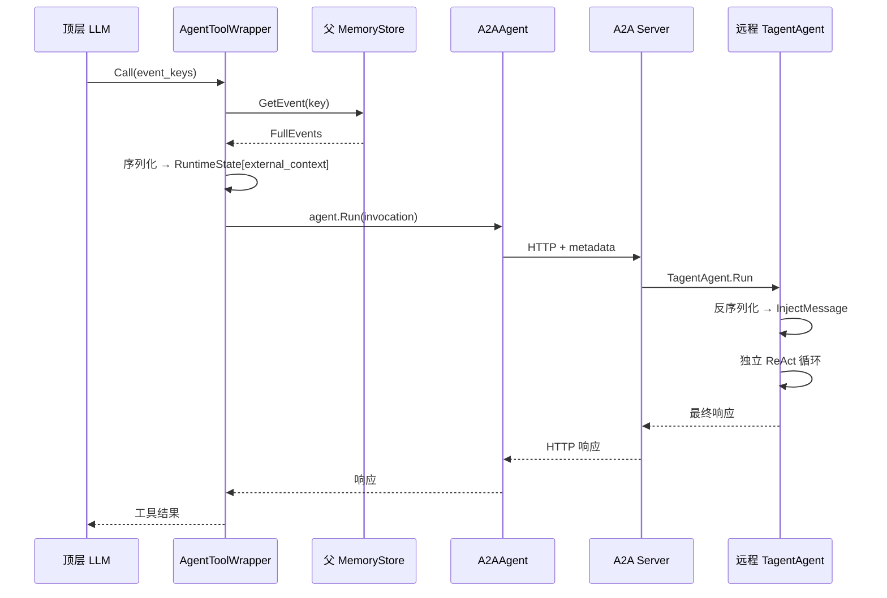
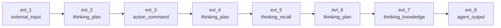

# tagent

一个基于 Go 的 Agent 框架，构建于 [trpc-agent-go](https://github.com/trpc-group/trpc-agent-go) 之上，采用事件驱动、记忆中心的设计理念。

[English](README_EN.md)

## 概览

tagent 构建于 [trpc-agent-go](https://github.com/trpc-group/trpc-agent-go) 之上，用**事件驱动执行引擎**（EventBus + `runEventLoop` + ContextManager）替代同步 React Loop，并通过框架扩展点（Plugin.OnEvent、BeforeModel 回调）注入差异化能力：上下文压缩、事件持久化、因果记忆。

当前支持以下运行模式：
- **持久事件循环**：通过 `StartLoop`/`InjectMessage`/`StopLoop` 持续接收并处理事件
- **子 Agent 调用**：本地通过 `AgentToolWrapper`，远程通过 A2A 协议
- **RL rollout worker**：通过 HTTPAPI 与 AReaL 集成，重定向 LLM 请求以捕获训练数据

## 设计哲学

tagent 采用**事件驱动、记忆中心**的设计理念，核心哲学是：**inputs 是 event flow 的投影，event bus 承载 event flow，inputs 满则触发 Compact 和 memory 持久化**。

### 三个不变量

| 不变量 | 含义 | 代码体现 |
|--------|------|---------|
| **① inputs 是投影** | 有界工作内存，读写同一份数据 | `onEvent` 追加到 `SessionProjection`，`ContextManager.BuildMessages` 读取同一份 `EventReference[]` |
| **② Compact 修改投影** | 不修改事件流（bus）也不修改永久存储 | `Compactor.Compact` 替换 `SessionProjection` 中的旧引用为 summary reference |
| **③ 工具结果回写 bus** | 不直接操作 inputs | 框架 Runner 执行工具后产生的事件经 `RunFlow` 回调回到 `SessionProjection` |

### 与 trpc-agent-go 的关系

tagent 构建于 [trpc-agent-go](https://github.com/trpc-group/trpc-agent-go) 之上，复用框架的接口原语（Agent、Model、Tool、Plugin、Session、Event、Invocation）和 ReAct 执行能力。tagent 的扩展层包括：EventBus、`runEventLoop`、SessionProjection、MemoryPlugin、SummaryPlugin、ContextManager（含 SmartCompressor/Compactor）、AgentToolWrapper、MeditationManager 和 TrajectoryRecorder。

## 核心概念

### 记忆即大脑

tagent 采用**记忆驱动、事件解耦**的执行模式。三层数据表示各司其职：

| 层 | 位置 | 职责 | 生命周期 |
|-----|------|------|----------|
| **EventBus AgentEvent** | Agent 内存 | 事件触发队列 | Publish → Pull 后丢弃 |
| **SessionProjection EventReference[]** | Agent 内存 | 投影（有界工作内存） | Agent 存活期间，可被 Compactor 清理 |
| **MemoryStore FullEvent** | 内存/文件/DB | 永久存储（不可变事件内容） | 永久 |



**关键约束**：
- `SessionProjection` 只保存轻量 `EventReference`（key + type + summary），不保存完整内容
- 完整事件内容由框架 Runner 通过 `MemoryPlugin.OnEvent` 持久化到 `MemoryStore`
- `SmartCompressor` 只修改发往 LLM 的 `[]model.Message`，不修改 `SessionProjection`
- `Compactor` 只清理 `SessionProjection` 中的旧引用，不删除 `MemoryStore`
- `MemoryStore` 是唯一完整事件链，Agent 和 Tool 通过 `EventKey` 按需访问

### 记忆分区与跨 Agent 编排

`MemoryStore` 内部按 **PartitionID** 分区，PartitionID 由 **Agent 名**派生（`PartitionIDFromName(agentName)`）。每个 Agent（主 Agent 与各子 Agent）的事件写入各自分区，实现 **Agent 间记忆隔离**。

记忆层提供**两条语义不同的读路径**：

| 读路径 | 入口 | 作用域 | 用途 |
|--------|------|--------|------|
| **按条件查询** | RecallAgent 子工具（`recall_query`/`recall_recent`） | 受 `read_namespaces` 限定的分区集合 | 语义检索、最近事件、因果链回溯 |
| **按 Key 直读** | `parentStore.GetEvent(key)` | **全库、跨分区**（Key 内含 PartitionID） | 顶层已持有 event_key 时还原完整事件 |

基于这两条路径，子 Agent 的记忆遵循「**子写、顶读、顶编排**」模式：



**关键约束**：
- 子 Agent **无跨调用记忆**：每次 `Run()` 用全新 `SessionProjection`，turn 结束即弃。历史由**顶层召回并工程化还原**为 `external_context` 显式喂入，而非子 Agent 自行累积。
- **隔离是 opt-in**：`resolvePartitions` 在查询未指定分区时回退为**全部分区**。因此 RecallAgent 必须显式配置 `read_namespaces` 才形成隔离边界；未配置则查全库。
- 顶层通过 `GetEvent(key)` 的跨分区读**不受 `read_namespaces` 限制**——它是按 Key 精确还原，与「按条件查询」的作用域是两套机制。

### 事件分类

每次交互——包括工具调用和内部规划——都会被框架 Runner 产生为一个 `event.Event`，经插件处理后转为持久化事件：

| 类别 | 事件类型 | 触发条件 | 存入 Projection? |
|------|---------|---------|-----------------|
| **外部** | `external_input` | 用户消息、API 调用、TmuxMonitor 回调、冥想事件 | 是 |
| **外部** | `external_input` (Source=`tool_result`) | 工具执行结果经 RunFlow 桥接到 EventBus | 否（不触发模型调用） |
| **外部** | `external_input` (Source=`error`) | RunFlow 重试耗尽后发布错误事件 | 否（不触发模型调用） |
| **外部** | `agent_output` | Agent 最终响应（无 tool_calls） | 是（作为 echo 回写 bus 时标记 source） |
| **动作** | `action_command` | 工具/命令执行结果 | 是 |
| **思考** | `thinking_plan` | 带 tool_calls 的 assistant 消息 | 是 |
| **思考** | `thinking_recall` | RecallAgent 输出 | 是 |
| **思考** | `thinking_knowledge` | KnowledgeAgent 输出 | 是 |
| **内部** | `context_compress` | SmartCompressor/Compactor 压缩后的摘要标记 | 否（仅 LLM 视图/投影摘要） |

## 架构

### 模块总览



### 核心模块

| 模块 | 职责 |
|------|------|
| `agent/` | 事件驱动引擎：`EventBus`、`runEventLoop`、`ContextManager`、`SmartCompressor`、`Compactor`、`AgentToolWrapper`、`MeditationManager`（已拆分为7个文件） |
| `rl/` | RL 集成：`TrajectoryRecorder`、`SwappableModel`、`HTTPAPI`（`AgentLoop` 接口解耦） |
| `memory/` | 结构化事件存储：`InMemoryStore`、`FileSegmentStore`（L0-L3 分层）、`RelationStore`、内存级 `Compactor`、生命周期管理 |
| `plugin/` | 框架插件：`MemoryPlugin`（事件持久化 + 因果链 + StateDelta）、`SummaryPlugin`（事件 Tag 注入） |
| `tool/` | 可调用工具：`ActionTool`（shell/tmux 执行 + TmuxMonitor）、`RecallAgent` 子工具、`KnowledgeAgent` 子工具、文件操作工具封装 |
| `event/` | 事件类型系统：`ExtractEventType`、`GenerateEventSummary`、严格不截断策略 |
| `prompt/` | Prompt 模板加载器：单文件、目录、组合、bootstrap 风格 |
| `config.go` | 声明式配置：`Config`、`AgentConfig`、`ToolRef`、`MemoryConfig`、`MeditationConfig` |
| `registry.go` | `ToolRegistry`：统一工具注册/查询/校验 |
| `tagent.go` | 组合根：`tagent.New(cfg, opts...)` 组装完整 Agent |
| `builtin.go` | 内置 plain tool 工厂函数（`actionFactory`） |

### 模块依赖关系



所有依赖均为单向，无循环依赖。

## 核心机制

### 1. 持久事件循环

tagent 的核心运行时模型。Agent 作为持久化实体持续接收事件，批量处理，然后等待下一批。



关键设计：
- `runEventLoop` 是单一消费者，批量拉取事件后合并为一条消息
- 实际 ReAct 循环由框架 `runner.Run` 执行，tagent 通过 `ContextManager` 编排
- BeforeModel 统一回调：TryPull 新事件 → 即时持久化到 MemoryStore + Projection → Compress → 提取当前轮次 → 重建消息列表
- `RunFlow` 失败后指数退避重试（100ms → 200ms → 400ms，最多 3 次），重试耗尽后发布 `Source="error"` 事件到 EventBus
- `BuildInvocation` 跳过 `Source="error"` 和 `Source="tool_result"` 事件，不触发模型调用
- 框架产生的事件经 `onEvent` 回调追加到 `SessionProjection`
- 最终响应会 echo 回 EventBus（source=`agent_output`），避免重复触发模型调用

### 2. 上下文压缩与投影清理

tagent 有两个独立的上下文管理操作：

**SmartCompressor（压缩 LLM 视图）**：当 token 估算超过 `MaxTokens * CompressThreshold` 时触发：
- **阶段一**：按任务边界（agent_output）切分为 `TaskSegment`，丢弃旧段，保留最近 N 段（`KeepRecentTasks`，默认 2）；`protectPendingAsyncSegments` 保护含 `{status:running}` 的未完成异步工具结果不被丢弃
- **阶段二**：如配置了 `SummaryModel`，对丢弃的段生成批量 LLM 摘要
- **压缩事件清单**：`buildCompressEvent` 从被丢弃消息的 `[evt_KEY|type]` 前缀提取每个事件的 key + type + summary，LLM 据此按需 recall 检索完整内容
- **执行状态提取**：`extractExecutionState` 提取工具调用/结果精简行（截断参数可配置，支持 `[system] tmux` 异步结果）
- **作用对象**：`[]model.Message`，不修改 `SessionProjection` 和 `MemoryStore`（纯视图变换）

**Compactor（清理 Session 投影）**：当 SmartCompressor 压缩后 token 仍超过 `MaxTokens` 时触发：
- **清理策略**：按任务边界切分 `SessionProjection`，保留最近 N 个完整任务的 `EventReference`，旧引用替换为一条 `context_compress` summary reference
- **作用对象**：`SessionProjection`，不修改 `MemoryStore`

| 操作 | 作用对象 | 触发条件 |
|------|---------|---------|
| SmartCompressor | `[]model.Message`（LLM 视图） | token > threshold |
| Compactor | `SessionProjection` | SmartCompressor 后仍超限 |

**三者可变性**：messages（SmartCompressor 可修改）、SessionProjection（Compactor 可清理）、MemoryStore（永不可变）。

### 3. 事件驱动记忆

框架 Runner 在每次产生事件时调用已注册插件：

1. **MemoryPlugin**：
   - 从 `Invocation.AgentName` 派生 `PartitionID`
   - 生成 Snowflake `EventKey`
   - 推断 `event_type` 和 `event_summary`（`action_command` 类型格式化为 `"调用工具: name(args)"`）
   - 持久化 `FullEvent` 到 `MemoryStore`
   - 通过 `RelationStore.SetParent` 维护因果链
   - 将 `event_key`、`partition_id`、`event_type`、`event_summary` 写入 `Event.StateDelta`

2. **SummaryPlugin**：
   - 从消息中提取事件类型
   - 生成摘要并写入 `Event.Tag`

3. **onEvent 回调**（`TagentAgent.makeOnEventCallback`）：
   - 从 `StateDelta` 读取 `event_key`、`event_type`、`event_summary` 等信息
   - 构建 `EventReference`（含 MemoryPlugin 生成的摘要）追加到 `SessionProjection`

### Event 与 Message 的统一关系

tagent 通过单一 BeforeModel 回调统一了 event 和 message 的关系（Projection-first 设计）：

1. **TryPull + 即时持久化**：从 EventBus 非阻塞拉取新事件（如 ReAct 迭代间到达的用户消息、异步工具结果），立即持久化到 MemoryStore 并追加到 Projection
2. **Projection 解析**：从 `SessionProjection` 读取全部 `EventReference[]`，经 `ContextCompressor` 解析为带 `[evt_KEY|type]` 前缀的历史消息（超预算时触发 SmartCompressor 压缩）
3. **当前轮次提取**：从框架 `args.Request.Messages` 中提取当前 ReAct 迭代产生的 assistant/tool 消息（尚未 emit 到 Projection）
4. **消息重建**：`args.Request.Messages = [system] + 历史(from Projection) + 当前轮次`

**设计关键**：Projection 是唯一时间线权威。不存在 content-based 对账——历史消息通过 EventKey 精确标识，当前轮次消息通过 `[evt_]` 前缀有无区分。

LLM 在每次调用时都看到带 `[evt_KEY|type]` 前缀的 messages，可将其传递给子 Agent 用于上下文获取。

### 4. 子 Agent 调用（AgentToolWrapper + A2A）

`AgentToolWrapper` 将任意 `agent.Agent` 接口（本地 `TagentAgent` 或远程 `a2aagent.A2AAgent`）包装为可调用工具。

调用流程：



- 远程路径通过 `WithTransferStateKey("external_context")` 自动将 `RuntimeState` 映射为 A2A 消息元数据
- 子 Agent 只接收 `EventSummary` 构成的紧凑外部上下文；如需完整内容，可通过自身的 memory 工具查询
- 子 Agent `Run()` 创建独立的 EventBus + `SessionProjection` + ContextManager（并发隔离），**直接调用一次 `RunFlow`** 执行一个完整 turn
- **Turn 边界即 `RunFlow` 的自然返回**：`RunFlow` 内部跑完完整 ReAct 工具循环（多轮）直到最终 assistant 响应才返回，随后关闭输出 channel。子 Agent 与顶层持久循环共享同一个 turn 原语 `RunFlow`，区别仅在于顶层是 `for { Pull; RunFlow }` 反应式守护，子 Agent 是单次直调
- 调用前先将驱动请求 `persistBusEvent` 写入 `SessionProjection`，使其成为时间线首条（紧跟 system），避免被后续累积的 ReAct 历史挤到末尾

### 5. 冥想心跳机制

`MeditationManager` 在 Agent 空闲时定期注入"冥想"事件（`external_input`），触发上下文清理、深度分析等活动。

有效性规则：如果距最后一次事件不足 `MinGap`（默认 2h），本次冥想跳过。



配置示例：
```yaml
agents:
  tagent:
    meditation:
      enabled: true
      interval: "30m"
      min_gap: "2h"
      prompt_file: "meditation.md"
```

### 6. 异步任务层（长命令 / 服务）

`action`（tmux）等长耗时工具接入统一的**任务层**，让长命令不再阻塞事件循环：

- **自适应轮询 + 同步/异步自然统一**：monitor 按任务年龄自适应轮询——**dense 阶段**（默认 1s，覆盖前 ~10s）密集探测让短命令快速被检测，之后**几何退避**（×2 至上限 60s）稀疏轮询长运行/服务型任务。探测器在 dense→sparse 边界发出 **detach** 信号,这一边界即"同步→异步"的 ack 点：dense 阶段内结算 → **内联返回**（短命令体验如常）；越过 dense → 返回"已在后台运行"的 **ack**。无独立 `sync_wait` 旋钮——一套调度同时决定探测节奏与同步/异步边界。阻塞时长 = `min(dense 阶段, 真实响应)`；并行多任务各等各的窗口（取最慢者,不累加）。调度可经 `MonitorConfig`（`dense_interval`/`dense_duration`/`backoff_factor`/`max_interval`）配置。
- **settle 三档**：探测器只做确定性分类 `completed`（进程退出）/ `stable`（输出稳定仍存活）/ `suspect`（长时间无输出，疑似假死），"是否真完成"的语义判断交给 LLM。
- **task_settled 回收 turn**：后台任务结算后发一条自包含事件到事件总线；持久循环空闲则唤醒、进行中则排队（不打断），把结果作为新 turn 交给 LLM。
- **服务型 alive-detached**：首次 `stable` 发一次"就绪"通知后转常驻存活态，后续输出变化不再刷屏，仅 `cancel`/进程死亡结束。
- **实时任务看板**：每轮 `BeforeModel` 从注册表重渲染当前进行中任务，置于当前输入前；不入历史、不参与压缩；终态任务自动 age-out。
- **LLM 任务工具**：`list_tasks` / `get_task_result(id)` / `cancel_task(id)` / `relaunch_task(id)`（即时同步返回；大结果在通知里截断、按需拉全量）。
- **会话回收**：命令进程真正结束（completed/error）后自动 kill 其 tmux 会话，避免长程运行累积死会话。

任务工具为内建可选工具，需在 agent 的 `tools` 中显式引用方可挂载。

## 关键场景

### 场景一：持久事件循环（长时运行）

应用侧通过**持续消费** outputCh 接收 Agent 的所有事件，按事件类型分发处理：



**消费模式**：应用侧在 `StartLoop` 后启动持续消费 goroutine，持续读取 outputCh 直到 `StopLoop` 关闭。消费者作为**单一决策点**，从事件 `StateDelta` 中提取 `trigger_source` 和 `meta_chat_id`，按触发源路由响应：
- `trigger_source=user` 或 `async_result`：提取 `meta_chat_id`，调用 `bot.SendTextToUser(chatID, content)` 发送响应
- `trigger_source=meditation` 或 `error`：仅记录日志，不发送给用户
- 长文本（>2000 字符）使用 `SendLongText` 或截断后发送

这种设计确保多用户并发消息不会串线，异步命令结果能正确路由到原始用户。

### 场景二：子 Agent 与 A2A 远程通信



## 场景演练

任务："查看最近的 Git 提交，总结变更内容，并搜索相关设计文档"

| 步骤 | 模块 | 动作 | 事件类型 | MemoryStore 操作 |
|------|------|------|---------|-----------------|
| 1 | 用户 → `TagentAgent` | `InjectMessage` | — | — |
| 2 | `runEventLoop` | `EventBus.Pull` → `BuildInvocation` | — | — |
| 3 | `ContextManager` → 框架 Runner | `runner.Run` 持久化用户消息 | `external_input` | 存储 FullEvent |
| 4 | 框架 Runner → LLM | LLM 决定调用 `action` | `thinking_plan` | 存储 assistant 消息 |
| 5 | 框架 Runner | 执行工具，持久化结果 | `action_command` | 存储工具结果 |
| 6 | 框架 Runner → LLM | LLM 决定调用 `recall` | `thinking_plan` | 存储 assistant 消息 |
| 7 | `AgentToolWrapper` | 解析 event_keys → 取 FullEvents → 序列化 | — | 读取 |
| 8 | RecallAgent | `Run()` → 独立事件循环 → 返回摘要 | `thinking_recall` | 子 Agent 存储 |
| 9 | `ContextManager` BeforeModel | Token 超限 → SmartCompressor → 仍超限则 Compactor | `context_compress`（视图/投影） | 无变化 |
| 10 | 框架 Runner → LLM | 生成最终响应 | `agent_output` | 存储 |
| 11 | `ContextManager.RunFlow` | final response → outputCh + bus.Publish | — | — |
| 12 | `runEventLoop` | 回到 `Pull` | — | — |

### 事件链（因果关系）



`context_compress` 是视图/投影操作，不进入 MemoryStore 因果链。

### 各模块视角

| 模块 | 能看到什么 | 看不到什么 |
|------|-----------|-----------|
| LLM | 带 `[evt_KEY\|type]` 前缀的事件摘要；压缩后的上下文 | 被丢弃旧段的完整内容 |
| ActionTool | 来自 LLM 的命令字符串 | 为什么选这个命令 |
| RecallAgent | 外部上下文摘要；自己的 ReAct 循环 | 父 Agent 的完整 Session |
| MemoryStore | 一切：所有 FullEvent、因果链 | — |
| SessionProjection | 轻量 `EventReference[]` | FullEvent 内容 |
| outputCh 消费者 | 所有事件（thinking_plan、action_command、agent_output）；按类型分发处理 | MemoryStore 内部结构 |

## 快速开始

### 1. 定义配置（YAML）

```yaml
entry: tagent
prompt_dir: resources/prompts
model: glm-4-flash
providers:
  openai:
    api_endpoint: "https://open.bigmodel.cn/api/paas/v4"
    api_key_env: "ZAI_API_KEY"

agents:
  tagent:
    system_prompt:
      files: [AGENTS.md, SOUL.md, USER.md, TOOLS.md]
    memory:
      type: localfile
      path: /data/tagent/events
    tools:
      - agent: knowledge
        description_file: knowledge_tool_desc.md
        event_params: [event_keys]
      - agent: recall
        description_file: recall_tool_desc.md
        event_params: [event_keys]
      - kind: tool
        id: exec
        description_file: action_tool_desc.md

  knowledge:
    model: glm-4-flash
    system_prompt:
      files: [knowledge_agent.md]
    memory:
      type: memory
    max_tool_iterations: 10

  recall:
    model: glm-4-flash
    system_prompt:
      files: [recall_agent.md]
    memory:
      type: memory
    max_tool_iterations: 10
```

### 2. 持久事件循环模式

```go
ta, err := tagent.New(cfg, tagent.WithModel(model))
if err != nil { panic(err) }
defer ta.Close()

outputCh, err := ta.StartLoop("userID", "sessionID")
if err != nil { panic(err) }

ta.InjectMessage(model.Message{
    Role:    model.RoleUser,
    Content: "帮我执行一个命令",
})

for evt := range outputCh {
    if evt.IsFinalResponse() {
        println("Final:", evt.Message.Content)
    }
}

ta.StopLoop()
```

### 3. A2A 服务端模式

```go
srv, err := agent.NewA2AServer(ta, "0.0.0.0:8088")
if err != nil { panic(err) }
go srv.Start("0.0.0.0:8088")
```

### 4. HTTPAPI（RL/AReaL 集成）

```go
httpAPI := agent.NewHTTPAPI(ta)
httpAPI.SetModelUpdateFn(func(baseURL string) {
    swappableModel.Swap(newModelForBaseURL(baseURL))
})
go http.ListenAndServe(":8089", httpAPI)
```

## 示例：WeChat Bot

源码位置：[`examples/wechat-bot/`](examples/wechat-bot/)

WeChat Bot 展示了持久事件循环、子 Agent 调用、上下文压缩、轨迹记录和可观测性。

```bash
cd examples/wechat-bot
export ZAI_API_KEY=your_api_key
./run.sh
```

### 轨迹记录（TrajectoryRecorder）

当 `trajectory_dump: true` 时，tagent 用 `TrajectoryRecorder` 包装 LLM model，异步将每次 LLM 调用记录为 JSONL 文件：

```
tagent → TrajectoryRecorder → LLM → data/trajectories/{session}.jsonl
```

离线转换脚本：
```bash
python3 train/rl/convert_trajectories.py --input data/trajectories/ --output data/sft/ --mode sft
python3 train/rl/convert_trajectories.py --input data/trajectories/ --output data/rl/ --mode rl
```

### 可观测性

| 端点/功能 | 说明 |
|----------|------|
| `GET /healthz` | 健康检查（返回 `loop_active`） |
| `POST /task` | 提交任务到持久事件循环 |
| `OTEL_EXPORTER_OTLP_ENDPOINT` | OTLP 追踪导出（可选） |
| `LOG_LEVEL=debug` | Debug 日志 |

## 配置参考

### 全局选项

| 选项 | 默认值 | 说明 |
|------|--------|------|
| `entry` | `tagent` | 入口 Agent 名称 |
| `prompt_dir` | `resources/prompts` | 全局 prompt 目录 |
| `model` | （必填） | 默认模型名称 |
| `provider` | `openai` | 默认 provider |
| `providers` | `{}` | provider 连接信息 |
| `api_endpoint` | `""` | LLM API base URL |
| `api_key_env` | `ZAI_API_KEY` | API key 环境变量 |
| `log_level` | `info` | 日志级别 |
| `request_timeout_seconds` | `3600` | 请求超时 |
| `trajectory_dump` | `false` | 启用轨迹记录 |
| `trajectory_dir` | `data/trajectories` | 轨迹文件目录 |

### Agent 级选项

| 选项 | 默认值 | 说明 |
|------|--------|------|
| `model` | （继承全局） | LLM 模型名称 |
| `provider` | （继承全局） | provider 名称 |
| `system_prompt.files` | `[]` | 加载的 prompt 文件 |
| `memory.type` | `memory` | `memory`/`file`/`localfile` |
| `memory.path` | `""` | 存储路径/标识 |
| `memory.read_namespaces` | `[]` | 可读取的其他 agent 分区 |
| `max_tool_iterations` | 入口 50 / 子 10 | 最大 ReAct 迭代次数 |
| `max_tokens` | 入口 8000 / 子 4096 | 上下文 token 预算 |
| `compress_threshold` | `0.8` | 压缩触发比例 |
| `keep_recent_tasks` | `2` | 压缩保留的最近任务数 |
| `temperature` | 入口 0.7 / 子 0.3 | LLM 温度 |
| `meditation.enabled` | `false` | 启用冥想 |
| `meditation.interval` | `30m` | 冥想检查间隔 |
| `meditation.min_gap` | `2h` | 最小空闲间隔 |
| `meditation.prompt_file` | `meditation.md` | 冥想 prompt 文件 |

### 工具引用选项

| 字段 | 说明 |
|------|------|
| `kind` | `agent`（默认）或 `tool` |
| `agent` | 子 Agent 名称（`kind: agent`） |
| `id` | 工具 ID（`kind: tool`） |
| `description_file` | 工具描述 prompt 文件 |
| `event_params` | 事件相关参数，如 `[event_keys]` |
| `remote.url` | 远程 A2A Agent URL |
| `properties` | 工具专属配置 |

### exec (ActionTool) Properties

`exec`（ActionTool，对外暴露名称为 `action`）支持以下 `properties`：

| 字段 | 类型 | 说明 |
|------|------|------|
| `work_dir` | string | 默认工作目录 |
| `run_as_user` | string | `sudo -u` 执行用户 |
| `run_as_group` | string | `sudo -g` 执行用户组 |

```yaml
tools:
  - kind: tool
    id: exec
    properties:
      work_dir: /tmp/tagent-workspace
      run_as_user: tagent-runner
```

## 项目结构

```
tagent/
├── agent/          # 核心：EventBus, runEventLoop, ContextManager, SmartCompressor, Compactor, AgentToolWrapper, MeditationManager（已拆分为7个文件）
├── rl/             # RL 集成：TrajectoryRecorder, SwappableModel, HTTPAPI（AgentLoop 接口）
├── builtin.go      # 内置 plain tool 工厂
├── config.go       # 声明式配置
├── registry.go     # ToolRegistry
├── docs/wiki/      # 架构文档
├── event/          # 事件类型与摘要
├── examples/       # 示例（wechat-bot）
├── memory/         # 存储：InMemoryStore, FileSegmentStore, RelationStore 等
├── openspec/       # 设计规格
├── plugin/         # 插件：MemoryPlugin, SummaryPlugin
├── prompt/         # Prompt 加载器
├── prototype/      # 原型实现（agent.go）
├── resources/      # Prompt 文件
├── tagent.go       # 组合根
├── testutil/       # 测试工具
├── tool/           # 工具实现
└── go.mod
```

## 开发

```bash
# 构建
go build ./...

# 测试
go test ./...

# 运行示例
cd examples/wechat-bot && go run .
```

### 前置条件

- Go 1.21+

## License

Apache License 2.0
