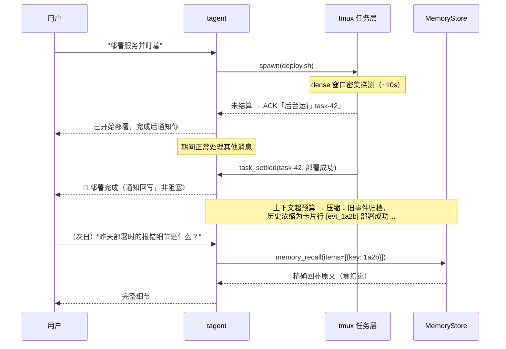
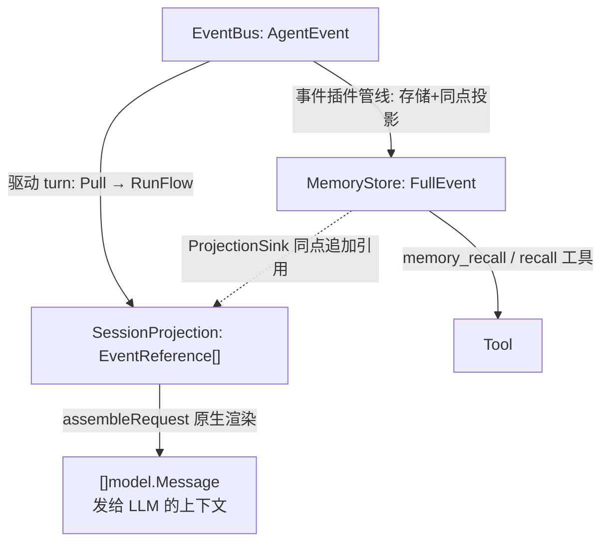
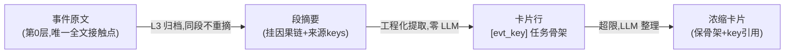
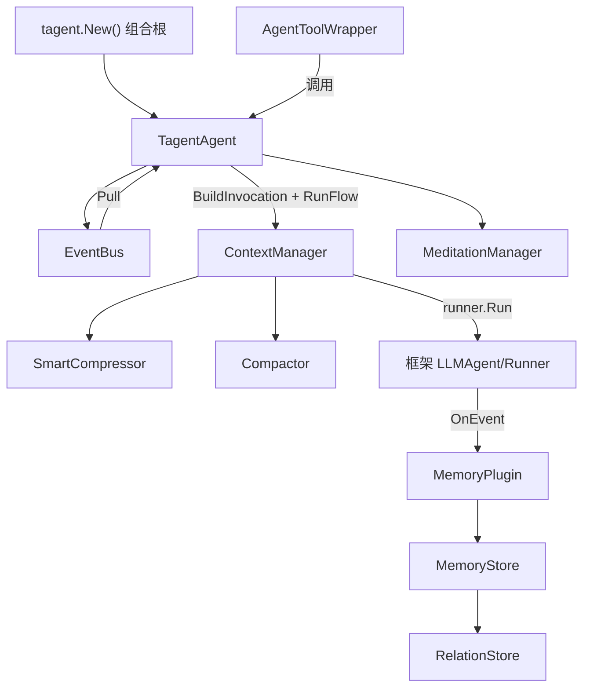

# tagent

**记忆驱动的长期运行 Agent 框架** —— 基于 [trpc-agent-go](https://github.com/trpc-group/trpc-agent-go)，用事件驱动引擎替代同步 ReAct 循环：事件永久入库、上下文按需压缩、历史随时召回，让 Agent 可以**连续运行数天而不失忆、不失控**。

[English](README_EN.md) | 中文

---

## ✨ 特性一览

| 特性 | 一句话说明 |
|------|-----------|
| 🔄 **持久事件循环** | `StartLoop` 后常驻运行；消息、工具结果、定时事件统一经 EventBus 驱动 turn |
| 🧠 **记忆三原语** | store（事件不可变入库）/ compress（总结+自然遗忘）/ recall（票据或语义召回） |
| 🗂 **卡片序列** | 压缩后的历史浓缩为索引卡片行——模型始终"看得见做过什么"，每张卡自带召回票据 |
| ⚡ **异步任务层** | 长命令/服务经 tmux 后台运行：快命令内联返回，慢任务 ACK + `task_settled` 通知回写 |
| 🔁 **任务重入** | `resume_task` 对存活服务续输入（REPL 式）、对完成的子 Agent 续指令（自动还原上下文） |
| 🤖 **子 Agent 编排** | 本地 `AgentToolWrapper` / 远程 A2A 协议统一封装；事件跨 Agent 按 key 精确传递 |
| 🧘 **冥想心跳** | 空闲期自动回顾与沉淀，产出 ★ 高亮卡片进入长期记忆 |
| 🎓 **RL 集成** | HTTPAPI + SwappableModel + TrajectoryRecorder，与 AReaL 对接采集训练轨迹 |

## 🎬 一个长期运行的日常



## 🚀 快速开始

**1. 声明式配置（YAML）**

```yaml
entry: tagent
prompt_dir: resources/prompts
model: glm-4-flash
providers:
  openai:
    api_endpoint: "https://open.bigmodel.cn/api/paas/v4"
    api_key_env: "ZAI_API_KEY"

agents:
  tagent:
    system_prompt:
      files: [AGENTS.md, SOUL.md, TOOLS.md]
    memory:
      type: localfile
      path: /data/tagent/events
    tools:
      - agent: recall            # 子 Agent 工具：复杂记忆检索
        description_file: recall_tool_desc.md
        event_params: [event_keys]
      - kind: tool
        id: memory_recall        # 纯函数工具：票据/关键词召回
      - kind: tool
        id: exec                 # tmux 命令执行（异步任务层）
        description_file: action_tool_desc.md

  recall:
    system_prompt:
      files: [recall_agent.md]
    memory:
      type: memory
    max_tool_iterations: 10
```

**2. 三行进入持久循环（Go）**

```go
ta, _ := tagent.New(cfg, tagent.WithModel(model))
defer ta.Close()

outputCh, _ := ta.StartLoop("userID", "sessionID")
ta.InjectMessage(model.Message{Role: model.RoleUser, Content: "帮我执行一个命令"})

for evt := range outputCh {
    if evt.IsFinalResponse() {
        println("Final:", evt.Message.Content)
    }
}
```

**3. 跑通完整示例**

```bash
cd examples/wechat-bot && go run .    # 微信机器人：持久循环+全部机制实战
```

其他运行模式：A2A 服务端（`agent.NewA2AServer`）、RL rollout worker（`agent.NewHTTPAPI` 对接 AReaL）——见 [examples/](examples/) 与 [docs/wiki/](docs/wiki/)。

## 🧠 心智模型

### 三层数据表示

| 层 | 位置 | 职责 | 生命周期 |
|-----|------|------|----------|
| **EventBus AgentEvent** | Agent 内存 | 事件触发队列 | Publish → Pull 后丢弃 |
| **SessionProjection EventReference[]** | Agent 内存 | 投影（有界工作内存） | 可被 Compactor 清理 |
| **MemoryStore FullEvent** | 内存/文件/DB | 永久存储（不可变） | 永久 |



**关键约束**：投影只存轻量引用（key+type+summary）；MemoryStore 是唯一完整事件链；压缩只改 LLM 视图与投影，永不动存储。

### 记忆三原语与固化级联



- **素材律**：第 N 层摘要只消费第 N-1 层固化物——压缩成本 O(新增)，与历史总量无关
- **卡片序列**：压缩历史的唯一表示，形如 `[Compacted N] + 卡片行 + recent keys`；冥想产出带 ★；每层降级不塌（无模型→最旧行沉底计数）
- **原文可忘，固化物长存**：固化物豁免 TTL 与容量淘汰；卡片里的 `[hex]` key 即 `memory_recall` 票据

### 事件分类与 Role 归属

| 类别 | 事件类型 | Role 归属 |
|------|---------|----------|
| 外部输入 | `external_input`（用户消息 / task_settled 通知 / 冥想） | user |
| 最终输出 | `agent_output` | assistant（恒等于 LLM 真实产出） |
| 工具执行 | `action_command` | tool（原生协议配对） |
| 思考规划 | `thinking_plan` / `thinking_recall` / `thinking_knowledge` | assistant（原生 ToolCalls） |
| 压缩标记 | `context_compress` | user 级〔历史归档〕注记 |

规则一句话：**指令类→system（恒单条恒首位）；观察类→user；assistant 恒等于 LLM 说过的话**。防伪造不靠 role，靠伪造无语义（真引用走 EventKey/StateDelta 元数据通道）。

## ⚙️ 六大机制速览

| 机制 | 亮点 | 详解 |
|------|------|------|
| 持久事件循环 | Pull 批处理；async 结果排队不打断进行中 turn | [wiki/agent](docs/wiki/agent/event-flow.md) |
| 上下文压缩 | SmartCompressor（LLM 视图，L0-L3 分级）+ Compactor（投影滚动卡片）双层；纯视图变换 | [wiki/memory](docs/wiki/memory/memory-architecture.md) |
| 事件驱动记忆 | 雪花 EventKey（hex 契约）；分区隔离 + `read_namespaces` 跨 Agent 授权 | [wiki/memory](docs/wiki/memory/memory-architecture.md) |
| 子 Agent 调用 | `event_params: [event_keys]` 按 key 传事件（数据隔离）；A2A 远程透明 | [wiki/tool](docs/wiki/tool/tool-architecture.md) |
| 异步任务层 | 自适应轮询（dense→几何退避）；settle 三档；实时任务看板；`resume_task` 重入；会话回收闭环 | [wiki/tool](docs/wiki/tool/tool-architecture.md) |
| 冥想心跳 | 空闲检测锚定最终输出；自我状态 digest；总结沉淀为 ★ 卡片 | [wiki/agent](docs/wiki/agent/agent-architecture.md) |

## 🏗 架构



| 模块 | 职责 |
|------|------|
| `agent/` | 事件驱动引擎：EventBus、runEventLoop、ContextManager、压缩、任务层、冥想 |
| `memory/` | 结构化事件存储：InMemoryStore、FileSegmentStore、RelationStore、生命周期 |
| `plugin/` | 框架插件：MemoryPlugin（持久化+因果链）、SummaryPlugin（元数据标注） |
| `tool/` | 工具：ActionTool（tmux）、recall/knowledge 子工具、任务工具族、文件工具 |
| `event/` | 事件类型系统与元数据契约（`FormatEventKey`/`ParseEventMeta`） |
| `rl/` | RL 集成：TrajectoryRecorder、SwappableModel、HTTPAPI |
| `tagent.go` + `config.go` | 组合根与声明式配置 |

依赖全部单向无循环：`root → agent → plugin → memory`，`tool/* → memory`。

## 📐 设计哲学

核心一句话：**inputs 是 event flow 的投影，event bus 承载 event flow，inputs 满则触发 Compact 和 memory 持久化**。

| 不变量 | 含义 |
|--------|------|
| ① inputs 是投影 | 有界工作内存，是 LLM 输入的唯一装配源 |
| ② 写入统一 | 事件被存储 ⇔ 被投影，恰好一次，同点原子 |
| ③ 时序是构造保证 | BeforeModel 时投影必完整，非时序碰巧 |
| ④ Compact 只修改投影 | 不动事件流，不动永久存储 |

**应答与通知（异步化分界）**：回合内=原生 tool-call 协议应答（长任务先回 ACK）；跨回合=自包含通知事件（`task_settled` 靠 task id 内容级关联）——压缩/丢失/乱序都不产生孤儿。时间线铁律：**系统永不在 assistant 历史中生成文本化调用语法**（会被模型模仿产生伪调用，实机两次踩坑后确立）。

**元数据契约**：`event/metadata.go` 单点保障——EventKey 统一 16 进制字符串形态，贯穿时间线前缀、压缩 key 清单、StateDelta 与 recall 出入参。

## 🔧 配置参考

### 全局选项

| 选项 | 默认值 | 说明 |
|------|--------|------|
| `entry` | `tagent` | 入口 Agent 名称 |
| `prompt_dir` | `resources/prompts` | 全局 prompt 目录 |
| `model` | （必填） | 默认模型名称 |
| `provider` | `openai` | 默认 provider |
| `providers` | `{}` | provider 连接信息 |
| `log_level` | `info` | 日志级别 |
| `request_timeout_seconds` | `3600` | 请求超时 |
| `trajectory_dump` | `false` | 启用轨迹记录 |
| `trajectory_dir` | `data/trajectories` | 轨迹文件目录 |

### Agent 级选项

| 选项 | 默认值 | 说明 |
|------|--------|------|
| `model` / `provider` | （继承全局） | LLM 模型与 provider |
| `system_prompt.files` | `[]` | 加载的 prompt 文件 |
| `memory.type` | `memory` | `memory`/`file`/`localfile` |
| `memory.path` | `""` | 存储路径/标识 |
| `memory.read_namespaces` | `[]` | 可读取的其他 agent 分区 |
| `max_tool_iterations` | 入口 50 / 子 10 | 最大 ReAct 迭代次数 |
| `max_tokens` | 入口 8000 / 子 4096 | 上下文 token 预算 |
| `compress_threshold` | `0.8` | 压缩触发比例 |
| `keep_recent_tasks` | `2` | 压缩保留的最近任务数 |
| `task_settled_max_inline` | `2000` | task_settled 通知内联结果上限 |
| `resume_context_rounds` | `3` | 子 Agent 重入还原的前序轮次数 |
| `temperature` | 入口 0.7 / 子 0.3 | LLM 温度 |
| `meditation.enabled` | `false` | 启用冥想（`interval`/`min_gap`/`prompt_file`） |

### compress 块（压缩家族）

| 选项 | 默认值 | 说明 |
|------|--------|------|
| `summary_model` / `summary_provider` | （继承 agent） | 压缩摘要专用模型（可用廉价模型） |
| `card_max_chars` | `6000` | 卡片序列长度上限；超限旧卡 LLM 整理或沉底 |
| `compact_keys_listed` | `32` | 滚动摘要列出的 recent keys 上限 |
| `recent_full_count` | `4` | 以全文解析的最近引用数 |
| `max_notice_chars` | `800` | 压缩通知文案上限 |
| `archive_cache_cap` | `256` | 进程内归档缓存条数（固化物本体永在 MemoryStore） |

### 工具引用（ToolRef）

| 字段 | 说明 |
|------|------|
| `kind` | `agent`（默认）或 `tool` |
| `agent` / `id` | 子 Agent 名称 / 工具 ID |
| `description_file` | 工具描述 prompt 文件 |
| `event_params` | 事件参数，如 `[event_keys]` |
| `async` | 子 Agent 是否走异步任务层（默认 true） |
| `remote.url` | 远程 A2A Agent URL |
| `properties` | 工具专属配置（exec: `workspace`/`run_as_user`/`run_as_group`） |

> agent 运行参数（`max_tool_iterations`/`max_tokens`/`temperature`）**只在被引用 agent 自身的 `agents.<name>` 定义处配置**——ToolRef 只声明引用关系。

## 📚 深入阅读

| 主题 | 文档 |
|------|------|
| 记忆架构 / 策展 / recall 协议 | [docs/wiki/memory/memory-architecture.md](docs/wiki/memory/memory-architecture.md) |
| 工具架构 / 任务重入 / 会话回收 | [docs/wiki/tool/tool-architecture.md](docs/wiki/tool/tool-architecture.md) |
| Agent 架构 / 事件流 | [docs/wiki/agent/](docs/wiki/agent/) |
| 事件系统 / 插件 / Prompt | [docs/wiki/](docs/wiki/) |
| 设计规格（OpenSpec） | [openspec/specs/](openspec/specs/) |
| 完整示例（WeChat Bot + RL） | [examples/wechat-bot/](examples/wechat-bot/) |

## 开发

```bash
go build ./...                        # 构建（Go 1.21+）
go test ./...                         # 测试
bash scripts/race_check.sh            # race 门禁
cd examples/wechat-bot && go run .    # 运行示例
```

## License

Apache License 2.0
