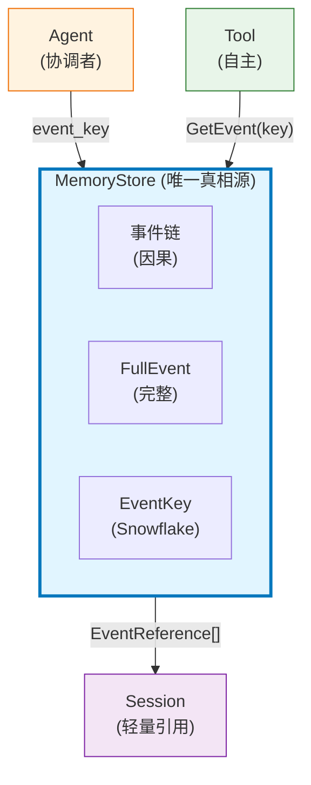
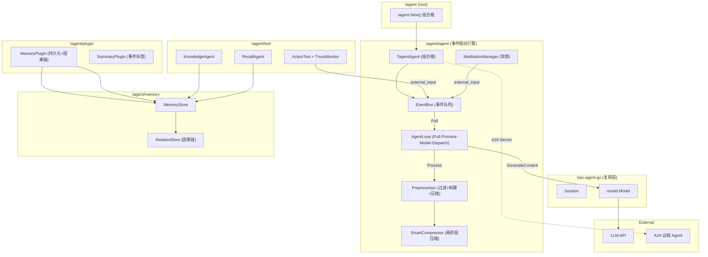
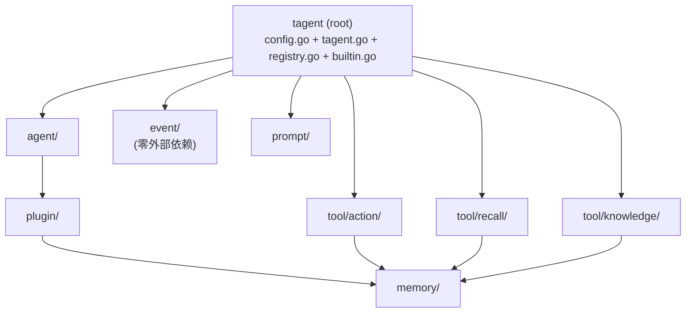
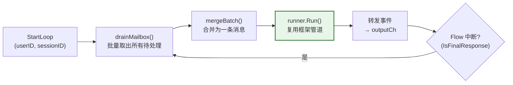
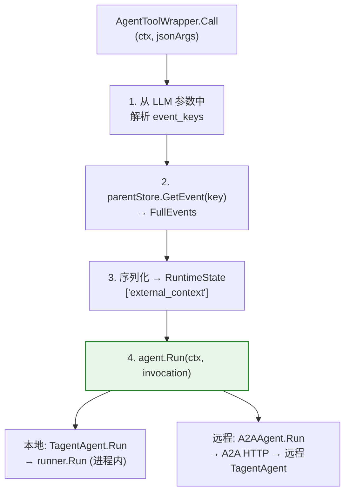
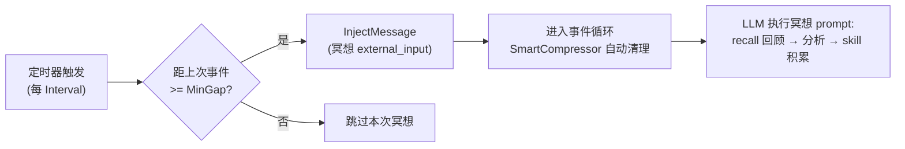
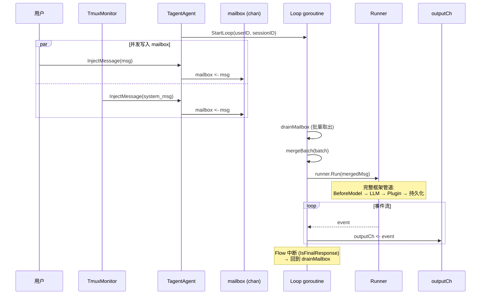
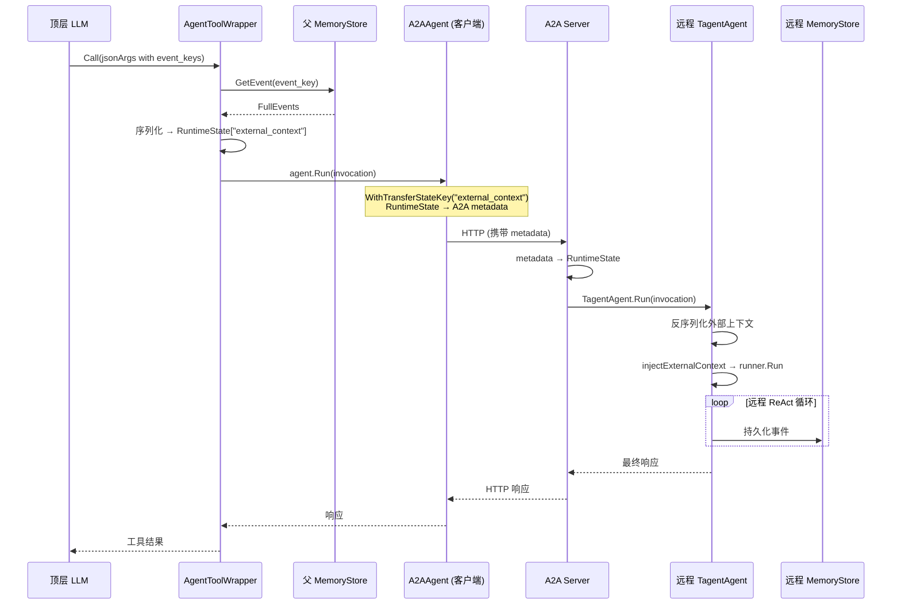
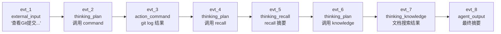

# tagent

一个基于 Go 的 Agent 框架，拥抱事件驱动、记忆中心的设计理念，构建于 [trpc-agent-go](https://github.com/trpc-group/trpc-agent-go) 之上。

[English](README_EN.md)

## 概览

tagent 不是从零开始的 Agent 框架。它构建于 [trpc-agent-go](https://github.com/trpc-group/trpc-agent-go) 之上，用**事件驱动执行引擎**（EventBus + AgentLoop + Preprocessor）替代了原框架的同步 React Loop，通过框架的扩展点（OnEvent 插件）**注入**差异化能力——上下文压缩、事件持久化、因果记忆。

最终产物是一个持久化、事件驱动的 Agent，可以以下述模式运行：
- **持久事件循环**（持续接收事件，批量处理，等待下一批）
- **A2A 服务端**（通过 A2A 协议暴露给远程 Agent 调用）
- **RL rollout worker**（与 AReaL 集成，支持 PPO 在线训练）

## 设计哲学

| 原则 | 含义 |
|------|------|
| **事件驱动** | 所有输入统一为 EventBus 上的事件，工具结果以 external_input 回写，消除同步阻塞。 |
| **纯引擎无业务** | AgentLoop 不包含业务语义，所有领域决策在 Preprocessor 中完成。 |
| **复用框架原语** | 保留 trpc-agent-go 的 model/tool/event/session/plugin 基础设施，仅替换执行模型。 |
| **子 agent 隔离** | 每个子 agent 拥有独立的 EventBus 和 SmartCompressor，不共享可变状态。 |
| **异步工具分发** | 工具执行在独立 goroutine 中完成，结果以事件回写 bus。 |
| **记忆即大脑** | MemoryStore 是唯一完整事件链的组件，Agent 和 Tool 通过 EventKey 按需访问。 |

> 详细设计理念：[agent-architecture.md §1](docs/wiki/agent/agent-architecture.md)

## 核心概念

### 记忆即大脑

tagent 的核心设计哲学是**记忆驱动、事件解耦的执行模式**：

- **Agent** 协调工具并生成响应，但不持有完整的执行历史
- **工具**（子 Agent）接收 `event_key` 按需从 MemoryStore 获取上下文——它们是自主的，而非被动的
- **MemoryStore** 是唯一维护完整事件链的组件（因果关系、完整内容、时间戳）



**关键约束**：Agent 和 Tool 各自只看到自己需要的信息。只有 MemoryStore 知道全貌。

### 事件分类

每一次交互——包括压缩和工具调用等内部操作——都是一个事件：

| 类别 | 事件类型 | 触发条件 | 存入 Session? |
|------|---------|---------|--------------|
| **外部** | `external_input` | 用户消息、API 调用、TmuxMonitor 注入、**冥想事件** | 是（作为 EventReference） |
| **外部** | `agent_output` | Agent 的最终响应（无 tool_calls） | 是 |
| **动作** | `action_command` | 工具/命令执行结果 | 是 |
| **思考** | `thinking_plan` | Agent 规划（带 tool_calls 的 assistant 消息） | 是 |
| **思考** | `thinking_recall` | 通过 RecallAgent 进行记忆回溯 | 是 |
| **思考** | `thinking_knowledge` | 通过 KnowledgeAgent 进行知识检索 | 是 |
| **内部** | `context_compress` | SmartCompressor 丢弃旧段 | 否（仅视图） |

> `context_compress` 是视图转换——它修改 LLM 消息列表，但不创建 Session 事件。

### 传统 Agent vs tagent

| 维度 | 传统 Agent | tagent |
|------|-----------|--------|
| 执行模型 | 同步 React Loop（LLM→工具→LLM 阻塞循环） | 事件驱动（EventBus + AgentLoop 异步循环） |
| 工具调用 | 同步 inline 执行，阻塞主循环 | 异步 goroutine 分发，结果以事件回写 |
| 上下文传递 | 通过函数参数逐层传递 | 通过 MemoryStore + EventKey 共享 |
| Agent 视角 | 知道完整的执行流程 | 只知道当前事件 + 历史对话 |
| 工具视角 | 被动执行者，依赖 Agent 提供上下文 | 通过 `event_key` 自主访问 MemoryStore |
| 记忆角色 | 可选组件 | 核心中枢（唯一真相源） |
| 事件粒度 | 粗粒度（请求/响应） | 细粒度（每个动作/思考） |
| 上下文溢出 | 硬限制或简单截断 | 两阶段压缩（任务边界 + LLM 摘要） |
| 外部输入 | 必须等待当前轮次结束 | 随时发布到 EventBus，下一轮 Pull 即可处理 |

> 详情：[event-architecture.md](docs/wiki/event/event-architecture.md), [memory-architecture.md](docs/wiki/memory/memory-architecture.md)

## 架构

### 模块总览



### 核心模块

| 模块 | 职责 | Wiki |
|------|------|------|
| `agent/` | 核心协调：`TagentAgent`（持久循环）、`ContextIntervention`（BeforeModel 拦截器）、`SmartCompressor`（两阶段 LLM 压缩）、`ToolAgent`（子 Agent 包装器）、`MeditationManager`（冥想心跳） | [agent-architecture.md](docs/wiki/agent/agent-architecture.md) |
| `memory/` | 结构化事件存储：`InMemoryStore`、`FileSegmentStore`（L0-L3 分层）、`RelationStore`（因果链）、`Compactor`、`Tombstone`、`Lifecycle`（TTL） | [memory-architecture.md](docs/wiki/memory/memory-architecture.md) |
| `plugin/` | 框架插件：`MemoryPlugin`（事件持久化 + 因果链）、`SummaryPlugin`（事件标签注入） | [plugin-architecture.md](docs/wiki/plugin/plugin-architecture.md) |
| `tool/` | 可调用工具：`KnowledgeAgent`（RAG）、`RecallAgent`（记忆回溯）、`ActionTool`（shell/tmux 执行 + TmuxMonitor）、`file`（trpc-agent-go 内置文件操作工具封装）、`SpeakAgent`/`DrawAgent`（stub，未启用） | [tool-architecture.md](docs/wiki/tool/tool-architecture.md) |
| `event/` | 事件类型系统：类型推断（`ExtractEventType`）、摘要生成（`GenerateEventSummary`）、严格不截断策略 | [event-architecture.md](docs/wiki/event/event-architecture.md) |
| `prompt/` | Prompt 模板加载器：单文件、目录、组合、bootstrap 风格加载 | [prompt-architecture.md](docs/wiki/prompt/prompt-architecture.md) |
| `config.go` | 声明式配置：YAML/JSON 可序列化的 `Config` → `AgentConfig` → `MemoryConfig` / `ToolRef` | — |
| `registry.go` | ToolRegistry：统一工具注册/查询/校验门面。`RegisterBuiltinTools()` 注册 exec + knowledge/recall 子工具为 plain tool | — |
| `tagent.go` | 组合根：`tagent.New(cfg, opts...)` 将 Config + 运行时选项组装为完整 Agent | — |

### 模块依赖关系



所有依赖均为单向，无循环依赖。

## 核心机制

### 1. 持久事件循环

tagent 的核心运行时模型。Agent 作为一个持久化、类似操作系统进程的实体：持续接收事件（用户输入、TmuxMonitor 回调），批量处理，然后等待下一批。



关键设计：`runner.Run()` 完整复用框架管道（Session、Plugin、BeforeModel、MemoryPlugin）。Flow 在 `IsFinalResponse()` 时中断不是问题——这正是"本批处理完成，准备下一批"的正确信号。

> 详情：[agent-architecture.md §7.3](docs/wiki/agent/agent-architecture.md)

### 2. 两阶段上下文压缩

当 token 使用量超过阈值（`MaxTokens * CompressThreshold`）时，`SmartCompressor` 在 `BeforeModel` 中激活：

- **阶段一——任务边界丢弃**：按任务边界（无 tool_calls 的 assistant 消息 = 任务完成）将消息切分为 `TaskSegment`。丢弃旧段，保留最近 N 段（`KeepRecentTasks`，默认 2）。
- **阶段二——LLM 摘要**（可选）：对丢弃的段生成批量 LLM 摘要。摘要作为系统消息注入，替换原始对话历史。

多轮压缩：如果一轮不够，`KeepRecentTasks` 递减后再次压缩（最多 5 轮）。

**视图转换原则**：压缩仅修改 `args.Request.Messages`——Session 和 MemoryStore 数据绝不被触碰。

> 详情：[agent-architecture.md §4.4, §8-9](docs/wiki/agent/agent-architecture.md)

### 3. 事件驱动记忆（因果链 + EventKey）

流经 Runner 的每个事件都会被 `MemoryPlugin.OnEvent` 拦截：

1. **推断事件类型**（`external_input`、`agent_output`、`action_command` 等）
2. **生成 Snowflake EventKey**（64 位：PartitionID + Timestamp + Sequence）
3. **构建因果链**：通过 `RelationStore.SetParent`——每个事件指向其前驱
4. **持久化 FullEvent** 到 MemoryStore（不可变）
5. **写入 EventReference** 到 Session（轻量级：key + type + summary）

LLM 在消息前缀中看到事件 key（`[evt_123456|agent_output]`），使其能够将相关 key 传递给子 Agent 用于上下文获取。

> 详情：[memory-architecture.md](docs/wiki/memory/memory-architecture.md), [plugin-architecture.md](docs/wiki/plugin/plugin-architecture.md)

### 4. 子 Agent 调用（AgentToolWrapper + A2A）

`AgentToolWrapper` 将任意 `agent.Agent` 接口（本地 `TagentAgent` 或远程 `A2AAgent`）包装为可调用工具。调用流程：



**远程路径**：`WithTransferStateKey("external_context")` 自动将 RuntimeState 映射为 A2A 消息元数据，跨进程边界透明传递。

**配置分层**：

| 层级 | 职责 | 配置 |
|------|------|------|
| tagent YAML | Agent 定义（模型、prompt、工具、event_params） | 声明式 YAML |
| `ToolRef.Remote` | 连接信息（"这个 Agent 在哪里？"） | `remote.url` 字段 |
| trpc Go options | 通信细节（A2A 协议、TransferStateKey） | 由 `tagent.go` 自动生成 |

> 详情：[agent-architecture.md §13-14](docs/wiki/agent/agent-architecture.md), [tool-architecture.md §4](docs/wiki/tool/tool-architecture.md)

### 5. 冥想心跳机制

`MeditationManager` 在 Agent 空闲时定期注入"冥想"事件（`external_input`），触发上下文清理、深度分析和 skill 积累。

**有效性规则**：如果最后一次事件（用户输入、Agent 输出、工具调用等）距今不足 `MinGap`（默认 2h），本次冥想跳过。这确保冥想不干扰活跃对话。



冥想事件走完整事件管道：MemoryPlugin 持久化 → SmartCompressor 自动检查 token 预算 → LLM 处理冥想 prompt。冥想 prompt 引导 LLM 使用 recall 回顾近期事件、分析模式、通过 action 创建/更新 skill 文件。

**配置**：
```yaml
agents:
  tagent:
    meditation:
      enabled: true
      interval: "30m"    # 检查间隔
      min_gap: "2h"      # 最小空闲间隔
      prompt_file: "meditation.md"
```

## 关键场景

### 场景一：持久事件循环（长时运行）



### 场景二：子 Agent 与 A2A 远程通信



## 场景演练

> 通过一个具体示例展示 tagent 各模块在真实任务中的协作方式。

### 任务："查看最近的 Git 提交，总结变更内容，并搜索相关设计文档"

用户在**持久事件循环模式**下发送此请求。Agent 需要多轮 ReAct 迭代，调用两个子 Agent，并触发上下文压缩。

### 逐步模块协作

| 步骤 | 模块 | 动作 | 事件类型 | MemoryStore 操作 |
|------|------|------|---------|-----------------|
| 1 | **用户** → `TagentAgent` | `InjectMessage("查看最近的 Git 提交...")` | — | — |
| 2 | **Loop goroutine** | `drainMailbox()` → `mergeBatch()` → `runner.Run()` | — | — |
| 3 | **Runner** → **MemoryPlugin** | 追加用户消息到 Session → `OnEvent` 钩子：推断类型、生成 EventKey、持久化 FullEvent、构建因果链 | `external_input` | 存储 FullEvent（不可变），写入 EventReference 到 Session |
| 4 | **LLMAgent** → `ContextIntervention` | `BeforeModel`：注入 `[evt_KEY\|external_input]` 前缀，检查 token 预算 | — | — |
| 5 | **LLMAgent** → LLM | LLM 决定先调用 `command` 工具 | `thinking_plan` | 通过 `OnEvent` 持久化带 tool_calls 的 assistant 消息 |
| 6 | **ActionTool** | 执行 `git log --oneline -10`，返回结果 | `action_command` | 持久化工具结果，EventKey → 因果父节点 = 步骤 5 |
| 7 | **LLMAgent** → LLM | LLM 看到 git log，决定调用 `recall` 子 Agent | `thinking_plan` | 持久化新的带 tool_calls 的 assistant 消息 |
| 8 | **AgentToolWrapper** | 从 LLM 参数解析 `event_keys` → `parentStore.GetEvent(key)` → 序列化上下文 → `RuntimeState["external_context"]` | — | 从 MemoryStore 读取 FullEvents（无写入） |
| 9 | **RecallAgent**（子 Agent） | `agent.Run()` 注入外部上下文 → 内部 React 循环 → 返回相关历史事件摘要 | `thinking_recall` | 子 Agent 持久化自己的事件；父 Agent 只看到工具结果 |
| 10 | **LLMAgent** → `ContextIntervention` | Token 预算超限 → `SmartCompressor.Compress()`：将用户消息 + git log 命令/结果（一个 TaskSegment）作为旧段丢弃，生成 LLM 摘要 | `context_compress` *(仅视图)* | **MemoryStore 无变化**。`collectCompressedKeys` 从丢弃的消息中提取 EventKeys 用于 `[context_compress]` 事件 |
| 11 | **LLMAgent** → LLM | LLM 看到：`[compress_event]` + `[summary]` + `[recent: recall result]` + `[pending user msg]`。决定调用 `knowledge` 子 Agent | `thinking_plan` | 以 `[evt_KEY\|thinking_plan]` 前缀持久化 |
| 12 | **KnowledgeAgent**（子 Agent） | `AgentToolWrapper` → `agent.Run()` → 搜索设计文档 → 返回相关文档 | `thinking_knowledge` | 子 Agent 持久化自己的事件 |
| 13 | **LLMAgent** → LLM | LLM 综合压缩历史摘要 + recall 结果 + knowledge 文档 → 生成最终响应（无 tool_calls） | `agent_output` | 持久化最终响应，EventKey → 因果父节点 = 步骤 12 |
| 14 | **Loop goroutine** | Flow 在 `IsFinalResponse()` 时中断 → 转发事件到 `outputCh` → 回到 `drainMailbox()` | — | — |

### 事件链（因果关系）

> `context_compress`（步骤 10）是**视图转换**——它修改 LLM 消息列表但不创建 MemoryStore 事件，因此被排除在因果链之外。



> 步骤 10 的 `context_compress` 在时钟时间上发生在 evt_5 和 evt_6 之间，但由于它是仅视图操作，因果链直接从 evt_5 → evt_6 跳过。

### 各模块视角

| 模块 | 能看到什么 | 看不到什么 |
|------|-----------|-----------|
| **LLM（顶层）** | 带 `[evt_KEY\|type]` 前缀的事件摘要；步骤 10 后的压缩视图 | 旧段的 FullEvent 内容（被 SmartCompressor 丢弃） |
| **ActionTool** | 来自 LLM 的命令字符串；独立执行 | 为什么选这个命令；其他工具被调用了什么 |
| **RecallAgent** | 外部上下文（来自父 Agent 的事件摘要）；自己的 React 循环 | 父 Agent 的完整 Session；其他子 Agent 的结果 |
| **KnowledgeAgent** | 外部上下文 + 搜索查询；自己的 React 循环 | 父 Agent 的压缩历史；ActionTool 的结果 |
| **MemoryStore** | **一切**：所有 FullEvent、因果链、时间戳 | —（唯一真相源） |
| **Session** | 轻量级 EventReference[]（key + type + summary） | FullEvent 内容（存储在 MemoryStore） |

### 关键观察

1. **工具自主性**：RecallAgent 和 KnowledgeAgent 各自运行自己的内部 React 循环。顶层 Agent 只看到它们的最终结果——而非内部迭代过程。

2. **压缩是安全的**：步骤 10 从 LLM 视图中丢弃了步骤 3-6，但 MemoryStore 仍然持有所有 FullEvent。如果 LLM 需要细节，可以通过 `[context_compress]` 消息中列出的压缩 EventKeys 调用 `recall` 获取。

3. **因果链完整性**：每个事件的 `EventKey` 编码了其因果父节点。即使经过压缩，MemoryStore 中的链 `evt_1 → evt_2 → ... → evt_8` 仍然完整可追溯。

4. **批处理**：如果 TmuxMonitor 在步骤 7 期间注入消息，它会进入 mailbox。Loop 不会处理它，直到当前 `runner.Run()` 完成（Flow 在 `IsFinalResponse` 时中断）。

## 快速开始

### 1. 定义配置（YAML）

```yaml
# config.yaml
entry: tagent
prompt_dir: resources/prompts
model: glm-4-flash

agents:
  tagent:
    system_prompt:
      files: [AGENTS.md, SOUL.md, USER.md, TOOLS.md]
    memory:
      type: file
      path: /data/tagent/events
    tools:
      # 本地子 Agent（进程内）
      - agent: knowledge
        description_file: knowledge_tool_desc.md
        event_params: [event_keys]
      # 远程子 Agent（A2A 通信）
      - agent: remote-recall
        description_file: recall_tool_desc.md
        event_params: [event_keys]
        remote:
          url: "http://recall-service:8088"
      # 普通工具
      - kind: tool
        id: command
        description_file: command_tool_desc.md

  knowledge:
    model: glm-4-flash
    prompt:
      files: [knowledge_agent.md]
    memory:
      type: memory
    max_tool_iterations: 5
```

### 2. 持久事件循环模式

```go
// 启动持久循环
outputCh, err := ta.StartLoop("userID", "sessionID")
if err != nil { panic(err) }

// 从任意 goroutine 注入消息（用户输入、外部回调）
ta.InjectMessage(model.Message{
    Role:    model.RoleUser,
    Content: "帮我执行一个命令",
})

// 消费事件
for evt := range outputCh {
    if evt.IsFinalResponse() {
        println("Final:", evt.Message.Content)
    }
    // 处理工具调用、中间事件等
}

// 优雅关闭
ta.StopLoop()
```

### 3. A2A 服务端模式

```go
// 将 TagentAgent 暴露为 A2A 服务端，供远程 Agent 调用
srv, err := agent.NewA2AServer(ta, "0.0.0.0:8088")
if err != nil { panic(err) }
go srv.Start("0.0.0.0:8088")
```

`tagent.New()` 接受声明式 `Config`（可从 YAML/JSON 序列化）加上运行时 `Option` 函数（用于不可序列化的依赖，如模型实例、MCP 工具集等）。

## 示例：WeChat Bot

> 源码位置：[`examples/wechat-bot/`](examples/wechat-bot/)

WeChat Bot 是 tagent 的完整端到端示例，展示了持久事件循环、子 Agent 调用、上下文压缩、轨迹记录和可观测性。

### 快速运行

```bash
cd examples/wechat-bot
export ZAI_API_KEY=your_api_key
./run.sh
```

### 运行模式

- **微信助手**（默认）：微信消息 → 持久事件循环 → LLM + 子 Agent → 微信回复
- **RL 训练**：与 AReaL 集成，LLM 请求经 AReaL proxy 捕获 logprobs 用于 PPO 在线训练。详见 [`examples/wechat-bot/`](examples/wechat-bot/) 目录。

### 轨迹记录（TrajectoryRecorder）

当 `trajectory_dump: true` 时，tagent 自动用 `TrajectoryRecorder` 包装 LLM model，
异步将每次 LLM 调用（request + response）记录为 JSONL 文件，可用于后续 SFT/RL 训练。

```
普通模式：  tagent → TrajectoryRecorder → 智谱AI → data/trajectories/{session}.jsonl
RL 模式：   tagent → TrajectoryRecorder → SwappableModel → AReaL proxy → data/trajectories/{session}.jsonl
```

**数据转换**（离线脚本）：

```bash
# SFT：转为 {input_ids, loss_mask} 格式
python3 train/rl/convert_trajectories.py --input data/trajectories/ --output data/sft/ --tokenizer Qwen/Qwen2.5-1.5B-Instruct --mode sft

# RL：转为 {messages} 格式（仅 prompt）
python3 train/rl/convert_trajectories.py --input data/trajectories/ --output data/rl/ --mode rl
```

> 详情：[agent-architecture.md §7.6](docs/wiki/agent/agent-architecture.md)

### 可观测性

| 端点/功能 | 说明 |
|----------|------|
| `GET /healthz` | 健康检查（返回 `loop_active` 状态） |
| `POST /task` | 提交任务到持久事件循环 |
| `OTEL_EXPORTER_OTLP_ENDPOINT` | OTLP 追踪导出（可选） |
| `LOG_LEVEL=debug` | Debug 日志 |

## 配置参考

### Agent 级选项

| 选项 | 默认值 | 说明 |
|------|--------|------|
| `model` | （必填） | LLM 模型名称 |
| `system_prompt.files` | `[]` | 要加载的 prompt 文件（支持 bootstrap 排序） |
| `memory.type` | `memory` | `memory`（内存）或 `file`（持久化） |
| `memory.path` | `""` | 文件路径（`type: file` 时必填） |
| `max_tool_iterations` | `200` | 最大 ReAct 循环迭代次数 |
| `max_tokens` | `8000` | 上下文压缩的 token 预算 |
| `compress_threshold` | `0.8` | 压缩触发比例（`max_tokens * threshold`） |
| `temperature` | `0.7` | LLM 温度参数 |
| `meditation.enabled` | `true` | 启用冥想心跳（仅 entry agent 生效） |
| `meditation.interval` | `30m` | 冥想检查间隔 |
| `meditation.min_gap` | `2h` | 最小空闲间隔（不足则跳过冥想） |
| `meditation.prompt_file` | `meditation.md` | 冥想 prompt 文件 |
| `trajectory_dump` | `false` | 启用轨迹记录（记录 LLM 调用到 JSONL） |
| `trajectory_dir` | `data/trajectories` | 轨迹文件目录 |

### 多 Agent 配置结构

tagent 采用声明式多 Agent 配置。每个 Agent 独立配置模型、prompt、工具和记忆，通过 `tools` 列表声明调用关系。

```yaml
agents:
  tagent:                    # 入口 Agent（StartLoop 运行）
    model: glm-4-flash
    system_prompt:
      files: [AGENTS.md, SOUL.md, USER.md, TOOLS.md]
    meditation:              # 冥想心跳（仅 entry agent）
      enabled: true
      interval: "30m"
      min_gap: "2h"
    tools:
      - agent: knowledge     # 知识检索 Agent
        description_file: knowledge_tool_desc.md
        event_params: [event_key]
      - agent: recall        # 记忆回溯 Agent
        description_file: recall_tool_desc.md
        event_params: [event_key]
      - kind: tool           # 直接执行工具
        id: action
        description_file: action_tool_desc.md
      - kind: tool
        id: read_file
      - kind: tool
        id: save_file

  knowledge:                 # 子 Agent（通过 Run() 调用）
    model: glm-4-flash
    system_prompt:
      files: [knowledge_agent.md]
    memory:
      type: memory
  recall:
    model: glm-4-flash
    system_prompt:
      files: [recall_agent.md]
  # speak/draw 已注册工厂但默认不启用，需要时加入 tools 列表即可
  speak:
    model: glm-4-flash
    system_prompt:
      files: [speak_agent.md]
  draw:
    model: glm-4-flash
    system_prompt:
      files: [draw_agent.md]
```

**文件操作工具**：tagent 直接复用 trpc-agent-go 内置的 file toolset，提供 `read_file`、`save_file`、`list_file`、`search_file`、`search_content`、`read_multiple_files`、`replace_content` 等工具。这些工具直接操作文件，无需再经过 read/write 子 Agent 转发。

**speak/draw Agent**：已注册工厂但默认不在 tools 列表中。未来接入语音合成/图像生成模型时，将 prompt 替换为实际功能即可启用。

### 工具引用选项

| 字段 | 说明 |
|------|------|
| `agent` | 子 Agent 名称（用于 `kind: agent` 工具） |
| `kind` | `agent`（默认）或 `tool` |
| `id` | 工具 ID（用于 `kind: tool`） |
| `description_file` | 工具描述 prompt 文件 |
| `event_params` | 接受事件 key 的参数（如 `[event_keys]`） |
| `remote.url` | 远程 Agent URL（启用 A2A 通信） |
| `properties` | 工具专属配置（key-value map，由 factory 解析） |

### Action Tool Properties

`exec`（ActionTool）支持以下 `properties` 字段：

| 字段 | 类型 | 说明 |
|------|------|------|
| `work_dir` | string | 命令执行的默认工作目录 |
| `run_as_user` | string | 通过 `sudo -u` 执行命令时使用的用户 |
| `run_as_group` | string | 通过 `sudo -g` 执行命令时使用的用户组 |

```yaml
tools:
  - kind: tool
    id: exec
    properties:
      work_dir: /tmp/tagent-workspace
      run_as_user: tagent-runner
      run_as_group: tagent-runner
```

## 项目结构

```
tagent/
├── agent/          # 核心：TagentAgent, ContextIntervention, SmartCompressor, ToolAgent, MeditationManager
├── builtin.go      # 内置 plain tool 工厂函数（actionFactory）
├── config.go       # 声明式配置：Config, AgentConfig, ToolRef, MeditationConfig, PromptConfig
├── registry.go     # ToolRegistry：统一工具注册/查询/校验（RegisterBuiltinTools）
├── docs/wiki/      # 架构文档（按模块）
├── event/          # 事件类型：ExtractEventType, GenerateEventSummary
├── examples/       # 示例（wechat-bot: 微信助手 + RL 训练）
├── memory/         # 存储：InMemoryStore, FileSegmentStore, RelationStore, Compactor
├── openspec/       # 设计规格和变更记录
├── plugin/         # 插件：MemoryPlugin, SummaryPlugin
├── prompt/         # Prompt 加载器：文件、目录、bootstrap
├── resources/      # Prompt 文件（含 meditation.md, action_agent.md 等）
├── tagent.go       # 组合根：tagent.New(cfg, opts...)
├── testutil/       # 测试工具
├── tool/           # 工具：action, recall, knowledge, file, speak, draw
└── go.mod
```

## 开发

```bash
# 构建
go build ./...

# 测试
go test ./...

# 运行示例
cd examples/wechat-bot && go run .
```

### 前置条件

- Go 1.21+

## License

Apache License 2.0
