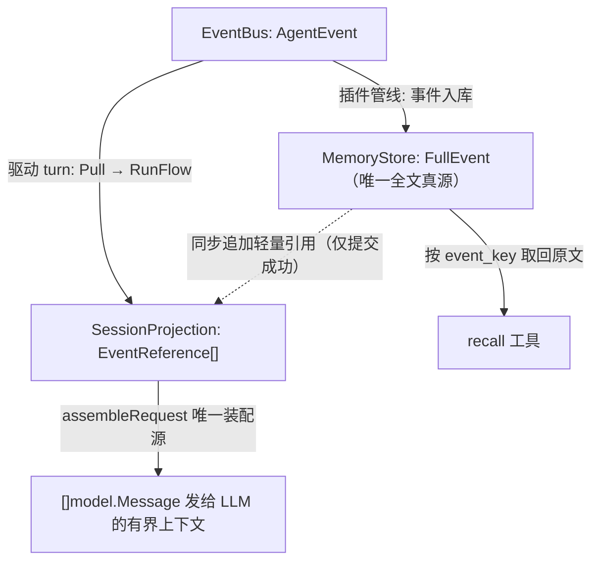
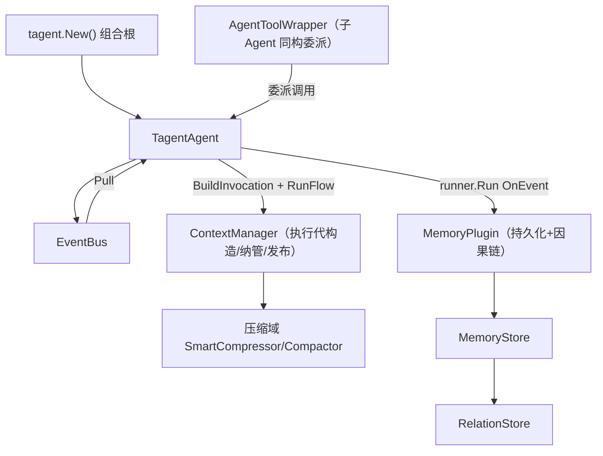

# tagent

**面向长期运行的记忆驱动 Agent 框架** —— 基于 [trpc-agent-go](https://github.com/trpc-group/trpc-agent-go)，用事件驱动引擎替代同步 ReAct 循环：发生过的事以不可变事件入库（默认按类型 TTL 遗忘，可配永久），发给模型的工作内存始终有预算上限，被压缩的内容留票据按需精确回补。目标是让 Agent 在**长时间、多轮、带工具的协作**中行为可解释、失败可判定、数据可追溯。

[English](README_EN.md) | 中文

> 本 README 描述当前真实能力与边界，不夸大。凡"验证档位"未过的项（如真实 tokenizer 的消费验收）明确标注为待办，不当作已完成。

---

## 能力与边界（先说清楚）

| 能力 | 已建立的部分 | 边界（不声称的部分） |
|---|---|---|
| 长期记忆 | 事实链不可变入库；压缩只改视图不改事实；投影是事实链的回放映射，冷启动可重建 | 原文可回补受**保留策略与存储后端**约束；部分退化恢复路径为最终一致，非逐字节；回补正确 ≠ 模型理解正确 |
| 上下文有界 | 全输入（系统提示/工具声明/参数/推理/通知）统一计价；固定开销超限时具名拒发；同步摘要有时限，超时降级留痕 | 计价是**保守估算**（字符比例 + 固定开销），不声称 provider 窗口绝对安全；不承诺任务成功率提升 |
| 运行时可调整 | 结构换代 / 数值热参 / 文件懒读三通道分工；不可在线生效的字段**具名拒绝并列须重启路径**，绝不"静默 applied" | 不是"DAG/工作流引擎"；在途调用持旧执行代，但文件与数值各有读取边界，不承诺完整环境确定性重放 |
| 决策采集 | opt-in v2 采集：SDK 边界快照、调用精确关联、丢失/超限具名计数、封账 manifest 自证完整性；**关闭态与旧实现逐字节同** | 观测边界是 `sdk_request`，**不冒充 wire**；采集旁路观测，不改变调用语义 |
| 离线训练数据 | 授权只读导出（分区允许表 + 二次核验 + 逐列缺失/歧义）；双流 strict 转换（capture 主源、facts 索引），按会话分组切 train/test 防泄漏，拒绝清单逐行可核 | **在线训练桥已退役**；真实 tokenizer 的消费验收待资产；不声称权重训练收益——交付的是"可核对的样本准备"，非"已验证的学习效果" |

**存储后端诚实说明**：默认 `localfile`（`LocalFileKV`）是跨进程验证用的最小后端，逐桶直接序列化、读写同锁，**不提供生产级持久性/并发保证**；生产持久化应使用 `rustviking` 等专用后端。

---

## 🧠 心智模型

### 三层数据表示

| 层 | 位置 | 职责 | 生命周期 |
|-----|------|------|----------|
| **EventBus AgentEvent** | Agent 内存 | 事件触发队列 | Publish → Pull 后丢弃 |
| **SessionProjection EventReference[]** | Agent 内存 | 投影（有界工作内存，只存轻量引用） | 可被 Compactor 清理 |
| **MemoryStore FullEvent** | 内存/文件/DB | 不可变完整事件链（唯一全文真源） | 按类型 TTL（可配永久 `-1`） |


```mermaid
graph TB
    EB["EventBus: AgentEvent"]
    SP["SessionProjection: EventReference[]"]
    MS["MemoryStore: FullEvent（唯一全文真源）"]
    LLM["[]model.Message 发给 LLM 的有界上下文"]
    TOOL["recall 工具"]
    EB -->|驱动 turn: Pull → RunFlow| SP
    EB -->|插件管线: 事件入库| MS
    MS -.同步追加轻量引用（仅提交成功）.-> SP
    SP -->|assembleRequest 唯一装配源| LLM
    MS -->|按 event_key 取回原文| TOOL
```

**关键约束**：投影只存轻量引用；MemoryStore 是唯一完整事件链；压缩只改 LLM 视图与投影，永不动存储；**存储成功才发布引用**——失败路径不留"账本有编号、库内无记录"的错位。

### 有界上下文与精确回补

发给模型的上下文始终有预算上限；超限的旧段折叠为卡片行 `[evt_key] 任务骨架`。折叠不删原文，凭 `[evt_key]` 可回补逐字节原文。这条链路的可靠性取决于：① 原文仍在保留策略内；② 模型选对了票据；③ 存储读路径健康。三者任一不满足都会体现为"取不到/取错"，框架会具名报告而非静默。

---

## 🏗 架构与模块


```mermaid
graph TB
    ROOT["tagent.New() 组合根"]
    TA["TagentAgent"]
    EB["EventBus"]
    CM["ContextManager（执行代构造/纳管/发布）"]
    SC["压缩域 SmartCompressor/Compactor"]
    MP["MemoryPlugin（持久化+因果链）"]
    MS["MemoryStore"]
    RS["RelationStore"]
    ATW["AgentToolWrapper（子 Agent 同构委派）"]
    ROOT --> TA --> EB -->|Pull| TA
    TA -->|BuildInvocation + RunFlow| CM --> SC
    TA -->|runner.Run OnEvent| MP --> MS --> RS
    ATW -->|委派调用| TA
```

| 模块 | 职责 |
|------|------|
| `config/` | 配置模型层：`Config`/`AgentConfig`/`ToolRef` 族、严格装载与校验、生命周期投影；组合根以别名再导出，`tagent.*` 源码级 API 不变 |
| `agent/` | 事件驱动引擎：EventBus、统一事件管线（入口与被调方共用同一 turn 原语）、ContextManager、冥想、子 Agent 封装；`agent/compress/` 压缩与预算、`agent/org/` 世代治理机制、`agent/resources/` 资源租约、`agent/reliability/` 常驻可靠性、`agent/governance/` 治理闸 |
| `memory/` | 不可变事件存储：`FullEvent`/`MemoryStore`/`FileSegmentStore`/`RelationStore`/生命周期；语义引擎与嵌入/后端适配器各居子包 |
| `plugin/` | 框架插件：MemoryPlugin（提交闸 + 因果链 + call_id 精确归因）、SummaryPlugin |
| `tool/` | 工具：exec（tmux 异步任务层）、recall/knowledge、任务工具族、文件工具、MCP 网关 |
| `event/` | 事件类型系统与元数据契约（`FormatEventKey`/`ParseEventKey`/`MetaKeyCallID` 单源）；EventTypeSpec 注册表 |
| `prompt/` | Loader 与热重载 Source（文件即真源，mtime 懒读） |
| `rl/` | RL/训练面：TrajectoryRecorder、opt-in capture v2、授权只读导出、SwappableModel、HTTPAPI（安全边界） |
| `evolution/` | git 原生自进化（默认关）：登记/评估/安全回滚，框架只出建议不动手 |

**依赖方向**（可机械断言，反向即 CI 红）：`tagent → agent → plugin → memory`，`tool/* → memory`，`event` 为纯叶子；`modelutil` 为只依赖框架 model/tool 的叶子。

**同构协作**：入口与被调方是同一种 tagent——一个 turn 原语、一条事件管线、一份已提交记录、一个（每 agent 自有）任务域；"入口/子"只是连接关系，不是两种类型。一次输入进入某 loop 起，其结算与输出目的地即已确定，运行期只查绑定不猜。

**唯一编排发布权**：组合根独占执行绑定的构造与发布；内部包不依赖根包取版本。世代治理的**机制**在 agent 域子包，**发布动作**留组合根——机制与特权物理分离。

## 📐 设计承诺

1. **事件不可变**：入库即不可改；压缩、遗忘只作用于视图，不作用于事实。
2. **上下文有界**：工作内存恒有预算上限，靠分层记忆而非无限窗口。
3. **召回可核对**：折叠内容留票据可按 key 回补原文；框架不制造"看起来成功"的空引用。
4. **异步不失联**：长任务先应答、完成后通知；通知自带上下文。
5. **默认零变化**：治理/自进化/可靠性/采集全部默认关，关闭态与关闭前逐字节同；每个可选能力可单点拆除。

---

## 📦 环境依赖

| 依赖 | 要求 | 用途 |
|---|---|---|
| Go | ≥ 1.24 | 构建 |
| tmux | 近期版本 | exec 命令执行 + 异步任务层 |
| rustviking | 可选 | 仅 `memory.type: file` 生产持久后端；缺省 localfile（最小验证后端，见上） |
| ZAI_API_KEY / 相应 provider key | 按需 | 模型 API key；**全部单测使用 mock，无需任何 key** |
| OTel endpoint | 可选 | 设 `OTEL_EXPORTER_OTLP_ENDPOINT` 启用 trace 导出；未设 noop，`trace_id` 字段留空不影响 key/call_id 关联 |

## 🚀 快速开始

**1. 声明式配置（YAML）**

```yaml
entry: tagent
prompt_dir: resources/prompts
model: glm-4-flash
providers:
  openai:
    api_endpoint: "https://open.bigmodel.cn/api/paas/v4"
    api_key_env: "ZAI_API_KEY"

agents:
  tagent:
    system_prompt:
      files: [AGENTS.md, SOUL.md, TOOLS.md]
    memory:
      type: localfile
      path: /data/tagent/events
    tools:
      - {kind: tool, id: recall}          # 统一召回：票据/因果链/关键词
      - {kind: tool, id: exec}            # tmux 命令执行（异步任务层）
```

**2. 进入持久循环（Go）**

```go
ta, _ := tagent.New(cfg, tagent.WithModel(model))
defer ta.Close()

outputCh, _ := ta.StartLoop("userID", "sessionID") // StopLoop 为终结态，重启需新实例并从事实链恢复
ta.InjectMessage(model.Message{Role: model.RoleUser, Content: "帮我执行一个命令"})

for evt := range outputCh {
    if evt.IsFinalResponse() {
        println("Final:", evt.Message.Content)
    }
}
```

**3. 跑通完整示例（WeChat Bot）**

```bash
cd examples/wechat-bot
./wizard.sh    # 依赖检查 / 引导填 key（不回显）/ 工作根 / .env(chmod 600) / 权限 / 连通性
./run.sh       # 前台启动（./run.sh start 后台；--help 看全部）
```

密钥写 `.env`（已被白名单式 `.gitignore` 忽略，绝不入库）。systemd/容器/A2A 部署见 [examples/wechat-bot/deploy/README.md](examples/wechat-bot/deploy/README.md) 与 [docs/wiki/](docs/wiki/)。

---

## 🔧 配置参考

> 配置键**严格解析**：未知字段启动即报错列名；结构变更走弃用流程。

### 全局选项

| 选项 | 默认 | 说明 |
|------|------|------|
| `entry` / `model` / `provider` / `providers` | tagent / 必填 / openai / `{}` | 入口与模型、provider 连接信息 |
| `prompt_dir` | `resources/prompts` | 提示词目录 |
| `request_timeout_seconds` | `3600` | 请求超时 |
| `working_dir` | `""` | **agent 统一工作根**（file 工具与 exec 的共同基准）；空=继承进程 cwd；可经 `TAGENT_WORKING_DIR` 覆盖 |
| `trajectory_dump` / `trajectory_dir` | `false` / `data/trajectories` | v1 轨迹录制 |
| `trajectory_capture` | （关闭） | **opt-in v2 采集**：`enabled`（须 `trajectory_dump: true`，否则具名启动错）/ `max_record_bytes`（单记录 8MiB）/ `max_pending_bytes`（在途含副本 64MiB）/ `max_run_bytes`（单次落盘 512MiB）/ `max_open_files`（≤16）。`0`=取 rl 默认（真源在 `rl`）；**负值一律拒绝**，不解释为"不限"；超上限**拒绝而非夹紧**。全为构造期读取，不承诺热更。见 [决策采集](docs/wiki/rl/rl-architecture.md#trajectory-capture) |

### Agent 级要点

| 选项 | 默认 | 说明 |
|------|------|------|
| `memory.type` / `path` / `read_namespaces` | `memory`/`""`/`[]` | 进程内 / 文件持久 / 跨分区读取须显式授权 |
| `memory.lifecycle` | 内置默认 | 遗忘：`global_ttl_days`（默认 7，负=关）/`type_ttl`/`max_events_per_partition` |
| `memory.engine` | （关） | 语义检索与巩固建议（触发只是建议，执行权在 LLM+工具） |
| `compress_threshold` / `keep_recent_tasks` | `0.8` / `2` | 整理触发阈值 / 整理后保留最近数 |
| `max_tool_iterations` / `max_tokens` / `temperature` | 入口 50/8000/0.7 · 子 10/4096/0.3 | 在被引用 agent 自身定义处配置 |
| `meditation.enabled` | `false` | 空闲期反思沉淀 |

### compress 块

| 选项 | 默认 | 说明 |
|------|------|------|
| `summary_model` / `summary_provider` | 继承 agent | 摘要专用模型（可用廉价模型） |
| `card_max_chars` / `summary_max_tokens` | `6000` / `8192` | 卡片上限 / 摘要预算下限 |
| `summary_timeout_seconds` | `0`（=包默认 5s） | 一轮真折叠内所有同步摘要共用时限。`0`=用包默认非关掉；**负值是校验错**（不等于无时限）；超上限 `120` **拒绝而非夹紧**。属构造期数值，走换代，不是第四条热参通道。见 [摘要时限](docs/wiki/agent/compression-and-telemetry.md#summary-deadline) |

### 平台子系统（默认全关 = 零行为变化）

| 配置块 | 说明 |
|--------|------|
| `governance:` | 治理闸：leaf 工具过风险分级 + 预算滑窗 + critical 异步审批；拒绝以工具结果回给模型（非 Go error）。`enforcement: warn|strict` |
| `evolution:` | git 原生自进化：登记 + 后验评估（劣化只出建议）+ 安全回滚。⚠ 生产=独立部署仓 |
| `reliability:` | 常驻可靠性：durable inbox（全量持久受理，at-least-once，**不保证外部工具恰好一次**）、依赖退化阶梯、mem_spill 兜底、冥想锚点 |

> **改了配置什么时候必须重启**：热更只有三种合法读数——① 五个数值热参即时应用；② 结构白名单（entry/model/provider/prompt_dir、`providers.{provider,api_endpoint}`、per-agent 子集）换代生效；③ 其余**具名拒绝**并回执 `restartRequired`（`governance`/`reliability`/`trajectory_capture`/`trajectory_dump`/`trajectory_dir`）。同时含两类的修改**整批拒绝**（可热那半也不悄悄应用）。判据是**消费点位置**，非字段敏感度。见 [维度分类](docs/wiki/platform/org-hot-reload.md#restart-required-dimensions)。

## 🤖 RL / 训练面

- **录制**：`rl.TrajectoryRecorder`（v1）+ opt-in capture v2；子 agent 经模型包装共享同一写入流。
- **授权导出**：`rl.ExportTrainingFacts` 只读窄面（分区允许表、逐条二次核验、missing/forbidden/ambiguous 分列，不自动折算 reward）。
- **离线转换**：`scripts/convert_trajectories.py --strict` 双流（capture 主源 + facts 关联索引 + 封账证明），产出 SFT/RL 样本；`scripts/verify_runtime_acceptance.py` 是**核账器**（缺证据即 FAIL 非 SKIP）。
- **退役记录**：AReaL 在线训练桥（改名前 `train.*` 布局）已删除，重接条件见 [RL 架构](docs/wiki/rl/rl-architecture.md)。

## 📚 深入阅读

| 主题 | 文档 |
|------|------|
| 记忆架构 / recall 协议 | [docs/wiki/memory/memory-architecture.md](docs/wiki/memory/memory-architecture.md) |
| Agent 架构 / 执行代 / 压缩与遥测 | [docs/wiki/agent/](docs/wiki/agent/) |
| 平台子系统（治理/自进化/可靠性/热更/可观测/MCP） | [docs/wiki/platform/platform-subsystems.md](docs/wiki/platform/platform-subsystems.md) |
| RL / 采集 / 授权导出 / 双流转换 | [docs/wiki/rl/rl-architecture.md](docs/wiki/rl/rl-architecture.md) |
| 设计规格（OpenSpec） | [openspec/specs/](openspec/specs/) |
| 真实 LLM 契约守护矩阵 | [tests/README.md](tests/README.md) |

## 开发

```bash
go build ./... && go vet ./...
go test ./... -short                    # CI 同款
go test ./evals/                        # 组件级行为评估
bash scripts/race_check.sh              # race 门禁
bash scripts/lint.sh && bash scripts/check-openspec.sh
```

CI 在 push（main/dev）与 PR 触发：build + vet + 全量 short + 新子系统 `-race`；真实 LLM 契约测试无 key 自动跳过、不阻塞。tmux 会话型测试须 `-p 1` 串行（共用默认 tmux 服务器会互相收割，判读见 [docs/wiki/tool](docs/wiki/tool/tool-architecture.md)）。

## License

Apache License 2.0
