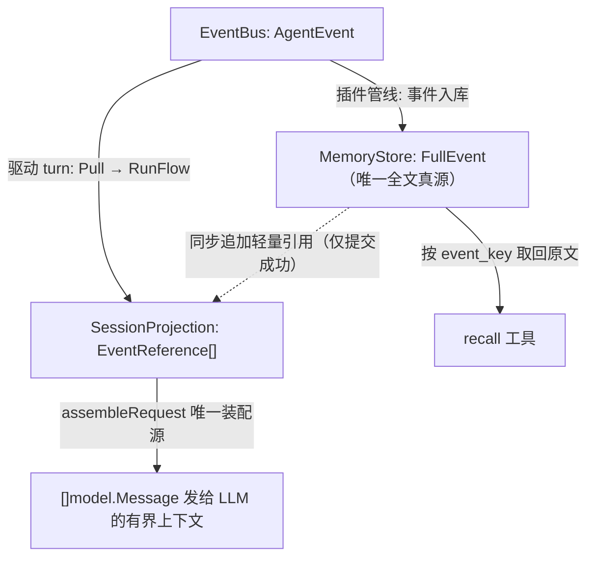
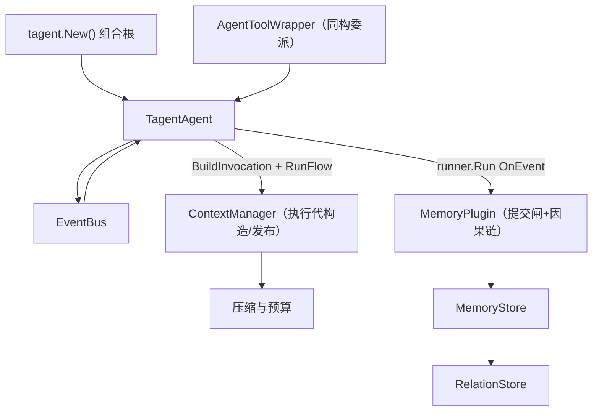

# tagent

**一个能长期运行的 Agent 框架** —— 基于 [trpc-agent-go](https://github.com/trpc-group/trpc-agent-go)。它解决的朴素问题是：**让助手连续工作几天、几周，而不是每轮对话都从零开始**。发生过的事作为不可变事件保存，发给模型的上下文永远有预算上限，压缩掉的内容可以精确找回；进程崩溃后从事实重建现场继续干活；还能把每天的运行经验整理成可用于模型训练的数据。

[English](README_EN.md) | 中文

适合：需要持久协作的个人助手、运维值守 agent、长任务编排；也适合作为"从运行数据中学习"（离线 SFT 数据管线）的运行时底座。

## 先看它干活

**部署并盯三天** — 你说"部署 v2.3 并盯着"，它把十分钟的脚本转进 tmux 后台、先回你"已开始"；结果回来时它自己醒来检查日志、汇报。三天后你问"当时那个报错细节"，它凭压缩时留下的编号把原文一字不差地取回。

**凌晨崩溃，原地复活** — 宿主机重启后新进程拉起，上下文从事件链逐字节重建，不用重付一遍历史 token；昨晚没跑完的任务探测到还活着就重新接管。用户早晨只看到一条"夜间已完成重启，巡检继续"。

**无人值守的一夜** — 模型限流时它退避重试而不是硬打；高危命令先送审批、自己先去干别的；空闲期回看这两天踩的坑，沉淀一条经验卡片。早上你看到：一条经验、一份待审批、零静默失败。

**换大脑，不停车** — 配置里把模型从 A 换成 B、加一个 MCP 工具，保存即下一个回合生效；进行中的回合用旧配置跑完；确实不能在线改的字段会明确拒绝并告诉你哪些路径需要重启——不会假装成功。

## 核心特性

### 长期记忆，而不是无限上下文
每条消息、每次工具调用、每个结果都以不可变事件入库（按类型 TTL 遗忘，可配永久）。上下文超预算时旧对话折叠成一行卡片 `[evt_1a2b] 部署成功`，凭 `[evt_1a2b]` 随时取回原文。存储只追加，压缩只改变"模型看到什么"，永远不改"发生过什么"。

### 崩溃恢复
投影（当前上下文）是事件链的回放结果，没有游离的 checkpoint——重启后按"最新折叠快照 + 尾部事件"重建，可复用的前缀继续命中 provider 缓存。

### 异步任务不失联
长任务先应答、完成后通知回写唤醒；通知自带完整上下文；未确认的输入可全量持久受理（at-least-once），重启后按原顺序重投。

### 运行时可调，且诚实
五类参数即时热应用、结构变更换代生效（在途回合不受影响、可回滚）、其余**具名拒绝**并列出需重启的配置路径。不存在"改了、回执成功、实际没生效"。

### 多 Agent 同构协作
入口和被它委派出去的 agent 是同一种东西：各自有事件总线、自己的任务域、自己的记忆分区，可以递归再委派。一次委派绑定输出目的地，晚到的结算接回发起方续写同一轮；单次调用还可临时换提示词/模型/工具面（用完即弃，不跨调用泄漏）。

### 自我复盘与旁路冥想（一个机制，反思默认在独立 session）
空闲期自动"复盘"：整理上下文、沉淀经验卡片、给反复失败的策略记负反馈。机制只有一个：门控到点后，向某条循环 session 注入一个冥想输入事件，由该 agent 的一个正常回合完成反思。**默认推荐形态是把反思放在独立的旁路冥想线上**——声明一个冥想 agent，固定跑在保留 session（wechat-bot 示例即 `meditation`）上：它不占业务 session 的上下文预算，反思的内部叙述也不混进与用户的对话历史；观察面配置决定它看谁的分区——`observed_namespaces`（须在 `memory.read_namespaces` 授权内）列他人即旁路冥想（"这三个会话都在等同一个审批"这类模式），列自身或不列即回看自己，混着列一趟扫描同一条判据；经验卡片经 `deliver_to` 白名单回流业务对话。把 `meditation.enabled` 直接配在业务 agent 上也合法（缺省观察面=[自身分区]，反思与业务回合共享上下文）——那是"复盘方需要当面看到当前业务"的进阶形态，代价是反思输入输出占用业务线预算、内部叙述留痕在业务线。写得很克制：反思只写自己分区的普通记忆，绝不改动别人的上下文；看谁的记忆、投给谁都要显式授权。

### 运行数据 → 训练数据
可选的决策采集把每次模型调用完整记录（输入快照、响应分片、终态、丢失统计），事后把"当时看到什么→做了什么→结果如何→人怎么评价"关联成一条条样本，按会话分组切分 train/test，导出为 SFT 数据集——每一步有清单可对账，缺什么明说，不静默拼凑。

## 三分钟跑起来

**1. 声明式配置（YAML）**

```yaml
entry: tagent
prompt_dir: resources/prompts
model: glm-4-flash
providers:
  openai:
    api_endpoint: "https://open.bigmodel.cn/api/paas/v4"
    api_key_env: "ZAI_API_KEY"

agents:
  tagent:
    system_prompt:
      files: [AGENTS.md, SOUL.md, TOOLS.md]
    memory:
      type: localfile
      path: /data/tagent/events
    tools:
      - {kind: tool, id: recall}          # 票据/因果链/关键词统一召回
      - {kind: tool, id: exec}            # tmux 命令执行（异步任务层）
```

**2. 进入持久循环（Go）**

```go
ta, _ := tagent.New(cfg, tagent.WithModel(model))
defer ta.Close()

outputCh, _ := ta.StartLoop("userID", "sessionID") // StopLoop 为终结态；重启用新实例，从事实链恢复
ta.InjectMessage(model.Message{Role: model.RoleUser, Content: "帮我执行一个命令"})

for evt := range outputCh {
    if evt.IsFinalResponse() {
        println("Final:", evt.Message.Content)
    }
}
```

**3. 完整示例（WeChat Bot，六个 agent 协作的实战形态：入口 + 四个子 agent + 冥想线 `meditator`，后者的反思固定跑在保留 session `meditation`）**

```bash
cd examples/wechat-bot
./wizard.sh    # 依赖检查 / 引导填 key（不回显）/ 工作根 / .env(chmod 600) / 权限 / 连通性
./run.sh       # 前台启动（./run.sh start 后台）
```

密钥只进 `.env`（.gitignore 白名单模式，绝不入库）。systemd / 容器 / A2A 远程 agent 部署见 [examples/wechat-bot/deploy/README.md](examples/wechat-bot/deploy/README.md)。

## 心智模型

### 三层数据表示

| 层 | 位置 | 职责 | 生命周期 |
|-----|------|------|----------|
| **EventBus AgentEvent** | Agent 内存 | 事件触发队列 | Publish → Pull 后丢弃 |
| **SessionProjection EventReference[]** | Agent 内存 | 投影（有界工作内存，只存轻量引用） | 可被 Compactor 清理 |
| **MemoryStore FullEvent** | 内存/文件/DB | 不可变完整事件链（唯一全文真源） | 按类型 TTL（可配永久 `-1`） |


```mermaid
graph TB
    EB["EventBus: AgentEvent"]
    SP["SessionProjection: EventReference[]"]
    MS["MemoryStore: FullEvent（唯一全文真源）"]
    LLM["[]model.Message 发给 LLM 的有界上下文"]
    TOOL["recall 工具"]
    EB -->|驱动 turn: Pull → RunFlow| SP
    EB -->|插件管线: 事件入库| MS
    MS -.同步追加轻量引用（仅提交成功）.-> SP
    SP -->|assembleRequest 唯一装配源| LLM
    MS -->|按 event_key 取回原文| TOOL
```

**一次请求走一遍**：用户消息入总线 → 循环攒批、每条先入库再投影 → 组装请求（唯一装配源，超限当场压缩/拒发）→ 框架跑 ReAct 回合（LLM↔工具）→ 每条输出经插件落库 → final 响应交还宿主。任何一步失败都有具名结局，不出现"账本有编号、库内无记录"。

## 架构与模块


```mermaid
graph TB
    ROOT["tagent.New() 组合根"] --> TA["TagentAgent"]
    TA --> EB["EventBus"] --> TA
    TA -->|BuildInvocation + RunFlow| CM["ContextManager（执行代构造/发布）"] --> SC["压缩与预算"]
    TA -->|runner.Run OnEvent| MP["MemoryPlugin（提交闸+因果链）"] --> MS["MemoryStore"] --> RS["RelationStore"]
    ATW["AgentToolWrapper（同构委派）"] --> TA
```

| 模块 | 职责 |
|------|------|
| `config/` | 配置模型、严格装载与校验、生命周期投影；`tagent.*` 公共 API 源码级不变 |
| `agent/` | 事件驱动引擎：EventBus、统一事件管线、ContextManager、冥想、子 agent 封装；子包：`compress/` 压缩预算、`org/` 世代治理、`task/` 任务生命周期、`reliability/` 常驻可靠性、`governance/` 治理闸、`resources/` 资源租约 |
| `memory/` | 不可变事件存储：段文件 + 关系边 + 生命周期；语义引擎/嵌入/KV 后端各居子包可替换 |
| `plugin/` | MemoryPlugin（持久化 + 因果链 + 调用归因）、SummaryPlugin |
| `tool/` | exec（tmux 异步任务）、recall/knowledge、任务工具族、文件工具、MCP 网关 |
| `event/` | 事件类型系统与元数据契约；谱系白名单单一真源 |
| `prompt/` | 提示词加载与热重载（文件即真源） |
| `rl/` | 决策采集、授权导出、可换模型句柄、HTTPAPI（RL 对接面） |
| `evolution/` | git 原生自进化（默认关）：登记/评估/安全回滚 |

**依赖方向**（CI 机械断言，反向即红）：`tagent → agent → plugin → memory`，`tool/* → memory`，`event` 为纯叶子；`modelutil` 只依赖框架类型。**唯一编排发布权**：组织配置的换代发布只属于组合根；世代治理的机制在 `agent/org`，发布动作在根包——机制与特权物理分离。

## 📐 设计承诺

1. **事件不可变**：入库即事实；压缩、遗忘只作用于视图。
2. **上下文有界**：工作内存恒有预算上限——靠分层记忆，不靠无限窗口。
3. **召回可核对**：压缩留票据、失败有具名结局，框架不制造"看起来成功"。
4. **异步不失联**：长任务先应答后通知，通知自带上下文。
5. **默认零变化**：治理/自进化/可靠性/采集/旁路冥想全部 opt-in，关闭态与旧版逐字节一致，可单点拆除。

## 🔧 配置参考

> 配置键**严格解析**：未知字段启动即报错并列名，拼写错误不会静默漂移。

### 全局选项

| 选项 | 默认 | 说明 |
|------|------|------|
| `entry` / `model` / `provider` / `providers` | tagent / 必填 / openai / `{}` | 入口与模型 |
| `prompt_dir` | `resources/prompts` | 提示词目录 |
| `request_timeout_seconds` | `3600` | 请求超时 |
| `working_dir` | `""` | **agent 统一工作根**（file 工具与 exec 的路径基准）；可 `TAGENT_WORKING_DIR` 覆盖 |
| `trajectory_dump` / `trajectory_dir` | `false` / `data/trajectories` | 轨迹记录（v1） |
| `trajectory_capture` | （关） | **v2 决策采集**：`enabled`（须 `trajectory_dump: true`）+ 单记录/在途/单次落盘/打开文件四个资源上限；负值拒绝启动（不解释成"不限"），全部构造期读取。见 [决策采集](docs/wiki/rl/rl-architecture.md#trajectory-capture) |

### Agent 级要点

| 选项 | 默认 | 说明 |
|------|------|------|
| `memory.type` / `path` / `read_namespaces` | `memory`/`""`/`[]` | 进程内/文件持久；读其他 agent 记忆须显式授权 |
| `memory.lifecycle` | 内置默认 | 遗忘：全局/分类型 TTL、容量上界 |
| `memory.engine` | （关） | 语义检索（向量∪关键词 RRF）与巩固建议（触发只是建议，执行权在 LLM+工具） |
| `meditation.enabled` + `interval`/`min_gap`/`prompt_file`（扩字段 `observed_namespaces`/`deliver_to`） | `false`；**`observed_namespaces` 缺省＝`[自身分区]`** | 空闲复盘：默认推荐声明独立冥想 agent（反思落保留 session 如 `meditation`，不混业务线）；`observed_namespaces` 列他人（须 ⊆ `memory.read_namespaces`）即跨域、不列即回看自身，`deliver_to` 决定卡片回流向；直接配在业务 agent 上则反思落进其业务 session（进阶形态，见上方冥想说明） |
| `compress_threshold` / `keep_recent_tasks` | `0.8` / `2` | 压缩触发 / 整理后保留最近任务数 |
| `max_tool_iterations` / `max_tokens` / `temperature` | 入口 50/8000/0.7 | 只在被引用 agent 自身定义处配置 |

### compress 块

| 选项 | 默认 | 说明 |
|------|------|------|
| `summary_model` / `summary_provider` | 继承 agent | 摘要可用更便宜的模型 |
| `card_max_chars` / `summary_max_tokens` | `6000` / `8192` | 卡片上限 / 摘要预算 |
| `summary_timeout_seconds` | `0`(=5s) | 一轮折叠内所有同步摘要共用的时限；超上限 `120` 拒绝而非夹紧；改动走换代生效 |

### 平台子系统（默认全部关闭 = 零行为变化）

| 块 | 一句话 |
|---|---|
| `governance:` | 工具风险分级 + 预算滑窗 + critical 异步审批（被拒理由以工具结果回给模型，让它能自纠） |
| `evolution:` | git 原生自进化：改提示词/技能即生效，本包负责留痕、后验评估（劣化只出建议）、安全回滚 |
| `reliability:` | 输入全量持久受理（at-least-once）、五依赖退化阶梯、存储兜底、冥想锚点 |

> **改了配置什么时候要重启**：五类数值参数即时生效；结构白名单（入口/模型/provider/提示词/子集）保存即换代生效；其余（治理、可靠性、轨迹配置、冥想观察面与投递白名单等）会**具名拒绝并列出 YAML 路径**——一次修改同时含两类时整批拒绝，可热的那半也不会偷偷应用。判据是消费点位置，不是字段敏感度。详见 [热更维度](docs/wiki/platform/org-hot-reload.md#restart-required-dimensions)。

## 🤖 RL / 训练面

- **录制**：v1 轨迹 + 可选 v2 决策采集（SDK 边界快照、调用精确关联、封账自证完整性；默认关，关时与 v1 逐字节一致）。
- **授权导出**：`rl.ExportTrainingFacts` 只读快照（分区白名单 + 逐条二次核验，缺失/歧义分列不猜测）。
- **离线转换**：`scripts/convert_trajectories.py --strict` 双流产出 SFT 样本；`scripts/verify_runtime_acceptance.py` 核账器（缺证据判 FAIL，不 SKIP）。
- 在线 RL 桥（AReaL 对接）已退役，重接条件见 [RL 架构](docs/wiki/rl/rl-architecture.md)。

## 📚 深入阅读

| 主题 | 文档 |
|---|---|
| 记忆架构 / recall 协议 | [docs/wiki/memory/memory-architecture.md](docs/wiki/memory/memory-architecture.md) |
| Agent 引擎 / 执行代 / 压缩与遥测 / 冥想（单机制：反思默认旁路冥想线） | [docs/wiki/agent/](docs/wiki/agent/) |
| 平台子系统（治理/自进化/可靠性/热更/可观测/MCP） | [docs/wiki/platform/platform-subsystems.md](docs/wiki/platform/platform-subsystems.md) |
| RL / 采集 / 授权导出 / 双流转换 | [docs/wiki/rl/rl-architecture.md](docs/wiki/rl/rl-architecture.md) |
| 设计规格（OpenSpec，114 项） | [openspec/specs/](openspec/specs/) |
| 真实 LLM 契约守护矩阵 | [tests/README.md](tests/README.md) |

## 开发

```bash
go build ./... && go vet ./...
go test ./... -short                    # CI 同款
go test ./evals/                        # 组件级行为评估
bash scripts/race_check.sh              # race 门禁
bash scripts/lint.sh && bash scripts/check-openspec.sh
```

CI（push main/dev 与 PR）：build + vet + 全量 short + 新子系统 `-race`；真实 LLM 契约测试无 key 自动跳过、不阻塞。注释即契约：每个生产文件带 `契约:` 索引指向 wiki 判据，CI 零容忍（详见 [docs/comment-gate-tooling.md](docs/comment-gate-tooling.md)）。tmux 会话型测试须 `-p 1` 串行（判读见 [工具架构](docs/wiki/tool/tool-architecture.md)）。

## 现状与边界（诚实说明）

第一次读的人请重点看这里，避免把项目想强或想歪：

- **存储后端**：默认 `localfile` 是最小验证后端（逐桶序列化、读写同锁），**不承诺生产级持久性**；生产持久化请配 `rustviking` 等专用后端。
- **"精确回补"的前提**：原文仍在 TTL 内、模型选对票据、存储可读；个别退化恢复路径只承诺最终一致而非逐字节。回补正确 ≠ 模型理解正确。
- **预算计价是估算**：字符比例 + 固定开销，统一口径且不再漏计工具声明/长参数，但不承诺 provider 窗口绝对安全，也不承诺任务成功率提升。
- **训练数据链**：录制→授权导出→strict 转换的**样本准备闭环**成立且可对账；端到端"真实 tokenizer 出可训 batch"尚待本地模板资产；本项目不声称任何权重训练收益；在线 RL 桥已退役。
- **旁路冥想**：机制只有一个，跨域不是开关而是观察面配置——默认使用形态是旁路冥想线（专用反思 session，wechat-bot 示例即如此，业务 agent 的 meditation 块关闭）；把冥想配在业务 agent 上是合法进阶形态（不配 `observed_namespaces` 即观察自身分区、反思落进业务 session）；要跨域须显式列出他人分区，且需两层显式授权（`observed_namespaces` ⊆ `memory.read_namespaces`、`deliver_to` 白名单，越界与盲投在装配期拒绝启动）；判据 fail-closed（读不到/不认识谱系一律不算新鲜，宁少思不瞎思）；产出只落自己分区、不改动他人上下文；投递仅同进程，跨进程走既有 HTTPAPI。真实模型端到端场景已在本机跑通一次（三态门+非空转探针，预算 3 次调用入账）——单次证据，CI 无 key 时合法 SKIP。
- **热更不是万能**：不承诺"所有配置在线可改"；不可热改的会拒绝并给出重启清单。投递/采集等旁路能力不改变调用语义。
- **外部工具副作用是至少一次语义**：可靠受理防丢，不防重；有副作用的工具请自带幂等键。

## License

Apache License 2.0
