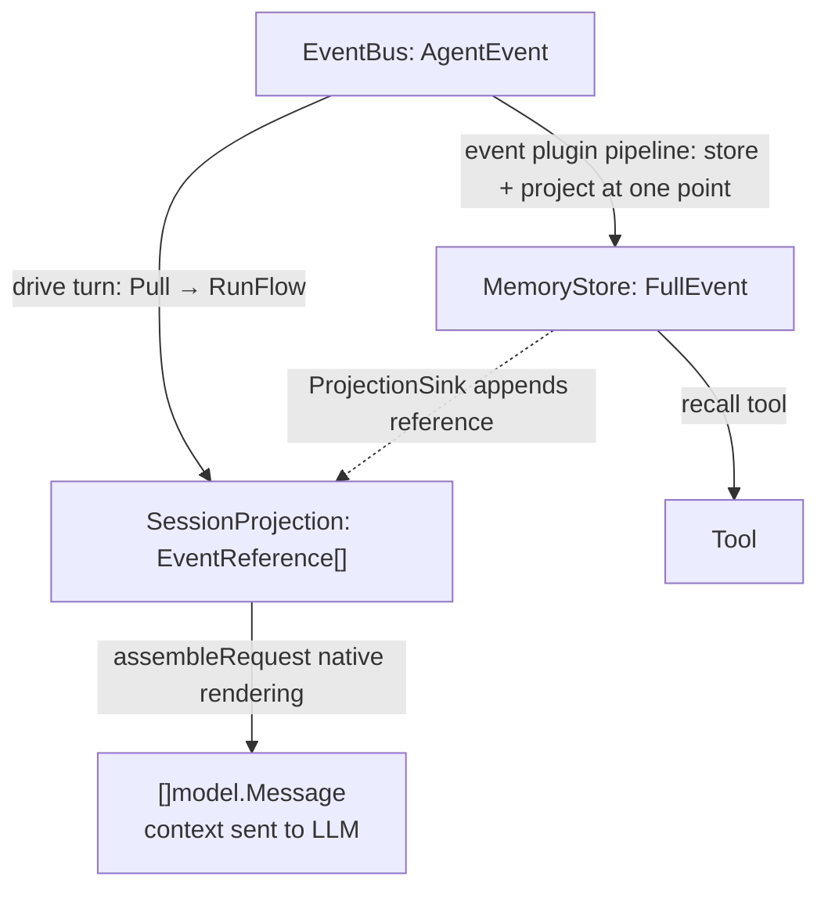
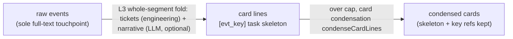
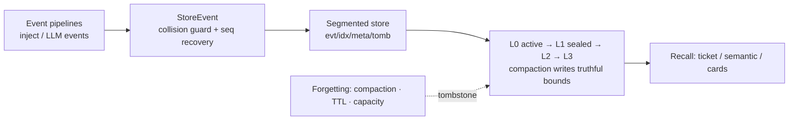
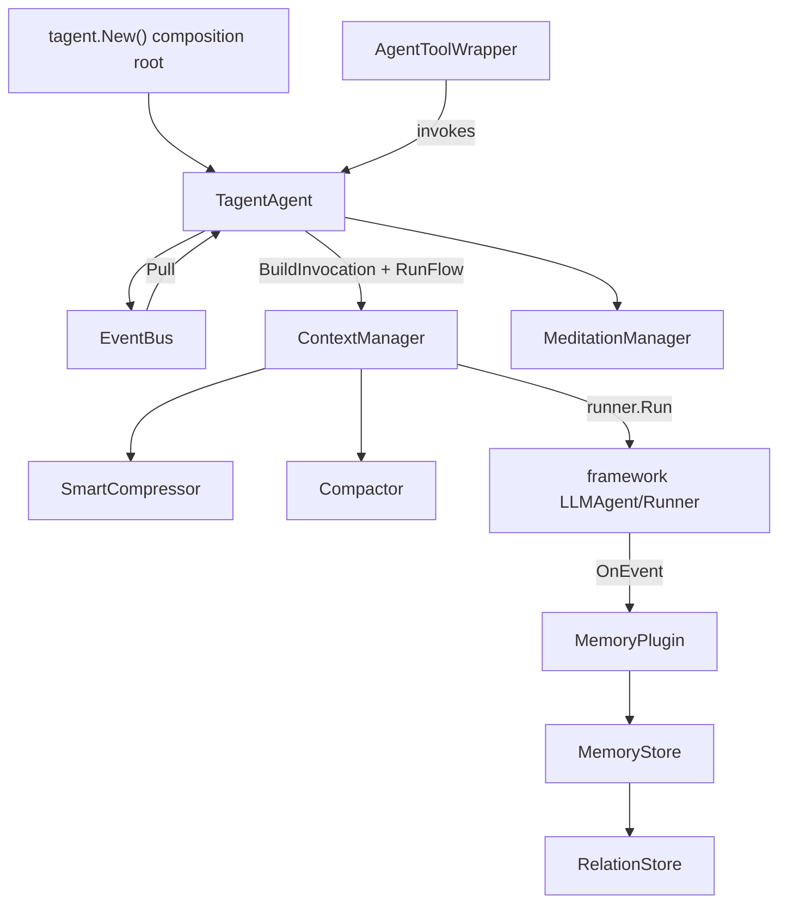

# tagent

**A memory-driven framework for long-running agents** — built on [trpc-agent-go](https://github.com/trpc-group/trpc-agent-go), replacing the synchronous ReAct loop with an event-driven engine: events persist forever, context compresses on demand, history recalls precisely — so an agent can **run for days without amnesia or drift**.

English | [中文](README.md)

> **Note:** the Chinese [README.md](README.md) remains the source of truth; this English version is
> synced to the same 2026-09 architecture. Mechanism-level detail lives in
> [docs/wiki/](docs/wiki/) (Chinese).

---

## ✨ Features

| Feature | In one line |
|---------|-------------|
| 🔄 **Persistent event loop** | Always-on after `StartLoop`; messages, tool results and timers all drive turns through one EventBus |
| 🧠 **Three memory primitives** | store (immutable ingestion) / compress (summarize + natural forgetting) / recall (ticket or semantic) |
| 🗂 **Card sequence** | Compacted history condenses into index-card lines — the model always "sees what it did", each card is a recall ticket |
| ⚡ **Async task layer** | Long commands/services run via tmux: fast ones return inline, slow ones ACK + `task_settled` notification |
| 🔁 **Task reentry** | `resume_task` feeds input into live services (REPL-style) or continues finished sub-agents (context auto-restored) |
| 🤖 **Sub-agent orchestration** | Local `AgentToolWrapper` / remote A2A unified; events passed across agents by key |
| 🧘 **Meditation heartbeat** | Idle-time reflection sediments into ★-highlighted cards in long-term memory |
| 🎓 **RL integration** | HTTPAPI + SwappableModel + TrajectoryRecorder for AReaL training data collection |
| 🔌 **MCP loop** | `mcp_servers` declarative registry (hot-synced on add/remove) + `mcp_call` gateway + `mcp_discover` — tool knowledge permeates context on demand while the tool declaration block stays constant (cache-friendly) |
| 🔍 **Hybrid semantic recall** | With `memory.engine.embedding` on, recall fuses vector ∪ keyword via RRF; the discover-then-redeem two-phase protocol is unchanged; byte-identical to keyword-only when unconfigured |
| 📊 **Unified observability** | turn root span + trace_id linking three projections (event metadata / RL trajectory / OTel span tree); export by setting an OTLP endpoint, noop with zero overhead otherwise |
| 🛡 **Governance gate** (off by default) | RiskClassifier four risk levels + sliding-window budget + async approval for critical (external approval files) + DenialLedger audit; GovernanceTool decorates every leaf tool |
| 🧬 **Self-evolution** (off by default) | BundleStore immutable hot config + risk-routed release lanes (fast lane posterior evaluation / slow lane gated) + refine tool (propose/diff/status/rollback, **no activate** — the agent never holds direct activation power) |
| 🚡 **Resident reliability** (off by default) | EventBus disk spill (at-least-once, no dropped events) + DegradationManager five-dependency tracking + mem_spill fallback replay on store failure |

## 🎬 A day in a long-running agent


## 📦 Requirements

| Dependency | Requirement | Purpose |
|---|---|---|
| Go | ≥ 1.24 | build (`go build ./...`; go.mod is authoritative) |
| tmux | any recent version | exec-tool command execution + async task layer (fast path returns inline / slow path backgrounds in tmux and reports back via `task_settled`) |
| rustviking | optional | KV backend only for the `memory.type: file` persistent store; the default `memory`/`localfile` backends need no external binary |
| ZAI_API_KEY | as needed | GLM Coding Plan models (examples default); **every unit test uses mocks and needs no key** |
| OTLP endpoint | optional | set `OTEL_EXPORTER_OTLP_ENDPOINT` to export traces (Jaeger/Tempo/…); unset means noop with zero overhead and zero behavior change |

## 🚀 Quick Start

**1. Declarative config (YAML)**

```yaml
entry: tagent
prompt_dir: resources/prompts
model: glm-4-flash
providers:
  openai:
    api_endpoint: "https://open.bigmodel.cn/api/paas/v4"
    api_key_env: "ZAI_API_KEY"

agents:
  tagent:
    system_prompt:
      files: [AGENTS.md, SOUL.md, TOOLS.md]
    memory:
      type: localfile
      path: /data/tagent/events
    tools:
      - kind: tool
        id: recall               # unified recall entry: tickets/causal-chain/keyword search (parameters are the router)
      - kind: tool
        id: exec                 # tmux execution (async task layer)
        description_file: action_tool_desc.md

  recall:
    system_prompt:
      files: [recall_agent.md]
    memory:
      type: memory
    max_tool_iterations: 10
```

**2. Three lines into the persistent loop (Go)**

```go
ta, _ := tagent.New(cfg, tagent.WithModel(model))
defer ta.Close()

outputCh, _ := ta.StartLoop("userID", "sessionID")
ta.InjectMessage(model.Message{Role: model.RoleUser, Content: "run a command for me"})

for evt := range outputCh {
    if evt.IsFinalResponse() {
        println("Final:", evt.Message.Content)
    }
}
```

**3. Run the full example (WeChat Bot)**

**Bare-metal local deployment (recommended for a personal assistant)** — one interactive wizard:

```bash
cd examples/wechat-bot
./wizard.sh    # 7 steps: ① check deps (go≥1.24 / tmux required; node / openspec / rustviking optional)
               # ② collect ZAI_API_KEY (no echo, kept out of shell history) ③ set the agent working
               # root (TAGENT_WORKING_DIR) ④ write .env (chmod 600) ⑤ workspace ACL setup
               # ⑥ verify connectivity (embedding endpoint, no chat quota spent) ⑦ next steps
./run.sh       # foreground (./run.sh start for background; ./run.sh --help lists all commands)
```

Keys land in `.env`, which the whitelist-style `examples/wechat-bot/.gitignore` ignores by
construction (never committed); `run.sh` loads `.env` at startup with **already-exported variables
winning** (`ZAI_API_KEY=x ./run.sh` overrides temporarily). Sub-commands: `wizard.sh --check`
(deps only), `--verify` (connectivity only), `--perms` (redo workspace permissions only).

**Remote always-on deployment (bare-metal systemd)** — `./run.sh build` produces a fully static
binary (`CGO_ENABLED=0`, no gcc needed) → install `deploy/tagent-wechat.service` (non-root /
`ProtectSystem=strict` + `ReadWritePaths` allowlist / `Restart=always` self-healing / graceful
SIGTERM shutdown / resource caps) → `systemctl enable --now`. Full steps, data directories and
backups, the two working-root ACL gates, operations and troubleshooting:
[examples/wechat-bot/deploy/README.md](examples/wechat-bot/deploy/README.md) (or `./run.sh systemd`).

Or plain `go run` (with `ZAI_API_KEY` exported):

```bash
cd examples/wechat-bot && go run .    # WeChat bot: persistent loop + every mechanism live
```

Other modes: container deployment (`examples/wechat-bot/Dockerfile` + `docker-compose.yml`, podman/docker compatible, secrets injected via env), A2A server (`agent.NewA2AServer`), RL rollout worker (`agent.NewHTTPAPI` for AReaL, `./run.sh rl`) — see [docs/wiki/](docs/wiki/).

## 🧠 Mental Model

### Three data representations

| Layer | Location | Role | Lifetime |
|-------|----------|------|----------|
| **EventBus AgentEvent** | agent memory | trigger queue | dropped after Pull |
| **SessionProjection EventReference[]** | agent memory | projection (bounded working memory) | compactable |
| **MemoryStore FullEvent** | mem/file/DB | permanent immutable storage | forever |



**Key constraints**: the projection holds lightweight references only (key+type+summary); MemoryStore is the sole complete event chain; compression touches the LLM view and projection, never storage.

### Memory primitives and the compression cascade



- **Two-layer fold**: when a segment leaves at L3, the engineering ticket layer (card lines + `[evt_key]` recall tickets) is always present; with `summary_model` configured, a single-line rolling narrative (`〔历史综述〕`) is layered on top (incremental synthesis, compile-time length caps, degrades to pure engineering on failure)
- **Bounded cost**: level assignment and the ticket layer are pure engineering (zero LLM, cost proportional to new segments only); LLM appears at exactly two low-frequency overlays — the L3 rolling narrative (one call per fold) and card condensation (`condenseCardLines`) when cards exceed the cap; both degrade to engineering form without a model
- **Card sequence**: compacted history stays readable as card lines (`[Compacted N] + narrative + card lines + recent keys`); meditation outputs get ★ highlights
- **Raw events may be forgotten, tickets persist**: the `[hex]` key on each card is a recall ticket — `recall` fetches the original text anytime (the legacy pipeline's L3 LLM segment summaries / artifacts were removed; existing artifacts keep TTL exemption and age out naturally)

### Memory data model (LSM)

Storage is organized as an **LSM tree**: events from the **two live pipelines** (EventBus injection / framework LLM events) converge on a single write path and are append-only into write-time-windowed segments; levels denote write recency and compaction generation, and sealing/compaction record truthful time bounds for query pruning; forgetting is handled by three independent layers — compaction, TTL, and capacity.

> The legacy compression-artifact write pipeline has been **removed**: compaction output (`context_compress` rolling summaries) lives in the projection as **negative-key** summary references and never reaches `StoreEvent`; existing artifacts (`context_compress_summary`, positive keys) stay read-only, keep TTL exemption, and age out naturally.



- **Recall and compression point the same way**: compression drops old / keeps new, so recall returns newest first — under `timestamp_desc`, truncation sacrifices only the oldest, never the newest memories
- **Two time axes**: `Timestamp` (event time) is the single semantic time axis; the time embedded in EventKey (write time) is used only for segment placement and same-millisecond tie-breaking
- **Events are immutable**: EventKey is the event's identity and duplicate writes are rejected; after a restart seq resumes from the existing maximum, never overwriting old events
- **Forgetting is configurable**: TTL decays per event type (curated artifacts exempt), declared via `memory.lifecycle`; a negative global TTL is the master switch that disables forgetting

See [wiki/memory §16](docs/wiki/memory/memory-architecture.md) for the full data flow, implicit connections, and hard contracts.

## ⚙️ Six mechanisms at a glance

| Mechanism | Highlights | Deep dive |
|-----------|-----------|-----------|
| Persistent event loop | Pull batching; async results queue without interrupting an in-flight turn | [wiki/agent](docs/wiki/agent/event-flow.md) |
| Context compression | SmartCompressor (LLM view, L0-L3 levels) + Compactor (rolling card projection); **capacity-gated compaction** (compact only over the token threshold) with render freeze between rounds (byte-stable prefix, cache-friendly); oversized settle results spill to files; pure view transforms | [wiki/memory](docs/wiki/memory/memory-architecture.md) |
| Event-driven memory | every event has a globally unique, time-ordered key; per-agent storage isolation with explicit cross-agent read grants | [wiki/memory](docs/wiki/memory/memory-architecture.md) |
| Sub-agent invocation | `event_params: [event_keys]` passes events by key (data isolation); transparent remote A2A | [wiki/tool](docs/wiki/tool/tool-architecture.md) |
| Async task layer | Adaptive polling (dense → geometric backoff); 3-tier settle; live task board; `resume_task`; session reaping loop | [wiki/tool](docs/wiki/tool/tool-architecture.md) |
| Meditation heartbeat | Idle detection anchored on final outputs; self-state digest; conclusions sediment as ★ cards | [wiki/agent](docs/wiki/agent/agent-architecture.md) |

## 🏗 Architecture



| Module | Responsibility |
|--------|---------------|
| `agent/` | event-driven engine: EventBus, runEventLoop, ContextManager (glue), meditation, sub-agent wrapper |
| `agent/task/` | task lifecycle: TaskManager, settle detection, board, resume (leaf package, zero engine deps) |
| `agent/compress/` | compression domain: SmartCompressor (L0-L3), card-sequence compactor, SessionProjection, TokenCounter |
| `memory/` + `memory/engine/` + `memory/kv/` | structured event storage: InMemoryStore, FileSegmentStore, RelationStore, lifecycle. The C6 decoupling-seam contracts and the KVStore contract live in the core package; semantic engine adapters (bridge / hybrid RRF / embedder / diagnostics) and KV backends (localfile / rustviking) each live in their own sub-package — new engines/backends go only into the matching sub-package, see `memory/kv.go` for the extension guide |
| `plugin/` | framework plugins: MemoryPlugin (persistence + causal chain + same-point projection), SummaryPlugin (metadata annotation) |
| `tool/` | tools: ActionTool (tmux), recall/knowledge sub-tools, task tool family, file tools |
| `event/` | event type system and metadata contract (`FormatEventKey`/`ParseEventMeta`); EventTypeSpec registry (single point of type metadata) |
| `rl/` | RL integration: TrajectoryRecorder (with trace correlation fields), SwappableModel, HTTPAPI |
| `tool/mcp/` | MCP server registry (YAML declaration + hot sync) + `mcp_call` gateway (constant declaration) |
| `tool/memoryx/` | memory curation tools: memory_consolidate (server-side fingerprint, forgery-proof), memory_health (dimension diagnostics) |
| `agent/governance/` | governance gate (off by default): RiskClassifier, Budget/Approval/DenialLedger/Goal, GovernanceTool decorator |
| `agent/reliability/` | resident reliability (off by default): DegradationManager, ReliableBus disk spill, AnchorStore, mem_spill |
| `evolution/` | hot-config self-evolution (off by default): BundleStore, VersionedSource, ReleaseManager, refine tool |
| `tagent.go` + `config.go` | composition root and declarative config |

All dependencies are one-way, no cycles: `root → agent → plugin → memory`, `tool/* → memory`.

## 📐 Design Philosophy

Four promises, honored by every mechanism:

1. **Events are immutable**: what happened is stored forever and never rewritten — compression and forgetting act on *views*, never on facts
2. **Context is bounded**: the working memory fed to the LLM always has a budget; over-budget triggers compaction — layered memory instead of an ever-growing window
3. **Recall is exact**: everything compacted away leaves a ticket (its event key); redeem the ticket to get the original text back, zero hallucination
4. **Async never loses the thread**: long tasks ACK first and notify on completion; notifications are self-contained, so compression or reordering can never orphan a task

Full design arguments (invariants, timeline rendering rules, metadata contracts) live in [docs/wiki/](docs/wiki/) and [openspec/specs/](openspec/specs/).

## 🔧 Configuration Reference

### Global options

| Option | Default | Description |
|--------|---------|-------------|
| `entry` | `tagent` | entry agent name |
| `prompt_dir` | `resources/prompts` | global prompt directory |
| `model` | (required) | default model name |
| `provider` | `openai` | default provider |
| `providers` | `{}` | provider connection info |
| `log_level` | `info` | log level |
| `request_timeout_seconds` | `3600` | request timeout |
| `trajectory_dump` | `false` | enable trajectory recording |
| `trajectory_dir` | `data/trajectories` | trajectory directory |
| `working_dir` | `""` | **unified agent working root** — the common base for file-tool `base_dir` and exec command cwd (always identical, preserving the model's single filesystem view). Empty = inherit the process working directory; set it to a project clone root to let the agent operate on every repo underneath, while tagent's own config/resource/data paths stay unaffected. Precedence: `properties.base_dir`/`workspace` > `working_dir` > process cwd. Overridable via the `TAGENT_WORKING_DIR` environment variable (no YAML edit at deploy time) |
| `api_key_env` | `ZAI_API_KEY` | global API key variable name (`providers.<name>.api_key_env` wins) |
| `mcp_servers` | `{}` | MCP server declarative registry: per entry `transport` (stdio/sse/streamable-http) / `url` / `headers` / `api_key_env` / `command` / `args` / `timeout`; saving an add/remove hot-syncs immediately (no restart), consumed via `mcp_discover` / `mcp_call` |

### Agent-level options

| Option | Default | Description |
|--------|---------|-------------|
| `model` / `provider` | (inherit global) | LLM model and provider |
| `system_prompt.files` | `[]` | prompt files to load |
| `memory.type` | `memory` | `memory` (in-process) / `file` (rustviking CLI, persistent) / `localfile` (JSON file KV, persistent, zero external deps) |
| `memory.path` | `""` | storage path/identifier; agents sharing the same path under `memory` type share one instance, empty = isolated store |
| `memory.read_namespaces` | `[]` | readable partitions of other agents (cross-agent memory access requires an explicit grant) |
| `memory.rustviking_binary` | `rustviking` | `type: file` only: rustviking CLI path (empty = look it up on PATH) |
| `memory.lifecycle` | built-in defaults | forgetting policy: `global_ttl_days` (default 7, **negative = disable TTL forgetting**) / `type_ttl` (per event type override, negative exempts) / `check_interval` (default `1h`) / `max_events_per_partition` (default 0 = unlimited) |
| `memory.engine` | (off) | semantic retrieval engine: `backend` (memory/rustviking — equivalent in the MVP, they differ in the vector persistence substrate) / `embedding` (below) / `vector_top_k` (20) / `keyword_top_k` (20) / `rrf_k` (60) |
| `memory.engine.embedding` | (off) | `provider` (zhipu/mock) / `model` (embedding-3) / `api_key_env` (ZAI_API_KEY) / `endpoint` / `dimensions` (512/1024/2048); once on, recall upgrades to vector ∪ keyword RRF fusion, degrading gracefully to keyword-only when the key is missing |
| `workspace_root` | `.tagent-workspace` | **scratch root** (not the working root): oversized tool outputs go to `<root>/tool-output`, tmux command dir is `<root>/exec`; a different concept from `working_dir` (the path base for file/exec) |
| `max_tool_iterations` | entry 50 / sub 10 | max ReAct iterations |
| `max_tokens` | entry 8000 / sub 4096 | context token budget |
| `compress_threshold` | `0.8` | compression trigger ratio — the **sole compaction trigger** (compact only over capacity); task_settled notices carry full results inline, and the context prefix stays stable between compactions for cache reuse |
| `keep_recent_tasks` | `2` | recent tasks kept **after compaction** (post-compaction state parameter feeding the L0 keep-zone / full window; never a trigger) |
| `task_terminal_ttl` | `"2m"` | retention of exited tasks before pruning (also the resume_task window for terminal tasks) |
| `resume_context_rounds` | `3` | prior rounds restored on sub-agent resume |
| `temperature` | entry 0.7 / sub 0.3 | LLM temperature |
| `meditation.enabled` | `false` | enable meditation (`interval`/`min_gap`/`prompt_file`) |

### compress block

| Option | Default | Description |
|--------|---------|-------------|
| `summary_model` / `summary_provider` | (inherit agent) | dedicated compression model (can be cheaper) |
| `card_max_chars` | `6000` | card-section cap; beyond it old cards are LLM-condensed or sink |
| `compact_keys_listed` | `32` | recent keys listed in the rolling summary |
| `recent_full_count` | `keep_recent_tasks × 4` | full-resolution window size (derived when unset; explicit values win); **anchored at compaction rounds and frozen between them** — existing refs before the anchor keep their summary render, newly appended events resolve full (active frontier), prefix byte-stable |
| `summary_max_tokens` | `8192` | output-token budget floor per summary LLM call (keeps reasoning models from squeezing Content empty) |

### Tool reference (ToolRef)

| Field | Description |
|-------|-------------|
| `kind` | `agent` (default) or `tool` |
| `agent` / `id` | sub-agent name / tool ID |
| `description` / `description_file` | tool description: inline text / prompt file (relative to `prompt_dir`). `kind: agent` requires one of the two |
| `event_params` | event params, e.g. `[event_keys]` |
| `extra_params` | extra routing params (e.g. plan's `action` enum + `name`); packed with `request` into a JSON message body for the sub-agent, kept as plain text when undeclared |
| `async` | whether an agent tool uses the async task layer (default true; false = always synchronous, an operator knob for weaker models that struggle with ack/notification semantics) |
| `remote.url` | remote A2A agent URL (when set, an A2AAgent is created instead of a local TagentAgent) |
| `properties` | tool-specific config: exec's `workspace` (command cwd) / `run_as_user` / `run_as_group` / `monitor` (polling params); the file tool family's `base_dir` (sandbox root). Both fall back to the global `working_dir`, then to the process cwd |
| `factory` | custom factory path (extension point for non-builtin tools/agents) |

> Agent runtime parameters (`max_tool_iterations`/`max_tokens`/`temperature`) are configured ONLY on the referenced agent's own `agents.<name>` entry — a ToolRef declares the reference relationship only.

### Platform subsystems (all off by default = zero behavior change; enable as needed)

| Block | Key fields | Description |
|-------|-----------|-------------|
| `governance:` | `enabled` / `enforcement` (warn = record and pass \| strict = deny) / `dir` (empty = in-memory only) / `budget_window_minutes` / `max_high_risk` / `max_medium_risk` / `goal_required_for` | Governance gate: every agent's leaf tools pass RiskClassifier leveling + sliding-window budget + async approval for critical (dropping a file into the external `approvals/` directory takes effect); DenialLedger audit events are written to the entry memStore, tagged with the originating agent |
| `evolution:` | `enabled` / `dir` / `skip_approval` (default false = slow lane needs approval) / `protected_prompts` / `canary_hold_seconds` / `judge_min_samples` / `judge_pass_threshold` / `judge_timeout_seconds` | Hot-config self-evolution: refine proposals go through release lanes (fast lane validate→canary→posterior LLM-judge; slow lane adds an approval gate); rollback is limited to versions that were once active in the release history |
| `reliability:` | `degradation_enabled` (master switch for the five-dependency state machine) / `bus_spill_dir` (non-empty enables event spill) / `mem_spill_dir` (StoreEvent failure fallback replay) / `meditation_anchor_dir` (meditation anchors across restarts) | Resident reliability: per-agent sub-directory isolation; **degradation tracking is controlled by the independent `degradation_enabled` switch** (ErrorTrackingStore wraps memStore outermost + event_loop reports model failures + mcp_call reports), with no coupling to governance config; `mem_spill_dir` is wired only when `degradation_enabled` is true |

See [docs/wiki/platform/platform-subsystems.md](docs/wiki/platform/platform-subsystems.md) and
[docs/wiki/platform/agent-behavior-matrix.md](docs/wiki/platform/agent-behavior-matrix.md).

## 📚 Further Reading

| Topic | Doc |
|-------|-----|
| Memory architecture / curation / recall protocol | [docs/wiki/memory/memory-architecture.md](docs/wiki/memory/memory-architecture.md) |
| Platform subsystems (governance / self-evolution / reliability / observability / memory engine / MCP) | [docs/wiki/platform/platform-subsystems.md](docs/wiki/platform/platform-subsystems.md) |
| How the agent behaves in complex scenarios once subsystems are enabled | [docs/wiki/platform/agent-behavior-matrix.md](docs/wiki/platform/agent-behavior-matrix.md) |
| Tool architecture / task reentry / session reaping | [docs/wiki/tool/tool-architecture.md](docs/wiki/tool/tool-architecture.md) |
| Agent architecture / event flow | [docs/wiki/agent/](docs/wiki/agent/) |
| Event system / plugins / prompts | [docs/wiki/](docs/wiki/) |
| Design specs (OpenSpec) | [openspec/specs/](openspec/specs/) |
| Full example (WeChat Bot: five-agent orchestration / message pipeline / RL mode) | [examples/wechat-bot/README.md](examples/wechat-bot/README.md) |
| Bare-metal systemd deployment (incl. Jaeger observability backend) | [examples/wechat-bot/deploy/README.md](examples/wechat-bot/deploy/README.md) |
| Real-LLM contract guard matrix | [tests/README.md](tests/README.md) |

## Development

```bash
go build ./... && go vet ./...         # build + static analysis (Go 1.24+)
go test ./... -short                   # tests (same as CI: short + -race on new subsystems, see .github/workflows/ci.yml)
bash scripts/race_check.sh             # race gate (full local run)
cd examples/wechat-bot && go run .     # run the example
```

CI (GitHub Actions) runs on push/PR: build + vet + full short test suite + `-race` on the new
subsystems (memory / governance / reliability / evolution / event / tool …). Real-LLM contract
tests under `tests/` self-skip without credentials and never block CI.

## License

Apache License 2.0
