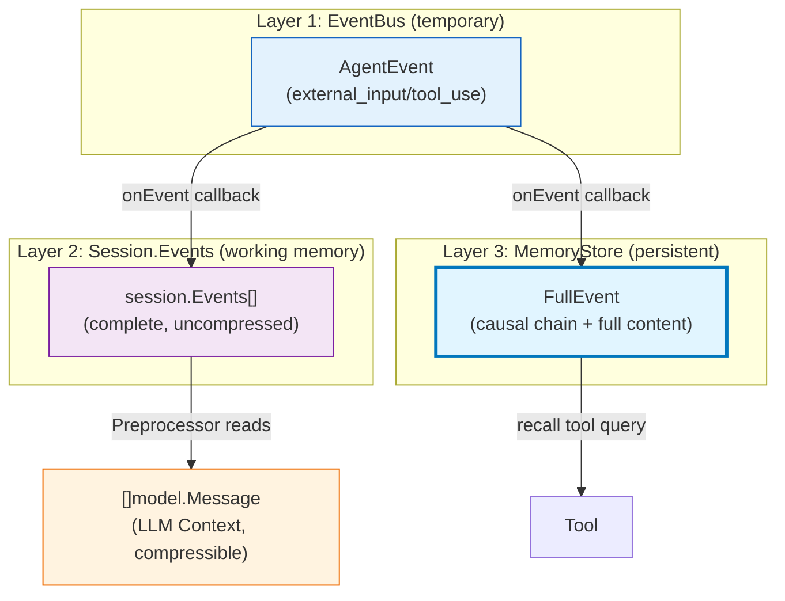
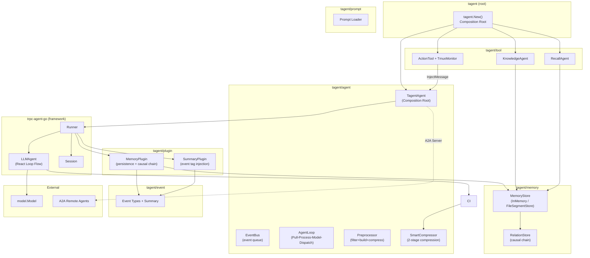
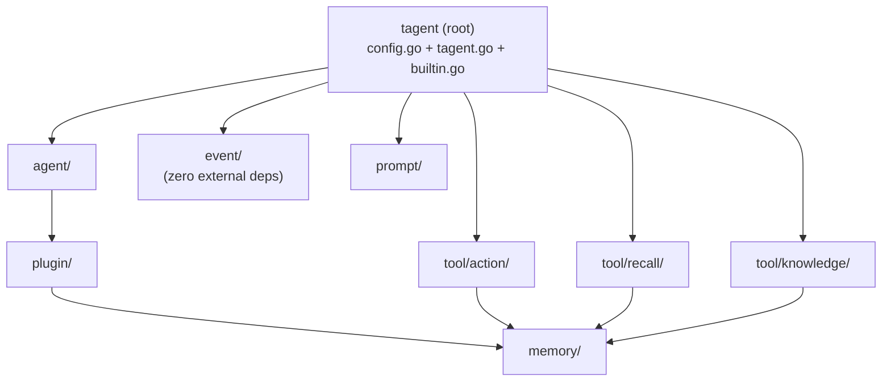
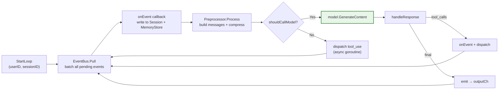
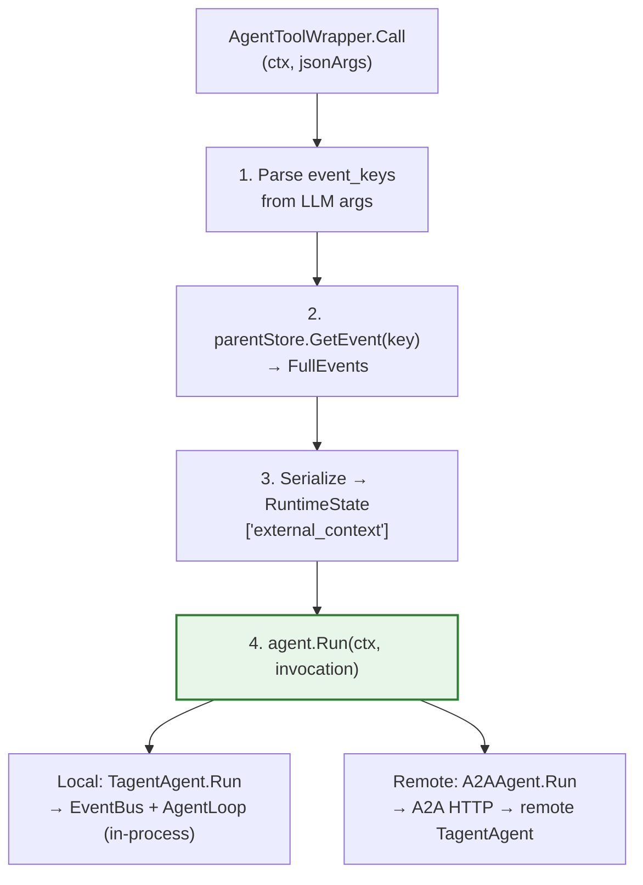
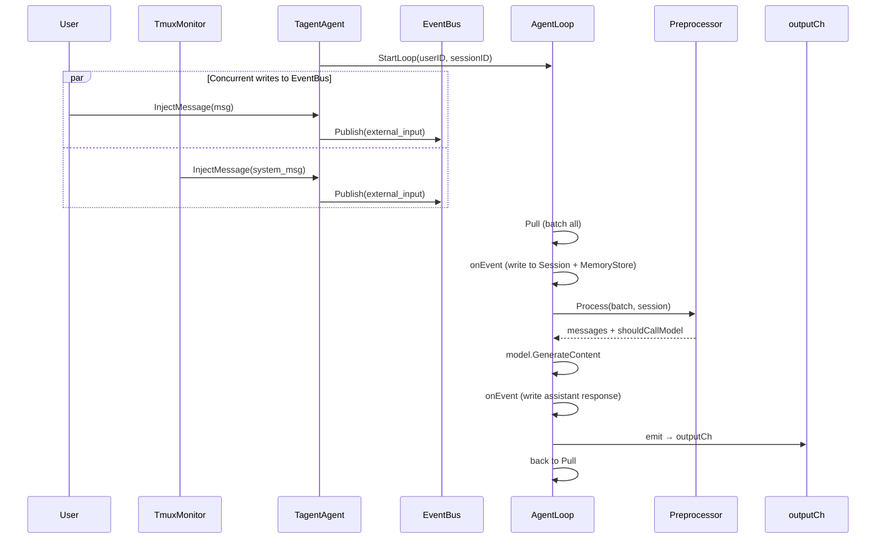
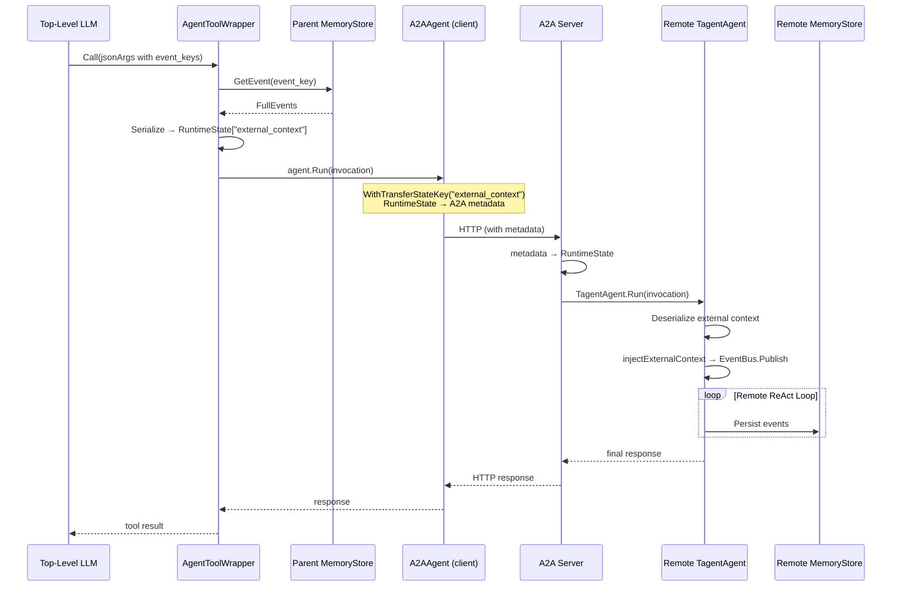
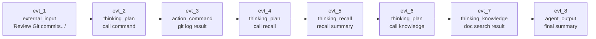

# tagent

A Go-based agent framework embracing event-driven, memory-centric design, built on top of [trpc-agent-go](https://github.com/trpc-group/trpc-agent-go).

[中文文档](README.md)

## Overview

tagent is not a from-scratch agent framework. Built on top of [trpc-agent-go](https://github.com/trpc-group/trpc-agent-go), it replaces the framework's synchronous React Loop with an **event-driven execution engine** (EventBus + AgentLoop + Preprocessor), and **injects** differentiated capabilities — context compression, event persistence, causal memory — through the framework's extension points (OnEvent plugins).

The result is a persistent, event-driven agent that can run as:
- A **persistent event loop** (continuously receives events, processes in batches, waits for next)
- An **A2A server** (exposed to remote agents via A2A protocol)
- An **RL rollout worker** (integrated with AReaL for PPO online training)
- A **trajectory recorder** (records every LLM call to JSONL via `TrajectoryRecorder`, convertible to AReaL SFT/RL datasets for offline training)

## Design Philosophy

| Principle | Meaning |
|-----------|---------|
| **Event-Driven** | All inputs are unified as events on the EventBus; tool results are published back as external_input events, eliminating synchronous blocking. |
| **Pure Engine, No Business Logic** | AgentLoop contains no domain semantics; all decisions are made in the Preprocessor. |
| **Reuse Framework Primitives** | Retains trpc-agent-go's model/tool/event/session/plugin infrastructure, only replacing the execution model. |
| **Sub-Agent Isolation** | Each sub-agent has its own EventBus and SmartCompressor; no shared mutable state. |
| **Async Tool Dispatch** | Tool execution runs in independent goroutines; results are published back to the bus as events. |
| **Memory as the Brain** | MemoryStore is the sole component maintaining the complete event chain; Agent and Tool access it on-demand via EventKeys. |
| **View Transformation** | Context compression modifies only the messages sent to the LLM — it never touches Session or MemoryStore original data. |
| **Separation of Concerns** | Application wiring (`tagent.New()` factory) lives in root package `tagent.go`; the `agent/` package focuses on core mechanisms only. |
| **Event Context Propagation** | The top-level agent's LLM context is an event record stream. Sub-agents receive `event_key` to fetch full context from MemoryStore. |
| **Information Isolation** | Session stores lightweight `EventReference`; full event data lives in `MemoryStore`. Compression and LLM views are independent of stored data. |

> Detailed design rationale: [agent-architecture.md §1](docs/wiki/agent/agent-architecture.md)

## Core Concepts

### Memory as the Brain

tagent's central design philosophy is **memory-driven, event-decoupled execution**:

Three layers of data representation, each with a distinct purpose:

| Layer | Location | Responsibility | Lifetime |
|-------|----------|---------------|----------|
| **EventBus AgentEvent** | Agent memory | Temporary trigger, distinguishes external_input / tool_use | Publish → Pull, then discarded |
| **Session.Events** | session.Session | Working memory, sole history source for Preprocessor | During session lifetime |
| **MemoryStore FullEvent** | File/DB | Long-term memory, recall tool queries | Permanent |



**Key constraints**:
- **Session.Events is the sole history source** — AgentLoop does not maintain its own history
- **onEvent callback is the write entry point** — all events are written to both Session and MemoryStore via onEvent
- **Preprocessor builds LLM Context from Session.Events** — compression applies to full history, not just new batch

### Event Classification

Every interaction — including internal operations like compression and tool calls — is an event:

| Category | Event Type | Trigger | Stored in Session? |
|----------|-----------|---------|-------------------|
| **External** | `external_input` | User message, API call, TmuxMonitor injection | Yes (as EventReference) |
| **External** | `agent_output` | Agent's final response (no tool_calls) | Yes |
| **Action** | `action_command` | Tool/command execution result | Yes |
| **Thinking** | `thinking_plan` | Agent planning (assistant with tool_calls) | Yes |
| **Thinking** | `thinking_recall` | Memory recall via RecallAgent | Yes |
| **Thinking** | `thinking_knowledge` | Knowledge retrieval via KnowledgeAgent | Yes |
| **Internal** | `context_compress` | SmartCompressor drops old segments | No (view-only) |

> `context_compress` is a view transformation — it modifies the LLM message list but does not create a Session event.

### Traditional vs tagent

| Dimension | Traditional Agent | tagent |
|-----------|------------------|--------|
| Context passing | Layer-by-layer via function parameters | Shared via MemoryStore + EventKey |
| Agent's view | Knows the complete execution flow | Knows only current task + event keys |
| Tool's view | Passive executor, depends on Agent for context | Autonomously accesses MemoryStore via `event_key` |
| Memory role | Optional component | Core hub (single source of truth) |
| Event granularity | Coarse (request/response) | Fine-grained (every action/thinking) |
| Context overflow | Hard limit or simple truncation | Two-stage compression (task boundary + LLM summary) |

> Details: [event-architecture.md](docs/wiki/event/event-architecture.md), [memory-architecture.md](docs/wiki/memory/memory-architecture.md)

## Architecture

### Module Overview



### Core Modules

| Module | Responsibility | Wiki |
|--------|---------------|------|
| `agent/` | Event-driven engine: `EventBus` (per-agent event queue), `AgentLoop` (Pull-Process-Model-Dispatch pure engine), `Preprocessor` (event filtering+message building+compression), `SmartCompressor` (2-stage compression), `AgentToolWrapper` (sub-agent wrapper), `MeditationManager` (meditation heartbeat) | [agent-architecture.md](docs/wiki/agent/agent-architecture.md) |
| `memory/` | Structured event storage: `InMemoryStore`, `FileSegmentStore` (L0-L3 layered), `RelationStore` (causal chain), `Compactor`, `Tombstone`, `Lifecycle` (TTL) | [memory-architecture.md](docs/wiki/memory/memory-architecture.md) |
| `plugin/` | Framework plugins: `MemoryPlugin` (event persistence + causal chain), `SummaryPlugin` (event tag injection) | [plugin-architecture.md](docs/wiki/plugin/plugin-architecture.md) |
| `tool/` | Callable tools: `KnowledgeAgent` (RAG), `RecallAgent` (memory recall), `ActionTool` (shell/tmux execution + TmuxMonitor) | [tool-architecture.md](docs/wiki/tool/tool-architecture.md) |
| `event/` | Event type system: type inference (`ExtractEventType`), summary generation (`GenerateEventSummary`), strict no-truncation policy | [event-architecture.md](docs/wiki/event/event-architecture.md) |
| `prompt/` | Prompt template loader: single file, directory, composite, bootstrap-style loading | [prompt-architecture.md](docs/wiki/prompt/prompt-architecture.md) |
| `config.go` | Declarative config: YAML/JSON serializable `Config` → `AgentConfig` → `MemoryConfig` / `ToolRef` | — |
| `tagent.go` | Composition root: `tagent.New(cfg, opts...)` wires Config + runtime options into a complete agent | — |

### Module Dependencies



All dependencies are one-way, no cycles.

## Core Mechanisms

### 1. Persistent Event Loop

tagent's core runtime model. The agent acts as a persistent, OS-like process: continuously receiving events (user input, TmuxMonitor callbacks), processing them in batches, and waiting for the next batch.



Key design: AgentLoop is a pure engine. All business decisions (event filtering, shouldCallModel, compression) live in Preprocessor. onEvent callback is invoked before Preprocessor to ensure Session.Events contains the latest events.

> Details: [agent-architecture.md §7](docs/wiki/agent/agent-architecture.md)

### 2. Two-Stage Context Compression

When token usage exceeds the threshold (`MaxTokens * CompressThreshold`), `SmartCompressor` activates in `Preprocessor.Process`:

- **Stage 1 — Task boundary drop**: Split messages into `TaskSegment`s by task boundaries (assistant messages without tool_calls = task complete). Drop old segments, keep recent N (`KeepRecentTasks`, default 2).
- **Stage 2 — LLM summary** (optional): Generate batched LLM summaries of dropped segments. Summaries are injected as system messages, replacing raw conversation history.

Multi-round compression: if one round isn't enough, `KeepRecentTasks` is decremented and compression runs again (up to 5 rounds).

**View transformation principle**: compression modifies only the `[]model.Message` built by Preprocessor — Session.Events and MemoryStore data are never touched.

> Details: [agent-architecture.md §9](docs/wiki/agent/agent-architecture.md)

### 3. Event-Driven Memory (Causal Chain + EventKey)

AgentLoop writes every event to Session and MemoryStore via the onEvent callback:

1. **Infer event type** (`external_input`, `agent_output`, `action_command`, etc.)
2. **Generate Snowflake EventKey** (64-bit: PartitionID + Timestamp + Sequence)
3. **Build causal chain** via `RelationStore.SetParent` — each event points to its predecessor
4. **Persist FullEvent** to MemoryStore (immutable)
5. **Append event.Event** to Session.Events (with StateDelta: event_key/type)

The LLM sees event keys in message prefixes (`[evt_123456|agent_output]`), enabling it to pass relevant keys to sub-agents for context retrieval.

> Details: [memory-architecture.md](docs/wiki/memory/memory-architecture.md), [plugin-architecture.md](docs/wiki/plugin/plugin-architecture.md)

### 4. Sub-Agent Invocation (AgentToolWrapper + A2A)

`AgentToolWrapper` wraps any `agent.Agent` interface (local `TagentAgent` or remote `A2AAgent`) as a callable tool. The invocation flow:



**Remote path**: `WithTransferStateKey("external_context")` automatically maps RuntimeState to A2A message metadata, transparent across process boundaries.

**Configuration layering**:

| Layer | Responsibility | Config |
|-------|---------------|--------|
| tagent YAML | Agent definition (model, prompt, tools, event_params) | Declarative YAML |
| `ToolRef.Remote` | Connection info ("where is this agent?") | `remote.url` field |
| trpc Go options | Communication details (A2A protocol, TransferStateKey) | Auto-generated by `tagent.go` |

> Details: [agent-architecture.md §13-14](docs/wiki/agent/agent-architecture.md), [tool-architecture.md §4](docs/wiki/tool/tool-architecture.md)

## Key Scenarios

### Scenario 1: Persistent Event Loop (Long-Running)



### Scenario 2: Sub-Agent with A2A Remote Communication



## Scenario Walkthrough

> A concrete example showing how tagent's modules collaborate in a real task.

### Task: "Review recent Git commits, summarize the changes, and search for related design documents"

User sends this request in **Persistent Event Loop mode**. The agent needs multiple ReAct iterations, invokes two sub-agents, and triggers context compression.

### Step-by-Step Module Collaboration

| Step | Module | Action | Event Type | MemoryStore Operation |
|------|--------|--------|-----------|----------------------|
| 1 | **User** → `TagentAgent` | `InjectMessage("Review recent Git commits...")` | — | — |
| 2 | **AgentLoop** | `EventBus.Pull` → `onEvent` (write to Session + MemoryStore) | — | — |
| 3 | **onEvent** → **MemoryPlugin** | Wrap external_input as event.Event → `OnEvent`: infer type, generate EventKey, persist FullEvent, build causal chain → `sessionSvc.AppendEvent` | `external_input` | Store FullEvent (immutable), append to Session.Events |
| 4 | **Preprocessor** | Build messages from `session.Events`, inject `[evt_KEY\|external_input]` prefix, check token budget | — | — |
| 5 | **AgentLoop** → LLM | LLM decides to call `action` tool | `thinking_plan` | `onEvent` persists assistant message with tool_calls |
| 6 | **ActionTool** | goroutine executes `git log --oneline -10`, result published as external_input back to bus | `action_command` | Next round onEvent persists tool result, EventKey → causal parent = step 5 |
| 7 | **AgentLoop** → LLM | LLM sees git log, decides to call `recall` sub-agent | `thinking_plan` | `onEvent` persists new assistant message with tool_calls |
| 8 | **AgentToolWrapper** | Parse `event_keys` from LLM args → `parentStore.GetEvent(key)` → serialize context → `RuntimeState["external_context"]` | — | Read FullEvents from MemoryStore (no write) |
| 9 | **RecallAgent** (sub-agent) | `agent.Run()` → independent EventBus + AgentLoop → returns summary | `thinking_recall` | Sub-agent persists its own events; parent sees only tool result |
| 10 | **Preprocessor** | Token budget exceeded → `SmartCompressor.Compress()`: drop old TaskSegment, generate LLM summary | `context_compress` *(view-only)* | **No MemoryStore change**. `collectCompressedKeys` extracts EventKeys |
| 11 | **AgentLoop** → LLM | LLM sees: `[compress_event]` + `[summary]` + `[recent: recall result]`. Decides to call `knowledge` sub-agent | `thinking_plan` | `onEvent` persists with `[evt_KEY\|thinking_plan]` prefix |
| 12 | **KnowledgeAgent** (sub-agent) | `AgentToolWrapper` → `agent.Run()` → independent AgentLoop → returns docs | `thinking_knowledge` | Sub-agent persists its own events |
| 13 | **AgentLoop** → LLM | LLM synthesizes compressed history + recall + knowledge → generates final response (no tool_calls) | `agent_output` | `onEvent` persists final response, EventKey → causal parent = step 12 |
| 14 | **AgentLoop** | emit → outputCh → back to `EventBus.Pull` | — | — |

### Event Chain (Causal)

> `context_compress` (step 10) is a **view transformation** — it modifies the LLM message list but does NOT create a MemoryStore event. It is therefore excluded from the causal chain.



> Step 10's `context_compress` occurs between evt_5 and evt_6 in wall-clock time, but since it's view-only, the causal chain skips directly from evt_5 → evt_6.

### What Each Module Sees

| Module | What it sees | What it doesn't see |
|--------|-------------|-------------------|
| **LLM (top-level)** | Event summaries with `[evt_KEY\|type]` prefixes; compressed view after step 10 | FullEvent content of old segments (dropped by SmartCompressor) |
| **ActionTool** | Command string from LLM; executes independently | Why this command was chosen; what other tools were called |
| **RecallAgent** | External context (event summaries from parent); its own React loop | Parent agent's full Session; other sub-agent results |
| **KnowledgeAgent** | External context + search query; its own React loop | Parent's compression history; ActionTool results |
| **MemoryStore** | **Everything**: all FullEvents, causal chain, timestamps | — (single source of truth) |
| **Session** | Lightweight EventReference[] (key + type + summary) | FullEvent content (lives in MemoryStore) |

### Key Observations

1. **Tool autonomy**: RecallAgent and KnowledgeAgent each run their own internal React loop. The top-level agent only sees their final result — not their internal iterations.

2. **Compression is safe**: Step 10 drops steps 3-6 from the LLM's view, but MemoryStore still holds all FullEvents. If the LLM needs detail, it can call `recall` with the compressed EventKeys listed in the `[context_compress]` message.

3. **Causal chain integrity**: Each event's `EventKey` encodes its causal parent. Even after compression, the MemoryStore chain `evt_1 → evt_2 → ... → evt_8` is intact and traceable.

4. **Async events**: If TmuxMonitor injects a message during step 7, it goes to EventBus. AgentLoop won't process it until the next `Pull` batch.

## Quick Start

### 1. Define Configuration (YAML)

```yaml
# config.yaml
entry: tagent
prompt_dir: resources/prompts
model: glm-4-flash

agents:
  tagent:
    system_prompt:
      files: [AGENTS.md, SOUL.md, USER.md, TOOLS.md]
    memory:
      type: file
      path: /data/tagent/events
    tools:
      # Local sub-agent (in-process)
      - agent: knowledge
        description_file: knowledge_tool_desc.md
        event_params: [event_keys]
      # Remote sub-agent (A2A communication)
      - agent: remote-recall
        description_file: recall_tool_desc.md
        event_params: [event_keys]
        remote:
          url: "http://recall-service:8088"
      # Plain tool
      - kind: tool
        id: command
        description_file: command_tool_desc.md

  knowledge:
    model: glm-4-flash
    prompt:
      files: [knowledge_agent.md]
    memory:
      type: memory
    max_tool_iterations: 5
```

### 2. Persistent Event Loop Mode

```go
// Start persistent loop
outputCh, err := ta.StartLoop("userID", "sessionID")
if err != nil { panic(err) }

// Inject messages from any goroutine (user input, external callbacks)
ta.InjectMessage(model.Message{
    Role:    model.RoleUser,
    Content: "Help me execute a command",
})

// Consume events
for evt := range outputCh {
    if evt.IsFinalResponse() {
        println("Final:", evt.Message.Content)
    }
    // Handle tool calls, intermediate events, etc.
}

// Graceful shutdown
ta.StopLoop()
```

### 3. A2A Server Mode

```go
// Expose TagentAgent as an A2A server for remote agents to call
srv, err := agent.NewA2AServer(ta, "0.0.0.0:8088")
if err != nil { panic(err) }
go srv.Start("0.0.0.0:8088")
```

`tagent.New()` accepts a declarative `Config` (serializable from YAML/JSON) plus runtime `Option` functions for non-serializable dependencies (model instances, MCP tool sets, etc.).

## Configuration Reference

### Agent-Level Options

| Option | Default | Description |
|--------|---------|-------------|
| `model` | (required) | LLM model name |
| `system_prompt.files` | `[]` | Prompt files to load (supports bootstrap ordering) |
| `memory.type` | `memory` | `memory` (in-memory) or `file` (persistent) |
| `memory.path` | `""` | File path (required when `type: file`) |
| `max_tool_iterations` | `200` | Max ReAct loop iterations |
| `max_tokens` | `8000` | Token budget for context compression |
| `compress_threshold` | `0.8` | Compression trigger ratio (`max_tokens * threshold`) |
| `temperature` | `0.7` | LLM temperature |

### Tool Reference Options

| Field | Description |
|-------|-------------|
| `agent` | Sub-agent name (for `kind: agent` tools) |
| `kind` | `agent` (default) or `tool` |
| `id` | Tool ID (for `kind: tool`) |
| `description_file` | Tool description prompt file |
| `event_params` | Parameters that accept event keys (e.g., `[event_keys]`) |
| `remote.url` | Remote agent URL (enables A2A communication) |

## Project Structure

```
tagent/
├── agent/          # Core: EventBus, AgentLoop, Preprocessor, SmartCompressor, AgentToolWrapper, MeditationManager
├── builtin.go      # init(): register built-in tool factories
├── config.go       # Declarative config: Config, AgentConfig, ToolRef, PromptConfig
├── docs/wiki/      # Architecture documents (per-module)
├── event/          # Event types: ExtractEventType, GenerateEventSummary
├── examples/       # Examples (wechat-bot)
├── memory/         # Storage: InMemoryStore, FileSegmentStore, RelationStore, Compactor
├── openspec/       # Design specs and change records
├── plugin/         # Plugins: MemoryPlugin, SummaryPlugin
├── prompt/         # Prompt loader: file, directory, bootstrap
├── resources/      # Prompt files, resources
├── tagent.go       # Composition root: tagent.New(cfg, opts...)
├── testutil/       # Test utilities
├── tool/           # Tools: command, recall, knowledge
└── go.mod
```

## Development

```bash
# Build
go build ./...

# Test
go test ./...

# Run example
cd examples/wechat-bot && go run .
```

### Prerequisites

- Go 1.21+

## License

Apache License 2.0
