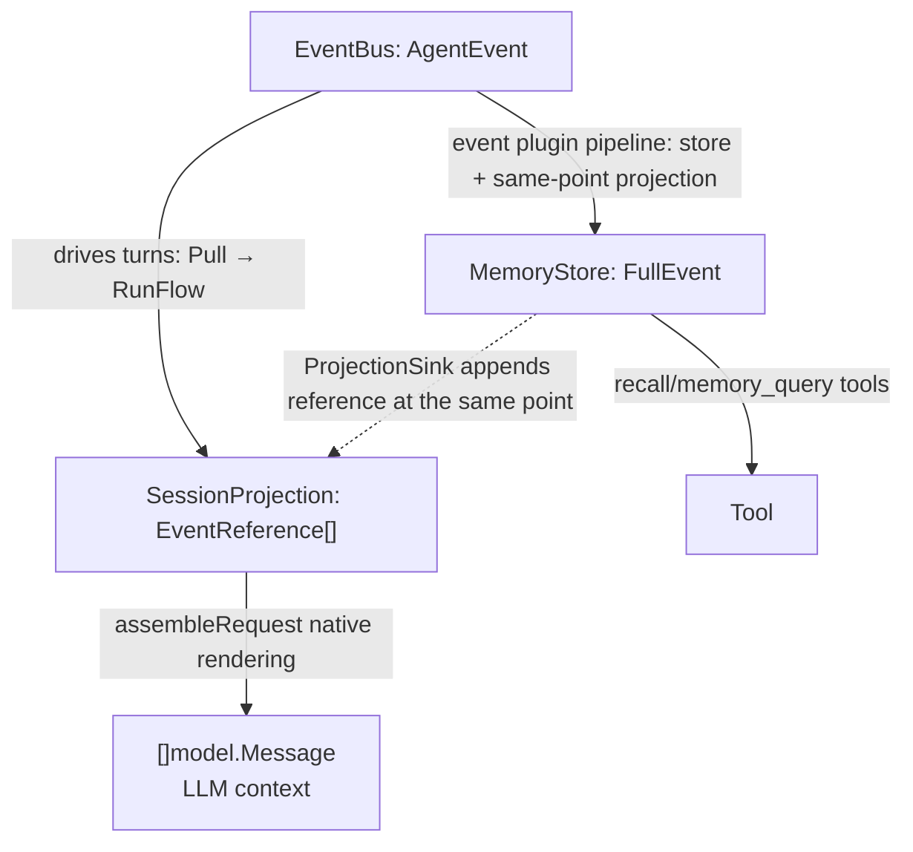
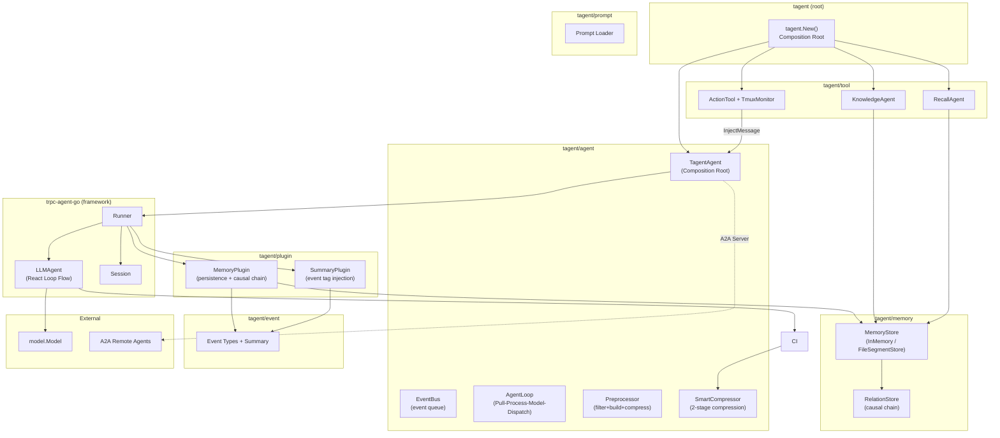
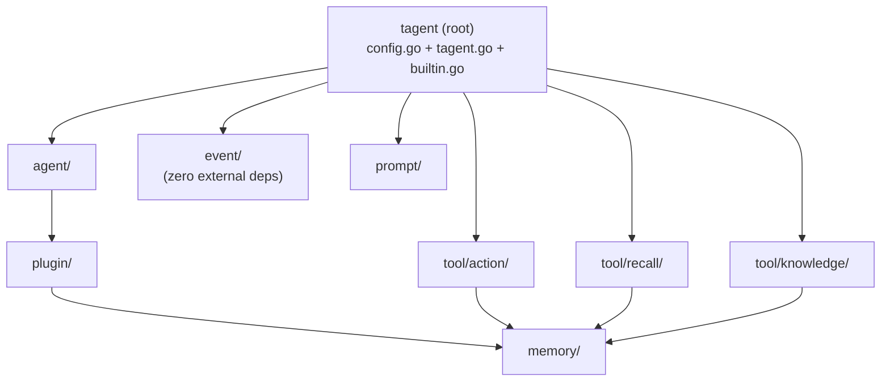
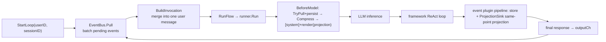
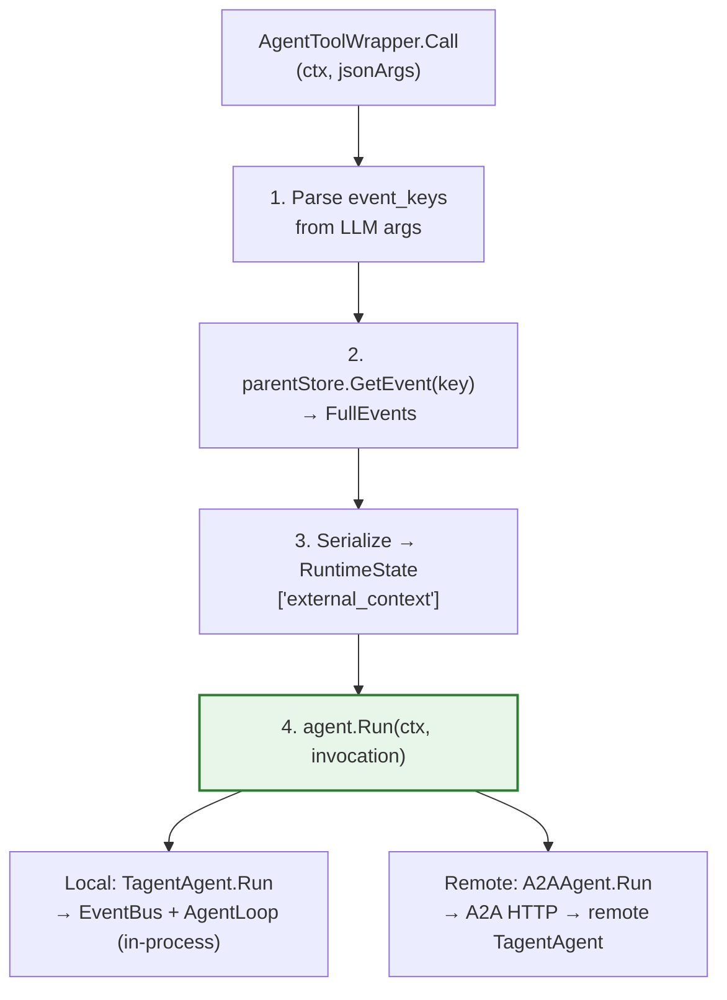
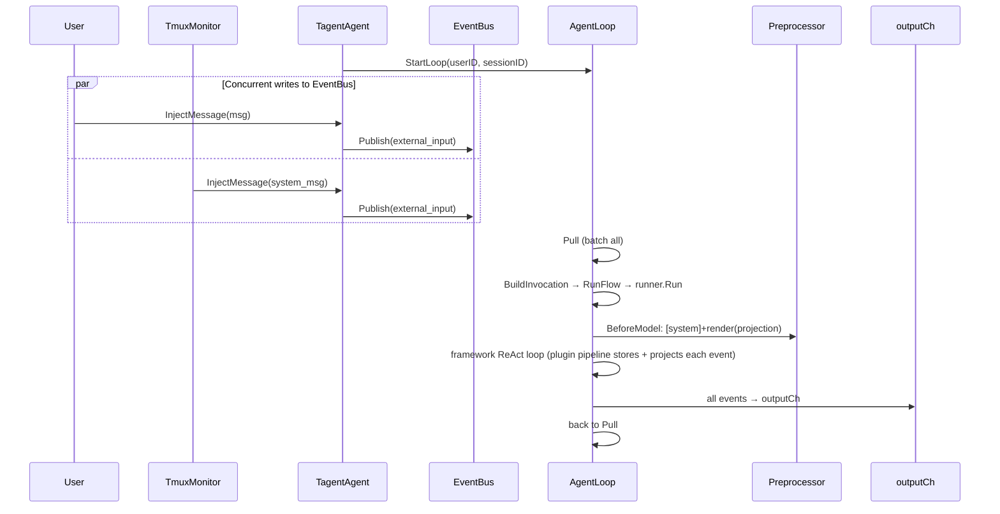
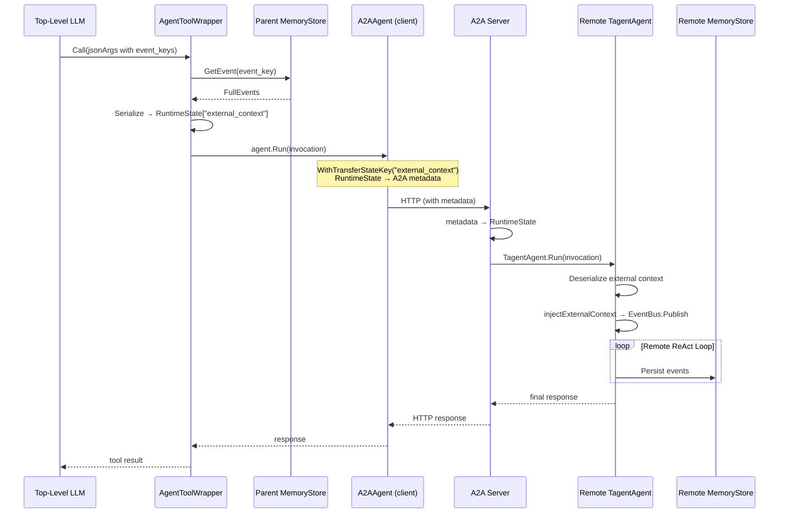
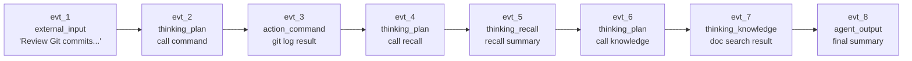

# tagent

A Go-based agent framework embracing event-driven, memory-centric design, built on top of [trpc-agent-go](https://github.com/trpc-group/trpc-agent-go).

[中文文档](README.md)

## Overview

tagent is not a from-scratch agent framework. Built on top of [trpc-agent-go](https://github.com/trpc-group/trpc-agent-go), it replaces the framework's synchronous React Loop with an **event-driven execution engine** (EventBus + AgentLoop + Preprocessor), and **injects** differentiated capabilities — context compression, event persistence, causal memory — through the framework's extension points (OnEvent plugins).

The result is a persistent, event-driven agent that can run as:
- A **persistent event loop** (continuously receives events, processes in batches, waits for next)
- An **A2A server** (exposed to remote agents via A2A protocol)
- An **RL rollout worker** (integrated with AReaL for PPO online training)
- A **trajectory recorder** (records every LLM call to JSONL via `TrajectoryRecorder`, convertible to AReaL SFT/RL datasets for offline training)

## Design Philosophy

tagent follows an **event-driven, memory-centric** design. The core philosophy: **inputs is a projection of the event flow, the event bus carries the event flow, and when inputs is full it triggers Compact and memory persistence**.

### Four Invariants

| Invariant | Meaning | Code |
|-----------|---------|------|
| **① inputs is a projection** | Bounded working memory and the **sole assembly source** of LLM input | `assembleRequest = [system] + render(projection)`; never reads back the framework message tail |
| **② Unified writes** | An event is stored ⇔ projected, exactly once, atomically at the same point | `MemoryPlugin.OnEvent` stores, then appends the reference via the ctx-carried `ProjectionSink` |
| **③ Ordering is a construction guarantee** | The projection is complete at BeforeModel time by construction, not by lucky timing | The framework's completion-wait on tool-result events: the runner releases the next round only after plugins + session processing finish |
| **④ Compact only modifies the projection** | Touches neither the event flow nor permanent storage | `Compactor.Compact` replaces old references with a summary reference |

### Reply vs. Notification: Two Orthogonal Tool-Result Semantics

This is the core dividing line of tagent's async design:

- **In-turn = protocol reply**: synchronous tool exchanges use the native tool-call protocol (assistant ToolCalls ↔ role=tool results, paired by ToolID). A long task that exceeds the sync window also returns an **ACK (with task id)** as this call's protocol reply, closing the pairing immediately.
- **Cross-turn = notification event**: an async result (`task_settled`) is not a reply to some pending call — it is a **self-contained notification input event**, correlated with the earlier ACK by task id at the content level. Results carry no protocol constraint with tools, so compression/loss/reordering can never create orphans.

Correspondingly, timeline rendering obeys one iron rule: **the system never generates textual call syntax into assistant history** — any textual call notation (arrows, brackets, any format) gets imitated by models under comprehension pressure, producing fabricated call text that executes nothing (established after two live-run failures). In-turn history is rendered in native protocol form (inside the training distribution); un-pairable residual results are demoted at render time to user-side input notes (content and correlation id preserved), so any compression cut still yields a legal native sequence.

The complete role-attribution rule: **instructions → system (always a single message, always first); observations (task board / history archive / notifications) → user-side input events; assistant always equals tokens the LLM actually produced**. A compression summary is produced by the agent runtime but was never said by the LLM (placing it in assistant history would make it an imitation template), nor may it be promoted to instruction authority (paraphrased external content in system role is a prompt-injection amplifier) — hence it renders as a user-level "〔历史归档〕" archival note. Anti-forgery does not rely on roles but on **forgery having no semantics**: real references travel the metadata channel inside the projection (EventKey/StateDelta); imitated text parses into nothing.

### Event Metadata Contract: A First-Class Framework Duty

Event metadata injection and parsing are guaranteed at a single point by the framework (`event/metadata.go`): unique `MetaKey*` constants, unified `ParseEventMeta`, and the `meta_*` prefix carrying business-defined metadata (e.g. chat_id routing). The canonical string form of an EventKey is **hexadecimal** (`FormatEventKey/ParseEventKey`), used consistently across the `[evt_KEY|type]` timeline prefix, compaction key lists, StateDelta, and recall tool I/O.

### Relationship with trpc-agent-go

tagent builds on [trpc-agent-go](https://github.com/trpc-group/trpc-agent-go), reusing the framework's interface primitives (Agent, Model, Tool, Plugin, Session, Event, Invocation) and its ReAct execution. tagent's extension layer consists of: EventBus, `runEventLoop`, SessionProjection, MemoryPlugin, SummaryPlugin, ContextManager (with SmartCompressor/Compactor), AgentToolWrapper, MeditationManager, and TrajectoryRecorder.

> Detailed design rationale: [agent-architecture.md §1](docs/wiki/agent/agent-architecture.md)

## Core Concepts

### Memory as the Brain

tagent's central design philosophy is **memory-driven, event-decoupled execution**:

Three layers of data representation, each with a distinct purpose:

| Layer | Location | Responsibility | Lifetime |
|-------|----------|---------------|----------|
| **EventBus AgentEvent** | Agent memory | Event trigger queue | Publish → Pull, then discarded |
| **SessionProjection EventReference[]** | Agent memory | Projection (bounded working memory) | Agent lifetime, Compactable |
| **MemoryStore FullEvent** | Memory/File/DB | Permanent storage (immutable) | Permanent |



**Key constraints**:
- `SessionProjection` keeps only lightweight `EventReference`s (key + type + summary), never full content
- Storage and projection both happen inside the event plugin pipeline, at the same point, exactly once; degenerate events (nil-Response, streaming partials, empty finals) are guarded out at the pipeline entrance — neither stored nor projected
- `SmartCompressor` only modifies the `[]model.Message` sent to the LLM; `Compactor` only cleans old references in `SessionProjection`; neither deletes from `MemoryStore`
- `MemoryStore` is the sole complete event chain; Agents and Tools access it on demand via `EventKey`

### Event Classification

Every interaction — including tool calls and internal planning — becomes an `event.Event` produced by the framework Runner and turned into a persistent event by the plugin pipeline:

| Category | Event Type | Trigger | Projected? |
|----------|-----------|---------|-----------|
| **External** | `external_input` | User message, API call, task_settled notification, meditation | Yes |
| **External** | `agent_output` | Agent's final response (no tool_calls) | Yes |
| **Action** | `action_command` | Tool/command execution result | Yes |
| **Thinking** | `thinking_plan` | Assistant message with tool_calls | Yes |
| **Thinking** | `thinking_recall` | RecallAgent output | Yes |
| **Thinking** | `thinking_knowledge` | KnowledgeAgent output | Yes |
| **Internal** | `context_compress` | Summary marker after SmartCompressor/Compactor | Yes (summary reference inside the projection) |

### Traditional vs tagent

| Dimension | Traditional Agent | tagent |
|-----------|------------------|--------|
| Context passing | Layer-by-layer via function parameters | Shared via MemoryStore + EventKey |
| Agent's view | Knows the complete execution flow | Knows only current task + event keys |
| Tool's view | Passive executor, depends on Agent for context | Autonomously accesses MemoryStore via `event_key` |
| Memory role | Optional component | Core hub (single source of truth) |
| Event granularity | Coarse (request/response) | Fine-grained (every action/thinking) |
| Context overflow | Hard limit or simple truncation | Two-stage compression (task boundary + LLM summary) |

> Details: [event-architecture.md](docs/wiki/event/event-architecture.md), [memory-architecture.md](docs/wiki/memory/memory-architecture.md)

## Architecture

### Module Overview



### Core Modules

| Module | Responsibility | Wiki |
|--------|---------------|------|
| `agent/` | Event-driven engine: `EventBus` (per-agent event queue), `runEventLoop` (persistent loop), `ContextManager` (turn orchestration + BeforeModel assembly), `SmartCompressor`/`Compactor` (2-stage compression), `AgentToolWrapper` (sub-agent wrapper), `MeditationManager` (dual-gated meditation heartbeat: idle + novelty) | [agent-architecture.md](docs/wiki/agent/agent-architecture.md) |
| `memory/` | Structured event storage: `InMemoryStore`, `FileSegmentStore` (L0-L3 layered), `RelationStore` (causal chain), `Compactor`, `Tombstone`, `Lifecycle` (TTL) | [memory-architecture.md](docs/wiki/memory/memory-architecture.md) |
| `plugin/` | Framework plugins: `MemoryPlugin` (event persistence + causal chain), `SummaryPlugin` (event tag injection) | [plugin-architecture.md](docs/wiki/plugin/plugin-architecture.md) |
| `tool/` | Callable tools: `KnowledgeAgent` (RAG), `RecallAgent` (memory recall), `ActionTool` (shell/tmux execution + TmuxMonitor) | [tool-architecture.md](docs/wiki/tool/tool-architecture.md) |
| `event/` | Event type system: type inference (`ExtractEventType`), summary generation (`GenerateEventSummary`), strict no-truncation policy | [event-architecture.md](docs/wiki/event/event-architecture.md) |
| `prompt/` | Prompt template loader: single file, directory, composite, bootstrap-style loading | [prompt-architecture.md](docs/wiki/prompt/prompt-architecture.md) |
| `config.go` | Declarative config: YAML/JSON serializable `Config` → `AgentConfig` → `MemoryConfig` / `ToolRef` | — |
| `tagent.go` | Composition root: `tagent.New(cfg, opts...)` wires Config + runtime options into a complete agent | — |

### Module Dependencies



All dependencies are one-way, no cycles.

## Core Mechanisms

### 1. Persistent Event Loop

tagent's core runtime model. The agent is a persistent entity that continuously receives events, processes them in batches, then waits for the next batch.



Key design:
- `runEventLoop` is the sole consumer; it batches pulled events into one message. Every pulled event drives a turn — the loop does not rely on a bus echo to self-trigger
- The actual ReAct loop runs inside the framework `runner.Run`; tagent orchestrates via `ContextManager`
- BeforeModel unified callback: TryPull new events → persist into store+projection → Compress → rebuild messages as `[system] + render(projection)` (single-line, no current-turn extraction heuristic)
- `RunFlow` retries with exponential backoff on failure (100ms → 200ms → 400ms, up to 3 times); a degenerate empty turn (no tool call + empty final, an occasional model hiccup) is retried once, with forensics logging (reasoning/finish_reason/error)
- The active async task board is injected as a **user-level virtual event** (declared a system observation snapshot, do-not-imitate); it never enters history or compression

> Details: [agent-architecture.md §7](docs/wiki/agent/agent-architecture.md)

### 2. Context Compression and Projection Cleanup

tagent has two independent context management operations:

**SmartCompressor (compress the LLM view)**: activates when token usage exceeds `MaxTokens * CompressThreshold`:
- **Stage 1 — task-boundary drop**: split into `TaskSegment`s, drop old ones, keep recent N (`KeepRecentTasks`, default 2)
- **Stage 2 — LLM summary** (optional): batched LLM summaries of dropped segments (summaries retain correlation ids: task id/tool_id/tool name)
- **Target**: `[]model.Message` (LLM view); touches neither the projection nor MemoryStore

**Compactor (clean the projection)**: triggered when the compressed view still exceeds `MaxTokens`:
- **Strategy**: split the projection by task boundaries, keep recent N complete tasks' references, replace old ones with a single summary reference
- **Target**: `SessionProjection`; does not modify MemoryStore

| Operation | Target | Trigger |
|-----------|--------|---------|
| SmartCompressor | `[]model.Message` (LLM view) | token > threshold |
| Compactor | `SessionProjection` | still over limit after SmartCompress |

**Three-tier mutability**: messages (SmartCompressor may modify), SessionProjection (Compactor may clean), MemoryStore (never mutable).

> Details: [agent-architecture.md §9](docs/wiki/agent/agent-architecture.md)

### 3. Event-Driven Memory

The framework Runner invokes registered plugins on each produced event:

1. **MemoryPlugin**:
   - Entrance guards: nil-Response, streaming partials, and degenerate empty finals are skipped (neither stored nor projected); model-fabricated `[evt_…]` prefixes in assistant output are stripped before storage
   - Derives `PartitionID` from `Invocation.AgentName` (the snowflake key's sign bit is always 0: positive keys are real events, negative keys are reserved for compression summary references)
   - Generates the Snowflake `EventKey`, persists the `FullEvent` to `MemoryStore`, maintains the causal chain via `RelationStore.SetParent`
   - **Same-point projection**: appends the `EventReference` via the ctx-carried `ProjectionSink` (store and project exactly once, atomically)
   - Writes `event_key` (hex), `partition_id`, `event_type`, `event_summary` into `Event.StateDelta`
2. **SummaryPlugin**: extracts the event type from the message and writes a summary into `Event.Tag`

The consumer (outputCh) only reads event metadata (`ParseEventMeta`) for display and routing; it no longer participates in projection building.

> Details: [memory-architecture.md](docs/wiki/memory/memory-architecture.md), [plugin-architecture.md](docs/wiki/plugin/plugin-architecture.md)

### 4. Sub-Agent Invocation (AgentToolWrapper + A2A)

`AgentToolWrapper` wraps any `agent.Agent` interface (local `TagentAgent` or remote `A2AAgent`) as a callable tool. The invocation flow:



**Remote path**: `WithTransferStateKey("external_context")` automatically maps RuntimeState to A2A message metadata, transparent across process boundaries.

**Configuration layering**:

| Layer | Responsibility | Config |
|-------|---------------|--------|
| tagent YAML | Agent definition (model, prompt, tools, event_params) | Declarative YAML |
| `ToolRef.Remote` | Connection info ("where is this agent?") | `remote.url` field |
| trpc Go options | Communication details (A2A protocol, TransferStateKey) | Auto-generated by `tagent.go` |

> Details: [agent-architecture.md §13-14](docs/wiki/agent/agent-architecture.md), [tool-architecture.md §4](docs/wiki/tool/tool-architecture.md)

## Key Scenarios

### Scenario 1: Persistent Event Loop (Long-Running)



### Scenario 2: Sub-Agent with A2A Remote Communication



## Scenario Walkthrough

> A concrete example showing how tagent's modules collaborate in a real task.

### Task: "Review recent Git commits, summarize the changes, and search for related design documents"

User sends this request in **Persistent Event Loop mode**. The agent needs multiple ReAct iterations, invokes two sub-agents, and triggers context compression.

### Step-by-Step Module Collaboration

| Step | Module | Action | Event Type | MemoryStore Operation |
|------|--------|--------|-----------|----------------------|
| 1 | **User** → `TagentAgent` | `InjectMessage("Review recent Git commits...")` | — | — |
| 2 | **runEventLoop** | `EventBus.Pull` → `BuildInvocation` → `RunFlow` | — | — |
| 3 | **Plugin pipeline** | Store FullEvent + same-point projection via ProjectionSink | `external_input` | Store FullEvent (immutable) |
| 4 | **BeforeModel** | `[system] + render(projection)` with `[evt_KEY\|type]` hex prefixes; token budget check | — | — |
| 5 | **Runner** → LLM | LLM calls `action` tool (native tool_calls) | `thinking_plan` | Stored + projected by pipeline |
| 6 | **ActionTool** | Executes `git log --oneline -10`; result returns through the native tool protocol | `action_command` | Stored + projected; causal parent = step 5 |
| 7 | **Runner** → LLM | LLM calls `recall` sub-agent | `thinking_plan` | Stored + projected |
| 8 | **AgentToolWrapper** | Parse `event_keys` → `parentStore.GetEvent(key)` → `RuntimeState["external_context"]` | — | Read only |
| 9 | **RecallAgent** (sub-agent) | `agent.Run()` → independent bus/projection → returns summary | `thinking_recall` | Sub-agent persists to its own partition |
| 10 | **BeforeModel** | Budget exceeded → `SmartCompressor` (view) → still over → `Compactor` (projection) | `context_compress` | **No MemoryStore change** |
| 11 | **Runner** → LLM | LLM sees archival note + retained recents; calls `knowledge` | `thinking_plan` | Stored + projected |
| 12 | **KnowledgeAgent** (sub-agent) | Independent run → returns docs | `thinking_knowledge` | Sub-agent's own partition |
| 13 | **Runner** → LLM | Final response (no tool_calls) | `agent_output` | Stored + projected; causal parent = step 12 |
| 14 | **runEventLoop** | final → outputCh → back to `EventBus.Pull` | — | — |

### Event Chain (Causal)

> `context_compress` (step 10) is a **view transformation** — it modifies the LLM message list but does NOT create a MemoryStore event. It is therefore excluded from the causal chain.



> Step 10's `context_compress` occurs between evt_5 and evt_6 in wall-clock time, but since it's view-only, the causal chain skips directly from evt_5 → evt_6.

### What Each Module Sees

| Module | What it sees | What it doesn't see |
|--------|-------------|-------------------|
| **LLM (top-level)** | Event summaries with `[evt_KEY\|type]` prefixes; compressed view after step 10 | FullEvent content of old segments (dropped by SmartCompressor) |
| **ActionTool** | Command string from LLM; executes independently | Why this command was chosen; what other tools were called |
| **RecallAgent** | External context (event summaries from parent); its own React loop | Parent agent's full Session; other sub-agent results |
| **KnowledgeAgent** | External context + search query; its own React loop | Parent's compression history; ActionTool results |
| **MemoryStore** | **Everything**: all FullEvents, causal chain, timestamps | — (single source of truth) |
| **Session** | Lightweight EventReference[] (key + type + summary) | FullEvent content (lives in MemoryStore) |

### Key Observations

1. **Tool autonomy**: RecallAgent and KnowledgeAgent each run their own internal React loop. The top-level agent only sees their final result — not their internal iterations.

2. **Compression is safe**: Step 10 drops steps 3-6 from the LLM's view, but MemoryStore still holds all FullEvents. If the LLM needs detail, it can call `recall` with the compressed EventKeys listed in the `[context_compress]` message.

3. **Causal chain integrity**: Each event's `EventKey` encodes its causal parent. Even after compression, the MemoryStore chain `evt_1 → evt_2 → ... → evt_8` is intact and traceable.

4. **Async events**: If TmuxMonitor injects a message during step 7, it goes to EventBus. AgentLoop won't process it until the next `Pull` batch.

## Quick Start

### 1. Define Configuration (YAML)

```yaml
# config.yaml
entry: tagent
prompt_dir: resources/prompts
model: glm-4-flash

agents:
  tagent:
    system_prompt:
      files: [AGENTS.md, SOUL.md, USER.md, TOOLS.md]
    memory:
      type: file
      path: /data/tagent/events
    tools:
      # Local sub-agent (in-process)
      - agent: knowledge
        description_file: knowledge_tool_desc.md
        event_params: [event_keys]
      # Remote sub-agent (A2A communication)
      - agent: remote-recall
        description_file: recall_tool_desc.md
        event_params: [event_keys]
        remote:
          url: "http://recall-service:8088"
      # Plain tool
      - kind: tool
        id: command
        description_file: command_tool_desc.md

  knowledge:
    model: glm-4-flash
    prompt:
      files: [knowledge_agent.md]
    memory:
      type: memory
    max_tool_iterations: 5
```

### 2. Persistent Event Loop Mode

```go
// Start persistent loop
outputCh, err := ta.StartLoop("userID", "sessionID")
if err != nil { panic(err) }

// Inject messages from any goroutine (user input, external callbacks)
ta.InjectMessage(model.Message{
    Role:    model.RoleUser,
    Content: "Help me execute a command",
})

// Consume events
for evt := range outputCh {
    if evt.IsFinalResponse() {
        println("Final:", evt.Message.Content)
    }
    // Handle tool calls, intermediate events, etc.
}

// Graceful shutdown
ta.StopLoop()
```

### 3. A2A Server Mode

```go
// Expose TagentAgent as an A2A server for remote agents to call
srv, err := agent.NewA2AServer(ta, "0.0.0.0:8088")
if err != nil { panic(err) }
go srv.Start("0.0.0.0:8088")
```

`tagent.New()` accepts a declarative `Config` (serializable from YAML/JSON) plus runtime `Option` functions for non-serializable dependencies (model instances, MCP tool sets, etc.).

## Configuration Reference

### Agent-Level Options

| Option | Default | Description |
|--------|---------|-------------|
| `model` | (required) | LLM model name |
| `system_prompt.files` | `[]` | Prompt files to load (supports bootstrap ordering) |
| `memory.type` | `memory` | `memory` (in-memory) or `file` (persistent) |
| `memory.path` | `""` | File path (required when `type: file`) |
| `max_tool_iterations` | entry 50 / sub 10 | Max ReAct loop iterations |
| `max_tokens` | `8000` | Token budget for context compression |
| `compress_threshold` | `0.8` | Compression trigger ratio (`max_tokens * threshold`) |
| `temperature` | `0.7` | LLM temperature |

### Tool Reference Options

| Field | Description |
|-------|-------------|
| `agent` | Sub-agent name (for `kind: agent` tools) |
| `kind` | `agent` (default) or `tool` |
| `id` | Tool ID (for `kind: tool`) |
| `description_file` | Tool description prompt file |
| `event_params` | Parameters that accept event keys (e.g., `[event_keys]`) |
| `async` | Whether an agent-kind tool may use the async task layer (default true; `false` forces synchronous execution) |
| `remote.url` | Remote agent URL (enables A2A communication) |

Agent runtime parameters (`max_tool_iterations`, `max_tokens`, `temperature`) are configured ONLY on the referenced agent's own `agents.<name>` entry — a ToolRef declares the reference relationship, not the agent's behavior.

## Project Structure

```
tagent/
├── agent/          # Core: EventBus, runEventLoop, ContextManager, SmartCompressor, Compactor, AgentToolWrapper, MeditationManager
├── builtin.go      # init(): register built-in tool factories
├── config.go       # Declarative config: Config, AgentConfig, ToolRef, PromptConfig
├── docs/wiki/      # Architecture documents (per-module)
├── event/          # Event types: ExtractEventType, GenerateEventSummary
├── examples/       # Examples (wechat-bot)
├── memory/         # Storage: InMemoryStore, FileSegmentStore, RelationStore, Compactor
├── openspec/       # Design specs and change records
├── plugin/         # Plugins: MemoryPlugin, SummaryPlugin
├── prompt/         # Prompt loader: file, directory, bootstrap
├── resources/      # Prompt files, resources
├── tagent.go       # Composition root: tagent.New(cfg, opts...)
├── testutil/       # Test utilities
├── tool/           # Tools: command, recall, knowledge
└── go.mod
```

## Development

```bash
# Build
go build ./...

# Test
go test ./...

# Run example
cd examples/wechat-bot && go run .
```

### Prerequisites

- Go 1.21+

## License

Apache License 2.0
