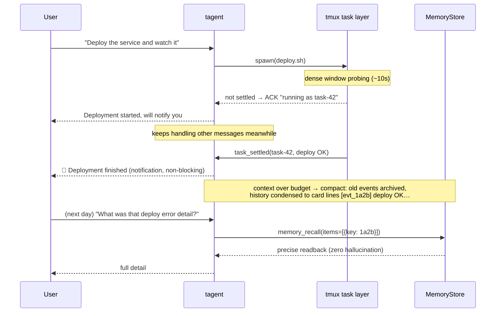
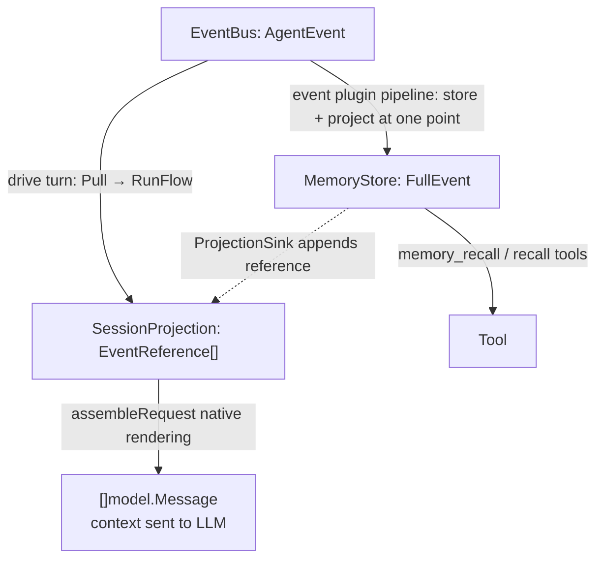
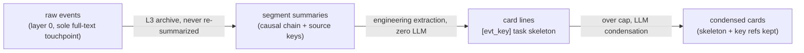
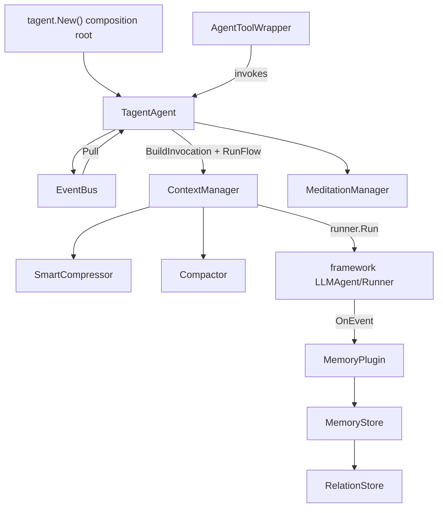

# tagent

**A memory-driven framework for long-running agents** — built on [trpc-agent-go](https://github.com/trpc-group/trpc-agent-go), replacing the synchronous ReAct loop with an event-driven engine: events persist forever, context compresses on demand, history recalls precisely — so an agent can **run for days without amnesia or drift**.

English | [中文](README.md)

---

## ✨ Features

| Feature | In one line |
|---------|-------------|
| 🔄 **Persistent event loop** | Always-on after `StartLoop`; messages, tool results and timers all drive turns through one EventBus |
| 🧠 **Three memory primitives** | store (immutable ingestion) / compress (summarize + natural forgetting) / recall (ticket or semantic) |
| 🗂 **Card sequence** | Compacted history condenses into index-card lines — the model always "sees what it did", each card is a recall ticket |
| ⚡ **Async task layer** | Long commands/services run via tmux: fast ones return inline, slow ones ACK + `task_settled` notification |
| 🔁 **Task reentry** | `resume_task` feeds input into live services (REPL-style) or continues finished sub-agents (context auto-restored) |
| 🤖 **Sub-agent orchestration** | Local `AgentToolWrapper` / remote A2A unified; events passed across agents by key |
| 🧘 **Meditation heartbeat** | Idle-time reflection sediments into ★-highlighted cards in long-term memory |
| 🎓 **RL integration** | HTTPAPI + SwappableModel + TrajectoryRecorder for AReaL training data collection |

## 🎬 A day in a long-running agent



## 🚀 Quick Start

**1. Declarative config (YAML)**

```yaml
entry: tagent
prompt_dir: resources/prompts
model: glm-4-flash
providers:
  openai:
    api_endpoint: "https://open.bigmodel.cn/api/paas/v4"
    api_key_env: "ZAI_API_KEY"

agents:
  tagent:
    system_prompt:
      files: [AGENTS.md, SOUL.md, TOOLS.md]
    memory:
      type: localfile
      path: /data/tagent/events
    tools:
      - agent: recall            # sub-agent tool: complex retrieval
        description_file: recall_tool_desc.md
        event_params: [event_keys]
      - kind: tool
        id: memory_recall        # pure-function tool: ticket/keyword recall
      - kind: tool
        id: exec                 # tmux execution (async task layer)
        description_file: action_tool_desc.md

  recall:
    system_prompt:
      files: [recall_agent.md]
    memory:
      type: memory
    max_tool_iterations: 10
```

**2. Three lines into the persistent loop (Go)**

```go
ta, _ := tagent.New(cfg, tagent.WithModel(model))
defer ta.Close()

outputCh, _ := ta.StartLoop("userID", "sessionID")
ta.InjectMessage(model.Message{Role: model.RoleUser, Content: "run a command for me"})

for evt := range outputCh {
    if evt.IsFinalResponse() {
        println("Final:", evt.Message.Content)
    }
}
```

**3. Run the full example**

```bash
cd examples/wechat-bot && go run .    # WeChat bot: persistent loop + every mechanism live
```

Other modes: A2A server (`agent.NewA2AServer`), RL rollout worker (`agent.NewHTTPAPI` for AReaL) — see [examples/](examples/) and [docs/wiki/](docs/wiki/).

## 🧠 Mental Model

### Three data representations

| Layer | Location | Role | Lifetime |
|-------|----------|------|----------|
| **EventBus AgentEvent** | agent memory | trigger queue | dropped after Pull |
| **SessionProjection EventReference[]** | agent memory | projection (bounded working memory) | compactable |
| **MemoryStore FullEvent** | mem/file/DB | permanent immutable storage | forever |



**Key constraints**: the projection holds lightweight references only (key+type+summary); MemoryStore is the sole complete event chain; compression touches the LLM view and projection, never storage.

### Memory primitives and the curation cascade



- **Material law**: a layer-N summary consumes only layer-(N-1) artifacts — compression cost is O(new), independent of history size
- **Card sequence**: the single representation of compacted history — `[Compacted N] + card lines + recent keys`; meditation outputs get ★; every degradation level holds (no model → oldest lines sink into a counter)
- **Raw events may be forgotten, artifacts persist**: curated artifacts are exempt from TTL and eviction; the `[hex]` keys in cards are `memory_recall` tickets

### Event classification and role attribution

| Category | Event type | Role |
|----------|-----------|------|
| External input | `external_input` (user msg / task_settled / meditation) | user |
| Final output | `agent_output` | assistant (always = real LLM tokens) |
| Tool execution | `action_command` | tool (native protocol pairing) |
| Thinking | `thinking_plan` / `thinking_recall` / `thinking_knowledge` | assistant (native ToolCalls) |
| Compaction marker | `context_compress` | user-side archival note |

One-line rule: **instructions → system (always one, always first); observations → user; assistant always equals what the LLM actually said.** Anti-forgery relies not on roles but on forged text being semantically inert (real references travel the EventKey/StateDelta metadata channel).

## ⚙️ Six mechanisms at a glance

| Mechanism | Highlights | Deep dive |
|-----------|-----------|-----------|
| Persistent event loop | Pull batching; async results queue without interrupting an in-flight turn | [wiki/agent](docs/wiki/agent/event-flow.md) |
| Context compression | SmartCompressor (LLM view, L0-L3 levels) + Compactor (rolling card projection); pure view transforms | [wiki/memory](docs/wiki/memory/memory-architecture.md) |
| Event-driven memory | Snowflake EventKey (hex contract); partition isolation + `read_namespaces` cross-agent grants | [wiki/memory](docs/wiki/memory/memory-architecture.md) |
| Sub-agent invocation | `event_params: [event_keys]` passes events by key (data isolation); transparent remote A2A | [wiki/tool](docs/wiki/tool/tool-architecture.md) |
| Async task layer | Adaptive polling (dense → geometric backoff); 3-tier settle; live task board; `resume_task`; session reaping loop | [wiki/tool](docs/wiki/tool/tool-architecture.md) |
| Meditation heartbeat | Idle detection anchored on final outputs; self-state digest; conclusions sediment as ★ cards | [wiki/agent](docs/wiki/agent/agent-architecture.md) |

## 🏗 Architecture



| Module | Responsibility |
|--------|---------------|
| `agent/` | event-driven engine: EventBus, runEventLoop, ContextManager (glue), meditation, sub-agent wrapper |
| `agent/task/` | task lifecycle: TaskManager, settle detection, board, resume (leaf package, zero engine deps) |
| `agent/compress/` | compression domain: SmartCompressor (L0-L3), card-sequence compactor, SessionProjection, TokenCounter |
| `memory/` | structured event storage: InMemoryStore, FileSegmentStore, RelationStore, lifecycle |
| `plugin/` | framework plugins: MemoryPlugin (persistence + causal chain), SummaryPlugin (metadata annotation) |
| `tool/` | tools: ActionTool (tmux), recall/knowledge sub-tools, task tool family, file tools |
| `event/` | event type system and metadata contract (`FormatEventKey`/`ParseEventMeta`) |
| `rl/` | RL integration: TrajectoryRecorder, SwappableModel, HTTPAPI |
| `tagent.go` + `config.go` | composition root and declarative config |

All dependencies are one-way, no cycles: `root → agent → plugin → memory`, `tool/* → memory`.

## 📐 Design Philosophy

In one sentence: **inputs are a projection of the event flow; the event bus carries the flow; when inputs fill up, Compact and memory persistence fire.**

| Invariant | Meaning |
|-----------|---------|
| ① Inputs are a projection | bounded working memory, the sole assembly source of LLM input |
| ② Unified writes | stored ⇔ projected, exactly once, atomically at one point |
| ③ Ordering by construction | the projection is complete at BeforeModel, not by lucky timing |
| ④ Compact touches only the projection | never the event flow, never permanent storage |

**Reply vs. notification (the async split)**: within a turn = native tool-call protocol replies (long tasks ACK first); across turns = self-contained notification events (`task_settled` correlates by task id) — compression/loss/reordering never creates orphans. Timeline iron rule: **the system never generates textualized call syntax in assistant history** (models imitate it into phantom calls — established after two field incidents).

**Metadata contract**: single-point guarantee in `event/metadata.go` — EventKey's canonical string form is **hex**, used across timeline prefixes, compaction key lists, StateDelta and recall tool I/O.

## 🔧 Configuration Reference

### Global options

| Option | Default | Description |
|--------|---------|-------------|
| `entry` | `tagent` | entry agent name |
| `prompt_dir` | `resources/prompts` | global prompt directory |
| `model` | (required) | default model name |
| `provider` | `openai` | default provider |
| `providers` | `{}` | provider connection info |
| `log_level` | `info` | log level |
| `request_timeout_seconds` | `3600` | request timeout |
| `trajectory_dump` | `false` | enable trajectory recording |
| `trajectory_dir` | `data/trajectories` | trajectory directory |

### Agent-level options

| Option | Default | Description |
|--------|---------|-------------|
| `model` / `provider` | (inherit global) | LLM model and provider |
| `system_prompt.files` | `[]` | prompt files to load |
| `memory.type` | `memory` | `memory`/`file`/`localfile` |
| `memory.path` | `""` | storage path/identifier |
| `memory.read_namespaces` | `[]` | readable partitions of other agents |
| `max_tool_iterations` | entry 50 / sub 10 | max ReAct iterations |
| `max_tokens` | entry 8000 / sub 4096 | context token budget |
| `compress_threshold` | `0.8` | compression trigger ratio |
| `keep_recent_tasks` | `2` | recent tasks kept on compression |
| `task_settled_max_inline` | `2000` | inline result cap in task_settled |
| `resume_context_rounds` | `3` | prior rounds restored on sub-agent resume |
| `temperature` | entry 0.7 / sub 0.3 | LLM temperature |
| `meditation.enabled` | `false` | enable meditation (`interval`/`min_gap`/`prompt_file`) |

### compress block

| Option | Default | Description |
|--------|---------|-------------|
| `summary_model` / `summary_provider` | (inherit agent) | dedicated compression model (can be cheaper) |
| `card_max_chars` | `6000` | card-section cap; beyond it old cards are LLM-condensed or sink |
| `compact_keys_listed` | `32` | recent keys listed in the rolling summary |
| `recent_full_count` | `4` | most-recent refs resolved with full content |
| `max_notice_chars` | `800` | compression notice cap |
| `archive_cache_cap` | `256` | in-process archive cache entries (artifacts persist in MemoryStore) |

### Tool reference (ToolRef)

| Field | Description |
|-------|-------------|
| `kind` | `agent` (default) or `tool` |
| `agent` / `id` | sub-agent name / tool ID |
| `description_file` | tool description prompt file |
| `event_params` | event params, e.g. `[event_keys]` |
| `async` | whether an agent tool uses the async task layer (default true) |
| `remote.url` | remote A2A agent URL |
| `properties` | tool-specific config (exec: `workspace`/`run_as_user`/`run_as_group`) |

> Agent runtime parameters (`max_tool_iterations`/`max_tokens`/`temperature`) are configured ONLY on the referenced agent's own `agents.<name>` entry — a ToolRef declares the reference relationship only.

## 📚 Further Reading

| Topic | Doc |
|-------|-----|
| Memory architecture / curation / recall protocol | [docs/wiki/memory/memory-architecture.md](docs/wiki/memory/memory-architecture.md) |
| Tool architecture / task reentry / session reaping | [docs/wiki/tool/tool-architecture.md](docs/wiki/tool/tool-architecture.md) |
| Agent architecture / event flow | [docs/wiki/agent/](docs/wiki/agent/) |
| Event system / plugins / prompts | [docs/wiki/](docs/wiki/) |
| Design specs (OpenSpec) | [openspec/specs/](openspec/specs/) |
| Full example (WeChat Bot + RL) | [examples/wechat-bot/](examples/wechat-bot/) |

## Development

```bash
go build ./...                        # build (Go 1.21+)
go test ./...                         # test
bash scripts/race_check.sh            # race gate
cd examples/wechat-bot && go run .    # run the example
```

## License

Apache License 2.0
