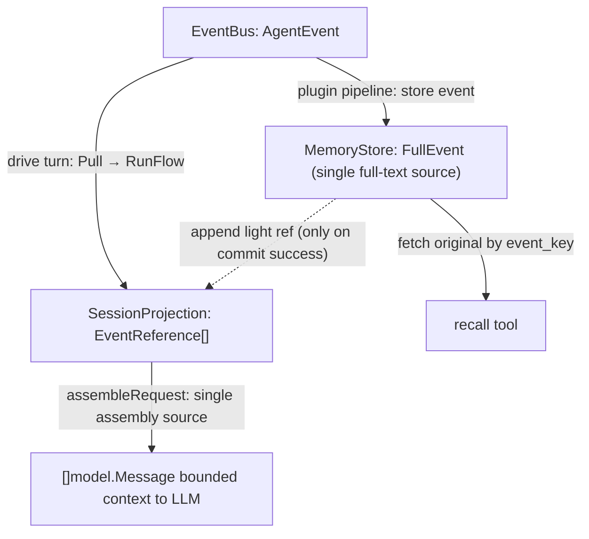
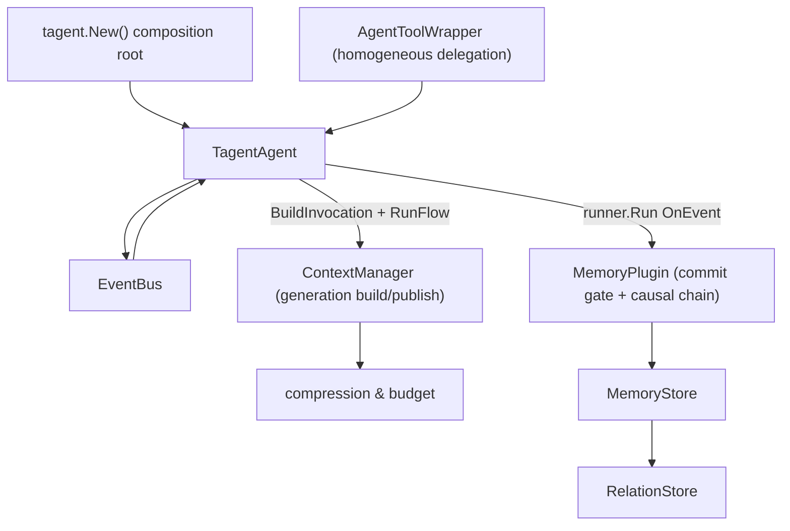

# tagent

**An agent framework built to run for a long time** — on top of [trpc-agent-go](https://github.com/trpc-group/trpc-agent-go). It addresses a simple problem: **letting an assistant work for days or weeks instead of starting from scratch every conversation**. Everything that happens is stored as immutable events, the context sent to the model always has a budget, compacted content can be retrieved exactly, a crashed process rebuilds its working set from the fact chain, and daily runtime experience can be turned into data usable for model training.

English | [中文](README.md)

Good fit: persistent personal assistants, ops/on-call agents, long-task orchestration — and as a runtime foundation for "learning from your own traffic" (offline SFT data pipeline).

## See it work

**Deploy and watch for three days** — You say "deploy v2.3 and keep an eye on it." It moves the ten-minute script into a tmux background task, replies "started" right away, and wakes itself up when the result lands to check logs and report. Three days later, when you ask "what was that error detail?", it retrieves the exact original text using the ticket left behind at compaction time.

**Crash at 3 a.m., resume in place** — A new process comes up, rebuilds context byte-for-byte from the event chain (no second token bill for history), probes yesterday's unfinished tasks and takes the live ones back over. All you see in the morning: "restarted overnight, inspection continues, nothing abnormal."

**One unattended night** — When the model API starts throttling, it backs off instead of hammering; a dangerous command goes to human approval first while it works on something else; in idle hours it reviews the past two days and distills an experience card. By morning: one lesson saved, one approval waiting, zero silent failures.

**Swap the brain without stopping** — Change the model from A to B in config, add an MCP tool; it takes effect from the next turn, in-flight turns finish on the old generation, and anything that genuinely cannot apply online is **refused by name** with the exact YAML paths that need a restart — never a fake "success".

## Core capabilities

### Long-term memory, not an infinite context
Every message, tool call, and result is stored as an immutable event (per-type TTL forgetting; permanent is configurable). When context exceeds budget, old stretches fold into one-line cards `[evt_1a2b] deploy succeeded`, and `[evt_1a2b]` retrieves the exact original. Storage is append-only; compression changes only what the model sees — never what happened.

### Crash recovery
The projection (current context) is a replay of the fact chain, with no floating checkpoints — after restart it rebuilds as "latest compaction snapshot + tail events", and reusable prefixes keep hitting provider caches.

### Async tasks never lose the thread
Long tasks answer first and notify on completion; notifications carry their own context; unacknowledged inputs can be durably accepted in full (at-least-once) and replayed in strict order after restart.

### Adjustable at runtime — and honest about it
Five parameter groups apply instantly, structural changes apply via a generation swap (in-flight turns unaffected, rollback available), everything else is **refused by name** with the restart list. "Changed, acknowledged, silently ineffective" does not exist.

### Homogeneous multi-agent collaboration
An entry agent and the agents it delegates to are the same thing: each has its own event bus, task domain, and memory partition, and can recursively delegate. A delegation binds where its settlement returns — late results flow back to the caller and continue the same turn. A single call can temporarily override prompt/model/tool scope (expires with the call, never leaks across calls).

### Self-review and sideline meditation (one mechanism, reflection on its own session by default)
In idle periods the agent reviews itself: tidies context, distills experience cards, records negative feedback on repeatedly failing strategies. There is one mechanism: when all gates open — fresh non-self-managed facts past the watermark (novelty), the floor since the last **executed** meditation met (the rhythm gate measures execution to execution, no longer stretched by ordinary turns; a never-executed manager passes straight through), and no meditation batch in flight — a meditation input event is injected into a loop session and an ordinary turn does the reviewing; the watermark advances only when that turn is actually consumed, and yielding to a mixed batch postpones rather than abandons (retried next tick over the same facts, the reflection window stays intact). **The default recommended form keeps reflection on its own session** — declare a meditator agent pinned to a reserved session (the wechat-bot example names it `meditation`): it never spends the business session's context budget, and the meditator's internal narration never leaks into the user-facing conversation history. The observation surface decides whose partitions it reviews — peers listed in `observed_namespaces` (inside `memory.read_namespaces`) make it a sideline meditation spotting patterns like "three sessions are all waiting on the same approval"; listing only itself (or nothing) reviews its own; one scan, one predicate. Cards flow back via the explicit `deliver_to` allowlist. Attaching `meditation` directly to a business agent is also legal (defaults to observing its own partition, reflection sharing the business context) — an advanced form for when the reviewer must see the live conversation, at the cost of budget and history noise. Deliberately conservative either way: reflection writes ordinary events only into its own partition and never rewrites another agent's context; reading scope and delivery targets both require explicit grants.

### Runtime data → training data
Optional decision capture records every model call completely (input snapshot, response fragments, terminal state, loss counters); afterwards each decision's "what it saw → what it did → what happened → how a human rated it" is joined into samples, split train/test grouped by session, and exported as an SFT dataset — every step reconcilable against manifests; missing pieces are named, never silently patched together.

## Quick start in three minutes

**1. Declarative config (YAML)**

```yaml
entry: tagent
prompt_dir: resources/prompts
model: glm-4-flash
providers:
  openai:
    api_endpoint: "https://open.bigmodel.cn/api/paas/v4"
    api_key_env: "ZAI_API_KEY"

agents:
  tagent:
    system_prompt:
      files: [AGENTS.md, SOUL.md, TOOLS.md]
    memory:
      type: localfile
      path: /data/tagent/events
    tools:
      - {kind: tool, id: recall}          # tickets / causal chain / keyword
      - {kind: tool, id: exec}            # tmux execution (async task layer)
```

**2. Enter the persistent loop (Go)**

```go
ta, _ := tagent.New(cfg, tagent.WithModel(model))
defer ta.Close()

outputCh, _ := ta.StartLoop("userID", "sessionID") // StopLoop is terminal: restart with a new instance, recovered from the fact chain
ta.InjectMessage(model.Message{Role: model.RoleUser, Content: "run a command for me"})

for evt := range outputCh {
    if evt.IsFinalResponse() {
        println("Final:", evt.Message.Content)
    }
}
```

**3. Full example (WeChat Bot — six cooperating agents in practice: entry + four sub-agents + a meditator `meditator` whose reflection always runs in the reserved `meditation` session)**

```bash
cd examples/wechat-bot
./wizard.sh    # deps check / guided key input (no echo) / working root / .env(chmod 600) / perms / connectivity
./run.sh       # foreground (./run.sh start for background)
```

Keys live only in `.env` (allowlist `.gitignore`, never committed). systemd / container / A2A deployment: see [examples/wechat-bot/deploy/README.md](examples/wechat-bot/deploy/README.md).

## Mental model

### Three layers of data

| Layer | Where | Role | Lifetime |
|-----|------|------|----------|
| **EventBus AgentEvent** | agent memory | trigger queue | Publish → dropped after Pull |
| **SessionProjection EventReference[]** | agent memory | projection (bounded working memory, light refs only) | clearable by Compactor |
| **MemoryStore FullEvent** | memory/file/DB | immutable full-event chain (single full-text source) | per-type TTL (`-1` = permanent) |


```mermaid
graph TB
    EB["EventBus: AgentEvent"]
    SP["SessionProjection: EventReference[]"]
    MS["MemoryStore: FullEvent (single full-text source)"]
    LLM["[]model.Message bounded context to LLM"]
    TOOL["recall tool"]
    EB -->|drive turn: Pull → RunFlow| SP
    EB -->|plugin pipeline: store event| MS
    MS -.append light ref (only on commit success).-> SP
    SP -->|assembleRequest: single assembly source| LLM
    MS -->|fetch original by event_key| TOOL
```

**One request, end to end**: user message enters the bus → the loop batches, persisting each input before projecting → assembles the request (the only assembly source; over-budget is compressed or refused right there) → the framework runs the ReAct turn (LLM ↔ tools) → every output is committed via plugins → the final response goes back to the host. Every failure has a named outcome; "ticket in the log, record missing from the store" cannot happen.

## Architecture and modules


```mermaid
graph TB
    ROOT["tagent.New() composition root"] --> TA["TagentAgent"]
    TA --> EB["EventBus"] --> TA
    TA -->|BuildInvocation + RunFlow| CM["ContextManager (generation build/publish)"] --> SC["compression & budget"]
    TA -->|runner.Run OnEvent| MP["MemoryPlugin (commit gate + causal chain)"] --> MS["MemoryStore"] --> RS["RelationStore"]
    ATW["AgentToolWrapper (homogeneous delegation)"] --> TA
```

| Module | Responsibility |
|------|------|
| `config/` | config model, strict loading/validation, lifecycle projection; `tagent.*` public API stable at source level |
| `agent/` | event-driven engine: EventBus, unified pipeline, ContextManager, meditation, sub-agent wrapping; sub-packages `compress/`, `org/` (generation governance), `task/`, `reliability/`, `governance/`, `resources/` |
| `memory/` | immutable event store: segment files + relation edges + lifecycle; swappable engine/embedder/KV sub-packages |
| `plugin/` | MemoryPlugin (persistence + causal chain + call attribution), SummaryPlugin |
| `tool/` | exec (tmux async tasks), recall/knowledge, task tools, file tools, MCP gateway |
| `event/` | event types and metadata contract; the single-source lineage whitelist |
| `prompt/` | prompt loading and hot reload (file is the source of truth) |
| `rl/` | decision capture, authorized export, swappable model handle, HTTPAPI (RL-facing surface) |
| `evolution/` | git-native self-evolution (off by default): register / evaluate / safe rollback |

**Dependency direction** (mechanically asserted in CI): `tagent → agent → plugin → memory`, `tool/* → memory`, `event` is a pure leaf; `modelutil` depends only on framework types. **Single orchestration-publish authority**: only the composition root publishes configuration generations; the mechanism lives in `agent/org`, the privilege in the root — physically separated.

## 📐 Design commitments

1. **Immutable events**: once stored, facts are never rewritten; compaction and forgetting act on views.
2. **Bounded context**: working memory always has a budget — via layered memory, not an unbounded window.
3. **Auditable recall**: compaction leaves tickets; failures get named outcomes; the framework never manufactures "looks successful".
4. **Async without losing the thread**: long tasks answer first, notify with full context.
5. **Zero change by default**: governance / evolution / reliability / capture / sideline meditation are opt-in; the off state is byte-identical to before, each removable at a single point.

## 🔧 Configuration reference

> Keys are **strictly parsed**: unknown fields fail startup by name; typos never drift silently.

### Global

| Option | Default | Notes |
|------|------|------|
| `entry` / `model` / `provider` / `providers` | tagent / required / openai / `{}` | entry and model wiring |
| `prompt_dir` | `resources/prompts` | prompt directory |
| `request_timeout_seconds` | `3600` | request timeout |
| `working_dir` | `""` | **unified agent working root** for file tools and exec; overridable via `TAGENT_WORKING_DIR` |
| `trajectory_dump` / `trajectory_dir` | `false` / `data/trajectories` | trajectory recording (v1) |
| `trajectory_capture` | (off) | **v2 decision capture**: `enabled` (requires `trajectory_dump: true`) + four resource caps (per-record / in-flight / per-run / open files); negative values refuse startup (never read as "unlimited"); all construction-time. See [decision capture](docs/wiki/rl/rl-architecture.md#trajectory-capture) |

### Per agent

| Option | Default | Notes |
|------|------|------|
| `memory.type` / `path` / `read_namespaces` | `memory`/`""`/`[]` | in-process / file persistent; reading another agent's memory requires explicit grant |
| `memory.lifecycle` | built-in | forgetting: global/per-type TTL, capacity caps |
| `memory.engine` | (off) | semantic retrieval (vector ∪ keyword RRF) and consolidation hints (a trigger is only a suggestion; execution stays with LLM + tools) |
| `meditation.enabled` + `interval`/`min_gap`/`prompt_file` (extensions `observed_namespaces`/`deliver_to`) | `false`; **`observed_namespaces` defaults to `[own partition]`** | idle review: `min_gap` floors two **executed** meditations — no longer stretched by ordinary turns, and a never-executed manager passes through with no previous execution; the recommended default is a dedicated meditator agent on a reserved session (e.g. `meditation`) so reflection never mixes into business lines; listing peer partitions (⊆ `memory.read_namespaces`) makes it cross-domain, omitting them reviews its own, `deliver_to` bounds card delivery; attaching it to a business agent puts reflection on that agent's business session (advanced form — see the feature note) |
| `compress_threshold` / `keep_recent_tasks` | `0.8` / `2` | compaction trigger / recent tasks kept |
| `max_tool_iterations` / `max_tokens` / `temperature` | entry 50/8000/0.7 | configure only at the referenced agent's own definition |

### compress block

| Option | Default | Notes |
|------|------|------|
| `summary_model` / `summary_provider` | inherit agent | a cheaper model is fine for summaries |
| `card_max_chars` / `summary_max_tokens` | `6000` / `8192` | card cap / summary budget |
| `summary_timeout_seconds` | `0` (=5s) | one deadline shared by all synchronous summaries in a fold; above the `120` cap it is refused, not clamped; changing it goes through a generation |

### Platform subsystems (all off by default = zero behavior change)

| Block | One-liner |
|---|---|
| `governance:` | tool risk classification + budget windows + critical async approvals (refusals return to the model as tool results so it can self-correct) |
| `evolution:` | git-native self-evolution: prompt/skill edits take effect from the file; this package registers, evaluates post-hoc (degradation only advises), and rolls back safely |
| `reliability:` | durable input acceptance (at-least-once), five-dependency degradation ladder, storage fallback, meditation anchors |

> **When a config change needs a restart**: five numeric groups apply instantly; the structural allowlist (entry/model/provider/prompt files/subsets) applies via a generation on save; everything else (governance, reliability, trajectory settings, the meditator's observation and delivery lists, …) is **refused by name** with exact YAML paths. A change mixing both kinds is refused as a whole — the hot half never sneaks through. The criterion is where the value is consumed, not how sensitive it looks. Details: [hot-reload dimensions](docs/wiki/platform/org-hot-reload.md#restart-required-dimensions).

## 🤖 RL / training surface

- **Recording**: v1 trajectories + optional v2 decision capture (SDK-boundary snapshots, exact call linking, seals that prove their own completeness; off by default and byte-identical when off).
- **Authorized export**: `rl.ExportTrainingFacts` read-only snapshots (partition allowlist + per-row re-verification; missing/ambiguous reported as separate columns, never guessed).
- **Offline conversion**: `scripts/convert_trajectories.py --strict` produces SFT samples from dual streams; `scripts/verify_runtime_acceptance.py` reconciles evidence (missing evidence = FAIL, not SKIP).
- The online RL bridge (AReaL) is retired; reconnection conditions in [RL architecture](docs/wiki/rl/rl-architecture.md).

## 📚 Further reading

| Topic | Doc |
|---|---|
| Memory architecture / recall protocol | [docs/wiki/memory/memory-architecture.md](docs/wiki/memory/memory-architecture.md) |
| Agent engine / generations / compression & telemetry / meditation (one mechanism: self-review by default, sideline meditation when an observation surface is listed) | [docs/wiki/agent/](docs/wiki/agent/) |
| Platform subsystems (governance/evolution/reliability/hot-reload/observability/MCP) | [docs/wiki/platform/platform-subsystems.md](docs/wiki/platform/platform-subsystems.md) |
| RL / capture / authorized export / dual-stream conversion | [docs/wiki/rl/rl-architecture.md](docs/wiki/rl/rl-architecture.md) |
| Design specs (OpenSpec, 114 items) | [openspec/specs/](openspec/specs/) |
| Real-LLM contract guard matrix | [tests/README.md](tests/README.md) |

## Development

```bash
go build ./... && go vet ./...
go test ./... -short                    # same as CI
go test ./evals/                        # component-level behavior eval
bash scripts/race_check.sh              # race gate
bash scripts/lint.sh && bash scripts/check-openspec.sh
```

CI (push to main/dev and PRs): build + vet + full short + new subsystems `-race`; real-LLM contract tests auto-skip without a key and never block. Comments are contracts: every production file carries a `契约:` index line pointing at its wiki judgment, enforced zero-tolerance in CI (see [docs/comment-gate-tooling.md](docs/comment-gate-tooling.md)). tmux session tests run `-p 1` serially (interpretation guide: [tool architecture](docs/wiki/tool/tool-architecture.md)).

## Current state & limits (read this honestly)

For first-time readers — so the project is neither over- nor under-estimated:

- **Storage backend**: the default `localfile` is a minimal verification backend (per-bucket serialization, one lock) with **no production durability claims**; configure `rustviking` or another dedicated backend for production persistence.
- **Exact retrieval has preconditions**: the original must still be within TTL, the model must pick the right ticket, and the read path must be healthy. A few degraded recovery paths are eventually consistent, not byte-exact. "Recalled correctly" ≠ "understood correctly".
- **Budgeting is estimation**: char-ratio + fixed overhead — one consistent scheme that no longer misses tool declarations or long arguments, but it does not claim provider-window safety or any task-success-rate gain.
- **Training-data chain**: the recording → authorized export → strict conversion **sample-preparation loop** works and reconciles; the end-to-end "real tokenizer produces trainable batches" leg awaits a local template asset; no weight-training gains are claimed; the online RL bridge is retired.
- **Sideline meditation (meditation with an explicit observation surface)**: there is only one mechanism — crossing domains is an observation-surface choice, not a second switch. With no `observed_namespaces` meditation only observes its own partition (self-review, the default); going cross-domain requires listing peer partitions explicitly, under two grants (`observed_namespaces` ⊆ `memory.read_namespaces`, plus a `deliver_to` allowlist — violations and blind targets refuse at assembly). Its novelty judgment is fail-closed (unreadable fact chain or unknown lineage never counts). A meditator only writes ordinary events to its own partition and never rewrites another agent's context. Delivery is same-process; cross-process goes through the existing HTTPAPI. The real-model end-to-end scenario passed once locally behind the three-state gate with a non-idling probe (≤3 calls budgeted) — a single-run record; CI without a key SKIPs legitimately.
- **Hot reload is not magic**: not every setting changes online; the rest are refused with a restart list. Side-channel capabilities (delivery, capture) never alter call semantics.
- **External tool side effects are at-least-once**: durable acceptance prevents loss, not repetition — make side-effecting tools idempotent with your own keys.

## License

Apache License 2.0
