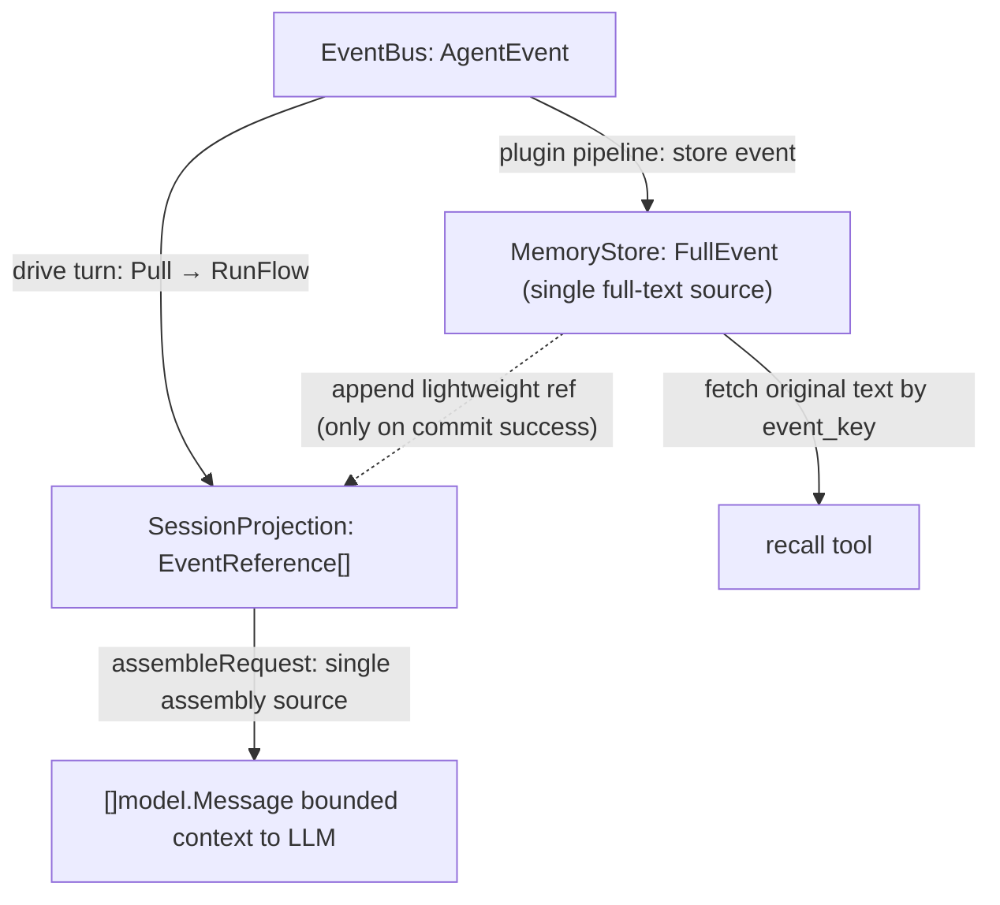
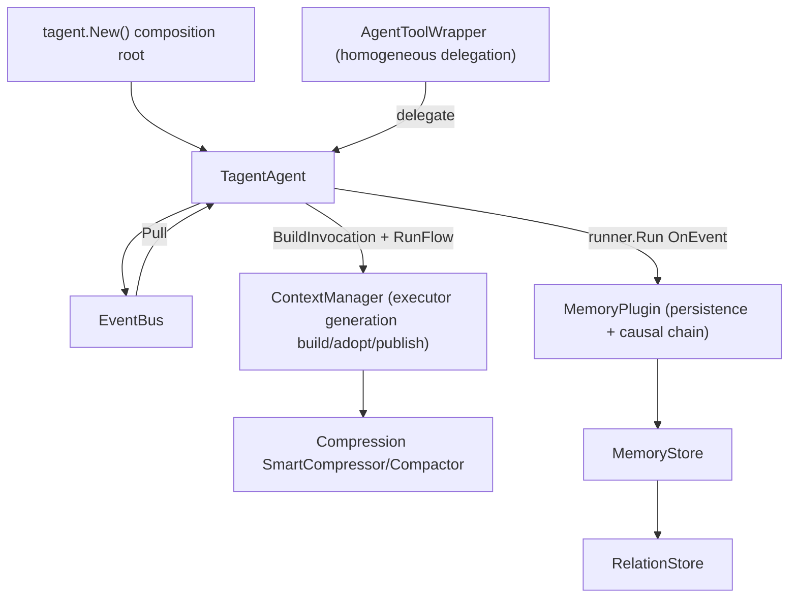

# tagent

**A memory-driven framework for long-running agents** — built on [trpc-agent-go](https://github.com/trpc-group/trpc-agent-go), replacing the synchronous ReAct loop with an event-driven engine: what happens is stored as immutable events (forgotten on a per-type TTL by default, configurable as permanent), the working memory sent to the model always has a budget cap, and compacted content keeps tickets for exact on-demand recall. The goal is an agent that, over **long, multi-turn, tool-using collaboration**, is explainable in behavior, decidable in failure, and traceable in data.

[English](README_EN.md) | [中文](README.md)

> This README states current real capabilities and boundaries without exaggeration. Anything whose verification gate has not passed (e.g. the real-tokenizer consumption acceptance) is marked as pending, not claimed done.

---

## Capabilities and boundaries (stated plainly)

| Capability | What is established | Boundary (what is NOT claimed) |
|---|---|---|
| Long-term memory | Immutable event log; compaction only changes the view, never the facts; the projection is a replay of the fact chain and rebuilds on cold start | Original text recall is bounded by **retention policy and storage backend**; some degraded-recovery paths are eventually consistent, not byte-identical; "recalled correctly" ≠ "understood correctly by the model" |
| Bounded context | Whole input (system prompt / tool declarations / arguments / reasoning / notices) is priced under one scheme; over-budget fixed parts are refused by name; synchronous summary has a deadline with named degradation | Pricing is a **conservative estimate** (char ratio + fixed overhead); it does not claim provider-window safety, nor any task-success-rate gain |
| Runtime adjustability | Three channels — structural generation / hot numeric params / lazy file reads; fields that cannot apply online are **refused by name** with `restartRequired` paths, never a "silent applied" | This is **not a DAG/workflow engine**; in-flight calls hold the old execution generation, files and numerics have their own read boundaries — no claim of deterministic whole-environment replay |
| Decision capture | Opt-in v2 capture: SDK-boundary snapshot, exact call attribution, named drop/oversize counters, a self-proving seal manifest; **when off it is byte-identical to before** | Observation scope is `sdk_request`, **never impersonating wire**; capture is a side observer and does not change call semantics |
| Offline training data | Authorized read-only export (partition allowlist + per-row re-check + separate missing/ambiguous columns); strict dual-stream conversion (capture primary, facts as association index), train/test split grouped by session to prevent leakage, line-by-line rejection ledger | **The online training bridge is retired**; the real-tokenizer consumption acceptance is pending an asset; **no claim of weight-training gain** — what ships is auditable sample preparation, not a validated learning effect |

**Storage backend, honestly**: the default `localfile` (`LocalFileKV`) is a minimal cross-process verification backend — per-bucket direct serialization, reads and writes share one lock, and it **provides no production-grade durability/concurrency guarantees**; use `rustviking` or another dedicated backend for production persistence.

---

## 🧠 Mental model

### Three-layer data representation

| Layer | Location | Role | Lifetime |
|-----|------|------|----------|
| **EventBus AgentEvent** | Agent memory | Event trigger queue | Publish → dropped after Pull |
| **SessionProjection EventReference[]** | Agent memory | Projection (bounded working memory, lightweight refs only) | Clearable by Compactor |
| **MemoryStore FullEvent** | memory/file/DB | Immutable full-event chain (single source of full text) | Per-type TTL (`-1` = permanent) |


```mermaid
graph TB
    EB["EventBus: AgentEvent"]
    SP["SessionProjection: EventReference[]"]
    MS["MemoryStore: FullEvent (single full-text source)"]
    LLM["[]model.Message bounded context to LLM"]
    TOOL["recall tool"]
    EB -->|drive turn: Pull → RunFlow| SP
    EB -->|plugin pipeline: store event| MS
    MS -.append lightweight ref (only on commit success).-> SP
    SP -->|assembleRequest: single assembly source| LLM
    MS -->|fetch original text by event_key| TOOL
```

**Key constraints**: the projection holds only lightweight refs; MemoryStore is the sole full-event chain; compaction changes only the LLM view and projection, never storage; **references are published only on successful commit** — the failure path leaves no "ticket in the log, record missing from the store" mismatch.

### Bounded context and exact recall

Context sent to the model is always budget-capped; the oldest overflowing segment is folded into a card line `[evt_key] task skeleton`. Folding never deletes the original — `[evt_key]` recovers it byte-for-byte. Whether this holds depends on: ① the original is still within retention; ② the model picks the right ticket; ③ the read path is healthy. If any fails, the framework reports it by name instead of staying silent.

---

## 🏗 Architecture and modules


```mermaid
graph TB
    ROOT["tagent.New() composition root"]
    TA["TagentAgent"]
    EB["EventBus"]
    CM["ContextManager (executor generation build/adopt/publish)"]
    SC["Compression SmartCompressor/Compactor"]
    MP["MemoryPlugin (persistence + causal chain)"]
    MS["MemoryStore"]
    RS["RelationStore"]
    ATW["AgentToolWrapper (homogeneous delegation)"]
    ROOT --> TA --> EB -->|Pull| TA
    TA -->|BuildInvocation + RunFlow| CM --> SC
    TA -->|runner.Run OnEvent| MP --> MS --> RS
    ATW -->|delegate| TA
```

| Module | Responsibility |
|------|------|
| `config/` | Config model layer: `Config`/`AgentConfig`/`ToolRef`, strict loading and validation, lifecycle projection; re-exported by the composition root via aliases, `tagent.*` source API unchanged |
| `agent/` | Event-driven engine: EventBus, one unified event pipeline (entry and callee share the same turn primitive), ContextManager, meditation, sub-agent wrapping; `agent/compress/` compression & budget, `agent/org/` generation governance, `agent/resources/` resource leases, `agent/reliability/` resident reliability, `agent/governance/` approval gate |
| `memory/` | Immutable event store: `FullEvent`/`MemoryStore`/`FileSegmentStore`/`RelationStore`/lifecycle; semantic-engine, embedder and backend adapters each live in sub-packages |
| `plugin/` | Framework plugins: MemoryPlugin (commit gate + causal chain + exact call_id attribution), SummaryPlugin |
| `tool/` | Tools: exec (tmux async task layer), recall/knowledge, task tool family, file tools, MCP gateway |
| `event/` | Event type system and metadata contract (`FormatEventKey`/`ParseEventKey`/`MetaKeyCallID`, single source); EventTypeSpec registry |
| `prompt/` | Loader and hot-reload Source (file is the source of truth, lazy mtime read) |
| `rl/` | RL/training surface: TrajectoryRecorder, opt-in capture v2, authorized read-only export, SwappableModel, HTTPAPI (security boundary) |
| `evolution/` | git-native self-evolution (off by default): register/evaluate/safe rollback; the framework only advises, never acts |

**Dependency direction** (mechanically asserted; a reversal fails CI): `tagent → agent → plugin → memory`, `tool/* → memory`, `event` is a pure leaf; `modelutil` is a leaf depending only on framework model/tool.

**Homogeneous collaboration**: the entry and the callee are the same kind of tagent — one turn primitive, one event pipeline, one committed record, one (per-agent) task domain; "entry/sub" is only a connection relation, not two types. Once an input enters a loop, the destination of its settlements and outputs is fixed and looked up, never guessed at runtime.

**Single orchestration-publish authority**: the composition root exclusively builds and publishes executor bindings; internal packages never reach versions through the root. The **mechanism** of generation governance lives in agent sub-packages; the **publish action** stays in the composition root — mechanism and privilege physically separated.

## 📐 Design commitments

1. **Immutable events**: once stored, never modified; compaction and forgetting act on the view, not on facts.
2. **Bounded context**: the working memory always has a budget cap — via layered memory, not an unbounded window.
3. **Auditable recall**: compacted content keeps tickets recoverable by key; the framework never fabricates a "looks-successful" empty reference.
4. **Async without losing the thread**: long tasks answer first and notify on completion; notifications carry their own context.
5. **Zero change by default**: governance / evolution / reliability / capture are all off by default; the off state is byte-identical to before; each optional capability can be removed at a single point.

---

## 📦 Environment

| Dependency | Requirement | Use |
|---|---|---|
| Go | ≥ 1.24 | build |
| tmux | recent | exec command execution + async task layer |
| rustviking | optional | only for `memory.type: file` production backend; default localfile (minimal verification backend, see above) |
| ZAI_API_KEY / provider key | as needed | model API key; **all unit tests use mocks, no key required** |
| OTel endpoint | optional | set `OTEL_EXPORTER_OTLP_ENDPOINT` to export traces; unset = noop, empty `trace_id` does not affect key/call_id correlation |

## 🚀 Quick start

**1. Declarative config (YAML)**

```yaml
entry: tagent
prompt_dir: resources/prompts
model: glm-4-flash
providers:
  openai:
    api_endpoint: "https://open.bigmodel.cn/api/paas/v4"
    api_key_env: "ZAI_API_KEY"

agents:
  tagent:
    system_prompt:
      files: [AGENTS.md, SOUL.md, TOOLS.md]
    memory:
      type: localfile
      path: /data/tagent/events
    tools:
      - {kind: tool, id: recall}          # unified recall: ticket/causal/keyword
      - {kind: tool, id: exec}            # tmux execution (async task layer)
```

**2. Enter the persistent loop (Go)**

```go
ta, _ := tagent.New(cfg, tagent.WithModel(model))
defer ta.Close()

outputCh, _ := ta.StartLoop("userID", "sessionID") // StopLoop is terminal: restart needs a new instance, recovered from the fact chain
ta.InjectMessage(model.Message{Role: model.RoleUser, Content: "run a command for me"})

for evt := range outputCh {
    if evt.IsFinalResponse() {
        println("Final:", evt.Message.Content)
    }
}
```

**3. Full example (WeChat Bot)**

```bash
cd examples/wechat-bot
./wizard.sh    # deps check / guided key input (no echo) / working root / .env(chmod 600) / perms / connectivity
./run.sh       # foreground (./run.sh start background; --help for all)
```

Keys go into `.env` (ignored by the allowlist-style `.gitignore`, never committed). systemd/container/A2A deployment see [examples/wechat-bot/deploy/README.md](examples/wechat-bot/deploy/README.md) and [docs/wiki/](docs/wiki/).

---

## 🔧 Configuration reference

> Config keys are **strictly parsed**: an unknown field fails startup and names it; structural changes follow a deprecation flow.

### Global options

| Option | Default | Notes |
|------|------|------|
| `entry` / `model` / `provider` / `providers` | tagent / required / openai / `{}` | entry, model, provider connection info |
| `prompt_dir` | `resources/prompts` | prompt directory |
| `request_timeout_seconds` | `3600` | request timeout |
| `working_dir` | `""` | **unified agent working root** (base for file tools and exec); empty = inherit process cwd; overridable via `TAGENT_WORKING_DIR` |
| `trajectory_dump` / `trajectory_dir` | `false` / `data/trajectories` | v1 trajectory recording |
| `trajectory_capture` | (off) | **opt-in v2 capture**: `enabled` (requires `trajectory_dump: true`, else a named startup error) / `max_record_bytes` (8MiB per record) / `max_pending_bytes` (64MiB in-flight incl. copies) / `max_run_bytes` (512MiB per run) / `max_open_files` (≤16). `0` = rl default (source of truth in `rl`); **negative is refused**, not read as "unlimited"; exceeding caps is **refused, not clamped**. All read at construction time, not hot-reloadable. See [decision capture](docs/wiki/rl/rl-architecture.md#trajectory-capture) |

### Per-agent highlights

| Option | Default | Notes |
|------|------|------|
| `memory.type` / `path` / `read_namespaces` | `memory`/`""`/`[]` | in-process / file persistent / cross-partition reads require explicit authorization |
| `memory.lifecycle` | built-in | forgetting: `global_ttl_days` (default 7, negative = off) / `type_ttl` / `max_events_per_partition` |
| `memory.engine` | (off) | semantic retrieval and consolidation-as-suggestion (a trigger is only a suggestion; execution stays with LLM + tools) |
| `compress_threshold` / `keep_recent_tasks` | `0.8` / `2` | compaction trigger / recent count kept after compaction |
| `max_tool_iterations` / `max_tokens` / `temperature` | entry 50/8000/0.7 · sub 10/4096/0.3 | configured only at the referenced agent's own definition |
| `meditation.enabled` | `false` | idle-period reflection |

### compress block

| Option | Default | Notes |
|------|------|------|
| `summary_model` / `summary_provider` | inherit agent | dedicated summary model (a cheaper one is fine) |
| `card_max_chars` / `summary_max_tokens` | `6000` / `8192` | card cap / summary budget floor |
| `summary_timeout_seconds` | `0` (= package default 5s) | shared deadline for all synchronous summaries in one real fold. `0` = use package default, not off; **negative is a validation error** (not "no limit"); above `120` **refused, not clamped**. A construction-time value — changing it goes through a generation, not a fourth hot channel. See [summary deadline](docs/wiki/agent/compression-and-telemetry.md#summary-deadline) |

### Platform subsystems (all off by default = zero behavior change)

| Block | Notes |
|--------|------|
| `governance:` | approval gate: leaf tools through risk classification + budget window + critical async approval; refusals return to the model as tool results (not Go errors). `enforcement: warn|strict` |
| `evolution:` | git-native self-evolution: register + post-evaluation (degradation only advises) + safe rollback. ⚠ production = separate deployment repo |
| `reliability:` | resident reliability: durable inbox (full durable admission, at-least-once, **does not guarantee external tools run exactly once**), dependency-degradation ladder, mem_spill fallback, meditation anchors |

> **When a config change requires a restart**: hot reload has only three legal readings — ① five numeric hot params apply immediately; ② a structural allowlist (entry/model/provider/prompt_dir, `providers.{provider,api_endpoint}`, per-agent subset) applies via a generation change; ③ everything else is **refused by name** with `restartRequired` (`governance`/`reliability`/`trajectory_capture`/`trajectory_dump`/`trajectory_dir`). A change touching both is **refused as a whole** (the hot half does not silently apply). The criterion is the **consumer's position**, not how sensitive a field looks. See [dimension classification](docs/wiki/platform/org-hot-reload.md#restart-required-dimensions).

## 🤖 RL / training surface

- **Recording**: `rl.TrajectoryRecorder` (v1) + opt-in capture v2; sub-agents share one write stream via the model wrapper.
- **Authorized export**: `rl.ExportTrainingFacts` read-only narrow surface (partition allowlist, per-row re-check, missing/forbidden/ambiguous in separate columns, no automatic reward folding).
- **Offline conversion**: `scripts/convert_trajectories.py --strict` dual-stream (capture primary + facts index + seal proof) yields SFT/RL samples; `scripts/verify_runtime_acceptance.py` is a **reconciler** (missing evidence = FAIL, not SKIP).
- **Retirement note**: the AReaL online training bridge (pre-rename `train.*` layout) has been removed; reconnection conditions in [RL architecture](docs/wiki/rl/rl-architecture.md).

## 📚 Further reading

| Topic | Doc |
|------|------|
| Memory architecture / recall protocol | [docs/wiki/memory/memory-architecture.md](docs/wiki/memory/memory-architecture.md) |
| Agent architecture / executions / compression & telemetry | [docs/wiki/agent/](docs/wiki/agent/) |
| Platform subsystems (governance/evolution/reliability/hot-reload/observability/MCP) | [docs/wiki/platform/platform-subsystems.md](docs/wiki/platform/platform-subsystems.md) |
| RL / capture / authorized export / dual-stream conversion | [docs/wiki/rl/rl-architecture.md](docs/wiki/rl/rl-architecture.md) |
| Design specs (OpenSpec) | [openspec/specs/](openspec/specs/) |
| Real-LLM contract guard matrix | [tests/README.md](tests/README.md) |

## Development

```bash
go build ./... && go vet ./...
go test ./... -short                    # same as CI
go test ./evals/                        # component-level behavior eval
bash scripts/race_check.sh              # race gate
bash scripts/lint.sh && bash scripts/check-openspec.sh
```

CI runs on push (main/dev) and PR: build + vet + full short + new subsystems `-race`; real-LLM contract tests auto-skip without a key and do not block. tmux session tests must run `-p 1` serially (they share the default tmux server and would reap each other; see [docs/wiki/tool](docs/wiki/tool/tool-architecture.md)).

## License

Apache License 2.0
