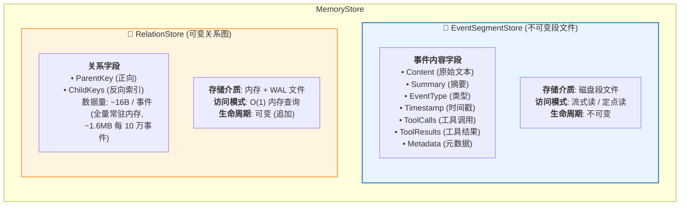
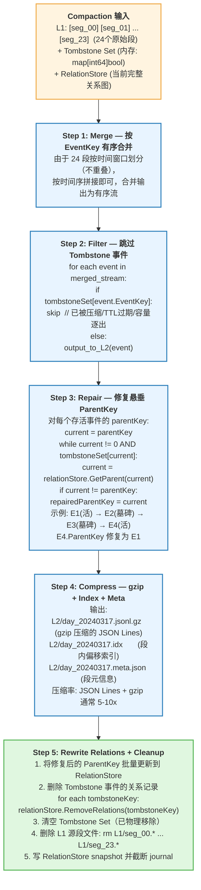

# 事件存储分层架构设计

> **设计目标**：廉价、高性能、低耦合的事件持久化与检索系统  
> **核心隐喻**：RocksDB LSM-Tree —— 热温冷分层、compaction 合并、墓碑清理  
> **设计原则**：不可变内容 + 可变关系分离、访问局部性优化、渐进式降级

---

## 一、动机与背景

### 1.1 为什么需要重新设计事件存储？

tagent 是一个长期持续运行的 Agent 系统。用户与 Agent 的每一次交互都产生事件，事件被持久化到 MemoryStore 中以支持以下能力：

- **因果链回溯**：`memory_trace` 沿 ParentKey 追溯历史
- **跨会话检索**：`memory_query` 按关键词/时间/类型检索历史
- **上下文压缩**：SmartCompress 合并旧事件，建立新的因果关系
- **知识复用**：KnowledgeAgent 从历史事件中获取已有知识

当前 FileBackend 的核心设计是**每事件一个 JSON 文件**。这在事件量级较低时简洁高效，但在长时间运行场景下暴露系统性瓶颈。

### 1.2 长时间运行的挑战

假设 tagent 持续运行 1 年，保守估计每天 1000 次交互，每次交互产生 5 个事件：

```
单分区事件数: 1000 × 365 × 5 = 1,825,000 事件
分区文件数:   ~1,825,000 个 .json 文件
```

**核心矛盾**：

| 操作 | 当前代价 | 1年后代价 |
|------|---------|----------|
| `QueryEvents(Limit=10)` | 扫描全部文件 + 全量过滤 + 排序 | ~10-20s |
| `GetEvent(key)` | EventKey→文件名→读文件 O(1) | O(1) ✅ |
| `memory_trace(20步)` | 20 × GetEvent | 20 × 单文件读 ✅ |
| 磁盘空间 | ~1.8GB（含 JSON 空白开销） | ~1.8GB |

`QueryEvents` 是热路径——每次 RecallAgent 的 `memory_query` / `memory_recent` 都触发它。O(N) 全文件扫描不可接受。

### 1.3 当前架构的七个问题

| # | 问题 | 严重度 | 影响 |
|---|------|--------|------|
| 1 | **QueryEvents 全表扫描** | 🔴 致命 | 热路径 O(N)，百万事件时秒级延迟 |
| 2 | **无索引机制** | 🔴 致命 | 时间/类型/关键词过滤全量遍历 |
| 3 | **无数据生命周期** | 🔴 致命 | 磁盘无限增长，无 TTL/上限 |
| 4 | **文件粒度过细** | 🟡 严重 | 百万文件，OS 元数据压力大 |
| 5 | **单一全局锁** | 🟡 严重 | 读写互相阻塞，不同分区也互斥 |
| 6 | **JSON 格式开销** | 🟢 中等 | Indent 空行 + 空字段，~30% 空间浪费 |
| 7 | **关系与内容耦合** | 🔴 致命 | ParentKey 在事件文件中，压缩/关联变更需重写文件 |

---

## 二、设计目标

### 2.1 核心目标

| 目标 | 指标 | 说明 |
|------|------|------|
| **廉价** | 内存 < 100MB + 每事件 ~100B 磁盘 | 关系全量内存（~16B/event），内容按需读取 |
| **高性能** | QueryEvents < 10ms，GetEvent < 1ms | 时间裁剪 + 段内索引 + 短路查询 |
| **低耦合** | 内容层与关系层分离 | 事件内容不可变（段文件），关系可独立变更（RelationStore） |

### 2.2 设计原则

1. **访问局部性优化**：最近访问的事件大概率再次被访问（因果链回溯、压缩迭代），应被更快访问
2. **不可变内容 + 可变关系分离**：事件生成后内容不再修改，但压缩/关联会不断重写关系
3. **渐进式降级**：事件从热到温到冷到归档，查询代价逐步增加，但绝大多数查询命中热/温层
4. **Compaction 清理**：墓碑标记 → merge → 物理清除，系统不因时间推移退化
5. **EventKey 自包含**：Snowflake Key 内含时间戳，无需外部索引即可定位段

---

## 三、分层架构总览

### 3.1 四层模型

```mermaid
flowchart TB
    Query["`**Query Layer**
    QueryEvents / GetEvent / GetParent / GetChildren / Trace
    查询策略: L0 → L1 → L2 → L3，命中即返回`"]

    subgraph L0["🔥 L0 — 热层 (Hot Tier)"]
        direction LR
        Active["`**ActiveSegment**
        (当前小时
         append-only)`"]
        Relation["`**RelationGraph**
        (全量内存
         child ↔ parent)`"]
        Cache["`**EventCache (LRU)**
        (最近访问的
         热门事件全量缓存)`"]
        L0Note["`写入延迟: &lt;1ms (内存追加)
        读取延迟: &lt;1ms (内存命中或当前文件)`"]
    end

    subgraph L1["📦 L1 — 温层 (Warm Tier)"]
        direction LR
        Seg00["`seg_00
        .jsonl + .idx`"]
        Seg01["`seg_01
        .jsonl + .idx`"]
        SegDots["..."]
        Seg23["`seg_23
        .jsonl + .idx`"]
        L1Note["`范围: 最近 24 小时（可配）
        格式: 未压缩 JSON Lines + 段内偏移索引
        读取延迟: ~1-5ms（时间过滤定段 → 索引定位 → 精确读行）`"]
    end

    subgraph L2["🧊 L2 — 冷层 (Cold Tier)"]
        direction LR
        Day1["`day_20240317
        .jsonl.gz + .idx`"]
        Day2["`day_20240318
        .jsonl.gz + .idx`"]
        Day3["`day_20240319
        .jsonl.gz + .idx`"]
        L2Note["`范围: 1天 ~ 7天（可配）
        格式: gzip 压缩 JSON Lines + 段内偏移索引
        墓碑: 已压缩/过期事件物理移除，悬垂 ParentKey 已上移
        读取延迟: ~10-50ms（按需解压 → 索引定位 → 精确读行）`"]
    end

    subgraph L3["🗄️ L3 — 归档层 (Archive Tier)"]
        direction LR
        Week["`**week_20240311.jsonl.gz**
        仅保留 external_input + agent_output
        低价值事件摘要化
        高度压缩，墓碑已清理，悬垂引用已上移`"]
        L3Note["`范围: 7天+（可配或禁用）
        读取延迟: ~100ms+（极罕见访问，可接受）`"]
    end

    Query --> L0
    L0 -->|"每小时 seal: active → L1 segment"| L1
    L1 -->|"compact: 24段合并 + 墓碑过滤 + 压缩"| L2
    L2 -->|"deep compact: 7段合并 + 摘要化"| L3

    classDef hot fill:#ffe0e0,stroke:#d9534f,stroke-width:2px
    classDef warm fill:#fff4e0,stroke:#f0ad4e,stroke-width:2px
    classDef cold fill:#e0f0ff,stroke:#5bc0de,stroke-width:2px
    classDef archive fill:#ececec,stroke:#777,stroke-width:2px

    class L0 hot
    class L1 warm
    class L2 cold
    class L3 archive
```



### 3.2 与 RocksDB LSM 的映射

| RocksDB 概念 | 事件系统映射 | 说明 |
|-------------|-------------|------|
| **MemTable** | ActiveSegment + RelationGraph + EventCache | 热层，纯内存或当前写入文件 |
| **WAL** | ActiveSegment 本身 + relations journal | 写入即持久化，崩溃可恢复 |
| **Level 0 SST** | L1 小时段（时间维有序，层内可重叠） | 未压缩，快速查询 |
| **Level 1-N SST** | L2 日段 + L3 周段（同层不重叠） | 压缩，有序，带索引 |
| **Compaction** | merge + filter tombstone + repair refs + compress | 后台异步，不阻塞读写 |
| **Tombstone** | 被压缩/过期/逐出事件的标记 | compaction 时物理清除 |
| **Bloom Filter** | 段级时间范围 + EventKey 范围 | 快速跳过不相关段，零 IO |

---

## 四、核心变革：关系与内容分离

### 4.1 为什么要分离？

**核心矛盾**：

```
事件内容 (Content, Summary, ToolCalls)
  → 不可变，适合 append-only 段文件

事件关系 (ParentKey, 反向引用)
  → 可变，Compress 会重写因果链，Recall 会建立跨会话关联
  → 与段文件的不可变性冲突
```

**实际场景**：

```
场景 A — Compress 后重写因果链:
  压缩前: E1 → E2 → E3 → E4 → E5
  压缩后: E1 → S → E5
  需要: E5.ParentKey 从 E4 改为 S（E5 已封存在旧段中）

场景 B — Recall 建立跨会话关联:
  Session1: E1 → E2 → E3
  Session2: E4 → E5 → E6
  发现 E4 是 E2 的延续 → 需要 E4.ParentKey 从 0 改为 E3

场景 C — 逐出段时处理悬垂引用:
  逐出段 A → 段 A 中的事件被标记 tombstone
  → 所有引用到段 A 的 ParentKey 需要上移到最近活祖先
```

**结论**：必须将可变的关系从不可变的事件内容中剥离。

### 4.2 分离后的架构



### 4.3 FullEvent 重新定义

```go
// FullEvent 不再包含 ParentKey
type FullEvent struct {
    EventKey     int64                  // Snowflake 64-bit 唯一标识符
    PartitionID  int                    // 存储分区
    EventType    string                 // 事件类型
    EventSummary string                 // 事件摘要（LLM 上下文用）
    Timestamp    int64                  // Unix 毫秒时间戳
    Content      string                 // 原始文本内容
    ToolCalls    []model.ToolCall       // 工具调用
    ToolResults  map[string]interface{} // 工具执行结果
    Metadata     map[string]string      // 额外元数据

    // ParentKey 移除 — 由 RelationStore 维护
}
```

### 4.4 RelationStore 接口

```go
// RelationStore 维护事件间的因果关联图
// 全量常驻内存，变更通过 WAL 持久化
type RelationStore interface {
    // SetParent 设置/更新 parentKey（建立或修改因果链）
    SetParent(childKey, parentKey int64) error

    // GetParent 获取 parentKey（0 = 无前驱）
    GetParent(childKey int64) (int64, error)

    // GetChildren 获取所有直接后继（反向查询）
    GetChildren(parentKey int64) ([]int64, error)

    // GetParents 批量获取（memory_trace 热路径优化）
    GetParents(keys []int64) (map[int64]int64, error)

    // RemoveRelations 删除某事件的所有关联（逐出时调用）
    RemoveRelations(key int64) error

    // === 生命周期 ===

    // Snapshot 创建全量快照（compact 时调用）
    Snapshot() (map[int64]int64, error)

    // LoadSnapshot 从快照恢复
    LoadSnapshot(data map[int64]int64) error

    // ReplayJournal 重放 WAL（启动恢复）
    ReplayJournal(entries []JournalEntry) error
}
```

### 4.5 RelationStore 实现：内存双图 + WAL

```go
type InMemRelationStore struct {
    mu sync.RWMutex

    // childKey → parentKey（正向，用于 GetParent / GetParents）
    childToParent map[int64]int64

    // parentKey → []childKey（反向索引，用于 GetChildren）
    parentToChildren map[int64][]int64

    // WAL 追加文件
    journal *os.File
}
```

**内存开销估算**：

| 事件数 | childToParent | parentToChildren | 总计 | 说明 |
|--------|--------------|-----------------|------|------|
| 10万 | ~1.3MB | ~1.6MB | ~3MB | 可忽略 |
| 100万 | ~13MB | ~16MB | ~30MB | 完全可接受 |
| 1000万 | ~130MB | ~160MB | ~300MB | 上限，需分段 |

对于 tagent 单机部署场景，百万级事件已经覆盖数年运行，~30MB 内存完全在可接受范围。

**WAL 格式** (`relations.journal`)：

```
+1:1777198738547555000:1777198739574803000   ← SetParent(child, parent)
-1:1777198739760667000                         ← RemoveRelations(key)
S:...                                          ← Snapshot 标记，可用于 compact
```

每行一个操作，append-only，崩溃后重放即可恢复。

**重启恢复流程**：

```
1. 加载 latest snapshot (relations.snap)
   → childToParent map 恢复
   → parentToChildren 反向索引重建

2. 重放 snapshot 之后的 journal 增量
   → 逐行 apply 到 map

3. 完成，RelationStore 就绪
```

---

## 五、段文件格式

### 5.1 目录布局

```
dataDir/
├── 42/                              ← PartitionID
│   ├── active.jsonl                 ← 当前正在写入的活跃段
│   │
│   ├── L1/                          ← 温层（24小时内，未压缩）
│   │   ├── 1710678000.jsonl         ← 段文件 (window_start_epoch).jsonl
│   │   ├── 1710678000.idx           ← 段内偏移索引文件
│   │   ├── 1710681600.jsonl
│   │   ├── 1710681600.idx
│   │   └── ...
│   │
│   ├── L2/                          ← 冷层（1-7天，gzip 压缩）
│   │   ├── 1710556800.jsonl.gz
│   │   ├── 1710556800.idx
│   │   └── ...
│   │
│   └── L3/                          ← 归档层（7天+）
│       ├── 1710028800.jsonl.gz
│       ├── 1710028800.idx
│       └── ...
│
├── relations/
│   ├── relations.snap               ← 关系图快照
│   └── relations.journal            ← 关系变更 WAL
│
└── meta.json                        ← 存储元信息（配置、统计）
```

### 5.2 JSON Lines 格式

每行一个事件的完整 JSON，行尾 `\n`：

```jsonl
{"event_key":1777198738547555000,"partition_id":42,"event_type":"external_input","event_summary":"部署 nginx 到生产环境","timestamp":1710678000000,"content":"用户请求部署 nginx 到生产环境","tool_calls":[],"tool_results":{},"metadata":{}}
{"event_key":1777198739574803000,"partition_id":42,"event_type":"thinking_plan","event_summary":"调用工具: skill_search(nginx deploy)","timestamp":1710678001000,"content":"","tool_calls":[{"function":{"name":"skill_search","arguments":"{\"query\":\"nginx deploy\"}"}}],"tool_results":{},"metadata":{}}
```

**格式约定**：
- 每行一个事件，无缩进（节省 ~30% 空间 vs `json.MarshalIndent`）
- 空字段保留但不省略（便于流式解析，保持结构一致）
- 行分隔符 `\n`，解析器按行分割
- JSON 内不包含换行（compact 时保证，active 写入时强制转义 `\n` → `\\n`）

### 5.3 段内偏移索引 (`.idx`)

**目的**：给定 EventKey，在段文件中快速定位对应行，避免全段扫描。

**问题**：段内事件按写入顺序排列，EventKey 并非严格单调递增（Snowflake 同秒内 sequence 反转可能发生）。因此不能用二分查找，需要一个 EventKey → 字节偏移的映射。

**首次快选**：由于事件写入顺序与时间近似一致，可用 EventKey 的时间戳部分快速估算位置（扫几行即可校对齐）。

**精确索引格式**：

```
格式: [eventKey_1]:[offset_1]\n[eventKey_2]:[offset_2]\n...

示例:
1777198738547555000:0
1777198739574803000:247
1777198739760667000:489
```

offset 是行首在段文件中的字节偏移。索引按 EventKey 排序（构建时排序一次）。

**查询流程**：

```
GetEvent(key) in segment:
  1. 读 .idx 文件（通常几十 KB，可完全读入内存）
  2. 二分查找 EventKey
  3. 获取字节偏移
  4. Seek + 读一行
```

**索引构建时机**：

| 层级 | 时机 | 说明 |
|------|------|------|
| active.jsonl | 无 idx | 活跃段事件少，顺序扫描即可 |
| L1 segment | seal 时构建 | 封段后一次性构建 |
| L2/L3 segment | compaction 时构建 | merge 后输出同时构建 |

### 5.4 段文件元信息 (`meta.json`)

```json
{
  "version": 1,
  "partition_id": 42,
  "created_at": 1710678000000,
  "event_count": 247,
  "first_event_key": 1777198738547555000,
  "last_event_key": 1777198739760667000,
  "min_timestamp": 1710678000000,
  "max_timestamp": 1710681600000,
  "compressed": false,
  "tombstone_count": 0
}
```

用于快速跳过不相关的段（Bloom Filter 等价物）。

---

## 六、写入路径

### 6.1 StoreEvent 流程

```
MemoryPlugin.onEvent()
  │
  ├── 1. 生成 Snowflake EventKey
  │
  ├── 2. 提取事件内容 → FullEvent (不含 ParentKey)
  │
  ├── 3. EventSegmentStore.AppendEvent(fullEvent)
  │     └── active.jsonl: 追加一行 JSON + flush
  │         (无需锁竞争: 同一 PartitionID 的写入是单线程的 —
  │          tagent 的事件流本身就是串行的)
  │
  ├── 4. RelationStore.SetParent(eventKey, parentKey)
  │     └── 更新内存 childToParent map
  │     └── 更新内存 parentToChildren map
  │     └── 追加一行到 relations.journal
  │
  └── 5. EventCache.Put(eventKey, fullEvent)
        (可选: 新事件大概率很快被查询)
```

### 6.2 Active 段 Seal 流程

每小时（整点触发，后台 goroutine）：

```
1. 关闭 active.jsonl 写入句柄

2. 扫描 active.jsonl → 构建 .idx 索引文件
   - 逐个解析每行 JSON
   - 记录 (EventKey, byteOffset)
   - 排序 EventKey → 写 .idx

3. 写 meta.json

4. 将 active.jsonl + .idx + meta.json 移动到 L1/

5. 创建新的 active.jsonl

总耗时: 毫秒级（单段通常 100-500 事件）
```

### 6.3 并发控制

**当前**：全局 `sync.RWMutex`，所有分区共享一把锁。

**改进**：每个分区（`PartitionID`）独立锁。不同 Agent 的写入完全并行。

```go
type FileSegmentStore struct {
    dataDir   string
    mu        sync.RWMutex          // 保护 segments map
    segments  map[int]*partitionStore
}

type partitionStore struct {
    mu          sync.Mutex          // 仅保护本分区
    activeFile  *os.File
    activeCount int
    // ...
}
```

写入只锁本分区的 `partitionStore.mu`，查询持 `segments` 的读锁获取分区引用后释放。

---

## 七、查询路径

### 7.1 QueryEvents 流程

```
QueryEvents(QueryOptions)
  │
  ├── 1. 确定搜索分区: PartitionIDs 或 PartitionID 或全部
  │
  ├── 2. 计算时间窗口 → 列出可能命中的段文件
  │     StartTime → 最早的段
  │     EndTime   → 最晚的段
  │     例: StartTime=T-2h, EndTime=T+1h → 只需查 3 个 L1 段 + active
  │     (利用 meta.json 的 min/max_timestamp 跳过不相关段)
  │
  ├── 3. 确定搜索顺序
  │     OrderBy=timestamp_desc → 从最新段向最老段扫描
  │     OrderBy=timestamp_asc  → 从最老段向最新段扫描
  │
  ├── 4. 逐段流式扫描
  │     for each segment in ordered segments:
  │       for each line in segment:
  │         反序列化 → matchesQuery(meta, query)
  │         → Keyword / EventType / TimeRange 过滤
  │         → 匹配 → 加入结果
  │         → 结果数达到 Limit + Offset → 提前终止 ✅
  │
  ├── 5. RelationStore 补全
  │     for each matched event:
  │       parentKey = relationStore.GetParent(eventKey)
  │       填充到 EventReference
  │
  ├── 6. 排序 + 分页
  │     (如果跨段扫描，结果可能需重新排序)
  │
  └── 返回 []EventReference
```

**关键优化**：
- 时间裁剪：只读相关段，不碰无关段
- 短路终止：攒够 Limit 条即停
- 段内索引：Keyword 查询可跳过无关键词的段（未来可加段级 Bloom Filter）

### 7.2 GetEvent 流程

```
GetEvent(eventKey)
  │
  ├── 1. EventCache.Get(eventKey)
  │     → 命中: 返回（<1μs）
  │
  ├── 2. TimestampFromEventKey(eventKey) → 秒级时间戳
  │
  ├── 3. 时间戳 → 段文件名
  │     ts / windowSize * windowSize → segment_file_path
  │
  ├── 4. 段文件定位
  │     检查 L0 active → L1/ → L2/ → L3/
  │
  ├── 5. .idx 二分查找 → 字节偏移
  │
  ├── 6. Seek + 读一行 + JSON 反序列化
  │
  └── 返回 FullEvent
```

**不需要额外索引**：EventKey 自包含时间戳，直接推导段文件名。

### 7.3 memory_trace 优化

```
memory_trace(startKey, maxSteps=20)
  │
  ├── RelationStore.GetParents([]int64{startKey, ...})
  │     → 纯内存批量查询，纳秒级
  │     → 无需读取任何段文件！
  │
  ├── 仅当需要展示摘要时:
  │     for each key in chain:
  │       event = EventSegmentStore.GetEvent(key)
  │       (可从 EventCache 命中)
  │
  └── 返回因果链
```

**对比现状**：20 步 `memory_trace` 需要 20 次文件读取，分层后大部分只需内存查询。

---

## 八、Compaction 机制

### 8.1 Compaction 触发条件

| 层级 | 触发条件 | 操作 |
|------|---------|------|
| L0 → L1 | 每小时 | Active seal：active.jsonl 关闭 → 移入 L1 |
| L1 → L2 | L1 段数 >= 24（默认 24h） | 合并 24 段 → 1 个日段 + gzip 压缩 |
| L2 → L3 | L2 段数 >= 7（默认 7d） | 合并 7 段 → 1 个周段 + 摘要化 |
| 强制 | 分区大小超过阈值 | 从最老段开始标记 tombstone 并 compact |

### 8.2 Compaction 详细流程（L1 → L2）



### 8.3 Deep Compaction（L2 → L3）

与 L1→L2 相同流程，额外：

**摘要化**：对于 `context_compress`、`thinking_plan` 等低价值事件类型，可以选择只保留其 `EventSummary`，丢弃 `Content` 和 `ToolCalls`，进一步压缩空间。

```
L3 段中的事件:
  external_input  → 完整保留
  agent_output    → 完整保留
  thinking_plan   → 仅保留 EventSummary（丢弃 Content、ToolCalls）
  context_compress→ 仅保留 EventSummary
  action_command  → 完整保留
```

**策略可配**：哪些类型摘要化、哪些完整保留，按分区配置。

### 8.4 Compaction 调度

```
后台 goroutine，每 5 分钟检查一次:

check_compact():
  if active段已满1小时 → seal (L0→L1)
  if L1段数 >= 24 → compact L1→L2 (异步)
  if L2段数 >= 7  → compact L2→L3 (异步，低优先级)
  if 分区大小 > max_size → 标记最老段 tombstone → compact (紧急)

每次只执行一个 compact 任务，防止 IO 争抢
```

---

## 九、数据生命周期管理

### 9.1 逐出策略

| 策略 | 参数 | 说明 |
|------|------|------|
| **时间 TTL** | `ttl_days` | 超过 N 天的事件标记 tombstone |
| **容量上限** | `max_events` / `max_size_mb` | 分区事件数/大小超过阈值，从最老段开始逐出 |
| **类型权重** | `type_ttl` | 不同类型可配不同 TTL |

```yaml
# 配置示例
memory:
  partition_defaults:
    ttl_days: 7
    max_events: 1000000
    max_size_mb: 500
    type_ttl:
      external_input: 30    # 用户输入保留更久
      agent_output: 30      # Agent 输出保留更久
      context_compress: 3   # 压缩事件优先逐出
      thinking_plan: 7      # 思考计划保留一周
      action_command: 14    # 工具调用保留两周
```

### 9.2 Tombstone 标记

Tombstone 不写入文件，只在内存中维护 `map[int64]bool`。Compaction 时物理清除。

**标记时机**：
- **惰性标记**：每次写入或定时扫描时，检查事件时间戳是否超过 TTL
- **容量触发**：写入后检查分区大小，超阈值时从最老段批量标记
- **压缩触发**：SmartCompress 完成后标记被合并的事件

**标记的生命周期**：
```
标记为 tombstone → 内存 set
  → 下次 compaction 时物理移除
  → 清除 RelationStore 中的记录
  → 从 Tombstone Set 中删除
```

### 9.3 悬垂引用保护

当一个事件被标记 tombstone 时，需要处理所有引用到它的后继事件：

```go
func (s *SegmentStore) markTombstone(key int64) {
    // 1. 查找所有直接后继
    children := s.relations.GetChildren(key)
    
    // 2. 获取被标记事件的最近活祖先
    aliveAncestor := s.findAliveAncestor(key)
    
    // 3. 后继的 ParentKey 上移
    for _, child := range children {
        s.relations.SetParent(child, aliveAncestor)
        // 这条关系变更会自动写入 journal
        // 下次 compaction 会物理固化到段文件中
    }
    
    // 4. 标记 + 清关系
    s.tombstones[key] = true
    s.relations.RemoveRelations(key)
}
```

**关键**：悬垂修复是即时发生的（更新 RelationStore），不等待 compaction。Compaction 只是将这些修复物理固化到新的段文件中。

---

## 十、EventCache 热缓存

### 10.1 设计动机

事件访问呈现强烈的局部性：
- `memory_trace` 沿因果链回溯时，相邻事件的 key 大概率在不同段中
- Compress 迭代中同一批事件会被多次读取
- 用户在同一次对话中反复引用之前的事件

**LRU 缓存策略**：最近访问的完整事件缓存在内存，避免重复读段文件。

### 10.2 接口与实现

```go
type EventCache struct {
    mu       sync.Mutex
    cache    *lru.Cache[int64, *FullEvent]  // 或简单 map + 双向链表
    maxSize  int                              // 最大缓存条目，默认 1000
}

func (c *EventCache) Get(key int64) (*FullEvent, bool)
func (c *EventCache) Put(key int64, event *FullEvent)
func (c *EventCache) Invalidate(key int64)   // tombstone 时移除
```

**大小估算**：1000 条 × 平均 ~2KB/事件 = ~2MB，可忽略。

---

## 十一、与现有系统的兼容过渡

### 11.1 过渡策略：共存 + 渐进迁移

**Phase A — 双写**：
- 新事件同时写到旧 FileBackend（每事件一个文件）和新 SegmentStore（active.jsonl）
- RecallAgent / KnowledgeAgent 仍从旧 FileBackend 读取
- 新 SegmentStore 进行功能验证

**Phase B — 切换读**：
- RecallAgent / KnowledgeAgent 切换到新 SegmentStore 读取
- 旧 FileBackend 保留为只读（回滚用）

**Phase C — 迁移历史**：
- 后台工具将旧 FileBackend 的事件转换为 L1 段文件
- 迁移完成后删除旧文件

**Phase D — 清理**：
- 删除旧 FileBackend 代码和相关测试

### 11.2 接口兼容

`MemoryStore` 接口保持稳定。`FileBackend` 内部替换为 `FileSegmentStore`，外部无感知。

```go
// 旧
type FileBackend struct { dataDir string; mu sync.RWMutex }

// 新
type FileSegmentStore struct {
    dataDir    string
    relations  RelationStore
    cache      *EventCache
    partitions map[int]*partitionStore
    // ...
}

// 二者都实现 MemoryStore 接口
var _ MemoryStore = (*FileBackend)(nil)
var _ MemoryStore = (*FileSegmentStore)(nil)
```

---

## 十二、关键设计决策

| # | 决策 | 选择 | 理由 |
|---|------|------|------|
| 1 | **文件粒度** | 时间窗口段（1h→1d→1w） | EventKey 自带时间戳，零成本定位段；远比每事件一文件高效 |
| 2 | **关系存储** | 独立 RelationStore（全量内存 + WAL） | 关系数据量极小（~16B/事件），全量常驻内存，O(1) 变更 |
| 3 | **内容不可变性** | 段文件 append-only，永不原地修改 | 安全简单；关系变更通过 RelationStore 而非文件重写 |
| 4 | **分层查询** | L0→L1→L2→L3 逐层回退 | 大多数查询命中 L0/L1，冷数据按需访问 |
| 5 | **Compaction 异步** | 后台 goroutine，低峰触发 | 不阻塞在线读写 |
| 6 | **Tombstone 机制** | 内存标记 + compaction 物理清除 | 立即可标记，延迟清理，保证一致性 |
| 7 | **EventKey 自包含** | 内嵌时间戳，推导段文件 | 无需维护 key→file 的外部索引 |
| 8 | **JSON Lines** | 无缩进，按行分隔 | 兼容性好，流式解析，节省 ~30% 空间 |
| 9 | **段内偏移索引** | 独立 .idx 文件 | EventKey → 字节偏移 O(log N)，无需全段扫描 |
| 10 | **分区级锁** | 每 partition 独立 Mutex | 不同 Agent 的事件写入完全并行 |

---

## 十三、实施路线图

### Phase 1：段文件格式 + 基本读写（P0）

- [ ] `segment.go` — 段文件格式定义（JSON Lines 读写）
- [ ] `segment_index.go` — 偏移索引构建与查询
- [ ] `segment_store.go` — FileSegmentStore（active 写入、L1 读取）
- [ ] 单元测试：读写、索引查询、错误恢复

### Phase 2：RelationStore 实现（P0）

- [ ] `relation_store.go` — InMemRelationStore（双图 + journal）
- [ ] `relation_snapshot.go` — 快照写入与恢复
- [ ] 单元测试：SetParent、GetChildren、crash recovery

### Phase 3：查询优化（P0）

- [ ] `query_engine.go` — 时间裁剪 + 短路查询 + 分层回退
- [ ] `in_memory_store.go` — 适配 RelationStore
- [ ] 集成测试：QueryEvents 各种过滤组合

### Phase 4：Compaction 引擎（P1）

- [ ] `compaction.go` — merge + filter + repair + compress
- [ ] `tombstone.go` — 墓碑标记与级联修复
- [ ] `scheduler.go` — 后台 compact 调度
- [ ] 集成测试：端到端 compact 流程

### Phase 5：生命周期管理（P2）

- [ ] `lifecycle.go` — TTL 检查 + 容量逐出 + 类型权重
- [ ] 配置集成（config/memory.go）
- [ ] EventCache LRU 实现

### Phase 6：渐进迁移（P2）

- [ ] 双写适配
- [ ] 历史数据迁移工具
- [ ] 旧 FileBackend 清理
- [ ] 完整测试 + 性能基准

---

## 附录 A：性能基准预估

假设：单分区 100 万事件，medium 规模 LLM 交互

| 操作 | 当前 FileBackend | 新 FileSegmentStore | 提升 |
|------|-----------------|-------------------|------|
| `QueryEvents(Limit=10, OrderBy=desc)` | ~10-20s (全扫描) | ~2-5ms (读最新段) | ~5000x |
| `QueryEvents(Limit=10, Keyword="部署")` | ~10-20s | ~5-10ms (时间裁剪+扫描) | ~2000x |
| `QueryEvents(Limit=10, StartTime/EndTime=24h)` | ~10-20s | ~3-8ms (只读 24 段) | ~3000x |
| `GetEvent(key)` | ~1ms (单文件读) | ~1ms (索引+行读) | 持平 |
| `GetParent(key)` | ~1ms (需读文件取字段) | <1μs (内存查) | ~1000x |
| `GetChildren(key)` | ~10-20s (全扫描) | <1μs (反向索引) | ~∞ |
| `memory_trace(20步)` | ~20ms (20×文件读) | ~1ms (大部分缓存命中) | ~20x |
| `StoreEvent` | ~1ms (JSON+写文件) | ~1ms (追加+journal) | 持平 |
| Compaction (L1→L2, 24段) | N/A | ~500ms (后台) | 新能力 |
| 磁盘空间 (100万事件) | ~1.8GB | ~400MB (L1) + ~80MB (L2 gzip) | ~4x |

---

## 附录 B：崩溃恢复保证

| 场景 | 影响 | 恢复方式 |
|------|------|---------|
| active.jsonl 写入中崩溃 | 最后一行可能不完整 | 启动时截断到最后一个完整 `\n` |
| relations.journal 写入中崩溃 | 最后一行可能不完整 | 同上，截断重放 |
| compaction 进行中崩溃 | L2 段文件不完整 | 下次 compact 重新执行（源 L1 段未删除） |
| seal 进行中崩溃 | .idx 或 meta 缺失 | 重新从 active.jsonl 构建索引 |
| 磁盘满 | StoreEvent 失败 | 上层感知错误，触发 capacity eviction |

**核心保证**：所有写入都是 append-only。不完整的行在重启时可安全截断。Compaction 是先写新段、再删旧段，崩溃时旧段仍在。

---

> **文档版本**: v1.0  
> **编写日期**: 2026-05-04  
> **状态**: 设计阶段，待评审
