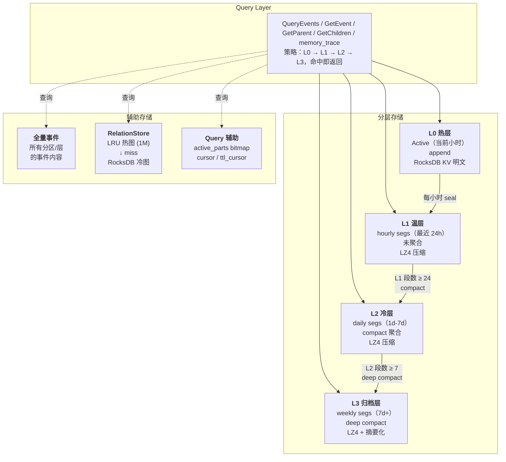
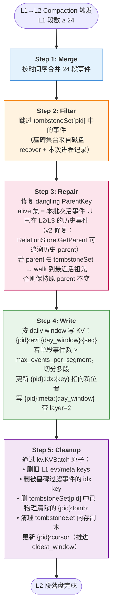

# 事件存储分层架构设计（v2，规模化修订）

> **文档版本**：v2.0（规模化修订）
> **编写日期**：2026-05-04（v1.0）
> **修订日期**：2026-05-04（v2.0）
> **状态**：设计阶段，指导 `harden-event-storage-for-scale` change 落地
> **设计目标**：长期持续运行、10 events/s 稳态、1B+ 事件规模下仍可运行的事件持久化与检索系统
> **核心隐喻**：RocksDB LSM-Tree + 应用层语义分层
> **关键原则**：不可变内容 + 可变关系分离；全依赖 RocksDB WAL 保证崩溃安全；不留半成品抽象

---

## 版本差异说明（v1 → v2）

v1 假设百万级事件、内存全量 RelationStore、独立 journal/snapshot。在评审中发现该假设与 tagent 真实运行场景（10 events/s × 数年 = 1B+ 事件）严重不匹配，v2 全面修订。

| 维度 | v1 方案 | v2 方案 |
|---|---|---|
| 事件规模假设 | 百万级 | 1B+ |
| RelationStore | 全量内存 + journal + snapshot | LRU 热图 + RocksDB 冷图（全依赖 RocksDB WAL） |
| Init 启动扫描 | 扫 `{pid}:meta:` 前缀 | `global:active_partitions` bitmap + `{pid}:cursor` 点查 |
| TTL 扫描 | 全量周期扫描 | `{pid}:ttl_cursor` 时间游标 |
| 段大小 | 固定小时窗口 | 小时窗口 + `max_events_per_segment` 自适应提前 seal |
| L3 归档 | 可选、文档提及 | 必须、带 `archive_summary_types` 配置驱动 |
| EventCache | LRU 层 | 移除（RocksDB block cache 已足够） |
| Bitmap Tombstone | Roaring Bitmap | `map[int64]struct{}`（规模下可控，简单胜过复杂） |
| 水平扩展 | 未规划 | 锁定本地 CLI 集成；不预留 mode 配置；若确需水平扩展单起 future change |

---

## 一、动机与规模

### 1.1 为什么需要重新设计

tagent 是长期持续运行的 Agent 系统。每次 LLM 交互（思考、工具调用、用户输入、系统回执）都产生事件，事件持久化到 MemoryStore 支持因果回溯、历史检索、上下文压缩、知识复用。

当前 FileBackend 的"每事件一个 JSON 文件"方案在事件量级 >10 万时开始退化：`os.ReadDir` + 逐文件解析让 `QueryEvents` 从 ms 级退化到秒级。

### 1.2 规模假设（v2 关键修订）

```
稳态流量：      10 events/s（system-input 持续消费）
突发流量：      100 events/s（短时）
持续运行：      3 年以上
总事件数：      ~1B （10 × 86400 × 365 × 3）
单分区热点：    单 partition 可达 300M events
单小时段：      热点分区 ~36K events
写入 P99：      < 3ms
查询 P99：      QueryEvents Limit=10 < 10ms；GetEvent < 2ms
内存上限：      RelationStore LRU 默认 1M entries（~30MB）
磁盘预算：      LZ4 压缩后 ~100-500GB
```

### 1.3 上游问题清单

v1 识别出的 14 个缺陷 + v2 评审新发现的 3 个（D1 StoreEvents 多窗口 seq 碰撞、D4 repairDangling 跨批次 alive、D16 resolvePartitions 默认返回空）+ 规模级新增 7 个缺口（RelationStore 内存上限、Init 扫描时间、TTL 扫描效率、单段大小、L3 归档、Snowflake 溢出、水平扩展），合计 24 个工作项，在 `harden-event-storage-for-scale` change 中一次性交付。

---

## 二、设计目标与原则

### 2.1 核心目标

| 目标 | 指标 |
|---|---|
| 持续可运行 | 3 年单实例不崩、磁盘不爆、内存稳定 |
| 高性能 | QueryEvents < 10ms、GetEvent < 2ms、GetParent 热路径 < 10μs |
| 崩溃安全 | 任何时刻 SIGKILL 重启后数据一致 |
| 简洁干净 | 无未引用抽象、无半成品模块、发布即可维护 |

### 2.2 设计原则

1. **访问局部性**：最近访问的事件再次被访问概率高，LRU 缓存 + 分层查询
2. **内容/关系分离**：事件内容不可变（段文件），关系可变（独立 RelationStore）
3. **全依赖 RocksDB WAL**：不维护应用层独立 WAL，写路径简单可靠
4. **EventKey 自包含**：Snowflake Key 内含时间戳，无需外部索引定位段
5. **游标替代扫描**：启动、TTL 等热路径用游标点查，避免 O(N) 前缀扫描
6. **Compaction 闭环**：墓碑 → 合并 → 物理清除 → 归档，系统不因时间推移退化
7. **simple > clever**：Roaring Bitmap / LRU Cache / Bloom Filter 不默认引入，除非已被证明是瓶颈

---

## 三、分层架构总览

### 3.1 四层模型



### 3.2 层级配置与迁移

| 层级 | 窗口 | 触发 seal/compact | 事件量典型值 | 存储格式 |
|---|---|---|---|---|
| L0 Active | 当前小时 | 每小时 整点 seal | 0-36K | RocksDB KV 明文 |
| L1 hourly | 1h | L1 段数 ≥ 24 触发 L1→L2 | ~36K/段 | RocksDB KV（LZ4 自动压缩） |
| L2 daily | 1d（按事件数分片） | L2 段数 ≥ 7 触发 L2→L3 | ~860K/段，超 `max_events_per_segment` 则分片 | RocksDB KV（LZ4） |
| L3 weekly | 7d | 默认不再 compact | ~6M/段，摘要化后更小 | RocksDB KV（LZ4） + 按类型摘要化 |

**关键：段边界不是物理文件，是 KV key 前缀**。`42:evt:{window_ts}:{seq}` 的 `{window_ts}` 对齐到段的起始时间戳，`scan_prefix` 即可列出段内所有事件。

---

## 四、核心变革：关系与内容分离

### 4.1 为什么分离（v1 结论保留）

事件内容不可变（生成后不改），但关系可变（Compress 重写因果链、Recall 建跨会话关联、逐出段时悬垂引用需上移）。将关系独立出来让段文件保持不可变。

### 4.2 RelationStore v2：LRU 热图 + RocksDB 冷图

**v1 问题**：全量内存 + journal + snapshot 在 1B 事件规模下内存 ~30GB、snapshot IO 阻塞写路径——不可行。

**v2 方案**：

```
SetParent(child, parent):
  1. LRU.Put(child → parent)       // 热图更新
  2. kv.KVPut("{pid}:rel:{child}", "{parent}")    // 同步写 RocksDB
  3. kv.KVPut("{pid}:revrel:{parent}:{child}", "")  // 反向索引

GetParent(child):
  1. LRU.Get(child) → 命中返回    // <1μs
  2. miss → kv.KVGet("{pid}:rel:{child}") → LRU.Put  // ~1ms

GetChildren(parent, limit=100):
  1. kv.KVScan("{pid}:revrel:{parent}:", limit)
  2. 解析 key suffix 得到 child_key 列表
  3. 返回 (children, hasMore)   // 只返回直接 children

RemoveRelations(key):
  1. parent = GetParent(key)
  2. kv.KVDelete("{pid}:rel:{key}")
  3. kv.KVDelete("{pid}:revrel:{parent}:{key}")
  4. LRU.Invalidate(key)
```

**关键取舍**：
- ❌ 砍掉独立 journal：SetParent 同步写 RocksDB，RocksDB WAL 即是 journal
- ❌ 砍掉 snapshot：RocksDB 内部已持久化，启动直接可用
- ✅ LRU 保留：热路径 <1μs；冷路径 ~1ms 也可接受（memory_trace 20 步 = 20ms）
- ✅ GetChildren 不递归：强制调用方分层 BFS，避免意外返回百万级 children

**内存预算**：
- LRU 默认 1M entries ≈ 30MB（含 map overhead）
- 可配 `relation_store.lru_size` 调整

**写放大**：
- 每次 SetParent 触发 2 次 RocksDB put（rel + revrel）+ 1 次 LRU put
- 10 events/s × 2 put = 20 put/s，完全在 RocksDB 吞吐之内

### 4.3 FullEvent 定义（不变）

```go
type FullEvent struct {
    EventKey     int64
    PartitionID  int
    EventType    string
    EventSummary string
    Timestamp    int64
    Content      string
    ToolCalls    []model.ToolCall
    ToolResults  map[string]interface{}
    Metadata     map[string]string
    // ParentKey 移除 — 由 RelationStore 维护
}
```

### 4.4 RelationStore 接口 v2

```go
type RelationStore interface {
    // 写入（同步持久化）
    SetParent(childKey, parentKey int64) error

    // 读取
    GetParent(childKey int64) (int64, error)
    GetParents(keys []int64) (map[int64]int64, error)  // 批量优化
    GetChildren(parentKey int64, limit int) ([]int64, bool, error)  // bool = hasMore

    // 删除
    RemoveRelations(key int64) error

    // v1 的 Snapshot / LoadSnapshot / ReplayJournal 已删除：RocksDB 自持久化
}

type RelationStoreProvider interface {
    RelationStore() RelationStore
}
```

---

## 五、Key Schema（v2 完整版）

```
─── 事件内容 ──────────────────────────────────────────────────────
  {pid}:evt:{window_ts}:{seq}        事件 JSON
                                      window_ts = floor(ts/3600)*3600
                                      seq = 段内序号，StoreEvents 批量写
                                            按 (pid, window_ts) 分组独立计数
                                            （避免 v1 多窗口 seq 碰撞 bug）

─── 事件索引 ──────────────────────────────────────────────────────
  {pid}:idx:{event_key}              "{window_ts}:{seq}"

─── 段元信息 ──────────────────────────────────────────────────────
  {pid}:meta:{window_ts}             {event_count, first/last_key,
                                      min/max_timestamp, layer,
                                      tombstone_count}

─── 墓碑标记 ──────────────────────────────────────────────────────
  {pid}:tomb:{event_key}             "" (存在即墓碑)

─── Relation 正向 ─────────────────────────────────────────────────
  {pid}:rel:{child_key}              "{parent_key}"

─── Relation 反向索引（支持 GetChildren） ────────────────────────
  {pid}:revrel:{parent_key}:{child_key}   "" (存在即关系)

─── 分区游标（Init / TTL 热路径） ─────────────────────────────────
  {pid}:cursor                       {oldest_window, latest_window,
                                      seq_counter}
  {pid}:ttl_cursor                   {next_window_to_check}

─── 全局元数据 ────────────────────────────────────────────────────
  global:active_partitions           2048 bit bitmap（partition 是否活跃）
```

---

## 六、写入路径（StoreEvent）

```
MemoryPlugin.onEvent(rawEvent)
  │
  ├─ 1. NewSnowflakeEventKey()
  │     └─ 同秒 sequence 达 4096 时阻塞到下一秒
  │
  ├─ 2. 构造 FullEvent（不含 ParentKey）
  │
  ├─ 3. FileSegmentStore.StoreEvent(event)
  │     │
  │     ├─ 3.1 partitionState.mu.Lock()
  │     ├─ 3.2 检查 windowTS 切换：若跨 window 则重置 seq=0
  │     ├─ 3.3 ensureSegmentMeta()：若新 window 写 meta key
  │     ├─ 3.4 kv.KVPut({pid}:evt:{window}:{seq}, eventJSON)
  │     ├─ 3.5 kv.KVPut({pid}:idx:{key}, "{window}:{seq}")
  │     ├─ 3.6 检查 events_in_segment ≥ max_events_per_segment → 提前 seal
  │     └─ 3.7 partitionState.mu.Unlock()
  │
  ├─ 4. RelationStore.SetParent(key, parentKey)
  │     ├─ 4.1 LRU.Put(key → parentKey)
  │     ├─ 4.2 kv.KVPut({pid}:rel:{key}, "{parent}")
  │     └─ 4.3 kv.KVPut({pid}:revrel:{parent}:{key}, "")
  │
  └─ 5. 更新 {pid}:cursor（latest_window 推进）
        懒更新：每 N 次写入或 seal 时批量写一次
```

**StoreEvents（批量）**：按 (pid, window_ts) 分组独立维护 seq 计数，避免 v1 Go map 随机顺序导致的 seq 碰撞。

---

## 七、查询路径

### 7.1 QueryEvents 流程（v2 优化）

```
QueryEvents(opts)
  │
  ├─ 1. 确定分区：
  │     if opts.PartitionIDs 为空：读 global:active_partitions bitmap
  │     else：使用指定分区
  │
  ├─ 2. 对每个分区：读 {pid}:cursor 得到 (oldest, latest)
  │     时间窗口与 [oldest, latest] 取交集，得到待扫 window 列表
  │
  ├─ 3. 对每个 window：kv.KVRange(
  │       start={pid}:evt:{window}:,
  │       end  ={pid}:evt:{window+1}:,
  │       limit=opts.Limit + opts.Offset + buffer
  │     )
  │
  ├─ 4. 过滤 + 墓碑检查：
  │     for each entry:
  │       if tombstoneSet[pid].IsTombstone(eventKey): skip
  │       if matchesQuery(event, opts): append
  │       if len(results) ≥ limit+offset: break  // 短路
  │
  ├─ 5. RelationStore.GetParents(keys) 批量补 parentKey
  │
  └─ 6. 排序 + 分页 → 返回
```

### 7.2 GetEvent 流程

```
GetEvent(key)
  │
  ├─ 1. kv.KVGet({pid}:idx:{key}) → "{window}:{seq}"
  ├─ 2. kv.KVGet({pid}:evt:{window}:{seq}) → eventJSON
  ├─ 3. json.Unmarshal → FullEvent
  └─ 返回
```

两次 KV 点查，每次 P99 ~1ms。v1 的 EventCache 被 RocksDB block cache 取代。

### 7.3 memory_trace 流程

```
memory_trace(startKey, maxSteps=20)
  │
  ├─ 1. chain = [startKey]
  ├─ 2. for i in 1..maxSteps:
  │       parent = RelationStore.GetParent(chain.last)
  │       if parent == 0: break
  │       chain.append(parent)
  │
  ├─ 3. 仅当需要摘要：batch GetEvent(chain) → 填充 EventSummary
  └─ 返回 chain
```

**关键**：RelationStore 查询走 LRU（热路径 <1μs，冷 ~1ms）。20 步 trace 热路径 ~20μs，冷路径 ~20ms。

---

## 八、Compaction 机制

### 8.1 触发条件

| 层迁移 | 触发 | 操作 |
|---|---|---|
| L0 → L1 | 每小时整点 or `max_events_per_segment` 达 | seal：写 meta、更新 cursor |
| L1 → L2 | L1 段数 ≥ 24 | merge + filter + repair + 写 L2 + 删 L1 |
| L2 → L3 | L2 段数 ≥ 7 | deep compact：同上 + 按 `archive_summary_types` 摘要化 |

### 8.2 L1→L2 Compaction 五步流程



### 8.3 L2→L3 Deep Compaction

L1→L2 的全部步骤 +：

**摘要化**（按 `partition_defaults.archive_summary_types` 配置）：

```yaml
partition_defaults:
  archive_summary_types:
    external_input:    full        # 完整保留
    agent_output:      full        # 完整保留
    thinking_plan:     summary     # 仅保留 EventSummary
    context_compress:  summary     # 仅保留 EventSummary
    action_command:    partial     # 保留 ToolCalls 但丢 ToolResults
```

**LLM 驱动摘要**（未在本期交付）：初版仅使用预置 EventSummary 字段；将来由独立 change `llm-event-summary` 接入 LLM 生成更高质量摘要。代码中预留 hook 点：

```go
type SummaryGenerator interface {
    GenerateSummary(event FullEvent) (string, error)
}
// 默认实现：返回 event.EventSummary（pass-through）
// 未来 change 注入 LLM 实现
```

### 8.4 Compaction 调度

```
Compactor 后台 goroutine，每 5 分钟唤醒:

checkAndCompact():
  1. checkHourlySeal()        L0 → L1（Active seal）
  2. checkL1ToL2()            遍历活跃分区，L1 段数 ≥ 24 触发
  3. checkL2ToL3()            遍历活跃分区，L2 段数 ≥ 7 触发
  
串行执行：每次只运行一个 compaction 任务，避免 RocksDB IO 争抢
```

---

## 九、生命周期管理

### 9.1 TTL 扫描（v2 游标优化）

v1 问题：每次全量扫事件，10M 活跃事件 → ~2 分钟。

v2 方案：`{pid}:ttl_cursor` 指向下一个待检查的 window。

```
LifecycleManager 后台 goroutine，每 10 分钟唤醒:

checkTTL(pid):
  cursor = kv.KVGet({pid}:ttl_cursor) 或 oldest_window
  for window = cursor; window < now-ttl; window += windowSize:
    entries = kv.KVRange({pid}:evt:{window}:, {pid}:evt:{window+1}:)
    for entry in entries:
      event = json.Unmarshal(entry.value)
      if now - event.Timestamp > ttl_for_type(event.EventType):
        tombstoneSet[pid].MarkTombstone(event.EventKey)
        kv.KVPut({pid}:tomb:{event.EventKey}, "")
    // 游标推进
    kv.KVPut({pid}:ttl_cursor, window+windowSize)

只扫 cursor 之后的窗口，每次扫描成本 O(过期事件数)
```

### 9.2 容量逐出

```
checkCapacity(pid):
  state = partitionStates[pid]
  if state.eventCount > max_events:
    // 从最老段开始标墓碑直到降至阈值
    cursor = kv.KVGet({pid}:cursor).oldest_window
    to_evict = state.eventCount - max_events
    for window = cursor; to_evict > 0; window += windowSize:
      entries = kv.KVRange({pid}:evt:{window}:, ...)
      for entry in entries:
        tombstoneSet[pid].MarkTombstone(eventKey)
        kv.KVPut({pid}:tomb:{eventKey}, "")
        state.eventCount--
        to_evict--
        if to_evict <= 0: break
```

### 9.3 悬垂引用保护

墓碑标记时即时修复 children 的 parent：

```
MarkTombstone(key):
  1. children, _, _ = rel.GetChildren(key, limit=1000)
  2. alive_ancestor = findAliveAncestor(key)
  3. for child in children:
       rel.SetParent(child, alive_ancestor)
  4. rel.RemoveRelations(key)
  5. tombstoneSet.MarkTombstone(key)
  6. kv.KVPut({pid}:tomb:{key}, "")
```

---

## 十、启动流程（v2 优化）

### 10.1 Init() 流程

```
FileSegmentStore.Init():
  │
  ├─ 1. 读 global:active_partitions bitmap
  │     → 得到活跃分区列表（而非扫 2048 个分区）
  │
  ├─ 2. 对每个活跃分区：
  │     ├─ 2.1 读 {pid}:cursor → {oldest_window, latest_window, seq_counter}
  │     ├─ 2.2 恢复 partitionState.seqCounter = cursor.seq_counter
  │     ├─ 2.3 恢复 partitionState.currentWindow = cursor.latest_window
  │     └─ 2.4 初始化 tombstoneSet[pid]：kv.KVScan({pid}:tomb:, limit=unlimited)
  │            （惰性：仅在首次访问该分区时加载）
  │
  ├─ 3. RelationStore LRU 预热（可选）
  │     读最近 N 天的 {pid}:rel: 前缀填充 LRU
  │     （配置 relation_store.lru_preload_days 默认 1）
  │
  └─ 4. 启动 LifecycleManager 和 Compactor
```

### 10.2 Init 性能

| 规模 | v1 扫 meta | v2 cursor 点查 |
|---|---|---|
| 1M meta keys | ~12s | ~200ms（2048 cursor 点查） |
| 18M meta keys (1 年) | ~225s | ~200ms |
| 54M meta keys (3 年) | ~10 分钟 | ~200ms |

---

## 十一、崩溃恢复

| 场景 | 影响 | 恢复方式 |
|---|---|---|
| StoreEvent 中途 SIGKILL | 部分 put 已进 RocksDB WAL | RocksDB 重启自动 replay，可能 idx/evt/rel 不完全一致 |
| KVBatch 中途 crash | 整个 batch 未 commit | RocksDB WriteBatch 原子性保证全无 |
| TTL 扫描中途 crash | 墓碑部分标记 | 下次从 ttl_cursor 继续，已标记的下次跳过 |
| Compaction 中途 crash | L2 部分写入，L1 未删 | 下次 compaction 重新执行（先写新、后删旧，幂等） |
| LRU 冷启动 | RelationStore 未预热 | 自然 miss→KV，逐步热起来 |

**核心保证**：所有写入依赖 RocksDB WAL，tagent 侧不维护独立日志。写路径每个操作即"commit or not"，无"半段 WAL"场景。

---

## 十二、Snowflake 同秒溢出处理

```go
func NewSnowflakeEventKey(nodeID, partitionID int) int64 {
    mu.Lock()
    defer mu.Unlock()
    now := time.Now().UnixMilli()
    if now == lastMillis {
        sequence = (sequence + 1) & 0xFFF  // 12 bit = 4096
        if sequence == 0 {
            // 同毫秒耗尽，阻塞到下一毫秒
            for now <= lastMillis {
                now = time.Now().UnixMilli()
            }
        }
    } else {
        sequence = 0
    }
    lastMillis = now
    return (now << 22) | (int64(nodeID) << 17) | (int64(partitionID) << 12) | int64(sequence)
}
```

10 events/s 场景永不触发阻塞；突发 4096+ events/ms 自动限流到下一毫秒。

---

## 十三、关键设计决策汇总

| # | 决策 | 选择 | 理由 |
|---|---|---|---|
| D1 | 文件粒度 | KV prefix 段（无物理文件） | EventKey 自带时间戳，零成本定位段 |
| D2 | 关系存储 | LRU 热图 + RocksDB 冷图（无 journal） | 规模下内存不可行；RocksDB WAL 已保证持久化 |
| D3 | 内容不可变 | 段 append-only，不原地改 | 关系变更走 RelationStore，不改段 |
| D4 | 分层查询 | L0→L1→L2→L3 逐层回退 | 大多数查询命中 L0/L1 |
| D5 | Compaction 异步 | 后台 goroutine 串行执行 | 不阻塞读写；避免 IO 争抢 |
| D6 | Tombstone 机制 | 内存 `map[int64]struct{}` + KV 持久化 + 懒加载 + compaction 物理清除 | 规模下 map 足够；Roaring Bitmap 当前非瓶颈 |
| D7 | EventKey 自包含 | 内嵌时间戳推导段 | 无需外部 key→file 索引 |
| D8 | 编码 | 无缩进 JSON（value=JSON 字符串） | 兼容好；RocksDB LZ4 压缩抵消冗余 |
| D9 | 分区级锁 | 每 partition 独立 mutex | 不同 Agent 写入完全并行 |
| D10 | 启动扫描 | active_partitions bitmap + cursor 点查 | 规模下避免 O(N meta) 扫描 |
| D11 | TTL 扫描 | 时间游标 `{pid}:ttl_cursor` | 避免全量扫描，O(过期数) |
| D12 | 段大小 | 小时窗口 + max_events 自适应 | 防止热点分区单段过大 |
| D13 | L3 归档 | 按 archive_summary_types 摘要化 | 控制长期磁盘占用 |
| D14 | Snowflake 溢出 | 同毫秒 4096 阻塞到下一毫秒 | 突发自动限流，10 events/s 永不触发 |
| D15 | GetChildren | 直接 children + limit 分页 | 防止意外返回百万级结果 |
| D16 | EventCache | 删除（RocksDB block cache 替代） | 简洁胜过冗余抽象 |
| D17 | Bitmap Tombstone | 用 `map[int64]struct{}` | 规模下简单足够 |
| D18 | LLM 摘要 | 独立 future change | 当前 EventSummary 足够；LLM 延后 |
| D19 | 双写迁移 | 废弃：不做兼容过渡 | 项目未发布，直接切换；保持干净 |

---

## 十四、性能基准预估

假设：单分区 100M 事件，tagent 稳态 10 events/s

| 操作 | 延迟目标 | 说明 |
|---|---|---|
| StoreEvent | P99 < 3ms | 2 次 KV put (evt + idx) + 2 次 (rel + revrel) |
| GetEvent | P99 < 2ms | 2 次 KV 点查（idx → evt） |
| GetParent (LRU 命中) | < 1μs | 纯内存 |
| GetParent (LRU miss) | P99 < 1ms | KV 点查 |
| GetChildren (limit=100) | P99 < 3ms | KV scan_prefix |
| memory_trace (20 步) | P99 < 20ms | 最坏全 miss |
| QueryEvents (Limit=10) | P99 < 10ms | 最近 window KV range |
| QueryEvents (Keyword, 24h) | P99 < 100ms | 24 个 window range + 过滤 |
| Init (10 年数据) | P99 < 500ms | 2048 cursor 点查 |
| Compaction L1→L2 (24 段) | 后台完成，< 2s | 不影响在线 |

---

## 十五、磁盘预算

假设：10 events/s × 3 年 = ~1B events，每事件平均 1KB

| 层 | 事件数占比 | 原始大小 | LZ4 压缩后 |
|---|---|---|---|
| L0 + L1 | 0.02%（24h） | ~800MB | ~200MB |
| L2 | 0.2%（7d） | ~5GB | ~1.2GB |
| L3（摘要化 50%） | 99.78%（>7d） | ~500GB → 摘要 200GB | ~50GB |
| Relation KV | 全量 | ~30GB（rel + revrel） | ~7GB |
| 墓碑 tomb KV | 过期比例 ~30% | ~10GB（compaction 后清理） | ~2GB |
| 索引 idx KV | 全量 | ~50GB | ~12GB |
| **总计** | | ~600GB | **~70GB** |

---

## 十六、兼容与迁移

**项目未发布**，不做双写迁移。切到新架构直接覆盖：

- 旧 FileBackend（每事件一文件）：整个删除
- 现有 `memory/in_memory_store.go`：保留（开发和测试用）
- 现有 `memory/file_store.go`：删除
- 新的 `FileSegmentStore`：基于 RustViking KV

---

## 十七、路线图

全部工作项在 `harden-event-storage-for-scale` change 中一次交付。

| 阶段 | 内容 | 工作量估算 |
|---|---|---|
| Stage 1 | RustViking v0.2.0（R1-R4）交付 | ~2 天（rustviking 团队） |
| Stage 2 | tagent 基础修复（17 项缺陷） | ~5 天 |
| Stage 3 | tagent 规模化能力（7 项） | ~5 天 |
| Stage 4 | 集成测试 + E2E | ~3 天 |
| **合计** | | **~15 天** |

---

## 附录 A：与 RocksDB LSM 映射

| RocksDB 概念 | 事件系统映射 |
|---|---|
| MemTable | L0 Active 段（KV 写入） |
| WAL | RocksDB 自带 WAL（tagent 不再独立维护） |
| Level-0 SST | L1 hourly segments |
| Level-1 SST | L2 daily segments |
| Level-2+ SST | L3 weekly segments |
| Compaction | 应用层 L1→L2→L3 合并（非 RocksDB 内部 compaction） |
| Tombstone | tombstoneSet + {pid}:tomb: keys |
| Bloom Filter | 暂不引入（段级 min/max_timestamp 足够） |

---

## 附录 B：砍掉的 v1 方案

| v1 元素 | 砍的理由 |
|---|---|
| 物理段文件（.jsonl） | KV prefix 段已足够 |
| 独立 .idx 文件 | `{pid}:idx:{key}` KV 已等价 |
| relations.journal 独立 WAL | RocksDB WAL 已保证 |
| relations.snap 快照 | RocksDB 自持久化 |
| EventCache LRU | RocksDB block cache 替代 |
| Roaring Bitmap | map 已足够，不引入复杂依赖 |
| AGFS 用于事件 | 事件走 KV；AGFS 仅用于 skill/prompt |
| 双写迁移 Phase A/B/C/D | 项目未发布，直接切换 |

---

> **文档版本**：v2.0
> **编写日期**：2026-05-04
> **关联文档**：[RustViking 集成评估](./20260504-rustviking-integration-evaluation.md)、[openspec: harden-event-storage-for-scale](../../openspec/changes/harden-event-storage-for-scale/)
