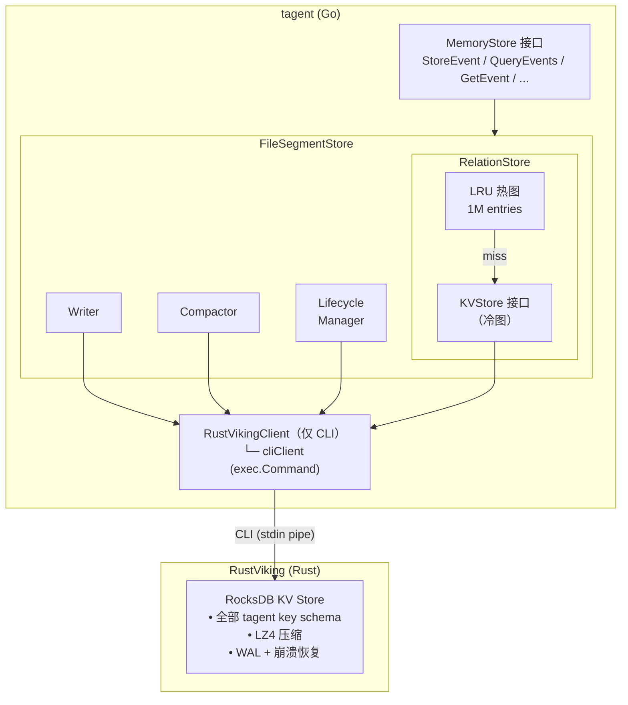
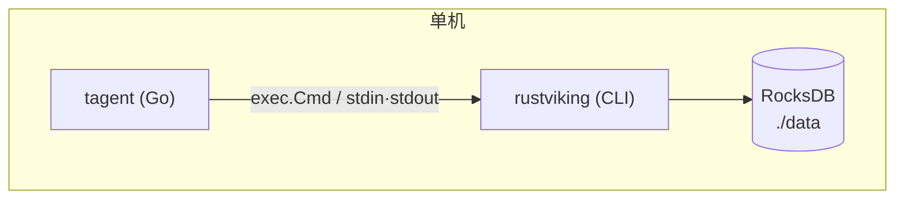

# tagent 集成 RustViking：评估与集成方案（v2）

> **文档版本**：v2.0（规模化修订）
> **编写日期**：2026-05-04（v1.0）
> **修订日期**：2026-05-04（v2.0）
> **评估对象**：[rustviking](https://github.com/SpellingDragon/rustviking) v0.1.0（目标 v0.2.0 / v0.3.0）
> **评估目标**：判断 RustViking 是否能承载 tagent 长期运行（10 events/s × 3年 = 1B+ 事件）的事件存储需求
> **关联文档**：
> - [tagent 事件存储分层架构设计](./20260504-event-storage-layered-architecture.md)
> - [RustViking 对接 tagent 需求单](../../../rustviking/docs/tagent-integration-requirements.md)

---

## 版本差异说明（v1 → v2）

v1 在"百万事件"假设下认为 RustViking 能力已足够。v2 在规模假设修订为 "10 events/s × 数年 = 1B+ 事件" 后，重新评估了 CLI 接口的阻断点与性能底线。tagent 与 RustViking **锁定本地 CLI 模式**集成，不规划 server / gRPC / HTTP 分支。

| 维度 | v1 评估 | v2 评估 |
|---|---|---|
| RustViking CLI 完备性 | 认为已足够 | 发现 `kv batch` 非原子、`kv range` 缺失等阻断问题 |
| 性能底线 | 默认使用 RustViking benchmark | 明确要求契约化承诺（见需求单 R4） |
| 集成模式 | 粗设 CLI，后期考虑 server | 锁定本地 CLI —— 不预留 `mode` 配置，水平扩展单起 future change |
| tagent 侧 Client 复杂度 | `longestCommonPrefix` 客户端过滤 hack | 直接走 `kv range` CLI，客户端干净 |
| 崩溃一致性 | 依赖"KV batch 原子" | 要求 RustViking 侧用 `WriteBatch` 保证，契约化 |

---

## 一、RustViking 能力全景（v2 复核）

### 1.1 核心模块

```
rustviking/
├── storage/          ← RocksDB KV 存储（tagent 强依赖）
├── agfs/             ← 虚拟文件系统（tagent 不用于事件；仅 skill/prompt）
├── index/            ← 向量索引（tagent Phase 2+ 使用）
├── vector_store/     ← 向量存储抽象（tagent Phase 2+ 使用）
├── embedding/        ← Embedding Provider（tagent Phase 2+ 使用）
├── compute/          ← SIMD 距离计算（tagent 间接受益）
├── cli/              ← CLI 命令（tagent 通过此接入）
└── config/           ← 配置管理（TOML）
```

### 1.2 tagent 关注的能力（当前期）

| 能力 | 实现状态 | tagent 依赖 |
|---|---|---|
| `kv get/put/delete` | ✅ 完整 | 🔥 事件持久化核心 |
| `kv scan_prefix` | ✅ 完整 | 🔥 段内事件扫描、GetChildren |
| `kv range` | ⚠️ trait 有但 CLI 未暴露 | 🔥 时间范围查询必需 **（R2 阻断）** |
| `kv batch` | ⚠️ CLI 实现非原子 | 🔥 Compaction 必需原子 **（R1 阻断）** |
| RocksDB LZ4 压缩 | ✅ 已配置 | 🔥 替代应用层 gzip |
| scan_prefix 迭代器 | ❌ 返回 Vec | 🟡 大结果集内存压力（R5） |

### 1.3 当前 tagent 不使用的能力（Phase 2+）

- HNSW / IVF-PQ 向量索引
- VectorStore（Memory/RocksDB/Qdrant）
- Embedding Provider
- AGFS

这些能力在后续事件语义搜索、Skill 资源管理等阶段使用，不在本期范围。**本文只评估事件存储相关能力**。

---

## 二、规模化下的关键验证

### 2.1 性能承载力

基于 RustViking benchmark（KV 写入 ~50K QPS P99 <2ms）和 tagent 稳态 10 events/s，容量充裕：

```
tagent 稳态写入负载：
  10 events/s × 4 KV put/event (evt + idx + rel + revrel) = 40 put/s

RustViking 单实例承载：
  ~50,000 put/s（P99 <2ms）

容量裕度：~1250× （完全够用）
```

突发峰值 100 events/s × 4 = 400 put/s，仍远低于承载上限。

### 2.2 数据规模承载

RocksDB 在单实例 TB 级数据下有成熟生产案例。tagent 预估数据：

```
总 key 数：~1B （分布在 evt/idx/rel/revrel/tomb/meta 等前缀）
LZ4 压缩后存储：~70GB
RocksDB 分层：Level-0..N，自动 compaction
```

RocksDB 一致性由 WAL 保证，tagent 侧放弃独立 WAL 设计（decision D2）。

---

## 三、v1 未发现的阻断问题（v2 新增）

### 3.1 R1：`kv batch` 原子性破坏

**问题**：`src/cli/store_commands.rs::exec_kv_batch` 当前为逐条 put/delete，非原子。崩溃时部分写入，tagent Compaction 流程断裂。

**影响**：Compaction 写新 L2 段后删旧 L1 段，若 batch 非原子，崩溃后可能同时存在新旧两份事件，`idx` 指向不定。

**解决**：RustViking 侧修复（需求 R1），使用 `WriteBatch::commit()` 原子提交。

### 3.2 R2：`kv range` CLI 未暴露

**问题**：`KvStore` trait 已有 `range()`，但 `KvOperation` 枚举和 `main.rs` dispatch 缺少 Range 分支。

**tagent 侧 hack**：计算 start/end 公共前缀 → 调 `kv scan` → 客户端过滤。跨分区查询（无共同前缀）直接失效。

**解决**：RustViking 侧新增 `kv range` 子命令（需求 R2），tagent 侧 `KVRange()` 直接调用，移除 `longestCommonPrefix` 辅助函数。

### 3.3 R3：CLI 响应结构契约

**问题**：若 RustViking 后续升级悄悄改了字段名，tagent 静默失败。

**解决**：明确契约（需求 R3），版本头、字段必须包含清单、退出码语义。

---

## 四、tagent → RustViking 使用模式

### 4.1 RustVikingClient Go 接口（v2 定稿）

```go
// RustVikingClient 封装对 RustViking 本地 CLI 的调用
type RustVikingClient interface {
    // KV 基础操作
    KVPut(key, value string) error
    KVGet(key string) (string, error)
    KVDelete(key string) error
    KVScan(prefix string, limit int) ([]KVPair, error)
    KVRange(start, end string, limit int) ([]KVPair, error)
    KVBatch(ops []KVOp) error
}

type KVPair struct {
    Key   string
    Value string
}

type KVOp struct {
    Type  string  // "put" | "delete"
    Key   string
    Value string  // put 时填
}
```

### 4.2 实现（仅 CLI）

```go
// memory/rustviking_client.go
func NewRustVikingClient(cfg RustVikingConfig) (RustVikingClient, error) {
    return newCLIClient(cfg.BinaryPath, cfg.ConfigPath), nil
}
```

tagent 与 RustViking **仅通过本地 CLI** 集成（`exec.Cmd`）。Client 不预留 `mode` 字段、不引入 `ErrServerNotImplemented` 分支；若后续确需水平扩展，单起 future change 重新评估。

### 4.3 配置（TOML）

```toml
[rustviking]
binary_path = "rustviking"          # PATH 或绝对路径
config_path = "./rustviking.toml"   # RustViking 自己的配置
```

---

## 五、Key Schema 映射到 RustViking

tagent Key Schema 全部走 RustViking KV（单 column family）：

```
{pid}:evt:{window}:{seq}            → RustViking kv put
{pid}:idx:{event_key}               → RustViking kv put / get
{pid}:meta:{window}                 → RustViking kv put / get
{pid}:tomb:{event_key}              → RustViking kv put / delete
{pid}:rel:{child_key}               → RustViking kv put / get
{pid}:revrel:{parent}:{child}       → RustViking kv put / scan / delete
{pid}:cursor                        → RustViking kv get / put
{pid}:ttl_cursor                    → RustViking kv get / put
global:active_partitions            → RustViking kv get / put
```

前缀扫描操作：

| tagent 场景 | RustViking 调用 |
|---|---|
| 列分区段 | `kv scan {pid}:meta:` |
| 时间范围查事件 | `kv range {pid}:evt:{win_start} {pid}:evt:{win_end}` |
| GetChildren | `kv scan {pid}:revrel:{parent}: limit=100` |
| 墓碑列表 | `kv scan {pid}:tomb:` |
| TTL 扫描 | `kv range {pid}:evt:{ttl_cursor} {pid}:evt:{next_window}` |
| 全墓碑初始化 | `kv scan {pid}:tomb:` (懒加载) |

---

## 六、差距分析（v2 更新）

### 6.1 RustViking 需要补齐（阻断）

| 差距 | 需求编号 | 目标版本 |
|---|---|---|
| `kv batch` 原子性 | R1 | v0.2.0 |
| `kv range` CLI 子命令 | R2 | v0.2.0 |
| CLI JSON 契约稳定性 | R3 | v0.2.0 |
| 性能基准承诺 | R4 | v0.2.0 |

### 6.2 RustViking 可演进（非阻断）

| 能力 | 需求编号 | 目标版本 |
|---|---|---|
| scan/range 迭代器 + 分页 | R5 | v0.3.0 |
| Column Family + Compaction Filter | R6 | 未定 |

### 6.3 tagent 侧需要承担（不依赖 RustViking 演进）

- 事件模型（FullEvent）
- EventKey 生成（Snowflake + 溢出阻塞）
- RelationStore（LRU + RocksDB KV 冷图）
- Compaction 调度逻辑（L1→L2→L3 触发条件）
- 生命周期（TTL 游标扫描、容量逐出）
- 墓碑管理（tombstoneSet + compaction 清理）
- EventSummary 生成（初期 pass-through，后续 LLM 独立 change）

---

## 七、集成架构

### 7.1 总体架构



### 7.2 StoreEvent 调用链（v2）

```
MemoryPlugin.onEvent(rawEvent)
  │
  ├─ 1. NewSnowflakeEventKey()  [tagent Go, 含溢出阻塞]
  │
  ├─ 2. 构造 FullEvent → JSON
  │
  ├─ 3. RustVikingClient.KVPut("42:evt:1710678000:0", eventJSON)
  │     └─ exec: rustviking kv put -k ... -v ... (stdin)
  │
  ├─ 4. RustVikingClient.KVPut("42:idx:1777...", "1710678000:0")
  │
  ├─ 5. RelationStore.SetParent(eventKey, parentKey)
  │     ├─ LRU.Put
  │     ├─ RustVikingClient.KVPut("42:rel:1777...", "...parent")
  │     └─ RustVikingClient.KVPut("42:revrel:parent:child", "")
  │
  └─ 6. 懒更新 {pid}:cursor（每 N 次写一次）
```

### 7.3 批量写（StoreEvents）优化

批量写触发时（如 Compaction 输出），使用 `kv batch`：

```
events = [...]
ops := []KVOp{}
for each event:
  ops = append(ops, KVOp{Type:"put", Key:"{pid}:evt:...", Value: json})
  ops = append(ops, KVOp{Type:"put", Key:"{pid}:idx:...", Value: pos})
  ops = append(ops, KVOp{Type:"put", Key:"{pid}:rel:...",  Value: parent})
  ops = append(ops, KVOp{Type:"put", Key:"{pid}:revrel:...", Value: ""})

RustVikingClient.KVBatch(ops)
  └─ exec: rustviking kv batch -f - (stdin: json array of ops)
```

**RustViking 侧使用 WriteBatch 保证原子**（需求 R1）。

---

## 八、部署模型

### 8.1 单机部署（v1 阶段，当前）



- tagent 进程 + rustviking CLI 独立 binary
- 每次 KV 操作一次 CLI fork（~1ms 启动开销）
- 批量操作摊薄启动开销
- **不规划 server / gRPC / HTTP 部署**；若未来确需多实例共享存储，单起 future change 评估

---

## 九、CLI 启动开销评估

单次 CLI 调用开销：

```
rustviking 二进制启动: ~1ms（冷启动，Rust 编译优化后）
参数解析:              ~0.1ms
KV 操作:               ~1-2ms
JSON 序列化响应:       ~0.1ms
总计:                  ~2-3ms
```

tagent 稳态 10 events/s × 4 CLI/event = 40 CLI/s，单 CLI 2-3ms → 120ms/s CPU 占用，可接受。

**优化点**：
- Compaction / Init 阶段批量用 `kv batch`，单次调用处理上千条
- 热路径点查走 LRU 缓存（RelationStore LRU）减少调用
- 若后期 CLI 开销成为瓶颈，单起 future change 评估 server 模式（将需新增 client 实现与配置）

---

## 十、风险评估

| 风险 | 等级 | 缓解 |
|---|---|---|
| RustViking v0.2.0 交付延期 | 🟡 中 | 阻塞 tagent change 合并；建议 rustviking 优先 R1/R2/R3 |
| CLI 启动开销累积 | 🟢 低 | 批量操作摊薄；若成为瓶颈单起 future change |
| RocksDB 数据损坏 | 🟢 低 | WAL + checksum；备份策略另议 |
| JSON 响应契约变更 | 🟡 中 | R3 契约冻结；tagent 侧加 api_version 检查 |
| 规模超出预估（>1B） | 🟢 低 | 设计容量 3 年，超出时重新评估存储策略 |
| LRU miss 率过高 | 🟡 中 | 可监控 RelationStore cache hit；调整 lru_size 或预热策略 |

---

## 十一、结论与落地

### 11.1 结论

**RustViking 经 v0.2.0 修复后完全可以承载 tagent 事件存储需求**。分工清晰：

- **tagent (Go)**：事件是什么、它们之间有什么关系、何时清理
- **RustViking (Rust)**：KV 存在哪里、如何快速找到、崩溃如何恢复

### 11.2 落地里程碑

| 里程碑 | 交付物 | 依赖 |
|---|---|---|
| M1 | rustviking v0.2.0（R1-R4） | rustviking 团队 |
| M2 | tagent `harden-event-storage-for-scale` 合并 | M1 |
| M3 | 单机端到端验证通过 | M2 |
| M4 | rustviking v0.3.0（R5 迭代器） | rustviking 团队（非阻塞） |

### 11.3 立即可执行

- [x] tagent 侧：openspec change `harden-event-storage-for-scale` 已起草
- [x] rustviking 侧：需求单 `tagent-integration-requirements.md` 已提交
- [ ] rustviking 侧：启动 v0.2.0 开发
- [ ] tagent 侧：等待 v0.2.0 后启动实施

---

> **文档版本**：v2.0
> **编写日期**：2026-05-04
> **关联文档**：[事件存储分层架构设计](./20260504-event-storage-layered-architecture.md)、[RustViking 需求单](../../../rustviking/docs/tagent-integration-requirements.md)
