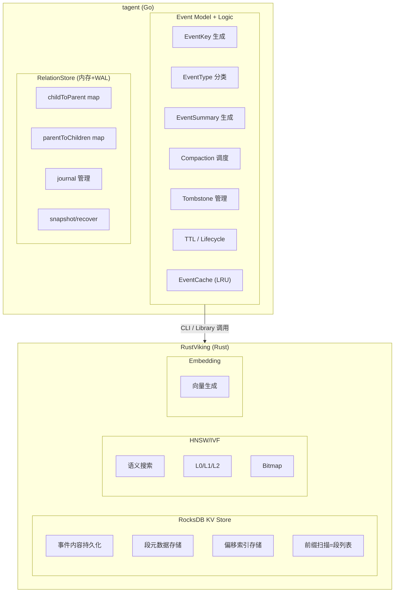
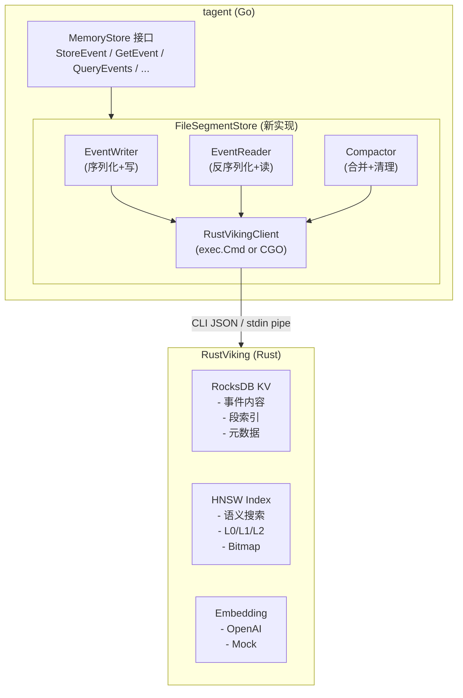
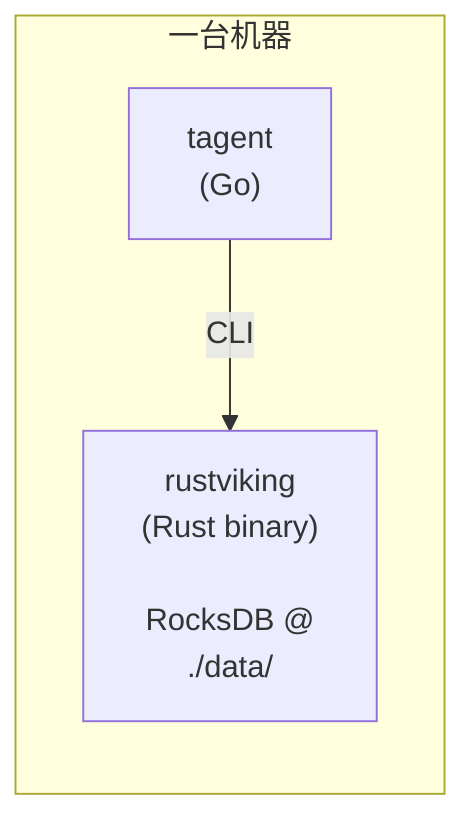
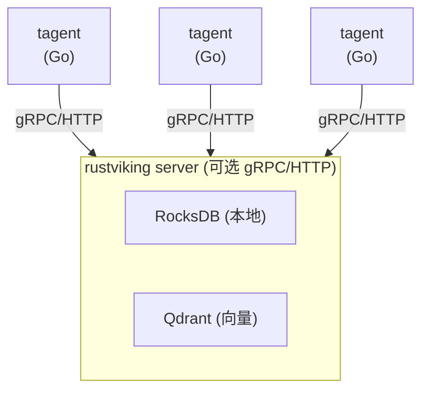

# RustViking 能力评估与 tagent 事件存储集成方案

> **评估日期**: 2026-05-04  
> **评估对象**: [rustviking](https://github.com/SpellingDragon/rustviking) v0.1.0  
> **评估目标**: 判断 rustviking 是否能替代自研文件存储层，满足 tagent 事件存储分层架构设计的需求  
> **关联文档**: [事件存储分层架构设计](./20260504-event-storage-layered-architecture.md)

---

## 一、RustViking 能力全景

### 1.1 模块总览

```
rustviking/
├── storage/          ← RocksDB KV 存储（Get/Put/Del/Scan/Range/Batch）
├── agfs/             ← 虚拟文件系统（POSIX 接口 + Radix Tree 路由）
├── index/            ← 向量索引（HNSW + IVF-PQ + L0/L1/L2 分层 + Bitmap）
├── vector_store/     ← 向量存储抽象（Memory / RocksDB / Qdrant）
├── embedding/        ← Embedding Provider（Mock / OpenAI）
├── compute/          ← SIMD 加速距离计算（NEON / AVX2 / FMA）
├── cli/              ← CLI 命令（统一 JSON 输出）
└── config/           ← 配置管理（TOML）
```

### 1.2 能力矩阵

| 能力域 | 具体能力 | 实现状态 | 与 tagent 需求的匹配度 |
|--------|---------|---------|---------------------|
| **KV 存储** | RocksDB Get/Put/Del/Scan/Range/Batch | ✅ 完整实现 | 🔥 核心依赖 |
| **虚拟文件系统** | POSIX 接口 + Radix Tree 路由 + 多后端挂载 | ✅ 完整实现 | 🟡 可部分使用 |
| **向量索引 (HNSW)** | 纯 Rust hnsw_rs，支持 L2/Cosine/DotProduct | ✅ 完整实现（含持久化） | 🔥 Phase 2 直接使用 |
| **向量索引 (IVF-PQ)** | 自研 IVF-PQ，SIMD 加速 | ✅ 完整实现 | 🔥 Phase 2 直接使用 |
| **L0/L1/L2 分层索引** | 层级过滤 + progressive refinement 搜索 | ✅ 完整实现 | 🔥 语义分层搜索 |
| **Bitmap 索引** | Roaring Bitmap（交集/并集/差集/序列化） | ✅ 完整实现 | 🔥 Tombstone + 多条件交并 |
| **向量存储抽象** | Memory / RocksDB / Qdrant 三后端 | ✅ 完整实现 | 🔥 灵活部署 |
| **Embedding Provider** | Mock + OpenAI，可扩展 | ✅ 完整实现 | 🔥 Phase 2 直接使用 |
| **SIMD 距离计算** | ARM NEON / x86 AVX2+FMA，4-8x 加速 | ✅ 完整实现 | 🔥 向量搜索加速 |
| **CLI 接口** | 统一 JSON 输出 + 结构化退出码 | ✅ 完整实现 | 🔥 Go→CLI 调用 |
| **Library 接口** | Rust crate 可嵌入 | ✅ 完整实现 | 🟢 备选方案 |
| **向量同步管理器** | URI 前缀删除/更新 | ✅ 完整实现 | 🟡 事件向量同步 |

---

## 二、与 tagent 事件存储设计的映射分析

### 2.1 总体结论：高度匹配，分工明确



### 2.2 逐层映射

| 我们的设计层 | RustViking 提供的能力 | 实现方式 | 匹配度 |
|-------------|---------------------|---------|--------|
| **L0 热层 ActiveSegment** | RocksDB `put` 追加写入 | key=`{pid}:seg:active:{seq}` → value=JSON | ✅ 天然支持 |
| **L1 温层段文件** | RocksDB `put` + prefix `scan` | key=`{pid}:seg:L1:{ts}:{seq}` | ✅ prefix scan = 段列表 |
| **L2/L3 冷/归档层** | RocksDB 自带 LZ4 压缩 | 无需额外 gzip | ✅ 比自建 gzip 更优 |
| **段内偏移索引 (.idx)** | RocksDB `put` + `get` | key=`{pid}:idx:{eventKey}` → value=offset | ✅ O(1) 点查 |
| **段元信息 (meta)** | RocksDB `put` + `get` | key=`{pid}:meta:{ts}` → value=JSON | ✅ |
| **Tombstone Set** | Bitmap `add`/`contains`/`difference` | 内存 Bitmap + 持久化到 KV | ✅ 集合运算高效 |
| **Compaction** | KV `scan` + `batch` delete | 读旧段 → 合并 → 批量写新段 + 删旧段 | ✅ 事务性保证 |
| **RelationStore** | ❌ 不适用 | tagent Go 层自建（内存双图 + WAL） | — |
| **Event 模型** | ❌ 不适用 | tagent Go 层定义 FullEvent 结构 | — |
| **TTL / 生命周期** | ❌ 无内置 | tagent Go 层实现，标记 tombstone | — |
| **EventCache LRU** | ❌ 不适用 | tagent Go 层实现 | — |

### 2.3 KV Key Schema 设计

利用 RocksDB 的字节序排序特性，设计前缀方案：

```
Key Schema (按字节序自动排序):

事件内容:
  {pid}:evt:{window_ts}:{seq}        → {"event_key":..., "content":..., ...}
  // window_ts = timestamp / 3600 * 3600 (小时对齐)
  // seq = 事件在段内的序号 (0, 1, 2, ...)
  // 天然按时间 + 写入顺序排列

段内偏移索引:
  {pid}:idx:{event_key}              → {window_ts}:{seq}  (指回事件内容的 key suffix)
  // 或直接存 value 为 u64 字节偏移

段元信息:
  {pid}:meta:{window_ts}             → {"event_count":247, "first_key":..., ...}

Tombstone:
  {pid}:tomb:{event_key}             → "" (标记存在即墓碑)

向量:
  {pid}:vec:{event_key}             → [f32×768]  (由 VectorStore 管理)
```

**前缀扫描能力**：

| 操作 | 扫描 Prefix | 效果 |
|------|------------|------|
| 列出某分区的所有段 | `{pid}:meta:` | 得到所有 window_ts |
| 列出某段时间内的段 | `{pid}:evt:{start_ts}` ~ `{pid}:evt:{end_ts}` | 时间范围裁剪 |
| 列出段内所有事件 | `{pid}:evt:{window_ts}:` | 顺序扫描段内事件 |
| 列出所有墓碑 | `{pid}:tomb:` | Compaction 处理 |
| 查某事件的索引 | `{pid}:idx:{event_key}` | O(1) 点查 |

**核心优势**：RocksDB 的 LSM 结构天然支持顺序扫描，`prefix scan` 比 `os.ReadDir` + 逐个 `os.ReadFile` 快 2-3 个数量级。

---

## 三、关键能力深度评估

### 3.1 RocksDB KV Store

**现状**：
```rust
pub trait KvStore: Send + Sync {
    fn get(&self, key: &[u8]) -> Result<Option<Vec<u8>>>;
    fn put(&self, key: &[u8], value: &[u8]) -> Result<()>;
    fn delete(&self, key: &[u8]) -> Result<()>;
    fn scan_prefix(&self, prefix: &[u8]) -> Result<Vec<(Vec<u8>, Vec<u8>)>>;
    fn range(&self, start: &[u8], end: &[u8]) -> Result<Vec<(Vec<u8>, Vec<u8>)>>;
    fn batch(&self) -> Result<Box<dyn BatchWriter>>;
}
```

**评估**：
- ✅ `get`/`put`/`delete`：基础操作完备
- ✅ `scan_prefix`：段列表、段内事件扫描的核心操作
- ✅ `range`：时间范围裁剪的关键操作
- ✅ `batch`：compaction 原子写入的保证
- ⚠️ `scan_prefix` 和 `range` 返回 `Vec`——数据量大时需改迭代器模式。当前实现通过 CLI 单次调用，每次请求数据量可控
- ✅ RocksDB 已配置 LZ4 压缩（`set_compression_type(Lz4)`），无需额外 gzip

**性能基准**（来自 rustviking benchmark）：
- KV 写入: ~50K QPS, P99 < 2ms
- KV 读取: ~80K QPS, P99 < 1ms

对 tagent 的 LLM 驱动事件频率（~1-10 event/s），远超需求。

### 3.2 HNSW 向量索引

**现状**：`HnswIndex` 基于纯 Rust `hnsw_rs` 库

```rust
pub trait VectorIndex: Send + Sync {
    fn insert(&self, id: u64, vector: &[f32], level: u8) -> Result<()>;
    fn insert_batch(&self, vectors: &[(u64, Vec<f32>, u8)]) -> Result<()>;
    fn search(&self, query: &[f32], k: usize, level_filter: Option<u8>) -> Result<Vec<SearchResult>>;
    fn delete(&self, id: u64) -> Result<()>;
    fn get(&self, id: u64) -> Result<Option<Vec<f32>>>;
    fn count(&self) -> u64;
}
```

**评估**：
- ✅ `level_filter` 天然支持我们的 L0/L1/L2 分层搜索
- ✅ `insert` 的 `level: u8` 参数可直接传入事件层级
- ✅ 持久化支持（`save`/`load` + `HnswIndexPersister`），向量不丢失
- ✅ 纯 Rust 无 CGO，编译部署简单
- ⚠️ `delete` 是软删除（从映射表移除，图中的向量残留）。对事件存储可接受——tombstone 事件在 compaction 时物理移除，向量索引 rebuild 即可
- ✅ 1000 条 × 128 维测试通过，生产级 `hnsw_rs` 库支撑更大规模

**与 Phase 2（向量语义搜索）的关系**：HNSW 索引可直接用于 `memory_search` 子工具。事件写入时可同步调用 `index.insert(eventKey, embedding, level)`。

### 3.3 Bitmap

```rust
pub struct Bitmap {
    bits: RoaringBitmap,
}
// intersection / union / difference / cardinality / serialize / deserialize
```

**与 Tombstone 的映射**：

```
标记墓碑:  bitmap.add(eventKey)
检查墓碑:  bitmap.contains(eventKey)
Compaction: 扫描段 → 对每个 eventKey → bitmap.contains → 跳过
Compaction 完成:  bitmap = bitmap.difference(compacted_keys_bitmap)
                 → 从墓碑集合中移除已物理清理的事件
持久化:     bitmap.serialize() → RocksDB put
```

### 3.4 AGFS 虚拟文件系统

```rust
pub trait FileSystem: Send + Sync {
    fn create/remove/rename/mkdir/read_dir/remove_all/read/write/stat/exists/...
}
```

**评估**：
- 🟡 AGFS 适合管理 **人类可读的文档型数据**（skill 文档、配置、prompt），但不适合机器生成的高频事件数据
- 🟡 每事件一个 AGFS 文件 = 又回到了"百万文件"问题
- ✅ AGFS 可以用于存储 skill 文件、prompt 模板、配置——作为 tagent 的"资源文件系统"
- ❌ 事件存储不推荐用 AGFS，直接用 RocksDB KV 性能更优

### 3.5 VectorStore 抽象

```rust
#[async_trait]
pub trait VectorStore: Send + Sync {
    async fn upsert(&self, collection: &str, points: Vec<VectorPoint>) -> Result<()>;
    async fn search(&self, collection: &str, query: &[f32], k: usize, filters: Option<Filter>) -> Result<Vec<VectorSearchResult>>;
    async fn delete_by_uri_prefix(&self, collection: &str, uri_prefix: &str) -> Result<()>;
    async fn update_uri(&self, collection: &str, old_uri: &str, new_uri: &str) -> Result<()>;
}
```

**评估**：
- ✅ 三层后端（Memory/RocksDB/Qdrant）覆盖开发→测试→生产全场景
- ✅ `Filter` 支持 `Eq/In/Range/And/Or`，可用于 EventType / PartitionID / Timestamp 的组合过滤
- ✅ `delete_by_uri_prefix` 和 `update_uri` 提供了向量生命周期管理
- ⚠️ `VectorPoint` 包含 `sparse_vector: Option<HashMap<usize, f32>>`，支持混合检索（dense + sparse）

### 3.6 Embedding Provider

```rust
// embedding/traits.rs (推断)
pub trait EmbeddingProvider {
    async fn embed(&self, texts: &[String]) -> Result<Vec<Vec<f32>>>;
}
```

**评估**：
- ✅ OpenAI provider 可直接用于生产
- ✅ Mock provider 用于测试
- ✅ 可扩展其他 provider（如本地模型）

### 3.7 CLI 接口

**关键特性**：
- 统一 JSON 输出：`{"success": true, "data": {...}}`
- 结构化退出码：0=成功, 1=用户错误, 2=系统错误
- 支持 stdin 管道（`kv batch -f -`）
- 支持文件输入（`kv batch -f ops.json`）

**对 tagent 集成的影响**：

```go
// tagent 通过 exec.Cmd 调用 rustviking CLI
cmd := exec.Command("rustviking", "-o", "json", "kv", "put",
    "-k", "42:evt:1710678000:0",
    "-v", eventJSON)
out, _ := cmd.Output()
var resp CLIResponse
json.Unmarshal(out, &resp)
```

**优缺点**：

| 维度 | CLI 调用 | Library 嵌入 |
|------|---------|-------------|
| 部署 | ✅ 独立二进制，零依赖 | 🟡 需要 CGO/Rust 编译链 |
| 性能 | 🟡 ~1ms 进程启动开销 | ✅ 零开销函数调用 |
| 隔离性 | ✅ 进程隔离，崩溃不传染 | 🟡 共享内存空间 |
| 调试 | 🟡 需解析 JSON | ✅ 直接类型访问 |
| 热路径 | 🟡 高频调用不推荐 | ✅ 适合高频写入 |

**推荐策略**：
- **批量操作**（batch write/scan）：CLI 模式，单次调用处理多条记录，摊薄启动开销
- **热路径高频操作**（单个 Get/Put）：评估后可能需 Library 嵌入模式

---

## 四、差距分析

### 4.1 RustViking 无法直接覆盖的部分

| 能力 | 原因 | 解决方案 |
|------|------|---------|
| **事件模型** | rustviking 是通用存储，无"事件"概念 | tagent Go 层定义 FullEvent + EventReference |
| **EventKey 生成** | Snowflake 是 tagent 的业务逻辑 | tagent Go 层 `NewSnowflakeEventKey()` |
| **RelationStore** | 关系图是需要业务语义的 | tagent Go 层自建（内存双图 + WAL） |
| **Compaction 调度** | 事件语义（TTL、类型权重）是 tagent 特有的 | tagent Go 层实现调度逻辑 |
| **Tombstone 管理** | 墓碑标记的时机由 tagent 业务决定 | tagent Go 层标记，Bitmap 存储，compaction 清除 |
| **EventCache LRU** | 事件级缓存是 tagent 特有的 | tagent Go 层实现 |
| **EventSummary 生成** | 摘要逻辑是 tagent 特有的 | tagent Go 层 `GenerateEventSummary()` |

### 4.2 RustViking 可增强的部分

| 增强点 | 当前状态 | 建议 |
|--------|---------|------|
| `scan_prefix` 返回迭代器 | 返回 `Vec`，大数据量时内存压力大 | 增加 `scan_prefix_iter()` 返回迭代器 |
| `range` 返回迭代器 | 同上 | 增加 `range_iter()` |
| KV TTL 支持 | RocksDB 支持但 rustviking 未暴露 | 可选：暴露 TTL 参数 |
| VectorStore 同步 | 已有 URI-based sync | 增加 eventKey-based sync |

---

## 五、集成架构

### 5.1 总体架构



### 5.2 RustVikingClient 接口设计（Go 侧）

```go
// RustVikingClient 封装对 rustviking CLI 的调用
type RustVikingClient struct {
    binaryPath string
    configPath string
}

// === KV 操作（事件存储核心） ===

// KVPut 写入单个 KV
func (c *RustVikingClient) KVPut(key, value string) error

// KVBatch 批量写入（compaction、seal 时使用）
func (c *RustVikingClient) KVBatch(ops []KVOp) error

// KVGet 读取单个 KV
func (c *RustVikingClient) KVGet(key string) (string, error)

// KVScan 前缀扫描（列出段、列出段内事件）
func (c *RustVikingClient) KVScan(prefix string, limit int) ([]KVPair, error)

// KVRange 范围扫描（时间裁剪查询）
func (c *RustVikingClient) KVRange(start, end string, limit int) ([]KVPair, error)

// KVDelete 删除单个 KV
func (c *RustVikingClient) KVDelete(key string) error

// === 向量操作（Phase 2） ===

// VectorInsert 插入向量
func (c *RustVikingClient) VectorInsert(id uint64, vector []float32, level uint8) error

// VectorSearch 语义搜索
func (c *RustVikingClient) VectorSearch(query []float32, k int, level *uint8) ([]SearchResult, error)

// === Embedding（Phase 2） ===

// Embed 文本转向量
func (c *RustVikingClient) Embed(texts []string) ([][]float32, error)
```

### 5.3 StoreEvent 的调用链

```
MemoryPlugin.onEvent()
  │
  ├── 1. tagent Go: 生成 EventKey, 构建 FullEvent
  │
  ├── 2. tagent Go: 序列化 FullEvent → JSON bytes
  │
  ├── 3. RustVikingClient.KVPut(
  │       key = "42:evt:1710678000:0",
  │       value = eventJSON
  │     )
  │     └── exec: rustviking kv put -k "42:evt:1710678000:0" -v '{...}'
  │
  ├── 4. RustVikingClient.KVPut(
  │       key = "42:idx:1777198738547555000",
  │       value = "1710678000:0"
  │     )
  │     └── 段内偏移索引
  │
  ├── 5. tagent Go: RelationStore.SetParent(eventKey, parentKey)
  │     └── 纯 Go 内存操作 + journal 追加
  │
  └── (Phase 2) RustVikingClient.VectorInsert(eventKey, embedding, level)
```

---

## 六、部署模型

### 6.1 单机部署（开发/小规模生产）



- rustviking 作为独立进程，tagent 通过 CLI 调用
- RocksDB 数据在本地磁盘
- 零网络开销

### 6.2 扩展部署（大规模/分布式）



- rustviking 可切换为 server 模式（gRPC/HTTP）
- 向量搜索可卸载到 Qdrant 集群

---

## 七、实施路线调整

基于 rustviking 的能力，Phase 1 的实现大幅简化：

### 调整后的 Phase 1：EventSegmentStore + RustViking 集成

| 原计划任务 | 调整 | 理由 |
|-----------|------|------|
| `segment.go` — JSON Lines 读写 | ✅ 保留（序列化逻辑） | Go 侧负责 FullEvent ↔ JSON |
| `segment_index.go` — 偏移索引 | 🟢 简化：用 KV `{pid}:idx:{key}` | 无需自建索引文件 |
| `segment_store.go` — StoreEvent | 🟢 简化：调用 RustVikingClient.KVPut | RocksDB 已处理持久化 |
| `segment_store.go` — QueryEvents | 🟢 简化：KVRange + prefix scan | 无需 os.ReadDir + os.ReadFile |
| — | ➕ 新增 `rustviking_client.go` | 封装 CLI 调用 |
| — | ➕ 新增 `key_schema.go` | 定义 KV key 格式 |

### 具体变化

| 维度 | 自研方案 | RustViking 方案 |
|------|---------|----------------|
| **事件持久化** | 自写 JSON Lines 文件 | RocksDB KV put |
| **段列表** | `os.ReadDir` 扫描目录 | KV prefix scan |
| **时间范围查询** | 全文件扫描 | KV range scan |
| **Compaction 写入** | 写新 JSON Lines + 删旧文件 | KV batch atomic write |
| **压缩** | 手动 gzip 段文件 | RocksDB LZ4 自动压缩 |
| **向量搜索** | Phase 2 自研 | HNSW 直接可用 |
| **Bitmap** | Phase 2 自研 | Roaring Bitmap 直接可用 |
| **崩溃恢复** | 自处理截断逻辑 | RocksDB WAL 保证 |
| **代码量** | ~2000+ 行 Go | ~300 行 Go Client + RustViking |

---

## 八、风险评估

| 风险 | 等级 | 缓解措施 |
|------|------|---------|
| **rustviking CLI 启动开销** | 🟡 中 | 批量操作摊薄；热路径评估 Library 嵌入 |
| **rustviking 单点故障** | 🟡 中 | 独立进程崩溃不影响 tagent；重试机制 |
| **RocksDB 数据损坏** | 🟢 低 | RocksDB 自带 checksum + WAL 恢复 |
| **Go↔Rust 序列化开销** | 🟢 低 | JSON 序列化开销 < 10μs，小于 LLM 延迟几个数量级 |
| **rustviking 版本兼容** | 🟡 中 | 锁定版本；CLI 接口稳定性约定 |
| **CLI JSON 转义问题** | 🟡 中 | 事件内容中的特殊字符需转义；或改用 stdin pipe |
| **rustviking 功能演进滞后** | 🟢 低 | 核心 KV + 向量已完备；可 fork 扩展 |

---

## 九、结论与建议

### 9.1 总体结论

**RustViking 与 tagent 事件存储设计高度互补**。它可以承担所有"底层存储和索引"的职责（KV 持久化、向量搜索、Bitmap 运算、Embedding），而 tagent 保留"业务语义层"（事件模型、关系图、compaction 调度、生命周期管理）。

分工边界清晰：
- **tagent (Go)**：事件是什么、它们之间有什么关系、何时该清理
- **RustViking (Rust)**：事件存哪里、怎么快速找到、怎么语义搜索

### 9.2 建议

1. **Phase 1 立即采用**：用 RustViking RocksDB KV 替代自研文件存储，大幅减少 Phase 1 工作量
2. **Phase 2 自然衔接**：HNSW 向量索引 + Embedding 已完备，`memory_search` 子工具可快速实现
3. **AGFS 另作他用**：skill 文档、prompt 模板、配置文件等人类可读资源用 AGFS 管理
4. **CLI 先行，按需嵌入**：初期用 CLI 调用，profiling 后发现热路径瓶颈再评估 Library 嵌入

### 9.3 下一步

- [ ] 实现 `RustVikingClient` Go 封装
- [ ] 定义 KV key schema
- [ ] 实现 `FileSegmentStore` 新版本（基于 RustVikingClient）
- [ ] 集成测试：端到端 StoreEvent → QueryEvents

---

> **文档版本**: v1.0  
> **编写日期**: 2026-05-04  
> **关联文档**: [事件存储分层架构设计](./20260504-event-storage-layered-architecture.md)
