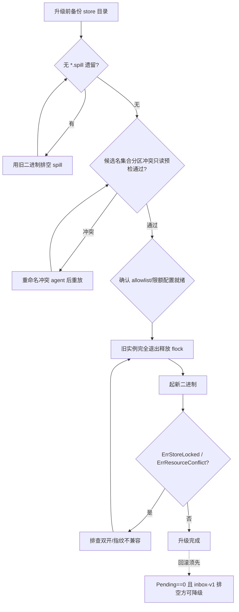

# 升级 / 回滚演练 Runbook (resident-remaining-hardening 4.6 · 8.4)

> 面向运维的耐久输入（inbox-v1）升级/回滚手册。每条给出：运维**可观测到的真实错误串/符号**、
> **只读诊断**动作、**纠正措施**，以及该项由哪个演练/测试佐证。所有代码定位只用「文件 + 符号」
> （不写行号，行号必腐）。

## 0. 演练夹具（本地，默认随 `go test ./...` 跑）

| 项 | 值 |
|----|----|
| 夹具 | `tests/upgrade_rollback_drill_test.go`（package `tagent_test`） |
| 命令 | `go test ./tests/ -run TestDrill_ -race -count=3` |
| 本机结果（2026-09-18, darwin/arm64） | PASS（3 用例，无 sleep、无真实重启） |

链式的三段序列演练（原子门另有归属，见下）：
- `TestDrill_UpgradeDrainsLegacySpillThenAccepts`：旧 spill 拒绝 → 排空 → 接受 → 全 ack；
- `TestDrill_RollbackRefusedWhileOutstandingThenSafeAfterDrain`：崩溃遗留 outstanding → 拒绝降级 → 排空至零 → 放行；
- `TestDrill_PartitionCollisionDiagnosisIsReadOnly`：鸽笼保证可检出（1200 名 / 1024 分区）→ 标记且**只读不改键**。

## 1. 旧 spill 排空（升级前置门）

- **机制**：`reliability.NewInbox` 打开 `inbox-v1/` 前，扫描其父目录是否存在 `*.spill`（`.spillExt`）遗留；**存在即 fail-loud 拒绝启动**。旧格式条目必须由写它的旧版本排空，新版本绝不静默重解释。
- **运维观测**：`reliability: legacy .spill items present; drain them with the previous binary before upgrading to inbox-v1: <文件名>`（`ErrLegacySpillNotDrained`）。
- **纠正**：用**升级前的旧二进制**正常启动一次，让其把 channel/spill 溢出冲刷入库（旧版 `SpillStore` 语义），或确认目录内无 `*.spill` 后再启新二进制。**禁止手工删除**未排空的 `.spill`（即未消费输入）。
- **佐证**：夹具 §0 第 1 段 + `agent/reliability/inbox_test.go:TestInbox_LegacySpillBlocksUpgrade`。

## 2. inbox-v1 回滚条件（降级门）

- **前提**：pre-inbox 二进制**不认识** `inbox-v1/` 目录布局（pending/claimed/receipted 三态信封），降级会静默丢弃其中未消费输入。
- **只读判据（运维可观测）**：`inbox-v1/` 下信封文件数（`ls <dir>/inbox-v1/*.json | wc -l`——`Ack` 成功即删文件）；进程内等价量为 `Inbox.Pending()`（pending+claimed+receipted 未确认计数）。**判据 >0 ⇒ 拒绝降级**。
- **安全降级序列**：用**当前 inbox-aware 二进制**正常启动一次并等其排空——它会消费 pending 信封；启动期 `ReconcileDurableReceipts` 自动经 `ConfirmDurableByRequestID` 把「事实链已回执但 inbox 未 ack」的信封收敛删除（内部机制，无需人工调用）。观察到 `inbox-v1/` 无遗留信封后方可换回旧二进制。
- **崩溃窗口**：claim 与 receipt 之间崩溃 → 重启时 claimed 回 pending、`Attempts++`，仍计入未确认（即「宁可重放，不可丢」，见 `NewInbox` reopen 分支）。
- **佐证**：夹具 §0 第 2 段 + `agent/reliability/inbox_test.go:TestInbox_Reopen_RequeuesClaimed_KeepsReceipted`。

## 3. 目录锁（跨进程单 writer）

- **机制**：`RuntimeResources`（`resources.go`）以 store 目录内 `.tagent-writer.lock` 上的**跨进程 flock**（`acquireDirLock`/`flockExclusive`）强制单写者；**flock 先于 open**（open 会拉起 scanner/compactor 等后台写工作线程，先取锁才封死第二写者窗口）。进程崩溃由 OS 自动释放 flock，无遗留锁永久锁死。
- **运维观测**：`ErrStoreLocked`——`store is locked by another process (single-writer): <path>: ...`。同 store 路径多实例并发启动时第二个失败。
- **边界**：flock 是**本地盘契约**；NFS 上不可靠（advisory）。`RuntimeResources` 假设 store 目录位于本地卷——跨机共享盘部署不满足单写者前提。
- **升级注意**：滚动升级须确保**旧实例已完全退出**（释放 flock）再起新实例，否则新实例 `ErrStoreLocked` 拒起（fail-closed，正确行为）。
- **佐证**：`resources_lock_test.go:TestWriterLock_ExclusiveAcrossHandles`（第二 fd/进程非阻塞抢锁必失败，释放后可重取）。

## 4. 配置冲突（同路径不兼容指纹）

- **机制**：`RuntimeResources.acquire(kind, path, fingerprint, open)` 以「(kind, canonical path)」为键共享 store；命中已存在条目时**比对 fingerprint**——不同即 `ErrResourceConflict`（**绝不 second-writer、绝不 first-config-wins 静默吞并**）。`canonicalize` 解符号链接/绝对化，令同路径不同写法归一。
- **运维观测**：`resource conflict: path already open with an incompatible config: <kind> <path> is open with fingerprint <A>, requested <B>`。
- **纠正**：共享同一 store 目录的多个 agent 必须携带**兼容的 store 级配置**；若确需不同配置，改用**不同 store 路径**。
- **佐证**：`resources_lock_test.go`（同目录不同指纹 → 冲突）。

## 5. 分区冲突只读诊断（升级前预检）

- **背景**：`memory.PartitionIDFromName(name)` 将 agent 名散列到 **10-bit（1024）分区**；同一共享 store 内，**两个不同名散列到同一 pid** 会静默合并命名空间（互写时间线、越权召回）。`registerStoreOwner`（`partition_collision.go`）在**构建期 fail-closed**，报 `partition id collision: agents %q and %q hash to pid %d on the SAME store — rename one agent (never auto-migrate)`。
- **铁律**：**只检测，永不改写 EventKey、永不自动迁移历史**（`runtime-resource-ownership` spec「agent 身份隔离」）。唯一修复是**重命名**冲突 agent 之一并重放。
- **升级前只读预检**（本手册新增，`ov`/CLI 无需实现）：枚举「共用同一 store 的候选 agent 名集合」，按 `PartitionIDFromName` 分组，任一 pid 出现 >1 个不同名即列出，交运维改名。逻辑等价于 `tests/upgrade_rollback_drill_test.go:diagnosePartitionCollisions`（无写、可反复跑、pid 映射不变）。
- **佐证**：夹具 §0 第 3 段 + `partition_collision_test.go:TestPartitionCollision_FailsClosed`（registerStoreOwner 构建期拒冲突；隔离 store 无误报见 `TestPartitionCollision_IsolatedStoresNoFalsePositive`）。

## 6. HTTP 限额与 allowlist（控制面 + LLM 重定向）

- **限额**（`rl/http_api.go:HTTPAPILimits`，默认）：`MaxBodyBytes` 1 MiB、`/task` `MaxMessages` 32、`MaxContentBytes` 256 KiB、`MaxFeedbackQueue` 1024；`SetLimits` 拒负值（"拒绝一切"限额是误配非特性）。构造器 `NewHTTPServer` 显式超时（`ReadHeaderTimeout` 5s / `ReadTimeout` 30s / `WriteTimeout` 60s / `IdleTimeout` 60s），根除零值 `http.Server` 误绑 `:80` 无死线的回归。
- **allowlist 两层**（同语义：精确 host、任意端口）：
  1. **初始 URL**：`HTTPAPI.SetEndpointPolicy(enabled, allowedHosts)` 约束 `/task` 携带的 `llm_base_url` 初跳；
  2. **逐跳 CheckRedirect**：`rl.EndpointRedirectPolicy(allowedHosts)` 装进 LLM client，**30x 每一跳目标 host 必 ∈ allowlist**，越界报 `endpoint redirect policy: hop %d target host %q not in endpoint allowlist (initial URL %q)`。
- **配置面**：`TAGENT_RL_ALLOW_LLM_REDIRECT`（`1` 才允许动态重定向，默认禁用）、`TAGENT_RL_ENDPOINT_ALLOWLIST`（逗号分隔 host）。**未启用重定向时任何 30x 跳转全拒**。
- **升级/回滚注意**：新增逐跳 CheckRedirect 收紧了行为——若既有部署曾依赖「allowlist 端点二次跳转到非 allowlist host」，升级后会被拒（fail-closed，符合 Major 5 消除文档化降级的目标）；回滚则失去逐跳防护，仅初跳受约。allowlist 变更走配置，非数据迁移。
- **佐证**：`rl/endpoint_redirect_test.go`（HopSemantics / EmptyAllowlist / AllowlistedHopChain / HopCap / NormalizeRedirectHost）。

## 7. 一页式升级检查清单

- 回滚方向：先走 §2（排空 inbox-v1 至 `Pending()==0`）再换旧二进制；旧二进制对 `inbox-v1/` 无感，遗留在册信封会被静默丢弃。
