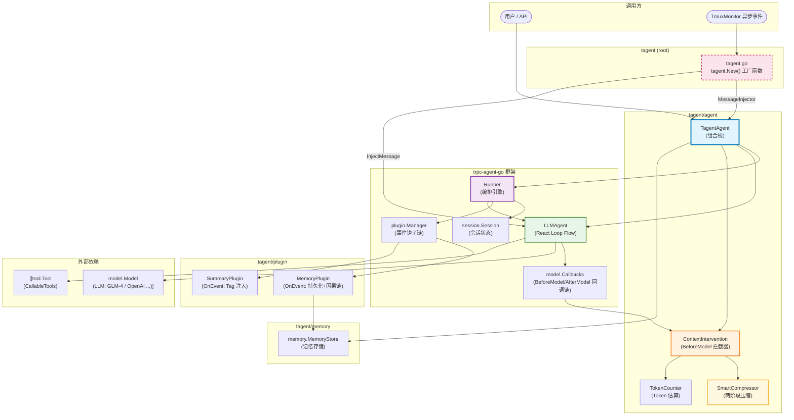
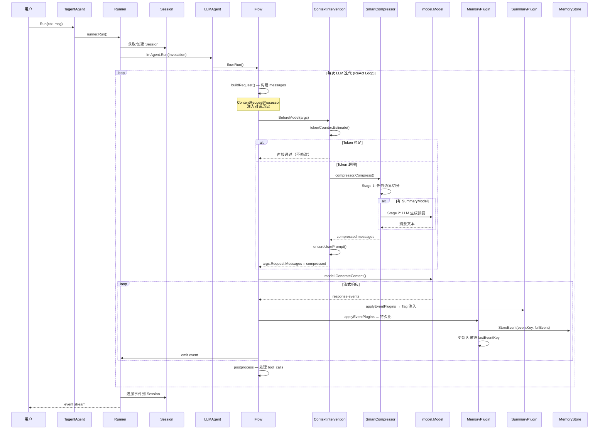
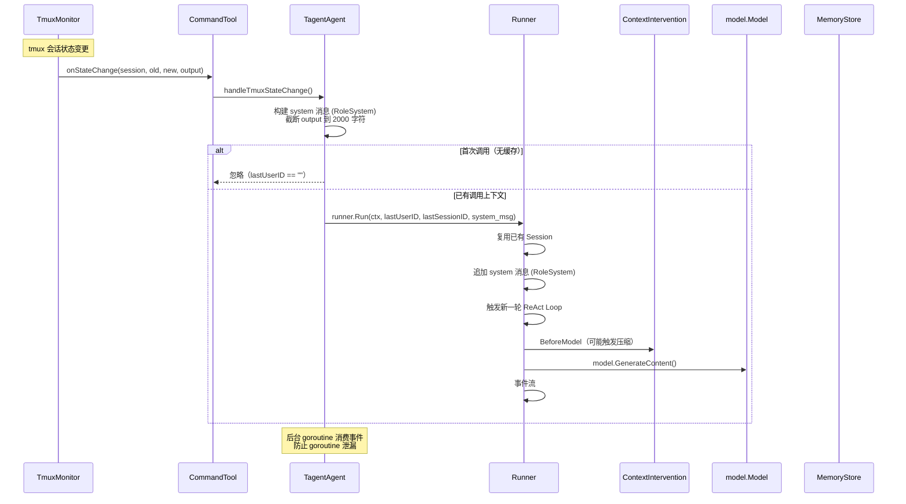

# tagent/agent 模块架构文档

## 一、模块定位

`tagent/agent` 是 tagent 项目的**核心机制协调层**，负责将 trpc-agent-go 的通用能力（LLMAgent / Runner / Plugin）与 tagent 的差异化逻辑（SmartCompress / MemoryPlugin / ContextIntervention）组装为统一入口 `TagentAgent`。

**核心职责**：将 trpc-agent-go 的通用能力（LLMAgent / Runner / Plugin）与 tagent 的差异化逻辑（SmartCompress / MemoryPlugin / TmuxMonitor 事件注入）组装为统一入口 `TagentAgent`。

**设计原则**：
- **复用而非重写**：tagent 不重复实现 React Loop，改用 LLMAgent 作为骨架
- **注入而非继承**：tagent 的能力通过 callback（BeforeModel）和 plugin（OnEvent）注入到框架
- **视图转换原则**：压缩发生在 BeforeModel，仅修改发给 LLM 的 messages 视图，不修改 Session 原始数据
- **职责分离**：应用层组装逻辑（tagent.New() 工厂函数）放在根包 tagent.go，agent 包专注核心机制
- **事件上下文传递**：顶层 agent 送 LLM 的 context 是事件记录流，tool 通过框架注入的 event_key 从 MemStore 获取完整上下文

---

## 二、组件关系总览图



---

## 三、文件清单与职责

| 文件 | 行数 | 职责 |
|------|------|------|
| `tagent_agent.go` | 257 | 组合根：初始化 + 对外 API + InjectMessage |
| `context_intervention.go` | 84 | BeforeModel 拦截器：token 预算检查 + 触发压缩 |
| `smart_compress.go` | 225 | 两阶段压缩引擎：按任务边界切分 + LLM 摘要 |
| `token_counter.go` | 41 | Token 估算器：启发式字符计数 |

> **注意**：`tagent.New()` 工厂函数在根包 `tagent.go`，不在 agent 包中。
> 这是因为这些代码需要同时 import agent 和 tool 包，放在任何子包都会导致循环依赖。

---

## 四、核心数据结构

### 4.1 TagentAgent — 组合根

```go
// tagent_agent.go:41-54
type TagentAgent struct {
    llmAgent   *llmagent.LLMAgent  // 框架 React Loop
    runner     runner.Runner        // 框架编排引擎
    memStore   memory.MemoryStore  // 记忆存储（内存 or 文件）
    config     *TagentConfig

    // Agent identity (for agent.Agent interface)
    name        string
    description string

    // 异步事件注入的会话上下文（首次 Run 时缓存）
    lastUserID    string
    lastSessionID string
}
```

**为什么需要 lastUserID / lastSessionID？**

`InjectMessage` 在后台异步检测 tmux 会话状态变更时，需要注入 `RoleSystem` 消息触发新一轮 Agent 迭代。由于回调没有传入 userID/sessionID 参数，只能依赖缓存的最近一次调用上下文。

**为什么需要 InjectMessage？**

`InjectMessage` 是 `tagent.New()` 工厂函数中 `MessageInjector` 接线的基础设施。当 TmuxMonitor 检测到 tmux session 状态变更时，CommandTool 内部通过 `MessageInjector.InjectMessage()` 注入系统消息，后者使用 `Runner.Run()` 触发新的 Agent 迭代。

### 4.2 TagentConfig — 配置参数

```go
// tagent_agent.go:41-51
type TagentConfig struct {
    Model             model.Model        // ✅ 必填：LLM 模型
    MemoryStore       memory.MemoryStore // 可选：默认 InMemoryStore
    SystemPrompt      string             // 可选：系统提示词
    Tools             []tool.Tool        // 可选：CallableTools
    MaxToolIterations int                // 默认 200
    MaxTokens         int                // Token 预算，默认 8000
    CompressThreshold float64            // 触发压缩阈值，默认 0.8
    SummaryModel      model.Model        // 可选：Stage 2 摘要模型
}
```

### 4.3 ContextIntervention — 调用前拦截器

```go
// context_intervention.go:10-20
type ContextIntervention struct {
    compressor   *SmartCompressor  // 实际执行压缩
    tokenCounter TokenCounter      // Token 估算
    maxTokens    int               // 最大 token 预算
    thresholdPct float64          // 触发压缩阈值比例
}
```

### 4.4 SmartCompressor — 两阶段压缩

```go
// smart_compress.go:19-22
type SmartCompressor struct {
    summaryModel    model.Model // Stage 2 LLM 摘要模型（可选）
    keepRecentTasks int         // 保留最近 N 个完整任务（默认 2）
}

// TaskSegment 是任务边界切分的最小单元
type TaskSegment struct {
    Messages   []model.Message
    IsComplete bool // 是否为完整任务（assistant 无 tool_calls）
}
```

### 4.5 TokenCounter — Token 估算接口

```go
// token_counter.go:8-10
type TokenCounter interface {
    Estimate(messages []model.Message) int
}

// 默认实现：启发式字符计数
type DefaultTokenCounter struct {
    CharsPerToken float64  // 默认 2.0（中英混合）
}
```

---

## 五、初始化流程 — NewTagentAgent

```go
// tagent_agent.go:61-130
func NewTagentAgent(cfg *TagentConfig) (*TagentAgent, error) {
    // Step 1: MemoryStore（外部注入 or 内存默认）
    var memStore memory.MemoryStore
    if cfg.MemoryStore != nil {
        memStore = cfg.MemoryStore
    } else {
        memStore = memory.NewInMemoryStore()
    }

    // Step 2: MemoryPlugin — 注册 OnEvent 钩子（持久化 + 因果链）
    memPlugin := tagentplugin.NewMemoryPlugin(memStore)

    // Step 3: SmartCompressor（带可选 Stage 2 模型）
    compressorOpts := []SmartCompressorOption{}
    if cfg.SummaryModel != nil {
        compressorOpts = append(compressorOpts, WithSummaryModel(cfg.SummaryModel))
    }
    compressor := NewSmartCompressor(compressorOpts...)

    // Step 4: ContextIntervention — 包装为 BeforeModel 回调
    tokenCounter := NewDefaultTokenCounter()
    ci := NewContextIntervention(compressor, tokenCounter, cfg.MaxTokens, cfg.CompressThreshold)

    // Step 5: model.Callbacks — 注册 BeforeModel 链
    modelCB := model.NewCallbacks()
    modelCB.RegisterBeforeModel(ci.BeforeModel)

    // Step 6: LLMAgent — 注入 ModelCallbacks（包含 CI.BeforeModel）
    llmAgentOpts := []llmagent.Option{
        llmagent.WithModel(cfg.Model),
        llmagent.WithInstruction(cfg.SystemPrompt),
        llmagent.WithMaxToolIterations(cfg.MaxToolIterations),
        llmagent.WithModelCallbacks(modelCB),  // 关键：BeforeModel 回调注入点
    }
    if len(cfg.Tools) > 0 {
        llmAgentOpts = append(llmAgentOpts, llmagent.WithTools(cfg.Tools))
    }
    llmAgent := llmagent.New("tagent", llmAgentOpts...)

    // Step 7: Runner — 组装 LLMAgent + Plugins
    r := runner.NewRunner("tagent", llmAgent, runner.WithPlugins(
        tagentplugin.NewSummaryPlugin(),  // 事件 Tag 注入
        memPlugin,                         // 事件持久化
    ))

    return &TagentAgent{...}, nil
}
```

---

## 六、trpc-agent-go 关键集成机制

### 6.1 BeforeModel 回调链

`BeforeModel` 是 **LLM 调用前** 的拦截点，tagent 通过它实现上下文压缩。

**框架调用路径**：

```
Runner.Run()
  → LLMAgent.Run()
    → Flow.Run()
      → runOneStep()
        → buildRequest()
          → runBeforeModelCallbacks()
            → runBeforeModelCallbacksWith(invocation.Plugins.ModelCallbacks())
            → runBeforeModelCallbacksWith(flow.modelCallbacks)
```

源码位置：`trpc-agent-go/internal/flow/llmflow/llmflow.go:873-901`

```go
func (f *Flow) runBeforeModelCallbacks(ctx context.Context, invocation *agent.Invocation, llmRequest *model.Request) (context.Context, *model.Response, error) {
    // 1. 先执行 Plugin 注册的 BeforeModel（通过 invocation.Plugins）
    pluginCallbacks := invocation.Plugins?.ModelCallbacks()
    if pluginCallbacks != nil {
        ctx, resp, err := runBeforeModelCallbacksWith(callbackCtx, invocation, llmRequest, pluginCallbacks)
        if resp != nil { return ctx, resp, nil } // CustomResponse 可短路 LLM 调用
        if err != nil { return ctx, nil, err }
    }
    // 2. 再执行 LLMAgent 注册的 BeforeModel
    newCtx, resp, err := runBeforeModelCallbacksWith(ctx, invocation, llmRequest, f.modelCallbacks)
    return newCtx, resp, err
}
```

**关键特性**：
- **CustomResponse 短路**：如果 BeforeModel 返回了非空 `CustomResponse`，框架跳过 LLM 调用直接返回
- **Context 传递**：每个回调可以返回新的 `context.Context`，后续回调使用新的 context
- **panic 恢复**：`model.Callbacks.runBeforeModelCallback` 中有 `defer recoverModelCallbackPanic`，防止单个回调 panic 破坏整个流程
- **continueOnError / continueOnResponse**：通过 `model.Callbacks` 的选项控制错误和响应的处理策略

**tagent 的注入方式**：

```
NewTagentAgent
  → model.NewCallbacks()
  → modelCB.RegisterBeforeModel(ci.BeforeModel)
  → llmagent.New(..., llmagent.WithModelCallbacks(modelCB))
  → Runner(llmAgent)
```

tagent 将 `ContextIntervention.BeforeModel` 注册到 `model.Callbacks`，通过 `llmagent.WithModelCallbacks` 注入到 LLMAgent，最终在 Flow 层每次 LLM 调用前执行。

### 6.2 Plugin OnEvent 钩子链

`Plugin.OnEvent` 是**每个事件流经 Runner 时**的钩子点，tagent 通过它实现事件持久化和 Tag 注入。

**框架调用路径**：

```
Runner.processSingleAgentEvent()
  → Runner.applyEventPlugins(ctx, invocation, agentEvent)
    → invocation.Plugins.OnEvent(ctx, invocation, e)
      → Manager.OnEvent()
        → 依次执行所有已注册的 EventHook
```

源码位置：`trpc-agent-go/runner/runner.go:807-828`

```go
func (r *runner) applyEventPlugins(ctx context.Context, invocation *agent.Invocation, e *event.Event) *event.Event {
    if invocation == nil || invocation.Plugins == nil {
        return e
    }
    updated, err := invocation.Plugins.OnEvent(ctx, invocation, e)
    if err != nil {
        log.ErrorfContext(ctx, "plugin OnEvent failed: %v", err)
        return e  // 出错时回退原始事件
    }
    if updated == nil {
        return e  // 钩子可选择不修改事件
    }
    copyEventInvocationFields(updated, e)  // 保留原始事件的元数据
    return updated
}
```

**Plugin Manager 的实现**（`trpc-agent-go/plugin/manager.go:275-295`）：

```go
func (m *Manager) OnEvent(ctx context.Context, invocation *agent.Invocation, e *event.Event) (*event.Event, error) {
    curr := e
    for _, h := range m.eventHooks {  // 依次执行每个钩子
        next, err := h.hook(ctx, invocation, curr)
        if err != nil {
            return nil, fmt.Errorf("plugin %q: %w", h.name, err)
        }
        if next != nil {
            curr = next  // 链式传递：上一个钩子的输出是下一个钩子的输入
        }
    }
    return curr, nil
}
```

**tagent 的两个 Plugin**：

| Plugin | 钩子 | 作用 |
|--------|------|------|
| `MemoryPlugin` | `OnEvent` | 推断事件类型、生成 EventKey、构建因果链、持久化到 MemoryStore、写回 StateDelta |
| `SummaryPlugin` | `OnEvent` | 给事件设置 Tag（`agent_output` / `action_command` 等） |

### 6.3 Runner 的编排职责

`Runner` 是 trpc-agent-go 的**编排引擎**，tagent 通过它获得：
- Session 管理（会话创建、消息追加）
- Plugin 管理（OnEvent 钩子注入）
- 请求/响应事件流处理
- 并发运行管理（Cancel / RunStatus）

`Runner.Run()` 的关键步骤（`trpc-agent-go/runner/runner.go:329-495`）：

```
1. 生成 RequestID (uuid)
2. 创建执行上下文（Timeout / DetachedCancel）
3. 获取或创建 Session（userID + sessionID → session.Key）
4. 选择 Agent（注册表 or AgentFactory）
5. 创建 Invocation（封装所有上下文）
6. 注册 RunHandle（用于 Cancel / RunStatus）
7. 追加用户消息到 Session
8. 调用 Agent.RunWithPlugins() 触发 Flow
9. 启动 processAgentEvents goroutine 消费事件流
   → 对每个事件 applyEventPlugins()
   → 持久化到 Session
   → 发送到输出 channel
```

### 6.4 LLMAgent 的 Flow 机制

`LLMAgent` 的核心是一个由**请求处理器链**和**响应处理器链**组成的 Flow。

**请求处理器链**（`trpc-agent-go/agent/llmagent/llm_agent.go:191-331`）：

```
buildRequestProcessorsWithAgent()
  1. BasicRequestProcessor        — 生成配置
  2. PlanningRequestProcessor    — 规划指令
  3. InstructionRequestProcessor — 系统提示词 / 指令
  4. IdentityRequestProcessor    — Agent 身份
  5. SkillsRequestProcessor      — Skill 内容注入
  6. ContentRequestProcessor     — 对话历史注入 ← BeforeModel 拦截点
  7. PostToolRequestProcessor    — Tool 后提示词
  8. SkillsToolResultProcessor   — Skill 结果处理
  9. TimeRequestProcessor        — 时间信息
```

**ContentRequestProcessor** 构建最终发给 LLM 的 `Request.Messages`。tagent 的 `BeforeModel` 在这个 Processor 执行后**修改** messages，实现压缩而不破坏 Session 原始数据。

**Flow.Run 的执行循环**（`trpc-agent-go/internal/flow/llmflow/llmflow.go:88-181`）：

```go
func (f *Flow) Run(ctx context.Context, invocation *agent.Invocation) (<-chan *event.Event, error) {
    eventChan := make(chan *event.Event, ...)
    go func(ctx context.Context) {
        for {
            f.emitStartEventAndWait(ctx, invocation, eventChan)   // 等待 barrier
            f.maybeSyncSummaryIntraRun(ctx, invocation)           // 迭代间摘要
            lastEvent, err := f.runOneStep(ctx, invocation, eventChan)  // 一次 LLM 迭代
            if lastEvent == nil || invocation.EndInvocation || lastEvent.IsFinalResponse() {
                break  // 结束条件
            }
        }
    }(runCtx)
    return eventChan, nil
}
```

---

## 七、请求处理流程

### 7.1 标准同步请求（用户输入）



### 7.2 TmuxMonitor 异步事件注入



---

## 八、ContextIntervention.BeforeModel — 详解

**源码位置**：`context_intervention.go:37-64`

```go
func (ci *ContextIntervention) BeforeModel(
    ctx context.Context,
    args *model.BeforeModelArgs,
) (*model.BeforeModelResult, error) {
    if args == nil || args.Request == nil || len(args.Request.Messages) == 0 {
        return nil, nil
    }

    // Step 1: 估算当前 messages 的 token 数
    usedTokens := ci.tokenCounter.Estimate(args.Request.Messages)

    // Step 2: 计算触发阈值
    threshold := int(float64(ci.maxTokens) * ci.thresholdPct)

    // Step 3: 超过阈值则压缩
    if usedTokens > threshold {
        log.Infof("ContextIntervention: token %d > threshold %d, compressing", usedTokens, threshold)

        // Stage 1 + 可选 Stage 2
        compressed := ci.compressor.Compress(ctx, args.Request.Messages)
        // 确保有 user prompt（防止 LLM 只看到 agent_output）
        compressed = ensureUserPrompt(compressed)
        // 替换发送给 LLM 的 messages（不修改 Session！）
        args.Request.Messages = compressed

        newTokens := ci.tokenCounter.Estimate(args.Request.Messages)
        log.Infof("compressed from %d to %d tokens", usedTokens, newTokens)
    }

    // Step 4: 返回 nil 表示不短路流程，LLM 正常调用
    return nil, nil
}
```

**返回值语义**：
- `return nil, nil` — 不短路，继续正常 LLM 调用
- `return &BeforeModelResult{CustomResponse: resp}, nil` — 短路，跳过 LLM 调用
- `return nil, err` — 中断，返回错误

---

## 九、SmartCompressor — 两阶段压缩详解

### 9.1 Stage 1：按任务边界切分

**源码位置**：`smart_compress.go:114-145`

**任务边界定义**：`IsComplete = msg.Role == assistant && len(msg.ToolCalls) == 0`

```
messages[0]: user "task 1"
messages[1]: assistant "result 1"
           ↑ 任务边界（完整任务 → IsComplete=true）

messages[2]: user "task 2"
messages[3]: assistant [tool_calls]
           ↑ 非边界（tool_call 周期内）
messages[4]: tool "result"
messages[5]: assistant "done"
           ↑ 任务边界（完整任务 → IsComplete=true）
```

**切分逻辑**：
- 从头开始遍历消息
- 遇到 `IsComplete=true` 的 assistant 消息 → 切分段
- 未完成的任务段（当前在进行的 tool_call 周期）不切分，保留在最后

### 9.2 Stage 2：LLM 生成摘要

**源码位置**：`smart_compress.go:147-220`

**触发条件**：`summaryModel != nil` 且有被丢弃的旧片段

**摘要提示词**：
```
你是一个对话摘要助手。请为历史对话生成简洁但完整的摘要。

--- 片段 1 ---
user: ...
assistant: ...
[tool_calls: func1(...), func2(...)]

--- 片段 2 ---
...

--- 摘要 ---
```

**调用方式**：直接调用 `summaryModel.GenerateContent()`，消费流式响应，返回纯文本。

**失败回退**：如果 LLM 调用失败或返回空，返回 `compressNotice(n)` — 简单提示「N 个任务片段已省略」。

### 9.3 压缩输出结构

```
输入: [system] + [task1全部] + [task2全部] + [task3全部] + [task4全部] + [task5全部]
      假设 keepRecentTasks=2，丢弃 task1-task3，保留 task4-task5

Stage 1 输出: system + [task1-task3通知] + [task4全部] + [task5全部]
Stage 2 输出: system + [LLM摘要] + [task4全部] + [task5全部]
```

---

## 十、TokenCounter — 估算公式

**源码位置**：`token_counter.go:26-41`

```go
func (c *DefaultTokenCounter) Estimate(messages []model.Message) int {
    total := 0
    for _, msg := range messages {
        total += len([]rune(msg.Content)) / int(c.CharsPerToken)
        total += 10                                    // 每条消息 overhead
        total += 20 * len(msg.ToolCalls)               // tool_calls overhead
    }
    if total < 1 {
        total = 1
    }
    return total
}
```

**估算公式**：

```
estimatedTokens = Σ( Content长度 / CharsPerToken + 10 + 20×ToolCalls数 )
```

中英混合场景：`CharsPerToken = 2.0`（2 中文字符 ≈ 1 token；4 英文字符 ≈ 1 token）

---

## 十一、MemoryPlugin — OnEvent 钩子详解

**源码位置**：`tagent/plugin/memory_plugin.go:50-113`

```go
func (p *MemoryPlugin) onEvent(ctx context.Context, inv *agent.Invocation, evt *event.Event) (*event.Event, error) {
    // 1. 从框架 AgentName 派生 PartitionID（存储概念）
    agentName := p.extractAgentName(inv)  // inv.AgentName
    partitionID := memory.PartitionIDFromName(agentName)  // FNV-1a hash

    // 2. 生成 Snowflake EventKey（int64，编码 PartitionID）
    eventKey := memory.NewSnowflakeEventKey(partitionID, 0)

    // 3. 推断事件类型
    eventType := inferEventType(evt)

    // 4. 提取摘要
    eventSummary := extractSummary(evt)

    // 5. 获取前驱事件 Key（按 PartitionID 独立因果链）
    parentKey := p.lastEventKeys[partitionID]

    // 6. 构建 FullEvent
    fullEvent := memory.FullEvent{
        EventKey:     eventKey,
        PartitionID:  partitionID,
        ParentKey:    parentKey,
        EventType:    eventType,
        EventSummary: eventSummary,
        Timestamp:    timestamp,
        Content:      ...,
        ToolCalls:    ...,
        Response:     ...,
    }

    // 7. 持久化到 MemoryStore
    p.memStore.StoreEvent(eventKey, fullEvent)

    // 8. 写回 EventKey/PartitionID/EventType 到 StateDelta
    evt.StateDelta["event_key"] = []byte(int64ToString(eventKey))
    evt.StateDelta["partition_id"] = []byte(intToString(partitionID))
    evt.StateDelta["event_type"] = []byte(eventType)

    // 9. 更新独立因果链（按 PartitionID 隔离）
    p.lastEventKeys[partitionID] = eventKey

    return evt, nil
}
```

**事件类型推断规则**：

| Message.Role | EventType | 说明 |
|-------------|-----------|------|
| `RoleUser` | `external_input` | 用户输入 |
| `RoleSystem` | — | 不参与事件流（初始化时注入 system prompt） |
| `RoleAssistant + ToolCalls` | `thinking_plan` | Agent 思考/计划 |
| `RoleAssistant` | `agent_output` | Agent 输出 |
| `RoleTool` | `action_command` | Tool 调用结果 |

---

## 十二、关键设计决策

### 12.1 BeforeModel vs AfterModel

| 对比项 | BeforeModel（tagent 选型） | AfterModel |
|--------|--------------------------|-----------|
| **修改对象** | `Request.Messages` | `Response.Choices` |
| **修改位置** | LLM 调用前 | LLM 调用后 |
| **信息损失** | 低（可选 LLM 摘要） | 高（直接截断） |
| **LLM 感知** | 可能看到摘要 | 不知道被截断 |
| **实现复杂度** | 中等（两阶段） | 低（直接切） |

**选 BeforeModel 的原因**：
- Session 中仍保存完整历史，可供 RecallTool 全文搜索
- 压缩后 LLM 仍能通过摘要理解历史
- 不破坏 Session 完整性，支持多 Agent 共享

### 12.2 "视图转换"原则

`ContextIntervention` 和 `SmartCompressor` **仅修改 `args.Request.Messages`**（发给 LLM 的视图），**不修改 Session 原始数据**。

好处：
1. **记忆完整**：MemoryStore 中保存所有事件的原始内容
2. **检索无损**：RecallTool 可以对完整历史做语义搜索
3. **多 Agent 隔离**：多个 Agent 共享同一 Session 时，各自可独立决定压缩策略，互不干扰

### 12.3 TmuxMonitor 事件注入的幂等性

`handleTmuxStateChange` 在以下情况**忽略**事件注入：
- 首次调用前（`lastUserID == ""`）
- Session 已被关闭

注入的 system 消息使用 `RoleSystem`，分类为 `external_input`。LLM 将其视为系统级提示，tagent 将其与其他外部输入统一处理。

**严格拒绝非设计折损**：截断（truncation）在 `event/types.go` 中已完全移除。超过上下文限制的内容通过多次 SmartCompress 循环处理，而非在摘要阶段截断。

### 12.4 Plugin 钩子的链式传递

当多个 Plugin 注册 OnEvent 钩子时，**链式传递**：每个钩子的输出事件作为下一个钩子的输入。

```go
curr := e
for _, h := range m.eventHooks {
    next, err := h.hook(ctx, invocation, curr)
    if next != nil {
        curr = next  // 链式传递
    }
}
return curr
```

这意味着 `MemoryPlugin` 持久化的事件可以进一步被其他 Plugin 修改。

### 12.5 Memory 数据隔离与 EventKey Snowflake 设计

#### 12.5.1 设计原则

**Memory 不感知 agent，但从存储角度实现数据隔离。**

核心思想：
- FilterKey 是 trpc-agent-go 框架的概念，属于 LLM context 层面的隔离
- Memory 从**存储分区**角度思考隔离，使用 **PartitionID** 作为分区键（纯整数，纯存储概念）
- 框架已有的 **AgentName**（`agent.Info().Name`）是稳定的 agent 身份标识
- **PartitionID = FNV-1a(AgentName) & 0x7FF**，由 MemoryPlugin 在 tagent 层计算，Memory 层完全不知道 AgentName 的存在
- 三层分离：框架概念（AgentName/FilterKey）→ tagent 层映射 → 存储概念（PartitionID）

```
框架层 (AgentName/FilterKey)     tagent 层 (MemoryPlugin)          Memory 层 (PartitionID)
┌──────────────────────┐      ┌───────────────────────┐      ┌─────────────────┐
│ AgentName = "tagent" │──────→│ FNV-1a("tagent")=42  │──────→│ partition=42    │
│ FilterKey = "tagent" │      │ FNV-1a("knowledge")=85│──────→│ partition=85    │
├──────────────────────┤      │ FNV-1a("recall")=123 │──────→│ partition=123   │
│ AgentName = "know"   │──────→│                       │      │                 │
│ FilterKey = "tagent/ │      │ AgentName → PartitionID│      │ 纯整数分区键    │
│              know-xx"│      │ Memory 不感知 agent   │      │ 无 agent 语义   │
└──────────────────────┘      └───────────────────────┘      └─────────────────┘
  框架身份 + LLM 隔离           身份 → 存储的桥梁             物理存储隔离
```

**关键统一**：不引入独立的 AgentID 概念。AgentName（框架已有）→ PartitionID（存储），
语义一致，零映射表成本。FNV-1a hash 是确定性的，同名字永远映射到同分区。

#### 12.5.2 FilterKey vs AgentName vs PartitionID

| 维度 | FilterKey (框架) | AgentName (框架) | PartitionID (Memory) |
|------|-----------------|------------------|---------------------|
| **用途** | LLM context 过滤 | Agent 身份标识 | 存储分区键 |
| **值域** | 层级字符串 | 字符串 | 整数 (0-2047) |
| **示例** | "tagent/knowledge-uuid" | "knowledge" | 85 |
| **唯一性** | 含 UUID，每次运行不同 | agent 类型级别，稳定 | 由 AgentName 派生，稳定 |
| **管理方** | 框架 (agenttool) | 框架 (agent.Info().Name) | MemoryPlugin (FNV-1a) |
| **Memory 可见** | 不可见 | 不可见 | 直接使用 |
| **关系** | 含 AgentName + UUID | → hash → PartitionID | 纯存储概念 |

**为什么 PartitionID 而非 AgentName 直接做分区键**：
- int 比字符串更适合做 map key 和目录名，性能更好
- Snowflake EventKey 需要将分区信息编码进 64-bit 整数，int 天然适配
- Memory 完全不持有 agent 语义字符串，保持概念纯净

#### 12.5.3 顶层 Agent 未设置名称时的默认生成

框架中 `llmagent.New(name)` 的 name 参数如果为空，tagent 会使用 `DefaultAgentName = "tagent"`。

在云原生场景下，如果需要全局唯一性（多实例部署），tagent 使用 `memory.NewPartitionID()` 
通过原子计数器生成唯一 PartitionID，确保进程级唯一。

```go
// MemoryPlugin.extractAgentName 的回退逻辑
func (p *MemoryPlugin) extractAgentName(inv *agent.Invocation) string {
    if inv == nil {
        return "unknown"  // → FNV-1a("unknown") = 稳定默认分区
    }
    if inv.AgentName != "" {
        return inv.AgentName  // 框架已有，复用
    }
    return "unknown"
}
```

#### 12.5.4 EventKey Snowflake 设计

当前 `NewEventKey` 使用 `evt_{timestamp}_{sequence}` 格式，不含分区信息，无法支持按分区查询和云原生场景。

参考 Snowflake 算法，设计 64-bit 整数 EventKey：

```
┌──────────────────────────────────────────────────────────────────┐
│ 63       53 │ 52            22 │ 21       12 │ 11             0 │
│  PartitionID│   Timestamp      │  Sequence   │   Reserved     │
│  (11 bits)  │   (31 bits)      │  (10 bits)  │   (12 bits)    │
└──────────────────────────────────────────────────────────────────┘
```

核心优势：
- **Key 内含 PartitionID** → 从 EventKey 可直接反推数据归属，无需额外索引
- **全局唯一** → PartitionID + Timestamp + Sequence 组合保证，分布式友好
- **可排序** → int64 天然支持按时间排序
- **存储高效** → 8 字节整数 vs 24+ 字符串
- **云原生** → Reserved 位可扩展为 worker ID，支持多实例部署

工具函数：
- `NewSnowflakeEventKey(partitionID, nowMs)` — 生成 EventKey
- `PartitionIDFromEventKey(key)` — 从 EventKey 提取 PartitionID
- `TimestampFromEventKey(key)` — 从 EventKey 提取时间戳
- `PartitionIDFromName(name)` — AgentName → PartitionID (FNV-1a)

#### 12.5.5 MemoryPlugin 按 PartitionID 维护独立因果链

**当前问题**：`lastEventKey` 全局单例，子 agent 事件打断顶层因果链。

**改进**：按 PartitionID 维护因果链：

```go
type MemoryPlugin struct {
    memStore      memory.MemoryStore
    mu            sync.Mutex
    lastEventKeys map[int]int64  // PartitionID → lastEventKey (独立因果链)
}
```

**因果链隔离效果**：

```
PartitionID=42 (tagent):     E0 → E1 → E2 ──────────────────→ E5
                                                 ↑ 因果链跨越子 agent
PartitionID=85 (knowledge):                     E3 → E4
                                                 ↑ 独立因果链
```

- 顶层 agent 的因果链只包含自身事件（E0→E1→E2→E5），不被子 agent 事件打断
- 子 agent 有独立因果链（E3→E4）
- tool agent 通过 `event_key` 获取触发事件 E2，通过 E2.ParentKey 追溯顶层因果链

#### 12.5.6 MemoryStore 按分区隔离存储

**InMemoryStore**：`map[int]map[int64]FullEvent`（PartitionID → EventKey → FullEvent）

**FileBackend** 目录结构：
```
data/
├── 42/              ← PartitionID=42 (tagent)
│   ├── 9223372036854775807.json
│   └── 9223372036854775808.json
├── 85/              ← PartitionID=85 (knowledge)
│   └── ...
└── 123/             ← PartitionID=123 (recall)
    └── ...
```

#### 12.5.7 EventKey 运行时注入 — Tool 上下文获取机制

**设计问题**：顶层 agent 直接送 LLM 的 context 是一条**事件组成的记录流**（由 MemoryPlugin 追踪）。当 LLM 发起 tool_call 时，tool agent 需要知道触发该调用的 `event_key`，才能从 MemStore 获取完整事件上下文。

**设计决策**：

1. **Tool Declaration 必须声明 `event_key` 参数**（optional）— 所有 tool agent 的 InputSchema 中声明，描述为 `[auto-injected]`
2. **框架在 tool_call 执行前自动注入** — Flow 层从当前事件 `StateDelta` 提取 `event_key`，合并到 tool 的 JSON 参数中
3. **Tool agent 通过 `event_key` 获取上下文** — `GetEvent(eventKey)` 获取触发事件详情，`PartitionIDFromEventKey(eventKey)` 提取分区键，`QueryEvents({PartitionID: id})` 查询同分区事件流

**注入时序**：

```
LLM 生成 tool_call
  → assistant message 成为事件
  → MemoryPlugin.OnEvent 生成 Snowflake EventKey → StateDelta["event_key"]
  → Flow 执行 tool_call
    → 从 StateDelta 提取 event_key
    → 合并到 tool 的 jsonArgs
    → tool.Call(ctx, {"request": "...", "event_key": 9223372036854775807})
```

**与现有机制的关系**：
- `MemStore` 在 `ToolAgentFactoryConfig` 创建时注入（不变）
- `event_key` 在每次 tool 调用时由框架注入（新增）
- `PartitionID` 作为存储分区键，由 MemoryPlugin 在 OnEvent 时从 AgentName 派生（新增）
- 三者配合：`MemStore` 提供访问能力，`event_key` 提供访问入口，`PartitionID` 提供存储隔离

---

## 十三、TagentAgent API 参考

### 13.1 创建

```go
agent, err := tagentagent.NewTagentAgent(&tagentagent.TagentConfig{
    Model:             myModel,
    MemoryStore:       memory.NewFileBackend("/path/to/events"),
    SystemPrompt:      systemPrompt,
    Tools:             []tool.Tool{echoTool, commandTool},
    MaxToolIterations: 200,
    MaxTokens:         8000,
    CompressThreshold: 0.8,
    SummaryModel:      myModel, // Stage 2 使用相同模型
})
defer agent.Close()
```

### 13.2 运行

```go
eventCh, err := agent.Run(ctx, "user-1", "session-1", userMessage)
for evt := range eventCh {
    // 处理事件
}
```

### 13.3 TmuxMonitor 集成

TmuxMonitor 集成通过 `tagent.New()` 工厂函数自动完成：

```go
// tagent.go — tagent.New() 内部
// CommandTool 通过 MessageInjector 接口闭环处理 tmux 状态变更
// TagentAgent 天然实现 MessageInjector 接口
cmdTool.SetMessageInjector(ta)
```

> **注意**：tmux 状态变更通知已闭环在 `tool/command` 包内，
> 通过 `MessageInjector` 接口解耦，不暴露给外部。

### 13.4 直接访问 MemoryStore

```go
store := agent.MemStore()
events, _ := store.RecallEvent("user-1", "session-1", query, 10)
```

### 13.5 InjectMessage — 注入系统消息

`InjectMessage` 用于在当前 session 中注入一个系统消息，触发新的 Agent 迭代：

```go
// 源码位置：tagent_agent.go:241-257
func (ta *TagentAgent) InjectMessage(msg model.Message) {
    if ta.lastUserID == "" || ta.lastSessionID == "" {
        return  // 忽略（首次调用前）
    }

    ctx := context.Background()
    eventCh, err := ta.runner.Run(ctx, ta.lastUserID, ta.lastSessionID, msg)
    if err != nil {
        return
    }

    // Drain events to prevent goroutine leak
    go func() {
        for range eventCh {
        }
    }()
}
```

**使用场景**：TmuxMonitor 检测到后台命令完成后，通过此方法通知 Agent 读取输出并继续执行。
