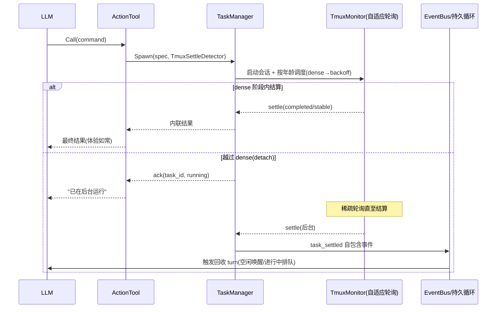
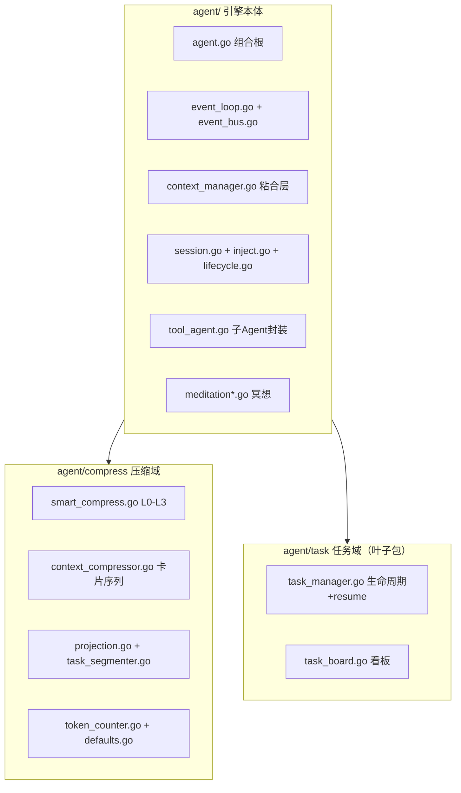

# tagent/agent 模块架构文档

## 一、模块定位

`tagent/agent` 是 tagent 项目的**事件驱动执行引擎**。核心设计思想源于 [prototype/agent.go](../../../prototype/agent.go)（126 行抽象实现），原型用可替换的函数字段定义了一个可扩展的框架骨架。

### 原型到生产的映射

| 原型 | 生产 | 说明 |
|------|------|------|
| `eventBus chan Event` | `EventBus` | 事件流，Publish/Pull 后丢弃 |
| `inputs []string` | `SessionProjection (EventReference[])` | 有界投影，onEvent 追加、ContextManager 读取、Compactor 清理 |
| `model *Model` | 框架 `model.Model` (通过 LLMAgent) | 框架处理 ReAct 循环 |
| `tools map[string]func` | `AgentToolWrapper` 实现 `CallableTool` | 子 agent 作为工具 |
| `Run func()` | `TagentAgent.runEventLoop(ctx, bus, cm)` | Pull → BuildInvocation → RunFlow |
| `OnEvents func([]Event) Event` | `ContextManager.BuildInvocation` + `RunFlow` | 合并消息 + 执行 Flow |
| `Compact func()` | `Compactor.Compact` (BeforeModel 回调) | 投影有界化 |

### 四个不变量

- **不变量 1**：inputs 是投影（有界，LLM 输入的唯一装配源）→ SessionProjection = EventReference[]（现居 `agent/compress` 包），`assembleRequest = [system] + render(投影)`，永不读回框架消息尾部
- **不变量 2**：写入统一——事件被存储 ⇔ 被投影，恰好一次，同点原子（MemoryPlugin.OnEvent 存储后经 ProjectionSink 同点追加）
- **不变量 3**：时序是构造保证——BeforeModel 时投影必完整，非时序碰巧
- **不变量 4**：Compact 只修改投影，不修改事件流也不修改永久存储

### 框架 Runner 内部行为

trpc-agent-go 的 Runner 在 `runner.Run` 内部完成：

1. 创建/获取 session
2. 追加用户消息到 session（`sessionService.AppendEvent`）
3. 触发 Plugin.OnEvent（SummaryPlugin 先注入 Tag 与 `event_summary` 元数据——**非内容总结，原文视图**，内容级总结收归压缩固化时刻；MemoryPlugin 后写 MemoryStore + StateDelta）
4. 构建 messages（ContentRequestProcessor 从 session.Events 提取，session limit=2）
5. **BeforeModel 统一回调**（Projection-first 设计）：
   - Step 1: **TryPull + 即时持久化** — 从 EventBus 非阻塞拉取新事件，立即 StoreEvent + Projection.Append
   - Step 2: **ContextCompressor** — 从 Projection 解析全部 refs 为带 `[evt_KEY|type]` 前缀的消息，超预算时触发 SmartCompressor
   - Step 3: **提取当前轮次** — 从 args.Request.Messages 中提取无前缀的 assistant/tool 消息（当前 ReAct 迭代产物）
   - Step 4: **消息重建** — `[system] + 历史(from Projection) + 当前轮次`
6. 调用 model.GenerateContent
7. 工具执行（FunctionCallResponseProcessor）
8. 追加 response event 到 session（appender → `sessionService.AppendEvent`）
9. Emit event 到 channel

**关键结论**：
- 框架 Runner 完成 `sessionService.AppendEvent` 和 `MemoryPlugin.OnEvent`
- tagent 的 `makeOnEventCallback` 仅做 `projection.Append`（从 StateDelta 构建 EventReference，含 MemoryPlugin 生成的 `event_summary`）
- LLM 在每次调用时都看到带 `[evt_KEY|type]` 前缀的 messages（由 Callback 0 统一注入）

## 二、核心组件

### 2.1 TagentAgent（组合根）

**文件**：`agent.go`
**原型对应**：`BaseTAgent.New()` + `Run`

`TagentAgent` 是 tagent 的顶层装配点。它创建 EventBus、ContextManager、SessionProjection，并提供对外 API：

- `NewTagentAgent(cfg)` — 构造，创建 ContextManager（含统一 Runner）
- `StartLoop(userID, sessionID)` — 启动持久事件循环，返回 outputCh
- `Run(ctx, inv)` — 子 agent 单轮调用，创建临时 ContextManager + 临时 EventBus，直调一次 `RunFlow`
- `InjectMessage(msg)` — 向 activeBus 发布 external_input
- `StopLoop()` — 停止持久循环
- `Close()` — 关闭 ContextManager（释放 Runner）

### 2.2 runEventLoop（事件循环）

**原型对应**：`DefaultRun`

```go
func (ta *TagentAgent) runEventLoop(ctx context.Context, bus *EventBus, cm *ContextManager) {
    const maxRetries = 3
    retryDelays := []time.Duration{100ms, 200ms, 400ms}

    for {
        events, err := bus.Pull(ctx)          // ① 拉取事件（批量）
        msg := cm.BuildInvocation(events)     // ② 合并为一条 user message
        if msg.Content == "" { continue }

        // ③ RunFlow with exponential backoff retry
        for attempt := 0; attempt <= maxRetries; attempt++ {
            if err := cm.RunFlow(ctx, msg); err != nil {
                if attempt < maxRetries {
                    time.Sleep(retryDelays[attempt])  // 退避等待
                    continue
                }
                ta.publishErrorEvent(bus, err)  // 重试耗尽→发布错误事件
            }
            break
        }
    }
}
```

**错误处理**：RunFlow 失败后指数退避重试（100ms → 200ms → 400ms，最多 3 次）。重试耗尽后发布 `AgentEvent{Type: "external_input", Source: "error"}` 到 EventBus。`BuildInvocation` 跳过 `Source="error"` 事件，不触发模型调用，但外部监听器可感知。

`StartLoop` 在 goroutine 中调用 `runEventLoop`（使用 persistentBus + ContextManager），持续 `for { Pull; RunFlow }` 直到 `StopLoop`。

`Run()`（子 Agent 调用路径）**不使用 `runEventLoop`**：它创建临时 EventBus + ContextManager 后，先将驱动请求 `persistBusEvent` 写入临时 `SessionProjection`（保证请求位于时间线首条），再在 goroutine 中**直接调用一次 `RunFlow`**。Turn 边界即 `RunFlow` 的自然返回——`RunFlow` 内部由框架跑完完整 ReAct 工具循环（多轮）直到最终 assistant 响应才返回，随后 `close(invOutputCh)` 通知调用方结束。子 Agent 与持久循环**共享同一个 turn 原语 `RunFlow`**，区别仅在于是否包裹 `for { Pull }` 守护循环；不再依赖「事件流探测 + drain 定时器 + 强制 cancel」判断 turn 结束。

### 2.3 ContextManager（粘合层：消息构建 + Flow 执行）

**文件**：`context_manager.go`（引擎侧唯一与压缩域双向衔接的文件）
**原型对应**：`OnEvents` + `ModelCompletion`

`ContextManager` 创建唯一的 Runner（LLMAgent + MemoryPlugin + SummaryPlugin + SessionService），注册 BeforeModel 回调（SmartCompressor + Compactor），并提供：

- `BuildMessages(refs)` — 从 EventReference 构建 messages（按需从 MemoryStore 拉取完整 Content）
- `InjectEventKeys(messages, refs)` — 注入 `[evt_KEY|type]` 前缀
- `BuildInvocation(events)` — 合并 bus 事件为一条消息
- `RunFlow(ctx, msg)` — 调用 `runner.Run`，转发事件到 outputCh + bus，onEvent 做 projection.Append
- `SetUserIDSessionID(userID, sessionID)` — 设置 runner.Run 的 session 上下文

### 2.4 makeOnEventCallback

仅做 `projection.Append`（从 event.StateDelta 构建 EventReference）。框架 Runner 已完成 `sessionService.AppendEvent` 和 `MemoryPlugin.OnEvent`。

### 2.5 SmartCompressor

**文件**：`compress/smart_compress.go`（agent/compress 子包）

骨架模型确定性压缩（task-skeleton-compression，唯一压缩管线；定级/丢弃纯工程，L3 折叠为双层结构）：

| 级别 | 触发（age = 段在新→旧序列中的位置，指数边界） | 段内保留 |
|------|------|---------|
| L0 | 进行中段 或 `age < keepRecent` | 全部消息 |
| L1 | `age < keepRecent*2` | 骨架 + `thinking_plan`（丢 `action_command`） |
| L2 | `age < keepRecent*4` | 仅骨架（`external_input` + `agent_output`） |
| L3 | 更老 或 预算仍不足 | 整段移出时间线 → 滚动 summary 归档 |

- 段 = 以 `agent_output` 为界的完整任务回合；定级为段龄纯函数（`deterministicLevel`，零 LLM）
- 预算升级 O(n)：预计算每段四级成本后 O(1) 增量升档
- 使用注入的 `TokenCounter`，不自行创建
- L3 折叠双层：工程票据层（卡片行 + `[evt_key]` 召回票据）恒在；`summary_model` 配置时叠加 LLM 滚动综述 `synthesizeRollingNarrative`（旧综述 + 新折叠段骨架**原文**增量合成为单行 `〔历史综述〕`，编译期常量限长，失败/无模型降级纯工程，纯携带轮零调用）
- 卡片浓缩（`condenseCardLines`）：卡片超 `card_max_chars` 时浓缩较旧一半，保留 `[evt_key]` 票据

### 2.6 Compactor（滚动卡片序列）

**文件**：`compress/context_compressor.go` + `compress/task_segmenter.go`

投影有界化：旧引用替换为**滚动** summary reference（携带卡片序列，跨轮吸收——计数累计/卡片继承/时间下界继承）。详见 [memory 架构文档「记忆策展」章](../memory/memory-architecture.md)。

### 2.7 SessionProjection + ProjectionSink

**文件**：`compress/projection.go`（随压缩域——"Compact 只修改投影"，投影即压缩域对象）+ `projection_sink.go`（plugin 包）
**原型对应**：`inputs []string`

`SessionProjection` 是有界的 `EventReference[]`，线程安全、EventKey 幂等去重。写入统一在事件插件管线：RunFlow 用 `plugin.WithProjectionSink` 把当前 invocation 的投影绑到 ctx，MemoryPlugin 在 store 成功后同点 `Append`（unified-event-projection D1）。

### 2.8 EventBus

**文件**：`event_bus.go`（154 行）
**原型对应**：`eventBus chan Event`

per-agent 有序事件队列。Publish 非阻塞，Pull 阻塞直到有事件。

### 2.9 AgentToolWrapper

**文件**：`tool_agent.go`
**原型对应**：`tools map` + `RegisterTool`

将子 agent 包装为 `CallableTool`，处理 event_key 参数解析和外部上下文注入。子 agent 调用**默认异步**：经上下文注入的 `TaskSpawner` 纳入任务层执行，dense 阶段内返回则内联、越窗则 ack（`asyncDisabled` 可回退为同步）。每次子 agent Task 仍持有独立 EventBus / SessionProjection / ContextManager 的并发隔离契约。

### 2.10 TaskManager（异步任务层）

**文件**：`task/task_manager.go`、`task/task_board.go`（agent/task 子包，零引擎依赖的叶子包）、`event_bus.go`；探测器 `tool/action/settle.go`、`poll_schedule.go`；任务工具 `tool/task/`

确定性（非 LLM）的任务注册表 + 调度器，让 `action`（tmux）等长耗时工具与子 agent 不阻塞事件循环：

- **spawn + settle-or-detach**：`Spawn` 在 `select{settle, detach}` 上等待——探测器在自适应轮询的 **dense→sparse 边界**发出 `Detached()`，即"同步→异步"的 ack 点（已退役独立 `sync_wait` 旋钮）。dense 内 settle → 内联；detach 先到 → ack + 后台跟踪；越界后到的 settle 走 `OnSettle`（不丢失）。
- **自适应轮询**：`TmuxMonitor` 按任务年龄逐会话调度——dense 密集探测、几何退避至 `max_interval`；`stable` 服务型任务钉在最稀档（alive-detached）。参数经 `MonitorConfig` 配置。
- **settle 三档**：`completed` / `stable` / `suspect`，探测器只做确定性分类，语义判断交给 LLM。
- **task_settled 回收 turn**：后台任务结算发一条自包含事件到 EventBus；持久循环空闲则唤醒、进行中则排队。
- **看板 + 工具**：`BeforeModel` 每 turn 从 registry 重渲染 live 看板（不参与压缩，置于 recency 锚点）；`list_tasks` / `cancel` / `relaunch` / `resume_task` 为即时同步工具（结果消费不走专用工具：小结果随 settle 通知内联，大结果转储文件经 read_file 分页）。
- **resume_task 重入**：合法源状态 {alive-detached, stable, completed, failed}；tmux 经 detector `Rearm`（绑会话非轮次，零换绑），subagent 经新 Run + 任务链还原器。详见 [tool 架构文档「任务重入」章](../tool/tool-architecture.md)。
- **会话回收闭环**：运行时 completed/error 即回收；优雅退出 `Close()` 收编存活会话；启动时按前缀清扫孤儿会话（防 pty 泄漏累积）。

**一个 tmux 命令的一生**（把上面的零件串成一条线）：



对应能力规格：`async-task-execution`、`task-registry-and-board`、`adaptive-poll-scheduling`。

## 三、包与文件结构（分包后）



| 包/文件 | 职责 | 原型对应 |
|------|------|---------|
| `agent.go` | 顶层装配 + TagentConfig | `BaseTAgent.New()` |
| `event_loop.go` / `event_bus.go` | 持久循环 + 事件队列 | `DefaultRun` / `eventBus chan` |
| `context_manager.go` | 粘合层：消息构建 + 压缩编排 + Flow 执行 + 统一 Runner | `OnEvents` + `ModelCompletion` |
| `tool_agent.go` | AgentToolWrapper + 任务链还原器 + 工具注册接口 | `tools map` + `RegisterTool` |
| `meditation.go` / `meditation_digest.go` | 冥想心跳 + 自我状态 digest | 无（生产扩展） |
| `compress/` | SmartCompressor、卡片序列 Compactor、SessionProjection、TokenCounter、压缩默认常量单源 | `Compact` + `inputs` |
| `task/` | TaskManager、settle 探测契约、看板、resume、跨包测试基建（fixture.go） | 无（生产扩展） |
| `rl/`（独立顶级包） | TrajectoryRecorder + HTTPAPI + SwappableModel | 无（生产扩展） |

依赖方向由编译器执法：`agent → compress`、`agent → task`，子包零反向依赖，新代码直接 import 子包。

## 四、数据流

```
用户调用 InjectMessage / 外部事件到达
    │
    ▼
EventBus.Publish(AgentEvent{external_input})
    │
    ▼
TagentAgent.runEventLoop:
  ① bus.Pull(ctx) → 批量取出事件
  ② cm.BuildInvocation(events) → 合并为一条 model.Message
  ③ cm.RunFlow(ctx, msg)
       │
       ├─ runner.Run(ctx, userID, sessionID, msg)
       │    ├─ 创建/获取 session
       │    ├─ 追加用户消息到 session (sessionService.AppendEvent)
       │    ├─ Plugin.OnEvent (SummaryPlugin 先注入 Tag，MemoryPlugin 后持久化 + StateDelta + event_summary)
       │    ├─ ContentRequestProcessor 从 session.Events 构建 messages (session limit=2)
       │    ├─ BeforeModel 统一回调 (Projection-first):
       │    │    ├─ TryPull + persistBusEvent（新事件即时入 Projection）
       │    │    ├─ ContextCompressor.Compress(refs)（原生时间线渲染 + 压缩）
       │    │    └─ 消息重建: [system] + render(投影)（单行化，永不读回框架消息尾部）
       │    ├─ model.GenerateContent
       │    ├─ FunctionCallResponseProcessor (工具执行 + 迭代控制)
       │    ├─ handleEventPersistence (sessionService.AppendEvent)
       │    └─ EmitEvent → event channel
       │
       └─ for fwEvt := range eventCh:
            ├─ onEvent(fwEvt) → projection.Append (仅此一项)
            ├─ outputCh <- fwEvt
            └─ if final: bus.Publish(agent_output echo)
                │
                ▼
  ④ 回到 bus.Pull — 下一轮事件
```

## 五、tagent 与 trpc-agent-go 的边界

**tagent 独有**：
- `EventBus` + `runEventLoop`：持久事件循环 + 异步事件注入
- `SessionProjection` + `Compactor`：有界投影 + 投影清理
- `SmartCompressor`：两阶段上下文压缩
- `MemoryStore` + `MemoryPlugin`：结构化事件存储 + 因果链
- `MeditationManager`：冥想心跳（双闸门触发：血统无关的空闲闸门 `lastTurnEnd` + 输入侧锚定的新颖性闸门 `lastUserInput`）
- `TrajectoryRecorder`：LLM 调用轨迹记录

**框架已有（tagent 复用）**：
- `runner.Run` (Flow.Run)：ReAct 循环、工具执行、迭代控制
- `ContentRequestProcessor`：从 session 构建 messages
- `FunctionCallResponseProcessor`：工具执行
- `BeforeModel` / `AfterModel` 回调
- `session.Service`：session 管理 + AppendEvent
- `model.Model`：LLM 调用
- `event.Event`：事件结构
- `tool.Tool` / `CallableTool`：工具接口

## 六、上下文管理

### 6.1 压缩（SmartCompressor）

SmartCompressor 由 ContextCompressor 在 BeforeModel 装配回调中调用，在投影解析为消息后、调用 model 前执行（骨架模型，见 §2.5 定级表与 [event-flow.md §六](event-flow.md)）：
- 以 `agent_output` 为界切分完整任务回合（`SegmentMessages`），段龄纯函数定级，按 `tool > assistant` 序丢弃中间事件，零 LLM 不失败不降级
- L1 丢弃 `action_command` 结果时同步剥离对应 tool_calls（单轮产物自洽合法）
- L3 整段不进入产物，由 `buildRetainedRefs` 收编进滚动 summary（`external_input`/`agent_output` 成卡片行，recall 可溯源）
- 保留消息原样携带 `[evt_KEY|type]` 前缀，衔接存活 ref 判定
- **仅修改发给 LLM 的消息视图，不修改 SessionProjection 或 MemoryStore**（纯视图变换，遵守不变量 2；投影替换由 ContextCompressor 的 RetainedRefs 返回值驱动）

压缩参数通过 YAML `compress` 段配置（`summary_model`/`card_max_chars`/`compact_keys_listed`/`recent_full_count`/`summary_max_tokens`）。旧 user 切段 legacy 管线与逐段 LLM 摘要/归档缓存已移除（context-efficiency-and-trajectory）：骨架管线为唯一压缩路径，其中 LLM 文摘恰有两处低频叠加层——L3 滚动综述 `synthesizeRollingNarrative` 与卡片浓缩 `condenseCardLines`，均无模型时降级为纯工程形态。

### 6.1.1 时间线渲染红线（外部分析常见误判点）

压缩产物**永远不进 system**。渲染规则的三条铁律：

| 铁律 | 含义 |
|------|------|
| system 恒单条恒首位 | 只装指令（system prompt）；任何机制产物不得追加进 system |
| 压缩摘要 = user 级〔历史归档〕注记 | `context_compress` 渲染为带"非用户发言勿模仿"标注的 user 消息——观察类信息归 user |
| assistant 恒等于 LLM 真实产出 | 系统永不代 assistant 说话，也永不在 assistant 历史中生成文本化调用语法（防模仿伪调用） |

> 之所以单列：曾有外部分析（基于可见 API 契约的合理外推）误判为"摘要 system 内联"——这是常见框架做法，但 tagent 恰恰以不这样做为设计红线。凡对模型可感知的渲染行为，本文档显式声明，不留猜测空间。

### 6.2 Compact（Compactor）

Compactor 作为第二个 BeforeModel 回调，当 SmartCompressor 不足以压缩时触发：
- 从 SessionProjection 读取所有 EventReference
- 按任务分段，保留最近 N 个任务，旧任务折叠为 summary reference
- `projection.Replace(compacted)` + 从 compacted projection 重建 messages
- **修改 SessionProjection（投影），不修改 MemoryStore**

### 6.3 MaxToolIterations

- 主 agent：`DefaultMaxToolIterations = 50`
- 子 agent：`DefaultSubAgentMaxToolIterations = 10`（如父配置更低则取父配置）

通过 `llmagent.WithMaxToolIterations` 注册到框架 LLMAgent。

### 6.4 配置化

压缩参数通过 YAML `compress` 段配置：
```yaml
agents:
  tagent:
    compress:
      summary_model: deepseek-v4-flash    # 压缩专用模型(可用廉价模型)
      card_max_chars: 6000                # 卡片序列上限
      compact_keys_listed: 32             # 滚动摘要 recent keys 上限
```

TmuxMonitor 参数通过 ActionProperties `monitor` 段配置：
```yaml
tools:
  - kind: tool
    id: exec
    properties:
      monitor:
        dense_interval: 1s      # dense 阶段探测间隔
        dense_duration: 10s     # dense 阶段时长(=同步→异步 ack 点)
        backoff_factor: 2       # 几何退避因子
        max_interval: 60s       # 稀疏轮询上限
```

## 七、子 Agent 调用

`TagentAgent.Run(ctx, inv)` 是子 agent 单轮调用路径（与 2.2 节一致：**不使用 runEventLoop**）：
1. 从 `inv.RunOptions.RuntimeState["external_context"]` 读取父 Agent 传入的上下文（A2A 兼容路径；resume 时由任务链还原器自动注入本任务前序轮次）
2. 创建临时 EventBus + SessionProjection + ContextManager（含临时 Runner）——并发隔离契约
3. 将驱动请求 `persistBusEvent` 写入临时投影（保证请求位于时间线首条）
4. goroutine 中直调一次 `RunFlow`，turn 边界即其自然返回
5. 消费 outputCh 直到 final response，`close(invOutputCh)` 通知结束

子 agent 的 MaxToolIterations 取 `min(父配置, 10)`，默认不超过 10；运行参数只在其自身 `agents.<name>` 定义处配置（ToolRef 只声明引用关系）。


---

## 已知缺口与演进方向

> 本章主动声明当前设计尚未闭合的环——供使用者评估适用边界，也供外部分析引用（缺口以工程事实陈述，含现有防线与候选方向）。

| 缺口 | 现状与防线 | 候选方向 |
|------|-----------|---------|
| **子 Agent handoff 无结构化 schema** | 跨 Agent 传递依赖 `request` 自然语言 + `event_keys` 票据（票据本身是结构化 hex 契约，有真实 LLM 契约测试守护）；但"意图/约束/权限/未决决策"没有结构化载体 | 定义 handoff envelope（intent/constraints/grants 字段）随 external_context 传递 |
| **迭代上限无收尾轮** | 撞 `max_tool_iterations` 时进行中的工具调用直接丢弃（实机：plan 子 Agent 3m52s 的文档工作被掐断，靠模型自恢复换路完成） | 预算剩 1 轮时注入收尾提示，让模型保存半成品再终止 |
| **runEventLoop 单 session** | 一个 TagentAgent 实例绑定一个 (user, session) 循环；多会话需多实例 | 会话路由层（多循环共享引擎与存储） |
| **冥想无内容价值判据** | 双闸门（meditation-idle-gating）已解决自触发永动机：触发需 `now - lastTurnEnd ≥ MinGap`（任意 turn 结束算忙）**且** `lastUserInput > lastMeditation`（上次冥想后有新用户输入）。但新颖性仅看“有无新用户输入”，不看内容价值——用户发一句无关闲聊也会解锁下一轮冥想 | 未消化事件量/★ 卡片密度作为内容价值第三判据 |
