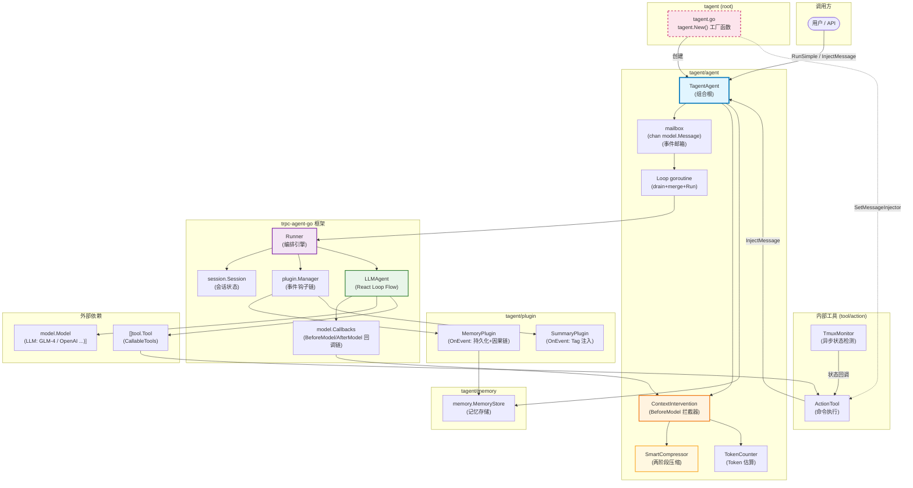
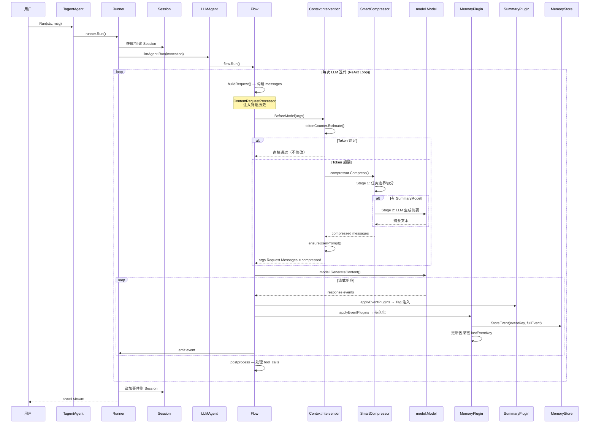
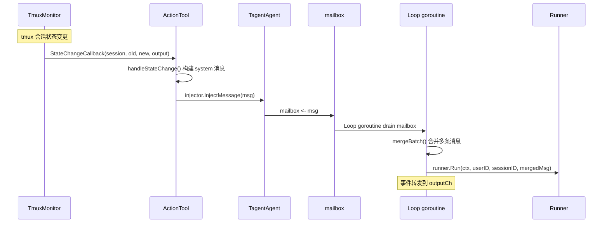
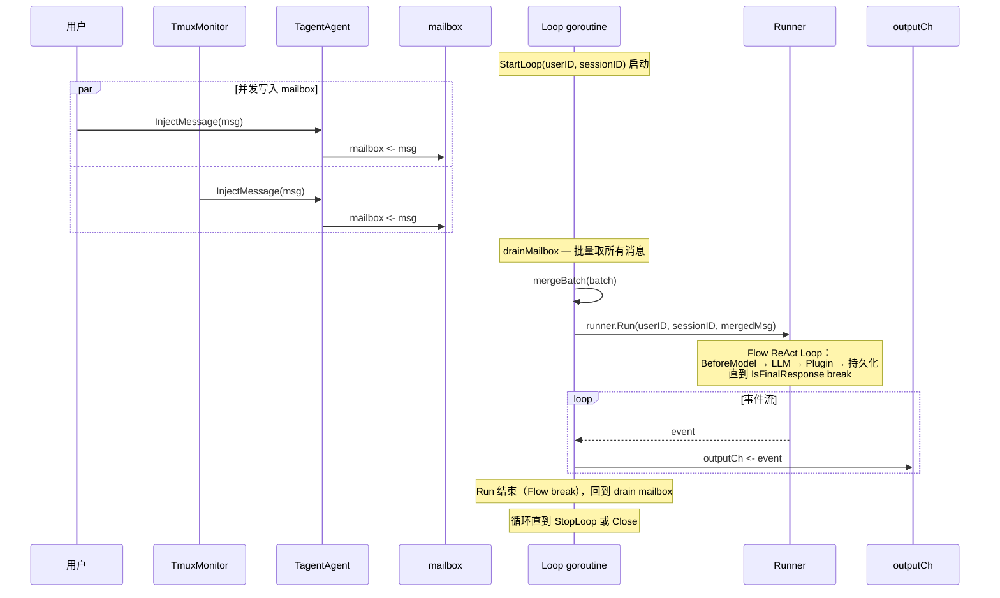
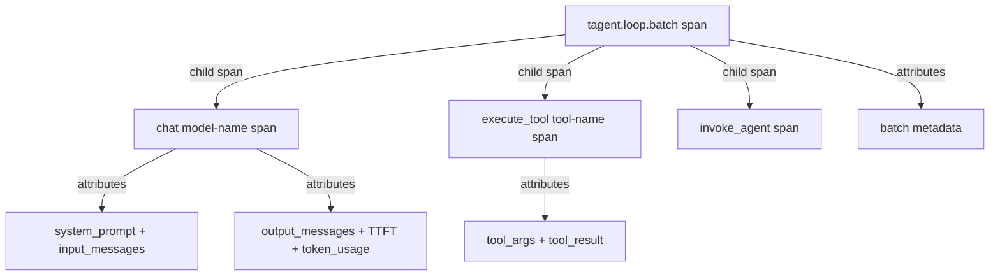
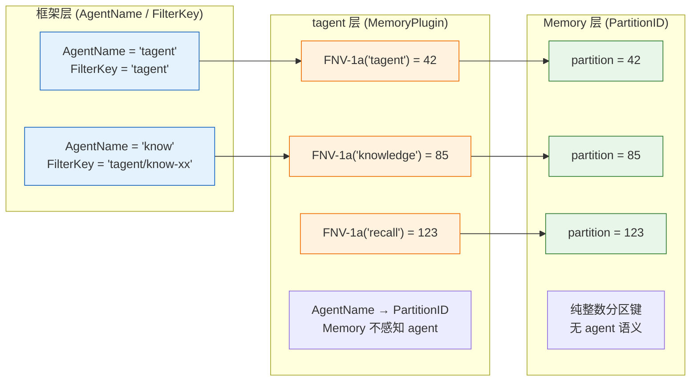
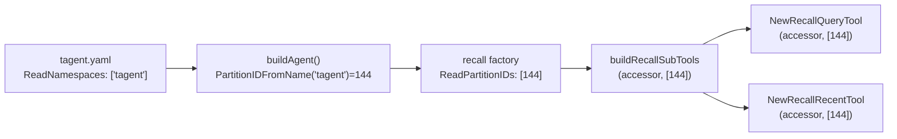

# tagent/agent 模块架构文档

## 一、模块定位

`tagent/agent` 是 tagent 项目的**核心机制协调层**，负责将 trpc-agent-go 的通用能力（LLMAgent / Runner / Plugin）与 tagent 的差异化逻辑（SmartCompress / MemoryPlugin / ContextIntervention）组装为统一入口 `TagentAgent`。

**核心职责**：将 trpc-agent-go 的通用能力（LLMAgent / Runner / Plugin）与 tagent 的差异化逻辑（SmartCompress / MemoryPlugin / TmuxMonitor 事件注入）组装为统一入口 `TagentAgent`。

**设计原则**：
- **复用而非重写**：tagent 不重复实现 React Loop，改用 LLMAgent 作为骨架
- **注入而非继承**：tagent 的能力通过 callback（BeforeModel）和 plugin（OnEvent）注入到框架
- **视图转换原则**：压缩发生在 BeforeModel，仅修改发给 LLM 的 messages 视图，不修改 Session 原始数据
- **职责分离**：应用层组装逻辑（tagent.New() 工厂函数）放在根包 tagent.go，agent 包专注核心机制
- **事件上下文传递**：顶层 agent 送 LLM 的 context 是事件记录流，tool 通过 LLM 选择的 event_key 从 MemStore 获取完整上下文

---

## 二、组件关系总览图



---

## 三、文件清单与职责

| 文件 | 行数 | 职责 |
|------|------|------|
| `tagent_agent.go` | 433 | 组合根：初始化 + 对外 API + IngestExternalEvents + InjectMessage + Closer 资源管理 |
| `context_intervention.go` | 215 | BeforeModel 拦截器：event_key 前缀注入 + token 预算检查 + 多轮压缩 |
| `smart_compress.go` | 445 | 两阶段压缩引擎：Stage 1 任务边界切分 + Stage 2 LLM 摘要 + 批量分批 |
| `token_counter.go` | 41 | Token 估算器：启发式字符计数 |

> **注意**：`tagent.New()` 工厂函数在根包 `tagent.go`，不在 agent 包中。
> 这是因为这些代码需要同时 import agent 和 tool 包，放在任何子包都会导致循环依赖。

---

## 四、核心数据结构

### 4.1 TagentAgent — 组合根

```go
// tagent_agent.go:53-80
type TagentAgent struct {
    llmAgent   *llmagent.LLMAgent  // 框架 React Loop
    runner     runner.Runner        // 框架编排引擎
    memStore   memory.MemoryStore  // 记忆存储（内存 or 文件）
    config     *TagentConfig

    // Agent identity (for agent.Agent interface)
    name        string
    description string

    // Session context for event injection (set on first Run)
    sessionMu     sync.Mutex        // 保护 lastUserID/lastSessionID 并发安全
    lastUserID    string
    lastSessionID string

    // External events pending ingestion (set before Run)
    pendingExternalEvents []memory.FullEvent

    // Persistent Event Loop — 持久事件循环（StartLoop 模式）
    mailbox    chan model.Message      // 事件邮箱（并发写入，单 goroutine 消费）
    outputCh   chan *event.Event       // 持久输出 channel（Loop 模式下不关闭）
    loopCtx    context.Context         // Loop context（StopLoop 取消）
    loopCancel context.CancelFunc      // Loop cancel
    loopActive atomic.Bool             // Loop 是否运行中

    // Resource closers — components like ActionTool that need cleanup.
    // Closed in Close() before the runner is stopped.
    closers []Closer
}

// Closer is implemented by components that hold resources requiring cleanup
// on agent shutdown (e.g., ActionTool stops its TmuxMonitor).
type Closer interface {
    Close() error
}
```

**Persistent Event Loop 字段说明：**

- `mailbox`：`chan model.Message`（cap=256），Loop 模式下所有事件（用户输入、Tmux 通知）写入此 channel
- `outputCh`：`chan *event.Event`（cap=100），Loop 转发 Runner 事件到此 channel，调用方通过 `IsFinalResponse()` 判断单次响应完成
- `loopCtx`/`loopCancel`：Loop 的 context，StopLoop 取消
- `loopActive`：原子标志，InjectMessage 据此判断走 mailbox 还是走旧路径

**外部上下文传递（两条路径）：**

TagentAgent.Run 支持两条外部上下文注入路径，统一通过 `pendingExternalEvents` + `injectExternalContext` 消费：

1. **RuntimeState 路径（远程/wrapper）**：`inv.RunOptions.RuntimeState["external_context"]` 包含序列化的 `ExternalContextEntry` JSON。Run 方法从中反序列化并调用 `IngestExternalEvents`。这是 A2A 兼容路径——A2AAgent 通过 `WithTransferStateKey` 自动将 RuntimeState 复制到 A2A metadata，A2A Server 自动将 metadata 映射回 RuntimeState，远程调用透明工作。
2. **struct 字段路径（直接 API）**：通过 `IngestExternalEvents(events)` 直接设置 `pendingExternalEvents`。用于直接调用者（测试、嵌入式使用）。

两条路径最终都通过 `injectExternalContext` 将事件摘要拼接到 user message 前面。

**为什么需要 lastUserID / lastSessionID？**

`InjectMessage` 在 TmuxMonitor 后台检测到 tmux 会话状态变更时，需要注入消息触发新一轮 Agent 迭代。由于回调签名没有 userID/sessionID 参数，只能缓存最近一次 `RunSimple` 调用传入的上下文。

**InjectMessage 和正常消息走同一条路径吗？**

是的。`InjectMessage` 和正常消息（`RunSimple`）调用的是**同一个** `ta.runner.Run()`，因此事件流经过完全相同的处理管道：

```
RunSimple → ta.runner.Run(ctx, userID, sessionID, msg)
InjectMessage → ta.runner.Run(ctx, lastUserID, lastSessionID, msg)
                              │
                              ▼
              LLMAgent → Event → MemoryPlugin → Session
              → ContextIntervention → SmartCompress → ...
```

两者的唯一区别是**触发来源**：正常消息由外部用户调用触发，`InjectMessage` 由后台 TmuxMonitor 异步回调触发。
`InjectMessage` 复用 `lastUserID`/`lastSessionID` 只是为了补全回调缺失的会话参数，消息本身不做任何特殊处理。

`InjectMessage` 是 `tagent.New()` 工厂函数中 `MessageInjector` 接线的基础设施。当 TmuxMonitor 检测到 tmux session 状态变更时，ActionTool 内部通过 `MessageInjector.InjectMessage()` 注入系统消息。

### 4.2 TagentConfig — 配置参数

```go
// tagent_agent.go:63-77
type TagentConfig struct {
    Model             model.Model        // ✅ 必填：LLM 模型
    MemoryStore       memory.MemoryStore // 可选：默认 InMemoryStore
    SystemPrompt      string             // 可选：系统提示词
    Tools             []tool.Tool        // 可选：CallableTools
    MaxToolIterations int                // 默认 200
    MaxTokens         int                // Token 预算，默认 8000
    CompressThreshold float64            // 触发压缩阈值，默认 0.8
    SummaryModel      model.Model        // 可选：Stage 2 摘要模型
    Temperature       float64            // 可选：LLM 温度，默认 0.7
    Name              string             // Agent 名称，默认 "tagent"
    Description       string             // Agent 描述
}
```

### 4.3 ContextIntervention — 调用前拦截器

```go
// context_intervention.go:10-20
type ContextIntervention struct {
    compressor   *SmartCompressor  // 实际执行压缩
    tokenCounter TokenCounter      // Token 估算
    maxTokens    int               // 最大 token 预算
    thresholdPct float64          // 触发压缩阈值比例
}
```

### 4.4 SmartCompressor — 两阶段压缩

```go
// smart_compress.go:21-25
type SmartCompressor struct {
    summaryModel    model.Model // Stage 2 LLM 摘要模型（可选）
    KeepRecentTasks int         // 保留最近 N 个完整任务（默认 2）
    maxTokens       int         // Token 预算，用于批量摘要分批大小计算（默认 DefaultMaxTokens）
}

// SmartCompressorOption 选项：
// - WithSummaryModel(m)    : 设置 Stage 2 LLM 摘要模型
// - WithKeepRecentTasks(n) : 保留最近 N 个完整任务（默认 2）
// - WithMaxTokens(n)       : Token 预算，用于批量摘要分批大小计算

// TaskSegment 是任务边界切分的最小单元
type TaskSegment struct {
    Messages   []model.Message
    IsComplete bool // 是否为完整任务（assistant 无 tool_calls）
}
```

### 4.5 TokenCounter — Token 估算接口

```go
// token_counter.go:8-10
type TokenCounter interface {
    Estimate(messages []model.Message) int
}

// 默认实现：启发式字符计数
type DefaultTokenCounter struct {
    CharsPerToken float64  // 默认 2.0（中英混合）
}
```

---

## 五、初始化流程 — NewTagentAgent

```go
// tagent_agent.go:61-130
func NewTagentAgent(cfg *TagentConfig) (*TagentAgent, error) {
    // Step 1: MemoryStore（外部注入 or 内存默认）
    var memStore memory.MemoryStore
    if cfg.MemoryStore != nil {
        memStore = cfg.MemoryStore
    } else {
        memStore = memory.NewInMemoryStore()
    }

    // Step 2: MemoryPlugin — 注册 OnEvent 钩子（持久化 + 因果链）
    memPlugin := tagentplugin.NewMemoryPlugin(memStore)

    // Step 3: SmartCompressor（带可选 Stage 2 模型）
    compressorOpts := []SmartCompressorOption{}
    if cfg.SummaryModel != nil {
        compressorOpts = append(compressorOpts, WithSummaryModel(cfg.SummaryModel))
    }
    compressor := NewSmartCompressor(compressorOpts...)

    // Step 4: ContextIntervention — 包装为 BeforeModel 回调
    tokenCounter := NewDefaultTokenCounter()
    ci := NewContextIntervention(compressor, tokenCounter, cfg.MaxTokens, cfg.CompressThreshold)

    // Step 5: model.Callbacks — 注册 BeforeModel 链
    modelCB := model.NewCallbacks()
    modelCB.RegisterBeforeModel(ci.BeforeModel)

    // Step 6: LLMAgent — 注入 ModelCallbacks（包含 CI.BeforeModel）
    llmAgentOpts := []llmagent.Option{
        llmagent.WithModel(cfg.Model),
        llmagent.WithInstruction(cfg.SystemPrompt),
        llmagent.WithMaxToolIterations(cfg.MaxToolIterations),
        llmagent.WithModelCallbacks(modelCB),  // 关键：BeforeModel 回调注入点
    }
    if len(cfg.Tools) > 0 {
        llmAgentOpts = append(llmAgentOpts, llmagent.WithTools(cfg.Tools))
    }
    llmAgent := llmagent.New("tagent", llmAgentOpts...)

    // Step 7: SessionService with AppendEventHook — 解决数据竞争
    // 没有此 hook，session 事件和 channel 事件共享同一个 *model.Response 指针。
    // 框架的 ContentRequestProcessor 可能修改 session 事件的 Response.Choices，
    // 与 AgentToolWrapper.Call() 并发读取同一 Response 产生数据竞争。
    // Hook 给 session 存储自己的 clone，框架修改不影响 channel 事件。
    sessionSvc := sessioninmemory.NewSessionService(
        sessioninmemory.WithAppendEventHook(func(ctx *session.AppendEventContext, next func() error) error {
            original := ctx.Event
            if original.Response != nil {
                evtCopy := *original
                evtCopy.Response = original.Response.Clone()
                ctx.Event = &evtCopy
            }
            err := next()
            ctx.Event = original
            return err
        }),
    )

    // Step 8: Runner — 组装 LLMAgent + Plugins + SessionService
    r := runner.NewRunner(name, llmAgent, runner.WithPlugins(
        tagentplugin.NewSummaryPlugin(),  // 事件 Tag 注入
        memPlugin,                         // 事件持久化
    ), runner.WithSessionService(sessionSvc))

    return &TagentAgent{
        llmAgent:    llmAgent,
        runner:      r,
        memStore:    memStore,
        config:      cfg,
        name:        name,
        description: description,
        closers:     []Closer{sessionSvc},
    }, nil
}
```

---

## 六、trpc-agent-go 关键集成机制

### 6.1 BeforeModel 回调链

`BeforeModel` 是 **LLM 调用前** 的拦截点，tagent 通过它实现上下文压缩。

**框架调用路径**：

```
Runner.Run()
  → LLMAgent.Run()
    → Flow.Run()
      → runOneStep()
        → buildRequest()
          → runBeforeModelCallbacks()
            → runBeforeModelCallbacksWith(invocation.Plugins.ModelCallbacks())
            → runBeforeModelCallbacksWith(flow.modelCallbacks)
```

源码位置：`trpc-agent-go/internal/flow/llmflow/llmflow.go:873-901`

```go
func (f *Flow) runBeforeModelCallbacks(ctx context.Context, invocation *agent.Invocation, llmRequest *model.Request) (context.Context, *model.Response, error) {
    // 1. 先执行 Plugin 注册的 BeforeModel（通过 invocation.Plugins）
    pluginCallbacks := invocation.Plugins?.ModelCallbacks()
    if pluginCallbacks != nil {
        ctx, resp, err := runBeforeModelCallbacksWith(callbackCtx, invocation, llmRequest, pluginCallbacks)
        if resp != nil { return ctx, resp, nil } // CustomResponse 可短路 LLM 调用
        if err != nil { return ctx, nil, err }
    }
    // 2. 再执行 LLMAgent 注册的 BeforeModel
    newCtx, resp, err := runBeforeModelCallbacksWith(ctx, invocation, llmRequest, f.modelCallbacks)
    return newCtx, resp, err
}
```

**关键特性**：
- **CustomResponse 短路**：如果 BeforeModel 返回了非空 `CustomResponse`，框架跳过 LLM 调用直接返回
- **Context 传递**：每个回调可以返回新的 `context.Context`，后续回调使用新的 context
- **panic 恢复**：`model.Callbacks.runBeforeModelCallback` 中有 `defer recoverModelCallbackPanic`，防止单个回调 panic 破坏整个流程
- **continueOnError / continueOnResponse**：通过 `model.Callbacks` 的选项控制错误和响应的处理策略

**tagent 的注入方式**：

```
NewTagentAgent
  → model.NewCallbacks()
  → modelCB.RegisterBeforeModel(ci.BeforeModel)
  → llmagent.New(..., llmagent.WithModelCallbacks(modelCB))
  → Runner(llmAgent)
```

tagent 将 `ContextIntervention.BeforeModel` 注册到 `model.Callbacks`，通过 `llmagent.WithModelCallbacks` 注入到 LLMAgent，最终在 Flow 层每次 LLM 调用前执行。

### 6.2 Plugin OnEvent 钩子链

`Plugin.OnEvent` 是**每个事件流经 Runner 时**的钩子点，tagent 通过它实现事件持久化和 Tag 注入。

**框架调用路径**：

```
Runner.processSingleAgentEvent()
  → Runner.applyEventPlugins(ctx, invocation, agentEvent)
    → invocation.Plugins.OnEvent(ctx, invocation, e)
      → Manager.OnEvent()
        → 依次执行所有已注册的 EventHook
```

源码位置：`trpc-agent-go/runner/runner.go:807-828`

```go
func (r *runner) applyEventPlugins(ctx context.Context, invocation *agent.Invocation, e *event.Event) *event.Event {
    if invocation == nil || invocation.Plugins == nil {
        return e
    }
    updated, err := invocation.Plugins.OnEvent(ctx, invocation, e)
    if err != nil {
        log.ErrorfContext(ctx, "plugin OnEvent failed: %v", err)
        return e  // 出错时回退原始事件
    }
    if updated == nil {
        return e  // 钩子可选择不修改事件
    }
    copyEventInvocationFields(updated, e)  // 保留原始事件的元数据
    return updated
}
```

**Plugin Manager 的实现**（`trpc-agent-go/plugin/manager.go:275-295`）：

```go
func (m *Manager) OnEvent(ctx context.Context, invocation *agent.Invocation, e *event.Event) (*event.Event, error) {
    curr := e
    for _, h := range m.eventHooks {  // 依次执行每个钩子
        next, err := h.hook(ctx, invocation, curr)
        if err != nil {
            return nil, fmt.Errorf("plugin %q: %w", h.name, err)
        }
        if next != nil {
            curr = next  // 链式传递：上一个钩子的输出是下一个钩子的输入
        }
    }
    return curr, nil
}
```

**tagent 的两个 Plugin**：

| Plugin | 钩子 | 作用 |
|--------|------|------|
| `MemoryPlugin` | `OnEvent` | 推断事件类型、生成 EventKey、构建因果链、持久化到 MemoryStore、写回 StateDelta |
| `SummaryPlugin` | `OnEvent` | 给事件设置 Tag（`thinking_plan` / `agent_output` / `action_command` 等） |

### 6.3 Runner 的编排职责

`Runner` 是 trpc-agent-go 的**编排引擎**，tagent 通过它获得：
- Session 管理（会话创建、消息追加）
- Plugin 管理（OnEvent 钩子注入）
- 请求/响应事件流处理
- 并发运行管理（Cancel / RunStatus）

`Runner.Run()` 的关键步骤（`trpc-agent-go/runner/runner.go:329-495`）：

```
1. 生成 RequestID (uuid)
2. 创建执行上下文（Timeout / DetachedCancel）
3. 获取或创建 Session（userID + sessionID → session.Key）
4. 选择 Agent（注册表 or AgentFactory）
5. 创建 Invocation（封装所有上下文）
6. 注册 RunHandle（用于 Cancel / RunStatus）
7. 追加用户消息到 Session
8. 调用 Agent.RunWithPlugins() 触发 Flow
9. 启动 processAgentEvents goroutine 消费事件流
   → 对每个事件 applyEventPlugins()
   → 持久化到 Session
   → 发送到输出 channel
```

### 6.4 LLMAgent 的 Flow 机制

`LLMAgent` 的核心是一个由**请求处理器链**和**响应处理器链**组成的 Flow。

**请求处理器链**（`trpc-agent-go/agent/llmagent/llm_agent.go:191-331`）：

```
buildRequestProcessorsWithAgent()
  1. BasicRequestProcessor        — 生成配置
  2. PlanningRequestProcessor    — 规划指令
  3. InstructionRequestProcessor — 系统提示词 / 指令
  4. IdentityRequestProcessor    — Agent 身份
  5. SkillsRequestProcessor      — Skill 内容注入
  6. ContentRequestProcessor     — 对话历史注入 ← BeforeModel 拦截点
  7. PostToolRequestProcessor    — Tool 后提示词
  8. SkillsToolResultProcessor   — Skill 结果处理
  9. TimeRequestProcessor        — 时间信息
```

**ContentRequestProcessor** 构建最终发给 LLM 的 `Request.Messages`。tagent 的 `BeforeModel` 在这个 Processor 执行后**修改** messages，实现压缩而不破坏 Session 原始数据。

**Flow.Run 的执行循环**（`trpc-agent-go/internal/flow/llmflow/llmflow.go:88-181`）：

```go
func (f *Flow) Run(ctx context.Context, invocation *agent.Invocation) (<-chan *event.Event, error) {
    eventChan := make(chan *event.Event, ...)
    go func(ctx context.Context) {
        for {
            f.emitStartEventAndWait(ctx, invocation, eventChan)   // 等待 barrier
            f.maybeSyncSummaryIntraRun(ctx, invocation)           // 迭代间摘要
            lastEvent, err := f.runOneStep(ctx, invocation, eventChan)  // 一次 LLM 迭代
            if lastEvent == nil || invocation.EndInvocation || lastEvent.IsFinalResponse() {
                break  // 结束条件
            }
        }
    }(runCtx)
    return eventChan, nil
}
```

---

## 七、请求处理流程

### 7.1 标准同步请求（用户输入）



### 7.2 TmuxMonitor 异步事件注入

TmuxMonitor 的状态变更回调通过 `MessageInjector.InjectMessage(msg)` 注入消息。InjectMessage 将消息写入 `mailbox` channel，Loop goroutine 批量 drain 后合并触发一次 `runner.Run()`。



**为什么写入 mailbox 而非直接调用 runner.Run？**

并发调用 `runner.Run()` 会产生多个独立的 ReAct Loop 竞争同一 Session，导致消息追加顺序不确定。所有事件先入 mailbox，由单个 goroutine 批量 drain 后合并为一条消息，确保 Session 内的事件追加顺序确定。

### 7.3 Persistent Event Loop — 持久事件循环

Persistent Event Loop 是 tagent 的核心运行模式，使 Agent 成为类似操作系统的**持久运行进程**：持续接收事件、处理、等待下一批，直到显式关闭。

#### 7.3.1 设计核心：Loop of Runner.Run()

trpc-agent-go 的 Flow 在 `IsFinalResponse()` 时 break 退出循环——这是框架的正确行为，表示"这批消息处理完了"。tagent 不对抗这个 break，而是在外层包一个持久循环：

```
Loop goroutine:
  for {
    drainMailbox()      // 批量取 mailbox 中的所有消息
    if len(batch) == 0 {
      continue           // 无消息，回到 select 等待
    }
    mergedMsg = mergeBatch(batch)   // 合并为一条消息
    runner.Run(userID, sessionID, mergedMsg)  // 复用完整框架管道
    // Runner.Run 返回后（Flow break），回到 drain mailbox
  }
```

每次 `runner.Run()` 完整复用框架管道：Session 管理、Plugin 钩子、BeforeModel 压缩、事件持久化。Flow 的 break 不是问题，而是"这批处理完了，可以接下一批"的正确信号。

#### 7.3.2 完整流程图



#### 7.3.3 mailbox 与批量 drain

`mailbox` 是 `chan model.Message`（cap=256），支持并发写入：

- **写入方**：用户 `InjectMessage()`、TmuxMonitor `InjectMessage()`、任意外部回调
- **消费方**：唯一的 Loop goroutine

`drainMailbox()` 一次性取出 mailbox 中所有已积压消息，避免逐条触发 `runner.Run()`：

```go
func (ta *TagentAgent) drainMailbox() []model.Message {
    var batch []model.Message
    select {
    case msg := <-ta.mailbox:
        batch = append(batch, msg)
        // 非阻塞地取出剩余消息
        for len(batch) < 256 {
            select {
            case msg := <-ta.mailbox:
                batch = append(batch, msg)
            default:
                return batch
            }
        }
    default:
        // 无消息，阻塞等待第一条
        select {
        case msg := <-ta.mailbox:
            batch = append(batch, msg)
        case <-ta.loopCtx.Done():
            return nil
        }
    }
    return batch
}
```

#### 7.3.4 mergeBatch — 消息合并

多条消息合并为一条，用分隔符连接：

```go
func mergeBatch(batch []model.Message) model.Message {
    var parts []string
    for _, msg := range batch {
        parts = append(parts, msg.Content)
    }
    return model.Message{
        Role:    model.RoleUser,
        Content: strings.Join(parts, "\n\n---\n\n"),
    }
}
```

#### 7.3.5 InjectMessage

`InjectMessage` 将消息写入 Loop 的 mailbox channel，需要先调用 `StartLoop`：

```go
func (ta *TagentAgent) InjectMessage(msg model.Message) {
    if !ta.loopActive.Load() {
        log.Warnf("[InjectMessage] persistent loop not started, message dropped")
        return
    }
    ta.mailbox <- msg
}
```

#### 7.3.6 outputCh 与事件转发

Loop 模式下，`runner.Run()` 返回的事件 channel 被 Loop goroutine 消费并转发到 `outputCh`。调用方通过 `StartLoop` 返回的 `outputCh` 接收所有事件：

```go
func (ta *TagentAgent) StartLoop(ctx context.Context, userID, sessionID string) (<-chan *event.Event, error) {
    ta.mailbox = make(chan model.Message, 256)
    ta.outputCh = make(chan *event.Event, 100)
    ta.loopCtx, ta.loopCancel = context.WithCancel(ctx)
    ta.loopActive.Store(true)
    // 缓存 userID/sessionID 供 Loop 使用
    go ta.loop(userID, sessionID)
    return ta.outputCh, nil
}
```

#### 7.3.7 StopLoop — 优雅关闭

```go
func (ta *TagentAgent) StopLoop() {
    if !ta.loopActive.Load() { return }
    ta.loopActive.Store(false)
    ta.loopCancel()  // 取消 Loop context
    // Loop goroutine 退出后关闭 outputCh
}
```

`Close()` 在关闭 runner 之前会先调用 `StopLoop()`，确保 Loop goroutine 先退出。

#### 7.3.8 可观测性 — OTLP Tracing + 结构化日志

Persistent Event Loop 的每个 batch 都创建独立的 OTLP span，实现全链路可观测。

**Per-batch Span 架构**：



**设计原理**：trpc-agent-go 框架内部已有完整的 tracing（`TraceChat`、`TraceToolCall`、`TraceBeforeInvokeAgent`），捕获 system prompt、input/output messages、TTFT、token usage、tool calls 等。但这些 span 从传入 `runner.Run()` 的 context 创建子 span。Loop 为每个 batch 创建 parent span 并传入 traced context，框架内部 span 自动成为子 span，形成完整 trace 层级。

**Batch Span 属性**（`tagent.loop.batch`）：

| 阶段 | 属性 | 说明 |
|------|------|------|
| 开始 | `tagent.batch.index` | 批次序号 |
| 开始 | `tagent.batch.message_count` | 输入消息数 |
| 开始 | `tagent.batch.merged_content_len` | 合并后内容长度 |
| 开始 | `tagent.batch.user_id` / `session_id` | 会话标识 |
| 开始 | `tagent.batch.input.N.role` / `content` | 每条输入事件内容（截断 1000 字符）|
| 结束 | `tagent.batch.event_count` | 输出事件数 |
| 结束 | `tagent.batch.tool_call_count` | 工具调用总数 |
| 结束 | `tagent.batch.input_tokens` / `output_tokens` | Token 开销 |
| 结束 | `tagent.batch.ttft_seconds` | Time To First Token |
| 结束 | `tagent.batch.has_final_response` | 是否有最终响应 |
| 结束 | `tagent.batch.duration_seconds` | 批次处理总耗时 |
| 结束 | `tagent.batch.final_response` | 最终响应内容（截断 1000 字符）|
| 结束 | `tagent.batch.final_reasoning` | 最终响应思考内容（截断 1000 字符）|
| 结束 | `tagent.batch.status` | `completed` / `error` / `cancelled` |

**框架内部 Span（自动创建为子 span）**：

| Span | 捕获内容 |
|------|----------|
| `chat <model>` | system instructions、input messages（含 user prompt）、output messages（含 think + response）、TTFT、token usage（input/output/cached）、finish reasons、request/response body |
| `execute_tool <name>` | tool name、description、arguments（JSON）、result（JSON）、error |
| `invoke_agent` | agent name、description、instructions、generation config |

**结构化日志**：

```
[Loop.Batch#1] input event#1 role=user content_len=42 content_preview=请帮我检查...
[Loop.Batch#1] start batch_size=2 merged_content_len=85
[Loop.Batch#1] event#1 TOOL_CALL id=call_abc func=bash args_len=35 args_preview={"command":"ls -la"}
[Loop.Batch#1] event#2 TOOL_RESULT tool_id=call_abc content_len=120
[Loop.Batch#1] event#3 FINAL_RESPONSE model=gpt-4o content_len=156 reasoning_len=89 input_tokens=1204 output_tokens=162 ttft=1.234s
[Loop.Batch#1] think_preview=用户想要查看目录内容...
[Loop.Batch#1] response_preview=目录内容如下...
[Loop.Batch#1] completed duration=3.456s events=3 tool_calls=1 input_tokens=1204 output_tokens=162 ttft=1.234s has_final=true
```

**启用 OTLP 导出**：

```go
import telemetrytrace "trpc.group/trpc-go/trpc-agent-go/telemetry/trace"

// 在应用初始化时调用（如 main.go）
clean, err := telemetrytrace.Start(context.Background(),
    telemetrytrace.WithEndpoint("localhost:4317"), // OTLP gRPC endpoint
    telemetrytrace.WithServiceName("tagent"),
)
if err != nil {
    log.Fatalf("failed to start tracing: %v", err)
}
defer clean()
```

调用 `trace.Start()` 后，全局 `Tracer` 从 noop 切换为真实的 OTLP tracer。Loop 创建的 batch span 和框架内部的 chat/tool span 都会通过 OTLP 协议导出到可观测后端（如 Jaeger、Tempo、或 loongcollector 的 OTLP processor）。

未调用 `trace.Start()` 时，Tracer 为 noop，span 创建为空操作，零性能开销。

---

## 八、ContextIntervention.BeforeModel — 详解

**源码位置**：`context_intervention.go:44-108`

```go
func (ci *ContextIntervention) BeforeModel(
    ctx context.Context,
    args *model.BeforeModelArgs,
) (*model.BeforeModelResult, error) {
    if args == nil || args.Request == nil || len(args.Request.Messages) == 0 {
        return nil, nil
    }

    inv, _ := agent.InvocationFromContext(ctx)

    // === Step 1: Inject event_key prefixes ===
    // 激活 event_key 可见性链：LLM 看到 keys → 可传递给子 Agent
    // 必须在压缩之前执行，以便 collectCompressedKeys 能从压缩段中提取 keys
    injectEventKeyPrefixes(args, inv)

    // === Step 2: KeepRecentTasks stateless save/restore ===
    // 防止跨请求状态泄漏
    originalKeepRecent := ci.compressor.KeepRecentTasks
    defer func() { ci.compressor.KeepRecentTasks = originalKeepRecent }()

    // === Step 3: Token budget check + compression loop ===
    usedTokens := ci.tokenCounter.Estimate(args.Request.Messages)
    threshold := int(float64(ci.maxTokens) * ci.thresholdPct)

    beforeCount := len(args.Request.Messages)
    beforeTokens := usedTokens
    compressed := false

    if usedTokens > threshold {
        maxRounds := 5
        for round := 0; round < maxRounds; round++ {
            result := ci.compressor.Compress(ctx, args.Request.Messages, inv)
            result = ensureUserPrompt(result)
            newTokens := ci.tokenCounter.Estimate(result)

            if newTokens >= usedTokens {
                log.Debugf("[CI] compress round %d stalled (%d->%d), stopping",
                    round+1, usedTokens, newTokens)
                break
            }

            args.Request.Messages = result
            usedTokens = newTokens
            compressed = true

            if usedTokens <= threshold {
                break
            }

            if ci.compressor.KeepRecentTasks > 1 {
                ci.compressor.KeepRecentTasks--
            }
        }

        if usedTokens > ci.maxTokens {
            log.Warnf("[CI] still over max after compress (%d > %d)",
                usedTokens, ci.maxTokens)
        }
    }

    // === Step 4: Consolidated audit log ===
    ci.logAccess(inv, usedTokens, len(args.Request.Messages), compressed, beforeTokens, beforeCount)

    return nil, nil
}
```

**返回值语义**：
- `return nil, nil` — 不短路，继续正常 LLM 调用
- `return &BeforeModelResult{CustomResponse: resp}, nil` — 短路，跳过 LLM 调用
- `return nil, err` — 中断，返回错误

### 8.1 injectEventKeyPrefixes — event_key 可见性链激活点

**源码位置**：`context_intervention.go:166-215`

```go
func injectEventKeyPrefixes(args *model.BeforeModelArgs, inv *agent.Invocation) {
    if inv == nil || inv.Session == nil {
        return
    }

    inv.Session.EventMu.RLock()
    events := inv.Session.Events
    inv.Session.EventMu.RUnlock()

    eventIdx := 0
    for i := range args.Request.Messages {
        msg := &args.Request.Messages[i]

        // 跳过 system（非事件源）和 tool（属于前一个 assistant 事件）
        if msg.Role == model.RoleSystem || msg.Role == model.RoleTool {
            continue
        }

        if eventIdx >= len(events) {
            break
        }

        evt := &events[eventIdx]
        eventIdx++

        keyBytes, ok := evt.StateDelta["event_key"]
        if !ok || len(keyBytes) == 0 {
            continue
        }

        eventType := "unknown"
        if typeBytes, ok := evt.StateDelta["event_type"]; ok && len(typeBytes) > 0 {
            eventType = string(typeBytes)
        }

        msg.Content = fmt.Sprintf("[evt_%s|%s] %s", string(keyBytes), eventType, msg.Content)
    }
}
```

**位置匹配规则**：
1. 跳过 `RoleSystem` 消息（不是事件源，由 InstructionProcessor 注入）
2. 跳过 `RoleTool` 消息（属于前一个 assistant 事件的 tool_call 结果）
3. 剩余 `RoleUser` / `RoleAssistant` 消息按索引顺序匹配 `Session.Events`
4. 添加 `[evt_<KEY>|<type>]` 前缀，LLM 可以看到并传递给子 Agent

**降级安全**：`inv == nil` 或 `Session == nil` 或 `events` 耗尽时静默返回，不影响正常流程。

---

## 九、SmartCompressor — 两阶段压缩详解

### 9.1 Stage 1：按任务边界切分

**源码位置**：`smart_compress.go:114-145`

**任务边界定义**：`IsComplete = msg.Role == assistant && len(msg.ToolCalls) == 0`

```
messages[0]: user "task 1"
messages[1]: assistant "result 1"
           ↑ 任务边界（完整任务 → IsComplete=true）

messages[2]: user "task 2"
messages[3]: assistant [tool_calls]
           ↑ 非边界（tool_call 周期内）
messages[4]: tool "result"
messages[5]: assistant "done"
           ↑ 任务边界（完整任务 → IsComplete=true）
```

**切分逻辑**：
- 从头开始遍历消息
- 遇到 `IsComplete=true` 的 assistant 消息 → 切分段
- 未完成的任务段（当前在进行的 tool_call 周期）不切分，保留在最后

### 9.2 Stage 2：LLM 生成摘要

**源码位置**：`smart_compress.go:147-220`

**触发条件**：`summaryModel != nil` 且有被丢弃的旧片段

**摘要提示词**：
```
你是一个对话摘要助手。请为历史对话生成简洁但完整的摘要。

--- 片段 1 ---
user: ...
assistant: ...
[tool_calls: func1(...), func2(...)]

--- 片段 2 ---
...

--- 摘要 ---
```

**调用方式**：直接调用 `summaryModel.GenerateContent()`，消费流式响应，返回纯文本。

**失败回退**：如果 LLM 调用失败或返回空，返回 `compressNotice(n)` — 简单提示「N 个任务片段已省略」。

### 9.3 压缩输出结构

```
输入: [system] + [task1全部] + [task2全部] + [task3全部] + [task4全部] + [task5全部]
      假设 keepRecentTasks=2，丢弃 task1-task3，保留 task4-task5

Stage 1 输出: system + [task1-task3通知] + [task4全部] + [task5全部]
Stage 2 输出: system + [LLM摘要] + [task4全部] + [task5全部]
```

---

### 9.4 数据链视角 — 事件从产生到消费的完整路径

```
LLM Response (model.Response)
  → Flow.emitEvent()
    → Runner.applyEventPlugins()
      → SummaryPlugin.OnEvent()     — Tag 注入 (evt.Tag)
      → MemoryPlugin.OnEvent()      — StoreEvent + StateDelta + RelationStore.SetParent
    → SessionService.AppendEvent()  — AppendEventHook: Response.Clone() 隔离数据竞争
      → Session.Events              — 持久化到会话
    → event channel                 — 发送给外部消费者
      → AgentToolWrapper.Call()     — 解析 event_keys → GetEvent → IngestExternalEvents
        → 子 Agent (TagentAgent)    — 注入外部事件上下文
```

**关键设计点**：
- `AppendEventHook` 的 `Response.Clone()` 确保 Session 存储和 Channel 消费者不共享指针，消除数据竞争
- `AgentToolWrapper` 是数据链的终端消费者，通过 `event_key` 从 MemoryStore 获取完整事件
- SmartCompress 仅修改发给 LLM 的 `messages` 视图（视图转换原则），不修改 Session 和 MemoryStore 中的原始数据

---

## 十、TokenCounter — 估算公式

**源码位置**：`token_counter.go:27-41`

```go
func (c *DefaultTokenCounter) Estimate(messages []model.Message) int {
    total := 0
    for i := range messages {
        msg := &messages[i]
        total += int(float64(len([]rune(msg.Content))) / c.CharsPerToken)
        total += 10                                       // 每条消息 overhead
        if len(msg.ToolCalls) > 0 {
            total += 20 * len(msg.ToolCalls)              // tool_calls overhead
        }
    }
    if total < 1 {
        total = 1
    }
    return total
}
```

**估算公式**：

```
estimatedTokens = Σ( Content字符数 / CharsPerToken + 10 + (20×ToolCalls数 如果有) )
```

中英混合场景：`CharsPerToken = 2.0`（2 中文字符 ≈ 1 token；4 英文字符 ≈ 1 token）

---

## 十一、MemoryPlugin — OnEvent 钩子详解

**源码位置**：`tagent/plugin/memory_plugin.go:63-131`

```go
func (p *MemoryPlugin) onEvent(ctx context.Context, inv *agent.Invocation, evt *event.Event) (*event.Event, error) {
    // 1. 从框架 AgentName 派生 PartitionID（存储概念）
    agentName := p.extractAgentName(inv)  // inv.AgentName
    partitionID := memory.PartitionIDFromName(agentName)  // FNV-1a hash

    // 2. 生成 Snowflake EventKey（int64，编码 PartitionID）
    eventKey := memory.NewSnowflakeEventKey(partitionID, 0)

    // 3. 推断事件类型并生成摘要（统一使用 tagent/event 包）
    eventType, eventSummary := p.inferEventInfo(evt)

    // 4. 获取前驱事件 Key（按 partitionID:sessionID 复合 key 隔离因果链）
    sessionID := ""
    if inv != nil && inv.Session != nil {
        sessionID = inv.Session.ID
    }
    causalKey := fmt.Sprintf("%d:%s", partitionID, sessionID)
    parentKey := p.lastEventKeys[causalKey]

    // 5. 提取时间戳
    timestamp := extractTimestamp(evt)

    // 6. 构建 FullEvent 基础字段
    fullEvent := memory.FullEvent{
        EventKey:     eventKey,
        PartitionID:  partitionID,
        EventType:    eventType,
        EventSummary: eventSummary,
        Timestamp:    timestamp,
    }

    // 7. 条件性填充 Response 相关字段
    if evt.Response != nil && len(evt.Response.Choices) > 0 {
        msg := evt.Response.Choices[0].Message
        fullEvent.Content = msg.Content
        fullEvent.ToolCalls = msg.ToolCalls
        fullEvent.Response = evt.Response
    }

    // 8. 持久化到 MemoryStore
    p.memStore.StoreEvent(eventKey, fullEvent)

    // 9. 写回 EventKey/PartitionID/EventType 到 StateDelta
    evt.StateDelta["event_key"] = []byte(int64ToString(eventKey))
    evt.StateDelta["partition_id"] = []byte(intToString(partitionID))
    evt.StateDelta["event_type"] = []byte(eventType)

    // 10. 更新因果链（按 partitionID:sessionID 复合 key 隔离）
    p.lastEventKeys[causalKey] = eventKey
    if parentKey > 0 {
        // 通过 RelationStoreProvider type assertion 访问因果关系
        // （内容与关系分离原则：FullEvent 不含 ParentKey）
        if rsp, ok := p.memStore.(memory.RelationStoreProvider); ok {
            rsp.RelationStore().SetParent(eventKey, parentKey)
        }
    }

    return evt, nil
}
```

**事件类型推断规则**：

| Message.Role | EventType | 说明 |
|-------------|-----------|------|
| `RoleUser` | `external_input` | 用户输入 |
| `RoleSystem` | — | 不参与事件流（初始化时注入 system prompt） |
| `RoleAssistant + ToolCalls` | `thinking_plan` | Agent 思考/计划 |
| `RoleAssistant` | `agent_output` | Agent 输出 |
| `RoleTool` | `action_command` | Tool 调用结果 |

---

## 十二、关键设计决策

### 12.1 BeforeModel vs AfterModel

| 对比项 | BeforeModel（tagent 选型） | AfterModel |
|--------|--------------------------|-----------|
| **修改对象** | `Request.Messages` | `Response.Choices` |
| **修改位置** | LLM 调用前 | LLM 调用后 |
| **信息损失** | 低（可选 LLM 摘要） | 高（直接截断） |
| **LLM 感知** | 可能看到摘要 | 不知道被截断 |
| **实现复杂度** | 中等（两阶段） | 低（直接切） |

**选 BeforeModel 的原因**：
- Session 中仍保存完整历史，可供 RecallTool 全文搜索
- 压缩后 LLM 仍能通过摘要理解历史
- 不破坏 Session 完整性，支持多 Agent 共享

### 12.2 "视图转换"原则

`ContextIntervention` 和 `SmartCompressor` **仅修改 `args.Request.Messages`**（发给 LLM 的视图），**不修改 Session 原始数据**。

好处：
1. **记忆完整**：MemoryStore 中保存所有事件的原始内容
2. **检索无损**：RecallTool 可以对完整历史做语义搜索
3. **多 Agent 隔离**：多个 Agent 共享同一 Session 时，各自可独立决定压缩策略，互不干扰

### 12.3 TmuxMonitor 事件注入的幂等性

`InjectMessage` 在以下情况**忽略**事件注入：
- Persistent Loop 未启动（`loopActive == false`）
- Session 已被关闭

**InjectMessage 行为**：

| 条件 | 行为 | 事件去重 |
|------|------|----------|
| `loopActive == true` | 写入 `mailbox`，Loop 批量 drain 合并 | mergeBatch 自然去重（多条同类消息合并为一条） |

即使 TmuxMonitor 短时间内多次回调，所有消息先入 mailbox 再批量合并，不会触发多个并发 `runner.Run()` 竞争同一 Session。

注入的 system 消息使用 `RoleSystem`，分类为 `external_input`。LLM 将其视为系统级提示，tagent 将其与其他外部输入统一处理。

**严格拒绝非设计折损**：截断（truncation）在 `event/types.go` 中已完全移除。超过上下文限制的内容通过多次 SmartCompress 循环处理，而非在摘要阶段截断。

### 12.4 Plugin 钩子的链式传递

当多个 Plugin 注册 OnEvent 钩子时，**链式传递**：每个钩子的输出事件作为下一个钩子的输入。

```go
curr := e
for _, h := range m.eventHooks {
    next, err := h.hook(ctx, invocation, curr)
    if next != nil {
        curr = next  // 链式传递
    }
}
return curr
```

这意味着 `MemoryPlugin` 持久化的事件可以进一步被其他 Plugin 修改。

### 12.5 Memory 数据隔离与 EventKey Snowflake 设计

#### 12.5.1 设计原则

**Memory 不感知 agent，但从存储角度实现数据隔离。**

核心思想：
- FilterKey 是 trpc-agent-go 框架的概念，属于 LLM context 层面的隔离
- Memory 从**存储分区**角度思考隔离，使用 **PartitionID** 作为分区键（纯整数，纯存储概念）
- 框架已有的 **AgentName**（`agent.Info().Name`）是稳定的 agent 身份标识
- **PartitionID = FNV-1a(AgentName) & 0x7FF**，由 MemoryPlugin 在 tagent 层计算，Memory 层完全不知道 AgentName 的存在
- 三层分离：框架概念（AgentName/FilterKey）→ tagent 层映射 → 存储概念（PartitionID）



**关键统一**：不引入独立的 AgentID 概念。AgentName（框架已有）→ PartitionID（存储），
语义一致，零映射表成本。FNV-1a hash 是确定性的，同名字永远映射到同分区。

#### 12.5.2 FilterKey vs AgentName vs PartitionID

| 维度 | FilterKey (框架) | AgentName (框架) | PartitionID (Memory) |
|------|-----------------|------------------|---------------------|
| **用途** | LLM context 过滤 | Agent 身份标识 | 存储分区键 |
| **值域** | 层级字符串 | 字符串 | 整数 (0-2047) |
| **示例** | "tagent/knowledge-uuid" | "knowledge" | 85 |
| **唯一性** | 含 UUID，每次运行不同 | agent 类型级别，稳定 | 由 AgentName 派生，稳定 |
| **管理方** | 框架 (agenttool) | 框架 (agent.Info().Name) | MemoryPlugin (FNV-1a) |
| **Memory 可见** | 不可见 | 不可见 | 直接使用 |
| **关系** | 含 AgentName + UUID | → hash → PartitionID | 纯存储概念 |

**为什么 PartitionID 而非 AgentName 直接做分区键**：
- int 比字符串更适合做 map key 和目录名，性能更好
- Snowflake EventKey 需要将分区信息编码进 64-bit 整数，int 天然适配
- Memory 完全不持有 agent 语义字符串，保持概念纯净

#### 12.5.3 顶层 Agent 未设置名称时的默认生成

框架中 `llmagent.New(name)` 的 name 参数如果为空，tagent 会使用 `DefaultAgentName = "tagent"`。

在云原生场景下，如果需要全局唯一性（多实例部署），tagent 使用 `memory.NewPartitionID()` 
通过原子计数器生成唯一 PartitionID，确保进程级唯一。

```go
// MemoryPlugin.extractAgentName 的回退逻辑
func (p *MemoryPlugin) extractAgentName(inv *agent.Invocation) string {
    if inv == nil {
        return "unknown"  // → FNV-1a("unknown") = 稳定默认分区
    }
    if inv.AgentName != "" {
        return inv.AgentName  // 框架已有，复用
    }
    return "unknown"
}
```

#### 12.5.4 EventKey Snowflake 设计

Snowflake EventKey 已全面实现（`memory/types.go:129-160`）。EventKey 为 64-bit int，编码 PartitionID(11) + Timestamp(31) + Sequence(10) + Reserved(12)。

参考 Snowflake 算法，设计 64-bit 整数 EventKey：

| 位域 | 位范围 | 位数 | 说明 |
|------|--------|------|------|
| PartitionID | [63:53] | 11 bits | Agent 分区标识（FNV-1a hash） |
| Timestamp | [52:22] | 31 bits | Unix 毫秒时间戳 |
| Sequence | [21:12] | 10 bits | 同毫秒内序列号 |
| Reserved | [11:0] | 12 bits | 保留位（可扩展为 worker ID） |

核心优势：
- **Key 内含 PartitionID** → 从 EventKey 可直接反推数据归属，无需额外索引
- **全局唯一** → PartitionID + Timestamp + Sequence 组合保证，分布式友好
- **可排序** → int64 天然支持按时间排序
- **存储高效** → 8 字节整数 vs 24+ 字符串
- **云原生** → Reserved 位可扩展为 worker ID，支持多实例部署

工具函数：
- `NewSnowflakeEventKey(partitionID, nowMs)` — 生成 EventKey
- `PartitionIDFromEventKey(key)` — 从 EventKey 提取 PartitionID
- `TimestampFromEventKey(key)` — 从 EventKey 提取时间戳
- `PartitionIDFromName(name)` — AgentName → PartitionID (FNV-1a)

#### 12.5.5 MemoryPlugin 按 PartitionID + SessionID 维护独立因果链

**改进**：按 `"partitionID:sessionID"` 复合 key 维护因果链，防止跨 session 串线：

```go
type MemoryPlugin struct {
    memStore      memory.MemoryStore
    mu            sync.Mutex
    lastEventKeys map[string]int64  // "partitionID:sessionID" → lastEventKey
}
```

**因果链隔离效果**：

```
PartitionID=42 (tagent):     E0 → E1 → E2 ──────────────────→ E5
                                                 ↑ 因果链跨越子 agent
PartitionID=85 (knowledge):                     E3 → E4
                                                 ↑ 独立因果链
```

- 顶层 agent 的因果链只包含自身事件（E0→E1→E2→E5），不被子 agent 事件打断
- 子 agent 有独立因果链（E3→E4）
- tool agent 通过 `event_key` 获取触发事件 E2，通过 `RelationStore.GetParent(E2)` 追溯顶层因果链

#### 12.5.6 MemoryStore 按分区隔离存储

**InMemoryStore**：`map[int]map[int64]FullEvent`（PartitionID → EventKey → FullEvent）

**FileSegmentStore**：基于 KV store 的分层存储（L0/L1 hourly → L2 daily → L3 weekly），详见 memory-architecture.md。
```
data/
├── 42/              ← PartitionID=42 (tagent)
│   ├── 9223372036854775807.json
│   └── 9223372036854775808.json
├── 85/              ← PartitionID=85 (knowledge)
│   └── ...
└── 123/             ← PartitionID=123 (recall)
    └── ...
```

#### 12.5.7 EventKey 运行时注入 — Tool 上下文获取机制

**设计问题**：顶层 agent 直接送 LLM 的 context 是一条**事件组成的记录流**（由 MemoryPlugin 追踪）。当 LLM 发起 tool_call 时，tool agent 需要知道触发该调用的 `event_key`，才能从 MemStore 获取完整事件上下文。

**设计决策**：

1. **BeforeModel 前缀注入** — `ContextIntervention.BeforeModel` 中 `injectEventKeyPrefixes` 按位置匹配 `Session.Events` 与 `args.Request.Messages`，为 user/assistant 消息添加 `[evt_<KEY>|<type>]` 前缀
2. **压缩时保留 key** — `SmartCompressor.collectCompressedKeys` 从压缩消息中解析 `[evt_<KEY>|<type>]` 前缀，`buildCompressEvent` 在 key 列表非空时输出给 LLM
3. **LLM 驱动选择** — LLM 从 context 中看到 event_key 列表，自行选择相关 key 作为 `event_keys` 参数传递给 tool
4. **AgentToolWrapper 解析** — `AgentToolWrapper.Call` 从 args 中解析 `event_keys`，通过 `parentStore.GetEvent` 获取完整事件数据，再通过 `IngestExternalEvents` 注入到子 Agent

**注入时序**：

```
MemoryPlugin.OnEvent 生成 Snowflake EventKey → StateDelta["event_key"]
  → Session.Events 保留各事件 StateDelta
  → BeforeModel: injectEventKeyPrefixes 按位置匹配 Messages ↔ Events，添加 [evt_<KEY>|<type>] 前缀
  → SmartCompressor 压缩时 collectCompressedKeys 解析前缀提取 key
  → buildCompressEvent 输出 key 列表给 LLM
  → LLM 选择相关 event_keys 作为 tool 参数
  → AgentToolWrapper.Call 解析 event_keys → GetEvent → IngestExternalEvents
```

**与现有机制的关系**：
- `MemStore` 在 `ToolAgentFactoryConfig` 创建时注入（不变）
- `event_key` 通过 BeforeModel 前缀注入 + LLM 驱动选择传递（非框架自动注入）
- `PartitionID` 作为存储分区键，由 MemoryPlugin 在 OnEvent 时从 AgentName 派生
- 三者配合：`MemStore` 提供访问能力，`event_key` 提供访问入口，`PartitionID` 提供存储隔离

#### 12.5.8 跨命名空间读权限（ReadNamespaces → ReadPartitionIDs）

**问题**：子 agent（如 recall）默认只能查询自身命名空间的记忆，无法访问顶层 agent 或其他子 agent 的事件流。

**设计方案**：`MemoryConfig.ReadNamespaces` 声明可读的其他 Agent 命名空间。`buildAgent()` 在初始化时将其转换为 `ReadPartitionIDs []int`，通过 `ToolAgentFactoryConfig` 注入到 recall factory，再由 factory 传给子工具构造函数。

**转换链路**：



**注入位置**（源码 `tagent.go:155-170`）：

```go
// Resolve ReadNamespaces to PartitionIDs for cross-namespace read access
var readPartitionIDs []int
for _, ns := range acfg.Memory.ReadNamespaces {
    readPartitionIDs = append(readPartitionIDs, memory.PartitionIDFromName(ns))
}

factoryCfg := agent.ToolAgentFactoryConfig{
    ...
    ReadPartitionIDs: readPartitionIDs,
}
```

**ToolAgentFactoryConfig.ReadPartitionIDs**（`agent/tool_agent.go:263-266`）：

```go
// ReadPartitionIDs lists PartitionIDs this agent is allowed to read in addition
// to its own namespace. Injected from MemoryConfig.ReadNamespaces at build time.
// Used by recall agent's sub-tools to query across agent partitions.
ReadPartitionIDs []int
```

**子工具自动注入（不对 LLM 暴露）**：

`memory_query` 和 `memory_recent` 的 handler 内部自动将 `ReadPartitionIDs` 注入到 `QueryOptions.PartitionIDs`，LLM 调用时只需传语义参数（如 `{query: "部署"}`），无需感知分区号：

```go
// recall_subtools.go — NewRecallQueryTool
opts := memory.QueryOptions{Limit: limit, OrderBy: "timestamp_desc"}
if len(readPartitionIDs) > 0 {
    opts.PartitionIDs = readPartitionIDs  // ← 自动注入，非 LLM 传入
}
```

**效果**：recall agent 的 LLM 无需知道分区概念，只需使用 `memory_query({query: "xxx"})`，子工具自动查询配置的跨分区范围。

---

## 十三、TagentAgent API 参考

### 13.1 创建

```go
agent, err := tagentagent.NewTagentAgent(&tagentagent.TagentConfig{
    Model:             myModel,
    MemoryStore:       memory.NewInMemoryStore(),
    SystemPrompt:      systemPrompt,
    Tools:             []tool.Tool{echoTool, commandTool},
    MaxToolIterations: 200,
    MaxTokens:         8000,
    CompressThreshold: 0.8,
    SummaryModel:      myModel, // Stage 2 使用相同模型
})
defer agent.Close()
```

### 13.2 运行

```go
eventCh, err := agent.RunSimple(ctx, "user-1", "session-1", userMessage)
// 或通过 agent.Agent 接口（用于 Tool Agent）
// eventCh, err := agent.Run(ctx, invocation)
for evt := range eventCh {
    // 处理事件
}
```

### 13.3 TmuxMonitor 集成

TmuxMonitor 集成通过 `tagent.New()` 工厂函数自动完成：

```go
// tagent.go — tagent.New() 内部
// ActionTool 通过 MessageInjector 接口闭环处理 tmux 状态变更
// TagentAgent 天然实现 MessageInjector 接口
cmdTool.SetMessageInjector(ta)
```

> **注意**：tmux 状态变更通知已闭环在 `tool/action` 包内，
> 通过 `MessageInjector` 接口解耦，不暴露给外部。

### 13.4 直接访问 MemoryStore

```go
store := agent.MemStore()
refs, _ := store.QueryEvents(memory.QueryOptions{
    EventTypes: []string{"external_input"},
    Limit:      10,
})
```

### 13.5 InjectMessage — 事件注入

`InjectMessage` 是 tagent 的事件注入入口（`func(msg model.Message)`），将消息写入 Loop 的 mailbox channel：

```go
func (ta *TagentAgent) InjectMessage(msg model.Message) {
    if !ta.loopActive.Load() {
        log.Warnf("[InjectMessage] persistent loop not started, message dropped")
        return
    }
    ta.mailbox <- msg
}
```

**使用场景**：TmuxMonitor 检测到后台命令完成后，通过此方法通知 Agent。多个异步通知会批量合并，避免并发 Run 竞争。

### 13.6 StartLoop — 启动持久事件循环

```go
outputCh, err := agent.StartLoop(ctx, "user-1", "session-1")
if err != nil { /* ... */ }

// 在后台 goroutine 中消费事件
// 通过 evt.GetResponse().IsFinalResponse() 判断单次响应完成
for evt := range outputCh {
    // 处理事件
}
// outputCh 关闭表示 Loop 已退出
```

**关键行为**：
- 创建 `mailbox` 和 `outputCh` channel
- 启动 Loop goroutine，循环 drain mailbox → merge → runner.Run → 转发事件到 outputCh
- Loop goroutine 退出时关闭 outputCh
- 与 `RunSimple` 互斥：StartLoop 后不应再调 RunSimple

### 13.7 StopLoop — 停止持久事件循环

```go
agent.StopLoop()  // 取消 Loop context，等待 goroutine 退出
```

**关键行为**：
- 设置 `loopActive = false`
- 调用 `loopCancel()` 取消 Loop context
- Loop goroutine 检测到 `loopCtx.Done()` 后退出，关闭 `outputCh`
- `Close()` 内部会先调 `StopLoop()`，确保优雅关闭

### 13.8 完整使用示例

```go
agent, _ := tagentagent.NewTagentAgent(cfg)
defer agent.Close()

// 启动持久 Loop
outputCh, _ := agent.StartLoop(ctx, "user-1", "session-1")

// 后台消费事件
go func() {
    for evt := range outputCh {
        // 处理事件（IsFinalResponse 判断单次响应完成）
    }
}()

// 提交用户消息（写入 mailbox）
agent.InjectMessage(model.Message{Role: model.RoleUser, Content: "检查部署状态"})

// TmuxMonitor 的 InjectMessage 也写入 mailbox
// Loop goroutine 自动 drain + merge + runner.Run

// 需要停止时
agent.StopLoop()
```

---

## §7.4 RL 数据记录

### 设计原则

tagent **不记录任何 RL 数据**。所有 RL 数据记录由 AReaL 在 proxy 层完成。

**变更前**：tagent 的 `TrajectoryCollector` 在事件循环中采集全保真 trajectory（含 completion_ids），通过 `TrajectoryStore` 存储，通过 `RewardFunc` 计算 reward。存在数据冗余——AReaL proxy 和 tagent 各自独立记录。

**变更后**：tagent 专注 agent 执行逻辑，AReaL 专注 RL 数据记录。completion_ids、logprobs、token_ids 等训练数据全部由 AReaL proxy 的 InteractionCache 在 LLM 调用级别记录。

### RL 数据记录位置

RL 数据分三层存储，全部在 AReaL 侧：

#### 1. InteractionCache（内存，proxy 进程内）

**关键文件**：`areal/experimental/openai/cache.py`

AReaL proxy 的每个 session 持有一个 `InteractionCache`（扩展 `OrderedDict[str, InteractionWithTokenLogpReward]`）。每次 tagent 的 LLM 请求经过 proxy 时，proxy 会：

1. **Tokenize** 输入消息 → `prompt_token_ids`
2. **SGLang 生成** tokens with logprobs → `ModelResponse`
3. **创建 InteractionWithTokenLogpReward** 条目，包含：
   - `messages` — 输入消息列表
   - `completion` / `response` — LLM 响应（ChatCompletion 或 Response 对象）
   - `model_response` — token 级别数据（`input_ids`、`output_ids`、`logprobs`）
   - `reward` — 由 adapter 通过 `POST /rl/set_reward` 设置
   - `parent` — 父交互（多轮对话树结构）
   - `completion_id` — 唯一 ID，用于 reward 映射
4. **存入 InteractionCache**（以 `completion_id` 为键）

#### 2. Trajectory Dump（磁盘，可选）

当 `areal_config.yaml` 中 `rollout.dump_to_file: true` 时，trajectory 自动保存到磁盘：

```
{fileroot}/{experiment_name}/{trial_name}/[rollout|eval-rollout]/{version}/{task_id}.jsonl
```

对于默认配置（`fileroot: /tmp/areal/experiments`，`experiment_name: tagent-grpo`，`trial_name: trial0`）：

```
/tmp/areal/experiments/tagent-grpo/trial0/rollout/v0/{task_id}.jsonl
```

用于调试和分析，不影响训练流程。

#### 3. PPO 训练张量（GPU 内存）

Session 结束后，AReaL 调用 `export_interactions()` 将 InteractionCache 转换为训练张量：

1. **Reward 反向传播**：`apply_reward_discount(turn_discount)` — 沿对话树反向传播 reward
2. **导出**：`export_interactions(style="individual")` — 返回 `InteractionWithTokenLogpReward` 字典
3. **序列化**：`to_tensor_dict()` — 转换为 `{input_ids, output_ids, logprobs, reward, ...}` 张量
4. **PPO 消费**：PPOTrainer 使用 (logprobs + reward) 计算 PPO loss → 更新模型权重

### tagent 侧不记录的数据

| 数据类型 | 记录者 | tagent 是否涉及 |
|---------|--------|----------------|
| logprobs | AReaL proxy (SGLang 生成时捕获) | 否 |
| completion_ids | AReaL InteractionCache | 否 |
| input_ids / output_ids | AReaL proxy (tokenizer) | 否 |
| reward | AReaL adapter (reward_fn) | 否 |
| trajectory dump | AReaL rollout engine | 否 |
| 对话树 (parent-child) | AReaL InteractionCache | 否 |

tagent 唯一的"输出"是 agent 的最终响应文本，由 adapter 的 `reward_fn` 用来计算 reward。

### 工具输出拦截

tagent 通过 `OutputLimitTool` 包装所有工具，防止过大的工具输出消耗 agent 的 context window：

- **包装位置**：`NewTagentAgent` 中统一包装，覆盖所有路径（主 agent 和 factory 创建的子 agent）
- **阈值计算**：`MaxTokens / 2 * 4` 字符（约等于最大 token 量的一半对应的字符数）
- **截断格式**：保留前 N 字符 + 附加 `[ERROR: Tool output exceeded N characters, truncated. Total: M characters. ...]` 错误信息

---

## §7.5 AReaL 集成

### 架构

```mermaid
graph TB
    subgraph AReaL["AReaL (Python)"]
        PPO["PPOTrainer\n(actor/critic)"]
        RC["RolloutCtrl\n(orchestr.)"]
        OP["OpenAI Proxy\n(动态端口)\n+ InteractionCache"]
        TA_PY["TagentAdapter\n(Python)"]

        PPO <-- RC
        RC --> TA_PY
        RC <-- OP
    end

    subgraph Tagent["tagent (Go)"]
        HTTP["HTTP API\n/task (llm_base_url)\n/healthz"]
        SWAP["SwappableModel\n.Swap(newModel)"]
        LOOP["Persistent\nEvent Loop\n+ OutputLimitTool"]
        MODEL["model.Model\n(→ AReaL proxy)"]

        HTTP -->|"modelUpdateFn"| SWAP
        SWAP --> MODEL
        HTTP --> LOOP
        LOOP --> MODEL
    end

    TA_PY -->|"POST /task\n{messages, llm_base_url}"| HTTP
    MODEL -->|"LLM 请求"| OP
    TA_PY -->|"extra_kwargs\n[base_url]"| TA_PY
```

### 动态端口机制

AReaL proxy 端口由 `find_free_ports()` 动态分配（非固定 8000）。proxy URL 通过以下链路传递到 tagent：

1. AReaL `OpenAIProxyWorkflow` 记录 `proxy_addr = f"http://{worker.ip}:{worker.worker_ports[0]}"`
2. 调用 adapter 时通过 `extra_kwargs["base_url"] = proxy_addr` 传递
3. adapter `run()` 提取 `base_url`，通过 `POST /task` 的 `llm_base_url` 字段传给 tagent
4. tagent HTTPAPI 调用 `modelUpdateFn(baseURL)` 回调
5. 回调创建新 `openai.New(model, apiKey, baseURL)` 并调用 `SwappableModel.Swap(newModel)`
6. 后续所有 LLM 请求走新 model → AReaL proxy

**关键**：`SwappableModel` 只是 `model.Model` 接口包装器（`GenerateContent` + `Info`），不改变事件机制（persistent loop、`InjectMessage`、`outputCh` 不变）。

### 端到端流程

1. AReaL 启动 OpenAI-compatible proxy（动态端口）+ SGLang 推理引擎 + PPO trainer
2. AReaL `OpenAIProxyWorkflow` 通过 `extra_kwargs["base_url"]` 传递 proxy URL 给 adapter
3. `TagentARealAdapter.run()` → `POST /task {messages, llm_base_url: proxy_addr}` → tagent HTTPAPI
4. tagent HTTPAPI 调用 `modelUpdateFn(proxy_addr)` → `SwappableModel.Swap(newModel)`
5. tagent persistent loop 处理任务：
   - 所有 LLM 请求走新 model → AReaL proxy
   - proxy 对每次 LLM 调用：tokenize → SGLang 生成（带 logprobs）→ 存入 `InteractionCache`
6. Adapter `asyncio.sleep(wait_time)` 等待 tagent 处理完成
7. Adapter 返回 episode-level reward（`float`）给 AReaL
8. AReaL `proxy_client.set_last_reward(reward)` → 设置最后一个 interaction 的 reward
9. AReaL `proxy_client.export_interactions()` → reward 反向传播 → 导出训练张量
10. AReaL PPO trainer 使用 (logprobs + reward) 计算 PPO loss → 更新模型权重
11. （可选）`dump_to_file: true` 时，trajectory 保存到 `{fileroot}/.../{task_id}.jsonl`

### HTTP API

| Method | Path | Body Fields | Description |
|--------|------|-------------|-------------|
| POST | `/task` | `messages`, `user_id?`, `session_id?`, `llm_base_url?` | 提交任务到 persistent loop。`llm_base_url` 触发 `SwappableModel.Swap` 切换 LLM 端点到 AReaL proxy。 |
| GET | `/healthz` | — | 健康检查（含 `loop_active` 状态） |

### 关键设计

- **动态端口**：AReaL proxy 端口由 `find_free_ports()` 动态分配，通过 `extra_kwargs["base_url"]` → `llm_base_url` → `SwappableModel.Swap` 传递
- **Logprobs**：由 AReaL proxy 在代理层捕获（SGLang 生成时），tagent 不需要关心
- **Completion IDs**：由 AReaL 的 InteractionCache 在 proxy 层记录，用于 reward 映射
- **事件机制不变**：`SwappableModel` 仅包装 `model.Model` — persistent loop、`InjectMessage`、`outputCh`、`POST /task` 异步 202 语义均不变
- **工具输出拦截**：`OutputLimitTool` 在 `NewTagentAgent` 中包装所有工具，阈值 = `MaxTokens / 2 * 4` 字符
- **职责分离**：tagent 专注 agent 执行，AReaL 专注 RL 数据记录（InteractionCache + trajectory dump + PPO 训练）

---

## §7.6 离线数据收集（TrajectoryRecorder）

### 架构

`TrajectoryRecorder` 是 `model.Model` 接口的包装层，在 tagent 运行时异步记录每次 LLM 调用到 JSONL 文件。与 `SwappableModel` 可组合：

```
普通模式：  tagent → TrajectoryRecorder → 智谱AI → JSONL 落盘
RL 模式：   tagent → TrajectoryRecorder → SwappableModel → AReaL proxy → JSONL 落盘
                                                                    + InteractionCache (logprobs)
```

**关键设计**：
- `TrajectoryRecorder` 在 `tagent.New()` 中自动创建（当 `trajectory_dump: true`）
- 异步写入：buffered channel + 后台 goroutine，不阻塞 LLM 调用
- channel 满时丢弃记录并打 warning log
- `StartLoop()` 自动调用 `SetSessionInfo(userID, sessionID)` 设置 session 上下文
- `Close()` flush 剩余记录并关闭文件
- 当 `SwappableModel.Swap()` 被调用时，HTTPAPI 回调同步更新 `TrajectoryRecorder.SetModelEndpoint()`

### JSONL 格式

文件路径：`{trajectory_dir}/{session_id}.jsonl`

每行一条 JSON 记录：

```json
{
  "timestamp": "2026-06-20T10:30:00Z",
  "session_id": "wechat-session",
  "user_id": "wechat-user",
  "batch_index": 0,
  "llm_call": {
    "request": {
      "messages": [{"role": "user", "content": "..."}],
      "model": "glm-5",
      "generation_config": {...}
    },
    "response": {
      "choices": [{"message": {"role": "assistant", "content": "..."}}],
      "usage": {"prompt_tokens": 10, "completion_tokens": 20},
      "finish_reason": "stop"
    }
  },
  "metadata": {
    "duration_ms": 1234,
    "model_endpoint": "https://open.bigmodel.cn/api/paas/v4"
  }
}
```

### 配置

```yaml
# tagent.yaml / tagent.rl.yaml
trajectory_dump: true              # 启用轨迹记录（默认 false）
trajectory_dir: "data/trajectories" # JSONL 文件目录（默认 data/trajectories）
```

### 数据流转图

```
日常运行（tagent + 智谱AI）
  tagent → TrajectoryRecorder → 智谱AI
  └── data/trajectories/{session_id}.jsonl

数据转换（离线脚本）
  data/trajectories/*.jsonl → convert_trajectories.py
  ├── SFT dataset: {input_ids, loss_mask}      → AReaL SFTTrainer
  └── RL prompt dataset: {messages}             → AReaL PPOTrainer (在线RL)

训练（AReaL + SGLang + GPU）
  路径 A：SFT — 用收集的轨迹做监督微调
  路径 B：在线 RL — 用收集的 prompt 做 PPO 训练
```

### 转换脚本

```bash
# SFT 模式：转为 {input_ids, loss_mask} 格式
python3 areal/convert_trajectories.py \
    --input data/trajectories/ \
    --output data/sft/ \
    --tokenizer Qwen/Qwen2.5-1.5B-Instruct \
    --mode sft

# RL 模式：转为 {messages} 格式（仅 prompt）
python3 areal/convert_trajectories.py \
    --input data/trajectories/ \
    --output data/rl/ \
    --mode rl
```

### 与 AReaL 数据记录的关系

| 数据 | 普通模式 | RL 模式 | 记录者 |
|------|----------|---------|--------|
| messages | ✓ | ✓ | TrajectoryRecorder |
| response content | ✓ | ✓ | TrajectoryRecorder |
| tool calls | ✓ | ✓ | TrajectoryRecorder |
| usage | ✓ | ✓ | TrajectoryRecorder |
| logprobs | ✗ | ✓ | AReaL InteractionCache |
| completion_ids | ✗ | ✓ | AReaL InteractionCache |
| reward | ✗ | ✓ | AReaL adapter |

**注意**：普通模式（智谱AI）无法捕获 logprobs，因为 trpc-agent-go 的 `model.Choice` 不含 `Logprobs` 字段。收集的轨迹适合 SFT 或作为在线 RL 的 prompt dataset。


## 十三、A2A 远程通信

### 13.1 统一调用路径

AgentToolWrapper 持有 `agent.Agent` 接口（非 `*TagentAgent`），统一本地和远程子 agent 的调用路径：

```
AgentToolWrapper.Call(ctx, jsonArgs)
  │
  ├── 1. 解析 event_keys
  ├── 2. parentStore.GetEvent(key) → FullEvents
  ├── 3. serializeExternalContext(events) → JSON
  ├── 4. 构造 Invocation{RuntimeState["external_context"]=JSON, Message}
  └── 5. agent.Run(ctx, inv)
           │
           ├── 本地: TagentAgent.Run → runner.Run (进程内方法调用)
           └── 远程: A2AAgent.Run → trpc-a2a-go HTTP → A2A Server
```

### 13.2 上下文传递链路

**本地路径**（`ToolRef.Remote == nil`）：
```
AgentToolWrapper.Call
  → serializeExternalContext → RuntimeState["external_context"]
  → TagentAgent.Run
    → 读取 RuntimeState → deserializeExternalContext → IngestExternalEvents
    → injectExternalContext → runner.Run
```

**远程路径**（`ToolRef.Remote.URL` 配置）：
```
AgentToolWrapper.Call
  → serializeExternalContext → RuntimeState["external_context"]
  → A2AAgent.Run (client-side)
    → WithTransferStateKey("external_context")
    → RuntimeState["external_context"] → A2A message.Metadata["external_context"]
    → HTTP 传输
  → A2A Server (server-side)
    → server.go:377 agent.WithRuntimeState(message.Metadata)
    → Invocation.RunOptions.RuntimeState["external_context"]
    → TagentAgent.Run
      → 读取 RuntimeState → deserializeExternalContext → IngestExternalEvents
      → injectExternalContext → runner.Run
```

**关键点**：远程链路中 A2A Server 的 metadata → RuntimeState 映射是**自动的**，无需 ProcessMessageHook 或任何额外代码。

### 13.3 A2A Server 模式

TagentAgent 已实现 `agent.Agent` 接口（含 Run 方法），可直接作为 A2A server 暴露：

```go
srv, err := agent.NewA2AServer(ta, "0.0.0.0:8088")
go srv.Start("0.0.0.0:8088")
```

`NewA2AServer` 内部调用 `a2a.New(WithAgent(ta, true), WithHost(host))`，TagentAgent 无需 adapter。

A2A Server 模式使用 one-shot Run（每次请求独立），不使用 Persistent Loop。两种模式是不同使用场景，不冲突。

### 13.4 ExternalContextEntry 序列化格式

```go
type ExternalContextEntry struct {
    EventKey     int64  `json:"event_key"`
    EventType    string `json:"event_type"`
    EventSummary string `json:"event_summary"`
}
```

仅序列化 EventKey/EventType/EventSummary，**不包含 Content**：
- `injectExternalContext` 只用 EventSummary，不需要 Content
- A2A message metadata 有大小限制，完整 Content 可能很大
- 远程子 agent 如需完整事件，可通过自身 MemoryStore 查询

---

## 十四、配置分层说明

### 14.1 设计理念

tagent 与 trpc-agent-go 的配置边界明确划分：

| 层次 | 职责 | 配置方式 |
|------|------|----------|
| tagent YAML | agent 定义：模型、超参、prompt、event_params | 声明式 YAML |
| ToolRef.Remote | 连接信息："这个 agent 在哪里" | YAML 中的 `remote.url` 字段 |
| trpc Go options | 通信细节：A2A 协议、TransferStateKey、流式 | tagent.go 内部根据 Remote.URL 自动生成 |

### 14.2 tagent YAML 配置示例

```yaml
agents:
  tagent:
    model: glm-4
    system_prompt:
      files: [AGENTS.md, SOUL.md, USER.md, TOOLS.md]
    tools:
      - agent: knowledge
        description_file: knowledge_tool_desc.md
        event_params: [event_key]
        # 本地 agent — 无 remote 字段
      - agent: remote-recall
        description_file: recall_tool_desc.md
        event_params: [event_key]
        # 远程 agent — 声明连接地址
        remote:
          url: "http://recall-service:8088"

  knowledge:
    model: glm-4
    prompt:
      files: [knowledge_agent.md]
    max_tool_iterations: 5
    max_tokens: 4096
    temperature: 0.3
```

### 14.3 trpc 通信配置（内部自动生成）

tagent.go 根据 `ToolRef.Remote.URL` 自动创建 A2AAgent：

```go
a2aAgent, _ := a2aagent.New(
    a2aagent.WithName(tr.AgentID),
    a2aagent.WithDescription(desc),
    a2aagent.WithAgentCardURL(tr.Remote.URL),
    a2aagent.WithTransferStateKey(agent.ExternalContextKey),
)
```

**为什么不用 trpc_go.yaml？**
trpc-agent-go 不是 trpc 服务框架，不使用 trpc_go.yaml。所有 A2A 通信配置通过 Go options 完成，这些 options 在 tagent 内部根据 ToolRef.Remote 自动生成。用户只需在 tagent YAML 中声明 `remote.url`，通信细节由 tagent 工程化处理。

### 14.4 配置关系总结

```
用户编写 tagent YAML
  ├── agents.tagent.tools[].agent = "knowledge"     → 本地 TagentAgent (factory)
  ├── agents.tagent.tools[].remote.url = "http://..." → 远程 A2AAgent (a2aagent.New)
  ├── agents.knowledge.model = "glm-4"                → agent 定义
  └── agents.knowledge.max_tool_iterations = 5         → 超参

tagent.go 内部
  ├── buildAgentToolRef(tr)
  │   ├── tr.Remote != nil → a2aagent.New(WithAgentCardURL, WithTransferStateKey)
  │   └── tr.Remote == nil → buildAgent (factory) → TagentAgent
  └── AgentToolWrapper(agent.Agent, desc, eventParams, parentStore)
      └── 统一调用 agent.Run(ctx, inv)
```
