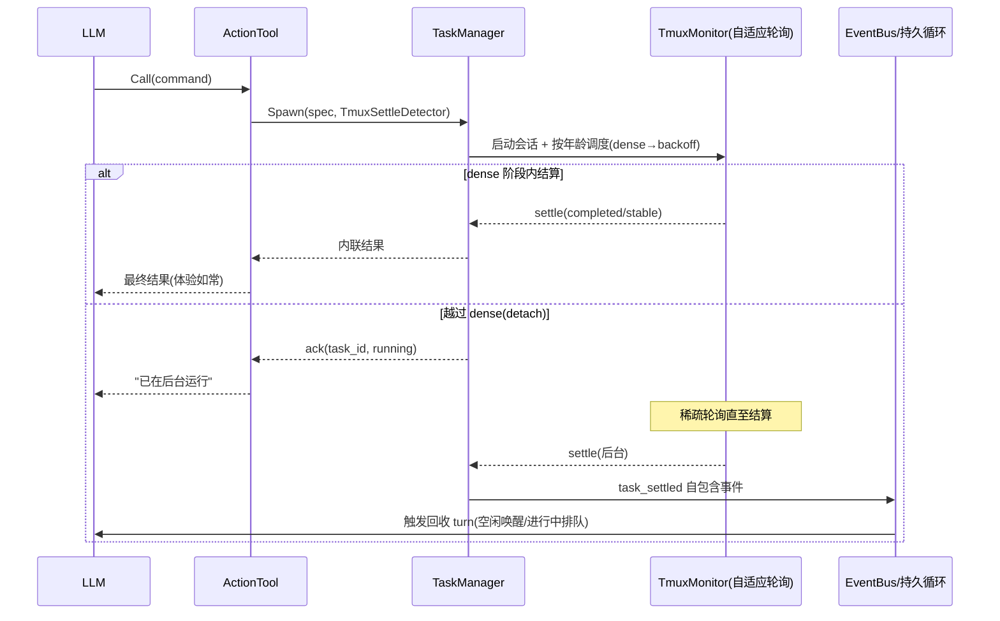
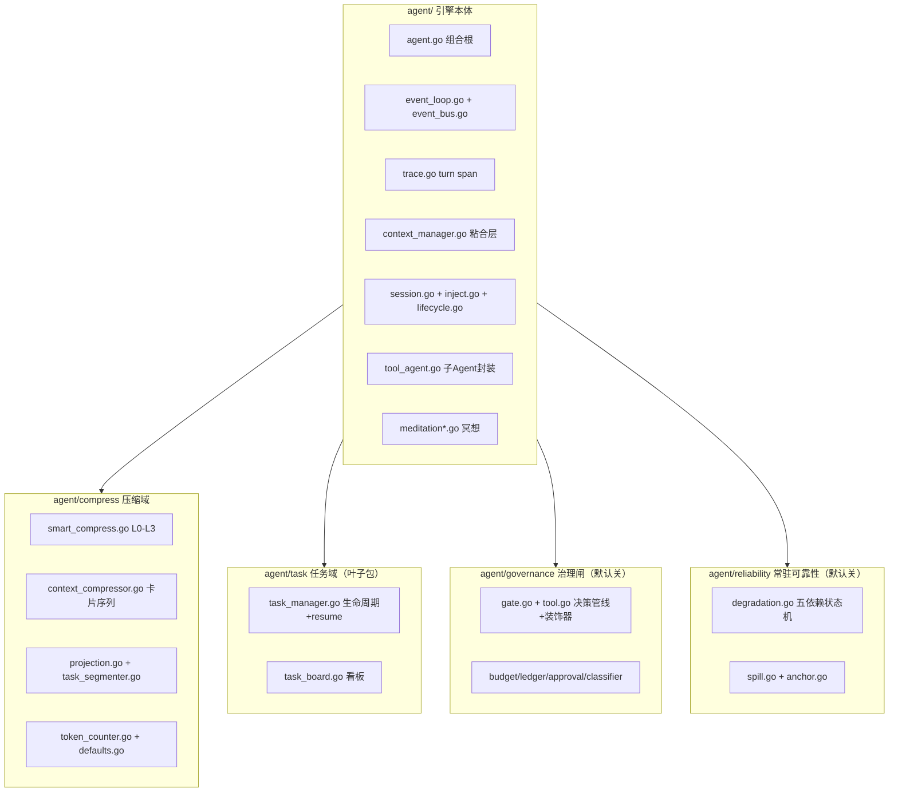

# tagent/agent 模块架构文档

<a id="module-position"></a>
## 一、模块定位

`tagent/agent` 是 tagent 项目的**事件驱动执行引擎**。核心设计思想源于 [prototype/agent.go](../../../prototype/agent.go) 的抽象实现，原型用可替换的函数字段定义了一个可扩展的框架骨架。

### 原型到生产的映射

| 原型 | 生产 | 说明 |
|------|------|------|
| `eventBus chan Event` | `EventBus` | 事件流，Publish/Pull 后丢弃 |
| `inputs []string` | `SessionProjection (EventReference[])` | 有界投影，onEvent 追加、ContextManager 读取、Compactor 清理 |
| `model *Model` | 框架 `model.Model` (通过 LLMAgent) | 框架处理 ReAct 循环 |
| `tools map[string]func` | `AgentToolWrapper` 实现 `CallableTool` | 子 agent 作为工具 |
| `Run func()` | `TagentAgent.runEventLoop(ctx, bus, cm)` | Pull → BuildInvocation → RunFlow |
| `OnEvents func([]Event) Event` | `ContextManager.BuildInvocation` + `RunFlow` | 合并消息 + 执行 Flow |
| `Compact func()` | `Compactor.Compact` (BeforeModel 回调) | 投影有界化 |

### 四个不变量

- **不变量 1**：inputs 是投影（有界，LLM 输入的唯一装配源）→ SessionProjection = EventReference[]（现居 `agent/compress` 包），`assembleRequest = [system] + render(投影)`，永不读回框架消息尾部
- **不变量 2**：写入统一——事件被存储 ⇔ 被投影，恰好一次，同点原子（MemoryPlugin.OnEvent 存储后经 ProjectionSink 同点追加）
- **不变量 3**：时序是构造保证——BeforeModel 时投影必完整，非时序碰巧
- **不变量 4**：Compact 只修改投影，不修改事件流也不修改存储层

### 框架 Runner 内部行为

trpc-agent-go 的 Runner 在 `runner.Run` 内部完成：

1. 创建/获取 session
2. 追加用户消息到 session（`sessionService.AppendEvent`）
3. 触发 Plugin.OnEvent（SummaryPlugin 先注入 Tag 与 `event_summary` 元数据——**非内容总结，原文视图**，内容级总结收归压缩固化时刻；MemoryPlugin 后写 MemoryStore + StateDelta）
4. 构建 messages（ContentRequestProcessor 从 session.Events 提取，session limit=2）
5. **BeforeModel 统一回调**（Projection-first 设计）：
   - Step 1: **TryPull + 即时持久化** — 从 EventBus 非阻塞拉取新事件，立即 StoreEvent + Projection.Append
   - Step 2: **ContextCompressor** — 从 Projection 解析全部 refs 为带 `[evt_KEY|type]` 前缀的消息，超预算时触发 SmartCompressor
   - Step 3: **提取当前轮次** — 从 args.Request.Messages 中提取无前缀的 assistant/tool 消息（当前 ReAct 迭代产物）
   - Step 4: **消息重建** — `[system] + 历史(from Projection) + 当前轮次`
6. 调用 model.GenerateContent
7. 工具执行（FunctionCallResponseProcessor）
8. 追加 response event 到 session（appender → `sessionService.AppendEvent`）
9. Emit event 到 channel

**关键结论**：
- 框架 Runner 完成 `sessionService.AppendEvent` 和 `MemoryPlugin.OnEvent`
- tagent 的 `makeOnEventCallback` 仅做 `projection.Append`（从 StateDelta 构建 EventReference，含 MemoryPlugin 生成的 `event_summary`）
- LLM 在每次调用时都看到带 `[evt_KEY|type]` 前缀的 messages（由 Callback 0 统一注入）

<a id="core-components"></a>
## 二、核心组件

### 2.1 TagentAgent（组合根）

**文件**：`agent.go`
**原型对应**：`BaseTAgent.New()` + `Run`

`TagentAgent` 是 tagent 的顶层装配点。它创建 EventBus、ContextManager、SessionProjection，并提供对外 API：

- `NewTagentAgent(cfg)` — 构造，创建 ContextManager（含统一 Runner）
- `StartLoop(userID, sessionID)` — 启动持久事件循环，返回 outputCh
- `Run(ctx, inv)` — 被调方执行入口：为本次调用运行有界事件环（调用作用域总线 + 请求级隔离的 CM/投影），输出交本次调用的通道（见 §七）
- `InjectMessage(msg)` — 向 activeBus 发布 external_input
- `StopLoop()` — 停止持久循环并**终结实例**（输出通道恰关一次；二次 `StartLoop` 显式报错（重启语义=新建 agent 实例））
- `Close()` — 关闭 ContextManager（释放 Runner）

### 2.2 runEventLoop（事件循环）

**原型对应**：`DefaultRun`

```go
func (ta *TagentAgent) runEventLoop(ctx context.Context, bus *EventBus, cm *ContextManager) {
    const maxRetries = 3
    retryDelays := []time.Duration{100ms, 200ms, 400ms}

    for {
        events, err := bus.Pull(ctx)          // ① 拉取事件（批量；混合批先丢弃冥想事件）
        msg := cm.BuildInvocation(events)     // ② 合并为一条 user message
        if msg.Content == "" { continue }

        cm.SetTriggerSource(extractTriggerSource(events))     // 消费侧确定性派发
        cm.SetInvocationMetadata(extractRootMetadata(events)) // chat_id/user_name 等经 meta_* 传播

        spanCtx, turnSpan := startTurnSpan(ctx, turnSpanAttrs{   // ③ turn root span（noop 安全）
            AgentName: ta.name, TriggerSource: source, ChatID: chatID,
            BatchSize: len(events), EventSources: eventSources(events),
            LinkTraceID: meta[trace_id], LinkSpanID: meta[span_id], // task_settled 回流 → span link
        })
        spanCtx = governance.WithTriggerSource(spanCtx, source) // ctx 盖章 trigger source（goal 门消费）

        retried, retriedDegenerate := false, false
        for attempt := 0; attempt <= maxRetries; attempt++ {
            if attempt > 0 {                    // 重试前查 ctx + 退避等待（select 可被 ctx 打断）
                if ctx.Err() != nil { endTurnSpan(turnSpan, retriedDegenerate); return }
                select {
                case <-time.After(retryDelays[attempt-1]):
                case <-ctx.Done(): endTurnSpan(turnSpan, retriedDegenerate); return
                }
            }
            if err := cm.RunFlow(spanCtx, msg); err != nil {
                if attempt < maxRetries { retried = true; continue }
                // 重试耗尽：仅记日志 + degradation.ReportFailure(DepModel)——每 turn 至多一次，
                // ctx 取消（关机）不计退化；RunFlow 只返回传输层错误（model-API 错误经 outputCh
                // 流出），故不发布错误事件。
                if ta.degradation != nil && ctx.Err() == nil {
                    ta.degradation.ReportFailure(DepModel, err)
                }
            } else {
                if ta.degradation != nil { ta.degradation.ReportSuccess(DepModel) } // 恢复路径
                // 退化 turn（无工具调用且空 final）额外重试一次——判定在**成功分支内**
                if cm.LastTurnDegenerate() && !retriedDegenerate && attempt < maxRetries {
                    retriedDegenerate = true; continue
                }
                break
            }
        }
        endTurnSpan(turnSpan, retriedDegenerate) // 退化重试记为属性，同一 turn 不另开 root span
        if ta.meditationMgr != nil {
            ta.meditationMgr.UpdateLastTurnEnd(time.Now()) // 空闲闸门锚点：任意 turn 结束都算忙
        }
    }
}
```

**错误处理**：RunFlow 失败后指数退避重试（100ms → 200ms → 400ms，最多 3 次；ctx 取消不计）。重试耗尽后**仅记日志并上报 DegradationManager 的 model 依赖失败**（每 turn 至多一次，成功时经 `ReportSuccess` 走 degraded→recovering→normal 恢复路径；RunFlow 返回的是传输层错误，model-API 错误经 outputCh 流出，故不再发布错误事件）。退化 turn（无工具调用且空 final）在**成功分支内**判定并额外重试一次（同一 turn span，`degenerate_retry` 属性标记，不另开 span）。`BuildInvocation` 只要求 `Type=external_input` 且 `Message` 非空，不区分 Source。

`StartLoop` 在 goroutine 中调用 `runEventLoop`（使用 persistentBus + ContextManager），持续 `for { Pull; RunFlow }` 直到 `StopLoop`（终结态，不可重启——输出通道在循环退出时恰好关闭一次，二次关闭会 panic，故二次 Start 显式拒绝）。

`Run()`（被调方路径）**复用同一共享壳**：入口的 `runEventLoop` 与被调方的 `runAgentLoop` 是同一条管线在各自总线上的消费者——同一 turn 原语（`processTurn` 内完成一次完整 RunFlow ReAct 循环）、同一重试预算；不存在绕过事件消费的直调快路径，也不依赖「事件流探测 + drain 定时器 + 强制 cancel」判断 turn 结束（终止＝投递对账，见 §七）。并发调用互不串投影：隔离由调用作用域总线与请求级投影承担。

### 2.3 ContextManager（粘合层：消息构建 + Flow 执行）

**文件**：`context_manager.go`（引擎侧唯一与压缩域双向衔接的文件）
**原型对应**：`OnEvents` + `ModelCompletion`

`ContextManager` 创建唯一的 Runner（LLMAgent + MemoryPlugin + SummaryPlugin + SessionService），注册 BeforeModel 回调（SmartCompressor + Compactor），并提供：

- `BuildMessages(refs)` — 从 EventReference 构建 messages（按需从 MemoryStore 拉取完整 Content）
- `InjectEventKeys(messages, refs)` — 注入 `[evt_KEY|type]` 前缀
- `BuildInvocation(events)` — 合并 bus 事件为一条消息
- `RunFlow(ctx, msg)` — 调用 `runner.Run`，转发事件到 outputCh + bus，onEvent 做 projection.Append
- `SetUserIDSessionID(userID, sessionID)` — 设置 runner.Run 的 session 上下文

### 2.4 makeOnEventCallback

仅做 `projection.Append`（从 event.StateDelta 构建 EventReference）。框架 Runner 已完成 `sessionService.AppendEvent` 和 `MemoryPlugin.OnEvent`。

### 2.5 SmartCompressor

**文件**：`compress/smart_compress.go`（agent/compress 子包）

骨架模型确定性压缩（task-skeleton-compression，唯一压缩管线；定级/丢弃纯工程，L3 折叠为双层结构）：

| 级别 | 触发（age = 段在新→旧序列中的位置，指数边界） | 段内保留 |
|------|------|---------|
| L0 | 进行中段 或 `age < keepRecent` | 全部消息 |
| L1 | `age < keepRecent*2` | 骨架 + `thinking_plan`（丢 `action_command`） |
| L2 | `age ≥ keepRecent*2`（老化封顶档） | 仅骨架（`external_input` + `agent_output`） |
| L3 | 仅预算升级（骨架化后仍超预算，自最老段起逐段升档，达标即停；段龄不触发归档） | 整段移出时间线 → 滚动 summary 归档（票据层 + 可选综述层） |

- 段 = 以 `agent_output` 为界的完整任务回合；基础定级为段龄纯函数（`deterministicLevel`，零 LLM，封顶 L2——L3 仅由预算升级抵达，段数不是触发器）
- 预算升级 O(n)：预计算每段四级成本后 O(1) 增量升档
- 使用注入的 `TokenCounter`，不自行创建
- L3 折叠双层：工程票据层（卡片行 + `[evt_key]` 召回票据）恒在；`summary_model` 配置时叠加 LLM 滚动综述 `synthesizeRollingNarrative`（旧综述 + 新折叠段骨架**原文**增量合成为单行 `〔历史综述〕`，编译期常量限长，失败/无模型降级纯工程，纯携带轮零调用）
- 卡片浓缩（`condenseCardLines`）：卡片超 `card_max_chars` 时浓缩较旧一半，保留 `[evt_key]` 票据

### 2.6 Compactor（滚动卡片序列）

**文件**：`compress/context_compressor.go` + `compress/task_segmenter.go`

投影有界化：旧引用替换为**滚动** summary reference（携带卡片序列，跨轮吸收——计数累计/卡片继承/时间下界继承）。详见 [memory 架构文档「记忆策展」章](../memory/memory-architecture.md)。

### 2.7 SessionProjection + ProjectionSink

**文件**：`compress/projection.go`（随压缩域——"Compact 只修改投影"，投影即压缩域对象）+ `projection_sink.go`（plugin 包）
**原型对应**：`inputs []string`

`SessionProjection` 是有界的 `EventReference[]`，线程安全、EventKey 幂等去重。写入统一在事件插件管线：RunFlow 用 `plugin.WithProjectionSink` 把当前 invocation 的投影绑到 ctx，MemoryPlugin 在 store 成功后同点 `Append`。

### 2.8 EventBus

**文件**：`event_bus.go`
**原型对应**：`eventBus chan Event`

per-agent 有序事件队列。Publish 非阻塞，Pull 阻塞直到有事件。构造经 `NewReliableEventBus(spillDir)`（T-G ReliableBus）：配置 `reliability.bus_spill_dir` 时 channel 满则事件溢出落盘而非丢弃（channel 恒早于磁盘的全序 + pending 背压上限 + 重启恢复，at-least-once），空则回退纯 channel（默认，零行为变化）。文件亦含 task_settled 事件构建（自包含 + Origin trace 锚回填）。

### 2.9 AgentToolWrapper

**文件**：`tool_agent.go`
**原型对应**：`tools map` + `RegisterTool`

将子 agent 包装为 `CallableTool`，处理 event_key 参数解析和外部上下文注入。子 agent 调用**默认异步**：经上下文注入的 `TaskSpawner` 纳入任务层执行，dense 阶段内返回则内联、越窗则 ack（`asyncDisabled` 可回退为同步）。并发调用不串投影/接收者：隔离由调用作用域总线与请求级隔离投影承担（同一管线，见 §七）；本地目标借用唯一常驻 owner 实例，其执行配置随组织代统一推进。

### 2.10 TaskManager（异步任务层）

**文件**：`task/task_manager.go`、`task/task_board.go`（agent/task 子包，零引擎依赖的叶子包）、`event_bus.go`；探测器 `tool/action/settle.go`、`poll_schedule.go`；任务工具 `tool/task/`

确定性（非 LLM）的任务注册表 + 调度器，让 `action`（tmux）等长耗时工具与子 agent 不阻塞事件循环：

- **spawn + settle-or-detach**：`Spawn` 在 `select{settle, detach}` 上等待——探测器在自适应轮询的 **dense→sparse 边界**发出 `Detached()`，即"同步→异步"的 ack 点（已退役独立 `sync_wait` 旋钮）。dense 内 settle → 内联；detach 先到 → ack + 后台跟踪；越界后到的 settle 走 `OnSettle`（不丢失）。
- **自适应轮询**：`TmuxMonitor` 按任务年龄逐会话调度——dense 密集探测、几何退避至 `max_interval`；`stable` 服务型任务钉在最稀档（alive-detached）。参数经 `MonitorConfig` 配置。
- **settle 五档 + 唯一终态入口**：`completed` / `stable` / `suspect` / `watch`（命中通知，非终态）/ `failed`（reconcile 回收），探测器只做确定性分类；终态转换**只经 `finalize`**（内存状态、信号 Kind、WAL settle_status、反馈极性四端一致——失败必带失败语义，未知 Kind 映射 unknown 告警不落 completed）；终态后迟到信号被 fencing 丢弃（不得复活/重复结算）。
- **task_settled 回收 turn**：后台任务结算发一条自包含事件到 EventBus；持久循环空闲则唤醒、进行中则排队。
- **Origin 信使行李**：TaskSpec.Origin 携带 spawn turn 的调用元数据（chat_id 等 + trace_id/span_id 锚点），任务层只透传不解读；task_settled 回流的新 turn 据锚点建 OTel span link，连接 spawn/settle 两棵 trace（跨 turn 闭环）。
- **registry = 事实链 fold**：spawn 伴随 `task_spawned` 一等事件（载 Declarative 声明式投影）；**inline settle 也补发终态记录**（`task_inline_record` 标记）+ 后台 settle 携结构化 `task_id/settle_status` Metadata——重启经 `RebuildTaskRegistry` 纯全量回放重建 active 态（running→suspect 交存活探测裁决，终端不重建），闭包按 Kind 承诺表由工厂重建（command 全套；subagent 仅 Relaunch、跨重启 Resume 返回引导；generic 展示）。TaskManager 归属每个 agent 自身——一个 tagent 生命周期内唯一，换执行器代不丢任务板；父的委派任务与子的内部任务分属各自任务域，不合并为全局表。
- **看板 + 工具**：`BeforeModel` 每次调用从 registry 重渲染 live 看板（不参与压缩，**追加在消息列表末尾**——看板字节逐次变化，置于尾部使前缀缓存仅损失看板自身，等待指引行同时是模型读到的最后内容）；`list_tasks` / `cancel` / `relaunch` / `resume_task` 为即时同步工具（结果消费不走专用工具：小结果随 settle 通知内联，大结果转储文件经 read_file 分页）。
- **resume_task 重入**：合法源状态 {alive-detached, stable, completed, failed}；tmux 经 detector `Rearm`（绑会话非轮次，零换绑），subagent 经新 Run + 任务链还原器。详见 [tool 架构文档「任务重入」章](../tool/tool-architecture.md)。
- **会话回收闭环（ADOPT-FIRST）**：运行时 completed/error 即回收；优雅退出 `Close()` 收编存活会话；启动**先收养后清扫**——每个重挂/已跟踪会话刷新 `LastAdoptedAt`（收养即 freshness 锚），Sweep 只收割「无人收养且距最后收养超 TTL」的孤儿，**spawn 年龄不构成清理依据**（长驻会话不因 24h 生日被误杀）。探测三态化：`SessionAlive3`（list-sessions 单源：在列表=活/不在=死/命令不可辨=unknown），monitor 连续 N 次（默认 3）unknown 才按 dead 处理（fail-dead 加闸，tmux 抖动不再误杀常驻会话）。
- **统一 TTL 回收（假活治理）**：命令在 spawn 时确定有限 `ttl`（模型入参；否则取 `task_default_ttl`，缺省 10min），到期由**唯一** reaper 经 owner `detector.Cancel` 真实终止 → failed 终态 → reap → 移出看板。准入覆盖全部 active 态（running/stable/alive_detached/suspect）与全部寿命类（含常驻/交互服务，**无按 mode 豁免、无禁用哨兵**），堵死旧双墙「gate 在 alive_detached/stale + detachedAt、漏掉未 detach 的 suspect」的盲区。`op=send`/`resume_task` 续命重置锚点，`op=peek` 只读不续；restored 任务经声明式投影恢复其 `ttl`。年龄回收仅 TTL 一条路径，无按 mode 豁免、无禁用哨兵。detachedAt 仍入事实链供观测，但不再作为终止判据。
- **世系跨重启保真**：`Spec.Origin` 深拷贝入 `task_spawned`，恢复时身份字段以持久层为准（恢复闭包只补执行能力，不得整体覆盖）；无世系历史恢复为 `unknown`，宿主对 unknown 与内部来源同等扣留——内部任务（如冥想派生）跨重启不再退化为可投递来源。`settle_status/task_id/lineage_absent/detached_at_ms` 为框架控制键，不进后续任务的 Origin baggage。
- **跨重启连续**：冷启动序 = 投影重建 → registry 重建 → 常驻会话重挂（`residentReattachOnce` 唯一挂载点，多 agent 仅首实例）→ TaskID 桥（重挂跟踪的会话将其 suspect 任务提升回 running）。常驻会话生命周期入事实链（`resident_session` spawn 全参/终态事件），meta 目录可配（`resident_meta_dir`）。
  - 投影重建是**事实链的纯回放**：取最新的压缩快照，再把尾部事件重放出来，目标是逐字节复原换代前的上下文（同样的字节才谈得上复用前缀缓存）。只在启动期做一次、进的是空投影，并且排在兜底落盘的重放接线之前。事实链里没有带代际标记的压缩事件时（首次启动、或从未折叠）整步 no-op，维持现状行为；热重建的执行壳跳过这一步——投影属常驻实例，丢弃壳上重建是空跑。
  - **进程重启 vs 整机重启（证据边界）**：常驻重挂以 **live `tmux list` 为存活真源**对账磁盘 `ResidentMeta`——(a) **进程重启**（tagent 崩溃/升级，tmux server 存活）：tmux 会话仍在列表 → 重挂成功 → suspect 任务经 TaskID 桥提升回 running，执行现场连续；(b) **整机重启**（tmux server 随之消亡）：`ResidentMeta` 磁盘持久仍在，但 `tmux list` 为空 → 无存活可挂 → 在飞任务**不复活**（registry fold 后 running→suspect，探测判死）。两态下**事实链均不受影响**（正 key 事件 + settle_fold 票据原样在链，recall 仍可取回原文）——即「耐久真相源恒存，易失执行现场仅进程重启可续」。

- **遥测通道与消费降级（attention-budget-architecture）**：结算通知是机器遥测而非对话输入——其保留由**消费状态**决定（确定性推导：回收 turn 的产出与 outputCh 投递记录），不由相邻关系或段龄决定。compaction act 时：已消费且外显的通知降级为票据卡（settle_fold 单条折叠，原文 recall 可达；failed 卡片行带 ★ 进反思通道）；内部性（冥想派生/退役结算/无世系）保一行摘要 keepRecent 轮后降级；**未消费通知保持完整且被 L3 豁免**（至少一次在通道层的延伸）。看板是任务状态的唯一常驻呈现，通知只承载"事件到达"。行为审计（self-telemetry-audit）滚动统计自管遥测占比，L2 拒绝自管来源的新 spawn、L3 冻结非保护类（保护类由构造声明豁免，磁盘闸仍适用）——与 disk block spawn 同闸不同源。

**一个 tmux 命令的一生**（把上面的零件串成一条线）：


```mermaid
sequenceDiagram
    participant LLM
    participant Tool as ActionTool
    participant TM as TaskManager
    participant Mon as TmuxMonitor(自适应轮询)
    participant Bus as EventBus/持久循环

    LLM->>Tool: Call(command)
    Tool->>TM: Spawn(spec, TmuxSettleDetector)
    TM->>Mon: 启动会话 + 按年龄调度(dense→backoff)
    alt dense 阶段内结算
        Mon-->>TM: settle(completed/stable)
        TM-->>Tool: 内联结果
        Tool-->>LLM: 最终结果(体验如常)
    else 越过 dense(detach)
        TM-->>Tool: ack(task_id, running)
        Tool-->>LLM: "已在后台运行"
        Note over Mon: 稀疏轮询直至结算
        Mon-->>TM: settle(后台)
        TM->>Bus: task_settled 自包含事件
        Bus->>LLM: 触发回收 turn(空闲唤醒/进行中排队)
    end
```

对应能力规格：`async-task-execution`、`task-registry-and-board`、`adaptive-poll-scheduling`。

子任务登记在**提供 spawner 的那个 agent 自己的** TaskManager 看板上，而不是入口的看板：`TaskSpawner` 由所属 agent 注入，看板与 TaskManager 一一对应。因此"任务落在哪一级"由抬起它的那一级决定，跨级重放与退役判定都按这一归属解析。

### 2.11 治理与可靠性接线（本模块落点）

buildAgent 对**所有 agent** 的非 wrapper leaf 工具经 GovernanceTool 过闸（包裹链 `OutputLimitTool(GovernanceTool(raw))`，per-agent 独立 BudgetManager + 共享 Ledger/Classifier/Approval/Goals；refine 工具仅 entry、先于治理包裹追加）；event_loop 上报 model 依赖退化、turn ctx 盖章 trigger source（goal 门消费）；ReliableBus/AnchorStore 为 opt-in（目录配置非空启用）。详见 [platform 篇](../platform/platform-subsystems.md)。

**逐 agent 的模型解析**：调用方预解析好的覆盖实例优先（入口的 `SwappableModel` 就走这条）；该 agent 未声明模型时继承父模型；否则按它的 provider 与模型名从 provider 池解析；解析失败回落父模型并告警——一个次要 agent 的模型配错不该让整个构建失败。

### 2.12 turn-as-trace 可观测

每 turn 一棵 trace（`tagent.turn` root span，属性含 trigger_source/chat_id/event_sources；退化重试记为属性不另开 span；ctx 早退补 End；task_settled 据 Origin 锚建 span link）——事件 Metadata / RL 轨迹 / OTel span 三投影由 trace_id 互链，noop provider 零开销。详见 [platform 篇](../platform/platform-subsystems.md)。

### 2.13 执行代与发布（executor generations）

ContextManager 的 runner 是**可换代缝**，换代由「构造 → 纳管 → 激活」三段与一条唯一线性化承载：

- **构造与发布分离**：`NewExecutorCandidate(face)` 只装配新 runner 与执行面（模型/工具/装饰器；装配是纯函数——冷启动与换代共用同一路径，防双路径漂移）。单 owner 的发布入口是 `PublishExecutor(candidate, face)`；组织路径经 `StageExecutor`（候选私有 overlay + 有序责任表，纳管期完成声明持有与工具接线）→ `ActivateExecutor`（安装纳管好的绑定）。两条入口共用**同一条线性化** `publishActiveLocked`：记录执行面 → 装代 → 换 runner → 在锁外交出待退役绑定（慢 Close 不占执行锁）。同一 runner 重发不产生第二代（一个 runner 对象恰好一次 Close）；执行面记录推进、绑定保持其建成时快照。
- **turn 取代点**：`BeginTurnLease()` 是业务 turn 取得执行绑定的唯一位置——先触发非阻塞懒检查，再钉定当时已发布的 effective；lease 可发布进调用链上下文，派生执行（嵌套委派、传输重试、ACK 后后台续写）在**同一代**上累加引用，不因新发布改路由。`BeginTurn` 是其便利形态。
- **drain-free 换代**：进行中 turn 持旧代引用跑完；退役判定 = 已退役 ∧ 在途引用归零 ∧ 声明持有归零（一个代为其面内声明的子 owner 持有使用权，声明方存活期间被声明代不回收）。
- **热参数读取**：五个数值热参（压缩阈值/预算/保留数/任务 TTL 两值）不随换代推送——各 owner 从唯一已提交应用记录在**消费边界现读**（压缩器经注入的热参源拉取、任务 spawn 经 TTL 源读取），结构代与数值轴分离，无第二份可独立修改的真值。
- **懒检查**：`SetOrgReloader` 闭包在业务 turn 起点触发（单次 stat，未变更零成本）；结构变更经指纹对比触发 candidate-then-publish（fail-closed + 双槽回滚环）。详见 [platform 篇 §六·A](../platform/platform-subsystems.md)。

<a id="package-layout"></a>
## 三、包与文件结构（分包后）


```mermaid
graph TB
    subgraph agent["agent/ 引擎本体"]
        AG["agent.go 组合根"]
        EL["event_loop.go + event_bus.go"]
        TR["trace.go turn span"]
        CM["context_manager.go 粘合层"]
        SE["session.go + inject.go + lifecycle.go"]
        TW["tool_agent.go 子Agent封装"]
        MD["meditation*.go 冥想"]
    end
    subgraph compress["agent/compress 压缩域"]
        SC["smart_compress.go L0-L3"]
        CC["context_compressor.go 卡片序列"]
        PJ["projection.go + task_segmenter.go"]
        TK["token_counter.go + defaults.go"]
    end
    subgraph task["agent/task 任务域（叶子包）"]
        TM["task_manager.go 生命周期+resume"]
        TB["task_board.go 看板"]
    end
    subgraph governance["agent/governance 治理闸（默认关）"]
        GT["gate.go + tool.go 决策管线+装饰器"]
        GB["budget/ledger/approval/classifier"]
    end
    subgraph reliability["agent/reliability 常驻可靠性（默认关）"]
        DG["degradation.go 五依赖状态机"]
        SP["spill.go + anchor.go"]
    end
    agent --> compress
    agent --> task
    agent --> governance
    agent --> reliability
```

| 包/文件 | 职责 | 原型对应 |
|------|------|---------|
| `agent.go` | 顶层装配 + TagentConfig；OutputLimitTool 包裹全部工具（封顶 `toolOutputCapChars`=60K，与 MaxTokens 解耦——防长 budget 下 MaxTokens/2×4 派生形同虚设；超限全量存 `<workspace>/tool-output`，返回带路径摘要） | `BaseTAgent.New()` |
| `event_loop.go` / `event_bus.go` | 持久循环（turn span + model 退化上报 + 退化重试）+ 事件队列（可选 ReliableBus 溢出） | `DefaultRun` / `eventBus chan` |
| `trace.go` | turn root span（`tagent.turn`）开/关与属性（trigger_source/chat_id/event_sources）；task_settled span link | 无（生产扩展） |
| `context_manager.go` | 粘合层：消息构建 + 压缩编排 + Flow 执行 + 统一 Runner + Attribution/OriginSpawner 绑定 | `OnEvents` + `ModelCompletion` |
| `tool_agent.go` | AgentToolWrapper + 任务链还原器 + 工具注册接口 | `tools map` + `RegisterTool` |
| `meditation.go` / `meditation_digest.go` | 冥想心跳 + 自我状态 digest（PromptSource 为 prompt.Getter） | 无（生产扩展） |
| `governance/` | GovernanceGate 决策管线（classify→critical 批准→goal→budget→记账）、GovernanceTool leaf 装饰器、BudgetManager、ApprovalManager、DenialLedger、RiskClassifier | 无（生产扩展，默认关） |
| `reliability/` | DegradationManager（memory/disk/rustviking/model/mcp 五依赖退化-恢复）、SpillStore（ReliableBus 磁盘溢出）、AnchorStore（冥想锚点跨重启） | 无（生产扩展，默认关） |
| `compress/` | SmartCompressor、卡片序列 Compactor、SessionProjection、TokenCounter、压缩默认常量单源 | `Compact` + `inputs` |
| `task/` | TaskManager、settle 探测契约、看板、resume、跨包测试基建（fixture.go）；Origin 携带 trace 锚 | 无（生产扩展） |
| `rl/`（独立顶级包） | TrajectoryRecorder（含 trace 关联字段）+ HTTPAPI（**token 认证 + loopback fail-closed**：`TAGENT_RL_AUTH_TOKEN`/`ValidateListenAddr`，实施加固 3.x）+ SwappableModel（retired model 延迟回收，5.2） | 无（生产扩展） |

依赖方向由编译器执法：`agent → compress`、`agent → task`、`agent → governance`、`agent → reliability`，子包零反向依赖，新代码直接 import 子包。

<a id="data-flow"></a>
## 四、数据流

```
用户调用 InjectMessage / 外部事件到达
    │
    ▼
EventBus.Publish(AgentEvent{external_input})
    │
    ▼
TagentAgent.runEventLoop:
  ① bus.Pull(ctx) → 批量取出事件
  ② cm.BuildInvocation(events) → 合并为一条 model.Message
  ③ startTurnSpan(tagent.turn) → spanCtx
  ④ cm.RunFlow(spanCtx, msg)
       │
       ├─ runner.Run(ctx, userID, sessionID, msg)
       │    ├─ 创建/获取 session
       │    ├─ 追加用户消息到 session (sessionService.AppendEvent)
       │    ├─ Plugin.OnEvent (SummaryPlugin 先注入 Tag，MemoryPlugin 后持久化 + StateDelta + event_summary)
       │    ├─ ContentRequestProcessor 从 session.Events 构建 messages (session limit=2)
       │    ├─ BeforeModel 统一回调 (Projection-first):
       │    │    ├─ TryPull + persistBusEvent（新事件即时入 Projection）
       │    │    ├─ ContextCompressor.Compress(refs)（原生时间线渲染 + 压缩）
       │    │    └─ 消息重建: [system] + render(投影)（单行化，永不读回框架消息尾部）
       │    ├─ model.GenerateContent
       │    ├─ FunctionCallResponseProcessor (工具执行 + 迭代控制)
       │    ├─ handleEventPersistence (sessionService.AppendEvent)
       │    └─ EmitEvent → event channel
       │
       └─ for fwEvt := range eventCh:
            ├─ onEvent(fwEvt) → projection.Append (仅此一项)
            ├─ outputCh <- fwEvt
            └─ if final: bus.Publish(agent_output echo)
                │
                ▼
  ⑤ 回到 bus.Pull — 下一轮事件
```

<a id="framework-boundary"></a>
## 五、tagent 与 trpc-agent-go 的边界

**tagent 独有**：
- `EventBus` + `runEventLoop`：持久事件循环 + 异步事件注入
- `SessionProjection` + `Compactor`：有界投影 + 投影清理
- `SmartCompressor`：两阶段上下文压缩
- `MemoryStore` + `MemoryPlugin`：结构化事件存储 + 因果链
- `MeditationManager`：冥想心跳（双闸门触发：血统无关的空闲闸门 `lastTurnEnd` + 输入侧锚定的新颖性闸门 `lastUserInput`）
- `TrajectoryRecorder`：LLM 调用轨迹记录

**框架已有（tagent 复用）**：
- `runner.Run` (Flow.Run)：ReAct 循环、工具执行、迭代控制
- `ContentRequestProcessor`：从 session 构建 messages
- `FunctionCallResponseProcessor`：工具执行
- `BeforeModel` / `AfterModel` 回调
- `session.Service`：session 管理 + AppendEvent
- `model.Model`：LLM 调用
- `event.Event`：事件结构
- `tool.Tool` / `CallableTool`：工具接口

<a id="context-management"></a>
## 六、上下文管理

### 6.1 压缩（SmartCompressor）

SmartCompressor 由 ContextCompressor 在 BeforeModel 装配回调中调用，在投影解析为消息后、调用 model 前执行（骨架模型，见 §2.5 定级表与 [event-flow.md §六](event-flow.md)）：
- 以 `agent_output` 为界切分完整任务回合（`SegmentMessages`），段龄纯函数定级，按 `tool > assistant` 序丢弃中间事件，零 LLM 不失败不降级
- L1 丢弃 `action_command` 结果时同步剥离对应 tool_calls（单轮产物自洽合法）
- L3 整段不进入产物，由 `buildRetainedRefs` 收编进滚动 summary（`external_input`/`agent_output` 成卡片行，recall 可溯源）
- 保留消息原样携带 `[evt_KEY|type]` 前缀，衔接存活 ref 判定
- **仅修改发给 LLM 的消息视图，不修改 SessionProjection 或 MemoryStore**（纯视图变换，遵守不变量 2；投影替换由 ContextCompressor 的 RetainedRefs 返回值驱动）

压缩参数通过 YAML `compress` 段配置（`summary_model`/`card_max_chars`/`compact_keys_listed`/`recent_full_count`/`summary_max_tokens`）。骨架管线为唯一压缩路径，其中 LLM 文摘恰有两处低频叠加层——L3 滚动综述 `synthesizeRollingNarrative` 与卡片浓缩 `condenseCardLines`，均无模型时降级为纯工程形态。

### 6.1.1 时间线渲染红线（外部分析常见误判点）

压缩产物**永远不进 system**。渲染规则的三条铁律：

| 铁律 | 含义 |
|------|------|
| system 恒单条恒首位 | 只装指令（system prompt）；任何机制产物不得追加进 system |
| 压缩摘要 = user 级〔历史归档〕注记 | `context_compress` 渲染为带"非用户发言勿模仿"标注的 user 消息——观察类信息归 user |
| assistant 恒等于 LLM 真实产出 | 系统永不代 assistant 说话，也永不在 assistant 历史中生成文本化调用语法（防模仿伪调用） |

> 之所以单列：曾有外部分析（基于可见 API 契约的合理外推）误判为"摘要 system 内联"——这是常见框架做法，但 tagent 恰恰以不这样做为设计红线。凡对模型可感知的渲染行为，本文档显式声明，不留猜测空间。

### 6.2 Compact（Compactor）

Compactor 作为第二个 BeforeModel 回调，当 SmartCompressor 不足以压缩时触发：
- 从 SessionProjection 读取所有 EventReference
- 按任务分段，保留最近 N 个任务，旧任务折叠为 summary reference
- `projection.Replace(compacted)` + 从 compacted projection 重建 messages
- **修改 SessionProjection（投影），不修改 MemoryStore**

### 6.3 MaxToolIterations

- 主 agent：`DefaultMaxToolIterations = 50`
- 子 agent：`DefaultSubAgentMaxToolIterations = 10`（如父配置更低则取父配置）

通过 `llmagent.WithMaxToolIterations` 注册到框架 LLMAgent。

### 6.4 配置化

压缩参数通过 YAML `compress` 段配置：
```yaml
agents:
  tagent:
    compress:
      summary_model: deepseek-v4-flash    # 压缩专用模型(可用廉价模型)
      card_max_chars: 6000                # 卡片序列上限
      compact_keys_listed: 32             # 滚动摘要 recent keys 上限
```

TmuxMonitor 参数通过 ActionProperties `monitor` 段配置：
```yaml
tools:
  - kind: tool
    id: exec
    properties:
      monitor:
        dense_interval: 1s      # dense 阶段探测间隔
        dense_duration: 10s     # dense 阶段时长(=同步→异步 ack 点)
        backoff_factor: 2       # 几何退避因子
        max_interval: 60s       # 稀疏轮询上限
```

<a id="subagent-loop"></a>
## 七、子 Agent 调用（同构调用环）

`TagentAgent.Run(ctx, inv)` 是被调方的执行入口。**被调方与入口是同一种 tagent**——同一共享壳、同一 turn 原语、同一重试预算，自有事件总线与任务域；差别只在输出交给谁：

1. 输入（含 `RuntimeState["external_context"]` 的事件上下文与关联信息；resume 时由任务链还原器自动注入本任务前序轮次）转换为初始事件，**发布进本次调用的作用域总线**；
2. `invID→bus` 绑定表在入口注册——本次输入衍生的任务 settle 与 agent 输出的目的地在**输入时即确定**，运行期只查绑定、不猜；
3. 共享壳 `runAgentLoop` 消费该总线：每次迭代是一次完整 turn（`processTurn`，与入口同一原语）；请求级隔离的 CM/投影接本 agent 自己的服务（含任务控制器）；
4. 本 agent 任务域发起的后台任务，其 `task_settled` 按绑定路由回**本次调用的总线**——环持续消费，晚到结算触发续写轮（首答与续写同环、同一重试预算）；
5. 输出恒发往本次调用的通道：同步关联结果按原语义作为 tool result 返回发起 turn；父 turn 已结束的越窗输出按通知形态送达绑定接收者，不对同一 tool_call 重复结算；
6. 终止＝**投递对账**：绑定总线上无待达结算且无更多注入时环排空退出（调用方 ctx 为硬上限），不靠首条 assistant 消息、drain 定时器或文本探测关闭 agent。

被调用不构成第二套架构：本地目标借用唯一常驻 owner 实例（身份/存储/治理随组织代统一推进，不因角色变化缺能力）；远程 A2A 目标走同一 `agent.Agent` 接口。取消/超时只终结该调用环与通道，不 Close 被 agent、不级联其无关任务。子 agent 的 MaxToolIterations 取 `min(父配置, 10)`；运行参数只在其自身 `agents.<name>` 定义处配置（ToolRef 只声明引用关系）。

**委派目标的解析代**。委派目标只从**已发布代**的声明面解析，不读可变全局：编辑既有配置（不引入新语法）即改变下一个请求真正可调的子 agent，而入口运行时——存储、会话服务、常驻绑定表——在一次真实发布前后按**指针**保持身份（"换成内容相同的新实例"正是必须拦下的形态）。在途委派的代际边界是 turn：持租约的那一代把它服务完、答案恰好回给发起回合一次，新目标不得在其返回之前抢跑；换代的影响只对返回之后的请求生效。被移除的目标此后不再获得新调用，却保留其常驻属主，使同名再入复用原存储属主。

**重入的目标解析同用一条规则**：已存储任务的重投递，有发起调用绑定就用那次调用的绑定，否则用**当前有效执行面**。重投递走的是常驻构建，绝不能把此刻的包装器表冻成快照传下去——热更换代后若仍照快照解析，已被移除的目标会被旧代绑定静默复活。这与普通委派同源，不另立第二套解析规则。
句柄指向的必须是**常驻属主**的上下文管理器：候选壳在其运行器被发布后就丢弃，绑到壳上等于冻住一张死面，重入会永远从它路由出去。取不到常驻属主时按拒绝处理并说明理由，不猜一个面顶上。

**逐层与逐形态**。每一层委派带它**自己那代**的声明（入口→[b]、嵌套层 b→[c]、叶无工具），最深结果逐层回流到直接父、再回流到入口；`async` 取默认时委派被任务层收养（spawn 记录为 `agent:request` 形状）且结果仍 inline 交回请求回合；`kind:tool` 工厂产物在其所建之代被声明、被真实执行、返回值回到父回合——服务调用的正是已发布面构建时持有的那个实例。读全局 agent 表而非本层绑定，会表现为缺失或错误的工具声明、或结果永不抵达。

**远程 A2A 的线上传输契约**。除走同一 `agent.Agent` 接口外：只有远程引用、无任何本地定义的配置必须能加载，在真实模型请求里暴露该委派工具，确实落到声明的 URL，并把远端答案作为 tool result 回到父 turn（父请求原文随委派送出）；父存储解析出的 `event_key` 上下文以 transferred state 跨线送达远程，供给来自父绑定而非新绑定。声明为远程却缺 endpoint 必须在加载期拒绝，绝不静默按本地构建——那会运行一个与配置所述不同的运行时。传输重试固定**同一声明端点与同一委派载荷**（继承发起调用的租约），不在重试路径重解析目标；「重试过程中发布」把同名 agent 改指不同端点时，判别是因果的：父拿到答案之前后继端点一次都不得被联系，而原端点每次尝试都带同一载荷。本地回合不做这种传输重试。


---

<a id="test-support"></a>
## 八、测试替身住在包内的非 _test 文件里

包内测试共享的替身与构造器集中在 `agent/testsupport.go`（不是 `_test.go`）。原因是一条构建事实：内部测试（`package agent`）无法导入一个反向依赖 `agent` 的支撑包——Go 明确禁止测试里的导入环；而把那些内部测试改成外部测试包，又会牵出大量包内私有引用，属更大范围的重构。

因此这些替身以非 `_test` 文件形态存在：文件名不受"测试文件须声明职责"这条判据约束，替身本身仍保持包内私有、只被测试引用。代价是它们会随库一起编译（不参与运行时行为）；若要消掉这一点，就得承担外部化改造的规模。

## 已知缺口与演进方向

> 本章主动声明当前设计尚未闭合的环——供使用者评估适用边界，也供外部分析引用（缺口以工程事实陈述，含现有防线与候选方向）。

| 缺口 | 现状与防线 | 候选方向 |
|------|-----------|---------|
| **子 Agent handoff 无结构化 schema** | 跨 Agent 传递依赖 `request` 自然语言 + `event_keys` 票据（票据本身是结构化 hex 契约，有真实 LLM 契约测试守护）；但"意图/约束/权限/未决决策"没有结构化载体 | 定义 handoff envelope（intent/constraints/grants 字段）随 external_context 传递 |
| **迭代上限无收尾轮** | 撞 `max_tool_iterations` 时进行中的工具调用直接丢弃（实机：plan 子 Agent 3m52s 的文档工作被掐断，靠模型自恢复换路完成） | 预算剩 1 轮时注入收尾提示，让模型保存半成品再终止 |
| **runEventLoop 单 session** | 一个 TagentAgent 实例绑定一个 (user, session) 循环；多会话需多实例 | 会话路由层（多循环共享引擎与存储） |
| **冥想无内容价值判据** | 双闸门（meditation-idle-gating）已解决自触发永动机：触发需 `now - lastTurnEnd ≥ MinGap`（任意 turn 结束算忙）**且** `lastUserInput > lastMeditation`（上次冥想后有新用户输入）。但新颖性仅看“有无新用户输入”，不看内容价值——用户发一句无关闲聊也会解锁下一轮冥想 | 未消化事件量/★ 卡片密度作为内容价值第三判据 |
