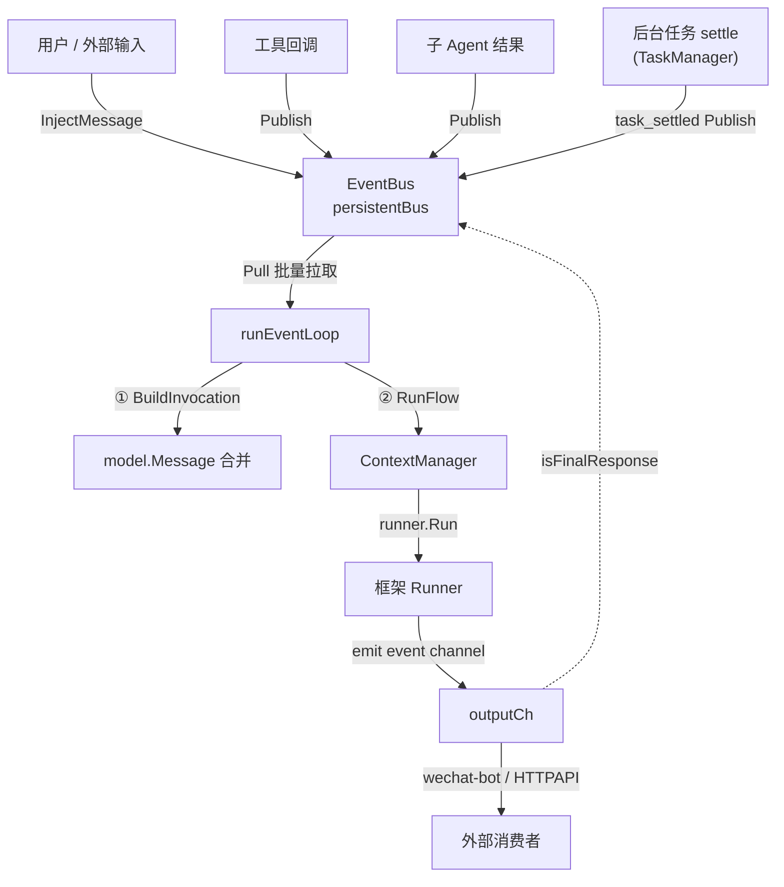
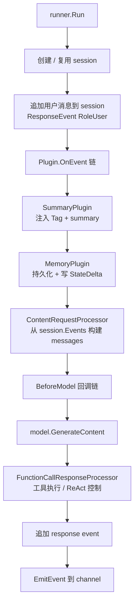
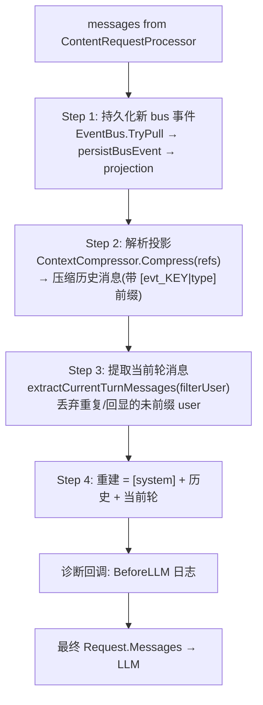
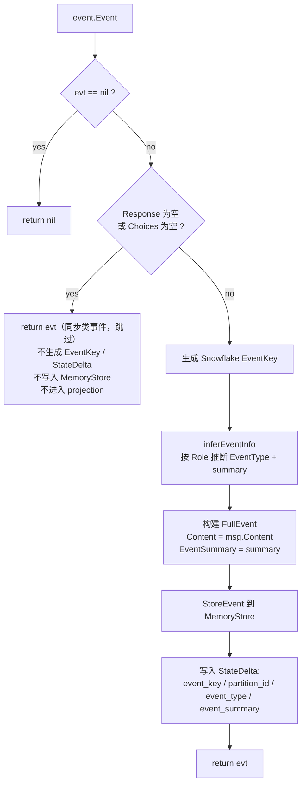
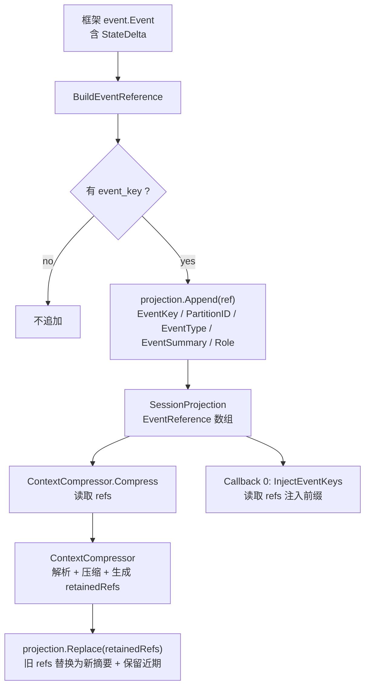
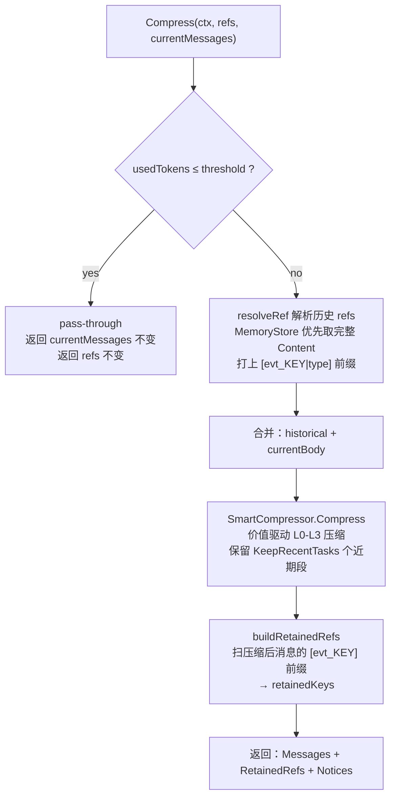
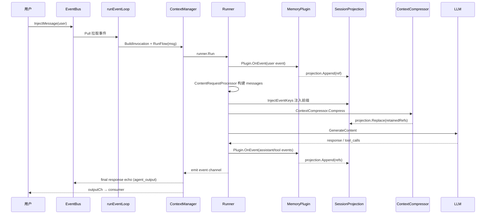

# 事件流与上下文压缩机制

> 本文档用 Mermaid 图说明 tagent 事件驱动的完整流转：从外部消息进入、经 Runner 处理、MemoryPlugin 持久化、SessionProjection 维护、到 BeforeModel 回调链（ContextCompressor 统一压缩）最终调用 LLM 的全过程。

## 一、整体事件流

> **task_settled 回收 turn**：长命令 / 子 agent 经**任务层**异步执行，后台结算时 `TaskManager` 发一条自包含的 `task_settled` 事件（复用 `external_input` 类型，`source=task`）到 EventBus，像外部输入一样触发一个回收 turn——循环空闲则唤醒、进行中则排队（不打断当前 turn）。详见 `agent-architecture.md` §2.10 任务层。

## 二、Runner 内部流转

## 三、BeforeModel 回调链

当前实现将上下文重建收敛为**一个统一的 BeforeModel 回调**（外加一个诊断日志回调），按 4 步执行：

**重建顺序即消息顺序**：`[system] + 压缩历史 + 当前轮`。因此**驱动请求必须先进入 projection**（顶层由框架 emit + SessionHook 转发；子 Agent 由 `Run()` 的 `persistBusEvent` 显式写入），才能作为「历史」的首条紧跟 system；否则它会停留为框架未前缀的 invocation seed，被 `extractCurrentTurnMessages` 当作「当前轮」拼到末尾，随 ReAct 累积被挤到最后。

**filterUser 语义**：当压缩历史中已含 user（即请求已入 projection）时，`extractCurrentTurnMessages` 丢弃框架重复插入的未前缀 user（session echo / invocation seed），避免重复；ReAct 内部消息（带 tool_calls 的 assistant + tool 结果）始终保留。

## 四、MemoryPlugin 持久化（含 nil-Response 过滤）

> 过滤逻辑是为避免框架在 ReAct 过程中发出的同步类事件（start / wait / barrier，无 payload）被误存为 `external_input` 空占位符，污染 projection。

## 五、SessionProjection 生命周期

## 六、ContextCompressor 统一压缩

> 关键点：历史消息（`resolveRef` 解析得到）和当前消息（`InjectEventKeys` 注入过前缀）都带 `[evt_KEY|type]`，`buildRetainedRefs` 据此判断哪些投影 ref 被压缩、哪些被保留，最后调用 `projection.Replace(retainedRefs)` 一次原子替换。

## 七、一次完整请求的端到端时序

## 八、压缩前后投影变化示例

| 阶段 | SessionProjection 内容 |
|------|----------------------|
| 压缩前 | `[ref1(user), ref2(asst), ref3(tool), ref4(user), ref5(asst), ref6(tool), ref7(user), ref8(asst)]` |
| KeepRecent=2，L3 压缩旧段 | `[summaryRef(context_compress), ref5(asst), ref6(tool), ref7(user), ref8(asst)]` |
| 注入前缀后 LLM 看到 | `[evt_summary|context_compress]...`、`[evt_5|agent_output]`、`[evt_6|action_command]`、`[evt_7|external_input]`、`[evt_8|agent_output]` |

> 旧事件被压缩为一个 summary ref（含所有被压缩 event key 清单），近期事件保留，LLM 可通过 `recall(event_keys=[KEY])` 按需检索完整内容。
