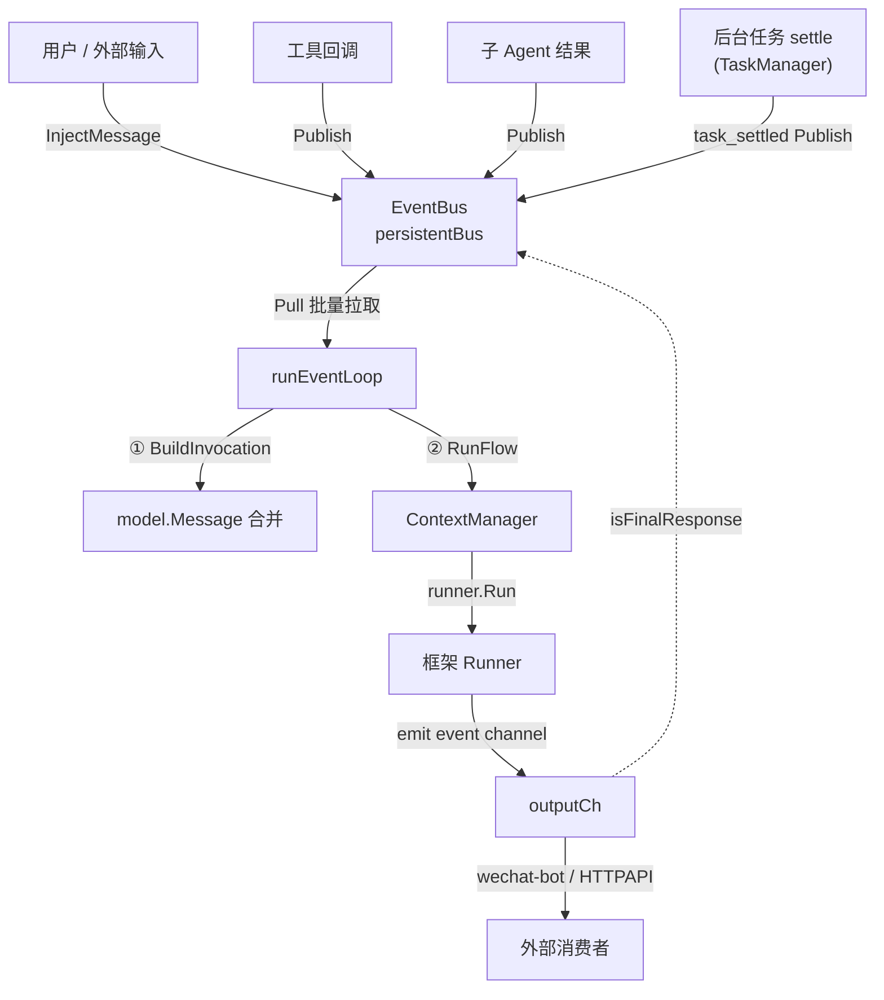
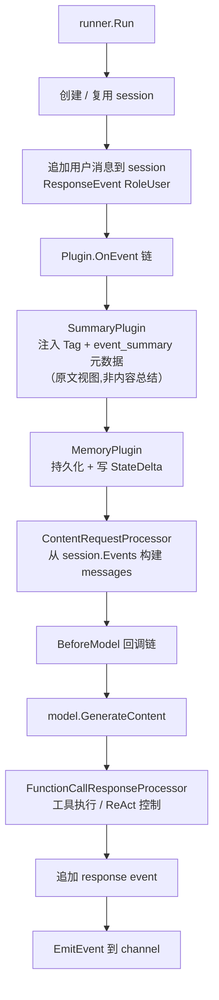
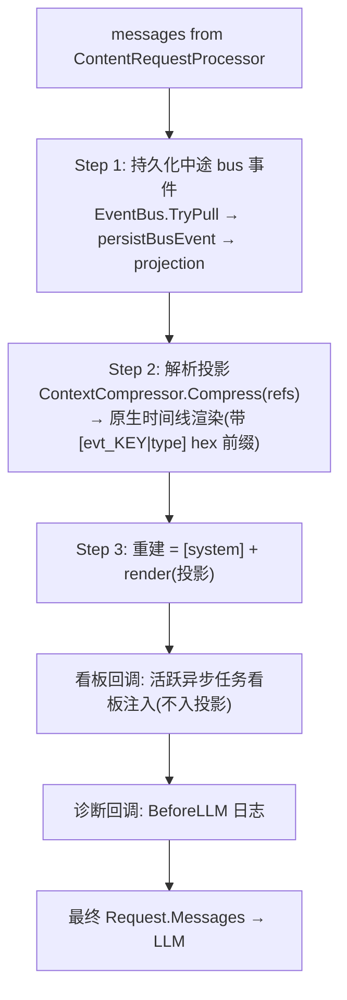
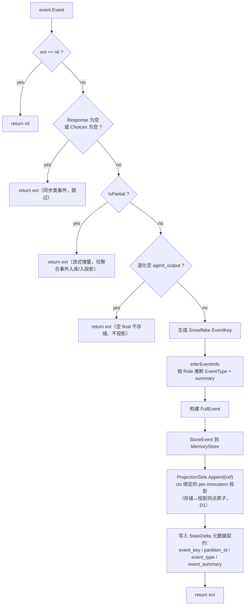
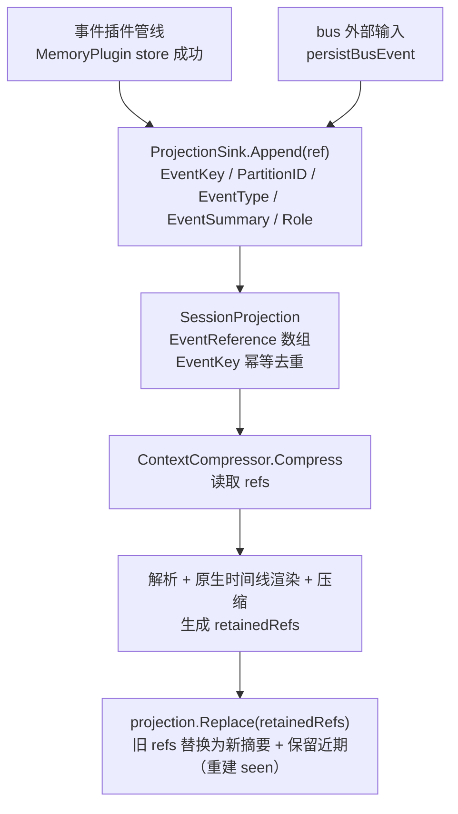
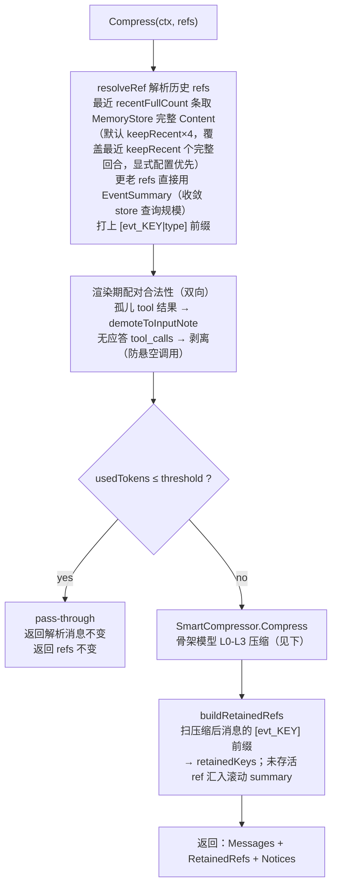
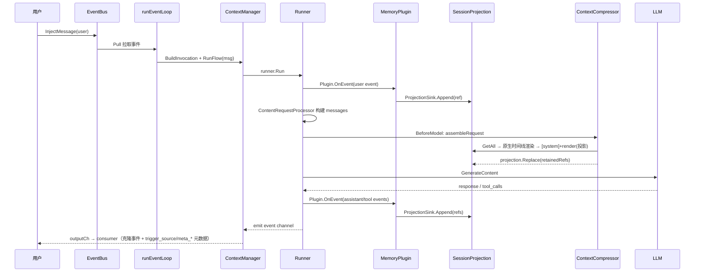

# 事件流与上下文压缩机制

> 本文档用 Mermaid 图说明 tagent 事件驱动的完整流转：从外部消息进入、经 Runner 处理、MemoryPlugin 持久化、SessionProjection 维护、到 BeforeModel 回调链（ContextCompressor 统一压缩）最终调用 LLM 的全过程。

## 一、整体事件流

> **task_settled 回收 turn**：长命令 / 子 agent 经**任务层**异步执行，后台结算时 `TaskManager` 发一条自包含的 `task_settled` 事件（复用 `external_input` 类型，`source=task`）到 EventBus，像外部输入一样触发一个回收 turn——循环空闲则唤醒、进行中则排队（不打断当前 turn）。详见 `agent-architecture.md` §2.10 任务层。

## 二、Runner 内部流转

## 三、BeforeModel 回调链

当前实现将上下文重建收敛为**一个统一的 BeforeModel 装配回调**（另有任务看板注入与诊断日志回调）。投影是**唯一装配源**（unified-event-projection D2）：除 system 消息外，不读取框架 `Request.Messages` 的任何内容。

**无读回、无当前轮抽取**：所有事件（驱动请求、ReAct 内部的 assistant/tool 步骤、final）均在事件插件管线内同步写入投影（见 §四），框架对工具结果事件的 completion-wait 保证下一次 BeforeModel 时投影必已完整（构造保证，非时序碰巧）。旧版的 `extractCurrentTurnMessages`/`filterUser` 读回启发式已删除。

**原生时间线渲染（D3 v2）**：回合内同步工具交互以原生协议形态呈现——thinking_plan 渲染为 assistant 消息并携带原生 ToolCalls（content 纯散文，系统永不生成文本调用语法，因为任何文本调用语法都会被模型模仿产生伪调用），action_command 渲染为 role=tool 并以 ToolID 与前序调用配对。配对合法性在渲染期单点**双向**保障：无法配对的结果（id 丢失、其调用被压缩掉）降级为 user 侧输入注记（`demoteToInputNote`，内容与关联 id 保留）；反向地，结果不在渲染序列中的 assistant tool_calls 被剥离（骨架模型下 L1 常态丢弃 `action_command`，无此规则会每轮发出悬空调用）。因此压缩任意切窗仍产生合法原生序列。跨回合异步结果（task_settled 等）始终是通知类 input 事件，靠 task id 文本关联。EventKey 的字符串形态统一为 16 进制（`FormatEventKey/ParseEventKey`）。

## 四、事件插件管线：存储 + 投影同点原子（含 nil-Response / partial 过滤）

> 投影写入位于插件管线（而非消费 goroutine）：框架对工具结果事件的 completion-wait 覆盖插件处理，使“BeforeModel 时投影完整”成为构造保证。RunFlow 用 `plugin.WithProjectionSink` 把当前 invocation 的投影绑到 ctx，主循环与子 agent 天然隔离。

## 五、SessionProjection 生命周期

## 六、ContextCompressor 统一压缩

> 关键点：历史消息（`resolveRef` 解析得到）带 `[evt_KEY|type]` 前缀，压缩产物中被保留的消息**原样携带前缀**，`buildRetainedRefs` 据此判断哪些投影 ref 被压缩、哪些被保留，最后调用 `projection.Replace(retainedRefs)` 一次原子替换。

### 6.1 骨架段模型（task-skeleton-compression）

压缩的组织单元是**以 `agent_output` 为界的完整任务回合**（不再以 user 消息切段）：

- **段 = 一次任务回合** `[external_input, (thinking_plan|action_command)*, agent_output]`，由最终回复闭合（`SegmentMessages`）。识别优先经 `[evt_KEY|type]` 前缀（`ParseEventKeyAndType`），缺前缀时退回启发式（assistant 且无 tool_calls）。
- **连续 `external_input`**（用户连发、agent 未回）归入同一进行中段；无 `agent_output` 的尾部为**进行中段**（`IsComplete=false`），永不压缩。
- **段内二分**为事件类型纯函数（`IsSkeletonMessage`，不读内容）：骨架 = `external_input` + `agent_output`；中间事件 = `action_command` / `thinking_plan`。
- 骨架管线为唯一压缩路径（定级/丢弃纯工程）；旧 user 切段 legacy 管线已移除（context-efficiency-and-trajectory）。LLM 文摘恰有两处低频叠加：L3 滚动综述 `synthesizeRollingNarrative`（可选，失败降级）与卡片浓缩 `condenseCardLines`。

### 6.2 定级：agent_output 段龄纯函数（deterministicLevel）

`age = totalSegs - 1 - segIdx`（0 = 最新段），`keepRecent` 默认 2；`HasUserInput` 判据已废弃：

| 级别 | 触发 | 段内保留 | 段内丢弃 |
|------|------|---------|---------|
| L0 | 进行中段 或 `age < keepRecent` | 全部消息 | 无 |
| L1 | `age < keepRecent*2` | 骨架 + `thinking_plan` | `action_command`（tool 先丢） |
| L2 | `age < keepRecent*3` | 仅骨架 | `action_command` + `thinking_plan` |
| L3 | 更老 或 预算仍不足 | （整段移出时间线） | 全段 → 滚动 summary |

丢弃序 `tool > assistant`：工具结果体积最大、复用价值最低，先丢；`thinking_plan` 承载推理脉络，后丢。预算不足时先把老段压到 L2（骨架），仍超再按最老优先逐段 L3。预算升级为 O(n)：预计算每段四级成本 `cost[i][0..3]`（4n 次 Estimate）后，升级步骤仅做 O(1) 增量更新，不重算全量时间线。

### 6.3 多段压缩归档出口（L3）

L3 段**整段不进入压缩产物**——其 event key 不出现在输出中，由 `buildRetainedRefs` 自然收编进滚动 summaryRef：`extractCardLine` 为骨架事件（`external_input`/`agent_output`）生成带 `[hex]` 召回票据的卡片行。这条路径**零 LLM 可走通**（无摘要模型时 `curateCards` 沉底计数兜底，不失败不降级），为 `external_input` ref 打通归档出口——段数随轮次收敛，解开旧模型"每段含 user → 恒 L2 → L3 死代码 → 段数单调膨胀"的死锁（生产实证 `L2: 12→61`）。

## 七、一次完整请求的端到端时序

> 无 bus echo：final 响应仅经 outputCh 投递，循环靠 `Pull` 阻塞等待下一个外部/任务事件（unified-event-projection D5）。

## 八、压缩前后投影变化示例

| 阶段 | SessionProjection 内容 |
|------|----------------------|
| 压缩前 | `[ref1(user), ref2(tool), ref3(asst_out), ref4(user), ref5(tool), ref6(asst_out), ref7(user), ref8(tool), ref9(asst_out)]`（3 个 agent_output 界定的回合段） |
| KeepRecent=1，老段 L3 多段压缩 | `[summaryRef(context_compress), ref7(user), ref8(tool), ref9(asst_out)]` |
| 注入前缀后 LLM 看到 | `[evt_summary\|context_compress]...`、`[evt_7\|external_input]`、`[evt_8\|action_command]`、`[evt_9\|agent_output]` |

> 旧事件被吸收进**滚动** summary ref（形如 `[Compacted N] + 卡片行序列 + recent keys`，跨轮计数累计、卡片继承，永不静默丢历史）；卡片行里的 hex key 即召回票据，LLM 可通过 `recall(items=[{key}])` 精确回补原文，或 `recall(orchestrate=true)` 请求 LLM 多跳编排。

---

## 已知缺口

事件流层面的缺口（收尾轮、单 session 循环、handoff schema）统一声明于 [agent-architecture.md](agent-architecture.md) 末章「已知缺口与演进方向」。
