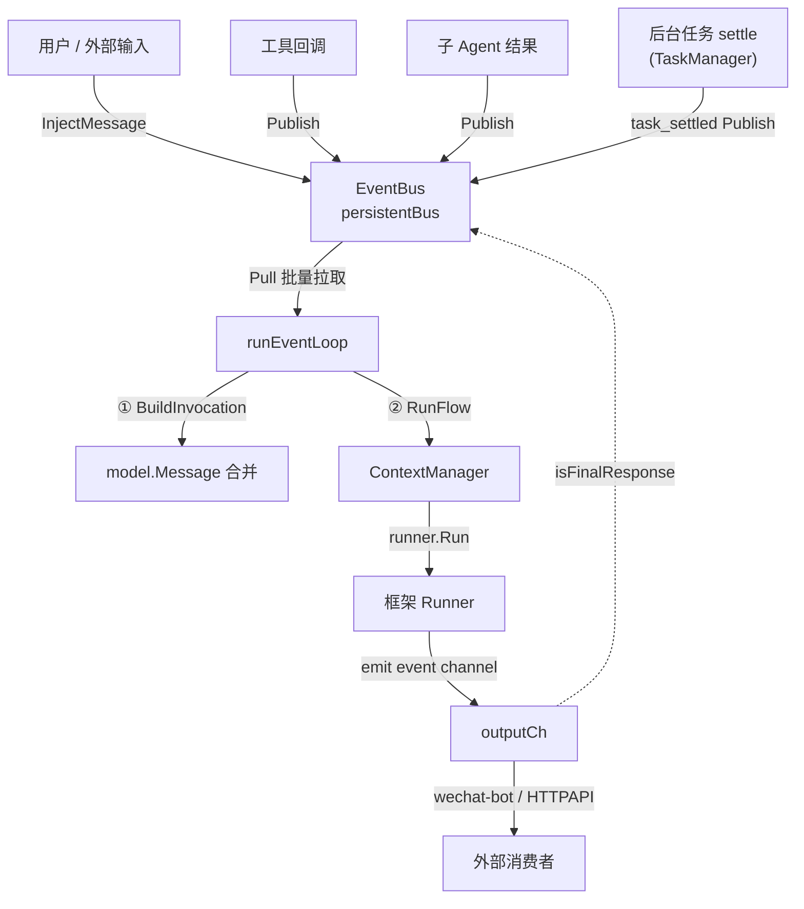
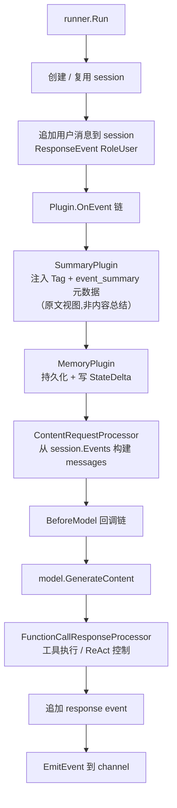
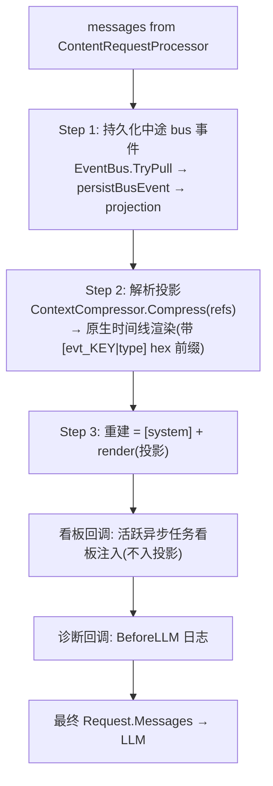
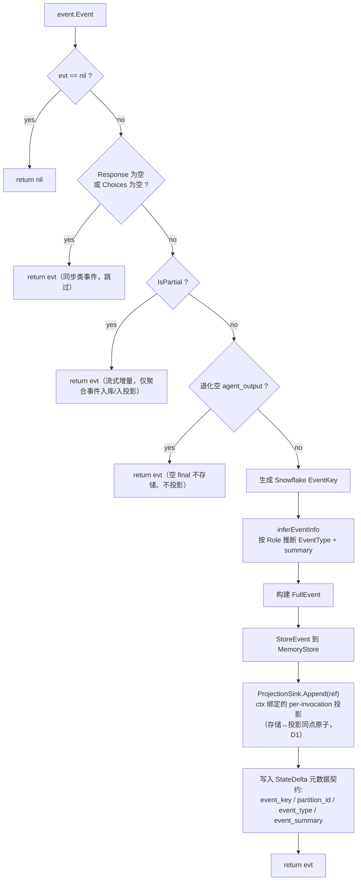
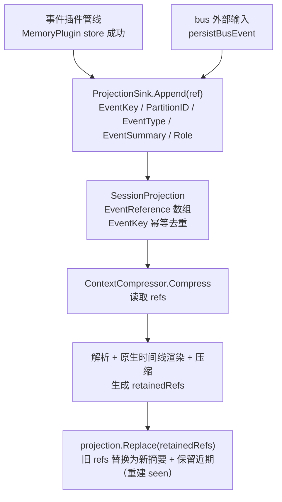
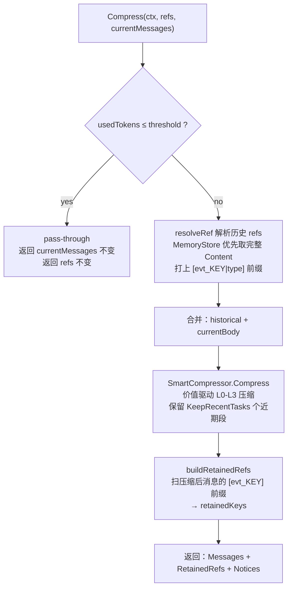
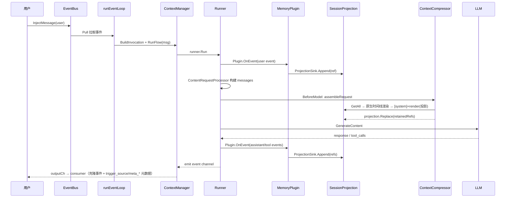

# 事件流与上下文压缩机制

> 本文档用 Mermaid 图说明 tagent 事件驱动的完整流转：从外部消息进入、经 Runner 处理、MemoryPlugin 持久化、SessionProjection 维护、到 BeforeModel 回调链（ContextCompressor 统一压缩）最终调用 LLM 的全过程。

## 一、整体事件流

> **task_settled 回收 turn**：长命令 / 子 agent 经**任务层**异步执行，后台结算时 `TaskManager` 发一条自包含的 `task_settled` 事件（复用 `external_input` 类型，`source=task`）到 EventBus，像外部输入一样触发一个回收 turn——循环空闲则唤醒、进行中则排队（不打断当前 turn）。详见 `agent-architecture.md` §2.10 任务层。

## 二、Runner 内部流转

## 三、BeforeModel 回调链

当前实现将上下文重建收敛为**一个统一的 BeforeModel 装配回调**（另有任务看板注入与诊断日志回调）。投影是**唯一装配源**（unified-event-projection D2）：除 system 消息外，不读取框架 `Request.Messages` 的任何内容。

**无读回、无当前轮抽取**：所有事件（驱动请求、ReAct 内部的 assistant/tool 步骤、final）均在事件插件管线内同步写入投影（见 §四），框架对工具结果事件的 completion-wait 保证下一次 BeforeModel 时投影必已完整（构造保证，非时序碰巧）。旧版的 `extractCurrentTurnMessages`/`filterUser` 读回启发式已删除。

**原生时间线渲染（D3 v2）**：回合内同步工具交互以原生协议形态呈现——thinking_plan 渲染为 assistant 消息并携带原生 ToolCalls（content 纯散文，系统永不生成文本调用语法，因为任何文本调用语法都会被模型模仿产生伪调用），action_command 渲染为 role=tool 并以 ToolID 与前序调用配对。配对合法性在渲染期单点保障：无法配对的结果（id 丢失、其调用被压缩掉）降级为 user 侧输入注记（`demoteToInputNote`，内容与关联 id 保留），因此压缩任意切窗仍产生合法原生序列。跨回合异步结果（task_settled 等）始终是通知类 input 事件，靠 task id 文本关联。EventKey 的字符串形态统一为 16 进制（`FormatEventKey/ParseEventKey`）。

## 四、事件插件管线：存储 + 投影同点原子（含 nil-Response / partial 过滤）

> 投影写入位于插件管线（而非消费 goroutine）：框架对工具结果事件的 completion-wait 覆盖插件处理，使“BeforeModel 时投影完整”成为构造保证。RunFlow 用 `plugin.WithProjectionSink` 把当前 invocation 的投影绑到 ctx，主循环与子 agent 天然隔离。

## 五、SessionProjection 生命周期

## 六、ContextCompressor 统一压缩

> 关键点：历史消息（`resolveRef` 解析得到）和当前消息（`InjectEventKeys` 注入过前缀）都带 `[evt_KEY|type]`，`buildRetainedRefs` 据此判断哪些投影 ref 被压缩、哪些被保留，最后调用 `projection.Replace(retainedRefs)` 一次原子替换。

## 七、一次完整请求的端到端时序

> 无 bus echo：final 响应仅经 outputCh 投递，循环靠 `Pull` 阻塞等待下一个外部/任务事件（unified-event-projection D5）。

## 八、压缩前后投影变化示例

| 阶段 | SessionProjection 内容 |
|------|----------------------|
| 压缩前 | `[ref1(user), ref2(asst), ref3(tool), ref4(user), ref5(asst), ref6(tool), ref7(user), ref8(asst)]` |
| KeepRecent=2，L3 压缩旧段 | `[summaryRef(context_compress), ref5(asst), ref6(tool), ref7(user), ref8(asst)]` |
| 注入前缀后 LLM 看到 | `[evt_summary\|context_compress]...`、`[evt_5\|agent_output]`、`[evt_6\|action_command]`、`[evt_7\|external_input]`、`[evt_8\|agent_output]` |

> 旧事件被吸收进**滚动** summary ref（形如 `[Compacted N] + 卡片行序列 + recent keys`，跨轮计数累计、卡片继承，永不静默丢历史）；卡片行里的 hex key 即召回票据，LLM 可通过 `memory_recall(items=[{key}])` 精确回补原文，或 `recall` 子 agent 做多跳检索。

---

## 已知缺口

事件流层面的缺口（收尾轮、单 session 循环、handoff schema）统一声明于 [agent-architecture.md](agent-architecture.md) 末章「已知缺口与演进方向」。
