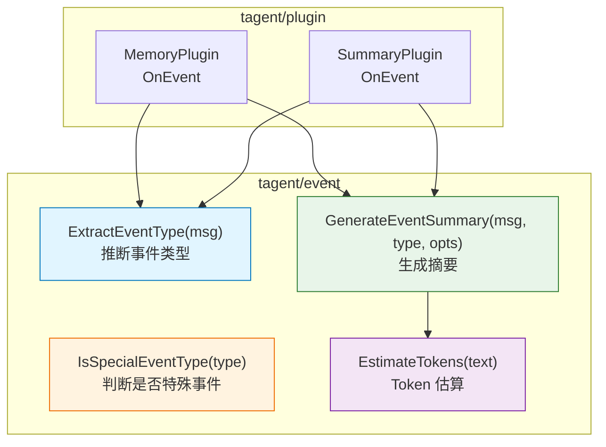
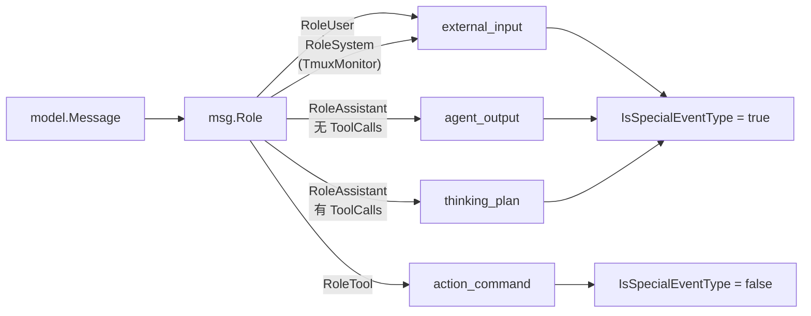
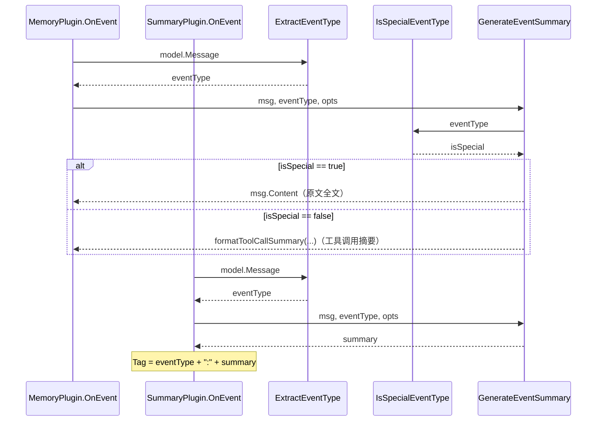

# tagent/event 模块架构文档

## 一、模块定位

`tagent/event` 是 tagent 的**事件类型与摘要工具**包，为 MemoryPlugin 和 SummaryPlugin 提供统一的事件分类和摘要生成能力。

**核心职责**：
- 定义 tagent 专属的事件类型常量（`external_input`、`agent_output` 等）
- 提供事件类型推断函数（`ExtractEventType`）
- 提供摘要生成函数（`GenerateEventSummary`），**严格禁止任何形式的截断**

**设计原则**：
- **严格拒绝非设计折损**：摘要是设计内的信息折损，截断是设计外的双重折损，会破坏压缩质量
- **统一 event type 分类**：所有非 agent_output / action_command 的角色统一归为 `external_input`
- **零外部依赖**：仅依赖 `trpc-agent-go/model`，不依赖框架其他模块

---

## 二、文件清单

| 文件 | 行数 | 职责 |
|------|------|------|
| `types.go` | 172 | 事件类型常量、类型推断、摘要生成、Token 估算 |

---

## 三、组件关系总览图



---

## 四、事件类型常量

### 4.1 完整常量列表

```go
// event/types.go:18-44
const (
    // 所有外部输入（用户消息、API 调用、系统注入消息）
    TypeExternalInput   = "external_input"

    // Agent 最终回复
    TypeAgentOutput     = "agent_output"

    // 工具/命令执行
    TypeActionCommand   = "action_command"

    // 规划相关
    TypeThinkingPlan    = "thinking_plan"

    // 记忆召回
    TypeThinkingRecall  = "thinking_recall"

    // 知识检索
    TypeThinkingKnowledge = "thinking_knowledge"

    // 上下文压缩
    TypeContextCompress = "context_compress"
)
```

### 4.2 类型分类逻辑



### 4.3 RoleSystem 的双重身份

| 场景 | Message.Role | 是否参与事件流 | EventType | 说明 |
|------|-------------|-------------|-----------|------|
| System Prompt | `RoleSystem` | **不参与** | — | 初始化时由 InstructionProcessor 注入，与事件流隔离 |
| TmuxMonitor 注入 | `RoleSystem` | **参与** | `external_input` | 通过 `Runner.Run()` 进入事件流 |

---

## 五、ExtractEventType — 类型推断

### 5.1 函数签名

```go
// event/types.go:52-70
func ExtractEventType(msg model.Message) string
```

### 5.2 推断规则

```go
func ExtractEventType(msg model.Message) string {
    switch msg.Role {
    case model.RoleUser:
        return TypeExternalInput
    case model.RoleAssistant:
        if len(msg.ToolCalls) > 0 {
            return TypeThinkingPlan
        }
        return TypeAgentOutput
    case model.RoleTool:
        return TypeActionCommand
    case model.RoleSystem:
        // 仅来自 TmuxMonitor 注入（进入事件流）
        return TypeExternalInput
    default:
        return TypeExternalInput
    }
}
```

### 5.3 推断规则表

| msg.Role | ToolCalls | EventType | 说明 |
|----------|-----------|-----------|------|
| `RoleUser` | — | `external_input` | 用户输入 |
| `RoleSystem` | — | `external_input` | TmuxMonitor 注入 |
| `RoleAssistant` | `len > 0` | `thinking_plan` | Agent 思考/计划（带工具调用） |
| `RoleAssistant` | `len == 0` | `agent_output` | Agent 最终回复 |
| `RoleTool` | — | `action_command` | 工具执行结果 |
| 其他 | — | `external_input` | Fallback |

---

## 六、IsSpecialEventType — 特殊事件判断

### 6.1 函数签名

```go
// event/types.go:75-82
func IsSpecialEventType(eventType string) bool
```

### 6.2 特殊事件 vs 普通事件

| 事件类型 | IsSpecialEventType | 摘要策略 | 原因 |
|---------|-------------------|---------|------|
| `external_input` | **true** | 原文全文 | 用户意图需完整保留 |
| `agent_output` | **true** | 原文全文 | Agent 回复需完整保留 |
| `thinking_plan` | **true** | 原文全文 | Agent 思考过程含工具调用决策 |
| `action_command` | false | 工具调用摘要 | 工具调用信息密度高 |
| `thinking_recall` | false | 原文全文 | 记忆召回内容需完整 |
| `thinking_knowledge` | false | 原文全文 | 知识检索内容需完整 |
| `context_compress` | false | 原文全文 | 压缩通知内容需完整 |
| 其他 | false | 原文全文 | Fallback |

**核心原则**：`thinking_plan` 和 `external_input`/`agent_output` 一样使用原文全文摘要策略，`action_command` 使用工具调用摘要。

---

## 七、GenerateEventSummary — 摘要生成

### 7.1 函数签名

```go
// event/types.go:113-126
func GenerateEventSummary(msg model.Message, eventType string, opts EventSummaryOptions) string
```

### 7.2 摘要策略

```go
func GenerateEventSummary(msg model.Message, eventType string, opts EventSummaryOptions) string {
    // 特殊事件：摘要 = 原文全文（无截断）
    if IsSpecialEventType(eventType) {
        return msg.Content
    }

    // 普通事件：action_command 使用工具调用摘要
    switch eventType {
    case TypeActionCommand:
        return formatToolCallSummary(msg, opts)
    default:
        return msg.Content
    }
}
```

### 7.3 formatToolCallSummary — 工具调用摘要

```go
// event/types.go:155-171
func formatToolCallSummary(msg model.Message, opts EventSummaryOptions) string {
    if len(msg.ToolCalls) == 0 {
        if msg.Role == model.RoleTool {
            return msg.Content  // Tool 结果用原文
        }
        return "命令执行"
    }

    toolName := msg.ToolCalls[0].Function.Name
    args := string(msg.ToolCalls[0].Function.Arguments)

    if opts.StructuredFormat {
        return fmt.Sprintf("调用工具: %s\n  参数: %s", toolName, args)
    }
    return fmt.Sprintf("调用工具: %s(%s)", toolName, args)
}
```

**输出示例**：

```
# StructuredFormat = false（单行，节省 token）
调用工具: echo(hello world)

# StructuredFormat = true（多行，清晰）
调用工具: echo
  参数: hello world
```

### 7.4 EventSummaryOptions — 配置项

```go
// event/types.go:88-91
type EventSummaryOptions struct {
    StructuredFormat bool  // true: 多行格式; false: 单行格式（节省 token）
}
```

**预设配置**：

| 工厂函数 | StructuredFormat | 适用场景 | 调用方 |
|---------|-----------------|---------|-------|
| `DefaultOptionsForLLMContext()` | false | LLM 消息上下文（高频调用） | SummaryPlugin |
| `DefaultOptionsForCompression()` | true | SmartCompress 压缩（低频调用） | agent/SmartCompressor |

---

## 八、严格拒绝非设计折损

### 8.1 截断已被完全移除

以下内容已在重构中删除（`types.go`）：

```
已删除的代码：
  - DefaultMaxContentLength = 500      （截断阈值）
  - DefaultMaxArgsLength = 200           （参数截断阈值）
  - MaxContentLength int                 （EventSummaryOptions 字段）
  - MaxArgsLength int                   （EventSummaryOptions 字段）
  - formatContent() 函数                 （截断实现）
```

### 8.2 设计折损 vs 非设计折损

| 类别 | 示例 | 是否允许 |
|------|------|---------|
| **设计内折损** | EventSummary 生成时从完整内容到摘要 | 允许（压缩质量由 SmartCompress 保证） |
| **设计内折损** | SmartCompress Stage 2 LLM 生成摘要 | 允许（两阶段机制保真） |
| **设计外折损** | 截断超出限制的文本 | **禁止**（双重折损，破坏压缩质量） |
| **设计外折损** | MaxArgsLength 截断工具参数 | **禁止**（参数信息丢失） |

### 8.3 溢出处理路径

```
内容超限
    ↓
ContextIntervention.BeforeModel 检测到 Token 超阈值
    ↓
SmartCompress.Compress 触发压缩
    ↓
Stage 1: 按 task boundary 切分，丢弃旧 segment
Stage 2: LLM 生成摘要（"对话历史摘要: ...")
    ↓
压缩后的消息列表重新发给 LLM
    ↓
Token 消耗降低 ✅
```

---

## 九、辅助函数

### 9.1 FormatEventDescription

为 SmartCompress 生成结构化的事件描述（完整信息，不截断）：

```go
// event/types.go:128-147
func FormatEventDescription(index int, msg model.Message) string

// 输出示例：
// [0] user: 你好
//   → ToolCalls:
//     - echo(hello)
// [1] assistant: 好的
```

### 9.2 EstimateTokens

简单的 Token 估算（启发式，约每 3 个字符 1 个 token）：

```go
// event/types.go:149-153
func EstimateTokens(text string) int {
    return len([]rune(text)) / 3
}
```

**注意**：这是估算，不是精确计算（中英文混合场景约每 2.5~4 个字符 1 个 token）。`agent/token_counter.go` 中有更精确的实现。

---

## 十、与其他模块的关系

### 10.1 依赖关系

```
tagent/event（基础工具层）
    ↑
    │  提供类型推断和摘要生成
    │
tagent/plugin
    ├── MemoryPlugin.OnEvent → ExtractEventType + GenerateEventSummary
    └── SummaryPlugin.OnEvent → ExtractEventType + GenerateEventSummary

tagent/agent
    └── SmartCompress → FormatEventDescription + EstimateTokens
```

### 10.2 数据流



### 10.3 信息隔离

`tagent/event` 是纯工具层，**不持有任何状态**。所有函数都是纯函数（给定相同输入，总是产生相同输出），可并发安全调用。
