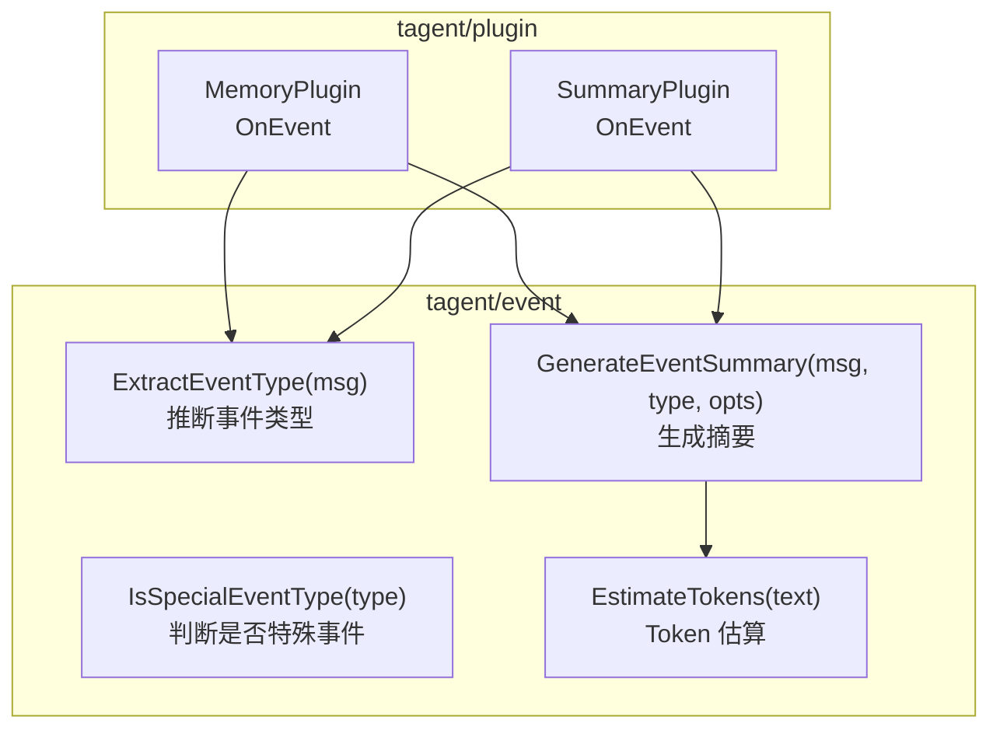
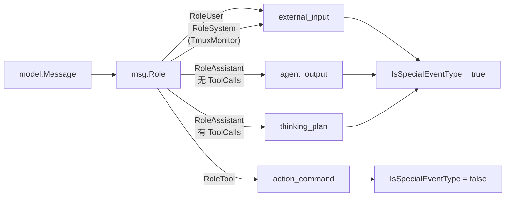
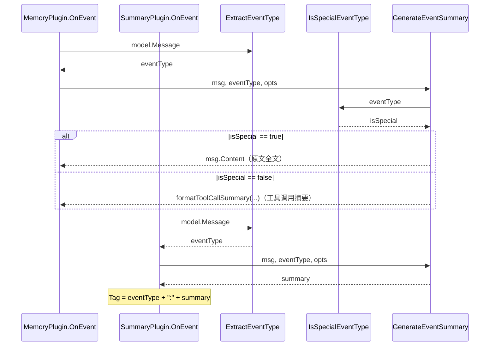

# tagent/event 模块架构文档

<a id="overview"></a>
## 一、模块定位

`tagent/event` 是 tagent 的**事件类型与元数据契约**包，为 `MemoryPlugin` 和 `SummaryPlugin` 提供统一的事件分类、`event_summary` 视图生成与事件元数据单点保障。

**核心职责**：
- 定义 tagent 专属的事件类型常量（`external_input`、`agent_output` 等）
- 提供事件类型推断函数（`ExtractEventType`）
- 提供 `event_summary` 元数据视图生成（`GenerateEventSummary`，**原文视图非内容总结**），**严格禁止任何形式的截断**
- **元数据契约单点保障**（`metadata.go`）：`MetaKey*` 常量唯一定义、`ParseEventMeta` 统一解析、EventKey 的 16 进制字符串形态（`FormatEventKey/ParseEventKey`）

**设计原则**：
- **严格拒绝非设计折损**：内容级总结收归压缩固化时刻（素材律）；截断是设计外双重折损，会破坏压缩质量
- **统一 event type 分类**：所有非 `agent_output` / `action_command` 的角色统一归为 `external_input`
- **零外部依赖**：仅依赖 `trpc-agent-go`，不依赖框架其他模块

---

## 二、文件清单

| 文件 | 职责 |
|------|------|
| `types.go` | 事件类型常量的内置族集中声明处（`inbox_receipt` 与 `wf.*` 各在自身文件声明并自注册）、类型推断（委托注册表 spec）、event_summary 视图、Token 估算 |
| `metadata.go` | 元数据契约：`MetaKey*` 常量（含归因键 agent_name/bundle_id/rollout_id/trace_id/span_id 与 governance subtype 单源常量）、`ParseEventMeta`、`FormatEventKey/ParseEventKey`（hex 单点）、`meta_*` 业务元数据前缀、trigger_source |
| `registry.go` | EventTypeSpec 注册表：类型元数据唯一权威源（Name/Role/Special/Skeleton/LowValue/TTLDays/Embeddable/Recallable 等），既有函数/变量委托派生 |
| `timeline.go` | 时间线前缀契约：`FormatEventPrefix/ParseEventKeyAndType/HasEventPrefix/StripEventKeyPrefix`（`[evt_KEY\|type]` 读写同点） |

---

## 三、组件关系总览图


```mermaid
graph TB
    subgraph "tagent/event"
        ET["ExtractEventType(msg)\n推断事件类型"]
        IS["IsSpecialEventType(type)\n判断是否特殊事件"]
        GS["GenerateEventSummary(msg, type, opts)\n生成摘要"]
        TC["EstimateTokens(text)\nToken 估算"]
    end

    subgraph "tagent/plugin"
        MP["MemoryPlugin\nOnEvent"]
        SP["SummaryPlugin\nOnEvent"]
    end

    MP --> ET
    MP --> GS
    SP --> ET
    SP --> GS

    GS --> TC
```

---

## 四、事件类型常量

<a id="const-list"></a>
### 4.1 类型的声明处与本页的职责

事件类型的**名目、取值与静态属性都不在本页维护**。文档面一旦复制常量的声明形态，就再造出一份读起来像权威的列表，而新增类型必然漏项：`event/wf_facts.go` 的 `wf.*` 家族与 `event/inbox_receipt.go` 的回执类型都不在 `event/types.go`，任何"照抄一个文件"的做法都会漏掉它们。本页承担的是类型之间的关系与机制。

| 想知道 | 唯一真源 |
|---|---|
| 有哪些事件类型、字符串取值 | `event/types.go` 的内置族常量、`event/wf_facts.go` 的 `wf.*` 家族、`event/inbox_receipt.go` 的回执类型；三处都在各自文件 `init()` 自注册 |
| 每类型的渲染角色、是否原文优先、摘要形态、是否压缩骨架、是否低价值、TTL、是否合成投影引用（负 key）、是否嵌入、是否可召回、是否进投影 | `EventTypeSpec` 注册表，见 12.1 |
| 每个类型**为什么单独存在**、与哪个相邻类型必须区分 | 见 12.7；`wf.*` 与 `inbox_receipt` 的保留约束见 12.4 |
| 正负 key 的票据形状、回补原文的路径 | 见 12.3 的时间线前缀契约与 12.1 的 `Recallable` 行 |

按消息角色推断类型属于本页，见 4.2 与 4.3；新增一个类型**不需要改本页**——注册一条 `EventTypeSpec` 即全链路生效（12.1）。

一条既不属于推断规则、也不属于注册表字段的事实须在文档面固定：`external_input` 收纳一切"非 Agent 回复、非工具结果"的输入——用户消息、宿主 API 注入、系统状态通知，以及后台任务结算通知。**结算通知靠 `[task settled]` 文本前缀识别**（`agent/compress` 的 `settleNoticePrefix`），它不是事件类型名；连续结算通知折叠成票据卡片的规则见 12.7 的 `settle_fold` 行。

### 4.2 类型分类逻辑


```mermaid
graph LR
    msg["model.Message"] --> role["msg.Role"]

    role -->|"RoleUser"| ext["external_input"]
    role -->|"RoleSystem\n(TmuxMonitor)"| ext
    role -->|"RoleAssistant\n无 ToolCalls"| ao["agent_output"]
    role -->|"RoleAssistant\n有 ToolCalls"| tp["thinking_plan"]
    role -->|"RoleTool"| ac["action_command"]

    ext --> special["IsSpecialEventType = true"]
    ao --> special
    tp --> special
    ac --> notspecial["IsSpecialEventType = false"]
```

### 4.3 RoleSystem 的双重身份

| 场景 | Message.Role | 是否参与事件流 | EventType | 说明 |
|------|-------------|-------------|-----------|------|
| System Prompt | `RoleSystem` | **不参与** | — | 初始化时由 InstructionProcessor 注入，与事件流隔离 |
| TmuxMonitor 注入 | `RoleSystem` | **参与** | `external_input` | 通过 `TagentAgent.InjectMessage` 进入 EventBus，分类为 `external_input` |

---

## 五、ExtractEventType — 类型推断

### 5.1 函数签名

```go
// event/types.go
func ExtractEventType(msg model.Message) string
```

### 5.2 推断规则

```go
func ExtractEventType(msg model.Message) string {
    switch msg.Role {
    case model.RoleUser:
        return TypeExternalInput
    case model.RoleAssistant:
        if len(msg.ToolCalls) > 0 {
            return TypeThinkingPlan
        }
        return TypeAgentOutput
    case model.RoleTool:
        return TypeActionCommand
    case model.RoleSystem:
        // 仅来自 TmuxMonitor 注入（进入事件流）
        return TypeExternalInput
    default:
        return TypeExternalInput
    }
}
```

### 5.3 推断规则表

| msg.Role | ToolCalls | EventType | 说明 |
|----------|-----------|-----------|------|
| `RoleUser` | — | `external_input` | 用户输入 |
| `RoleSystem` | — | `external_input` | TmuxMonitor 注入 |
| `RoleAssistant` | `len > 0` | `thinking_plan` | Agent 思考/计划（带工具调用） |
| `RoleAssistant` | `len == 0` | `agent_output` | Agent 最终回复 |
| `RoleTool` | — | `action_command` | 工具执行结果 |
| 其他 | — | `external_input` | Fallback |

---

## 六、IsSpecialEventType — 特殊事件判断

### 6.1 函数签名

```go
// event/types.go
func IsSpecialEventType(eventType string) bool
```

### 6.2 特殊事件 vs 普通事件

| 事件类型 | IsSpecialEventType | 摘要策略 | 原因 |
|---------|-------------------|---------|------|
| `external_input` | **true** | 原文全文 | 用户意图需完整保留 |
| `agent_output` | **true** | 原文全文 | Agent 回复需完整保留 |
| `thinking_plan` | **true** | 原文全文 | Agent 思考过程含工具调用决策 |
| `action_command` | false | 工具调用摘要 | 工具调用信息密度高 |
| `thinking_recall` | false | 原文全文 | 记忆召回内容需完整 |
| `thinking_knowledge` | false | 原文全文 | 知识检索内容需完整 |
| `context_compress` | false | 原文全文 | 压缩通知内容需完整 |
| 其他 | false | 原文全文 | Fallback |

**核心原则**：`thinking_plan` 和 `external_input`/`agent_output` 一样使用原文全文摘要策略，`action_command` 使用工具调用摘要。

---

## 七、GenerateEventSummary — event_summary 元数据视图

> **退位语义（unified-memory-curation）**：尽管函数名含 "Summary"，它**不是内容总结**——多数事件类型下它就是原文，action_command 下是机械化的工具调用行。它用于展示与 recall 列表；内容级总结只在压缩固化时刻发生（骨架模型下：多段压缩 → 卡片行工程化提取，超限时 `curateCards` LLM 浓缩；legacy 路径保留 L3 → 段摘要 → 卡片行，素材律）。

### 7.1 函数签名

```go
// event/types.go
func GenerateEventSummary(msg model.Message, eventType string, opts EventSummaryOptions) string
```

### 7.2 摘要策略

```go
func GenerateEventSummary(msg model.Message, eventType string, opts EventSummaryOptions) string {
    // 委托注册表 spec（event/registry.go 单点声明类型元数据）
    spec := specOrDefault(eventType)

    // 纯工具调用 thinking_plan（无 Content 有 ToolCalls）：摘要 = 「调用 name1、name2」
    if msg.Content == "" && len(msg.ToolCalls) > 0 {
        return formatToolNames(msg.ToolCalls)
    }

    // 特殊事件（spec.Special）：摘要 = 原文全文（无截断）
    if spec.Special {
        return msg.Content
    }

    // 普通事件：action_command 使用工具调用摘要（含 Tool 结果 JSON 关键字段提取）
    switch eventType {
    case TypeActionCommand:
        return formatToolCallSummary(msg, opts)  // 内含 summarizeToolResult（status/session/count/error 等关键字段）
    default:
        return spec.ToolLineSummary(msg)  // 未配置则原文
    }
}
```

> 类型的名目与数量以码面声明为唯一真源（归属见 4.1），本页不复述计数。注意：退化上报不是独立类型——是 governance 事件的 subtype=`degraded`。类型元数据（TTL/角色/骨架/可嵌入/可召回）唯一权威源见 `registry.go` EventTypeSpec：`IsSpecialEventType`/`IsSkeletonMessage`/`GenerateEventSummary` 及 memory 的 `LowValueEventTypes`、lifecycle `TypeTTL` 默认均委托/派生（「加一个类型只改注册表一处即全链路生效」）。归因双路径：插件管线经 `plugin.WithAttribution` 注 rollout_id/trace_id/span_id；persistBusEvent 盖 agent_name/trigger_source/rollout_id、不注 turn 锚=设计边界。

### 7.3 formatToolCallSummary — 工具调用摘要

```go
// event/types.go
func formatToolCallSummary(msg model.Message, opts EventSummaryOptions) string {
    if len(msg.ToolCalls) == 0 {
        if msg.Role == model.RoleTool {
            return msg.Content  // Tool 结果用原文
        }
        return "命令执行"
    }

    toolName := msg.ToolCalls[0].Function.Name
    args := string(msg.ToolCalls[0].Function.Arguments)

    if opts.StructuredFormat {
        return fmt.Sprintf("调用工具: %s\n  参数: %s", toolName, args)
    }
    return fmt.Sprintf("调用工具: %s(%s)", toolName, args)
}
```

**输出示例**：

```
# StructuredFormat = false（单行，节省 token）
调用工具: echo(hello world)

# StructuredFormat = true（多行，清晰）
调用工具: echo
  参数: hello world
```

### 7.4 EventSummaryOptions — 配置项

```go
// event/types.go
type EventSummaryOptions struct {
    StructuredFormat bool  // true: 多行格式; false: 单行格式（节省 token）
}
```

**预设配置**：

| 工厂函数 | StructuredFormat | 适用场景 | 调用方 |
|---------|-----------------|---------|-------|
| `DefaultOptionsForLLMContext()` | false | LLM 消息上下文（高频调用） | SummaryPlugin |
| `DefaultOptionsForCompression()` | true | SmartCompress 压缩（低频调用） | agent/SmartCompressor |

---

## 八、严格拒绝非设计折损

### 8.1 截断已被完全移除

以下内容已在重构中删除（`types.go`）：

```
已删除的代码：
  - DefaultMaxContentLength = 500      （截断阈值）
  - DefaultMaxArgsLength = 200           （参数截断阈值）
  - MaxContentLength int                 （EventSummaryOptions 字段）
  - MaxArgsLength int                   （EventSummaryOptions 字段）
  - formatContent() 函数                 （截断实现）
```

### 8.2 设计折损 vs 非设计折损

| 类别 | 示例 | 是否允许 |
|------|------|---------|
| **设计内折损** | EventSummary 生成时从完整内容到摘要 | 允许（压缩质量由 SmartCompress 保证） |
| **设计内折损** | SmartCompress Stage 2 LLM 生成摘要 | 允许（两阶段机制保真） |
| **设计外折损** | 截断超出限制的文本 | **禁止**（双重折损，破坏压缩质量） |
| **设计外折损** | MaxArgsLength 截断工具参数 | **禁止**（参数信息丢失） |

### 8.3 溢出处理路径

```
内容超限
    ↓
ContextManager BeforeModel 检测到 Token 超阈值
    ↓
SmartCompress.Compress 触发压缩
    ↓
Stage 1: 按 task boundary 切分，丢弃旧 segment
Stage 2: LLM 生成摘要（"对话历史摘要: ...")
    ↓
压缩后的消息列表重新发给 LLM
    ↓
Token 消耗降低 ✅
```

---

## 九、辅助函数

### 9.1 FormatEventDescription

为 SmartCompress 生成结构化的事件描述（完整信息，不截断）：

```go
// event/types.go
func FormatEventDescription(index int, msg model.Message) string

// 输出示例：
// [0] user: 你好
//   → ToolCalls:
//     - echo(hello)
// [1] assistant: 好的
```

### 9.2 EstimateTokens

简单的 Token 估算（启发式，约每 3 个字符 1 个 token）：

```go
// event/types.go
func EstimateTokens(text string) int {
    return len([]rune(text)) / 3
}
```

**注意**：这是估算，不是精确计算（中英文混合场景约每 2.5~4 个字符 1 个 token）。`agent/context_manager.go` 中的 `DefaultTokenCounter` 使用 `CharsPerToken = 2.0`，是更保守的估算。

---

## 十、与其他模块的关系

### 10.1 依赖关系

```
tagent/event（基础工具层）
    ↑
    │  提供类型推断和摘要生成
    │
tagent/plugin
    ├── MemoryPlugin.OnEvent → ExtractEventType + GenerateEventSummary
    └── SummaryPlugin.OnEvent → ExtractEventType + GenerateEventSummary

tagent/agent
    └── SmartCompress → FormatEventDescription + EstimateTokens
```

### 10.2 数据流


```mermaid
sequenceDiagram
    participant MP as MemoryPlugin.OnEvent
    participant SP as SummaryPlugin.OnEvent
    participant ET as ExtractEventType
    participant IS as IsSpecialEventType
    participant GS as GenerateEventSummary

    MP->>ET: model.Message
    ET-->>MP: eventType
    MP->>GS: msg, eventType, opts
    GS->>IS: eventType
    IS-->>GS: isSpecial
    alt isSpecial == true
        GS-->>MP: msg.Content（原文全文）
    else isSpecial == false
        GS-->>MP: formatToolCallSummary(...)（工具调用摘要）
    end

    SP->>ET: model.Message
    ET-->>SP: eventType
    SP->>GS: msg, eventType, opts
    GS-->>SP: summary
    Note over SP: Tag = eventType + ":" + summary
```

### 10.3 信息隔离

`tagent/event` 是纯工具层，**不持有任何状态**。所有函数都是纯函数（给定相同输入，总是产生相同输出），可并发安全调用。

---

## 十一、EventBus 与 AgentEvent（事件驱动架构）

在事件驱动架构中，`tagent/agent` 包新增了 `EventBus` 和 `AgentEvent` 类型（定义在 `agent/event_bus.go`），与 `tagent/event` 包的事件类型常量配合使用。

### 11.1 AgentEvent 结构

```go
type AgentEvent struct {
    ID        string           `json:"id"`                  // UUID 唯一标识
    Type      string           `json:"type"`                // "external_input" | "tool_use"
    Source    string           `json:"source"`              // "user" | "tmux" | "meditation" | "subagent" | "agent_loop" | "inject"
    Timestamp time.Time        `json:"timestamp"`
    Message   *model.Message   `json:"message,omitempty"`   // external_input 载荷
    ToolCall  *model.ToolCall  `json:"tool_call,omitempty"` // tool_use 载荷
    Metadata  map[string]any   `json:"metadata,omitempty"`  // 扩展数据（含 Origin trace 锚回填）
}
```

### 11.2 事件流全貌

```
Producers                        EventBus                     Consumer
───────────                     ────────                     ────────
InjectMessage ──┐
TmuxMonitor ────┤
MeditationMgr ──┼──→ Publish ──→ [chan *AgentEvent] ──→ Pull ──→ runEventLoop
SubAgent result ┤    (cap=256)   (有序队列)              (batch drain)
Tool result ────┤
```

`runEventLoop` 是 EventBus 的**唯一消费者**。它批量拉取事件，调用 `ContextManager.BuildInvocation` 合并，再调用 `ContextManager.RunFlow` 执行框架 Flow。

### 11.3 事件类型与 Bus 触发器

| Bus 事件类型 | 进入 Bus 的生产者 | 在 runEventLoop 中的处理 |
|---------|------------|---------|
| `external_input` | InjectMessage、TmuxMonitor、MeditationManager、A2A Server、HTTPAPI | `BuildInvocation` 合并为一条 user message，触发 `RunFlow` |
| `agent_output`（不进 bus） | 直发 outputCh 投递（RunFlow 注释明示 no bus echo） | `BuildInvocation` 按 `Type != external_input` 过滤，无 Source 判断 |
| `tool_use` | 当前实现中**不实际产生**到 Bus | `BuildInvocation` 只处理 `TypeExternalInput`，tool_use 会被忽略 |

> **注意**：`TypeToolUse = "tool_use"` 的 Bus 触发器抽象无生产者也无消费者——`runEventLoop` 从不消费 `tool_use`，工具执行始终由框架 Runner 在 `RunFlow` 内部同步完成。该常量已作为死代码移除。上表 `tool_use` 行仅保留为"曾经的抽象、当前不产生"的诚实说明，不代表仍存在该事件类型。

### 11.4 onEvent 回调与 Session 投影维护

框架 Runner 在 `RunFlow` 执行期间产生事件流，通过 `onEvent` 回调追加到 `SessionProjection`：

```
RunFlow:
  eventCh := runner.Run(...)
  for fwEvt := range eventCh:
      onEvent(fwEvt)      → projection.Append(EventReference)
      outputCh <- fwEvt   → 对外输出
```

`TagentAgent.makeOnEventCallback` 是**纯投递侧回调**（meta_* 元数据透传 + meditation ★ 标记）。投影写入已统一到插件管线：MemoryPlugin 在 StoreEvent 成功的同一同步点经 ProjectionSink 追加 EventReference（写统一 D1）。

框架 Runner 已完成 `sessionService.AppendEvent` 和 `MemoryPlugin.OnEvent`（存储+投影双写）。tagent 的 `onEvent` 不重复持久化。

### 11.5 三层数据表示与流转

```
层1: EventBus AgentEvent (事件流, 临时)
    │
    ├── runEventLoop.Pull → BuildInvocation → RunFlow
    │
    └── RunFlow 内部：runner.Run 产生 event.Event 流
            │
            ├── onEvent → 追加 EventReference 到 SessionProjection ──→ 层2: SessionProjection (投影, 有界)
            │
            └── MemoryPlugin.OnEvent → StoreEvent ───────────────────→ 层3: MemoryStore FullEvent (不可变, TTL 遗忘)

层2 (SessionProjection) → BuildMessages → 按需从 MemoryStore 拉取完整 Content
                       → InjectEventKeys → [evt_KEY|type] 前缀注入
                       → 发给 LLM 的 []model.Message

层3 (MemoryStore) → recall/memory_query 工具查询 → 跨 Session 检索
                  → RelationStore → 因果链回溯
```

**关键约束**：
- `SessionProjection` 只保存轻量 `EventReference`（key + type + summary），不保存完整内容
- 完整事件内容由 `MemoryPlugin.OnEvent` 持久化到 `MemoryStore`
- `SmartCompressor` 只修改发往 LLM 的 `[]model.Message`，不修改 `SessionProjection`
- `Compactor` 只清理 `SessionProjection` 中的旧引用，不删除 `MemoryStore`
- `MemoryStore` 是唯一完整事件链，Agent 和 Tool 通过 `EventKey` 按需访问

### 11.6 与 tagent/event 的关系

- `tagent/event` 包提供**事件类型常量**和**摘要生成**工具（纯函数，无状态）
- `agent/event_bus.go` 提供**事件传输机制**（EventBus + AgentEvent 结构体）
- `agent/context_manager.go` 使用 `tagent/event` 的类型常量进行事件处理（`BuildInvocation` 合并触发源；所有拉取到的事件均驱动 turn，无预过滤）
- `agent/event_bus.go` 使用 `NewExternalInputEvent` / `NewToolUseEvent` 构造事件


---

## 十二、类型注册表与投影、保留契约

<a id="registry-authority"></a>
### 12.1 `EventTypeSpec` 是事件类型静态属性的唯一权威源

`event/registry.go` 的注册表承担一个事件类型的全部静态属性：渲染角色、是否原文优先、摘要形态、是否压缩骨架、是否低价值、类型级 TTL、是否合成投影引用、是否纳入向量索引、是否可召回、是否永不进投影。**新增一个类型只需注册一条 spec**，摘要/骨架/TTL/低价值/角色/嵌入/召回全链路自动生效；既有函数（`IsSpecialEventType`、`GenerateEventSummary`、`EventTypeToRole`、`IsSkeletonMessage`）与跨包变量（`memory.LowValueEventTypes`、lifecycle 的 `TypeTTL` 默认）一律委托或派生自它，不再各自维护枚举表。未注册类型经 `specOrDefault` 回退到 `defaultSpec`（角色 user、非 special、骨架保守 `true`、TTL 继承、可召回），与引入注册表前对未知类型的处理完全一致。

字段语义中的关键约定：

| 字段 | 零值含义 | 消费方 |
|---|---|---|
| `TTLDays` | `0` 继承全局默认；`-1` 豁免遗忘；`>0` 显式天数 | memory 生命周期 |
| `Synthetic` | 合成投影引用，使用负 `EventKey`，非落库真实事件 | 存储、召回、渲染据正负 key 区分语义 |
| `Embeddable` / `Recallable` | 是否进入向量索引 / 票据能否取回原文 | 分别在 memory 与 tool/recall 消费，**声明归属注册表**（否则新增类型要改两个包） |
| `NonProjection` | 事实链内部记录，永不作为投影引用 | 经 `IsNonProjectionRecord` 统一判定 |

### 12.2 非投影判定的单一入口

`IsNonProjectionRecord(eventType, metadata)` 是"某事件能否进投影"的**唯一判定源**：类型维度取注册表的 `NonProjection`，外加携带 `task_inline_record` 标记的事件（终态 settle 已在回合内作为 tool result 返回，再进投影即双呈现）。**正常提交、在线 spill 回补、冷启动重建三条 append 路径必须共用它**，不得再各写类型或标记枚举——历史上各写各的，正是投影与事实链漂移的来源。未知类型保守进投影（`defaultSpec.NonProjection = false`）。旧数据的兼容排除分支已随受管重置裁决删除：运行时只认当前格式，旧数据须经清点与显式 reset 处置。

<a id="timeline-prefix"></a>
### 12.3 时间线前缀是写读同包的一处契约

每条历史行的前缀形如 `[evt_<KEY>|<type>]`，`KEY` 用规范小写十六进制（负 key 保留前导 `-`）。**写入端 `FormatEventPrefix` 与读取端 `ParseEventKeyAndType` 同在 `event/timeline.go`**：生产方（时间线渲染）与消费方（压缩、保留引用扫描、召回取回）因此不可能各自演化出不同格式。`ParseEventKey` 还容忍模型回显票据时常见的形态（`0x` 前缀、`evt_` 前缀、完整的 `[evt_HEX|type]`、尾随 `|type` 或 `]`），并把无法解析者作为普通文本处理。

<a id="internal-retention"></a>
### 12.4 内部记录类型的保留不得被缩短

两类事件注册的目的**只是被动排除**，不是活跃功能：

- **`wf.*` 家族**（`event/wf_facts.go`）：事实链是 workflow 运行时状态的唯一真源，包括信号在内的状态都必须先落为事实才产生效果；durable workflow 引擎已撤回，这些类型现存唯一作用是让历史 `wf.*` 记录继续被投影/召回/嵌入排除。因此其 `TTLDays` **必须保持 0**：写成正数会在 `DefaultTypeTTL` 里新增条目，**静默缩短**那些按全局/显式策略写入的历史记录的保留期。
- **`inbox_receipt`**（`event/inbox_receipt.go`）：一条输入信封被确认消费的记账事实，真源是事实链而非 inbox 文件。它的 TTL 就是 request-id 的 **30 天去重窗口**——过期后同一 request-id 重投**不保证**幂等，这是明确边界而非缺陷。

### 12.5 溯源快照集中在一个保留键下

`source_snapshot` 用一条 JSON 承载 durable 输入的原始 `source` 与**完整业务 Metadata**。这样做的原因是：业务键不得进入受控控制命名空间（否则运行时声明状态会泄漏进模型上下文与宿主投递字段），而跨重启对账又必须能还原到宿主身份（`chat_id`、任务世系等）。运行时 claim 状态改由类型化非 JSON 字段承载，只有这些**身份键**跨入持久化事实。

- **召回键解析**另有原生 fuzz 目标：`go test ./event/ -run FuzzParseEventKey -fuzz FuzzParseEventKey -fuzztime=30s`。确定性有界往返与全函数性断言在常规 `go test` 中执行，fuzz 只用于深挖，不作为门禁。

<a id="metadata-keys"></a>
### 12.6 元数据键的归属与注入点

事件元数据是**框架职责**：每个键在 `event` 包定义一次，注入点引用常量，消费方经 `ParseEventMeta` 解析而不直接读 `StateDelta` 原始串。键按来源分三类：

| 类别 | 键 | 写入方 |
|---|---|---|
| 存储标识 | `event_key`（`MetaKeyEventKey`）、`partition_id`（`MetaKeyPartitionID`）、`event_type`（`MetaKeyEventType`）、`event_summary`（`MetaKeyEventSummary`） | 事件持久化插件在落库时写 |
| 分发锚点 | `trigger_source` | 每回合由运行流程设在所有转发事件上，供消费方确定性分派 |
| 透传业务 | `meta_` 前缀（如 `meta_chat_id`） | 从 invocation 根元数据传播到投递出的事件 |

归因与可观测键（`agent_name`、`bundle_id`、`rollout_id`、`trace_id`、`span_id`）写在 `FullEvent.Metadata` 上，使产出事件可回溯到生效版本并与 trace 双向互链；`trace_id`/`span_id` 与 turn span 同源，故事件溯源、轨迹记录与遥测三个投影共用一个锚点。

治理子类型键 `subtype`（`denial`/`goal`/`approval`/`degraded`/`audit`）的权威定义也在本包：治理账本写、进化取证读同一常量。**跨包复制字面量会静默漂移**，一旦漂移取证侧的拒绝计数归零，快道回滚防线随之失效——这类漂移没有编译期信号，只能靠"单一声明处"避免。

<a id="type-rationale"></a>
### 12.7 每个内置类型的存在理由

| 类型 | 为什么单独存在 |
|---|---|
| `context_compress` | 滚动摘要的合成引用（负 key），是"当前综述"的持续视图 |
| `tool_chain` | 一组完整工具对折叠成一条合成引用（负 key）。与 `context_compress` 分开，是为了让"保留引用"扫描不把工具链折叠计入综述数量 |
| `settle_fold` | 连续多条结算通知折叠成一张票据卡片（合成负 key）：只影响投影视图，底层结算事件仍在事实链中，可按卡片行内 key 逐条召回 |
| `context_compress_summary` | 策展固化的段落摘要产物，属长期记忆：豁免 TTL 与驱逐 |
| `task_spawned` | 任务派生的事实链记录，是跨重启重建活动任务集的**唯一**数据源；永不进投影（任务板按内存注册表现算）|
| `resident_session` | 常驻会话生命周期（全参派生／终态结局）的注册与审计记录；不进投影 |
| `consolidation` | 证据门控的巩固产物：携带源事件 key 收据列表与服务端计算的指纹，可回放验证并**防止模型自造记忆**；正 key、豁免 TTL |
| `governance` | 治理记录采用**单类型＋`subtype`** 而非五个类型：注册有成本，而审计查询天然按单类型过滤 |
| `feedback` | 反馈/评分/任务成败经因果边绑定到具体产出事件，**零新索引**；`subtype` 区分来源 |
| `inbox_receipt`、`wf.*` | 见 12.4：为被动排除与记账而注册 |

<a id="summary-naming"></a>
### 12.8 摘要与命名的两处澄清

- `GenerateEventSummary` produces 的是 `event_summary` **元数据视图**，不是内容摘要：多数类型是原文逐字视图，`action_command` 是一行机械工具调用行。内容级压缩/综述属压缩与策展管线。历史函数名容易误读，故在此固定语义。
- **严禁内容截断**：超出上下文的内容由多轮压缩处理，任何非设计的信息折损都会污染压缩质量（见「严格拒绝非设计折损」一节）。
- 纯工具调用的 `thinking_plan`（无正文、有调用）其视图取"调用 <工具名>"，使老化渲染仍带工具身份而非空占位，也让工具链折叠能直接从摘要取到名字，无需回读全文。
- 工具结果若是 JSON，摘要提取 `status`/`session`/`count`/`message`/`error` 与前若干条目名，避免把大段 JSON 原样存进摘要——否则召回把摘要再序列化进响应会造成嵌套 JSON 转义。非 JSON 结果原样返回。


---

## 已知缺口与演进方向

> 本章主动声明当前设计尚未闭合的环。

| 缺口 | 现状与防线 | 候选方向 |
|------|-----------|---------|
| **事件类型无版本化** | 类型语义演进（如 summary 语义从"总结"变"原文视图"）无 schema 版本标记，历史事件按当前语义解读 | 事件 Metadata 加 schema_version；读取侧按版本适配 |
| **summary 双计算** | MemoryPlugin 与 SummaryPlugin 对同一事件各调一次 `GenerateEventSummary`（结果一致，纯函数），重复计算是小额性能债 | StateDelta 传递复用一次计算 |
