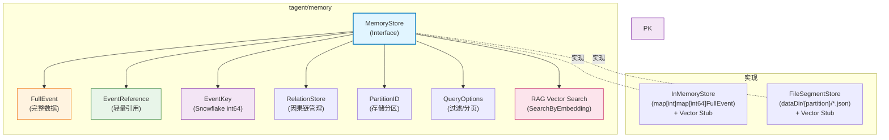
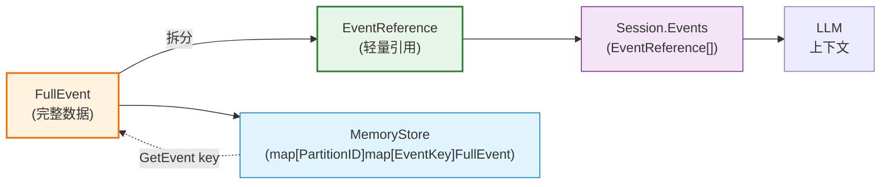
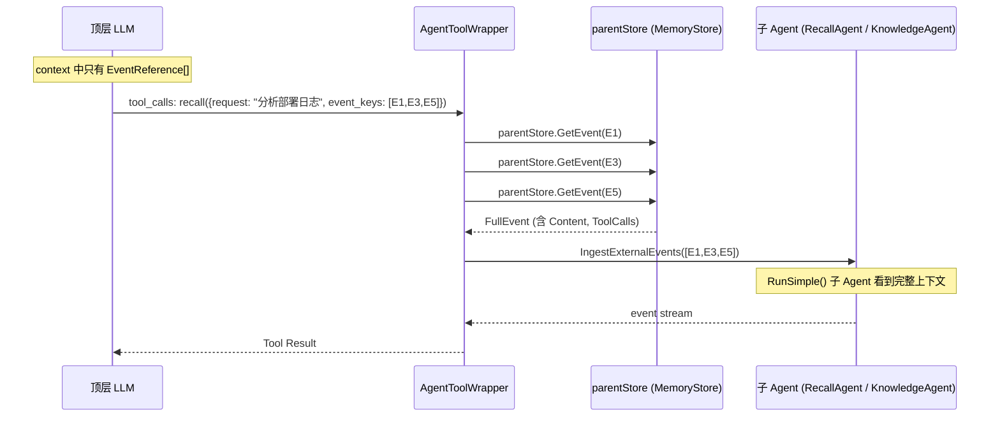
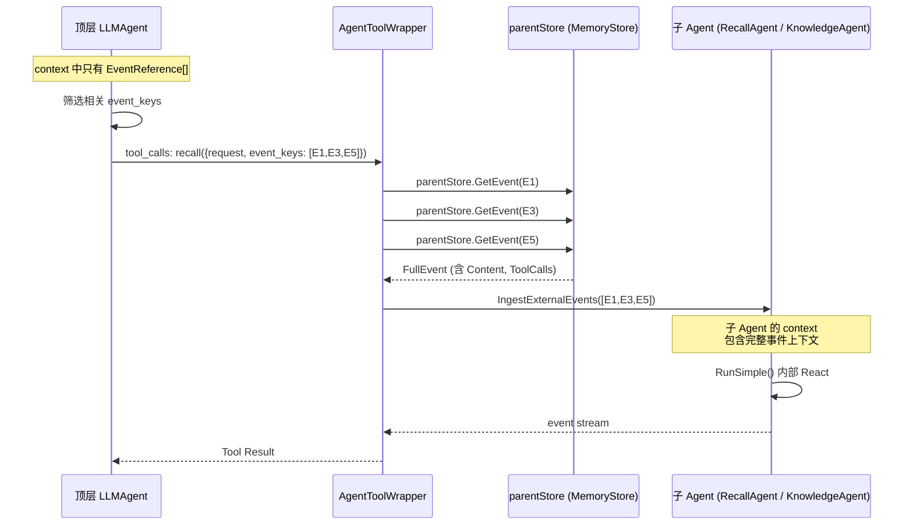
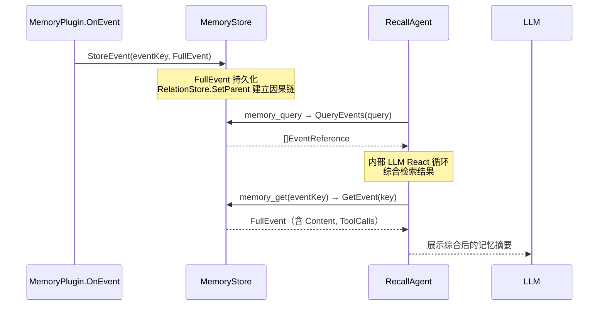

# tagent/memory 模块架构文档

## 一、模块定位

`tagent/memory` 是 tagent 的**结构化事件存储层**，为 Agent 提供因果链追踪、按需精确检索、多维度查询能力。

**核心职责**：
- 定义 `FullEvent`（完整事件）和 `EventReference`（轻量引用）的数据结构
- 定义 `MemoryStore` 接口规范
- 提供 `InMemoryStore`（内存实现）和 `FileSegmentStore`（基于 KV store 的分层存储实现）
- 通过 `EventKey` 和 `RelationStore.SetParent` 构建有向因果事件链
- 支持 **RAG 向量搜索**（可选接口，当前为空实现，可扩展接入向量数据库）

**设计原则**：
- **信息隔离**：Session 只保存轻量引用（`EventReference`），完整数据在 MemoryStore
- **因果优先**：每个事件通过 `RelationStore.SetParent` 指向其前驱事件，支持因果回溯
- **视图独立**：压缩只修改 LLM 消息视图，不修改 MemoryStore 中的数据
- **RAG 扩展**：向量搜索接口可选实现，当前为空实现（stub），可扩展接入向量数据库

---

## 二、文件清单

| 文件 | 行数 | 职责 |
|------|------|------|
| `types.go` | 249 | 数据结构定义（FullEvent、EventReference、MemoryStore、QueryOptions、Snowflake EventKey）+ RAG 向量搜索接口 |
| `in_memory_store.go` | 499 | 内存存储实现（测试/原型场景）+ 向量搜索空实现 |
| `segment_store.go` | 735 | 基于 KV store 的分层存储实现（L0/L1/L2/L3） |
| `relation_store.go` | 485 | 因果链关系存储（SetParent/GetParent/GetChildren） |
| `compaction.go` | 519 | 分层压实调度（L1→L2→L3 自动压实） |
| `lifecycle.go` | 311 | TTL 生命周期管理（过期事件墓碑标记） |
| `tombstone.go` | 254 | 墓碑集管理（标记已删除事件） |

---

## 三、组件关系总览图



---

## 四、核心数据结构

### 4.1 EventKey — Snowflake 64-bit 事件唯一标识符

**格式**（`memory/types.go:128-153`）：

```go
// EventKey is a 64-bit integer following a Snowflake-like layout:
//
//	┌──────────────────────────────────────────────────────────────────┐
//	│ 63       53 │ 52            22 │ 21       12 │ 11             0 │
//	│  PartitionID│   Timestamp      │  Sequence   │   Reserved     │
//	│  (11 bits)  │   (31 bits)      │  (10 bits)  │   (12 bits)    │
//	└──────────────────────────────────────────────────────────────────┘
//
// PartitionID: storage partition (0-2047).
// Timestamp: seconds since snowflakeEpoch (~68 year range).
// Sequence: per-second counter (0-1023), sub-second uniqueness.
// Reserved: for future use (e.g., distributed worker ID).
```

**生成函数**（`memory/types.go:164-186`）：

```go
func NewSnowflakeEventKey(partitionID int, nowMs int64) int64 {
    if nowMs <= 0 {
        nowMs = time.Now().UnixMilli()  // 0 = 使用当前时间
    }
    ts := nowMs/1000 - snowflakeEpoch

    // 内部互斥锁保护的 per-partition Sequence 计数器
    snowflakeSeqMu.Lock()
    if ts == snowflakeSeqLast[partitionID] {
        snowflakeSeqCnt[partitionID]++
    } else {
        snowflakeSeqCnt[partitionID] = 0
        snowflakeSeqLast[partitionID] = ts
    }
    seq := snowflakeSeqCnt[partitionID]
    snowflakeSeqMu.Unlock()

    return (int64(partitionID&partitionIDMask) << partitionIDShift) |
        ((ts & timestampMask) << timestampShift) |
        (int64(seq&sequenceMask) << sequenceShift)
}
```

**解析函数**：

```go
func PartitionIDFromEventKey(key int64) int    // 提取 PartitionID
func TimestampFromEventKey(key int64) int64    // 提取时间戳（秒）
func SequenceFromEventKey(key int64) int       // 提取序列号
```

**特点**：
- **内含分区信息**：从 EventKey 可直接反推 PartitionID，无需额外索引
- **时间有序**：高位为时间戳，按 time.Unix 单调递增
- **全局唯一**：内部 mutex 保护的 per-partition Sequence 计数器保证同秒内唯一
- **零值语义**：`0` 表示无前驱（RelationStore 中 parent=0 表示根事件）
- **第二个参数是时间提示**：`nowMs`（毫秒时间戳），传 0 使用当前时间，非零用于测试确定性生成

### 4.2 FullEvent — 完整事件（MemoryStore 的唯一事实来源）

```go
// memory/types.go:25-39
type FullEvent struct {
    EventKey     int64                  // Snowflake int64 唯一标识符
    PartitionID  int                    // 存储分区 key（从 AgentName 派生）
    EventType    string                 // 事件类型（external_input / agent_output / ...）
    EventSummary string                 // 事件摘要（用于 LLM 推理）
    Timestamp    int64                  // Unix 毫秒时间戳
    Content      string                 // 原始文本内容
    ToolCalls    []model.ToolCall       // 工具调用列表
    ToolResults  map[string]interface{} // 工具执行结果
    Metadata     map[string]string      // 额外元数据
    Response     *model.Response        // LLM 响应快照（可选）
}
```

**用途**：MemoryStore 中存储的完整事件数据，永不修改（immutable）。可通过 `EventKey` 精确检索。`Response` 字段保存 LLM 响应快照，供 Trajectory 采集等下游模块使用。

### 4.3 EventReference — 轻量引用（Session 中的 LLM 上下文）

```go
// memory/types.go:14-21
type EventReference struct {
    EventKey     int64  `json:"event_key"`              // Snowflake int64 指向 MemoryStore 的 key
    PartitionID  int    `json:"partition_id,omitempty"` // 存储分区 key
    EventType    string `json:"event_type"`             // 事件类型
    EventSummary string `json:"event_summary"`           // 简短摘要（用于 LLM 推理）⭐
    Timestamp    int64  `json:"timestamp"`              // 时间戳
}
```

**用途**：
- Session 侧仅保存轻量引用，不保存完整事件详情（**信息隔离设计**）
- `EventSummary` 字段直接进入 LLM 消息上下文，供 LLM 理解历史
- 通过 `EventKey` 可随时从 MemoryStore 拉取完整详情（AgentToolWrapper / RecallAgent 机制）

### 4.4 FullEvent 与 EventReference 的关系



| 字段 | FullEvent | EventReference |
|------|-----------|---------------|
| `EventKey` | ✅ int64 | ✅ int64 |
| `PartitionID` | ✅ int | ✅ int |
| _(ParentKey 已移除)_ | 因果关系由 `RelationStore` 维护 | — |
| `EventType` | ✅ | ✅ |
| `EventSummary` | ✅ | ✅ |
| `Content` | ✅（原文） | ❌ |
| `ToolCalls` | ✅ | ❌ |
| `Response` | ✅ | ❌ |

**关键区别**：Session 中的 `EventReference` 不包含 `Content`、`ToolCalls` 和 `Response`，LLM 看到的只是 `EventSummary`。完整数据通过 AgentToolWrapper（event_key 解析）或 RecallAgent（跨 Session 检索）按需从 MemoryStore 拉取。

---

## 五、因果链机制

### 5.1 RelationStore 因果链语义

ParentKey 已从 FullEvent 结构体中移除。因果关系由独立的 `RelationStore` 维护，通过 `RelationStoreProvider` 接口访问：

```go
// 设置因果关系（MemoryPlugin.OnEvent 中）
if rsp, ok := memStore.(memory.RelationStoreProvider); ok {
    rsp.RelationStore().SetParent(eventKey, parentKey)
}

// 查询因果关系
if rsp, ok := memStore.(memory.RelationStoreProvider); ok {
    parent := rsp.RelationStore().GetParent(eventKey)
    children := rsp.RelationStore().GetChildren(eventKey)
}
```

因果链效果（通过独立的 RelationStore 管理 Parent-Child 关系）：

```
1777198738547555000 (Event 1)
  RelationStore: parent=0  (无前驱)

1777198739574803000 (Event 2)
  RelationStore: parent=1777198738547555000  → 父 = Event 1

1777198739760667000 (Event 3)
  RelationStore: parent=1777198739574803000  → 父 = Event 2
```

### 5.2 因果链的作用

| 能力 | 说明 |
|------|------|
| **因果回溯** | 从当前事件沿 `RelationStore.GetParent()` 回溯历史事件 |
| **分支追踪** | 支持多分支因果（通过 `RelationStore.GetChildren()`） |
| **压缩通知** | 压缩通知中可引用被丢弃的因果链 |
| **RecallAgent** | 按因果顺序展示检索结果 |

### 5.3 因果链与压缩的关系

```
FullEvent 存储因果链 → Session.EventReference 不含因果链
    ↓                                    ↓
压缩时因果链保留在 MemoryStore    LLM 视图通过 SmartCompress 处理
    ↓
RecallAgent 可沿因果链回溯原始事件
```

**关键**：压缩只修改发给 LLM 的消息视图，不修改 MemoryStore 和 RelationStore。因果关系在整个生命周期中保持不变。

---

## 六、MemoryStore 接口

### 6.1 接口定义

```go
// memory/types.go:46-95
type MemoryStore interface {
    // === 写操作 ===
    StoreEvent(key int64, event FullEvent) error
    StoreEvents(events map[int64]FullEvent) error

    // === 读操作 ===
    GetEvent(key int64) (*FullEvent, error)
    GetEvents(keys []int64) ([]FullEvent, error)
    QueryEvents(query QueryOptions) ([]EventReference, error)

    // === RAG 向量搜索（可选实现）===
    // 这些方法是可选的。如果存储不支持向量搜索，返回 ErrVectorSearchNotSupported
    SearchByEmbedding(query []float32, topK int) ([]EventReference, error)
    StoreEventWithEmbedding(key int64, event FullEvent, embedding []float32) error
    SupportsVectorSearch() bool

    // === 管理操作 ===
    DeleteEvent(key int64) error
    GetStats() StoreStats
}

// ErrVectorSearchNotSupported — 向量搜索不支持时返回此错误（memory/types.go:91-93）
var ErrVectorSearchNotSupported = fmt.Errorf("vector search not supported")
```

### 6.1.1 RelationStoreProvider — 因果关系接口

```go
// memory/types.go:97-103
type RelationStoreProvider interface {
    RelationStore() RelationStore
}

// 编译时接口实现检查
var (
    _ RelationStoreProvider = (*InMemoryStore)(nil)
    _ RelationStoreProvider = (*FileSegmentStore)(nil)
)
```

**使用方式**（type assertion）：

```go
// 写入因果关系（MemoryPlugin.OnEvent 中）
if rsp, ok := memStore.(memory.RelationStoreProvider); ok {
    rsp.RelationStore().SetParent(childEventKey, parentEventKey)
}

// 查询因果关系
if rsp, ok := memStore.(memory.RelationStoreProvider); ok {
    parent := rsp.RelationStore().GetParent(eventKey)
    children := rsp.RelationStore().GetChildren(eventKey)
}
```

**设计原则**：内容与关系分离。`FullEvent` 存储不可变的事件内容，`RelationStore` 维护可变的因果关系。不是所有 MemoryStore 实现都支持因果关系，因此通过可选接口暴露。

### 6.2 QueryOptions — 查询过滤

```go
// memory/types.go:96-109
type QueryOptions struct {
    PartitionID  int      // 单个分区过滤（0 = 不过滤）
    PartitionIDs []int    // 多分区过滤（优先级高于 PartitionID）
    EventTypes   []string // 按事件类型过滤（空 = 全部）
    StartTime    int64    // 时间范围起始（毫秒，0 = 无限制）
    EndTime      int64    // 时间范围结束（毫秒，0 = 无限制）
    Limit        int      // 最大返回数量（0 = 无限制）
    Offset       int      // 分页偏移
    OrderBy      string   // "timestamp_asc" 或 "timestamp_desc"
    Keyword      string   // 按关键词过滤 EventSummary 或 Content（大小写不敏感，空 = 不过滤）
}
```

**注意**：`QueryEvents` 始终返回 `[]EventReference`（轻量），不返回完整 `FullEvent`，避免大量 IO 开销。

### 6.3 StoreStats — 存储统计

```go
// memory/types.go:86-90
type StoreStats struct {
    TotalEvents int   // 事件总数
    StorageSize int64 // 存储大小（字节）
    DataDir     string // 数据目录（InMemory = ":memory:"）
}
```

---

## 七、InMemoryStore 实现

### 7.1 数据结构

```go
// memory/in_memory_store.go:11-16
type InMemoryStore struct {
    mu     sync.RWMutex
    events map[int]map[int64]FullEvent  // [partitionID][eventKey]
}
```

### 7.2 存储结构

```
InMemoryStore
  └── events: map[int]map[int64]FullEvent
        ├── PartitionID 0
        │     ├── 1777198738547555000 → FullEvent{...}
        │     └── 1777198739574803000 → FullEvent{...}
        └── PartitionID 1
              └── 1777198739760667000 → FullEvent{...}
```

### 7.3 特性总结

| 特性 | 说明 |
|------|------|
| 数据结构 | Go `map[int]map[int64]FullEvent`，按 PartitionID 分区保存在内存 |
| 持久化 | **无**（进程退出即丢失） |
| 适用场景 | 测试、短期原型、单进程开发 |
| 读写性能 | O(1) 读写，无 IO 开销 |
| 并发安全 | `sync.RWMutex`（读多写少优化） |
| `GetStats()` | `DataDir = ":memory:"`，`StorageSize` 不统计 |
| 向量搜索 | **空实现**：返回 `ErrVectorSearchNotSupported` |

### 7.4 额外方法

除 `MemoryStore` 接口外，`InMemoryStore` 还提供了扩展方法：

| 方法 | 说明 |
|------|------|
| `SearchBySummary(query)` | 按摘要内容模糊搜索（大小写不敏感） |
| `AllEvents()` | 返回所有事件（按时间排序），用于测试和调试 |
| `SearchByEmbedding()` | **RAG 向量搜索（空实现）**：返回 `ErrVectorSearchNotSupported` |
| `StoreEventWithEmbedding()` | **RAG 向量存储（空实现）**：忽略 embedding，仅存储事件 |
| `SupportsVectorSearch()` | 返回 `false` |

---

## 八、FileSegmentStore 实现

### 8.1 数据结构

```go
// memory/segment_store.go:128-135
type FileSegmentStore struct {
    dataDir string  // 如 "./data/tagent/events/" → 内部追加 {dataDir}/{partitionID}/{eventKey}.json
    mu      sync.RWMutex
}
```

### 8.2 文件结构

```
{dataDir}/
  0/  (PartitionID 0)
    1777198738547555000.json  ← FullEvent JSON
    1777198739574803000.json
  1/  (PartitionID 1)
    1777198739760667000.json
  ...
```

### 8.3 FullEvent JSON 示例

```json
{
  "event_key": 1777198738547555000,
  "event_type": "external_input",
  "event_summary": "你好，我想了解今天的天气",
  "timestamp": 1712000001000,
  "content": "你好，我想了解今天的天气",
  "tool_calls": [],
  "tool_results": {},
  "metadata": {}
}
```

### 8.4 特性总结

| 特性 | 说明 |
|------|------|
| 数据结构 | 每个事件一个 JSON 文件 |
| 持久化 | **有**（进程重启后数据不丢失） |
| 适用场景 | 生产环境、单机部署 |
| 读写性能 | 有文件系统 IO 开销；可按 EventKey 直接定位文件 |
| 并发安全 | `sync.RWMutex` 保护读写 |
| `GetStats()` | 遍历目录统计事件数和文件大小 |
| 向量搜索 | **空实现**：返回 `ErrVectorSearchNotSupported` |

---

## 九、两种实现的对比

| 维度 | InMemoryStore | FileSegmentStore |
|------|--------------|-------------|
| **数据结构** | Go map | 每个事件一个 JSON 文件 |
| **持久化** | 无 | 有 |
| **进程重启** | 数据丢失 | 数据保留 |
| **适用场景** | 测试、原型 | 生产环境 |
| **查询性能** | O(1) | O(N) 遍历目录 |
| **扩展性** | 受内存限制 | 受磁盘限制 |
| **并发安全** | sync.RWMutex | sync.RWMutex |
| **存储开销** | 全量在内存 | 每个文件约 ~1KB overhead |
| **向量搜索** | 空实现 | 空实现 |

---

## 十、RAG 向量搜索支持

### 10.1 设计背景

MemoryStore 接口通过可选方法支持向量语义搜索，为未来接入专业向量数据库（Milvus、Qdrant、pgvector 等）预留接口。当前实现提供空实现（stub），返回 `ErrVectorSearchNotSupported`。

### 10.2 RAG 方法说明

| 方法 | 说明 | 默认实现 |
|------|------|----------|
| `SearchByEmbedding(query []float32, topK int)` | 使用查询向量搜索相似事件 | 返回 `ErrVectorSearchNotSupported` |
| `StoreEventWithEmbedding(key, event, embedding)` | 存储事件时同时存储向量 | 忽略 embedding，仅存储事件 |
| `SupportsVectorSearch()` | 是否支持向量搜索 | 返回 `false` |

### 10.3 向量搜索空实现

```go
// InMemoryStore 和 FileSegmentStore 的向量搜索均为空实现

// SearchByEmbedding 总是返回错误
func (s *InMemoryStore) SearchByEmbedding(query []float32, topK int) ([]EventReference, error) {
    return nil, ErrVectorSearchNotSupported
}

// StoreEventWithEmbedding 忽略 embedding 参数
func (s *InMemoryStore) StoreEventWithEmbedding(key int64, event FullEvent, embedding []float32) error {
    return s.StoreEvent(key, event)
}

// SupportsVectorSearch 返回 false
func (s *InMemoryStore) SupportsVectorSearch() bool {
    return false
}
```

### 10.4 扩展方向

接入向量数据库时，实现 `SearchByEmbedding` 和 `StoreEventWithEmbedding` 方法，同时将 `SupportsVectorSearch()` 改为返回 `true`。

---

## 十一、与其他模块的关系

### 11.1 依赖关系

```
tagent/memory（存储层）
    ↑
    │  提供 FullEvent 存储和检索
    │
tagent/plugin
    └── MemoryPlugin → StoreEvent / GetEvent

tagent/agent
    ├── AgentToolWrapper → parentStore.GetEvent (核心高频读取)
    └── SmartCompress（不直接依赖，但因果链信息来自 MemoryStore）

tagent/tool
    ├── RecallAgent → memory_query / memory_get / memory_recent（跨 Session）
    └── KnowledgeAgent → memory_query（上下文感知搜索）

tagent (root)
    └── tagent.New() 接线时注入 parentMemStore
```

### 11.2 MemoryPlugin 是主要写入方

`MemoryPlugin.OnEvent` 每次事件都会调用 `memStore.StoreEvent`：

```go
// plugin/memory_plugin.go:91-98
if p.memStore != nil {
    if err := p.memStore.StoreEvent(eventKey, fullEvent); err != nil {
        log.Errorf("MemoryPlugin: failed to store event %s: %v", eventKey, err)
    }
}
```

### 11.3 MemoryStore 的多方读取模式

MemoryStore 的读取方按频率和场景分层：

| 读取方 | 频率 | 场景 |
|--------|------|------|
| **AgentToolWrapper** | 🔥 最高频 | 顶层 LLM 筛选 `event_keys` → 传给子 tool → Wrapper 从 `parentStore` 取完整 `FullEvent` → 注入子 Agent 作为上下文 |
| **RecallAgent** 子工具 | 中频 | 跨 Session 深层检索：`memory_query`（语义查询）、`memory_get`（按 key 取详情）、`memory_recent`（最近 N 条） |
| **KnowledgeAgent** | 低~中频 | 通过 `memory_query` 从父级 MemoryStore 查历史，辅助技能/MCP 搜索 |
| **直接访问** (`agent.MemStore()`) | 调试/测试 | 开发阶段手工查事件 |

---

#### AgentToolWrapper — 核心读取路径

**为什么是核心**：顶层 LLM 的上下文只有 `EventReference[]`（轻量摘要），不包含 `Content` 和 `ToolCalls`。当 LLM 需要子 Agent 处理某段历史时，它筛选出相关 `event_keys` 作为工具参数传递。`AgentToolWrapper.Call()` 拦截调用，通过 `parentStore.GetEvent(key)` 逐个取出完整 `FullEvent`，再通过 `IngestExternalEvents()` 注入到子 Agent 的 context 中。



**设计要点**：LLM 只传递 `int64` 数字 key，**实际事件内容在服务端解析**，既保证了上下文完整性，又不让 LLM 突破信息隔离边界（LLM 从未见到被压缩掉的 `Content`/`ToolCalls`）。

---

#### RecallAgent — 超越当前会话的深层检索

`RecallAgent` 的独特价值不在"读 MemoryStore"（那是 AgentToolWrapper 的职责），而在**跨 Session 的语义记忆召回**。

顶层 LLM 的 context 已包含当前 Session 的 `EventReference[]` 流。当需要的信息**超出当前 context 窗口**或**跨越多个历史 Session** 时，LLM 调用 RecallAgent。RecallAgent 的内部 LLM React 循环负责：

1. **理解查询意图** — 将自然语言转为结构化检索条件
2. **多工具协作** — `memory_query` 检索 → `memory_get` 按需取详情（含父事件） → `memory_recent` 补充最新事件 → `memory_trace` 因果链回溯
3. **跨事件综合** — 将零散历史事件综合为连贯的记忆摘要

其子工具 `memory_get` 通过 `EventKey` 从 MemoryStore 拉取完整事件详情：

```go
// tool/recall_subtools.go — NewRecallGetTool
func NewRecallGetTool(accessor MemoryStoreAccessor) tool.Tool {
    return function.NewFunctionTool(
        func(ctx context.Context, args recallGetArgs) (recallGetResult, error) {
            if args.Key == 0 {
                return recallGetResult{}, fmt.Errorf("event key is required")
            }

            evt, err := accessor.GetEvent(args.Key)
            if err != nil {
                return recallGetResult{}, fmt.Errorf("event not found: %w", err)
            }

            result := recallGetResult{
                Key:       evt.EventKey,

                Type:      evt.EventType,
                Summary:   evt.EventSummary,
                Content:   evt.Content,
                Time:      formatTimestamp(evt.Timestamp),
            }

            // Optionally include parent event summary
            // 通过 RelationStore 获取父事件
            if args.IncludeParent {
                var parentKey int64
                if rsp, ok := accessor.(memory.RelationStoreProvider); ok {
                    parentKey = rsp.RelationStore().GetParent(evt.EventKey)
                }
                if parentKey != 0 {
                    if parent, err := accessor.GetEvent(parentKey); err == nil && parent != nil {
                    result.Parent = &parentEventInfo{...}
                }
            }

            return result, nil
        },
        function.WithName("memory_get"),
        function.WithDescription("Get full details of a specific event by its key. Set include_parent=true to also include the parent event summary."),
    )
}
```

**RecallAgent 子工具**：
- `memory_query`：按查询条件检索事件列表，支持时间范围过滤（`since`/`until`），自动注入 `ReadPartitionIDs`
- `memory_get`：根据 event_key 获取完整事件详情，支持 `include_parent` 参数自动包含父事件摘要
- `memory_recent`：快速获取最近的 N 条事件，支持时间范围过滤（`since`/`until`），自动注入 `ReadPartitionIDs`
- `memory_trace`：沿 RelationStore 因果链回溯，从指定事件追溯最多 20 步历史

> **自动注入机制**：`memory_query` 和 `memory_recent` 的 handler 内部自动将配置的 `ReadNamespaces`（转换为 PartitionID 列表）注入到 `QueryOptions.PartitionIDs`。LLM 调用时只需传语义参数（如 `{query: "部署"}`），无需感知分区号。详见 [tool-architecture.md](../tool/tool-architecture.md) §七。

### 11.4 完整数据流

MemoryStore 有两条主要读取路径：**AgentToolWrapper**（核心高频，LLM 选 key → Wrapper 解析）和 **RecallAgent**（跨 Session 深层检索）。

#### 路径一：AgentToolWrapper（核心高频）



#### 路径二：RecallAgent 跨 Session 深层检索



---

## 十二、PartitionID 派生

### 12.1 PartitionIDFromName — 从名称派生稳定分区 ID

```go
// memory/types.go:212-221
func PartitionIDFromName(name string) int
```

使用 FNV-1a 哈希将名称（如 AgentName）映射为 0-2047 之间的稳定 PartitionID。相同名称总是产生相同 PartitionID，使用 `sync.Map` 缓存。

### 12.2 NewPartitionID — 无名称时的唯一分区 ID

```go
// memory/types.go:232-235
func NewPartitionID() int
```

当没有稳定名称可用时，使用原子计数器生成全局唯一的 PartitionID。

---

## 十三、跨命名空间读权限（ReadNamespaces）

### 13.0 设计背景

RecallAgent 的子工具操作的是自身 MemoryStore，而历史事件由顶层 Agent（如 tagent）写入。当 RecallAgent 需要检索顶层 Agent 的历史事件时，需要跨命名空间的读权限。

**设计方案**：`MemoryConfig.ReadNamespaces` 字段声明本 Agent 可读取的其他 Agent 命名空间。`buildAgent()` 在初始化时将其转换为 `ReadPartitionIDs []int`，通过 `ToolAgentFactoryConfig` 注入到 recall factory，再由 factory 传给子工具构造函数。

```yaml
# 配置示例
recall:
  memory:
    type: file
    path: .wechat-config/agent-events
    read_namespaces:
      - tagent         # 可读 tagent 的分区
```

**转换链路**：

```
tagent.yaml → ReadNamespaces: ["tagent"]
  → buildAgent() → memory.PartitionIDFromName("tagent") → [144]
  → ToolAgentFactoryConfig.ReadPartitionIDs: [144]
  → recallFactory() → recall.Config.ReadPartitionIDs: [144]
  → buildRecallSubTools(accessor, [144])
  → NewRecallQueryTool(accessor, [144]) — handler 内注入 opts.PartitionIDs
  → LLM 调用 memory_query({query: "部署"}) → 实际查询分区 144
```

### 13.0.1 InMemoryStore 按 path 共享实例

对于 `type: file`，文件系统天然提供跨实例数据共享（两个 FileSegmentStore 指向同一目录即可读对方分区的文件）。但对于 `type: memory`，两个 `NewInMemoryStore()` 是独立 Go 对象，需要显式共享。

**解决方案**：`resolveMemoryStore()` 中对 `type: memory` 按 `path` 做轻量级注册表去重：

```go
var (
    namedMemMu     sync.Mutex
    namedMemStores = map[string]*memory.InMemoryStore{}
)

func resolveMemoryStore(mc MemoryConfig) (memory.MemoryStore, error) {
    case "memory", "":
        if mc.Path == "" {
            return memory.NewInMemoryStore(), nil  // 无 path → 隔离
        }
        namedMemMu.Lock()
        defer namedMemMu.Unlock()
        if s, ok := namedMemStores[mc.Path]; ok {
            return s, nil  // 同 path → 同实例
        }
        s := memory.NewInMemoryStore()
        namedMemStores[mc.Path] = s
        return s, nil
}
```

**效果**：

| 配置 | 实例策略 | 数据共享方式 |
|------|---------|------------|
| `type: memory`（无 path） | 每次新建 | 完全隔离 |
| `type: memory, path: "X"` | 同 path → 同实例 | 同一 `map[PartitionID]map[EventKey]FullEvent` |
| `type: file, path: "/X"` | 每次新建 | 文件系统天然共享 |

### 13.0.2 path 字段的双重语义

| 类型 | `path` 的含义 |
|------|-------------|
| `file` | 文件系统目录路径 |
| `memory` | 逻辑存储标识符——同 type + 同 path → 单例 |

> `path` 在两种类型下均表示"存储定位符"。FileSegmentStore 通过文件系统天然保证同路径→同存储；InMemoryStore 通过注册表显式保证。

---

## 十四、关键设计决策

### 14.1 为什么不直接在 Session 中存储 FullEvent？

| 需求 | Session 能满足吗 | MemoryStore 的优势 |
|------|----------------|------------------|
| 因果链 | Session.Events 是线性列表 | `RelationStore.SetParent` 构建有向因果图 |
| 精确 FullEvent 检索 | 需遍历所有事件 | `GetEvent(key)` O(1) |
| 按类型/时间查询 | 框架支持有限 | `QueryEvents` 多维度过滤 |
| 跨 Session 检索 | 单 Session 范围 | 可跨 Session 按 UserID 检索 |
| 工具调用原始数据 | 有 | `ToolCalls` 不随 LLM 视图变化 |

### 14.2 为什么 QueryEvents 返回 EventReference 而不是 FullEvent？

**性能考量**：MemoryStore 可能存储大量事件。若每次查询都返回完整 `FullEvent`（含 `Content`、`ToolCalls`、`Response`），会造成大量 IO 开销和内存占用。

`EventReference` 仅包含 4 个字段（key、type、summary、timestamp），是 `FullEvent` 的轻量子集。调用方按需通过 `GetEvent(key)` 获取完整数据。

### 14.3 为什么 FileSegmentStore 每个事件一个文件？

**原子性**：写入时仅修改单个文件，不影响其他事件。进程崩溃最多丢失正在写入的文件，不会破坏整个存储。

**可管理性**：可单独查看、备份、删除单个事件。`GetStats()` 可直接统计文件数和大小。

**扩展性**：文件数量可随事件增长无限扩展，不受内存限制。
