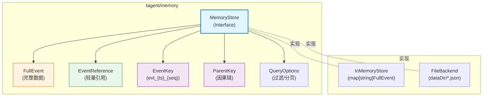
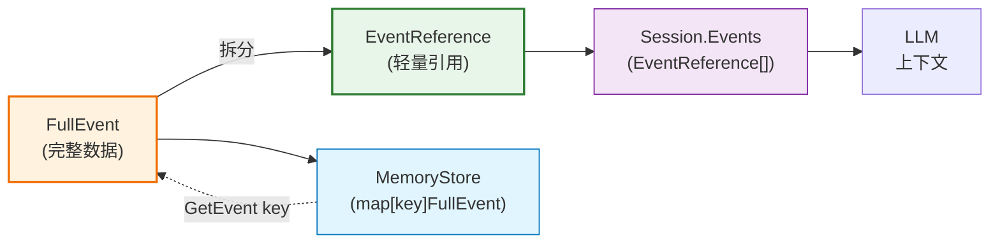
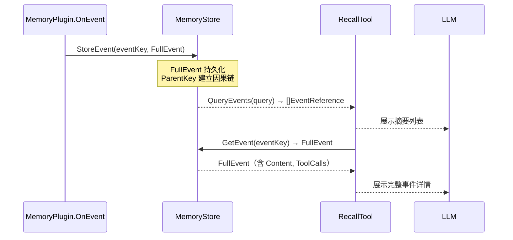

# tagent/memory 模块架构文档

## 一、模块定位

`tagent/memory` 是 tagent 的**结构化事件存储层**，为 Agent 提供因果链追踪、按需精确检索、多维度查询能力。

**核心职责**：
- 定义 `FullEvent`（完整事件）和 `EventReference`（轻量引用）的数据结构
- 定义 `MemoryStore` 接口规范
- 提供 `InMemoryStore`（内存实现）和 `FileBackend`（文件系统实现）
- 通过 `EventKey` 和 `ParentKey` 构建有向因果事件链

**设计原则**：
- **信息隔离**：Session 只保存轻量引用（`EventReference`），完整数据在 MemoryStore
- **因果优先**：每个事件通过 `ParentKey` 指向其前驱事件，支持因果回溯
- **视图独立**：压缩只修改 LLM 消息视图，不修改 MemoryStore 中的数据

---

## 二、文件清单

| 文件 | 行数 | 职责 |
|------|------|------|
| `types.go` | 107 | 数据结构定义（FullEvent、EventReference、MemoryStore、QueryOptions、EventKey） |
| `in_memory_store.go` | 212 | 内存存储实现（测试/原型场景） |
| `file_backend.go` | 320 | 文件系统存储实现（生产环境） |

---

## 三、组件关系总览图



---

## 四、核心数据结构

### 4.1 EventKey — 事件唯一标识符

**格式**（`memory/types.go:103-106`）：

```go
func NewEventKey(timestamp int64, sequence int) string {
    return fmt.Sprintf("evt_%d_%03d", timestamp, sequence)
}

// 示例：evt_1712000001000_000
```

| 字段 | 来源 | 说明 |
|------|------|------|
| `timestamp` | `time.Now().UnixMilli()` | 毫秒级 Unix 时间戳 |
| `sequence` | 调用方指定（通常为 0） | 同毫秒内去重（预留，当前固定为 0） |

**特点**：
- **时间有序**：EventKey 隐含时间顺序，可直接用于排序
- **单调递增**：毫秒精度，同毫秒内多个事件用 sequence 区分
- **全局唯一**：时间戳 + 序列号组合保证全局唯一性

### 4.2 FullEvent — 完整事件（MemoryStore 的唯一事实来源）

```go
// memory/types.go:24-38
type FullEvent struct {
    EventKey     string                 // 唯一标识符（"evt_{ts}_{seq}"）
    ParentKey    string                 // 因果链：前驱事件的 EventKey（"" = 首个事件）
    EventType    string                 // 事件类型（external_input / agent_output / ...）
    EventSummary string                 // 事件摘要（用于 LLM 推理）
    Timestamp    int64                  // Unix 毫秒时间戳
    Content      string                 // 原始文本内容
    ToolCalls    []model.ToolCall       // 工具调用列表
    ToolResults  map[string]interface{}  // 工具执行结果
    Metadata     map[string]string      // 额外元数据
    Response     *model.Response        // 兼容 Phase 2（未来废弃）
}
```

**用途**：MemoryStore 中存储的完整事件数据，永不修改（immutable）。可通过 `EventKey` 精确检索。

### 4.3 EventReference — 轻量引用（Session 中的 LLM 上下文）

```go
// memory/types.go:15-20
type EventReference struct {
    EventKey     string `json:"event_key"`      // 指向 MemoryStore 的 key
    EventType    string `json:"event_type"`     // 事件类型
    EventSummary string `json:"event_summary"`   // 简短摘要（用于 LLM 推理）⭐
    Timestamp    int64  `json:"timestamp"`      // 时间戳
}
```

**用途**：
- Session 侧仅保存轻量引用，不保存完整事件详情（**信息隔离设计 Phase 3**）
- `EventSummary` 字段直接进入 LLM 消息上下文，供 LLM 理解历史
- 通过 `EventKey` 可随时从 MemoryStore 拉取完整详情（RecallTool 机制）

### 4.4 FullEvent 与 EventReference 的关系



| 字段 | FullEvent | EventReference |
|------|-----------|---------------|
| `EventKey` | ✅ | ✅ |
| `ParentKey` | ✅（因果链） | ❌（不在引用中） |
| `EventType` | ✅ | ✅ |
| `EventSummary` | ✅ | ✅ |
| `Content` | ✅（原文） | ❌ |
| `ToolCalls` | ✅ | ❌ |
| `Response` | ✅（完整） | ❌ |

**关键区别**：Session 中的 `EventReference` 不包含 `Content` 和 `ToolCalls`，LLM 看到的只是 `EventSummary`。完整数据通过 `RecallTool` 按需从 MemoryStore 拉取。

---

## 五、因果链机制

### 5.1 ParentKey 的语义

每个 `FullEvent` 都有一个 `ParentKey` 字段，指向其前驱事件的 `EventKey`：

```
evt_1712000001000_000 (Event 1)
  ParentKey: ""  (无前驱，首个事件)

evt_1712000002000_000 (Event 2)
  ParentKey: "evt_1712000001000_000"  → 父 = Event 1

evt_1712000003000_000 (Event 3)
  ParentKey: "evt_1712000002000_000"  → 父 = Event 2

evt_1712000004000_000 (Event 4)
  ParentKey: "evt_1712000003000_000"  → 父 = Event 3
```

### 5.2 因果链的作用

| 能力 | 说明 |
|------|------|
| **因果回溯** | 从当前事件沿 `ParentKey` 回溯历史事件 |
| **分支追踪** | 支持多分支因果（通过不同的 ParentKey） |
| **压缩通知** | 压缩通知中可引用被丢弃的因果链 |
| **RecallTool** | 按因果顺序展示检索结果 |

### 5.3 因果链与压缩的关系

```
FullEvent 存储因果链 → Session.EventReference 不含因果链
    ↓                                    ↓
压缩时因果链保留在 MemoryStore    LLM 视图通过 SmartCompress 处理
    ↓
RecallTool 可沿因果链回溯原始事件
```

**关键**：压缩只修改发给 LLM 的消息视图，不修改 MemoryStore。`FullEvent.ParentKey` 在整个生命周期中保持不变。

---

## 六、MemoryStore 接口

### 6.1 接口定义

```go
// memory/types.go:42-73
type MemoryStore interface {
    // === 写操作 ===
    StoreEvent(key string, event FullEvent) error
    StoreEvents(events map[string]FullEvent) error

    // === 读操作 ===
    GetEvent(key string) (*FullEvent, error)
    GetEvents(keys []string) ([]FullEvent, error)
    QueryEvents(query QueryOptions) ([]EventReference, error)

    // === 管理操作 ===
    DeleteEvent(key string) error
    GetStats() StoreStats
}
```

### 6.2 QueryOptions — 查询过滤

```go
// memory/types.go:76-83
type QueryOptions struct {
    EventTypes []string  // 按事件类型过滤（空 = 全部）
    StartTime  int64     // 时间范围起始（毫秒，0 = 无限制）
    EndTime    int64     // 时间范围结束（毫秒，0 = 无限制）
    Limit      int       // 最大返回数量（0 = 无限制）
    Offset     int       // 分页偏移
    OrderBy    string    // "timestamp_asc" 或 "timestamp_desc"
}
```

**注意**：`QueryEvents` 始终返回 `[]EventReference`（轻量），不返回完整 `FullEvent`，避免大量 IO 开销。

### 6.3 StoreStats — 存储统计

```go
// memory/types.go:86-90
type StoreStats struct {
    TotalEvents int   // 事件总数
    StorageSize int64 // 存储大小（字节）
    DataDir     string // 数据目录（InMemory = ":memory:"）
}
```

---

## 七、InMemoryStore 实现

### 7.1 数据结构

```go
// memory/in_memory_store.go:11-14
type InMemoryStore struct {
    mu     sync.RWMutex
    events map[string]FullEvent  // key: EventKey
}
```

### 7.2 存储结构

```
InMemoryStore
  └── events: map[string]FullEvent
        ├── "evt_1712000001000_000" → FullEvent{...}
        ├── "evt_1712000002000_000" → FullEvent{...}
        └── "evt_1712000003000_000" → FullEvent{...}
```

### 7.3 特性总结

| 特性 | 说明 |
|------|------|
| 数据结构 | Go `map[string]FullEvent`，全量保存在内存 |
| 持久化 | **无**（进程退出即丢失） |
| 适用场景 | 测试、短期原型、单进程开发 |
| 读写性能 | O(1) 读写，无 IO 开销 |
| 并发安全 | `sync.RWMutex`（读多写少优化） |
| `GetStats()` | `DataDir = ":memory:"`，`StorageSize` 不统计 |

### 7.4 额外方法

除 `MemoryStore` 接口外，`InMemoryStore` 还提供了两个扩展方法：

```go
// SearchBySummary(query string) — 按摘要内容模糊搜索（大小写不敏感）
// AllEvents() — 返回所有事件（按时间排序），用于测试和调试
```

---

## 八、FileBackend 实现

### 8.1 数据结构

```go
// memory/file_backend.go:16-19
type FileBackend struct {
    dataDir string  // 如 "./data/tagent/events/"
    mu      sync.RWMutex
}
```

### 8.2 文件结构

```
{dataDir}/
  evt_1712000001000_000.json  ← FullEvent JSON
  evt_1712000002000_000.json
  evt_1712000003000_000.json
  ...
```

### 8.3 FullEvent JSON 示例

```json
{
  "event_key": "evt_1712000001000_000",
  "parent_key": "",
  "event_type": "external_input",
  "event_summary": "你好，我想了解今天的天气",
  "timestamp": 1712000001000,
  "content": "你好，我想了解今天的天气",
  "tool_calls": [],
  "tool_results": {},
  "metadata": {}
}
```

### 8.4 特性总结

| 特性 | 说明 |
|------|------|
| 数据结构 | 每个事件一个 JSON 文件 |
| 持久化 | **有**（进程重启后数据不丢失） |
| 适用场景 | 生产环境、单机部署 |
| 读写性能 | 有文件系统 IO 开销；可按 EventKey 直接定位文件 |
| 并发安全 | `sync.RWMutex` 保护读写 |
| `GetStats()` | 遍历目录统计事件数和文件大小 |

---

## 九、两种实现的对比

| 维度 | InMemoryStore | FileBackend |
|------|--------------|-------------|
| **数据结构** | Go map | 每个事件一个 JSON 文件 |
| **持久化** | 无 | 有 |
| **进程重启** | 数据丢失 | 数据保留 |
| **适用场景** | 测试、原型 | 生产环境 |
| **查询性能** | O(1) | O(N) 遍历目录 |
| **扩展性** | 受内存限制 | 受磁盘限制 |
| **并发安全** | sync.RWMutex | sync.RWMutex |
| **存储开销** | 全量在内存 | 每个文件约 ~1KB overhead |

---

## 十、与其他模块的关系

### 10.1 依赖关系

```
tagent/memory（存储层）
    ↑
    │  提供 FullEvent 存储和检索
    │
tagent/plugin
    └── MemoryPlugin → StoreEvent / GetEvent

tagent/tool
    └── RecallTool → QueryEvents / GetEvent

tagent/agent
    └── SmartCompress（不直接依赖，但因果链信息来自 MemoryStore）
```

### 10.2 MemoryPlugin 是主要写入方

`MemoryPlugin.OnEvent` 每次事件都会调用 `memStore.StoreEvent`：

```go
// plugin/memory_plugin.go:91-98
if p.memStore != nil {
    if err := p.memStore.StoreEvent(eventKey, fullEvent); err != nil {
        log.Errorf("MemoryPlugin: failed to store event %s: %v", eventKey, err)
    }
}
```

### 10.3 RecallTool 是主要读取方

`RecallTool` 通过 `EventKey` 从 MemoryStore 拉取完整事件详情：

```go
// tool/recall_tool.go:100-118
func (rt *RecallTool) getEventDetails(eventKey string) (any, error) {
    evt, err := rt.memStore.GetEvent(eventKey)
    if err != nil {
        return nil, fmt.Errorf("recall: event not found: %w", err)
    }
    return RecallEventDetail{
        Key:       evt.EventKey,
        ParentKey: evt.ParentKey,
        Type:      evt.EventType,
        Summary:   evt.EventSummary,
        Content:   evt.Content,
        ToolCalls: evt.ToolCalls,
        Timestamp: evt.Timestamp,
    }, nil
}
```

### 10.4 完整数据流



---

## 十一、关键设计决策

### 11.1 为什么不直接在 Session 中存储 FullEvent？

| 需求 | Session 能满足吗 | MemoryStore 的优势 |
|------|----------------|------------------|
| 因果链 | Session.Events 是线性列表 | `ParentKey` 构建有向因果图 |
| 精确 FullEvent 检索 | 需遍历所有事件 | `GetEvent(key)` O(1) |
| 按类型/时间查询 | 框架支持有限 | `QueryEvents` 多维度过滤 |
| 跨 Session 检索 | 单 Session 范围 | 可跨 Session 按 UserID 检索 |
| 工具调用原始数据 | 有 | `ToolCalls` 不随 LLM 视图变化 |

### 11.2 为什么 QueryEvents 返回 EventReference 而不是 FullEvent？

**性能考量**：MemoryStore 可能存储大量事件。若每次查询都返回完整 `FullEvent`（含 `Content`、`ToolCalls`、`Response`），会造成大量 IO 开销和内存占用。

`EventReference` 仅包含 4 个字段（key、type、summary、timestamp），是 `FullEvent` 的轻量子集。调用方按需通过 `GetEvent(key)` 获取完整数据。

### 11.3 为什么 FileBackend 每个事件一个文件？

**原子性**：写入时仅修改单个文件，不影响其他事件。进程崩溃最多丢失正在写入的文件，不会破坏整个存储。

**可管理性**：可单独查看、备份、删除单个事件。`GetStats()` 可直接统计文件数和大小。

**扩展性**：文件数量可随事件增长无限扩展，不受内存限制。
