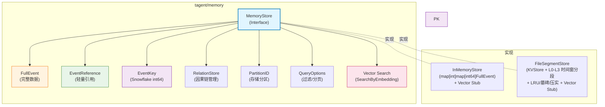
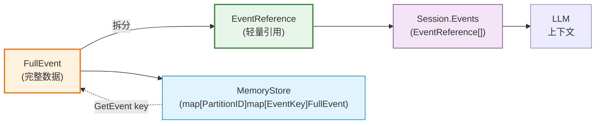
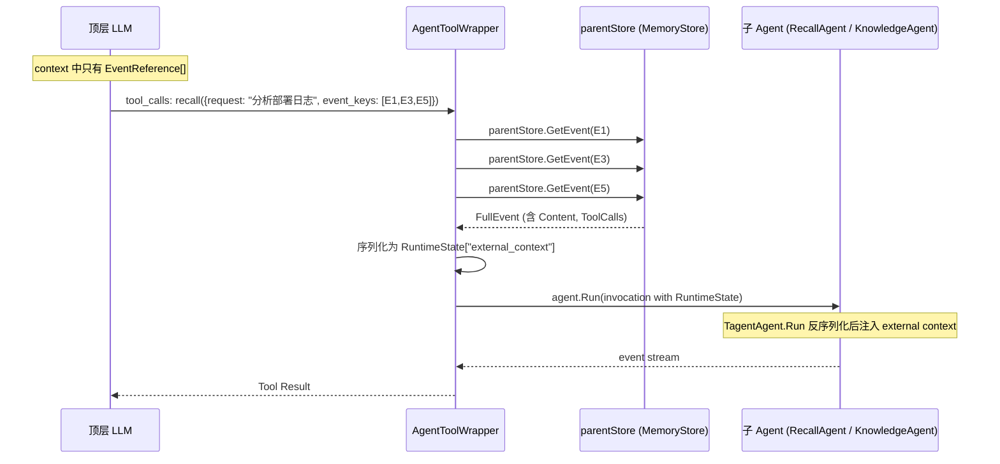
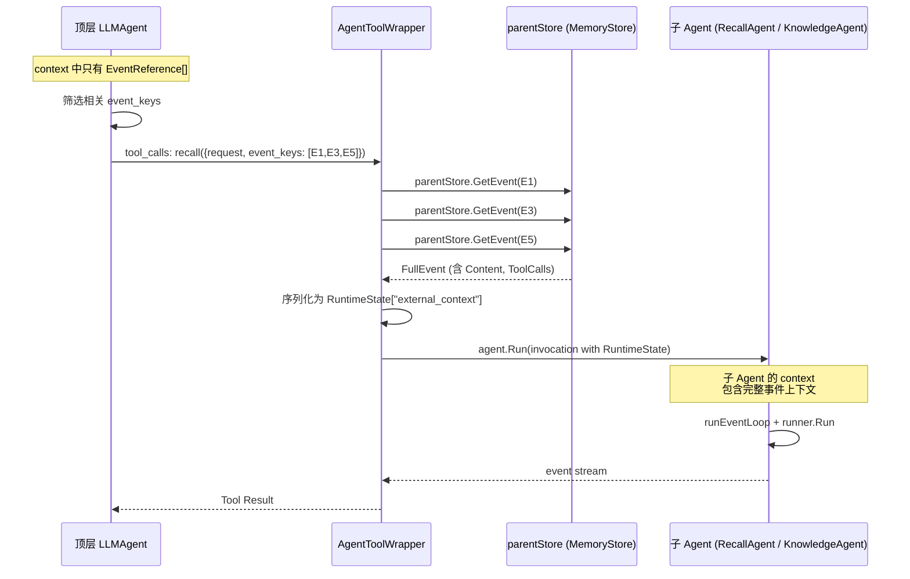
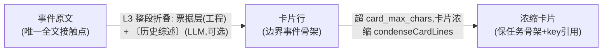
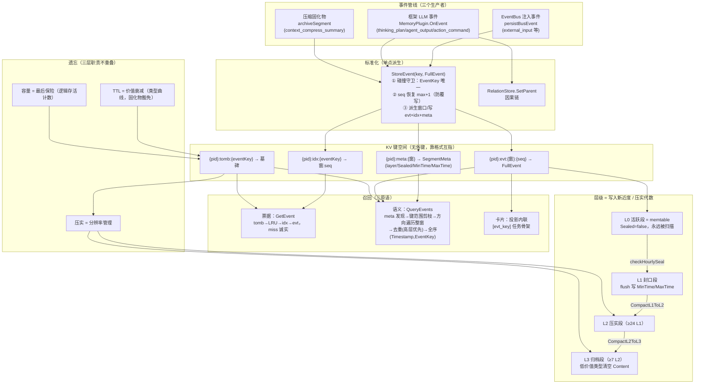
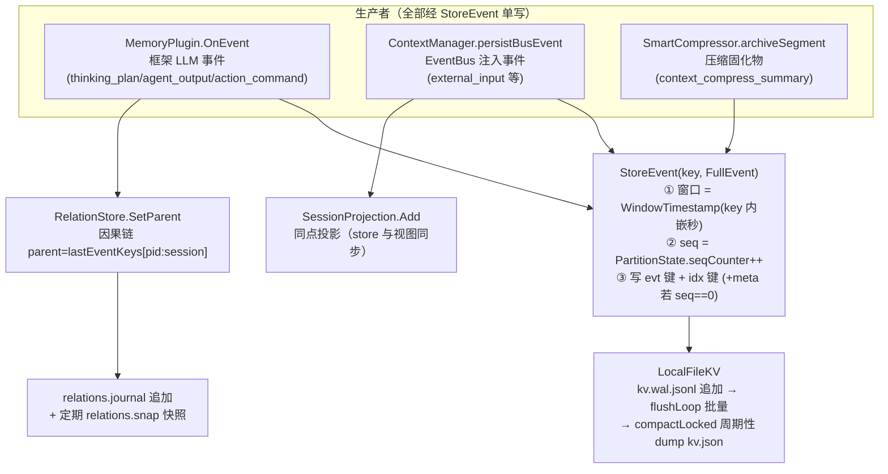
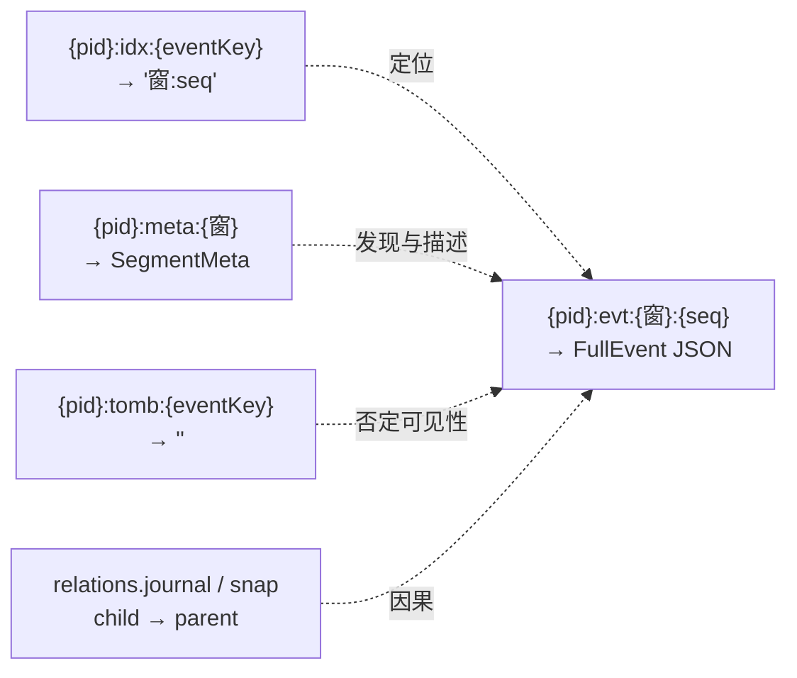
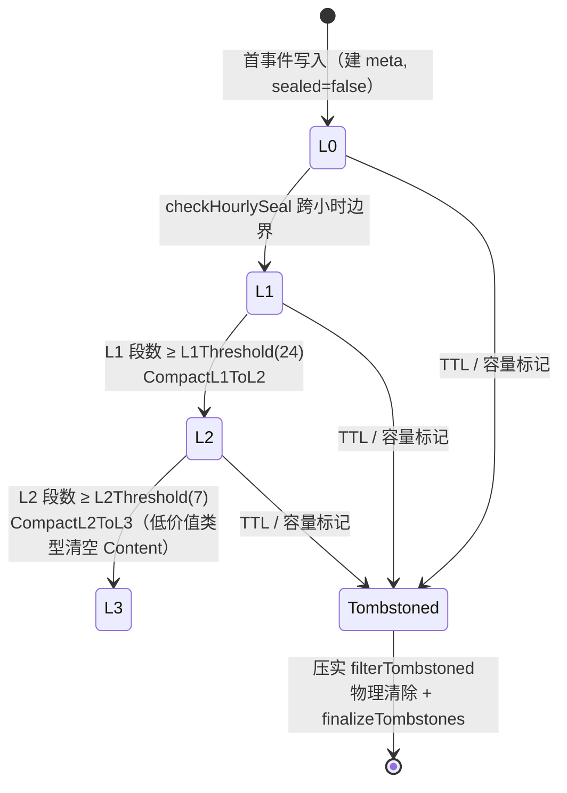

# tagent/memory 模块架构文档

## 一、模块定位

`tagent/memory` 是 tagent 的**结构化事件存储层**，为 Agent 提供因果链追踪、按需精确检索、多维度查询能力。

**核心职责**：
- 定义 `FullEvent`（完整事件）和 `EventReference`（轻量引用）的数据结构
- 定义 `MemoryStore` 接口规范
- 提供 `InMemoryStore`（内存实现）和 `FileSegmentStore`（基于 KV store 的分层存储实现）
- 通过 `EventKey` 和 `RelationStore.SetParent` 构建有向因果事件链
- 提供向量搜索接口（`SearchByEmbedding`），当前实现返回 `ErrVectorSearchNotSupported`，可扩展接入向量数据库

**设计原则**：
- **信息隔离**：Session 只保存轻量引用（`EventReference`），完整数据在 MemoryStore
- **因果优先**：每个事件通过 `RelationStore.SetParent` 指向其前驱事件，支持因果回溯
- **视图独立**：压缩只修改 LLM 消息视图，不修改 MemoryStore 中的数据
- **向量搜索扩展**：`MemoryStore` 接口包含 `SearchByEmbedding`/`StoreEventWithEmbedding`/`SupportsVectorSearch`，当前实现返回 `ErrVectorSearchNotSupported`，可扩展接入向量数据库

---

## 二、文件清单

| 文件 | 职责 |
|------|------|
| `types.go` | 数据结构定义（FullEvent、EventReference、MemoryStore、QueryOptions、Snowflake EventKey）+ 向量搜索接口 |
| `in_memory_store.go` | 内存存储实现（测试/原型场景）+ 向量搜索空实现 |
| `segment_store.go` | 基于 KV store 的分层存储实现（L0/L1/L2/L3 时间窗分段） |
| `relation_store.go` | 因果链关系存储（SetParent/GetParent/GetChildren，LRU+可选 KV 持久化） |
| `compaction.go` | 分层压实调度（L1→L2→L3 自动压实） |
| `lifecycle.go` | TTL 生命周期管理（过期墓碑标记；`context_compress_summary` 固化物豁免 TTL 与容量淘汰） |
| `tombstone.go` | 墓碑集管理（标记已删除事件） |

---

## 三、组件关系总览图



---

## 四、核心数据结构

### 4.1 EventKey — Snowflake 64-bit 事件唯一标识符

**格式**（`memory/types.go`，snowflake-overflow-handling 修复后）：

```go
// EventKey is a 64-bit integer following a Snowflake-like layout:
//
//	┌────┬─────────────┬──────────────────┬─────────────┬────────────────┐
//	│ 63 │ 62       53 │ 52            22 │ 21       12 │ 11           0 │
//	│sign│ PartitionID │   Timestamp      │  Sequence   │   Reserved     │
//	│ =0 │ (10 bits)   │   (31 bits)      │  (10 bits)  │   (12 bits)    │
//	└────┴─────────────┴──────────────────┴─────────────┴────────────────┘
//
// bit 63 恒为 0（符号位保护）：正 key = 真实事件，负 key 保留给投影内的
// 压缩摘要引用（rolling summaryRef）。partitionIDMask=0x3FF（10 位，0-1023）。
// Timestamp: seconds since snowflakeEpoch (~68 year range).
// Sequence: per-second counter (0-1023), sub-second uniqueness.
```

> **历史教训**：早期 mask 为 11 位（0x7FF）时 partition≥1024 会触及符号位产生负 key，
> 导致全部 `EventKey>0` 守卫失效（plan 全链路失明）。现 10 位 mask + 回归测试
> `TestSnowflakeEventKey_AlwaysPositive` 锁定。

**字符串形态**：EventKey 对 LLM/工具的展示与入参统一为 **16 进制**（`event.FormatEventKey/ParseEventKey`，负号保留给摘要引用），存储层仍为 int64。

**生成函数**（`memory/types.go`）：

```go
func NewSnowflakeEventKey(partitionID int, nowMs int64) int64 {
    if nowMs <= 0 {
        nowMs = time.Now().UnixMilli()  // 0 = 使用当前时间
    }
    ts := nowMs/1000 - snowflakeEpoch

    // 内部互斥锁保护的 per-partition Sequence 计数器
    snowflakeSeqMu.Lock()
    if ts == snowflakeSeqLast[partitionID] {
        snowflakeSeqCnt[partitionID]++
    } else {
        snowflakeSeqCnt[partitionID] = 0
        snowflakeSeqLast[partitionID] = ts
    }
    seq := snowflakeSeqCnt[partitionID]
    snowflakeSeqMu.Unlock()

    return (int64(partitionID&partitionIDMask) << partitionIDShift) |
        ((ts & timestampMask) << timestampShift) |
        (int64(seq&sequenceMask) << sequenceShift)
}
```

**解析函数**：

```go
func PartitionIDFromEventKey(key int64) int    // 提取 PartitionID
func TimestampFromEventKey(key int64) int64    // 提取时间戳（秒）
func SequenceFromEventKey(key int64) int       // 提取序列号
```

**特点**：
- **内含分区信息**：从 EventKey 可直接反推 PartitionID，无需额外索引
- **时间有序**：高位为时间戳，按 time.Unix 单调递增
- **全局唯一**：内部 mutex 保护的 per-partition Sequence 计数器保证同秒内唯一
- **零值语义**：`0` 表示无前驱（RelationStore 中 parent=0 表示根事件）
- **第二个参数是时间提示**：`nowMs`（毫秒时间戳），传 0 使用当前时间，非零用于测试确定性生成

### 4.2 FullEvent — 完整事件（MemoryStore 的唯一事实来源）

```go
// memory/types.go
type FullEvent struct {
    EventKey     int64                  // Snowflake int64 唯一标识符
    PartitionID  int                    // 存储分区 key（从 AgentName 派生）
    EventType    string                 // 事件类型（external_input / agent_output / ...）
    EventSummary string                 // event_summary 元数据视图（原文视图，非内容总结）
    Timestamp    int64                  // Unix 毫秒时间戳
    Content      string                 // 原始文本内容
    ToolCalls    []model.ToolCall       // 工具调用列表
    ToolID       string                 // 工具结果事件所应答的 tool_call id（D3 原生配对契约，跨存储→解析保持配对）
    ToolResults  map[string]interface{} // 工具执行结果
    Metadata     map[string]string      // 额外元数据（如 source_keys/content_hash 固化物溯源）
    Response     *model.Response        // LLM 响应快照（可选）
}
```

**用途**：MemoryStore 中存储的完整事件数据，永不修改（immutable）。可通过 `EventKey` 精确检索。`Response` 字段保存 LLM 响应快照，供 Trajectory 采集等下游模块使用。

### 4.3 EventReference — 轻量引用（Session 中的 LLM 上下文）

```go
// memory/types.go
type EventReference struct {
    EventKey     int64  `json:"event_key"`              // Snowflake int64 指向 MemoryStore 的 key
    PartitionID  int    `json:"partition_id,omitempty"` // 存储分区 key
    EventType    string `json:"event_type"`             // 事件类型
    EventSummary string `json:"event_summary"`          // event_summary 视图（渲染素材）⭐
    Timestamp    int64  `json:"timestamp"`              // 时间戳
    Role         string `json:"role,omitempty"`         // 原始消息 role（时间线渲染的 role 归属依据）
}
```

**用途**：
- Session 侧仅保存轻量引用，不保存完整事件详情（**信息隔离设计**）
- `EventSummary` 字段直接进入 LLM 消息上下文，供 LLM 理解历史
- 通过 `EventKey` 可随时从 MemoryStore 拉取完整详情（AgentToolWrapper / RecallAgent 机制）

### 4.4 FullEvent 与 EventReference 的关系



| 字段 | FullEvent | EventReference |
|------|-----------|---------------|
| `EventKey` | ✅ int64 | ✅ int64 |
| `PartitionID` | ✅ int | ✅ int |
| _(ParentKey 已移除)_ | 因果关系由 `RelationStore` 维护 | — |
| `EventType` | ✅ | ✅ |
| `EventSummary` | ✅ | ✅ |
| `Role` | —（经 Response 推断） | ✅（渲染 role 归属） |
| `Content` | ✅（原文） | ❌ |
| `ToolCalls` / `ToolID` | ✅（原生配对契约） | ❌ |
| `Response` | ✅ | ❌ |

**关键区别**：Session 中的 `EventReference` 不包含 `Content`、`ToolCalls` 和 `Response`，LLM 看到的只是 `EventSummary`。完整数据通过 AgentToolWrapper（event_key 解析）或 RecallAgent（跨 Session 检索）按需从 MemoryStore 拉取。

---

## 五、因果链机制

### 5.1 RelationStore 因果链语义

ParentKey 已从 FullEvent 结构体中移除。因果关系由独立的 `RelationStore` 维护。

`InMemoryStore` 和 `FileSegmentStore` 都直接嵌入 `RelationStore`，同时实现 `RelationStoreProvider` 接口。调用方式有两种：

```go
// 方式一：直接调用（InMemoryStore/FileSegmentStore 直接实现这些方法）
memStore.SetParent(eventKey, parentKey)
parent := memStore.GetParent(eventKey)
children := memStore.GetChildren(eventKey)

// 方式二：通过 RelationStoreProvider 接口（兼容其他实现）
if rsp, ok := memStore.(memory.RelationStoreProvider); ok {
    rsp.RelationStore().SetParent(eventKey, parentKey)
    parent := rsp.RelationStore().GetParent(eventKey)
    children := rsp.RelationStore().GetChildren(eventKey)
}
```

因果链效果（通过独立的 RelationStore 管理 Parent-Child 关系；示例为 int64 存储形态，对 LLM 展示时统一 hex）：

```
1777198738547555000 (Event 1)
  RelationStore: parent=0  (无前驱)

1777198739574803000 (Event 2)
  RelationStore: parent=1777198738547555000  → 父 = Event 1

1777198739760667000 (Event 3)
  RelationStore: parent=1777198739574803000  → 父 = Event 2
```

### 5.2 因果链的作用

| 能力 | 说明 |
|------|------|
| **因果回溯** | 从当前事件沿 `RelationStore.GetParent()` 回溯历史事件 |
| **分支追踪** | 支持多分支因果（通过 `RelationStore.GetChildren()`） |
| **压缩通知** | 压缩通知中可引用被丢弃的因果链 |
| **RecallAgent** | 按因果顺序展示检索结果 |

### 5.3 因果链与压缩的关系

```
FullEvent 存储因果链 → Session.EventReference 不含因果链
    ↓                                    ↓
压缩时因果链保留在 MemoryStore    LLM 视图通过 SmartCompress 处理
    ↓
RecallAgent 可沿因果链回溯原始事件
```

**关键**：压缩只修改发给 LLM 的消息视图，不修改 MemoryStore 和 RelationStore。因果关系在整个生命周期中保持不变。

---

## 六、MemoryStore 接口

### 6.1 接口定义

```go
// memory/types.go
type MemoryStore interface {
    // === 写操作 ===
    StoreEvent(key int64, event FullEvent) error
    StoreEvents(events map[int64]FullEvent) error

    // === 读操作 ===
    GetEvent(key int64) (*FullEvent, error)
    GetEvents(keys []int64) ([]FullEvent, error)
    QueryEvents(query QueryOptions) ([]EventReference, error)

    // === 向量搜索 ===
    // 当前实现返回 ErrVectorSearchNotSupported；可扩展接入向量数据库
    SearchByEmbedding(query []float32, topK int) ([]EventReference, error)
    StoreEventWithEmbedding(key int64, event FullEvent, embedding []float32) error
    SupportsVectorSearch() bool

    // === 管理操作 ===
    DeleteEvent(key int64) error
    GetStats() StoreStats
}

// ErrVectorSearchNotSupported — 向量搜索不支持时返回此错误（memory/types.go）
var ErrVectorSearchNotSupported = fmt.Errorf("vector search not supported")
```

### 6.1.1 RelationStoreProvider — 因果关系接口

```go
// memory/types.go
type RelationStoreProvider interface {
    RelationStore() RelationStore
}

// 编译时接口实现检查
var (
    _ RelationStoreProvider = (*InMemoryStore)(nil)
    _ RelationStoreProvider = (*FileSegmentStore)(nil)
)
```

**使用方式**：

```go
// 写入因果关系（MemoryPlugin.OnEvent 中）
if parentKey != 0 {
    memStore.SetParent(eventKey, parentKey)
}

// 查询因果关系
parent := memStore.GetParent(eventKey)
children := memStore.GetChildren(eventKey)
```

`MemoryPlugin.OnEvent` 实际使用 `SetParent`（通过 `RelationStoreProvider` 接口做类型断言后调用）。

**设计原则**：内容与关系分离。`FullEvent` 存储不可变的事件内容，`RelationStore` 维护可变的因果关系。`InMemoryStore` 和 `FileSegmentStore` 直接嵌入 `RelationStore`；第三方实现可通过 `RelationStoreProvider` 接口暴露因果能力。

### 6.2 QueryOptions — 查询过滤

```go
// memory/types.go
type QueryOptions struct {
    PartitionID  int      // 单个分区过滤（0 = 不过滤）
    PartitionIDs []int    // 多分区过滤（优先级高于 PartitionID）
    EventTypes   []string // 按事件类型过滤（空 = 全部）
    StartTime    int64    // 时间范围起始（毫秒，0 = 无限制）
    EndTime      int64    // 时间范围结束（毫秒，0 = 无限制）
    Limit        int      // 最大返回数量（0 = 无限制）
    Offset       int      // 分页偏移
    OrderBy      string   // "timestamp_asc" 或 "timestamp_desc"
    Keyword      string   // 按关键词过滤 EventSummary 或 Content（大小写不敏感，空 = 不过滤）
}
```

**注意**：`QueryEvents` 始终返回 `[]EventReference`（轻量），不返回完整 `FullEvent`，避免大量 IO 开销。

**查询语义契约**（segment-query-recency）——两个 store 实现（`InMemoryStore` / `FileSegmentStore`）对同一 `QueryOptions` 返回一致结果：

| 契约 | 含义 |
|------|------|
| 声明式语义 | 结果 ≡ 全集过滤 → 全序排序 → offset/limit；分段、窗口剪枝、早停均为**优化**，不改变可观察结果 |
| 全序确定性 | 排序键为 `(Timestamp, EventKey)`——同毫秒事件（并行工具调用常见）以 EventKey 决胜，任意实现/任意两次查询逐位一致 |
| 最新优先 | `timestamp_desc` 下 limit 截断只牺牲最旧、永不牺牲最新——召回的时间箭头与压缩同向（压缩丢旧留新，召回必须新先于旧） |
| 身份唯一 | 压实"先写目标层、后删源层"的崩溃窗口内同一事件可能双层并存；查询按 EventKey 去重，且**方向无关地**保留更高 layer 版本 |

`FileSegmentStore` 的实现要点：窗口发现阶段从 meta 扫描解析 `(windowTS, layer)`（layer 决定剪枝跨度：L0/L1 = 1h、L2 = 1d、L3 = 1w），按查询方向遍历窗口；窗内 `seq` 是字符串序而非时间序，故收集以**整窗**为粒度，早停只跳过时间上不可能贡献结果的窗口。

### 6.3 StoreStats — 存储统计

```go
// memory/types.go
type StoreStats struct {
    TotalEvents int   // 事件总数
    StorageSize int64 // 存储大小（字节）
    DataDir     string // 数据目录（InMemory = ":memory:"）
}
```

---

## 七、InMemoryStore 实现

### 7.1 数据结构

```go
// memory/in_memory_store.go
type InMemoryStore struct {
    mu     sync.RWMutex
    events map[int]map[int64]FullEvent  // [partitionID][eventKey]
    rel    RelationStore                // 嵌入的因果链存储
}
```

### 7.2 存储结构

```
InMemoryStore
  └── events: map[int]map[int64]FullEvent
        ├── PartitionID 0
        │     ├── 1777198738547555000 → FullEvent{...}
        │     └── 1777198739574803000 → FullEvent{...}
        └── PartitionID 1
              └── 1777198739760667000 → FullEvent{...}
```

### 7.3 特性总结

| 特性 | 说明 |
|------|------|
| 数据结构 | Go `map[int]map[int64]FullEvent`，按 PartitionID 分区保存在内存 |
| 持久化 | **无**（进程退出即丢失） |
| 适用场景 | 测试、短期原型、单进程开发 |
| 读写性能 | O(1) 读写，无 IO 开销 |
| 并发安全 | `sync.RWMutex`（读多写少优化） |
| `GetStats()` | `DataDir = ":memory:"`，`StorageSize` 不统计 |
| 向量搜索 | **空实现**：返回 `ErrVectorSearchNotSupported` |

### 7.4 额外方法

除 `MemoryStore` 接口外，`InMemoryStore` 还提供了扩展方法：

| 方法 | 说明 |
|------|------|
| `AllEvents()` | 返回所有事件（按时间排序），用于测试和调试 |
| `AllEventsByPartition(partitionID)` | 返回指定分区的所有事件 |
| `GetParent(key)` / `GetChildren(key)` / `SetParent(key, parentKey)` | 直接操作嵌入的因果链 |
| `RelationStore()` | 返回内部 RelationStore |
| `SearchByEmbedding()` | **向量搜索（空实现）**：返回 `ErrVectorSearchNotSupported` |
| `StoreEventWithEmbedding()` | **向量存储（空实现）**：忽略 embedding，仅存储事件 |
| `SupportsVectorSearch()` | 返回 `false` |

---

## 八、FileSegmentStore 实现

### 8.1 数据结构（KV + 分段模型）

```go
// memory/segment_store.go
type FileSegmentStore struct {
    kv         KVStore       // RustViking KV 客户端 / 本地 JSON KV（localfile）/ mock
    rel        RelationStore // 因果关系图
    tombstones *TombstoneSet // 墓碑集（死事件过滤）
    cache      *simpleLRU    // FullEvent LRU 缓存（默认 1000 条）
    dataDir    string
    partitions sync.Map      // map[int]*PartitionState（每分区窗口/序列状态）

    // 生命周期组件（可选，Set* 注入）
    lifecycle *LifecycleManager // TTL 墓碑标记（固化物豁免）
    compactor *Compactor        // L1→L2→L3 分层压实
}
```

### 8.2 分层分段模型

**segment 是按时间窗（window_ts）的逻辑分组，不是物理文件**：

| 层 | 语义 | 写入方式 |
|----|------|---------|
| L0（热） | 当前时间窗事件 | 直写 KV |
| L1（温） | 已过窗封存段（sealed） | 封存时更新 SegmentMeta |
| L2/L3（冷） | Compactor 自动压实的更冷段 | `compaction.go` 调度 |

```go
type SegmentMeta struct {
    PartitionID int   // 分区
    WindowTS    int64 // 时间窗起点
    Layer       int   // 1=L1(sealed), 2=L2, 3=L3
    EventCount  int
    MinTime     int64
    MaxTime     int64
    Sealed      bool
}
```

KV key 由 `SegmentEventPrefix(pid, windowTS)` 派生，按分区+时间窗前缀扫描；读路径先走 LRU 缓存，miss 后按 EventKey 内含的 PartitionID+Timestamp 定位窗口。

### 8.3 特性总结

| 特性 | 说明 |
|------|------|
| 存储模型 | KVStore（RustViking / 本地 JSON KV）+ 时间窗分段 + SegmentMeta |
| 持久化 | **有**（进程重启后数据不丢失） |
| 适用场景 | 生产环境（`type: file` 走 RustViking；`type: localfile` 零外部依赖） |
| 读性能 | LRU 缓存 + EventKey 直接定位（分区/窗口内查找） |
| 生命周期 | TombstoneSet + LifecycleManager（TTL，固化物豁免）+ Compactor（分层压实） |
| 并发安全 | 每分区 PartitionState 独立锁 + store 级同步 |
| 向量搜索 | **空实现**：返回 `ErrVectorSearchNotSupported` |

## 九、两种实现的对比

| 维度 | InMemoryStore | FileSegmentStore |
|------|--------------|-------------|
| **数据结构** | Go map | KVStore + 时间窗分段（L0-L3）+ SegmentMeta |
| **持久化** | 无 | 有（RustViking KV 或本地 JSON KV） |
| **进程重启** | 数据丢失 | 数据保留 |
| **适用场景** | 测试、原型 | 生产环境 |
| **读性能** | O(1) | LRU 缓存 + EventKey 定位（分区/窗口） |
| **生命周期** | 无 | Tombstone + TTL（固化物豁免）+ 分层压实 |
| **扩展性** | 受内存限制 | 受磁盘限制；冷段压实控制放大 |
| **向量搜索** | 空实现 | 空实现 |

---

## 十、向量搜索支持

### 10.1 设计背景

`MemoryStore` 接口包含向量搜索方法，为未来接入专业向量数据库（Milvus、Qdrant、pgvector 等）预留接口。当前 `InMemoryStore` 和 `FileSegmentStore` 实现返回 `ErrVectorSearchNotSupported`。

### 10.2 向量搜索方法说明

| 方法 | 说明 | 默认实现 |
|------|------|----------|
| `SearchByEmbedding(query []float32, topK int)` | 使用查询向量搜索相似事件 | 返回 `ErrVectorSearchNotSupported` |
| `StoreEventWithEmbedding(key, event, embedding)` | 存储事件时同时存储向量 | 忽略 embedding，仅存储事件 |
| `SupportsVectorSearch()` | 是否支持向量搜索 | 返回 `false` |

### 10.3 向量搜索空实现

```go
// InMemoryStore 和 FileSegmentStore 的向量搜索均为空实现

// SearchByEmbedding 总是返回错误
func (s *InMemoryStore) SearchByEmbedding(query []float32, topK int) ([]EventReference, error) {
    return nil, ErrVectorSearchNotSupported
}

// StoreEventWithEmbedding 忽略 embedding 参数
func (s *InMemoryStore) StoreEventWithEmbedding(key int64, event FullEvent, embedding []float32) error {
    return s.StoreEvent(key, event)
}

// SupportsVectorSearch 返回 false
func (s *InMemoryStore) SupportsVectorSearch() bool {
    return false
}
```

### 10.4 扩展方向

接入向量数据库时，实现 `SearchByEmbedding` 和 `StoreEventWithEmbedding` 方法，同时将 `SupportsVectorSearch()` 改为返回 `true`。

---

## 十一、与其他模块的关系

### 11.1 依赖关系

```
tagent/memory（存储层）
    ↑
    │  提供 FullEvent 存储和检索
    │
tagent/plugin
    └── MemoryPlugin → StoreEvent / GetEvent

tagent/agent
    ├── AgentToolWrapper → parentStore.GetEvent (核心高频读取)
    └── SmartCompress（不直接依赖，但因果链信息来自 MemoryStore）

tagent/tool
    ├── recall（统一召回入口，参数即路由：items 票据直达 / turn_key 因果链重建 / query 检索 / orchestrate 保留形态；收敛自 memory_recall+memory_turn+recall 子 agent，见 16.11）
    ├── RecallAgent → recall_query / recall_get / recall_recent / recall_trace（orchestrate 分支的内部编排引擎）
    └── KnowledgeAgent → memory_query（上下文感知搜索）

tagent (root)
    └── tagent.New() 接线时注入 parentMemStore
```

### 11.2 MemoryPlugin 是主要写入方

`MemoryPlugin.OnEvent` 每次事件都会调用 `memStore.StoreEvent`：

```go
// plugin/memory_plugin.go
if p.memStore != nil {
    if err := p.memStore.StoreEvent(eventKey, fullEvent); err != nil {
        log.Errorf("[Memory] store failed key=%d partition=%d: %v", eventKey, partitionID, err)
    } else {
        if parentKey != 0 {
            if rsp, ok := p.memStore.(memory.RelationStoreProvider); ok {
                if err := rsp.RelationStore().SetParent(eventKey, parentKey); err != nil {
                    log.Errorf("[Memory] set parent failed key=%d parent=%d: %v", eventKey, parentKey, err)
                }
            }
        }
        log.Debugf("[Memory] stored key=%d partition=%d type=%s summary_len=%d",
            eventKey, partitionID, eventType, len(eventSummary))
    }
}
```

### 11.3 MemoryStore 的多方读取模式

MemoryStore 的读取方按频率和场景分层：

| 读取方 | 频率 | 场景 |
|--------|------|------|
| **AgentToolWrapper** | 🔥 最高频 | 顶层 LLM 筛选 `event_keys` → 传给子 tool → Wrapper 从 `parentStore` 取完整 `FullEvent` → 注入子 Agent 作为上下文 |
| **recall** 统一召回入口 | 高频 | 参数即路由：`items=[{key,hint?}]` 票据精确回补（未命中显式 miss）/ `turn_key` 因果链重建 / `query` 关键词检索——确定性路径无 LLM 中间层（见 wiki/tool §六） |
| **RecallAgent** 子工具 | 中频 | 复杂检索/多跳编排：`recall_query`（条件查询）、`recall_get`（按 key 取详情）、`recall_recent`（最近 N 条）、`recall_trace`（因果链回溯） |
| **KnowledgeAgent** 子工具 | 低~中频 | 通过 `memory_query` 从父级 MemoryStore 查历史，辅助技能/MCP 搜索 |
| **直接访问** (`TagentAgent.MemStore()`) | 调试/测试 | 开发阶段手工查事件 |

---

#### AgentToolWrapper — 核心读取路径

**为什么是核心**：顶层 LLM 的上下文只有 `EventReference[]`（轻量摘要），不包含 `Content` 和 `ToolCalls`。当 LLM 需要子 Agent 处理某段历史时，它筛选出相关 `event_keys` 作为工具参数传递。`AgentToolWrapper.Call()` 拦截调用，通过 `parentStore.GetEvent(key)` 逐个取出完整 `FullEvent`，序列化为 `RuntimeState["external_context"]` 后通过 `agent.Run()` 传递给子 Agent。



**设计要点**：LLM 只传递 `int64` 数字 key，**实际事件内容在服务端解析**，既保证了上下文完整性，又不让 LLM 突破信息隔离边界（LLM 从未见到被压缩掉的 `Content`/`ToolCalls`）。

---

#### RecallAgent — 超越当前会话的深层检索

`RecallAgent` 的独特价值不在"读 MemoryStore"（那是 AgentToolWrapper 的职责），而在**跨 Session 的语义记忆召回**。

顶层 LLM 的 context 已包含当前 Session 的 `EventReference[]` 流。当需要的信息**超出当前 context 窗口**或**跨越多个历史 Session** 时，LLM 调用 RecallAgent。RecallAgent 的内部 LLM React 循环负责：

1. **理解查询意图** — 将自然语言转为结构化检索条件
2. **多工具协作** — `recall_query` 检索 → `recall_get` 按需取详情（含父事件） → `recall_recent` 补充最新事件 → `recall_trace` 因果链回溯
3. **跨事件综合** — 将零散历史事件综合为连贯的记忆摘要

其子工具 `recall_get` 通过 `EventKey` 从 MemoryStore 拉取完整事件详情：

```go
// tool/recall_subtools.go — NewRecallGetTool
func NewRecallGetTool(accessor MemoryStoreAccessor) tool.Tool {
    return function.NewFunctionTool(
        func(ctx context.Context, args recallGetArgs) (recallGetResult, error) {
            // args.Key 为 canonical hex 字符串（与 [evt_...] 前缀一致）
            key, err := event.ParseEventKey(args.Key)
            if err != nil || key == 0 {
                return recallGetResult{}, fmt.Errorf("event key is required (hex string)")
            }

            evt, err := accessor.GetEvent(key)
            if err != nil {
                return recallGetResult{}, fmt.Errorf("event not found: %w", err)
            }

            result := recallGetResult{
                Key:       evt.EventKey,

                Type:      evt.EventType,
                Summary:   evt.EventSummary,
                Content:   evt.Content,
                Time:      formatTimestamp(evt.Timestamp),
            }

            // Optionally include parent event summary
            // 通过 RelationStore 获取父事件
            if args.IncludeParent {
                var parentKey int64
                if rsp, ok := accessor.(memory.RelationStoreProvider); ok {
                    parentKey = rsp.RelationStore().GetParent(evt.EventKey)
                }
                if parentKey != 0 {
                    if parent, err := accessor.GetEvent(parentKey); err == nil && parent != nil {
                    result.Parent = &parentEventInfo{...}
                }
            }

            return result, nil
        },
        function.WithName("recall_get"),
        function.WithDescription("Get full details of a specific event by its key. Set include_parent=true to also include the parent event summary."),
    )
}
```

**RecallAgent 子工具**（通过 `RegisterSubTools()` 注册为 plain tool）：
- `recall_query`：按查询条件检索事件列表，支持时间范围过滤，自动注入 `ReadPartitionIDs`
- `recall_get`：根据 event_key 获取完整事件详情，支持 `include_parent` 参数自动包含父事件摘要
- `recall_recent`：快速获取最近的 N 条事件，支持时间范围过滤，自动注入 `ReadPartitionIDs`
- `recall_trace`：沿 RelationStore 因果链回溯，从指定事件追溯最多 20 步历史

> **自动注入机制**：`recall_query` 和 `recall_recent` 的 factory 从 `PlainToolFactoryConfig.ReadPartitionIDs` 获取分区列表，handler 内部自动注入到 `QueryOptions.PartitionIDs`。LLM 调用时只需传语义参数，无需感知分区号。详见 [tool-architecture.md](../tool/tool-architecture.md) §六。

### 11.4 完整数据流

MemoryStore 有两条主要读取路径：**AgentToolWrapper**（核心高频，LLM 选 key → Wrapper 解析）和 **RecallAgent**（跨 Session 深层检索）。

#### 路径一：AgentToolWrapper（核心高频）



#### 路径二：RecallAgent 跨 Session 深层检索


---

## 十二、PartitionID 派生

### 12.1 PartitionIDFromName — 从名称派生稳定分区 ID

```go
// memory/types.go
func PartitionIDFromName(name string) int
```

使用 FNV-1a 哈希将名称（如 AgentName）映射为 **0-1023** 之间的稳定 PartitionID（与雪花键 10 位分区域一致，bit63 恒 0）。相同名称总是产生相同 PartitionID，使用 `sync.Map` 缓存。

### 12.2 NewPartitionID — 无名称时的唯一分区 ID

```go
// memory/types.go
func NewPartitionID() int
```

当没有稳定名称可用时，使用原子计数器生成全局唯一的 PartitionID。

---

## 十三、跨命名空间读权限（ReadNamespaces）

### 13.0 设计背景

RecallAgent 的子工具操作的是自身 MemoryStore，而历史事件由顶层 Agent（如 tagent）写入。当 RecallAgent 需要检索顶层 Agent 的历史事件时，需要跨命名空间的读权限。

**设计方案**：`MemoryConfig.ReadNamespaces` 字段声明本 Agent 可读取的其他 Agent 命名空间。`buildAgent()` 在初始化时将其转换为 `ReadPartitionIDs []int`，通过 `buildPlainToolRef` → `PlainToolFactoryConfig.ReadPartitionIDs` 注入到每个 plain tool factory。

```yaml
# 配置示例
recall:
  memory:
    type: file
    path: .wechat-config/agent-events
    read_namespaces:
      - tagent         # 可读 tagent 的分区
```

**转换链路**：

```
tagent.yaml → ReadNamespaces: ["tagent"]
  → buildAgent() → memory.PartitionIDFromName("tagent") → [144]
  → buildPlainToolRef() → PlainToolFactoryConfig.ReadPartitionIDs: [144]
  → recallQueryFactory(cfg) → handler 内注入 opts.PartitionIDs
  → recallRecentFactory(cfg) → handler 内注入 opts.PartitionIDs
  → LLM 调用 recall_query({query: "部署"}) → 实际查询分区 144
```

### 13.0.1 MemoryStore 实例共享策略

`resolveMemoryStore()`（定义在 `tagent.go`）根据 `MemoryConfig.Type` 选择存储实现：

- `type: memory` / 空：创建 `InMemoryStore`。非空 `path` 按 path 做注册表去重，同 path → 同实例；空 path 每次新建隔离实例。
- `type: file`：创建 `FileSegmentStore`，底层使用 RustViking CLI 作为 KV 存储，并启动生命周期管理（tombstone、lifecycle、compactor）。同 path 会复用已注册的实例。
- `type: localfile`：创建 `FileSegmentStore`，底层使用本地 JSON 文件作为 KV 存储（无外部二进制依赖），并启动生命周期管理。同 path 会复用已注册的实例。

```go
// tagent.go resolveMemoryStore 节选
case "memory", "":
    if mc.Path == "" {
        return memory.NewInMemoryStore(), nil  // 无 path → 隔离
    }
    namedMemMu.Lock()
    defer namedMemMu.Unlock()
    if s, ok := namedMemStores[mc.Path]; ok {
        return s, nil  // 同 path → 同实例
    }
    s := memory.NewInMemoryStore()
    namedMemStores[mc.Path] = s
    return s, nil
case "file":
    // FileSegmentStore + RustViking + lifecycle components
    // ...
case "localfile":
    // FileSegmentStore + LocalFileKV + lifecycle components
    // ...
```

**效果**：

| 配置 | 实例策略 | 数据共享方式 |
|------|---------|------------|
| `type: memory`（无 path） | 每次新建 | 完全隔离 |
| `type: memory, path: "X"` | 同 path → 同实例 | 同一 `map[PartitionID]map[EventKey]FullEvent` |
| `type: file, path: "/X"` | 同 path → 同实例 | RustViking KV + 文件系统 |
| `type: localfile, path: "/X"` | 同 path → 同实例 | 本地 JSON 文件 |

### 13.0.2 path 字段的语义

| 类型 | `path` 的含义 |
|------|-------------|
| `file` | 文件系统目录路径（RustViking 数据目录） |
| `localfile` | 文件系统目录路径（本地 JSON 文件目录） |
| `memory` | 逻辑存储标识符——同 type + 同 path → 单例 |

> `path` 在三种类型下均表示"存储定位符"。`file`/`localfile` 通过文件系统 + 注册表保证同路径→同存储；`memory` 通过注册表显式保证。

### 13.1 两条读路径与 opt-in 隔离语义

记忆层对外暴露**两条语义不同的读路径**，二者分工实现了「Agent 间隔离」与「顶层可跨界还原」的共存：

| 读路径 | 入口 | 分区作用域 | 是否受 `read_namespaces` 约束 |
|--------|------|-----------|------------------------------|
| **按条件查询** | `QueryEvents`（RecallAgent 的 `recall_query`/`recall_recent`，见 §13.0） | `opts.PartitionIDs` 指定的分区集合 | ✅ 是——通过注入 `ReadPartitionIDs` 限定 |
| **按 Key 直读** | `GetEvent(key)`（AgentToolWrapper/`recall_get`，见 §11.3） | 单个 Key 精确定位（Key 内含 PartitionID） | ❌ 否——按 Key 跨任意分区还原 |

**设计意图**：
- **发现（查询）走隔离**：子 Agent 不应通过盲扫发现其他 Agent 的历史，故 `QueryEvents` 受 `read_namespaces` 限定分区。
- **还原（按 Key）走全库**：顶层 Agent 已通过自身上下文/召回持有 `event_key`，需要精确还原完整 `FullEvent` 喂给子 Agent，此时按 Key 直读不受分区限制。这正是「子写、顶读、顶编排」模式的技术基础。

**⚠️ 隔离是 opt-in，非 default-deny**：`resolvePartitions` 在查询未显式指定分区时**回退为全部分区**：

```go
// in_memory_store.go / segment_store.go resolvePartitions 语义
func resolvePartitions(query QueryOptions) []int {
    if len(query.PartitionIDs) > 0 { return query.PartitionIDs } // 指定则限定
    if query.PartitionID > 0 { return []int{query.PartitionID} }
    return allPartitions // 未指定 → 全部分区（无隔离）
}
```

因此隔离边界**依赖 RecallAgent 显式配置 `read_namespaces`** 才成立。为挂载了 recall 类工具的 Agent 新增配置时，若遗漏 `read_namespaces`，该 Agent 的条件查询将扫描全库——这是新增 Agent 时需重点核对的一项。

---

## 十四、关键设计决策

### 14.1 为什么不直接在 Session 中存储 FullEvent？

| 需求 | Session 能满足吗 | MemoryStore 的优势 |
|------|----------------|------------------|
| 因果链 | Session.Events 是线性列表 | `RelationStore.SetParent` 构建有向因果图 |
| 精确 FullEvent 检索 | 需遍历所有事件 | `GetEvent(key)` O(1) |
| 按类型/时间查询 | 框架支持有限 | `QueryEvents` 多维度过滤 |
| 跨 Session 检索 | 单 Session 范围 | 可跨 Session 按 UserID 检索 |
| 工具调用原始数据 | 有 | `ToolCalls` 不随 LLM 视图变化 |

### 14.2 为什么 QueryEvents 返回 EventReference 而不是 FullEvent？

**性能考量**：MemoryStore 可能存储大量事件。若每次查询都返回完整 `FullEvent`（含 `Content`、`ToolCalls`、`Response`），会造成大量 IO 开销和内存占用。

`EventReference` 仅包含 4 个字段（key、type、summary、timestamp），是 `FullEvent` 的轻量子集。调用方按需通过 `GetEvent(key)` 获取完整数据。

### 14.3 为什么 FileSegmentStore 采用 KV + 时间窗分段（而非每事件一个文件）？

**写放大与文件数控制**：长期运行 Agent 事件量大，每事件一文件会产生海量小文件（inode 压力、目录遍历 O(N)）；KV + 分段把同窗事件聚在前缀区间内，按前缀扫描。

**分层生命周期**：热（L0 直写）/温（L1 封存）/冷（L2/L3 压实）配合 TTL 墓碑与固化物豁免，"原文可忘、固化物长存"在存储层有对应机制。

**EventKey 自寻址**：雪花键内含 PartitionID+Timestamp，可直接定位分区与时间窗，无需全局索引。

## 十五、记忆策展（unified-memory-curation）

### 三原语与固化级联

记忆只有三个原语：**store**（事件入库，不可变）、**compress**（总结+自然遗忘，同一动作两面）、**recall**（回忆）。没有独立"总结引擎"——内容级总结只在压缩固化时刻发生。



成本律：定级与票据层纯工程零 LLM，开销 O(新增段) 与历史总量无关；LLM 仅两处低频叠加——L3 滚动综述 `synthesizeRollingNarrative`（每轮折叠 1 次，单行 `〔历史综述〕`，编译期常量限长）与卡片超限浓缩（`condenseCardLines`），均无模型/失败时降级纯工程。旧 legacy 管线的 L3 LLM 段摘要/`context_compress_summary` 固化物已移除（context-efficiency-and-trajectory）：存量固化物保留 TTL 豁免（`getEffectiveTTL` 负值语义 + evict 跳过）与读路径容错、自然清退，但不再产生新固化物；记忆召回改经卡片行 `[evt_key]` 票据 → recall 精确回补。

### 卡片序列（压缩历史的唯一表示）

被压缩历史住在滚动 summaryRef（负 key `context_compress` 引用）里：`[Compacted N] + 卡片行序列 + recent keys`。卡片行由 `extractCardLine` 从边界事件（external_input/agent_output）工程化提取，冥想产出带 ★ 高亮；跨轮由 `buildRetainedRefs` 吸收合并（计数累计/卡片继承/时间下界继承）；超限由 `curateCards` LLM 整理（输出单行化防解析丢行），无模型则最旧行沉底为 `(earlier n items)` 计数。解析正则行锚定（卡片行含用户可控文本，防注入）。

### recall 协议（索引卡=召回票据）

| 输入形态 | 路径 | 特性 |
|---|---|---|
| `items=[{key,hint?}]` | 批量 `GetEvent` 精确回补 | 纯函数零幻觉；未命中显式 `miss`；hint 回显对账 |
| `query`(+filters) | `QueryOptions` 关键词检索 | 检索层可独立演进（→向量），入口协议不变 |
| `recall(turn_key=key)` | 沿 `GetParent` 回走到 `external_input` | 重建整轮执行过程（含被压缩丢弃的 tool 步骤）；边界=external_input，无需正向遍历 |

统一入口 `recall`（参数即路由，见 16.11）：items 为票据直达纯函数（确定性路径无 LLM 中间层）；turn_key 为因果链召回（锚 agent_output 卡片回走重建“怎么做的”）；RecallAgent 收编为 orchestrate 分支内部编排引擎（trace 等多跳）。


---

## 十六、数据流与硬契约

> 本章说明记忆子系统的完整数据流，重点是那些**不经函数调用**、靠 KV 键名约定 / 内存态 / 后台工人隐式成立的连接——它们是本模块的真正边界，也是最容易被误改的地方。尚未闭合的环见末章「已知缺口」。

### 16.0 记忆数据模型总览

记忆按 **LSM 树**组织：事件从三条管线汇入唯一的 `StoreEvent` 写入路径，顺序追加进按写入时间分段的存储；层级表示写入新近度与压实代数（与事件的逻辑时间正交）；封口/压实写入真实时间边界（键范围元数据）供查询剪枝；遗忘由压实（分辨率）、TTL（价值衰减）、容量（保险）三层各自负责，均经墓碑达成。



**两条时间轴各归其位**：`FullEvent.Timestamp`（事件产生时刻）是唯一语义时间轴——排序/过滤/TTL/卡片时间线只认它；EventKey 内嵌时间（写入时刻）仅用于段放置与同毫秒决胜。二者在异步回写下可分叉，但无害——因为剪枝只读封口段的事件时间边界（`MinTime/MaxTime`），不读段名。

### 16.1 写入全景：三个生产者



要点：
- 三个生产者归一到**同一条 `StoreEvent` 写入路径**：写入侧只有一个收口，因而只有一组写入不变量需要守护。
- **窗口与 seq 的分配住在内存态 `PartitionState`**（`sync.Map`，按 pid 惰性创建）。这是“槽位分配”的唯一权威，也是 16.6 恢复链路的关键一环。
- 因果链（RelationStore）与投影（SessionProjection）是写入的**旁路产物**，不参与事实链本身；事实链只在 KV 里。

### 16.2 KV 键空间：无外键的指向契约

四类键之间**没有数据库级的引用约束**，全靠键名格式约定互相指向——这是阅读/修改本模块时必须先掌握的部分：



| 指向契约 | 由谁维护 | 由谁消费 | 在本模块的作用 |
|---|---|---|---|
| idx 值指向的 evt 槽位装的就是该 eventKey 的事件 | `StoreEvent`（evt+idx 同时写）、压实（重建 idx） | `GetEvent` 票据召回 | 票据召回的 O(1) 寻址能力 |
| 每个有事件的窗口都有 meta 键 | `StoreEvent`（首事件时建）、`SealCurrent`、压实 | `QueryEvents` 窗口发现、`ListSegments`、压实/生命周期枚举 | meta 前缀扫描是**发现段的唯一入口**：无 meta 的事件对查询不可见 |
| tomb 键存在 ⇒ 对应事件对所有读路径不可见 | `TombstoneSet.MarkTombstone`（同时级联修因果链） | `GetEvent` 前置检查、`QueryEvents` 过滤、压实 `filterTombstoned` | 惰性遗忘：标记即不可见，物理清除推迟到下一次压实 |
| `SegmentMeta.MinTime/MaxTime` 是段内容的真实时间包络 | 压实写入（合并时已按时间排序，取首尾即得） | `QueryEvents` 的窗口剪枝与早停判定 | 时间推理的权威来源（而非段名，见 16.3） |

> 为何不引入外键或单一大索引：下层是纯 KV（RocksDB / LocalFileKV），只有前缀扫描与点查两种能力。把关系编码到键名里，换来的是“票据召回 O(1)、时间召回 O(相关段)”而无需维护额外索引结构。代价就是上表这四条约定必须由代码纪律保证。

### 16.3 段的生命周期与“段名不是时间单位”



**关键概念澄清：段是 LSM 式放置单位，不是时间单位**。记忆按 LSM 树管理：

- **层级与段名 = 写入新近度与压实代数**，与事件的逻辑时间正交。段按写入时间放置（LSM 顺序追加、写放大最小的立命之本）；一个“日段”完全可能装着跨数天的事件——段名是对齐命名，不是覆盖承诺。
- **键范围是剪枝的唯一依据**：封口（`SealCurrent`）与压实在段变为不可变时写入 `meta.MinTime/MaxTime`（事件时间的真实包络）；查询只读它，不读段名。
- **活跃段 = memtable**：`Sealed=false` 的段键范围仍在变动，因此查询永远扫描它、不剪枝不跳过；历史遗留的无边界段同理保守扫描。
- **压实的 crash-safe 顺序**是先写目标层、后删源层；崩溃窗口内同一事件可短暂双层并存，故查询需按 EventKey 去重并确定性地保留**更高层**版本（压实写入目标层即宣告该版本为 canonical）。

### 16.4 后台工人：谁在何时改动存储

除了前景的读写，存储还被三组后台工人定时改动——它们与前景无调用关系，仅经 KV 与内存态交互：

| 工人 | 周期 | 读 | 写 | 职责边界 |
|---|---|---|---|---|
| `Compactor.checkHourlySeal` | 5min | `PartitionState.currentWindow` | `SealCurrent` → meta（sealed=true） | 只管封口，不动事件 |
| `Compactor.CompactL1ToL2` / `CompactL2ToL3` | 5min | meta（按 layer 选源）+ 源段 evt 全量 | 目标段 evt/idx/meta → 删源段 → finalizeTombstones | **分辨率管理**（降级不遗忘）；L3 对低价值类型清空 Content |
| `LifecycleManager.checkTTL` / `checkCapacity` | 1h | 分区内段与事件 | `MarkTombstone` → tomb 键 | **价值衰减管理**（按类型遗忘曲线，固化物豁免） |
| `LocalFileKV.flushLoop` | 连续 | WAL 队列 | kv.wal.jsonl 追加 / 周期性 kv.json 全量 dump | 持久化而已，无语义 |

三层遗忘/降级的**职责不重叠**是本模块的设计意图：压实管“存多细”、TTL 管“还存不存”、容量兼作最后保险。三者均不得破坏召回底线（见 16.5 契约 5）。

### 16.5 硬契约（不变量）与其保障机制

这些是记忆子系统对外的行为承诺；修改本模块时它们是不得跌破的底线。

| 契约 | 含义 | 保障机制 |
|---|---|---|
| **1. 事件不可变** | 写入后的 FullEvent 永不被原地修改；压缩与遗忘只作用于“视图”和“可见性” | 写入只有 `StoreEvent` 一条路径；压实是搬迁而非改写；TTL 用墓碑而非原地删 |
| **2. 槽位与身份一一对应** | `{pid}:evt:{窗}:{seq}` 槽位里装的必是 `{pid}:idx:{eventKey}` 指向它的那个事件 | seq 由 `PartitionState.seqCounter` 单调递增分配；evt 与 idx 同次写入 |
| **3. 声明式查询语义** | `QueryEvents` 结果 ≡ 全集过滤 → 全序排序 → offset/limit；分段/剪枝/早停仅为优化 | 全序键 `(Timestamp, EventKey)`；剪枝与早停只依据真实时间边界；双实现一致性测试矩阵 |
| **4. 召回时间箭头与压缩同向** | 压缩丢旧留新，因而召回必须新先于旧；`timestamp_desc` 下截断只牺牲最旧 | 窗口按查询方向遍历；整窗粒度收集（窗内 seq 是字符串序而非时间序） |
| **5. 召回底线（可寻址性）** | 卡片里的 `[key]` 票据要么取回原文、要么诚实报 miss，绝不静默返回错误内容 | `GetEvent` 先查墓碑再查 idx；固化物（summary）豁免 TTL 与容量淘汰 |
| **6. 时间真相源单一** | `FullEvent.Timestamp` 是**唯一时间轴**（排序/过滤/TTL/卡片时间线均只认它）；EventKey 内嵌时间仅用于段放置与同毫秒决胜 | 两者均在写入处一次派生；无任何判定同时依赖两个时间，因此异步事件下的分叉无害 |
| **7. 分区隔离与显式授权** | 子 Agent 不得盲扫其他分区；跳区读取需 `read_namespaces` 显式授权 | `resolvePartitions` 无分区参数时返回空；工具层注入 `ReadPartitionIDs` |
| **8. 压实 crash-safe** | 任何时刻崩溃不丢事件，最多短暂双层并存 | 先写目标层、后删源层；查询侧按 EventKey 去重并保留高层版本 |
| **9. 同点投影** | “对 LLM 可见”与“已入投影”不得分家 | `persistBusEvent` 同步双写 store 与投影 |

### 16.6 状态与恢复

重启后哪些状态从磁盘重建、哪些靠重算：

| 状态 | 位置 | 恢复机制 |
|---|---|---|
| 事件事实 | `kv.json` + `kv.wal.jsonl` | 启动 `loadSnapshot` + `replayWAL` |
| 因果链 | `relations.snap` + `relations.journal` | `NewInMemRelationStore` 构造时 `recover()`（快照 + 日志重放） |
| 墓碑集 | `{pid}:tomb:*` | `TombstoneSet.RecoverFromKV` |
| LRU 缓存 | 仅内存 | 不需恢复（冷启动自然回填） |
| 窗口 / seq / 事件计数 | 仅内存 `PartitionState` | 靠首次写入重建——这里是契约 2 的软肋，见末章缺口表 |

### 16.7 压缩触发与执行过程召回（compress-digest-reconnect）

**触发器多维化**（⚠️ 已被 §16.10 取代：触发收敛为容量单维，轮数维度退役）。`ContextCompressor.Compress` 的历史触发条件是 `usedTokens > threshold || completeTurns > keepRecent`。第二维（完整任务段超龄）曾是解除“压缩从未运行”的关键：`resolveRef` 把老 ref 渲染成短占位符（~20 字符）会把 `usedTokens` 压到阈值以下，纯 token 门永不触发→骨架压缩/滚动摘要从未形成。但稳态下轮数维度每轮触发整理路径（折叠/窗口滑动每轮改写投影），与 LLM 前缀缓存复用冲突，故退役（见 16.10）；占位符低估问题已被工具调用摘要/工具链折叠根治，token 随 L2 骨架驻留累积终将触达阈值，整理不会饿死。

**三层摄取模型**。压缩后的历史按三层被模型消费：

| 层 | 内容 | 成本/定位 |
|---|---|---|
| 内联（基座） | 边界卡片：external_input 意图 + agent_output 结果（`[evt_key]` 票据） | 低冗余、高价值 what/result，直接入窗 |
| 按需（精确） | `recall(turn_key=…)`：锚 agent_output 卡片沿因果链回走到 external_input，取回该轮被 L1 丢弃的 thinking_plan/action_command | 低频 how，不占窗；被丢弃事件从未离开 MemoryStore，因果链独立于压缩 |
| 可选顶层（可读） | LLM 文摘：`condenseCardLines` 只读卡片生成浓缩梗概（卡片超 `cardMaxChars` 时），票据仍内联 | 长历史可读性叠加层，不替换卡片基座 |

**卡片可追溯提示**。`buildRetainedRefs` 压缩时统计每轮被丢弃的 tool 步数，L3（整段离场）回合的 agent_output 卡片追加“含 N 步工具调用，可用 recall(turn_key=…) 追溯”——计数只在 agent_output（回合结束）重置，不被回合中途 bus 注入的 external_input（task_settled 等）误清零。

### 16.8 滚动摘要常驻与指数定级（rolling-summary-anchor）

**滚动摘要豁免 L3（常驻可见）**。滚动摘要 ref 被 prepend 到投影最前→渲染成第一条消息→落进**段0**（与第一回合同段）。段0 段龄最高、最先升 L3，`applySegmentLevel` L3 返回 nil 会把**摘要消息随段0 一起丢出模型上下文**——ref 还在投影里（`buildRetainedRefs` 每轮重建），但消息死了。后果：K≥7 的长会话里模型对远期历史彻底失忆（最讽刺的是摘要在短会话 K=3–6 可见但不太需要，长会话最需要时反而消失）。修复：`compressSkeleton` 用 `splitRollingSummaryMessage`（类比 `SplitSystemMessage`）把领先的 `context_compress` 消息摘出、不参与分段/定级，压缩后无条件回填到系统消息后——**滚动摘要永远可见**。`buildRetainedRefs` 不受影响（负 key ref 仍被吸收重建，投影照常携带）。

**指数定级（缓存复用）**。`deterministicLevel` 段龄阈值从线性 `{k, 2k, 3k}` 改**指数 `{k, 2k, 4k}`**（边界 = keepRecent×2^level，底数固定 2）。段在每个级别驻留更久（L2 跨度从 k 翻倍到 2k）、被折叠进滚动摘要的频率降低→滚动摘要（前缀）与段重渲染变化更慢→**LLM 前缀缓存复用率提升**。代价：retained 段略增（~4k vs ~3k），预算内。

**配置公式化**。以 `max_tokens`（M）与 `keep_recent_tasks`（k）为主变量，其余派生：`threshold = compress_threshold × M`、`recent_full_count = 4k`、定级边界 = `{k,2k,4k}`、`card_max_chars = M/20`、`compact_keys_listed = card_max_chars/200`。未显式设置时用公式默认，显式设置优先。

### 16.9 工具链折叠（进行中段有界化，tool-chain-consolidation）

**问题**：进行中段（当前 ReAct 循环）恒 L0 不压缩，长研究任务的工具调用历史无界累积（实测 ~60 步→~130 条消息），其中纯工具调用的 thinking_plan（content 空）老化后退化为零信息占位符 `(历史事件摘要为空…)`，稀释上下文信息密度。

**D1 空摘要根治**：`GenerateEventSummary` 对纯工具调用 thinking_plan（`Content==""` 且 `ToolCalls` 非空）在**存储时**生成 `调用 <工具名>` 摘要（工程提取、零 LLM）——空摘要占位符源头消灭，并为折叠提供工具名素材。带散文的 thinking_plan（reasoning 模型 think-then-call）仍取原文。

**D2 工具链折叠**：`foldToolRuns`（自 stable-context-compaction 起只在**整理轮**执行，见 16.10）把**老化区（full=false）连续 ≥2 条工具事件**（thinking_plan/action_command，不被 external_input/agent_output 打断）折叠为一个负 key 的 `tool_chain` 合成引用：

```
- 工具链: read_file→grep→edit_file（3步）[evt_first→evt_last]
```

工具名取自 ref.EventSummary（D1 已填，无需回取全文）；`[evt_first→evt_last]` 是召回票据，`recall(turn_key=evt_last)` 沿因果链可取回被折叠的完整工具链（工具事件本体永在 MemoryStore，I4）。

**两个关键机制**（code-review 修订）：
- **相邻链合并**（M2a）：新一轮老化对与尾部已有链连续时合并为一（`mergeToolChainRef` 扩展名/步数/票据），一轮内收敛为**每段连续工具序列一条链**而非每轮一条。
- **归档退役**（M2b）：`buildRetainedRefs` 仅保留消息存活的链（`retainedChainKeys`）；段被 L3 归档后链行退役（完整链仍可经 memory_turn 取回），不滞留为僵尸 ref。

**活跃前沿保护**：折叠只作用于老化完整对；最近 `recentFullCount` 条、未完成 tool_call、边界事件不折叠，原生配对合法性不破。

**五项不变量**：I1 有界（进行中段工具历史 O(链行数)，与循环长度解耦）、I2 稠密（无零信息占位符）、I3 锚定（滚动摘要常驻）、I4 无损（工具事件本体永在，票据可召回）、I5 原生前沿（活跃前沿保持原生）。

### 16.10 容量触发整理与渲染冻结（stable-context-compaction）

**动机（生产实证）**：多维触发（16.7 的轮数维度）在稳态下每轮触发整理路径——折叠每轮改写投影、`recent_full_count` 滑动窗口每轮切换渲染方式，上下文前缀持续变化，LLM 前缀缓存持续失效。同期实证 task_settled 构造时截断的连锁后果：截断文案广告未装配工具（提示-能力脱钩，模型转述后穿帮）、全量只在 TaskManager 内存（TTL 后永久丢失）、截断文案进卡片永久污染。

**容量单维触发**。整理（compaction）只由 `usedTokens > compress_threshold × max_tokens` 触发；未超阈轮 pass-through（不折叠、不定级、不重建 refs）。`keep_recent_tasks`/`recent_full_count`/定级边界全部纯化为**整理后状态参数**。小内容长会话 refs 缓慢增长是接受的行为变化（无容量压力时保持原文即最高保真；token 终将随 L2 骨架驻留累积触达阈值）。

**渲染冻结（整理边界锚定）**。全文窗口在整理轮锚定为边界 key（最近 `recent_full_count` 条 retained 正 key refs 的最前一条），整理间冻结：新追加事件凭 Snowflake 单调 key 天然全文（活跃前沿），旧 refs 渲染方式不变——未触发轮的消息序列公共前缀字节级相同。折叠（foldToolRuns）同步移入整理路径：整理间老化工具对按 EventSummary 渲染（有界且稳定），折叠是“整理动作”而非持续维护。

**settle 输出转储（评审修订：初版"全文入 Content"被推翻）**。初版两个致命缺陷：① 巨型 settle 落不可压区（进行中段/keepRecent）且物理超 provider 硬上限 → 请求失败且空响应不闭合段 → 卡死不可自愈；② memory_recall 无分页，事件持全文 → 召回复发。修订版对齐同步路径转储三件套（OutputLimitTool 存文件+票据 / ActionTool 尾部视图 / workspace.Cleaner 自动清理）：结果超阈值（`MaxTokens/2×4` 字符，与同步同公式）→ 全文写 `tool-output/task-<id>-<ts>.txt`，事件 Content = 尾部 2000 + 文件路径票据，**事件本体有界**（召回永不复发），全文经 `read_file(start_line, num_lines)` 行级分页消费。确立分层原则：**超大内容的本体是文件，不是事件**——产生时转储（防进上下文）、记忆只持有界内容+票据（防召回复发）、read_file 分页（防读回爆炸）。`get_task_result` 工具退役；list/cancel/relaunch/resume 保留。

**文案票据化**。框架注入文案只发“什么在哪儿”（task id / evt key 票据），不广告工具名（装配因 agent 而异）：“怎么取”归工具声明——后者天然与装配一致，提示-能力脱钩被结构性消灭。已收缩：同名去重提示、归档通知工具列举、子代理 ACK。

### 16.11 recall 统一单入口（stable-context-compaction D7）

**收敛三张脸**：模型侧不再区分 `memory_recall`（纯函数 items/query）、`memory_turn`（因果链）、recall 子 agent（LLM 编排）——单一 `recall` 工具，**参数即路由**：`items`→票据直达（零 LLM）/ `turn_key`→因果链重建整轮 / `query`→工程检索 / `orchestrate: true`→LLM 多跳编排保留形态（未接线时返回明确指引，不静默降级）。确定性优先：确定性形态永不进 LLM 路径；输出协议不变（`{key,type,summary,content,time}` 条目）。`memory_recall`/`memory_turn` 注册名退役（内部实现保留为路由目标）；RecallAgent 收编为 orchestrate 分支的内部编排引擎（子工具不再直接装配）；yaml 主 agent 三条挂载收敛为单条 `- kind: tool, id: recall`。


## 已知缺口与演进方向

> 本章主动声明当前设计尚未闭合的环——供使用者评估适用边界，也供外部分析引用。

| 缺口 | 现状与防线 | 候选方向 |
|------|-----------|---------|
| **压缩老化（摘要丢细节）** | 卡片行沉底为 `(earlier n items)` 计数后，约束/日期类细节只剩 recall 票据可达——依赖模型主动召回。防线：票据永不丢（key 保留）、固化物豁免 TTL、L0 边界事件保原文；**执行过程（how）经 `recall(turn_key=…)` 因果链召回**（卡片“含 N 步”提示引导） | 沉底前抽取“约束型事实”入固化物；对账测试常态化 |
| **向量检索未接入** | `SearchByEmbedding` 接口预留，实现返回 `ErrVectorSearchNotSupported`；语义召回当前仅关键词路径（`QueryOptions.Keyword`） | 接入向量库时 recall 协议入口不变（items/query 分流已隔离检索层） |
| **固化物因果回溯不完整** | legacy L3 归档经 `SetParent` 挂链 + `source_keys` 溯源；骨架路径多段压缩仅产卡片行（无段摘要固化物，溯源靠卡片 [key] 票据）；从"任务结果"反查固化物缺 `task.resultRef` 桥 | resultRef 字段 + RelationStore 反向索引 |
| **LocalFileKV 压实成本** | WAL 已把增量写摊平为 O(ops)；压实时刻仍全量 marshal 且在锁内（4MiB WAL 触发一次） | 分片 snapshot 或锁外压实 |
| **历史脏数据** | 旧 11 位 mask 时代的负 key / 超界分区（如 1167）残留于实机存量 | TTL 自然清退；不做主动迁移（读路径已容错） |
| **压实未按日/周分组** | L2/L3 段名仅是对齐命名，一个“日段”可装跨数天事件——真实边界使其不再影响正确性，但超宽段剪枝粒度粗、几乎总被扫描 | 压实按日/周分组产段（性能优化，需重定义触发阈值语义） |
| **TTL 扫描成本不受控** | 修复后每周期全量扫描分区内所有事件（O(事件数)/周期）；小库可接受，规模增加后成为瓶颈 | 游标式增量扫描或按段年龄剪枝（需新设计，原 `ttl-cursor-scan` 规格已撤回） |
| **雪花 key 同秒碰撞窗口** | key 的同秒计数器存于内存；重启前后同一秒写入会生成相同 key——已由 `StoreEvent` 碰撞检测拒绝写入防住静默覆写，但写入会失败需重试 | 雪花 seq 随窗口恢复持久化，或 key 格式加随机后缀 |
| **规格与实现系统性漂移（I6）** | `harden-event-storage-for-scale` 0/80 任务未完成即归档，delta 已入主 specs，形成"规格说有、代码没有"的空头契约（已处置：ttl-cursor-scan 撤回、event-lifecycle 改写、seqCounter 改写为轻量语义、StoreEvents 删除） | **归档应加实现核对：tasks 未完成不得同步 delta 入主 specs**；其余存量规格逐条兑现或如实降级 |
