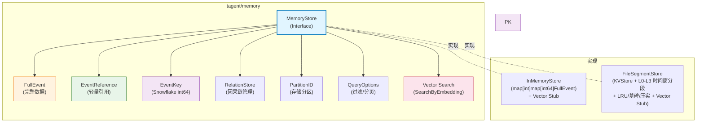
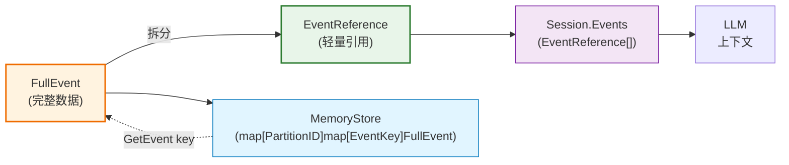
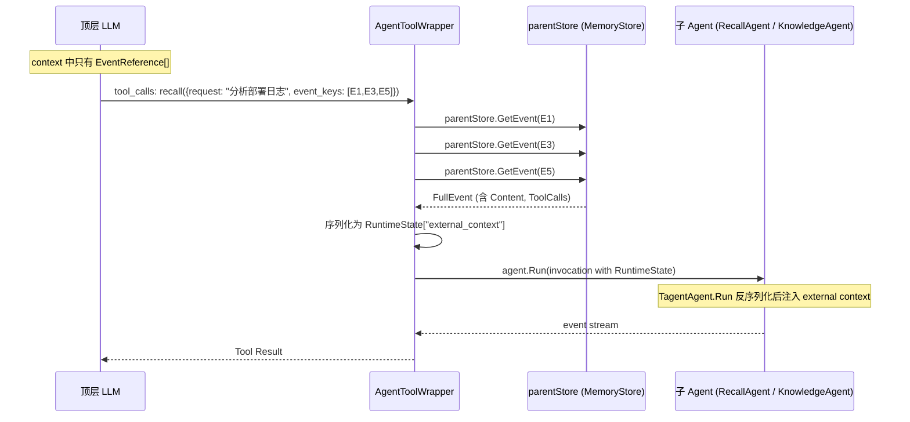
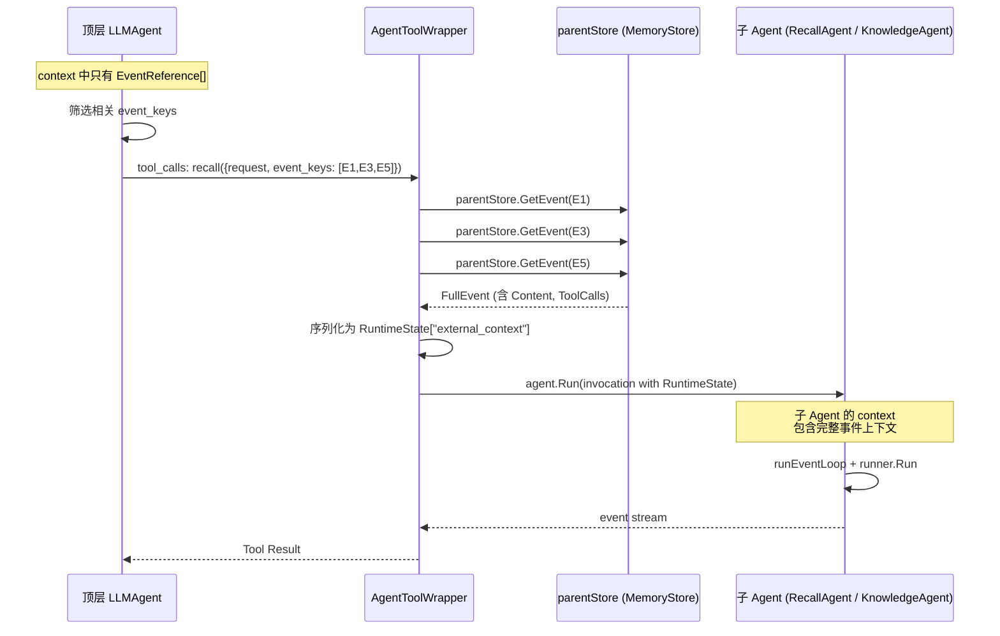
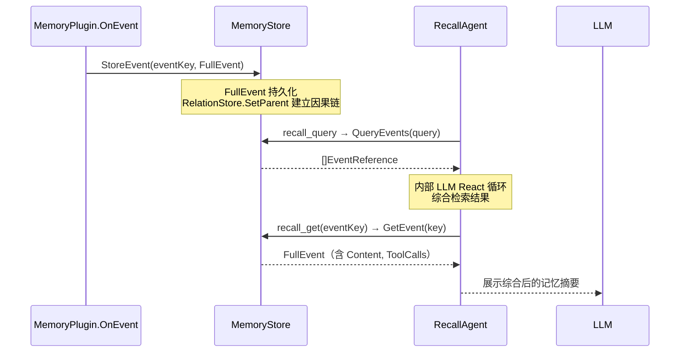
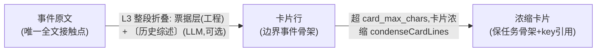
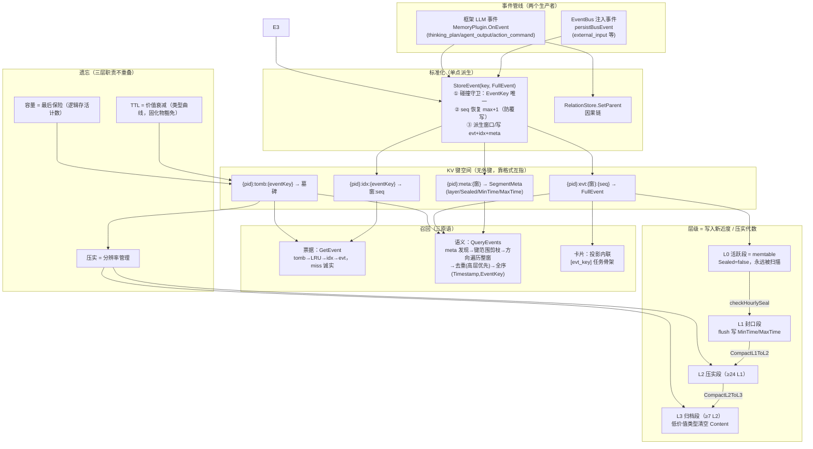
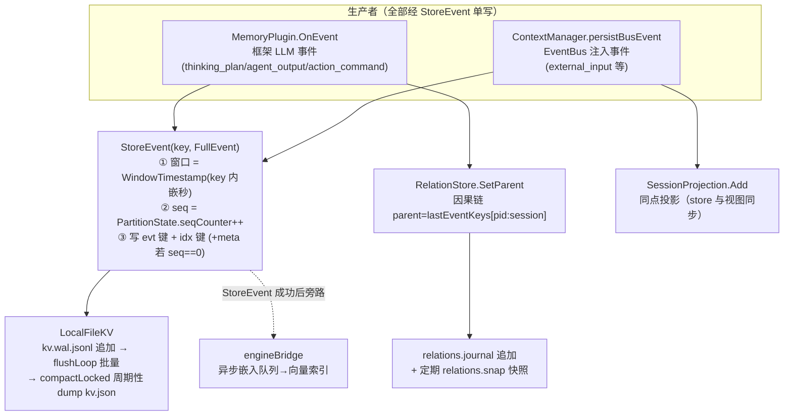
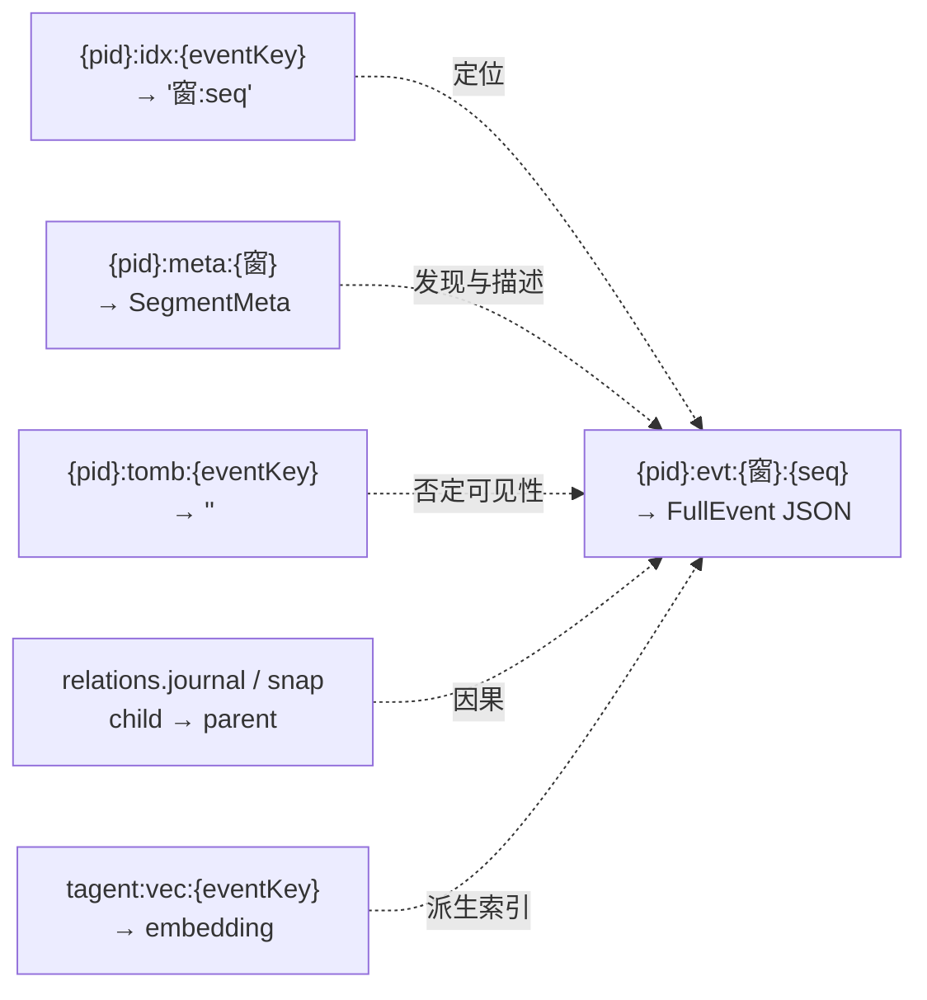
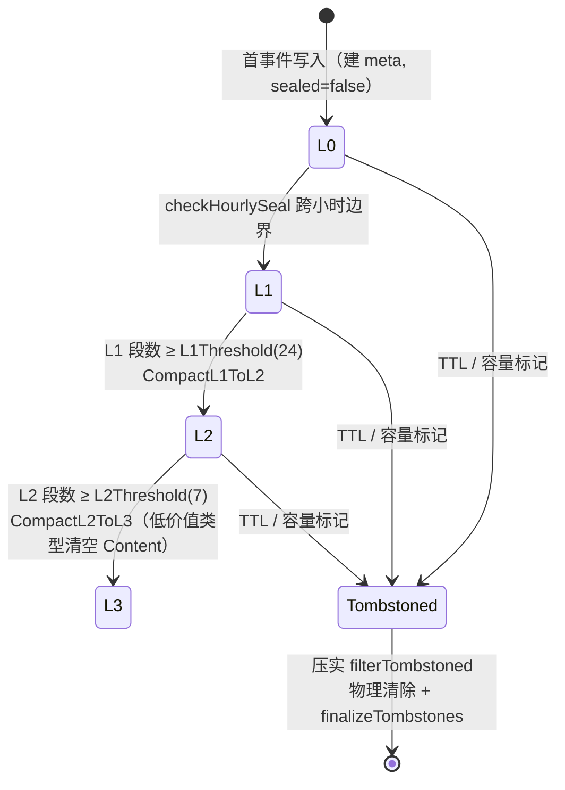

# tagent/memory 模块架构文档

<a id="overview"></a>
## 一、模块定位

`tagent/memory` 是 tagent 的**结构化事件存储层**，为 Agent 提供因果链追踪、按需精确检索、多维度查询能力。

**核心职责**：
- 定义 `FullEvent`（完整事件）和 `EventReference`（轻量引用）的数据结构
- 定义 `MemoryStore` 接口规范
- 提供 `InMemoryStore`（内存实现）和 `FileSegmentStore`（基于 KV store 的分层存储实现）
- 通过 `EventKey` 和 `RelationStore.SetParent` 构建有向因果事件链
- 向量搜索经 `engineBridge` 装饰器委托 `MemoryEngine`（T-A 解耦缝 C6）：配置 `memory.engine.embedding` 时接入 hybrid RRF 引擎，未配置时退化为 `ErrVectorSearchNotSupported`（详见 [platform 篇](../platform/platform-subsystems.md)）

**设计原则**：
- **信息隔离**：Session 只保存轻量引用（`EventReference`），完整数据在 MemoryStore
- **因果优先**：每个事件通过 `RelationStore.SetParent` 指向其前驱事件，支持因果回溯
- **视图独立**：压缩只修改 LLM 消息视图，不修改 MemoryStore 中的数据
- **引擎旁路**：向量索引是派生投影（事件不可变；遗忘物理删除时联动移除向量），不进存储同步点

---

## 二、文件清单

| 文件 | 职责 |
|------|------|
| `types.go` | 数据结构定义（FullEvent、EventReference、MemoryStore、QueryOptions、Snowflake EventKey）+ 向量搜索接口 |
| `in_memory_store.go` | 内存存储实现（测试/原型场景）+ 向量搜索空实现 |
| `segment_store.go` | 基于 KV store 的分层存储实现（L0/L1/L2/L3 时间窗分段） |
| `relation_store.go` | 因果链关系存储（SetParent/GetParent/GetChildren，LRU+可选 KV 持久化） |
| `compaction.go` | 分层压实调度（L1→L2→L3 自动压实；物理删除时联动移除向量） |
| `lifecycle.go` | TTL 生命周期管理（过期墓碑标记；TypeTTL 派生自 `event/registry.go` EventTypeSpec；consolidation/governance 与固化物同享豁免） |
| `tombstone.go` | 墓碑集管理（标记已删除事件） |
| `engine.go` | MemoryEngine 解耦缝契约 C6（IndexBuilder/Retriever + 可选面 RawVectorSearcher/StatsProvider/KVProvider/VectorRemover；**契约与数据类型居核心包——缝属于被缝两侧的公共依赖**） |
| `engine/`（子包） | **引擎适配器专区**：`engine/engine_bridge.go` 装饰器（StoreEvent 旁路索引；向量方法委托引擎，失败退回 inner）、`engine/engine_inmemory.go` MVP 内存引擎（异步嵌入队列 + hybrid RRF(k=60) + 分区过滤 + 向量 KV 持久化与启动重建）、`engine/engine_persist.go`（向量 KV 序列化）、`engine/diagnostics.go`（维度锚定诊断）。**新增引擎后端只进此子包** |
| `embedder/`（子包） | **嵌入供应商专区**：`embedder/mock.go`（确定性哈希向量）、`embedder/zhipu.go`（embedding-3，openai 兼容）、`embedder/traced.go`（GenAI semconv span+metric 装饰器）。契约 `Embedder` **居核心 `memory/embedder.go`**（接入指南见该文件注释——新增供应商三步：子包实现+组合根 case+无 key 优雅降级） |
| `consolidation.go` | 证据门控巩固：服务端 SHA1 收据指纹（LLM 不可伪造）+ 回放验证 |
| `error_tracking.go` | ErrorTrackingStore 最外层装饰：存储失败归因（memory/disk/rustviking）上报 DegradationManager |
| `mem_spill.go` | StoreEvent 失败兜底：事件落 JSONL，恢复后重放（GetEvent 预检幂等） |
| `kv/`（子包） | **KV 存储后端专区**：`kv/rustviking_client.go`（rustviking CLI 客户端，kv/index 真实契约，VectorInsert 预留）、`kv/local_file_kv.go`（JSON 文件 KV + WAL/快照）。**新增持久化后端只进此子包** |
| `kv.go` | KVStore 契约（KVPair/KVOp）+ 「接入新的记忆引擎」两路径指南（见 §二点五） |
| `key_schema.go` | 键空间模式契约（evt/idx/meta/tomb + `tagent:vec:` 向量前缀）——格式属于核心与各后端的公共词汇 |
| `query_keyword.go` | 关键词检索（term-split 匹配，hybrid 的关键词侧） |

---

## 二点五、拓展：接入新的记忆引擎

记忆有三类可替换面，契约全部居核心包 `memory`（`kv.go` 顶部附同样的指南），实现各居专属子包——**新后端永远不需要修改核心存储/压缩/事件代码**：

| 路径 | 目标 | 实现 | 接线点 |
|------|------|------|--------|
| A. KV 存储后端 | 换持久化底座（RocksDB-direct、Redis、Badger…），保留事件/检索全套语义 | `memory/kv/` 新文件实现 `memory.KVStore`（Put/Get/Delete/Scan/Range/Batch，键格式见 `key_schema.go`） | 根包 `resolveMemoryStore` 加 case + `MemoryConfig.Type` 校验登记 |
| B. 语义检索引擎 | 换向量/混合召回（Milvus、Qdrant、rustviking HNSW…） | `memory/engine/` 新文件实现 `memory.MemoryEngine`（C6 冻结契约：票据两段式、Ready 门控退化关键词、遗忘联动 RemoveVector） | 根包 `buildMemoryEngine` 加 case + `memory.engine` 配置 |
| C. 嵌入器 | 换/加 embedding 供应商 | `memory/engine/` 实现 `Embedder` 接口（或复用 zhipu/mock/traced） | `memory.engine.embedding.provider` 路由 |

**约束红线**（A/B 共享）：白盒测试文件不得 import 适配器子包（测试 import 环）——跨包协作测试一律黑盒（`package memory_test`）；适配器失败永不传染主链路（降级为关键词/透传）。

---

## 三、组件关系总览图


```mermaid
graph TB
    subgraph "tagent/memory"
        MS["MemoryStore\n(Interface)"]
        FE["FullEvent\n(完整数据)"]
        ER["EventReference\n(轻量引用)"]
        EK["EventKey\n(Snowflake int64)"]
        RS["RelationStore\n(因果链管理)"]
        PID["PartitionID\n(存储分区)"]
        QO["QueryOptions\n(过滤/分页)"]
        RAG["Vector Search\n(SearchByEmbedding)"]
    end

    subgraph "实现"
        IM["InMemoryStore\n(map[int]map[int64]FullEvent)\n+ Vector Stub"]
        FB["FileSegmentStore\n(KVStore + L0-L3 时间窗分段\n+ LRU/墓碑/压实 + Vector Stub)"]
    end

    MS --> FE
    MS --> ER
    MS --> EK
    MS --> RS
    MS --> PID
    MS --> QO
    MS --> RAG

    MS -.-|"实现"| IM
    MS -.-|"实现"| FB

    style MS fill:#e1f5ff,stroke:#0277bd,stroke-width:2px
    style FE fill:#fff3e0,stroke:#ef6c00
    style ER fill:#e8f5e9,stroke:#2e7d32
    style EK fill:#f3e5f5,stroke:#7b1fa2
    style PK fill:#f3e5f5,stroke:#7b1fa2
    style RAG fill:#fce4ec,stroke:#c2185b
```

---

## 四、核心数据结构

### 4.1 EventKey — Snowflake 64-bit 事件唯一标识符

**格式**（`memory/types.go`，snowflake-overflow-handling 修复后）：

```go
// EventKey is a 64-bit integer following a Snowflake-like layout:
//
//	┌────┬─────────────┬──────────────────┬─────────────┬────────────────┐
//	│ 63 │ 62       53 │ 52            22 │ 21       12 │ 11           0 │
//	│sign│ PartitionID │   Timestamp      │  Sequence   │   Reserved     │
//	│ =0 │ (10 bits)   │   (31 bits)      │  (10 bits)  │   (12 bits)    │
//	└────┴─────────────┴──────────────────┴─────────────┴────────────────┘
//
// bit 63 恒为 0（符号位保护）：正 key = 真实事件，负 key 保留给投影内的
// 压缩摘要引用（rolling summaryRef）。partitionIDMask=0x3FF（10 位，0-1023）。
// Timestamp: seconds since snowflakeEpoch (~68 year range).
// Sequence: per-second counter (0-1023), sub-second uniqueness.
```

> **历史教训**：早期 mask 为 11 位（0x7FF）时 partition≥1024 会触及符号位产生负 key，
> 导致全部 `EventKey>0` 守卫失效（plan 全链路失明）。现 10 位 mask + 回归测试
> `TestSnowflakeEventKey_AlwaysPositive` 锁定。

**字符串形态**：EventKey 对 LLM/工具的展示与入参统一为 **16 进制**（`event.FormatEventKey/ParseEventKey`，负号保留给摘要引用），存储层仍为 int64。

**生成函数**（`memory/types.go`，含 NTP 时钟回拨钉住 `snowflakeSeqLast` 与 explicit 判定——渲染冻结全窗锚定依赖 key 单调性，详见源码）：

```go
func NewSnowflakeEventKey(partitionID int, nowMs int64) int64 {
    if nowMs <= 0 {
        nowMs = time.Now().UnixMilli()  // 0 = 使用当前时间
    }
    ts := nowMs/1000 - snowflakeEpoch

    // 内部互斥锁保护的 per-partition Sequence 计数器
    snowflakeSeqMu.Lock()
    if ts == snowflakeSeqLast[partitionID] {
        snowflakeSeqCnt[partitionID]++
    } else {
        snowflakeSeqCnt[partitionID] = 0
        snowflakeSeqLast[partitionID] = ts
    }
    seq := snowflakeSeqCnt[partitionID]
    snowflakeSeqMu.Unlock()

    return (int64(partitionID&partitionIDMask) << partitionIDShift) |
        ((ts & timestampMask) << timestampShift) |
        (int64(seq&sequenceMask) << sequenceShift)
}
```

**解析函数**：

```go
func PartitionIDFromEventKey(key int64) int    // 提取 PartitionID
func TimestampFromEventKey(key int64) int64    // 提取时间戳（秒）
func SequenceFromEventKey(key int64) int       // 提取序列号
```

**特点**：
- **内含分区信息**：从 EventKey 可直接反推 PartitionID，无需额外索引
- **时间有序**：高位为时间戳，按 time.Unix 单调递增
- **全局唯一**：内部 mutex 保护的 per-partition Sequence 计数器保证同秒内唯一
- **零值语义**：`0` 表示无前驱（RelationStore 中 parent=0 表示根事件）
- **第二个参数是时间提示**：`nowMs`（毫秒时间戳），传 0 使用当前时间，非零用于测试确定性生成

### 4.2 FullEvent — 完整事件（MemoryStore 的唯一事实来源）

```go
// memory/types.go
type FullEvent struct {
    EventKey     int64                  // Snowflake int64 唯一标识符
    PartitionID  int                    // 存储分区 key（从 AgentName 派生）
    EventType    string                 // 事件类型（external_input / agent_output / ...）
    EventSummary string                 // event_summary 元数据视图（原文视图，非内容总结）
    Timestamp    int64                  // Unix 毫秒时间戳
    Content      string                 // 原始文本内容
    ToolCalls    []model.ToolCall       // 工具调用列表
    ToolID       string                 // 工具结果事件所应答的 tool_call id（D3 原生配对契约，跨存储→解析保持配对）
    ToolResults  map[string]interface{} // 工具执行结果
    Metadata     map[string]string      // 额外元数据（如 source_keys/content_hash 固化物溯源）
    Response     *model.Response        // LLM 响应快照（可选）
}
```

**用途**：MemoryStore 中存储的完整事件数据，永不修改（immutable）。可通过 `EventKey` 精确检索。`Response` 字段保存 LLM 响应快照，供 Trajectory 采集等下游模块使用。

### 4.3 EventReference — 轻量引用（Session 中的 LLM 上下文）

```go
// memory/types.go
type EventReference struct {
    EventKey     int64  `json:"event_key"`              // Snowflake int64 指向 MemoryStore 的 key
    PartitionID  int    `json:"partition_id,omitempty"` // 存储分区 key
    EventType    string `json:"event_type"`             // 事件类型
    EventSummary string `json:"event_summary"`          // event_summary 视图（渲染素材）⭐
    Timestamp    int64  `json:"timestamp"`              // 时间戳
    Role         string `json:"role,omitempty"`         // 原始消息 role（时间线渲染的 role 归属依据）
}
```

**用途**：
- Session 侧仅保存轻量引用，不保存完整事件详情（**信息隔离设计**）
- `EventSummary` 字段直接进入 LLM 消息上下文，供 LLM 理解历史
- 通过 `EventKey` 可随时从 MemoryStore 拉取完整详情（AgentToolWrapper / RecallAgent 机制）

### 4.4 FullEvent 与 EventReference 的关系


```mermaid
graph LR
    FullEvent["FullEvent\n(完整数据)"]
    EventReference["EventReference\n(轻量引用)"]
    Memory["MemoryStore\n(map[PartitionID]map[EventKey]FullEvent)"]
    Session["Session.Events\n(EventReference[])"]
    LLM["LLM\n上下文"]

    FullEvent -->|拆分| EventReference
    FullEvent --> Memory
    EventReference --> Session
    Session --> LLM
    Memory -.->|GetEvent key| FullEvent

    style FullEvent fill:#fff3e0,stroke:#ef6c00,stroke-width:2px
    style EventReference fill:#e8f5e9,stroke:#2e7d32,stroke-width:2px
    style Memory fill:#e1f5ff,stroke:#0277bd
    style Session fill:#f3e5f5,stroke:#7b1fa2
```

| 字段 | FullEvent | EventReference |
|------|-----------|---------------|
| `EventKey` | ✅ int64 | ✅ int64 |
| `PartitionID` | ✅ int | ✅ int |
| _(ParentKey 已移除)_ | 因果关系由 `RelationStore` 维护 | — |
| `EventType` | ✅ | ✅ |
| `EventSummary` | ✅ | ✅ |
| `Role` | —（经 Response 推断） | ✅（渲染 role 归属） |
| `Content` | ✅（原文） | ❌ |
| `ToolCalls` / `ToolID` | ✅（原生配对契约） | ❌ |
| `Response` | ✅ | ❌ |

**关键区别**：Session 中的 `EventReference` 不包含 `Content`、`ToolCalls` 和 `Response`，LLM 看到的只是 `EventSummary`。完整数据通过 AgentToolWrapper（event_key 解析）或 RecallAgent（跨 Session 检索）按需从 MemoryStore 拉取。

---

## 五、因果链机制

### 5.1 RelationStore 因果链语义

ParentKey 已从 FullEvent 结构体中移除。因果关系由独立的 `RelationStore` 维护。

`InMemoryStore` 和 `FileSegmentStore` 都直接嵌入 `RelationStore`，同时实现 `RelationStoreProvider` 接口。调用方式有两种：

```go
// 方式一：直接调用（InMemoryStore/FileSegmentStore 直接实现这些方法）
memStore.SetParent(eventKey, parentKey)
parent := memStore.GetParent(eventKey)
children := memStore.GetChildren(eventKey)

// 方式二：通过 RelationStoreProvider 接口（兼容其他实现）
if rsp, ok := memStore.(memory.RelationStoreProvider); ok {
    rsp.RelationStore().SetParent(eventKey, parentKey)
    parent := rsp.RelationStore().GetParent(eventKey)
    children := rsp.RelationStore().GetChildren(eventKey)
}
```

因果链效果（通过独立的 RelationStore 管理 Parent-Child 关系；示例为 int64 存储形态，对 LLM 展示时统一 hex）：

```
1777198738547555000 (Event 1)
  RelationStore: parent=0  (无前驱)

1777198739574803000 (Event 2)
  RelationStore: parent=1777198738547555000  → 父 = Event 1

1777198739760667000 (Event 3)
  RelationStore: parent=1777198739574803000  → 父 = Event 2
```

### 5.2 因果链的作用

| 能力 | 说明 |
|------|------|
| **因果回溯** | 从当前事件沿 `RelationStore.GetParent()` 回溯历史事件 |
| **分支追踪** | 支持多分支因果（通过 `RelationStore.GetChildren()`） |
| **压缩通知** | 压缩通知中可引用被丢弃的因果链 |
| **RecallAgent** | 按因果顺序展示检索结果 |

### 5.3 因果链与压缩的关系

```
FullEvent 存储因果链 → Session.EventReference 不含因果链
    ↓                                    ↓
压缩时因果链保留在 MemoryStore    LLM 视图通过 SmartCompress 处理
    ↓
RecallAgent 可沿因果链回溯原始事件
```

**关键**：压缩只修改发给 LLM 的消息视图，不修改 MemoryStore 和 RelationStore。因果关系在整个生命周期中保持不变。

---

## 六、MemoryStore 接口

### 6.1 接口定义

```go
// memory/types.go
type MemoryStore interface {
    // === 写操作 ===
    StoreEvent(key int64, event FullEvent) error

    // === 读操作 ===
    GetEvent(key int64) (*FullEvent, error)
    GetEvents(keys []int64) ([]FullEvent, error)
    QueryEvents(query QueryOptions) ([]EventReference, error)

    // === 向量搜索 ===
    // 裸实现返回 ErrVectorSearchNotSupported；engineBridge 装饰后委托 MemoryEngine
    SearchByEmbedding(query []float32, topK int) ([]EventReference, error)
    StoreEventWithEmbedding(key int64, event FullEvent, embedding []float32) error
    SupportsVectorSearch() bool

    // === 管理操作 ===
    DeleteEvent(key int64) error
    GetStats() StoreStats
}

// ErrVectorSearchNotSupported — 向量搜索不支持时返回此错误（memory/types.go）
var ErrVectorSearchNotSupported = fmt.Errorf("vector search not supported")
```

### 6.1.1 RelationStoreProvider — 因果关系接口

```go
// memory/types.go
type RelationStoreProvider interface {
    RelationStore() RelationStore
}

// 编译时接口实现检查
var (
    _ RelationStoreProvider = (*InMemoryStore)(nil)
    _ RelationStoreProvider = (*FileSegmentStore)(nil)
)
```

**使用方式**：

```go
// 写入因果关系（MemoryPlugin.OnEvent 中）
if parentKey != 0 {
    memStore.SetParent(eventKey, parentKey)
}

// 查询因果关系
parent := memStore.GetParent(eventKey)
children := memStore.GetChildren(eventKey)
```

`MemoryPlugin.OnEvent` 实际使用 `SetParent`（通过 `RelationStoreProvider` 接口做类型断言后调用）。

**设计原则**：内容与关系分离。`FullEvent` 存储不可变的事件内容，`RelationStore` 维护可变的因果关系。`InMemoryStore` 和 `FileSegmentStore` 直接嵌入 `RelationStore`；第三方实现可通过 `RelationStoreProvider` 接口暴露因果能力。

### 6.2 QueryOptions — 查询过滤

```go
// memory/types.go
type QueryOptions struct {
    PartitionID  int      // 单个分区过滤（0 = 不过滤）
    PartitionIDs []int    // 多分区过滤（优先级高于 PartitionID）
    EventTypes   []string // 按事件类型过滤（空 = 全部）
    StartTime    int64    // 时间范围起始（毫秒，0 = 无限制）
    EndTime      int64    // 时间范围结束（毫秒，0 = 无限制）
    Limit        int      // 最大返回数量（0 = 无限制）
    Offset       int      // 分页偏移
    OrderBy      string   // "timestamp_asc" 或 "timestamp_desc"
    Keyword      string   // 按关键词过滤 EventSummary 或 Content（大小写不敏感，空 = 不过滤）
}
```

**注意**：`QueryEvents` 始终返回 `[]EventReference`（轻量），不返回完整 `FullEvent`，避免大量 IO 开销。

**查询语义契约**（segment-query-recency）——两个 store 实现（`InMemoryStore` / `FileSegmentStore`）对同一 `QueryOptions` 返回一致结果：

| 契约 | 含义 |
|------|------|
| 声明式语义 | 结果 ≡ 全集过滤 → 全序排序 → offset/limit；分段、窗口剪枝、早停均为**优化**，不改变可观察结果 |
| 全序确定性 | 排序键为 `(Timestamp, EventKey)`——同毫秒事件（并行工具调用常见）以 EventKey 决胜，任意实现/任意两次查询逐位一致 |
| 最新优先 | `timestamp_desc` 下 limit 截断只牺牲最旧、永不牺牲最新——召回的时间箭头与压缩同向（压缩丢旧留新，召回必须新先于旧） |
| 身份唯一 | 压实"先写目标层、后删源层"的崩溃窗口内同一事件可能双层并存；查询按 EventKey 去重，且**方向无关地**保留更高 layer 版本 |

`FileSegmentStore` 的实现要点：窗口发现阶段从 meta 扫描解析 `(windowTS, layer)`（layer 决定剪枝跨度：L0/L1 = 1h、L2 = 1d、L3 = 1w），按查询方向遍历窗口；窗内 `seq` 是字符串序而非时间序，故收集以**整窗**为粒度，早停只跳过时间上不可能贡献结果的窗口。

### 6.3 StoreStats — 存储统计

```go
// memory/types.go
type StoreStats struct {
    TotalEvents int   // 事件总数
    StorageSize int64 // 存储大小（字节）
    DataDir     string // 数据目录（InMemory = ":memory:"）
}
```

---

## 七、InMemoryStore 实现

### 7.1 数据结构

```go
// memory/in_memory_store.go
type InMemoryStore struct {
    mu     sync.RWMutex
    events map[int]map[int64]FullEvent  // [partitionID][eventKey]
    rel    RelationStore                // 嵌入的因果链存储
}
```

### 7.2 存储结构

```
InMemoryStore
  └── events: map[int]map[int64]FullEvent
        ├── PartitionID 0
        │     ├── 1777198738547555000 → FullEvent{...}
        │     └── 1777198739574803000 → FullEvent{...}
        └── PartitionID 1
              └── 1777198739760667000 → FullEvent{...}
```

### 7.3 特性总结

| 特性 | 说明 |
|------|------|
| 数据结构 | Go `map[int]map[int64]FullEvent`，按 PartitionID 分区保存在内存 |
| 持久化 | **无**（进程退出即丢失） |
| 适用场景 | 测试、短期原型、单进程开发 |
| 读写性能 | O(1) 读写，无 IO 开销 |
| 并发安全 | `sync.RWMutex`（读多写少优化） |
| `GetStats()` | `DataDir = ":memory:"`，`StorageSize` 不统计 |
| 向量搜索 | **空实现**：返回 `ErrVectorSearchNotSupported` |

### 7.4 额外方法

除 `MemoryStore` 接口外，`InMemoryStore` 还提供了扩展方法：

| 方法 | 说明 |
|------|------|
| `AllEvents()` | 返回所有事件（按时间排序），用于测试和调试 |
| `AllEventsByPartition(partitionID)` | 返回指定分区的所有事件 |
| `GetParent(key)` / `GetChildren(key)` / `SetParent(key, parentKey)` | 直接操作嵌入的因果链 |
| `RelationStore()` | 返回内部 RelationStore |
| `SearchByEmbedding()` | **向量搜索（空实现）**：返回 `ErrVectorSearchNotSupported` |
| `StoreEventWithEmbedding()` | **向量存储（空实现）**：忽略 embedding，仅存储事件 |
| `SupportsVectorSearch()` | 返回 `false` |

---

## 八、FileSegmentStore 实现

### 8.1 数据结构（KV + 分段模型）

```go
// memory/segment_store.go
type FileSegmentStore struct {
    kv         KVStore       // RustViking KV 客户端 / 本地 JSON KV（localfile）/ mock
    rel        RelationStore // 因果关系图
    tombstones *TombstoneSet // 墓碑集（死事件过滤）
    cache      *simpleLRU    // FullEvent LRU 缓存（默认 1000 条）
    dataDir    string
    partitions sync.Map      // map[int]*PartitionState（每分区窗口/序列状态）

    // 生命周期组件（可选，Set* 注入）
    lifecycle *LifecycleManager // TTL 墓碑标记（固化物豁免）
    compactor *Compactor        // L1→L2→L3 分层压实
}
```

### 8.2 分层分段模型

**segment 是按时间窗（window_ts）的逻辑分组，不是物理文件**：

| 层 | 语义 | 写入方式 |
|----|------|---------|
| L0（热） | 当前时间窗事件 | 直写 KV |
| L1（温） | 已过窗封存段（sealed） | 封存时更新 SegmentMeta |
| L2/L3（冷） | Compactor 自动压实的更冷段 | `compaction.go` 调度 |

```go
type SegmentMeta struct {
    PartitionID int   // 分区
    WindowTS    int64 // 时间窗起点
    Layer       int   // 1=L1(sealed), 2=L2, 3=L3
    EventCount  int
    MinTime     int64
    MaxTime     int64
    Sealed      bool
}
```

KV key 由 `SegmentEventPrefix(pid, windowTS)` 派生，按分区+时间窗前缀扫描；读路径先走 LRU 缓存，miss 后按 EventKey 内含的 PartitionID+Timestamp 定位窗口。

### 8.3 特性总结

| 特性 | 说明 |
|------|------|
| 存储模型 | KVStore（RustViking / 本地 JSON KV）+ 时间窗分段 + SegmentMeta |
| 持久化 | **有**（进程重启后数据不丢失） |
| 适用场景 | 生产环境（`type: file` 走 RustViking；`type: localfile` 零外部依赖） |
| 读性能 | LRU 缓存 + EventKey 直接定位（分区/窗口内查找） |
| 生命周期 | TombstoneSet + LifecycleManager（TTL，固化物豁免）+ Compactor（分层压实） |
| 并发安全 | 每分区 PartitionState 独立锁 + store 级同步 |
| 向量搜索 | **空实现**：返回 `ErrVectorSearchNotSupported` |

## 九、两种实现的对比

| 维度 | InMemoryStore | FileSegmentStore |
|------|--------------|-------------|
| **数据结构** | Go map | KVStore + 时间窗分段（L0-L3）+ SegmentMeta |
| **持久化** | 无 | 有（RustViking KV 或本地 JSON KV） |
| **进程重启** | 数据丢失 | 数据保留 |
| **适用场景** | 测试、原型 | 生产环境 |
| **读性能** | O(1) | LRU 缓存 + EventKey 定位（分区/窗口） |
| **生命周期** | 无 | Tombstone + TTL（固化物豁免）+ 分层压实 |
| **扩展性** | 受内存限制 | 受磁盘限制；冷段压实控制放大 |
| **向量搜索** | 空实现 | 空实现 |

---

## 十、向量搜索支持

### 10.1 现状：MemoryEngine 已落地（T-A）

向量检索经 C6 解耦缝接入：`resolveMemoryStore → wireMemoryEngine（配置 `memory.engine.embedding` 时包 engineBridge，未配置原样返回）→ ErrorTrackingStore`（冻结契约 C2 装饰顺序）。引擎为 MVP 内存实现（InMemoryEngine）：异步嵌入队列（选择性生成 external_input/agent_output）→ 向量 KV 持久化（`tagent:vec:` 前缀）→ 启动异步重建（Ready 门控，窗口期退化关键词）。recall query 模式融合：向量 topK ∪ 关键词 topK → RRF(k=60)，逐跳降级保底关键词。实测（zhipu embedding-3）：512 维分离度 ≈ 1024 维，默认推荐 512。细节见 [platform 篇](../platform/platform-subsystems.md)。

### 10.2 向量搜索方法说明

| 方法 | 说明 | 实现 |
|------|------|------|
| `SearchByEmbedding(query []float32, topK int)` | 余弦相似度 topK | engineBridge 委托引擎 RawVectorSearcher；裸 store 返回 `ErrVectorSearchNotSupported` |
| `StoreEventWithEmbedding(key, event, embedding)` | 保留接口位 | 引擎走旁路索引（不入此方法） |
| `SupportsVectorSearch()` | 能力探测 | 引擎就绪且配置开启时 true |

### 10.3 扩展方向

rustviking 原生 `index insert/search/delete` CLI 为预留后端（VectorInsert 现无生产调用方，`-l` level 语义待实测）；接入前须对真实二进制做契约探索。

---


---

## 附：回执-反馈绑定（feedback）

`feedback` 事件类型（EventTypeSpec 注册：正 key、Role=system、TTL 默认 30 天、可召回、
不可嵌入）把「评价」绑定到具体产出事件：

- **BindFeedback**（memory/feedback.go）：写 feedback 事件（Content=结构化 JSON
  verdict/rating/note/source/parent_key）+ RelationStore.SetParent 因果边（零新索引）；
  **继承 parent 的 bundle_id 章**（guardrail 沿因果边精确 join 到产出 bundle，不回退时间窗）；
  parent 不存在 → 显式错误（不允许对幻觉产出反馈）；sentinel 双错误（ParentNotFound /
  EdgePartial）供调用方区分 404 与 201+warning。
- **来源**：① OnSettle——task_settled 落库后自动绑定确定性裁决（completed→positive /
  failed→negative；suspect/alive-detached **不写**，防噪声污染 guardrail）；② `POST /feedback`
  （rl HTTPAPI，hex event_key + verdict + note）；③ 自评来源不做（随冥想智能化后续）。
- **消费**：MetricGuardrail canary 窗口 `negative_feedback_rate` 判据（MaxNegFbRate，
  0=默认 0.3、负值=显式禁用）；verdict 同时冗余入 Metadata（消费侧不依赖 JSON 序列化格式）。
- **白名单**（examples）：消息通道批准仅 `app.wechat.approvers` 白名单用户生效——
  agent 永远无批准权，批准是人的动作。

## 十一、与其他模块的关系

### 11.1 依赖关系

```
tagent/memory（存储层）
    ↑
    │  提供 FullEvent 存储和检索
    │
tagent/plugin
    └── MemoryPlugin → StoreEvent / GetEvent

tagent/agent
    ├── AgentToolWrapper → parentStore.GetEvent (核心高频读取)
    └── SmartCompress（不直接依赖，但因果链信息来自 MemoryStore）

tagent/tool
    ├── recall（统一召回入口，参数即路由：items 票据直达 / turn_key 因果链重建 / query 检索 / orchestrate 保留形态；收敛自 memory_recall+memory_turn+recall 子 agent，见 16.11）
    ├── RecallAgent → recall_query / recall_get / recall_recent / recall_trace（orchestrate 分支的内部编排引擎）
    └── KnowledgeAgent → memory_query（上下文感知搜索）

tagent (root)
    └── tagent.New() 接线时注入 parentMemStore
```

### 11.2 MemoryPlugin 是主要写入方

`MemoryPlugin.OnEvent` 每次事件都会调用 `memStore.StoreEvent`：

```go
// plugin/memory_plugin.go
if p.memStore != nil {
    if err := p.memStore.StoreEvent(eventKey, fullEvent); err != nil {
        log.Errorf("[Memory] store failed key=%d partition=%d: %v", eventKey, partitionID, err)
    } else {
        if parentKey != 0 {
            if rsp, ok := p.memStore.(memory.RelationStoreProvider); ok {
                if err := rsp.RelationStore().SetParent(eventKey, parentKey); err != nil {
                    log.Errorf("[Memory] set parent failed key=%d parent=%d: %v", eventKey, parentKey, err)
                }
            }
        }
        log.Debugf("[Memory] stored key=%d partition=%d type=%s summary_len=%d",
            eventKey, partitionID, eventType, len(eventSummary))
    }
}
```

### 11.3 MemoryStore 的多方读取模式

MemoryStore 的读取方按频率和场景分层：

| 读取方 | 频率 | 场景 |
|--------|------|------|
| **AgentToolWrapper** | 🔥 最高频 | 顶层 LLM 筛选 `event_keys` → 传给子 tool → Wrapper 从 `parentStore` 取完整 `FullEvent` → 注入子 Agent 作为上下文 |
| **recall** 统一召回入口 | 高频 | 参数即路由：`items=[{key,hint?}]` 票据精确回补（未命中显式 miss）/ `turn_key` 因果链重建 / `query` 关键词检索——确定性路径无 LLM 中间层（见 wiki/tool §六） |
| **RecallAgent** 子工具 | 中频 | 复杂检索/多跳编排：`recall_query`（条件查询）、`recall_get`（按 key 取详情）、`recall_recent`（最近 N 条）、`recall_trace`（因果链回溯） |
| **KnowledgeAgent** 子工具 | 低~中频 | 通过 `memory_query` 从父级 MemoryStore 查历史，辅助技能/MCP 搜索 |
| **直接访问** (`TagentAgent.MemStore()`) | 调试/测试 | 开发阶段手工查事件 |

---

#### AgentToolWrapper — 核心读取路径

**为什么是核心**：顶层 LLM 的上下文只有 `EventReference[]`（轻量摘要），不包含 `Content` 和 `ToolCalls`。当 LLM 需要子 Agent 处理某段历史时，它筛选出相关 `event_keys` 作为工具参数传递。`AgentToolWrapper.Call()` 拦截调用，通过 `parentStore.GetEvent(key)` 逐个取出完整 `FullEvent`，序列化为 `RuntimeState["external_context"]` 后通过 `agent.Run()` 传递给子 Agent。


```mermaid
sequenceDiagram
    participant LLM as 顶层 LLM
    participant ATW as AgentToolWrapper
    participant MS as parentStore (MemoryStore)
    participant SA as 子 Agent (RecallAgent / KnowledgeAgent)

    Note over LLM: context 中只有 EventReference[]
    LLM->>ATW: tool_calls: recall({request: "分析部署日志", event_keys: [E1,E3,E5]})
    ATW->>MS: parentStore.GetEvent(E1)
    ATW->>MS: parentStore.GetEvent(E3)
    ATW->>MS: parentStore.GetEvent(E5)
    MS-->>ATW: FullEvent (含 Content, ToolCalls)
    ATW->>ATW: 序列化为 RuntimeState["external_context"]
    ATW->>SA: agent.Run(invocation with RuntimeState)
    Note over SA: TagentAgent.Run 反序列化后注入 external context
    SA-->>ATW: event stream
    ATW-->>LLM: Tool Result
```

**设计要点**：LLM 只传递 `int64` 数字 key，**实际事件内容在服务端解析**，既保证了上下文完整性，又不让 LLM 突破信息隔离边界（LLM 从未见到被压缩掉的 `Content`/`ToolCalls`）。

---

#### RecallAgent — 超越当前会话的深层检索

`RecallAgent` 的独特价值不在"读 MemoryStore"（那是 AgentToolWrapper 的职责），而在**跨 Session 的语义记忆召回**。

顶层 LLM 的 context 已包含当前 Session 的 `EventReference[]` 流。当需要的信息**超出当前 context 窗口**或**跨越多个历史 Session** 时，LLM 调用 RecallAgent。RecallAgent 的内部 LLM React 循环负责：

1. **理解查询意图** — 将自然语言转为结构化检索条件
2. **多工具协作** — `recall_query` 检索 → `recall_get` 按需取详情（含父事件） → `recall_recent` 补充最新事件 → `recall_trace` 因果链回溯
3. **跨事件综合** — 将零散历史事件综合为连贯的记忆摘要

其子工具 `recall_get` 通过 `EventKey` 从 MemoryStore 拉取完整事件详情：

```go
// tool/recall_subtools.go — NewRecallGetTool
func NewRecallGetTool(accessor MemoryStoreAccessor) tool.Tool {
    return function.NewFunctionTool(
        func(ctx context.Context, args recallGetArgs) (recallGetResult, error) {
            // args.Key 为 canonical hex 字符串（与 [evt_...] 前缀一致）
            key, err := event.ParseEventKey(args.Key)
            if err != nil || key == 0 {
                return recallGetResult{}, fmt.Errorf("event key is required (hex string)")
            }

            evt, err := accessor.GetEvent(key)
            if err != nil {
                return recallGetResult{}, fmt.Errorf("event not found: %w", err)
            }

            result := recallGetResult{
                Key:       evt.EventKey,

                Type:      evt.EventType,
                Summary:   evt.EventSummary,
                Content:   evt.Content,
                Time:      formatTimestamp(evt.Timestamp),
            }

            // Optionally include parent event summary
            // 通过 RelationStore 获取父事件
            if args.IncludeParent {
                var parentKey int64
                if rsp, ok := accessor.(memory.RelationStoreProvider); ok {
                    parentKey = rsp.RelationStore().GetParent(evt.EventKey)
                }
                if parentKey != 0 {
                    if parent, err := accessor.GetEvent(parentKey); err == nil && parent != nil {
                    result.Parent = &parentEventInfo{...}
                }
            }

            return result, nil
        },
        function.WithName("recall_get"),
        function.WithDescription("Get full details of a specific event by its key. Set include_parent=true to also include the parent event summary."),
    )
}
```

**RecallAgent 子工具**（通过 `RegisterSubTools()` 注册为 plain tool）：
- `recall_query`：按查询条件检索事件列表，支持时间范围过滤，自动注入 `ReadPartitionIDs`
- `recall_get`：根据 event_key 获取完整事件详情，支持 `include_parent` 参数自动包含父事件摘要
- `recall_recent`：快速获取最近的 N 条事件，支持时间范围过滤，自动注入 `ReadPartitionIDs`
- `recall_trace`：沿 RelationStore 因果链回溯，从指定事件追溯最多 20 步历史

> **自动注入机制**：`recall_query` 和 `recall_recent` 的 factory 从 `PlainToolFactoryConfig.ReadPartitionIDs` 获取分区列表，handler 内部自动注入到 `QueryOptions.PartitionIDs`。LLM 调用时只需传语义参数，无需感知分区号。详见 [tool-architecture.md](../tool/tool-architecture.md) §六。

### 11.4 完整数据流

MemoryStore 有两条主要读取路径：**AgentToolWrapper**（核心高频，LLM 选 key → Wrapper 解析）和 **RecallAgent**（跨 Session 深层检索）。

#### 路径一：AgentToolWrapper（核心高频）


```mermaid
sequenceDiagram
    participant LLM as 顶层 LLMAgent
    participant ATW as AgentToolWrapper
    participant MS as parentStore (MemoryStore)
    participant SA as 子 Agent (RecallAgent / KnowledgeAgent)

    Note over LLM: context 中只有 EventReference[]
    LLM->>LLM: 筛选相关 event_keys
    LLM->>ATW: tool_calls: recall({request, event_keys: [E1,E3,E5]})
    ATW->>MS: parentStore.GetEvent(E1)
    ATW->>MS: parentStore.GetEvent(E3)
    ATW->>MS: parentStore.GetEvent(E5)
    MS-->>ATW: FullEvent (含 Content, ToolCalls)
    ATW->>ATW: 序列化为 RuntimeState["external_context"]
    ATW->>SA: agent.Run(invocation with RuntimeState)
    Note over SA: 子 Agent 的 context<br/>包含完整事件上下文
    SA->>SA: runEventLoop + runner.Run
    SA-->>ATW: event stream
    ATW-->>LLM: Tool Result
```

#### 路径二：RecallAgent 跨 Session 深层检索


```mermaid
sequenceDiagram
    participant MP as MemoryPlugin.OnEvent
    participant MS as MemoryStore
    participant RA as RecallAgent
    participant LLM as LLM

    MP->>MS: StoreEvent(eventKey, FullEvent)
    Note over MS: FullEvent 持久化<br/>RelationStore.SetParent 建立因果链

    RA->>MS: recall_query → QueryEvents(query)
    MS-->>RA: []EventReference
    Note over RA: 内部 LLM React 循环<br/>综合检索结果

    RA->>MS: recall_get(eventKey) → GetEvent(key)
    MS-->>RA: FullEvent（含 Content, ToolCalls）
    RA-->>LLM: 展示综合后的记忆摘要
```

---

## 十二、PartitionID 派生

### 12.1 PartitionIDFromName — 从名称派生稳定分区 ID

```go
// memory/types.go
func PartitionIDFromName(name string) int
```

使用 FNV-1a 哈希将名称（如 AgentName）映射为 **0-1023** 之间的稳定 PartitionID（与雪花键 10 位分区域一致，bit63 恒 0）。相同名称总是产生相同 PartitionID，使用 `sync.Map` 缓存。

### 12.2 NewPartitionID — 无名称时的唯一分区 ID

```go
// memory/types.go
func NewPartitionID() int
```

当没有稳定名称可用时，使用原子计数器生成全局唯一的 PartitionID。

---

## 十三、跨命名空间读权限（ReadNamespaces）

### 13.0 设计背景

RecallAgent 的子工具操作的是自身 MemoryStore，而历史事件由顶层 Agent（如 tagent）写入。当 RecallAgent 需要检索顶层 Agent 的历史事件时，需要跨命名空间的读权限。

**设计方案**：`MemoryConfig.ReadNamespaces` 字段声明本 Agent 可读取的其他 Agent 命名空间。`buildAgent()` 在初始化时将其转换为 `ReadPartitionIDs []int`，通过 `buildPlainToolRef` → `PlainToolFactoryConfig.ReadPartitionIDs` 注入到每个 plain tool factory。

```yaml
# 配置示例
recall:
  memory:
    type: file
    path: .wechat-config/agent-events
    read_namespaces:
      - tagent         # 可读 tagent 的分区
```

**转换链路**：

```
tagent.yaml → ReadNamespaces: ["tagent"]
  → buildAgent() → memory.PartitionIDFromName("tagent") → [144]
  → buildPlainToolRef() → PlainToolFactoryConfig.ReadPartitionIDs: [144]
  → recallQueryFactory(cfg) → handler 内注入 opts.PartitionIDs
  → recallRecentFactory(cfg) → handler 内注入 opts.PartitionIDs
  → LLM 调用 recall_query({query: "部署"}) → 实际查询分区 144
```

<a id="store-instance-sharing"></a>
### 13.0.1 MemoryStore 实例共享策略

`resolveMemoryStore()`（定义在 `tagent.go`）根据 `MemoryConfig.Type` 选择存储实现：

- `type: memory` / 空：创建 `InMemoryStore`。非空 `path` 按 path 做注册表去重，同 path → 同实例；空 path 每次新建隔离实例。
- `type: file`：创建 `FileSegmentStore`，底层使用 RustViking CLI 作为 KV 存储，并启动生命周期管理（tombstone、lifecycle、compactor）。同 path 会复用已注册的实例。
- `type: localfile`：创建 `FileSegmentStore`，底层使用本地 JSON 文件作为 KV 存储（无外部二进制依赖），并启动生命周期管理。同 path 会复用已注册的实例。
- **热重建壳按 agent 身份借用**：换代构造的执行壳不新建存储，而是从常驻身份绑定表取该 agent **自己**那一份；绝不整体改用入口的 store——那样子 agent 的存储归属会随代际漂移到入口身上。存储租约始终归常驻层，壳不获取也不释放；取不到身份项属防御路径，回落入口 store 而非报错

```go
// tagent.go resolveMemoryStore 节选
case "memory", "":
    if mc.Path == "" {
        return memory.NewInMemoryStore(), nil  // 无 path → 隔离
    }
    namedMemMu.Lock()
    defer namedMemMu.Unlock()
    if s, ok := namedMemStores[mc.Path]; ok {
        return s, nil  // 同 path → 同实例
    }
    s := memory.NewInMemoryStore()
    namedMemStores[mc.Path] = s
    return s, nil
case "file":
    // FileSegmentStore + RustViking + lifecycle components
    // ...
case "localfile":
    // FileSegmentStore + LocalFileKV + lifecycle components
    // ...
```

**效果**：

| 配置 | 实例策略 | 数据共享方式 |
|------|---------|------------|
| `type: memory`（无 path） | 每次新建 | 完全隔离 |
| `type: memory, path: "X"` | 同 path → 同实例 | 同一 `map[PartitionID]map[EventKey]FullEvent` |
| `type: file, path: "/X"` | 同 path → 同实例（namedRVStores 注册，与 localfile 同构） | RustViking KV + 文件系统 |
| `type: localfile, path: "/X"` | 同 path → 同实例 | 本地 JSON 文件 |

**为什么三类后端都必须共享**：同一份物理存储上各建实例，生命周期组件也会各起一套——两个 Compactor 基于各自视图并发写同一批 KV 键，关系图同样各自独立，跨 agent 的 `read_namespaces` 因此读到分歧的因果链。共享实例把"一份存储、一套生命周期"钉成事实。

**装饰链（冻结契约 C2）**：`resolveMemoryStore → wireMemoryEngine`（配置 `memory.engine` 时包 engineBridge；引擎按 path+backend+model+dim 共享 namedEngines，保跨 agent 语义召回一致；未配置原样返回=零行为变化）`→ ErrorTrackingStore`（DegradationManager 启用时最外层包裹，内含 MemSpill）。MemoryEngine 解耦缝契约 C6（IndexBuilder/Retriever + 可选面 RawVectorSearcher/StatsProvider/KVProvider/VectorRemover）详见 `engine.go` 与 [platform 篇](../platform/platform-subsystems.md)。

### 13.0.2 path 字段的语义

| 类型 | `path` 的含义 |
|------|-------------|
| `file` | 文件系统目录路径（RustViking 数据目录） |
| `localfile` | 文件系统目录路径（本地 JSON 文件目录） |
| `memory` | 逻辑存储标识符——同 type + 同 path → 单例 |

> `path` 在三种类型下均表示"存储定位符"。`file`/`localfile` 通过文件系统 + 注册表保证同路径→同存储；`memory` 通过注册表显式保证。

<a id="read-paths"></a>
### 13.1 两条读路径与分区作用域

记忆层对外暴露**两条语义不同的读路径**，二者分工实现了「Agent 间隔离」与「顶层可跨界还原」的共存：

| 读路径 | 入口 | 分区作用域 | 是否受 `read_namespaces` 约束 |
|--------|------|-----------|------------------------------|
| **按条件查询** | `QueryEvents`（RecallAgent 的 `recall_query`/`recall_recent`，见 §13.0） | `opts.PartitionIDs` 指定的分区集合 | ✅ 是——通过注入 `ReadPartitionIDs` 限定 |
| **按 Key 直读** | `GetEvent(key)`（AgentToolWrapper/`recall_get`，见 §11.3） | 单个 Key 精确定位（Key 内含 PartitionID） | ❌ 否——按 Key 跨任意分区还原 |

**自身命名空间恒排在首**：每个 agent 的事件写在 `PartitionIDFromName(agentName)` 里，所以读作用域必须自带自己那一份——没配 `read_namespaces` 时 `resolvePartitions` 把「无分区」当作「什么都不扫」，`FileSegmentStore` 上的按条件查询会**静默返回 0 条事件**（不报错、召回像是没历史）。`read_namespaces` 只能叠加跨命名空间可读，不替代自身那一份。

**设计意图**：
- **发现（查询）走隔离**：子 Agent 不应通过盲扫发现其他 Agent 的历史，故 `QueryEvents` 受 `read_namespaces` 限定分区。
- **还原（按 Key）走全库**：顶层 Agent 已通过自身上下文/召回持有 `event_key`，需要精确还原完整 `FullEvent` 喂给子 Agent，此时按 Key 直读不受分区限制。这正是「子写、顶读、顶编排」模式的技术基础。

**⚠️ 查询层作用是 default-nothing，不是"回退全库"**：`FileSegmentStore.resolvePartitions` 与 `InMemoryStore.resolvePartitions` 同形——`PartitionIDs` 与 `PartitionID` 两个字段都未指定时返回**空列表**；`QueryEvents` 逐个扫描该列表里的分区，列表为空 ⇒ **一个分区都不扫、返回 0 条且不报错**。

所以"能看见谁的分区"完全由注入的 `ReadPartitionIDs` 决定：`buildAgent` 恒以自身分区起步、`read_namespaces` 只做追加，缺省态是「只看得见自己」——这是隔离的默认值而非漏洞。运维风险的方向与直觉相反：**新增挂载 recall 类工具的 Agent 时漏配 `read_namespaces`，表现是跨命名空间召回静默为空（"像是没有历史"），而不是越权扫全库**。诊断此类失忆，第一步核对该 Agent 的工具工厂是否把 `ReadPartitionIDs` 传进了构造函数。

---

## 十四、关键设计决策

### 14.1 为什么不直接在 Session 中存储 FullEvent？

| 需求 | Session 能满足吗 | MemoryStore 的优势 |
|------|----------------|------------------|
| 因果链 | Session.Events 是线性列表 | `RelationStore.SetParent` 构建有向因果图 |
| 精确 FullEvent 检索 | 需遍历所有事件 | `GetEvent(key)` O(1) |
| 按类型/时间查询 | 框架支持有限 | `QueryEvents` 多维度过滤 |
| 跨 Session 检索 | 单 Session 范围 | 可跨 Session 按 UserID 检索 |
| 工具调用原始数据 | 有 | `ToolCalls` 不随 LLM 视图变化 |

### 14.2 为什么 QueryEvents 返回 EventReference 而不是 FullEvent？

**性能考量**：MemoryStore 可能存储大量事件。若每次查询都返回完整 `FullEvent`（含 `Content`、`ToolCalls`、`Response`），会造成大量 IO 开销和内存占用。

`EventReference` 仅包含 4 个字段（key、type、summary、timestamp），是 `FullEvent` 的轻量子集。调用方按需通过 `GetEvent(key)` 获取完整数据。

### 14.3 为什么 FileSegmentStore 采用 KV + 时间窗分段（而非每事件一个文件）？

**写放大与文件数控制**：长期运行 Agent 事件量大，每事件一文件会产生海量小文件（inode 压力、目录遍历 O(N)）；KV + 分段把同窗事件聚在前缀区间内，按前缀扫描。

**分层生命周期**：热（L0 直写）/温（L1 封存）/冷（L2/L3 压实）配合 TTL 墓碑与固化物豁免，"原文可忘、固化物长存"在存储层有对应机制。

**EventKey 自寻址**：雪花键内含 PartitionID+Timestamp，可直接定位分区与时间窗，无需全局索引。

<a id="curation"></a>
## 十五、记忆策展

### 三原语与固化级联

记忆只有三个原语：**store**（事件入库，不可变）、**compress**（总结+自然遗忘，同一动作两面）、**recall**（回忆）。没有独立"总结引擎"——内容级总结只在压缩固化时刻发生。

> **事件类型元数据单点**：类型曲线（Role/低价值/骨架/TTL/可嵌入/可召回）唯一权威源为 `event/registry.go` 的 EventTypeSpec 注册表——`lifecycle` TypeTTL、compaction 低价值清空、嵌入选择性生成全委托/派生自它（"加一个类型只改注册表一处即全链路生效"）。类型名目与数量以该注册表为准，本页不复述；策展与治理两类记录按注册表声明豁免遗忘，逐类理由见[事件篇 12.7](../event/event-architecture.md#type-rationale)。

### 证据门控巩固（consolidation）

冥想/工具触发的巩固是**建议式**：执行权与质量门在 LLM + 工具硬校验。`memory_consolidate` 工具在**服务端**计算源事件收据 SHA1 指纹（LLM 不可伪造——指纹不进 prompt，回放时 `VerifyConsolidation` 重算比对）；consolidation 事件经注册表注册（TTL 豁免）；源事件后续墓碑 = 诚实衰减（不阻止，追溯留痕）。诊断（`memory_health`）读实时引擎状态而非死计数器。详见 [platform 篇](../platform/platform-subsystems.md)。


```mermaid
graph LR
    A["事件原文<br/>(唯一全文接触点)"] -->|"L3 整段折叠: 票据层(工程) + 〔历史综述〕(LLM,可选)"| C["卡片行<br/>(边界事件骨架)"]
    C -->|"超 card_max_chars,卡片浓缩 condenseCardLines"| D["浓缩卡片<br/>(保任务骨架+key引用)"]
```

成本律：定级与票据层纯工程零 LLM，开销 O(新增段) 与历史总量无关；LLM 仅两处低频叠加——L3 滚动综述 `synthesizeRollingNarrative`（每轮折叠 1 次，单行 `〔历史综述〕`，编译期常量限长）与卡片超限浓缩（`condenseCardLines`），均无模型/失败时降级纯工程。`context_compress_summary` 固化物仅存量存在：保留 TTL 豁免（`getEffectiveTTL` 负值语义 + evict 跳过）与读路径容错、自然清退，不再产生新固化物；记忆召回经卡片行 `[evt_key]` 票据 → recall 精确回补。

### 卡片序列（压缩历史的唯一表示）

被压缩历史住在滚动 summaryRef（负 key `context_compress` 引用）里：`[Compacted N] + 卡片行序列 + recent keys`。卡片行由 `extractCardLine` 从边界事件（external_input/agent_output）工程化提取，冥想产出带 ★ 高亮；跨轮由 `buildRetainedRefs` 吸收合并（计数累计/卡片继承/时间下界继承）；超限由 `curateCards` LLM 整理（输出单行化防解析丢行），无模型则最旧行沉底为 `(earlier n items)` 计数。解析正则行锚定（卡片行含用户可控文本，防注入）。

### recall 协议（索引卡=召回票据）

| 输入形态 | 路径 | 特性 |
|---|---|---|
| `items=[{key,hint?}]` | 批量 `GetEvent` 精确回补 | 纯函数零幻觉；未命中显式 `miss`；hint 回显对账 |
| `query`(+filters) | `QueryOptions` 关键词检索 | 检索层可独立演进（→向量），入口协议不变 |
| `recall(turn_key=key)` | 沿 `GetParent` 回走到 `external_input` | 重建整轮执行过程（含被压缩丢弃的 tool 步骤）；边界=external_input，无需正向遍历 |

统一入口 `recall`（参数即路由，见 16.11）：items 为票据直达纯函数（确定性路径无 LLM 中间层）；turn_key 为因果链召回（锚 agent_output 卡片回走重建“怎么做的”）；RecallAgent 收编为 orchestrate 分支内部编排引擎（trace 等多跳）。


---

## 十六、数据流与硬契约

> 本章说明记忆子系统的完整数据流，重点是那些**不经函数调用**、靠 KV 键名约定 / 内存态 / 后台工人隐式成立的连接——它们是本模块的真正边界，也是最容易被误改的地方。尚未闭合的环见末章「已知缺口」。

### 16.0 记忆数据模型总览

记忆按 **LSM 树**组织：事件从**两条现役管线**（EventBus 注入 / 框架 LLM 事件，见下图「两个生产者」）汇入唯一的 `StoreEvent` 写入路径，顺序追加进按写入时间分段的存储；层级表示写入新近度与压实代数（与事件的逻辑时间正交）；封口/压实写入真实时间边界（键范围元数据）供查询剪枝；遗忘由压实（分辨率）、TTL（价值衰减）、容量（保险）三层各自负责，均经墓碑达成。

> 旧 legacy 压缩固化物写入管线已随 legacy 移除；**event-sourced-projection 起，压缩折叠本身是事实链的一等事件**：真折叠时向事实链追加一条 `context_compress_summary` 正 key **compaction 事件**（`Metadata[compaction]=v1` 代际标记；Content/EventSummary=综述正文——可召回正文即叙事；`Metadata[compaction_payload]` 载重建载荷：综述 ref + 有序 retained 列表[负 key tool_chain 合成 ref 全身份逐字节/正 key 只存 key] + fullBoundary），并滚动 supersede（写前查 prior、写后 DeleteEvent，限定代际标记——legacy 固化物不删不选）。投影由此成为**事实链的纯回放**（运行期 `StoreEvent→projection.Add` 增量；重启 `RebuildProjectionFromWAL`= 最新 compaction 作 snapshot + 按 `QueryOptions.MinEventKey` 写序过滤的尾部重放，逐字节重建、prefix-cache 复用）。折叠产物在投影内仍是负 key summary ref（渲染语义不变）。


```mermaid
graph TB
    subgraph PIPE["事件管线（两个生产者）"]
        E1["EventBus 注入事件<br/>persistBusEvent<br/>(external_input 等)"]
        E2["框架 LLM 事件<br/>MemoryPlugin.OnEvent<br/>(thinking_plan/agent_output/action_command)"]
    end

    subgraph STD["标准化（单点派生）"]
        SE["StoreEvent(key, FullEvent)<br/>① 碰撞守卫：EventKey 唯一<br/>② seq 恢复 max+1（防覆写）<br/>③ 派生窗口/写 evt+idx+meta"]
        REL["RelationStore.SetParent<br/>因果链"]
    end

    subgraph KV["KV 键空间（无外键，靠格式互指）"]
        EVT["{pid}:evt:{窗}:{seq} → FullEvent"]
        IDX["{pid}:idx:{eventKey} → 窗:seq"]
        META["{pid}:meta:{窗} → SegmentMeta<br/>(layer/Sealed/MinTime/MaxTime)"]
        TOMB["{pid}:tomb:{eventKey} → 墓碑"]
    end

    subgraph LSM["层级 = 写入新近度 / 压实代数"]
        L0["L0 活跃段 = memtable<br/>Sealed=false，永远被扫描"]
        L1["L1 封口段<br/>flush 写 MinTime/MaxTime"]
        L2["L2 压实段（≥24 L1）"]
        L3["L3 归档段（≥7 L2）<br/>低价值类型清空 Content"]
    end

    subgraph READ["召回（三原语）"]
        R1["票据：GetEvent<br/>tomb→LRU→idx→evt，miss 诚实"]
        R2["语义：QueryEvents<br/>meta 发现→键范围剪枝→方向遍历整窗<br/>→去重(高层优先)→全序(Timestamp,EventKey)"]
        R3["卡片：投影内联<br/>[evt_key] 任务骨架"]
    end

    subgraph LIFE["遗忘（三层职责不重叠）"]
        FC["压实 = 分辨率管理"]
        FT["TTL = 价值衰减（类型曲线，固化物豁免）"]
        FP["容量 = 最后保险（逻辑存活计数）"]
    end

    E1 --> SE
    E2 --> SE
    E3 --> SE
    E2 --> REL
    SE --> EVT
    SE --> IDX
    SE --> META
    EVT --> L0
    L0 -->|checkHourlySeal| L1
    L1 -->|CompactL1ToL2| L2
    L2 -->|CompactL2ToL3| L3
    IDX --> R1
    META --> R2
    EVT --> R2
    EVT --> R3
    FC --> L2
    FC --> L3
    FT --> TOMB
    FP --> TOMB
    TOMB --> R1
    TOMB --> R2
    TOMB --> FC
```

**两条时间轴各归其位**：`FullEvent.Timestamp`（事件产生时刻）是唯一语义时间轴——排序/过滤/TTL/卡片时间线只认它；EventKey 内嵌时间（写入时刻）仅用于段放置与同毫秒决胜。二者在异步回写下可分叉，但无害——因为剪枝只读封口段的事件时间边界（`MinTime/MaxTime`），不读段名。

### 16.1 写入全景：两个生产者


```mermaid
graph TB
    subgraph PROD["生产者（全部经 StoreEvent 单写）"]
        P1["MemoryPlugin.OnEvent<br/>框架 LLM 事件<br/>(thinking_plan/agent_output/action_command)"]
        P2["ContextManager.persistBusEvent<br/>EventBus 注入事件<br/>(external_input 等)"]
    end
    P1 --> SE["StoreEvent(key, FullEvent)<br/>① 窗口 = WindowTimestamp(key 内嵌秒)<br/>② seq = PartitionState.seqCounter++<br/>③ 写 evt 键 + idx 键 (+meta 若 seq==0)"]
    P2 --> SE
    P1 --> REL["RelationStore.SetParent<br/>因果链 parent=lastEventKeys[pid:session]"]
    P2 --> PROJ["SessionProjection.Add<br/>同点投影（store 与视图同步）"]
    SE --> KV["LocalFileKV<br/>kv.wal.jsonl 追加 → flushLoop 批量<br/>→ compactLocked 周期性 dump kv.json"]
    REL --> RJ["relations.journal 追加<br/>+ 定期 relations.snap 快照"]
    SE -.StoreEvent 成功后旁路.-> ENG["engineBridge<br/>异步嵌入队列→向量索引"]
```

要点：
- 两个生产者归一到**同一条 `StoreEvent` 写入路径**：写入侧只有一个收口，因而只有一组写入不变量需要守护（旧 archiveSegment 固化物生产者已随 legacy 管线移除；压缩折叠的 compaction 事件是第三类合法写入——它记录折叠本身，不产生事实事件）。
- **窗口与 seq 的分配住在内存态 `PartitionState`**（`sync.Map`，按 pid 惰性创建）。这是“槽位分配”的唯一权威，也是 16.6 恢复链路的关键一环。
- 因果链（RelationStore）与投影（SessionProjection）是写入的**旁路产物**，不参与事实链本身；事实链只在 KV 里。投影的重建是同一 fold 的全量入口：`RebuildProjectionFromWAL` 在启动期（先于 spill 重放）从事实链回放复原（compaction snapshot + 尾部），与运行期增量 `Add` 等价（不变量：正常路径精确、退化恢复路径最终一致）。
- 同模式的两层旁路记录（R2/R3，resident-continuity）：`task_spawned`（任务 spawn 全参，registry 重建数据源）与 `resident_session`（常驻会话生命周期）——**事实链记录不进投影**（看板由 registry 每轮渲染、inline 结果已随工具结果在投影内，追加即双重表示）；任务 registry 的重建入口 = `RebuildTaskRegistry`（task_spawned − 终态 settle，settle 以结构化 `task_id/settle_status` Metadata 机器关联）。

### 16.2 KV 键空间：无外键的指向契约

五类键之间**没有数据库级的引用约束**，全靠键名格式约定互相指向——这是阅读/修改本模块时必须先掌握的部分（第五类为引擎持久化向量键 `tagent:vec:`，独立于事件数字键空间）：


```mermaid
graph LR
    IDX["{pid}:idx:{eventKey}<br/>→ '窗:seq'"] -.定位.-> EVT["{pid}:evt:{窗}:{seq}<br/>→ FullEvent JSON"]
    META["{pid}:meta:{窗}<br/>→ SegmentMeta"] -.发现与描述.-> EVT
    TOMB["{pid}:tomb:{eventKey}<br/>→ ''"] -.否定可见性.-> EVT
    RELK["relations.journal / snap<br/>child → parent"] -.因果.-> EVT
    VEC["tagent:vec:{eventKey}<br/>→ embedding"] -.派生索引.-> EVT
```

| 指向契约 | 由谁维护 | 由谁消费 | 在本模块的作用 |
|---|---|---|---|
| idx 值指向的 evt 槽位装的就是该 eventKey 的事件 | `StoreEvent`（evt+idx 同时写）、压实（重建 idx） | `GetEvent` 票据召回 | 票据召回的 O(1) 寻址能力 |
| 每个有事件的窗口都有 meta 键 | `StoreEvent`（首事件时建）、`SealCurrent`、压实 | `QueryEvents` 窗口发现、`ListSegments`、压实/生命周期枚举 | meta 前缀扫描是**发现段的唯一入口**：无 meta 的事件对查询不可见 |
| tomb 键存在 ⇒ 对应事件对所有读路径不可见 | `TombstoneSet.MarkTombstone`（同时级联修因果链） | `GetEvent` 前置检查、`QueryEvents` 过滤、压实 `filterTombstoned` | 惰性遗忘：标记即不可见，物理清除推迟到下一次压实 |
| `SegmentMeta.MinTime/MaxTime` 是段内容的真实时间包络 | 压实写入（合并时已按时间排序，取首尾即得） | `QueryEvents` 的窗口剪枝与早停判定 | 时间推理的权威来源（而非段名，见 16.3） |

> 为何不引入外键或单一大索引：下层是纯 KV（RocksDB / LocalFileKV），只有前缀扫描与点查两种能力。把关系编码到键名里，换来的是“票据召回 O(1)、时间召回 O(相关段)”而无需维护额外索引结构。代价就是上表这四条约定必须由代码纪律保证。

### 16.3 段的生命周期与“段名不是时间单位”


```mermaid
stateDiagram-v2
    [*] --> L0: 首事件写入（建 meta, sealed=false）
    L0 --> L1: checkHourlySeal 跨小时边界
    L1 --> L2: L1 段数 ≥ L1Threshold(24)<br/>CompactL1ToL2
    L2 --> L3: L2 段数 ≥ L2Threshold(7)<br/>CompactL2ToL3（低价值类型清空 Content）
    L0 --> Tombstoned: TTL / 容量标记
    L1 --> Tombstoned: TTL / 容量标记
    L2 --> Tombstoned: TTL / 容量标记
    Tombstoned --> [*]: 压实 filterTombstoned<br/>物理清除 + finalizeTombstones
```

**关键概念澄清：段是 LSM 式放置单位，不是时间单位**。记忆按 LSM 树管理：

- **层级与段名 = 写入新近度与压实代数**，与事件的逻辑时间正交。段按写入时间放置（LSM 顺序追加、写放大最小的立命之本）；一个“日段”完全可能装着跨数天的事件——段名是对齐命名，不是覆盖承诺。
- **键范围是剪枝的唯一依据**：封口（`SealCurrent`）与压实在段变为不可变时写入 `meta.MinTime/MaxTime`（事件时间的真实包络）；查询只读它，不读段名。
- **活跃段 = memtable**：`Sealed=false` 的段键范围仍在变动，因此查询永远扫描它、不剪枝不跳过；历史遗留的无边界段同理保守扫描。
- **压实的 crash-safe 顺序**是先写目标层、后删源层；崩溃窗口内同一事件可短暂双层并存，故查询需按 EventKey 去重并确定性地保留**更高层**版本（压实写入目标层即宣告该版本为 canonical）。

### 16.4 后台工人：谁在何时改动存储

除了前景的读写，存储还被三组后台工人定时改动——它们与前景无调用关系，仅经 KV 与内存态交互：

| 工人 | 周期 | 读 | 写 | 职责边界 |
|---|---|---|---|---|
| `Compactor.checkHourlySeal` | 5min | `PartitionState.currentWindow` | `SealCurrent` → meta（sealed=true） | 只管封口，不动事件 |
| `Compactor.CompactL1ToL2` / `CompactL2ToL3` | 5min | meta（按 layer 选源）+ 源段 evt 全量 | 目标段 evt/idx/meta → 删源段 → finalizeTombstones（物理删除时联动 `removeVector`，防向量死键重启复活） | **分辨率管理**（降级不遗忘）；L3 对低价值类型清空 Content |
| `LifecycleManager.checkTTL` / `checkCapacity` | 1h | 分区内段与事件 | `MarkTombstone` → tomb 键 | **价值衰减管理**（按类型遗忘曲线，固化物豁免） |
| `LocalFileKV.flushLoop` | 连续 | WAL 队列 | kv.wal.jsonl 追加 / 周期性 kv.json 全量 dump | 持久化而已，无语义 |

三层遗忘/降级的**职责不重叠**是本模块的设计意图：压实管“存多细”、TTL 管“还存不存”、容量兼作最后保险。三者均不得破坏召回底线（见 16.5 契约 5）。

<a id="hard-contracts"></a>

### 16.5 硬契约（不变量）与其保障机制

这些是记忆子系统对外的行为承诺；修改本模块时它们是不得跌破的底线。

| 契约 | 含义 | 保障机制 |
|---|---|---|
| **1. 事件不可变** | 写入后的 FullEvent 永不被原地修改；压缩与遗忘只作用于“视图”和“可见性” | 写入只有 `StoreEvent` 一条路径；压实是搬迁而非改写；TTL 用墓碑而非原地删 |
| **2. 槽位与身份一一对应** | `{pid}:evt:{窗}:{seq}` 槽位里装的必是 `{pid}:idx:{eventKey}` 指向它的那个事件 | seq 由 `PartitionState.seqCounter` 单调递增分配；evt 与 idx 同次写入 |
| **3. 声明式查询语义** | `QueryEvents` 结果 ≡ 全集过滤 → 全序排序 → offset/limit；分段/剪枝/早停仅为优化 | 全序键 `(Timestamp, EventKey)`；剪枝与早停只依据真实时间边界；双实现一致性测试矩阵 |
| **4. 召回时间箭头与压缩同向** | 压缩丢旧留新，因而召回必须新先于旧；`timestamp_desc` 下截断只牺牲最旧 | 窗口按查询方向遍历；整窗粒度收集（窗内 seq 是字符串序而非时间序） |
| **5. 召回底线（可寻址性）** | 卡片里的 `[key]` 票据要么取回原文、要么诚实报 miss，绝不静默返回错误内容 | `GetEvent` 先查墓碑再查 idx；固化物（summary）/ consolidation / governance 豁免 TTL 与容量淘汰 |
| **6. 时间真相源单一** | `FullEvent.Timestamp` 是**唯一时间轴**（排序/过滤/TTL/卡片时间线均只认它）；EventKey 内嵌时间仅用于段放置与同毫秒决胜 | 两者均在写入处一次派生；无任何判定同时依赖两个时间，因此异步事件下的分叉无害 |
| **7. 分区隔离与显式授权** | 子 Agent 不得盲扫其他分区；跳区读取需 `read_namespaces` 显式授权 | `resolvePartitions` 无分区参数时返回空；工具层注入 `ReadPartitionIDs` |
| **8. 压实 crash-safe** | 任何时刻崩溃不丢事件，最多短暂双层并存 | 先写目标层、后删源层；查询侧按 EventKey 去重并保留高层版本 |
| **9. 同点投影** | “对 LLM 可见”与“已入投影”不得分家 | `persistBusEvent` 同步双写 store 与投影 |

### 16.6 状态与恢复

**压实段复用同一套键形**（`evt`/`idx`/`meta`/`tomb` 四类前缀不变），只是 `window_ts` 变成更粗的**按天/按周对齐**值；**层位记在段元数据（`SegmentMeta.Layer`）里，绝不编码进键**——否则同一条事实换层就要换键，历史键全部失效。

重启后哪些状态从磁盘重建、哪些靠重算：

| 状态 | 位置 | 恢复机制 |
|---|---|---|
| 事件事实 | `kv.json` + `kv.wal.jsonl` | 启动 `loadSnapshot` + `replayWAL` |
| 因果链 | `relations.snap` + `relations.journal` | `NewInMemRelationStore` 构造时 `recover()`（快照 + 日志重放） |
| 墓碑集 | `{pid}:tomb:*` | `TombstoneSet.RecoverFromKV` |
| LRU 缓存 | 仅内存 | 不需恢复（冷启动自然回填） |
| 窗口 / seq / 事件计数 | 仅内存 `PartitionState` | 靠首次写入重建——这里是契约 2 的软肋，见末章缺口表 |
| 向量索引 | `tagent:vec:*`（引擎 KV） | 启动异步重建（Ready 门控；窗口期退化关键词，不阻塞启动） |
| StoreEvent 失败兜底 | `<MemSpillDir>/<agent>.jsonl` | memory 恢复（onChange）触发 ReplaySpilled——重放前 `GetEvent` 预检幂等（防 already-exists 撞墙），重放走 inner 绕过 ErrorTrackingStore 防递归 |

### 16.7 压缩触发与执行过程召回（compress-digest-reconnect）

**触发器多维化**（⚠️ 已被 §16.10 取代：触发收敛为容量单维，轮数维度退役）。`ContextCompressor.Compress` 的历史触发条件是 `usedTokens > threshold || completeTurns > keepRecent`。第二维（完整任务段超龄）曾是解除“压缩从未运行”的关键：`resolveRef` 把老 ref 渲染成短占位符（~20 字符）会把 `usedTokens` 压到阈值以下，纯 token 门永不触发→骨架压缩/滚动摘要从未形成。但稳态下轮数维度每轮触发整理路径（折叠/窗口滑动每轮改写投影），与 LLM 前缀缓存复用冲突，故退役（见 16.10）；占位符低估问题已被工具调用摘要/工具链折叠根治，token 随 L2 骨架驻留累积终将触达阈值，整理不会饿死。

**三层摄取模型**。压缩后的历史按三层被模型消费：

| 层 | 内容 | 成本/定位 |
|---|---|---|
| 内联（基座） | 边界卡片：external_input 意图 + agent_output 结果（`[evt_key]` 票据） | 低冗余、高价值 what/result，直接入窗 |
| 按需（精确） | `recall(turn_key=…)`：锚 agent_output 卡片沿因果链回走到 external_input，取回该轮被 L1 丢弃的 thinking_plan/action_command | 低频 how，不占窗；被丢弃事件从未离开 MemoryStore，因果链独立于压缩 |
| 可选顶层（可读） | LLM 文摘：`condenseCardLines` 只读卡片生成浓缩梗概（卡片超 `cardMaxChars` 时），票据仍内联 | 长历史可读性叠加层，不替换卡片基座 |

**卡片可追溯提示**。`buildRetainedRefs` 压缩时统计每轮被丢弃的 tool 步数，L3（整段离场）回合的 agent_output 卡片追加“含 N 步工具调用，可用 recall(turn_key=…) 追溯”——计数只在 agent_output（回合结束）重置，不被回合中途 bus 注入的 external_input（task_settled 等）误清零。

### 16.8 滚动摘要常驻与指数定级（rolling-summary-anchor）

**滚动摘要豁免 L3（常驻可见）**。滚动摘要 ref 被 prepend 到投影最前→渲染成第一条消息→落进**段0**（与第一回合同段）。段0 段龄最高、最先升 L3，`applySegmentLevel` L3 返回 nil 会把**摘要消息随段0 一起丢出模型上下文**——ref 还在投影里（`buildRetainedRefs` 每轮重建），但消息死了。后果：K≥7 的长会话里模型对远期历史彻底失忆（最讽刺的是摘要在短会话 K=3–6 可见但不太需要，长会话最需要时反而消失）。修复：`compressSkeleton` 用 `splitRollingSummaryMessage`（类比 `SplitSystemMessage`）把领先的 `context_compress` 消息摘出、不参与分段/定级，压缩后无条件回填到系统消息后——**滚动摘要永远可见**。`buildRetainedRefs` 不受影响（负 key ref 仍被吸收重建，投影照常携带）。

**指数定级（缓存复用）**。`deterministicLevel` 段龄阈值从线性 `{k, 2k, 3k}` 改**指数 `{k, 2k, 4k}`**（边界 = keepRecent×2^level，底数固定 2）。段在每个级别驻留更久（L2 跨度从 k 翻倍到 2k）、被折叠进滚动摘要的频率降低→滚动摘要（前缀）与段重渲染变化更慢→**LLM 前缀缓存复用率提升**。代价：retained 段略增（~4k vs ~3k），预算内。

**配置公式化**。以 `max_tokens`（M）与 `keep_recent_tasks`（k）为主变量，其余派生：`threshold = compress_threshold × M`、`recent_full_count = 4k`、定级边界 = `{k,2k,4k}`、`card_max_chars = M/20`、`compact_keys_listed = card_max_chars/200`。未显式设置时用公式默认，显式设置优先。

### 16.9 工具链折叠（进行中段有界化，tool-chain-consolidation）

**问题**：进行中段（当前 ReAct 循环）恒 L0 不压缩，长研究任务的工具调用历史无界累积（实测 ~60 步→~130 条消息），其中纯工具调用的 thinking_plan（content 空）老化后退化为零信息占位符 `(历史事件摘要为空…)`，稀释上下文信息密度。

**D1 空摘要根治**：`GenerateEventSummary` 对纯工具调用 thinking_plan（`Content==""` 且 `ToolCalls` 非空）在**存储时**生成 `调用 <工具名>` 摘要（工程提取、零 LLM）——空摘要占位符源头消灭，并为折叠提供工具名素材。带散文的 thinking_plan（reasoning 模型 think-then-call）仍取原文。

**D2 工具链折叠**：`foldToolRuns`（自 stable-context-compaction 起只在**整理轮**执行，见 16.10）把**老化区（full=false）连续 ≥2 条工具事件**（thinking_plan/action_command，不被 external_input/agent_output 打断）折叠为一个负 key 的 `tool_chain` 合成引用：

```
- 工具链: read_file→grep→edit_file（3步）[evt_first→evt_last]
```

工具名取自 ref.EventSummary（D1 已填，无需回取全文）；`[evt_first→evt_last]` 是召回票据，`recall(turn_key=evt_last)` 沿因果链可取回被折叠的完整工具链（工具事件本体永在 MemoryStore，I4）。

**两个关键机制**（code-review 修订）：
- **相邻链合并**（M2a）：新一轮老化对与尾部已有链连续时合并为一（`mergeToolChainRef` 扩展名/步数/票据），一轮内收敛为**每段连续工具序列一条链**而非每轮一条。
- **归档退役**（M2b）：`buildRetainedRefs` 仅保留消息存活的链（`retainedChainKeys`）；段被 L3 归档后链行退役（完整链仍可经 memory_turn 取回），不滞留为僵尸 ref。

**活跃前沿保护**：折叠只作用于老化完整对；最近 `recentFullCount` 条、未完成 tool_call、边界事件不折叠，原生配对合法性不破。

**五项不变量**：I1 有界（进行中段工具历史 O(链行数)，与循环长度解耦）、I2 稠密（无零信息占位符）、I3 锚定（滚动摘要常驻）、I4 无损（工具事件本体永在，票据可召回）、I5 原生前沿（活跃前沿保持原生）。

### 16.10 容量触发整理与渲染冻结（stable-context-compaction）

**动机（生产实证）**：多维触发（16.7 的轮数维度）在稳态下每轮触发整理路径——折叠每轮改写投影、`recent_full_count` 滑动窗口每轮切换渲染方式，上下文前缀持续变化，LLM 前缀缓存持续失效。同期实证 task_settled 构造时截断的连锁后果：截断文案广告未装配工具（提示-能力脱钩，模型转述后穿帮）、全量只在 TaskManager 内存（TTL 后永久丢失）、截断文案进卡片永久污染。

**容量单维触发**。整理（compaction）只由 `usedTokens > compress_threshold × max_tokens` 触发；未超阈轮 pass-through（不折叠、不定级、不重建 refs）。`keep_recent_tasks`/`recent_full_count`/定级边界全部纯化为**整理后状态参数**。小内容长会话 refs 缓慢增长是接受的行为变化（无容量压力时保持原文即最高保真；token 终将随 L2 骨架驻留累积触达阈值）。

**渲染冻结（整理边界锚定）**。全文窗口在整理轮锚定为边界 key（最近 `recent_full_count` 条 retained 正 key refs 的最前一条），整理间冻结：新追加事件凭 Snowflake 单调 key 天然全文（活跃前沿），旧 refs 渲染方式不变——未触发轮的消息序列公共前缀字节级相同。折叠（foldToolRuns）同步移入整理路径：整理间老化工具对按 EventSummary 渲染（有界且稳定），折叠是“整理动作”而非持续维护。

**settle 输出转储（评审修订：初版"全文入 Content"被推翻）**。初版两个致命缺陷：① 巨型 settle 落不可压区（进行中段/keepRecent）且物理超 provider 硬上限 → 请求失败且空响应不闭合段 → 卡死不可自愈；② memory_recall 无分页，事件持全文 → 召回复发。修订版对齐同步路径转储三件套（OutputLimitTool 存文件+票据 / ActionTool 尾部视图 / workspace.Cleaner 自动清理）：结果超阈值（`MaxTokens/2×4` 字符，与同步同公式）→ 全文写 `tool-output/task-<id>-<ts>.txt`，事件 Content = 尾部 2000 + 文件路径票据，**事件本体有界**（召回永不复发），全文经 `read_file(start_line, num_lines)` 行级分页消费。确立分层原则：**超大内容的本体是文件，不是事件**——产生时转储（防进上下文）、记忆只持有界内容+票据（防召回复发）、read_file 分页（防读回爆炸）。`get_task_result` 工具退役；list/cancel/relaunch/resume 保留。

**文案票据化**。框架注入文案只发“什么在哪儿”（task id / evt key 票据），不广告工具名（装配因 agent 而异）：“怎么取”归工具声明——后者天然与装配一致，提示-能力脱钩被结构性消灭。已收缩：同名去重提示、归档通知工具列举、子代理 ACK。

### 16.11 recall 统一单入口（stable-context-compaction D7）

**收敛三张脸**：模型侧不再区分 `memory_recall`（纯函数 items/query）、`memory_turn`（因果链）、recall 子 agent（LLM 编排）——单一 `recall` 工具，**参数即路由**：`items`→票据直达（零 LLM）/ `turn_key`→因果链重建整轮 / `query`→工程检索 / `orchestrate: true`→LLM 多跳编排保留形态（未接线时返回明确指引，不静默降级）。确定性优先：确定性形态永不进 LLM 路径；输出协议不变（`{key,type,summary,content,time}` 条目）。`memory_recall`/`memory_turn` 注册名退役（内部实现保留为路由目标）；RecallAgent 收编为 orchestrate 分支的内部编排引擎（子工具不再直接装配）；yaml 主 agent 三条挂载收敛为单条 `- kind: tool, id: recall`。


<a id="engine-overview"></a>
## 十七、引擎接线、向量持久化与健康度诊断

<a id="engine-bridge"></a>
### 装饰器接线与其顺序契约

记忆引擎的接线是 `memory.MemoryStore` 的**装饰器**（`engineBridge`），只在装配 store 的那一处包裹，因而天然覆盖**所有**写入路径（插件事件管线与 durable 提交两条），无需在每条路径上各写一次索引调用（漏一条就是静默的索引缺口）。装饰器同时保证：未接线引擎时内层 store 行为逐字节不变。

顺序是固定的：**错误追踪在最外层、引擎桥在中间、事件存储在最内层**。错误追踪必须在最外层，否则它看不见引擎与存储层抛出的失败。边界能力接口（引擎提供者、KV 提供者、向量移除器）定义在被缝合的两侧共同依赖的核心包中，而不是引擎包内——否则内层实现与外层消费者都要反向依赖引擎包。

必须经装饰器**递归透传**的能力有：KV 后端、WAL 隔离计数、保留租约的保护/释放与 arm、登记屏障（begin/end hold）、关系存储、事件回放。任何一项不透传，都会在包裹链外形成"能力突然为 nil"的静默降级；内层若无该能力则这些调用是 no-op。

<a id="engine-wiring-gates"></a>
### 接线判定：三扇门决定包裹形态，全部在装配期闭合

| 配置与回调 | 得到的 store | 可观察判据 |
|---|---|---|
| 无 `engine` 或无 `embedding`，且没有 store 事件回调 | **内层 store 本体**，一字未改 | 它不是引擎提供者 |
| 有事件回调而无向量能力 | 仅容量包裹 | 事件照常被回灌，检索只有关键词路 |
| 有向量能力但引擎构建失败（密钥未配、backend 名不认识） | **降为仅容量包裹，不报错** | 不再是引擎提供者；故障不阻断 agent 构建 |

后一行是刻意的：增强能力的故障只关掉增强本身。既不"构建失败就把 agent 打死"，也不"静默留下一个每次调用都失败的引擎"——前者让故障传染主链路，后者让故障不可观测。共享 store 的情形另见[资源所有权](../platform/resource-ownership.md#engine-generation)：entry 构建降级时借用者同样只拿到仅容量钩子。

<a id="bridge-write-replay"></a>
### 写入、回放与索引的关系

- `StoreEvent`：先写内层（同步点语义不变），成功后才旁路投递引擎索引；索引投递非阻塞、失败只计数，**写入主链路永不因索引失败而失败**。
- 容量触发计数（巩固容量的入口）在写入成功后旁路调用，与引擎是否接线无关（引擎可为 nil，桥仍作为写入旁路存在）。该回调**只在装配期设置一次、运行期只读**，因此无锁也是安全的。
- 回放路径只在**真正写入或修复**了事实时才计数并投递索引；结果为"已提交"时两者都跳过——否则会重复增加实时计数，且引擎侧并不保证重复索引是幂等的。
- `StoreEventWithEmbedding`（调用方自带向量）**不经引擎索引**：MVP 引擎只索引经 `StoreEvent` 的文本嵌入，以保持嵌入模型一致性。需要外部向量入索引时要显式扩展接口，不能悄悄走这条透传路径。
- `DeleteEvent` 删内层后尽力从引擎移除，防悬挂召回；物理遗忘的删除回调同样同步移除内存索引与 KV 持久向量。

<a id="vector-persist"></a>
### 向量的持久化与启动重建

向量存的是**持久 KV**（不是进程内易失索引 CLI），序列化时随向量一并存 `分区/类型/时间戳` 与**嵌入模型指纹**：

- 重建因此无需回读事件即可恢复过滤维度。
- 换模型或换维度后，指纹不匹配的旧向量在重建时**跳过**并计数——否则会产生维度不匹配的零分候选与跨语义混用。
- 启动重建为异步扫描，不阻塞构造；重建期间向量**渐进可用**，生产检索不等待，只有可观测与测试需要同步点。
- 扫描条数有上限（覆盖万级事件规模），且底层 scan 默认条数很小必须显式传大值；超大规模的分页重建依赖底层迭代器能力，当前以该上限兜底。
- 重建出的向量数计入"已索引"，与 `vectorCount` 的语义保持一致；损坏或不可解析的键跳过并计数。
- KV 持久失败只记日志加计数，**绝不传染**索引与检索主链路：向量是增强索引，不是事实来源。

<a id="diagnostics-realtime"></a>
### 健康度诊断必须读实时状态

记忆健康度按维度度量（向量索引健康、检索能力、存储规模、WAL 隔离行数），其原则是**读引擎与 store 的实时状态，而不是维护一套平行计数器**——平行计数器会与真实状态分叉，从而给出好看但假的健康度。

- 指标经一个具名的可选契约一次读取（而非多处匿名接口断言），签名漂移会变成编译期错误。
- 索引健康率 = 成功索引 / (成功 + 丢弃 + 嵌入错误)；无数据时记为 1.0（健康），派生率供 LLM 与运维判断子系统是否退化。
- 引擎与 store 都可以缺失（对应维度省略），诊断器本身可为 nil（返回空快照）。

### 原始向量检索 API 的分区风险

`SearchByEmbedding` 以**空分区白名单**调用向量检索，语义是**全库检索、不按命名空间过滤**——因为该原始向量 API 不携带分区上下文。目前无生产调用方；若要接入且需命名空间隔离，必须改走携带分区集的检索接口或由调用方注入分区集合，不能默认它已按命名空间隔离。

### `Close` 的归属

`Close` 是 store 关闭链的**委托腿**，不持有共享释放权：独享场景由 agent 的关闭尾部触发；共享场景真正的回收是经资源注册表关闭同代的引擎与底层 store。借用外壳或桥**没有**共享释放权；引擎自身的 `Close` 幂等。

<a id="inmemory-retrieval"></a>
### 进程内引擎的检索路径与已知取舍

`InMemoryEngine` 是无外部依赖的轻量实现，用于开发、测试与降级；它的每条检索路径都有明确的退化规则，不存在"静默返回空"：

| 输入形态 | 走法 |
|---|---|
| 无查询词（纯过滤/浏览）或显式要求关键词 | 直接走 store 的关键词路 |
| 显式向量模式有结果 | 返回向量结果；**无结果则按契约退化为关键词**，不报错 |
| hybrid 且向量零命中 | 直接纯关键词（不浪费一次关键词扫描之外的开销） |
| hybrid 且向量有命中 | 关键词 ∪ 向量做 RRF 融合 |

三条不可忽略的细节：

1. **候选数取超取补偿与配置 topK 下限的较大者**：向量/关键词各自的 topK 配置必须真正生效，否则融合前就已被截断。
2. **关键词腿按时间倒序排名，不是相关度**：因此 RRF 融合结果在关键词侧**偏向新近事件**；向量腿才是余弦相关度秩。这是 MVP 的已知取舍——词面相关度（token 重叠/Jaccard）列为后续增强；融合仍优于纯关键词，因为向量腿提供了语义信号。
3. **重建与关闭的边界**：启动重建跑在独立 goroutine，**不进入 worker 的等待组**——否则 KV 后端挂住会让 `Close` 无限阻塞（`Close` 必须是有界等待）。重建期间引擎 `Ready` 为假，检索因此退化到关键词路，不返回半成品结果。
4. **退出时排空队列必须用独立、不继承取消、带超时的 context**：若沿用被取消的 ctx，尊重取消语义的嵌入器在排空期必然失败，结果就是丢掉在途向量且这些向量也不会持久化——正是需要排空来避免的情形。

嵌入与索引的后台化是同样的原则：写入主链路只投递不等待，失败只计数与记日志。

补充三条同样属于契约的细节：

- **RRF 融合**：`score(d) = Σ_lists 1/(k + rank)`，`rank` 从 1 起，`k` 默认 60（业界惯例）；**同分决胜取更大的 EventKey**——Snowflake key 随时间单调，即新事件优先。
- **向量索引的持久性取决于是否配置 KV**：未配置 KV 时向量仅存内存，重启后旧事件向量丢失，关键词路仍正常工作（事件本身由存储持久）；配置 KV 后向量随 flush 序列化入 KV 并在启动时重建。
- **索引按 EventKey 幂等**：同一 key 重复投递只覆盖那条向量，不产生第二个逻辑条目；检索因此不会因重复索引而返回重复票据。
- **`Index` 的三条静默过滤**：已关闭或无嵌入器（纯关键词降级）、非正 EventKey（合成投影引用不入索引）、事件类型未注册为可嵌入（选择性生成，由事件类型注册表决定）。三者都返回成功——索引投递是尽力而为，绝不把失败传染给写入主链路。


## 十八、KV 后端的持久化语义与 rustviking CLI 契约

<a id="local-file-kv"></a>
### `LocalFileKV`：仅够跨进程验证的临时后端

它是**故意简陋**的模型：内存 map ＋ 单个 `kv.json` 全量快照。它不提供生产级的持久性、安全性与长期可维护性保证——那些留给真正的存储引擎后端。

| 语义 | 规则 |
|---|---|
| 写入可见性 | 写立即进入内存 map，故**进程内读永远一致**；对**新进程**可见必须跨过 `Sync()` 屏障 |
| 快照原子性 | 落盘走 tmp＋rename；POSIX rename 原子 ⇒ 进程被 KILL 也不会留下半张快照，重开必然看到最后一次成功 Sync 的状态 |
| 无 fsync | 明确**不做** fsync：能挺过进程重启/重开（这正是被验证的保证），**挺不过操作系统掉电**。未 Sync 的写在重启时丢失——诚实的"仅 flush"语义 |
| 返回值含义 | `KVPut`/`KVBatch` 返回 nil **不是**持久性保证；只有 `Sync()` 成功返回后才谈得上持久 |
| 空脏检查 | 无变更时 `Sync`/`Close` 不重写快照；`Close` 幂等并把未落盘变更 flush 完 |
| 遗留 tmp | 打开时清掉上次被杀在 rename 中途留下的 tmp |

<a id="kv-partition-discovery"></a>
### 分区发现依赖键命名空间这一事实

`ListPartitionIDs` 从键前缀解析分区：`{pid}:evt|idx|meta|tomb:…`——**某分区命名空间下存在任意持久化键，即证明该分区存在**；非分区命名空间（如 `global:*`）与不可解析前缀一律忽略。冷分区发现靠这条事实，而不是另建一份分区清单（那会与键空间分叉）。

<a id="rv-cli"></a>
### rustviking CLI 的接口约定

- 统一 JSON 信封 `{success, data, error}`；退出码 0=成功、1=用户错误、2=系统错误；请求体经 stdin 传入（批量操作）。
- **取不存在返回 null value 而非报错**，因此包装层必须把 null 翻译成**类型化的 key-not-found**，使调用方能把它与 CLI/传输层 I/O 故障区分开——否则一次进程启动失败会被误读成"键不存在"。
- 前缀扫描返回嵌套结构 `{count, entries, prefix}`；扫描**字典序**排序，`limit` 在排序之后截断（mock 后端必须同样排序，否则契约在测试里被悄悄放宽）。

### `KVRange` 是模拟出来的，且有硬前置条件

rustviking CLI **没有** range 原语。`KVRange` 的实现是：取 `start`/`end` 的最长公共前缀做扫描，再在客户端过滤出 `start <= key < end`。因此**当二者无公共前缀时直接报错**——绝不退化成空前缀全量扫描（那会是隐形的全库扫描）。需要大范围扫描时应显式走 `KVScan`。

<a id="rv-vector-cmds"></a>
### 向量命令的真实形态与一处未接线能力

真实的向量命令是 `index insert|search|delete|info`（**不是** `vector *`，也不存在 `embed` 命令）；向量以逗号分隔的 f32 传参；`index search` 返回 `{query_dimension, count, results:[{id, score, level}]}`。历史上包装层曾按虚构的 `vector insert/search/embed` 契约实现，那是向量检索永远退化为 stub 的根因。

`VectorInsert`/`VectorSearch`/`VectorDelete` 目前**无生产调用方**，属预留能力：MVP 的向量持久化走 KV 序列化＋启动重建（原生 `index` 是进程内易失索引，不能当持久后端）。两条使用前的硬前提：

1. `level` 参数语义**未经真实二进制验证**，且当前显式传 0 会偏离 rustviking 的默认 level=1 ⇒ 接入前必须实测 0/1 的索引结构差异再定传参；
2. 原生 index 与 KV 重建是**两条互斥的持久化路线**，同时启用会让向量出现两个真源。

<a id="extension-paths"></a>
## 十九、记忆子系统的两条拓展路径（接线点唯一）

tagent 记忆有两条相互独立的拓展路径，按需选一条或两条。共同前提：**核心包的存储／压缩／事件代码都不需要改**——`resolveMemoryStore` 与 `buildMemoryEngine` 是唯一的两个接线点（都在根包）。

### 路径 A — 换持久化底座（新 KV 后端）

保留事件与检索的全套语义，只换底座：

1. 在 `memory/kv/` 子包新增 `<backend>.go`，实现 `memory.KVStore`；
2. 在根包 `resolveMemoryStore` 的路由加一个 case（构造 `FileSegmentStore{KV: <backend>}`），并在 `MemoryConfig` 的合法值校验里登记新 type 名；
3. 复用 `memory/kv` 现有的 durability 测试模式（crash-safe 契约见十八节）。

`KVStore` 的语义约束：键为字符串（键格式由 `memory/key_schema.go` 单点定义，含 evt/idx/meta/tomb 四类）；`Scan`/`Range` **按字典序**返回；`limit <= 0` 表示不限制。

### 路径 B — 换语义检索引擎（新 `MemoryEngine`）

引擎接口已冻结（索引＋检索＋关闭三能力）：

1. 在 `memory/engine/` 子包新增 `<engine>_engine.go`，实现 `memory.MemoryEngine`；可选实现 `RawVectorSearcher`／`StatsProvider`——**具名可选契约**而非匿名接口断言，签名漂移才会变成编译错误而不是静默降级；
2. 嵌入器实现 `Embedder` 接口（或复用现有 mock／zhipu／traced）；
3. 在根包 `buildMemoryEngine` 的 provider/backend 路由加 case。

契约红线（四条，缺一不可）：只返回**排序票据**（两段式，全文由调用方水合）；`Ready()` 为假时**退化到关键词而不是报错**；遗忘必须联动 `RemoveVector`；引擎报错不得传染写入主链路。

### 分包原则（契约居核心、实现居子包）

`KVStore`／`MemoryEngine`／`Embedder` 三个契约都定义在核心 `memory` 包，实现居子包（`memory/kv/`、`memory/engine/`、`memory/embedder/`）。理由：契约的两侧（消费方与实现方）都只依赖核心包，避免子包反向依赖导致成环；新增实现不需要改契约。

<a id="embedder"></a>
### Embedder 接入与一条已裁决事项

`Embedder` 是文本→向量抽象，三条约束：`Embed` 返回与输入**等长且顺序对应**的切片；`Dimension` 为 0 表示尚未探测；`ModelID` 用于索引指纹比对，以防换模型后新旧向量混用（见十七节跳旧机制）。实现必须尊重 ctx 取消/超时——排空与回收路径依赖它。未配置 key 时返回 error，调用方按"功能关闭"优雅降级为关键词检索。

#### 真实供应商（zhipu 兼容端点）的调用契约

- **未配置即关闭**：构造时密钥为空直接返回 error，调用方据此把语义检索判为"功能关闭"并退回关键词路径——不静默构造一个每次调用都失败的实例。
- **分批**：单次请求条数有上限，超出按批切片顺序拼回；请求可能乱序返回，因此**必须按 `index` 还原**，任一 index 缺失即视为该批不可信并报错（不得半批成功冒充完整结果）。
- **重试分类**（只重试一次）：网络错误、`429`、`5xx` 可重试；其余 `4xx`（密钥错、参数非法）与响应解析错误**不可重试**——省配额并让配置错误尽快现形。ctx 已取消时不重试，直接返回取消。
- **失败不外溢**：某批最终失败只影响该事件缺向量，关键词路仍工作（向量是增强索引，不是事实来源）。
- **真实端点实测是 opt-in**：无密钥即 Skip，与 `tests/` 同一约定；这类测试用于验证"端点可用＋维度符合请求＋语义分离度为正"，不能替代离线机制测试。

#### mock 实现的可信边界

mock 嵌入器用文本哈希把内容映射到固定维度的**确定性伪向量**：相同文本必得相同向量、共享词元越多余弦越高。它只用于验证机制（融合、过滤、降级路径）——**不承诺任何真实语义质量**，因此以它通过的测试不能推断线上召回效果。零值实例必须仍可用（维度缺省兜底），否则白盒测试会踩到除零 panic 这种与被测逻辑无关的噪声。

#### traced 装饰器的两条不变量

1. **可观测只落在嵌入层内部**：span 与 metric 都在装饰器里产生，工具/引擎的 `Declaration` 零触碰——否则每次加可观测都会扰动模型可见的工具声明，破坏 prefix-cache 稳定性（这条是"声明区守卫"，不是风格偏好）。
2. **未配置导出时必须真正零开销、行为逐字不变**：未设 OTLP 端点时全局 provider 为 noop，装饰器仅透传。属性只携带元数据（模型标识、文本条数、维度），**嵌入文本内容绝不进 span**——与召回侧同一纪律，避免敏感内容进遥测后端。

**已裁决**：嵌入走 tagent 侧的 HTTP 供应商，而**不是** rustviking CLI——后者的向量索引是进程内易失的，不能当持久后端（同一结论也约束了十七节的 KV 持久化设计）。

<a id="typed-errors"></a>
## 二十、类型化存储错误与关键词匹配语义

### 类型化错误：四类必区分，绝不塌缩

调用方必须能区分"键确实不存在"与"存储 I/O 失败"。把两者塌缩成一个，等于**把一次故障伪装成一次空召回**，把一次恢复失败伪装成"这条链本来就没有"——两者都会静默产生错答案，而不是响亮地产声错误。四类语义各不同，处置也不同：

| 错误 | 何时产生 | 调用方处置 |
|---|---|---|
| 键未命中 | KV 后端确认键不存在 | 当作缺失继续（其它任何错误都**不得**当成缺失） |
| 事件键重复 | 写入时该键已提交 | 按**幂等成功**处理——事件键就是事件的身份，覆盖一律被拒 |
| 事件已被合法遗忘 | 回放时该键上有墓碑 | **绝不复活**；与"重复/冲突"和"I/O 失败"三者互不相同：保留恢复材料、不要 ack，与冲突同样处置 |
| 事件受保留租约保护 | 删除时仍有未确认恢复的归属方需要原文 | 显式拒删且**不破坏记录**（无损搬迁仍允许，只有销毁被拒）；租约释放后重试 |

### 关键词匹配：面向召回的分词语义

- **单条词**：整串按大小写无关子串匹配（与历史语义一致）。
- **多条词**（按空白/标点切分）：**任一词命中即算命中**。模型常把查询写成空格分隔的词列或整句自然语言，对它们做整串字面匹配会**静默返回零结果**——这是真实事故的形状：一次"最近对话 任务 讨论"查不到，而单独"任务"有命中。
- **刻意不当分隔符**的字符：`-` `_` `.` `@` `#` `$`。它们出现在标识符、路径、邮箱与 hex 票据内部，切开会把一个完整寻址串拆成噪声。
- 空关键词视为全部匹配（过滤由其它条件承担）。

<a id="tombstone"></a>
## 二十一、墓碑集与级联父引用修复

物理遗忘一个事件时，它的子事件不能悬空指向已不存在的父。墓碑集记录"已被合法删除"的事件键（内存驻留，并持久化到 KV 以便崩溃后重建），删除时按固定顺序做四件事：

1. **先把该键标为墓碑，再做任何级联修复**。顺序是承重的：若先修复，`findAliveAncestor` 会把这个"正在被删"的键当作存活祖先返回，级联结果仍然是错的。
2. 遍历其子事件，为每个子找**最近的存活祖先**并重设父引用；**找不到存活祖先时子事件成为根**（父置 0），而不是保留坏引用。
3. 摘除该键自身的关系；父链遍历带访问集合，**环不会导致死循环**。
4. 持久化该墓碑键。

| 面 | 契约 | 理由 |
|---|---|---|
| 无 KV 后端 | 跳过持久化，仅内存生效 | 内存模式合法存在，不得为此报错 |
| 变更是否需落盘 | 由脏标记表达；快照加载与 KV 重建后清零 | 避免每次启动都无谓写盘 |
| 崩溃后恢复 | 启动扫描 `tomb` 前缀重建集合，忽略非本类型与零键 | 墓碑必须跨进程存活，否则遗忘可被复活 |
| 压实之后 | 已被压实吸收的墓碑成批移除（含 KV 键） | 否则墓碑只增不减 |
| 回放遇墓碑 | 判为"已合法遗忘"并拒绝复活（见二十节） | 与重复/冲突、I/O 失败三者互不相同 |

<a id="event-shape"></a>
## 二十二、事件的数据形态与两条时间轴

### 记录与引用

一条事实有两种形态：`FullEvent` 是**完整记录**（唯一真源），`EventReference` 是**轻量引用**（键、类型、摘要、时间、角色）。会话侧只持有引用列表，全文按需经 `GetEvent`/`GetEvents` 水合——这是"检索只给排序票据"纪律的落点。因果父引用**不在记录里**（原 `ParentKey` 字段已让位于关系存储），目的是把不可变的事件内容与可变的关系分开。

字段语义（单位与取值都是契约）：

| 字段 | 含义 | 契约要点 |
|---|---|---|
| `EventKey` | 事件唯一标识 | Snowflake int64；写入时刻编码在键里（见下） |
| `PartitionID` | 存储分区 | 纯存储概念，记忆层不认识 agent；身份→分区映射发生在记忆层之外 |
| `EventType` | 事件类型 | 常量单点定义在事件包 |
| `EventSummary` | 简要摘要 | 供上下文使用，非全文 |
| `Timestamp` | 事件发生时刻 | **Unix 毫秒**；全部语义时间判断只读它 |
| `Role` / `Content` | 原始消息角色与正文 | 角色取 user/assistant/tool/system |
| `ContentParts` | 多模态部件 | 见下节 |
| `ToolCalls` / `ToolID` / `ToolResults` | 工具面 | `ToolID` 记录工具结果对应哪次调用，保证跨存储→解析不丢配对 |
| `Metadata` | 附加元数据 | — |
| `Response` | LLM 响应快照 | 可选；按契约视为只读，故不做深拷贝 |

### 两条时间轴：只做一次语义判断

两个时间字段职责严格分离，**任何决策都不得同时依赖两者**：

- `Timestamp`（记录字段）＝**语义时间轴**：排序、时间范围过滤、TTL 年龄与卡片时间线**只读它**，它是"事件何时发生"。
- `EventKey` 内编码的时间＝**写入时间**：只用于决定事件落在哪个段窗口，以及在同毫秒事件间打破全序平局，**绝不用于语义时间判断**。

异步事件（结算回写、批量投递）会让两者分叉。分叉无害恰恰是因为没有决策同时读两者：它只影响"落在哪一段"，而**段落位置不承载语义**。

### 多模态部件必须同时存活于两条路径

当一次输入的文本正文为空而内容在部件里（图/文件/音），`ContentParts` 保证它**既进事实链、也进真正发给模型的请求**——只在一条路径保留等于丢失。该字段是附加式且 `omitempty`，因此在此之前存下的记录解码不变。

<a id="counts-known"></a>
### 计数未知不等于零

存储统计里的活跃计数由事实链重建。后端不支持分区枚举、或扫描失败时，必须置"计数未知"位并如实上报：**未知永远不得伪装成精确的 0**——否则容量驱逐会把"不知道"当成"还有很多余量"或"已经空了"来做决定。

<a id="event-key"></a>
## 二十三、事件键的位布局、符号位与跨重启单调性

### 布局

| 位 | 字段 | 宽度 | 含义 |
|---|---|---|---|
| 63 | 符号位 | 1 | **恒为 0** |
| 62–53 | `PartitionID` | 10 | 存储分区（0–1023），由调用方推导，记忆层不解释其语义 |
| 52–22 | 时间戳 | 31 | 距 `snowflakeEpoch`（2024-01-01 00:00:00 UTC）的**秒**数，约 68 年量程 |
| 21–12 | 序号 | 10 | 同秒内计数（0–1023），提供亚秒唯一性 |
| 11–0 | 保留 | 12 | 预留给未来（如分布式 worker id） |

### 符号位为什么必须让出来（严重失效模式）

**正键表示真实事件，负键保留给合成摘要引用**（压实产物）。分区字段只能取 10 位：若给 11 位，分区号 ≥ 1024 会把键**翻成负数**（例如按名字哈希得到的 `plan` 分区就是 1810）。后果不是"数值难看"，而是全代码库的 `EventKey > 0` 守卫集体失效——存储解析、投影幂等判定、保留引用计数都会把这些 agent 的事件当作**不可解析**，模型最终只剩摘要与占位符，而没有任何一处会显式报错。

### 同秒单调性与跨重启继承

序号计数器按分区各自维护（互斥保护）。两条真实约束：

1. **墙上时钟回退（NTP 向后阶跃）时不得回退**：把时间戳钉在上一次已发出的值上，而不是重置。因为压实的"渲染冻结"全窗口锚点（`引用键 >= 边界`）**硬依赖键的单调性**；一旦回退，冻结窗口会重新纳入已渲染过的事件。
2. **新进程不继承内存计数器，只继承事实链**：因此启动后必须以磁盘上"已发出的最大键"播种单调性守卫（`RaiseSnowflakeFloor`）。缺这一步时，**同一秒内的重启会重新发出与已提交事实相撞的键**；而每次相撞都判为内容冲突，配合"冻结键不得覆盖"的规则，**冲突会永久持续**（这一面曾以反复重启的实测序列确认）。守卫是**单向**的：只有严格更高的观测值才抬升它，更低或相等一律空操作。同秒序号用尽时**把时间戳提前一秒**继续发号。

### 分区号的两条推导路径

| 路径 | 何时用 | 语义 |
|---|---|---|
| 由名字（FNV-1a） | 有稳定名字时 | 确定性：同名恒得同分区。**允许碰撞**——分区是为因果链隔离，不是为唯一性 |
| 由原子计数器（无稳定名字） | 临时/匿名分区 | 取模乘法在 10 位空间上是**双射**（乘数为奇数），故连续计数映射到互不相同的分区号；周期恰为 1024，即**同一进程内超过 1024 个分区才会首次撞号** |

两条路径共用同一 10 位分区空间，因此上限一致；键布局与哈希都不得越出该空间。

<a id="error-tracking"></a>
## 二十四、退化检测装饰器：错误如何归因、恢复如何被证明

存储链的**最外层**是错误追踪装饰器。用装饰器而不是在插件里就地处理，是为了**单一挂点**——否则"上报方"与"降级状态机"两处各写一套判定，迟早分裂。它同时把内层全部方法（含可选接口）原样透传，只在出错时按特征归因到依赖并旁路上报。

### 门控关闭必须真正零行为

上报目标为 nil 时**纯透传、不上报**：配置关闭退化检测的部署，行为与未引入本装饰器时逐字节一致。这是"默认关闭即无副作用"的判据，不能靠"应该没影响"来相信。

### 依赖归因矩阵（为什么顺序与匹配面都重要）

| 判定顺序 | 归因 | 依据与陷阱 |
|---|---|---|
| 先判 | 磁盘 | 磁盘满/配额类错误必须**先于**向量依赖判：向量后端的 CLI 错误文本常内嵌其后端名，若先按名字匹配会把 ENOSPC 误归向量依赖，**掩盖磁盘满**——而两者的降级动作不同 |
| 次判 | 向量后端 | 匹配面**收窄到进程派生失败与二进制缺失**（确证是 CLI 起不来），不用宽泛的后端名匹配——否则任何提到该词的业务错误都会被算成向量依赖故障 |
| 其余 | 记忆存储 | 默认归因 |

### 三类"不是故障"的情况，绝不进降级矩阵

| 情况 | 处置 | 为什么 |
|---|---|---|
| 公共写入路径的重复键 | 原样上抛：**不**上报失败、**不**兜底落盘 | 重复是调用方的契约冲突，不是依赖故障；上报会污染降级矩阵，落盘会把存储已有的事实再投一份 |
| 不支持向量检索 | 视为**能力声明**，不上报 | 否则未配置语义检索的部署一调用就把向量依赖打成 degraded |
| 内部回放失败 | 上报归因，但**不**兜底落盘 | 可靠收件箱已自持 at-least-once 重试；再落一份会在兜底文件里造出重复条目 |

### 恢复必须被"证明"，且只在写路径证明

- **写成功** ⇒ 同时上报"记忆／磁盘／向量"三者健康：一次成功写入证明这三条写路径都通。缺了这条，磁盘或向量依赖一旦进入降级就**再无恢复信号**，只能等到重启——这违背"检测→降级→恢复"三段式。对已处于正常态的依赖上报成功只重置失败计数，无副作用，因此三报是安全的。
- **读成功** ⇒ **不**上报恢复：读通不代表写依赖已恢复，用它当恢复证据会误退出降级。
- 兜底落盘本身失败（例如磁盘满）只告警：此时事件确实会丢，但退化状态已记录，属可观测的最后一搏，不再叠加重试。
- 启用兜底落盘时必须把保留租约接进兜底文件，并在放行扫描器前按现存条目重建保留集；这一步失败**必须上抛**而非吞掉——吞错会造出"热更成功＋悬空遗忘屏障"的组合，待重放的持久原文可能被扫描器销毁。调用方据此 fail-closed，旧实例继续服务。
- 重放成功路径支持注册投影补写回调，使"存储与投影同点提交"的等价语义在退化恢复路径上仍成立；回调失败或 panic 不影响重放——事件不丢优先，投影可后补。

### 状态迁移上报不得写回被包裹的 store

退化状态迁移本身要落一条 governance 事件。这条落笔必须写到**装饰链之前**的那份 store：写到包裹后的 store 会让写失败再次触发归因与上报，「写失败 → 上报 → 状态迁移 → 再写一次」成了自循环，每转一圈都在制造新的失败事件。因此构造装饰器时要向下游交出一个能落到真身的引用，上报路径始终用它，而不是用它刚包好的那层。

### 可选能力必须逐条透传

装饰器若漏透任一可选接口，被包裹的能力就**静默消失**：混合召回（引擎提供者）、向量持久化（KV 后端）、遗忘联动移除向量、因果关系、以及关闭时的资源回收。内层未实现时返回 nil／no-op，下游一律 nil-safe。诊断类计数（如 WAL 隔离数）同样必须可达最外层，否则故障时只剩"看起来正常"。

<a id="consolidation"></a>
## 二十五、巩固产物的来源收据（防"证据缺失的记忆伪造"）

巩固（蒸馏／经验总结）写回的产物**必须携带源事件票据收据与服务器侧计算的内容指纹**。指纹只能由服务端算：若信任模型提交的指纹，模型改正文而保留原指纹即可让伪造内容通过校验——防篡改与防伪造是两件事，只有服务端指纹同时满足。

| 判据 | 行为 | 理由 |
|---|---|---|
| 收据解析失败／指向已被 TTL 或墓碑删除的事件 | 计入"已墓碑化"计数，**不报错** | 源事件被合法遗忘是**诚实的衰减信号**，不是错误；把它当错误会让蒸馏通路在正常老化后持续报错 |
| 收据未全部取回 | **跳过指纹比对** | 指纹只对"完整集合"有意义：少一条时重算出的集合本就不同，比对必然假阳性 |
| 收据校验关闭（缺省配置） | 宽松放行，仅记录完整性诊断维度 | 兼容既有行为，同时让伪造面可被度量而非静默存在 |

<a id="compaction-integrity"></a>
## 二十六、压实的完整性判据

- **源窗口读失败必须中止本轮压实**：读不到源事件就不能产出摘要，否则等于凭不完整输入改写历史；中止后由后续轮次重试。
- **墓碑化时必须同步移除向量**（内存索引与持久索引都要动）：只标墓碑不删向量，会让已遗忘的事实在向量检索里复活成死键。
- 压实后必须成批移除被吸收的墓碑（内存与 KV 两侧），否则墓碑只增不减。

<a id="feedback-bind"></a>
## 二十七、反馈绑定的可区分失败与归因窗口

反馈（外部评价）绑定到产出它的那条事件，两类失败**必须可区分**：父事件不存在（应回 404，客户端可纠正后重试）与"已落库但因果边写入失败"（应回已创建的告警语义，客户端**不得**盲目重试，否则重复反馈）。

归因窗口依赖事件的**产出物版本**：缺版本时回退到时间窗，会在跨版本场景把反馈归给错误的对象。

<a id="ttl-authority"></a>
## 二十八、TTL 的唯一权威源与淘汰的安全边界

- 类型化 TTL **派生自事件类型注册表**（唯一权威源）；记忆层不得另存一份 TTL 表——两处表迟早漂移，而漂移的表现是某些事件被提前或永不遗忘。
- **计数未知时整体暂停容量淘汰**，且未知绝不参与判定（见「计数未知不等于零」）。
- 淘汰每轮只把**存活**事件标墓碑：已墓碑化的键必须被跳过，否则会击穿计数并对已死事件重复递减。


## 已知缺口与演进方向

> 本章主动声明当前设计尚未闭合的环——供使用者评估适用边界，也供外部分析引用。

| 缺口 | 现状与防线 | 候选方向 |
|------|-----------|---------|
| **压缩老化（摘要丢细节）** | 卡片行沉底为 `(earlier n items)` 计数后，约束/日期类细节只剩 recall 票据可达——依赖模型主动召回。防线：票据永不丢（key 保留）、固化物豁免 TTL、L0 边界事件保原文；**执行过程（how）经 `recall(turn_key=…)` 因果链召回**（卡片“含 N 步”提示引导） | 沉底前抽取“约束型事实”入固化物；对账测试常态化 |
| **压缩触发 token 估值偏乐观（大上下文溢出风险）** | §16.10 触发线 `usedTokens > compress_threshold × max_tokens` 的 `usedTokens` 由 `DefaultTokenCounter`（`CharsPerToken=2.0`，仅计 `msg.Content` 字符串）估算，对**中英混排+代码**长上下文实测**低估 ~15%**（远端语料 ≥8k tok 段 est/real p50=0.846、83% 低估）→ 压缩**晚于** provider 真实上限触发 → **provider 400 溢出风险**；且该估值不含 tools-schema 每请求开销（适配器 `estimateToolsTokens` 另计，压缩器预算线未纳入）。注意：与 §16.7「占位符低估致永不触发」是**两回事**（那已根治，此为估值器对真实分布的固有偏差）。防线：溢出即显式报错（非静默、非「丢最新记忆」级） | 复现：`rl/trajectory_analyze.py [estimator-bias]`；候选方向：预算线预留 ~15% 余量（最廉止血）、tools-schema 开销入模（主因候选，先解耦）、内容分型/自适应系数 |
| **rustviking 原生向量 CLI 未接线** | 引擎 MVP 走内存索引+KV 序列化持久化；rustviking `index insert/search/delete` CLI 为预留后端（VectorInsert 无调用方，level 语义待实测） | 实测后迁移同库向量后端（引擎侧适配，协议不变） |
| **固化物因果回溯不完整** | legacy L3 归档经 `SetParent` 挂链 + `source_keys` 溯源；骨架路径多段压缩仅产卡片行（无段摘要固化物，溯源靠卡片 [key] 票据）；从"任务结果"反查固化物缺 `task.resultRef` 桥 | resultRef 字段 + RelationStore 反向索引 |
| **LocalFileKV 压实成本** | WAL 已把增量写摊平为 O(ops)；压实时刻仍全量 marshal 且在锁内（4MiB WAL 触发一次） | 分片 snapshot 或锁外压实 |
| **历史脏数据** | 旧 11 位 mask 时代的负 key / 超界分区（如 1167）残留于实机存量 | TTL 自然清退；不做主动迁移（读路径已容错） |
| **压实未按日/周分组** | L2/L3 段名仅是对齐命名，一个“日段”可装跨数天事件——真实边界使其不再影响正确性，但超宽段剪枝粒度粗、几乎总被扫描 | 压实按日/周分组产段（性能优化，需重定义触发阈值语义） |
| **TTL 扫描成本不受控** | 修复后每周期全量扫描分区内所有事件（O(事件数)/周期）；小库可接受，规模增加后成为瓶颈 | 游标式增量扫描或按段年龄剪枝（需新设计，原 `ttl-cursor-scan` 规格已撤回） |
| **雪花 key 同秒碰撞窗口** | key 的同秒计数器存于内存；重启前后同一秒写入会生成相同 key——已由 `StoreEvent` 碰撞检测拒绝写入防住静默覆写，但写入会失败需重试 | 雪花 seq 随窗口恢复持久化，或 key 格式加随机后缀 |
| **规格与实现系统性漂移（I6）** | `harden-event-storage-for-scale` 0/80 任务未完成即归档，delta 已入主 specs，形成"规格说有、代码没有"的空头契约（已处置：ttl-cursor-scan 撤回、event-lifecycle 改写、seqCounter 改写为轻量语义、StoreEvents 删除） | **归档应加实现核对：tasks 未完成不得同步 delta 入主 specs**；其余存量规格逐条兑现或如实降级 |
