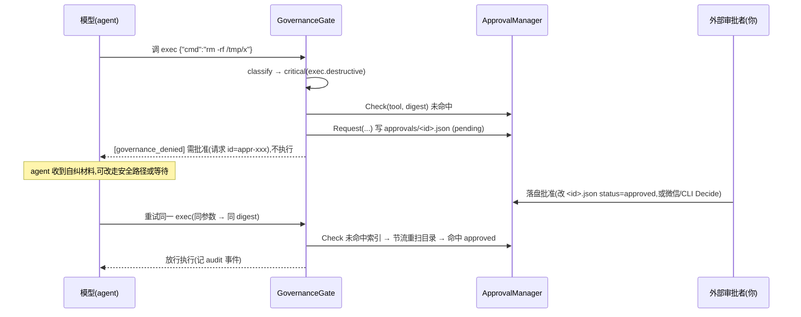
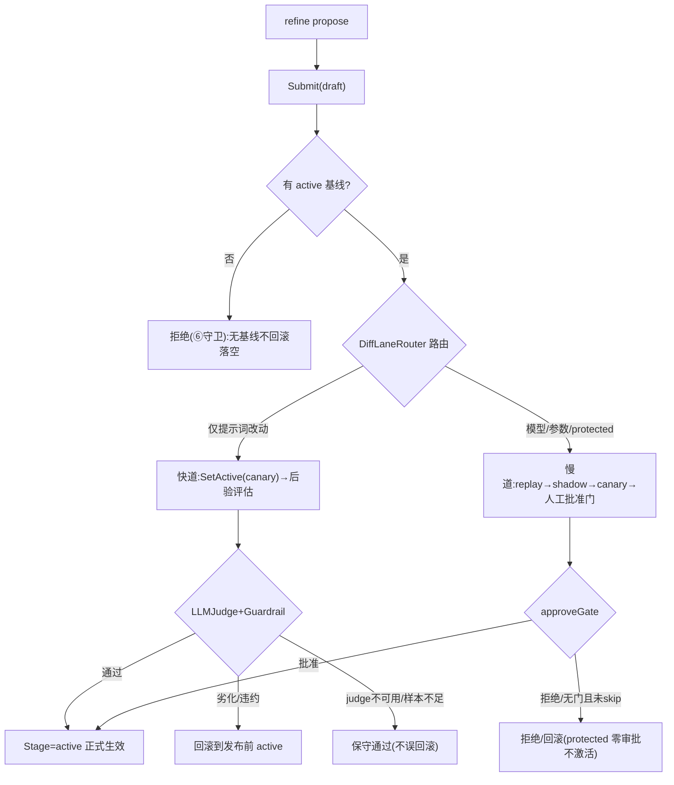
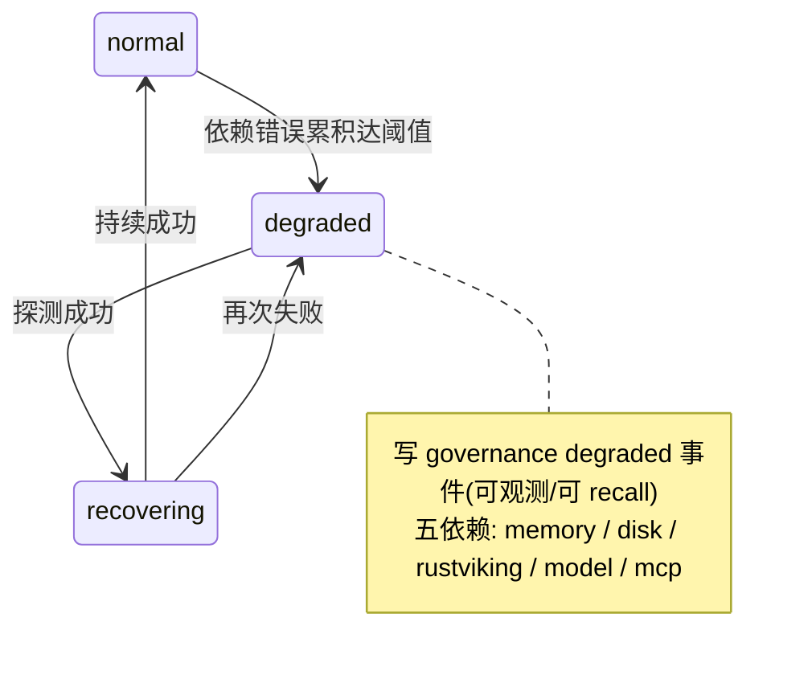

# agent 行为矩阵 — 启用全平台子系统后的复杂场景反应

> 配套 [platform-subsystems.md](./platform-subsystems.md)(子系统实现)与
> `examples/wechat-bot/deploy/README.md`(部署)。本篇回答:**启用治理/自进化/可靠性/语义召回后,
> agent 在各种复杂情况下到底会怎么反应**——每条行为均可溯源到代码(标注文件),非臆测。
>
> **本 example(wechat-bot/tagent.yaml)的生效配置快照**:
> 治理 `enforcement=warn` + 预算(high 20/medium 200 每 60min,per-agent) + critical 恒审批;
> 自进化 `enabled` + `skip_approval=false` + protected=`[SOUL.md, AGENTS.md]`;
> 可靠性 `degradation_enabled` + bus/mem spill + 冥想锚点持久化;语义引擎 `512 维 zhipu embedding-3`。

---

## 一、治理闸行为(Governance · `enforcement=warn`)

所有 agent 的非 wrapper leaf 工具(`exec`/`mcp_call`/`save_file`/`replace_content`/`refine`)调用前经
`GovernanceGate.Evaluate` 裁决(`agent/governance/gate.go`):`classify → critical 批准门 → goal 检查 → 预算闸 → 记账/放行`。

### 1.1 风险分级 → 处置总表(`classifier.go` DefaultRules + `DispositionFor`)

| 风险级 | 命中示例(工具+参数) | 处置 | warn 模式下 agent 反应 |
|--------|---------------------|------|------------------------|
| **critical** | `exec rm -rf` / `sudo rm` / `mkfs` / `dd if=` / `shutdown` / `git push -f` / `curl…\| sh` / `refine rollback` | Hold(恒需批准) | **不执行**,返回 `[governance_denied]` + 审批请求 ID,提示"批准后重试" |
| **high** | `exec sudo …` / `rm`/`mv`/`shred` / `git push` / `docker rm` / `kubectl delete` / `npm publish` / `delete_file` | Record(记账) | **放行执行** + 写审计事件;超预算则拒绝(见 1.4) |
| **medium** | `save_file`/`replace_content`/`edit_file` / `exec`(默认) / `mcp_call` / `refine propose` | Record(记账) | **放行执行** + 写审计事件;超预算则拒绝 |
| **low** | `read_file`/`list_file`/`search_*`/`recall`/`memory_query`/`skill_*` | Allow(零开销) | 直接放行,不记账 |

### 1.2 critical 操作审批闭环(时序 · `gate.go` critical 分支 + `approval.go`)

**关键行为**:
- **digest 绑定防绕过**:批准绑定参数 sha256;若 agent 批准后**改了参数**再调,`digest` 不匹配 → 不命中 → 重新走审批(`approval.go checkIndex`)。
- **异步不阻塞**:critical 挂起不阻塞事件循环(立即返回拒绝 + 请求 ID),审批经文件重扫可见(`Check` 节流 2s 重扫 `approvals/`)。
- **warn 不放松 critical**:即使 `enforcement=warn`,critical 未批准**仍不执行**(Disposition=Hold 恒触发拒绝)——warn 只放松 high/medium 的记账放行,不放松不可逆操作。

### 1.3 预算耗尽(`gate.go` budget 分支 + `budget.go`)

| 情况 | agent 反应 |
|------|-----------|
| 60min 窗内 high 级操作 > 20 次 | 第 21 次 high 操作 → **拒绝**(Denied=true),返回"本窗口 high 级预算已耗尽,请稍后或降低风险" |
| 60min 窗内 medium 级 > 200 次 | 同上,medium 预算耗尽拒绝 |
| 预算按 **agent 独立**(W3 用户裁决) | 子 agent 刷爆自己的预算**不影响** entry/其他 agent(各持独立 BudgetManager,`data/governance/budget/<agent>`) |
| 滑窗恢复 | 窗口滑过(60min)后计数衰减,操作恢复放行 |

> ⚠️ **预算是硬闸**:`Denied=true` **不受 `enforcement=warn` 放松**(warn 不会让超预算操作放行)。这是有意的——预算防单 agent 失控刷爆,是安全底线。

### 1.4 warn vs strict 差异(关键澄清 · `gate.go`)

| 场景 | `warn`(本配置) | `strict` |
|------|----------------|----------|
| high/medium 风险操作(未超预算) | 记账 + **放行** | 记账 + **放行**(同 warn) |
| high+ 且须挂 goal 而无 active goal | 记账 + **放行**(附提醒) | **拒绝**(但本配置 `goal_required_for` 空 → 不触发) |
| critical 未批准 | **不执行**(Hold) | **不执行**(Hold,同 warn) |
| 预算耗尽 | **拒绝** | **拒绝**(同 warn) |

**结论**:本 example 的 `warn` 模式下,治理**几乎不阻断正常操作**(high/medium 放行),仅在
critical 未批准 / 预算耗尽两处硬约束。升级到 `strict` 主要影响"high+ 无 goal"分支(需先交付
`goal_declare` 工具,否则 strict 下 high+ 自治操作会反复撞墙——见 `gate.go` A7 注释)。

### 1.5 审计与可观测

- 每次 record/denial/approval/degraded 写一条 `governance` 事件到 **entry agent 的持久 memStore**
  (N2:所有 agent 共享同一 `DenialLedger`,子 agent 审计也 durable,重启可 recall)。
- 事件含**来源 agent 归属**(§8.1:`metadata["agent"]`)——多子 agent 治理事件可按来源区分。
- 你可用 `recall` / `memory_query` 检索治理历史(如"最近被拒的操作")。

---

## 二、自进化行为(Evolution · refine + 发布道)

`refine` 工具(**仅 entry agent**)是 agent 自我修改通道,四 op **永无 activate**(`evolution/refine.go`);
激活只能经 `ReleaseManager` 发布道(`release.go`)。

### 2.1 refine 四 op 行为

| op | 风险级 | agent 反应 |
|----|--------|-----------|
| `propose`(prompt_key + content) | medium(protected/模型/参数→慢道) | 创建 draft bundle → Submit 发布道 → 返回 stage(canary/active/rejected) |
| `diff`(target_id) | 只读 | 返回 active↔target 的 bundle 差异(不改动) |
| `status` | 只读 | 返回当前 active + 历史 bundle 列表 |
| `rollback`(target_id) | **critical**(过治理闸) | 校验 target 在 wasActive 白名单 → 通过则切 active;**需 critical 审批**(见 1.2) |

### 2.2 发布道路由 + 后验(`release.go` Submit → route → 快/慢道)

### 2.3 边界场景(复杂情况)

| 场景 | agent/系统反应 | 依据 |
|------|---------------|------|
| **protected 提示词改动**(SOUL.md/AGENTS.md) | 强制走**慢道** → 需人工批准(`skip_approval=false`)才激活;未批准不生效 | `release.go touchesProtected` |
| **无 active 基线**时 propose/submit | Submit 直接 **reject**(不 canary,防孤儿 draft 滞留 active 无回滚锚点) | `release.go` ⑥守卫 |
| **后验 judge 不可用/样本 < 5** | **保守通过**(不劣化回滚)——避免因 judge 缺席误杀正常变更 | `release.go` M3 + judge |
| **canary 观察窗 ctx 被取消** | **诚实停留 canary**(不提升 active 也不回滚),下次 Submit/重启重评 | `release.go` fast lane |
| **rollback 到被拒 draft** | wasActive 白名单**拒绝**(只可回滚曾 Stage=active 的版本,防绕发布道) | `refine.go` E1 |
| **rollback 到基线** | 允许(基线经 `seedActiveBaseline` 自动入白名单,跨重启恢复) | `release.go` ④ N1 |
| **重启后** | 发布历史从 `data/evolution/releases.jsonl` 重建,rollback 白名单跨重启有效 | `release.go` loadHistory |
| 生效时机 | 激活在**回合边界**原子切 active 指针(热配置,不中断当前 turn) | VersionedSource |

> 注(M12 宣称收窄):当前运行期应用点仅**提示词**;bundle 的 params/model 字段=存储就绪,
> 参数/模型热切换为后续增强(refine 提案字段白名单只含 prompts)。

---

## 三、常驻可靠性行为(Reliability)

面向远端长期运行:不丢事件、退化可观测、重启稳定。全部 per-agent 隔离。

### 3.1 事件总线溢出(ReliableBus · `bus_spill_dir`)

| 情况 | 行为 |
|------|------|
| 高峰期事件 channel 满 | 事件**溢出落盘** `data/reliability/bus/<agent>`(而非丢弃),channel 恒早于磁盘的全序 |
| channel 恢复空闲 | 溢出事件按序回灌,at-least-once 不丢 |
| 进程重启 | 启动扫描 spill 目录恢复未消费事件 |

### 3.2 memory 写失败兜底(mem_spill · `mem_spill_dir`)

| 情况 | 行为 |
|------|------|
| `StoreEvent` 失败(memory/disk 退化) | 事件落 `data/reliability/memspill/<agent>.jsonl` 兜底(不丢) |
| memory 恢复 | 自动重放 spilled 事件;**重放前 `GetEvent` 预检幂等**(已写则计成功,不撞 already-exists) |
| 重放完成 | spill 文件归零 |

### 3.3 五依赖退化-恢复状态机(DegradationManager · `degradation_enabled`)

| 依赖 | 错误来源 | 退化时 agent 反应 |
|------|---------|-------------------|
| memory/disk | `ErrorTrackingStore` 捕获存储错误 | 标记 degraded,事件走 mem_spill 兜底 |
| model | `event_loop` 捕获 LLM 失败(每 turn 一次,不按重试放大) | 标记 degraded,触发退化重试 |
| mcp | `mcp_call` 上报(区分传输级失败 vs 工具业务错误,ctx 取消不计) | 标记 degraded,工具返回自纠材料 |
| rustviking | 仅 `type: file` 时(本配置 localfile 不涉及) | — |

### 3.4 重启恢复(锚点 + 状态)

| 重启后恢复项 | 来源 | 效果 |
|-------------|------|------|
| 冥想三锚点(novelty/idle/last-meditation) | `data/reliability/anchors/<agent>.json` | **不立即误触发冥想**(纯内存则重启即忘、马上冥想) |
| 治理预算窗口 | `data/governance/budget/<agent>` | 预算计数跨重启延续(不清零) |
| 待批审批 | `data/governance/approvals/` | pending 请求跨重启可见 |
| 发布历史 | `data/evolution/releases.jsonl` | rollback 白名单跨重启有效 |
| 未消费事件/记忆兜底 | bus/mem spill | 重启后回灌/重放,不丢 |

---

## 四、记忆引擎行为(语义召回 · 512 维)

`recall` query 模式从纯关键词升级为 **向量 ∪ 关键词 RRF 融合**(`memory/engine`,tagent/knowledge/recall 共享同一引擎)。

### 4.1 语义召回命中

| 场景 | 行为 |
|------|------|
| 同义改写查询(如"服务器内存不足崩溃重启" vs 历史"OOMKilled 频繁重启",**无共同关键词**) | 向量语义命中(实测 top1 命中),经 RRF(k=60)与关键词结果融合重排 |
| 入库事件 | 异步嵌入(非阻塞,仅 external_input/agent_output 类型,Content ≤8000 截断),不拖慢主链路 |
| 召回结果形态 | 仍返回 **EventReference 票据**(两段式:语义发现 → 票据精确取回全文),不直接返回全文 |
| 工具声明 | recall Declaration **恒定**(开关不影响 prefix-cache) |

### 4.2 降级链(复杂/故障情况 · 逐跳保底关键词)

| 情况 | 行为 | 依据 |
|------|------|------|
| 缺 `ZAI_API_KEY` / embedding 配置无效 | `buildMemoryEngine` 失败 → **Warn + 降级纯关键词**(store 不包裹引擎,不阻断启动) | `tagent.go wireMemoryEngine` |
| embedding API 调用失败/超时 | 重试 ≤1 次后**放弃该事件向量**(不报错、不中断),丢弃计数递增 | `semantic-search` spec |
| 进程重启后索引重建窗口 | 重建完成前语义检索**返回空 → recall 退化纯关键词**(不阻塞启动、不报错) | engine 启动异步重建 |
| 该分区无向量 | 融合自动退化纯关键词路径 | `recall-hybrid-fusion` spec |
| 事件 TTL/容量遗忘 | 物理删除事件时**同步移除向量键**(VectorRemover,防死键堆积/重启复活) | `tagent.go newEngineBridgeWithRemover` |

> **成本**:选择性生成下约 40 次 embedding API 调用/天(100 events/日),用现有 GLM Coding Plan key,按量计费。

---

## 五、可观测行为(noop vs OTLP)

| 配置 | 行为 |
|------|------|
| 未设 `OTEL_EXPORTER_OTLP_ENDPOINT`(默认) | 全部 span/metric **noop**:零导出、零开销,事件循环/工具/轨迹行为与无观测时**逐字节一致** |
| 设 OTLP 端点 | 每 turn 开 `tagent.turn` root span(含 EventKey/trigger_source/agent 属性),框架 span 挂为子树;轨迹记录携 trace_id/span_id(可双向跳转);异步任务 spawn↔settle 建 span link |
| 声明区 | span/metric 全在 Engine 侧,**不触碰任何工具 Declaration**(prefix-cache 稳定) |

---

## 六、部署生命周期行为(裸机 systemd)

| 场景 | 行为 |
|------|------|
| 进程崩溃/异常退出 | `Restart=always` → 5s 后自愈重启;重启触发 §3.4 全套恢复 |
| `systemctl stop` / 部署重启 | `KillSignal=SIGTERM` 直达二进制 → 优雅关闭(排空 ReliableBus、flush 轨迹、关 tmux);30s 超时才 SIGKILL |
| 内存超 `MemoryMax=1G` | OOM-kill → Restart 自愈(按机器内存可调 unit) |
| exec 派生进程失控 | `TasksMax=256` 上限拦截(防 fork 炸弹) |
| 改 `mcp_servers` 段 | **热同步**(mtime 惰性检查),增删 MCP server **免重启** |
| 改 governance/evolution/reliability/agents | 需 `systemctl restart` 生效 |
| 临时排障开 debug | `systemctl edit` 加 `Environment=LOG_LEVEL=debug`(默认 info,避免明文落日志) |

---

## 七、复合场景(多子系统交互端到端)

**场景 A:agent 想执行危险清理命令**
1. 模型调 `exec {"cmd":"rm -rf /tmp/cache"}` → 治理 classify=critical(exec.destructive)。
2. GovernanceGate:Check 未命中 → Request 写 pending → 返回 `[governance_denied]`+请求 ID,**不执行**。
3. 可靠性:该拒绝写 governance 事件(含 agent 归属)到持久 memStore。
4. 你(外部)落盘批准 `approvals/<id>.json` → agent 重试同命令 → Check 重扫命中 approved → **放行执行**。
5. 若执行中 memory 写失败 → mem_spill 兜底,恢复后重放。

**场景 B:agent 自我优化提示词**
1. 模型调 `refine propose`(改 TOOLS.md 措辞)→ 治理 medium 记账放行。
2. Submit → DiffLaneRouter:仅提示词 + 非 protected → **快道** → canary 激活。
3. 后验 LLMJudge(以激活时刻开窗):通过 → **active 生效**(回合边界);劣化 → **回滚**发布前版本。
4. 若改的是 SOUL.md(protected)→ **慢道** → 需你人工批准才激活。
5. 发布历史落 `releases.jsonl`;若效果差,agent 可 `refine rollback`(critical,需审批)回退到曾 active 版本。

**场景 C:远端服务器网络抖动 + 重启**
1. model 调用失败累积 → DegradationManager 标 `degraded`,写 governance degraded 事件。
2. 期间事件 channel 满 → ReliableBus 溢出落盘;StoreEvent 失败 → mem_spill 兜底。
3. 网络恢复 → 探测成功 → `recovering` → `normal`;spill 事件回灌/重放。
4. 若进程被 OOM/崩溃 → systemd `Restart=always` 重启 → 恢复冥想锚点(不误触发)、预算窗口、发布历史、未消费事件。
5. 语义引擎重启后异步重建向量索引,重建窗口内 recall 退化纯关键词,重建完成恢复语义召回。

---

## 附:一句话速查

| 你担心 | 实际行为 |
|--------|---------|
| "治理会不会挡住正常操作?" | warn 模式下 high/medium **放行**;仅 critical 未批准 + 预算耗尽两处硬约束 |
| "危险命令会不会被偷偷执行?" | critical(rm -rf/sudo/git push -f…)**恒需人工批准**,不批准不执行,digest 绑定防换参绕过 |
| "agent 会不会自己乱改人格?" | refine **无 activate 权**;SOUL/AGENTS 改动走慢道需你批准;快道也有后验评估 + 自动回滚 |
| "服务器崩了会丢数据吗?" | 事件溢出/兜底落盘 + 重启恢复;记忆/治理/进化状态全持久化;systemd 自愈重启 |
| "语义召回失败会崩吗?" | 缺 key/API 故障/重建窗口一律**优雅降级纯关键词**,不阻断 |
| "日志会泄露对话明文吗?" | 默认 `info`(不打明文);debug 需手动临时开 |
