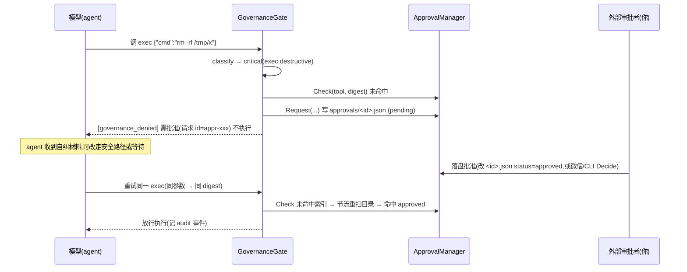
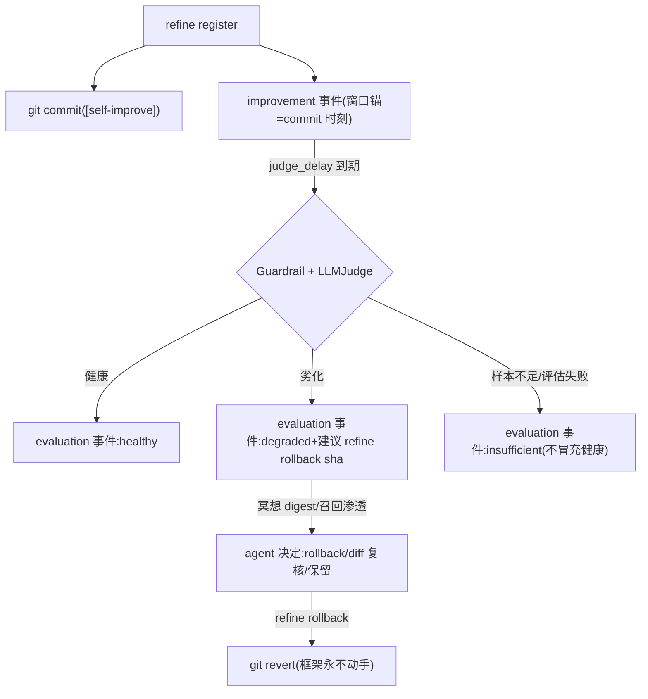
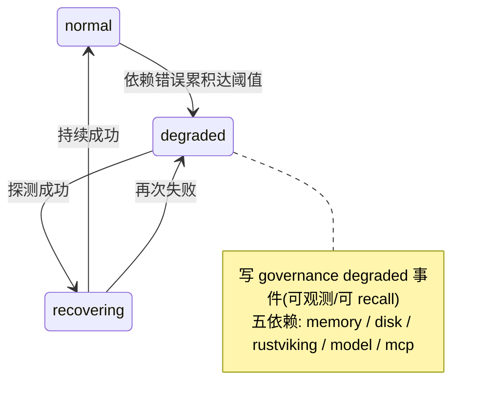

# agent 行为矩阵 — 启用全平台子系统后的复杂场景反应

> 配套 [platform-subsystems.md](./platform-subsystems.md)(子系统实现)与
> `examples/wechat-bot/deploy/README.md`(部署)。本篇回答:**启用治理/自进化/可靠性/语义召回后,
> agent 在各种复杂情况下到底会怎么反应**——每条行为均可溯源到代码(标注文件),非臆测。
>
> **本 example(wechat-bot/tagent.yaml)的生效配置快照**:
> 治理 `enforcement=warn` + 预算(high 20/medium 200 每 60min,per-agent) + critical 恒审批;
> 自进化 `enabled` + `skip_approval=false` + protected=`[SOUL.md, AGENTS.md]`;
> 可靠性 `degradation_enabled` + bus/mem spill + 冥想锚点持久化;语义引擎 `512 维 zhipu embedding-3`;
> 工作根 `working_dir` 默认空(= 部署目录),部署时经 `TAGENT_WORKING_DIR` 指定 clone 根(见 §六)。

---

## 一、治理闸行为(Governance · `enforcement=warn`)

所有 agent 的非 wrapper leaf 工具(`exec`/`mcp_call`/`save_file`/`replace_content`/`refine`)调用前经
`GovernanceGate.Evaluate` 裁决(`agent/governance/gate.go`):`classify → critical 批准门 → goal 检查 → 预算闸 → 记账/放行`。

### 1.1 风险分级 → 处置总表(`classifier.go` DefaultRules + `DispositionFor`)

| 风险级 | 命中示例(工具+参数) | 处置 | warn 模式下 agent 反应 |
|--------|---------------------|------|------------------------|
| **critical** | `exec rm -rf` / `sudo rm` / `mkfs` / `dd if=` / `shutdown` / `git push -f` / `curl…\| sh` / `refine rollback` | Hold(恒需批准) | **不执行**,返回 `[governance_denied]` + 审批请求 ID,提示"批准后重试" |
| **high** | `exec sudo …` / `rm`/`mv`/`shred` / `git push` / `docker rm` / `kubectl delete` / `npm publish` / `delete_file` | Record(记账) | **放行执行** + 写审计事件;超预算则拒绝(见 1.4) |
| **medium** | `save_file`/`replace_content`/`edit_file` / `exec`(默认) / `mcp_call` | Record(记账) | **放行执行** + 写审计事件;超预算则拒绝 |
| **low** | `read_file`/`list_file`/`search_*`/`recall`/`memory_query`/`skill_*` | Allow(零开销) | 直接放行,不记账 |

### 1.2 critical 操作审批闭环(时序 · `gate.go` critical 分支 + `approval.go`)

```mermaid
sequenceDiagram
    participant M as 模型(agent)
    participant G as GovernanceGate
    participant A as ApprovalManager
    participant Ops as 外部审批者(你)
    M->>G: 调 exec {"cmd":"rm -rf /tmp/x"}
    G->>G: classify → critical(exec.destructive)
    G->>A: Check(tool, digest) 未命中
    G->>A: Request(...) 写 approvals/<id>.json (pending)
    G-->>M: [governance_denied] 需批准(请求 id=appr-xxx),不执行
    Note over M: agent 收到自纠材料,可改走安全路径或等待
    Ops->>A: 落盘批准(改 <id>.json status=approved,或微信/CLI Decide)
    M->>G: 重试同一 exec(同参数 → 同 digest)
    G->>A: Check 未命中索引 → 节流重扫目录 → 命中 approved
    G-->>M: 放行执行(记 audit 事件)
```

**关键行为**:
- **digest 绑定防绕过**:批准绑定参数 sha256;若 agent 批准后**改了参数**再调,`digest` 不匹配 → 不命中 → 重新走审批(`approval.go checkIndex`)。
- **异步不阻塞**:critical 挂起不阻塞事件循环(立即返回拒绝 + 请求 ID),审批经文件重扫可见(`Check` 未命中时节流重扫 `approvals/`,间隔默认 2s、可注入)。
- **warn 不放松 critical**:即使 `enforcement=warn`,critical 未批准**仍不执行**(Disposition=Hold 恒触发拒绝)——warn 只放松 high/medium 的记账放行,不放松不可逆操作。

### 1.3 预算耗尽(`gate.go` budget 分支 + `budget.go`)

| 情况 | agent 反应 |
|------|-----------|
| 60min 窗内 high 级操作 > 20 次 | 第 21 次 high 操作 → **拒绝**(Denied=true),返回"本窗口 high 级预算已耗尽,请稍后或降低风险" |
| 60min 窗内 medium 级 > 200 次 | 同上,medium 预算耗尽拒绝 |
| 预算按 **agent 独立**(设计裁决:子 agent 不共享 entry 预算) | 子 agent 刷爆自己的预算**不影响** entry/其他 agent(各持独立 BudgetManager,`data/governance/budget/<agent>`) |
| 滑窗恢复 | 窗口滑过(60min)后计数衰减,操作恢复放行 |

> ⚠️ **预算是硬闸**:`Denied=true` **不受 `enforcement=warn` 放松**(warn 不会让超预算操作放行)。这是有意的——预算防单 agent 失控刷爆,是安全底线。

### 1.4 warn vs strict 差异(关键澄清 · `gate.go`)

| 场景 | `warn`(本配置) | `strict` |
|------|----------------|----------|
| high/medium 风险操作(未超预算) | 记账 + **放行** | 记账 + **放行**(同 warn) |
| high+ 且须挂 goal 而无 active goal | 记账 + **放行**(附提醒) | **拒绝**(但本配置 `goal_required_for` 空 → 不触发) |
| critical 未批准 | **不执行**(Hold) | **不执行**(Hold,同 warn) |
| 预算耗尽 | **拒绝** | **拒绝**(同 warn) |

**结论**:本 example 的 `warn` 模式下,治理**几乎不阻断正常操作**(high/medium 放行),仅在
critical 未批准 / 预算耗尽两处硬约束。升级到 `strict` 主要影响"high+ 无 goal"分支(需先交付
`goal_declare` 工具,否则 strict 下 high+ 自治操作会反复撞墙——见 `gate.go` 中 goal 门的设计注释)。

### 1.5 审计与可观测

- 每次 record/denial/approval/degraded 写一条 `governance` 事件到 **entry agent 的持久 memStore**
  (所有 agent 共享同一 `DenialLedger` 实例,子 agent 审计也 durable,重启可 recall)。
- 事件含**来源 agent 归属**(`DenialRecord.AgentName` → `metadata["agent"]`,omitempty)——多子 agent 共享 Ledger 时治理事件可按来源区分。
- 你可用 `recall` / `memory_query` 检索治理历史(如"最近被拒的操作")。

---

## 二、自进化行为(Evolution · git 原生)

> 自进化不采用 bundle 快照/发布道——文件即真源 + git 版本层 + 建议式评估。

`refine` 工具三 op(`evolution/refine.go`)——只装配给 entry agent;冥想产物落盘后经它的 register 登记

冥想读到的提示清单由三份组成：巩固候选、上一个评估窗口给出的结论（劣化建议必须在下一趟反思里必然再现）、以及未登记产物的提醒。三份都**只列 key 与计数**，执行权始终在 LLM 与 `memory_consolidate`；evolution 关闭时退回只有巩固候选。开评估保护。这三份在**任何观察面下都是同一段**:冥想线(观察面含他人分区)只是把它排在观察面概况之后(机制与 digest 覆盖面见 [agent 引擎篇 §2.14](../agent/agent-architecture.md#meditation-curator))。

### 2.1 refine 三 op 行为

| op | 风险级 | agent 反应 |
|----|--------|-----------|
| `register`(paths+note) | low(登记无副作用) | 受控路径校验 → `[self-improve]` 标记 commit(仅 add 显式产物,不卷入工作区其他改动) → improvement 事件即评估窗口 → judge_delay 后评估一次 |
| `status` | low(只读) | git log 过滤(行首锚定)+窗口结论四态(健康/劣化/样本不足/未到期)join+未登记产物提醒 |
| `rollback`(sha) | **critical**(过治理闸) | 校验 commit 带改进标记(防误 revert 用户提交) → git revert;冲突返回详情由 agent 处置;**回滚是终态不再评估** |

### 2.2 评估与建议式信号

```mermaid
flowchart TD
    R["refine register"] --> C["git commit([self-improve])"]
    R --> E["improvement 事件(窗口锚=commit 时刻)"]
    E -->|judge_delay 到期| EV{"Guardrail + LLMJudge"}
    EV -->|健康| H["evaluation 事件:healthy"]
    EV -->|劣化| D["evaluation 事件:degraded+建议 refine rollback sha"]
    EV -->|样本不足/评估失败| I["evaluation 事件:insufficient(不冒充健康)"]
    D -->|冥想 digest/召回渗透| AG["agent 决定:rollback/diff 复核/保留"]
    AG -->|refine rollback| RV["git revert(框架永不动手)"]
```

### 2.3 边界场景(复杂情况)

| 场景 | agent/系统反应 | 依据 |
|------|---------------|------|
| **受控路径外登记** | 拒绝并列出受控清单(默认三目录 prompts/skills/scripts) | `gitrefine.go` MatchProtectedPaths |
| **产物无改动时 register** | 返回 result「无改动可登记」(非 error) | `evolve.go` ErrNothingToCommit |
| **非 git 仓运行** | register 明确报错;文件改动仍生效(热重载),如实降级 | 启动自检 Warn |
| **judge 样本不足** | 结论=insufficient(**不冒充健康**,K7) | `evolve.go` 结论四态 |
| **外部 reset/amend 使 git 与事件漂移** | status 标注「外部变更,窗口失效」(git=版本事实源,事件=控制面) | tasks 3.1 |
| **revert 冲突**(后续改进叠加) | 返回冲突详情,由 agent 决定(建议式) | `gitrefine.go` RevertSafe |
| **rollback 用户提交** | 拒绝(仅可 revert 改进标记 commit) | `gitrefine.go` GitCommitHasTag |
| **重启后** | 版本章惰性恢复(查最新 improvement 事件);窗口=事件持久 | `evolve.go` LatestSha |
| 生效时机 | 文件即真源——落盘+热重载即时生效(register 是留痕非生效前提) | mtime 热重载 |

## 三、常驻可靠性行为(Reliability)

面向远端长期运行:不丢事件、退化可观测、重启稳定。全部 per-agent 隔离。

### 3.1 事件总线耐久受理(ReliableBus · `bus_spill_dir`)

| 情况 | 行为 |
|------|------|
| 任何一次 Publish（不分忙闲） | 输入**先落 inbox 再回执** `data/reliability/bus/<agent>`(v2 全量持久受理，不是「满才溢」；channel 只送唤醒脉冲) |
| 领取批次 | Pull 先排空 channel 的非唤醒事件，再按严格序号 claim inbox 信封；未 ack 的认领退回 pending 重投,at-least-once 不丢 |
| 进程重启 | 启动盘点未收口信封并按**该信封自己的回执**对账(只有 prepared／只有 completion／两者一致／矛盾→隔离／I/O 失败→阻塞启动) |

### 3.2 memory 写失败兜底(mem_spill · `mem_spill_dir`)

| 情况 | 行为 |
|------|------|
| `StoreEvent` 失败(memory/disk 退化) | 事件落 `data/reliability/memspill/<agent>.jsonl` 兜底(不丢) |
| memory 恢复 | 自动重放 spilled 事件;**重放前 `GetEvent` 预检幂等**(已写则计成功,不撞 already-exists) |
| 重放完成 | spill 文件归零 |

### 3.3 五依赖退化-恢复状态机(DegradationManager · `degradation_enabled`)

```mermaid
stateDiagram-v2
    normal --> degraded: 依赖错误累积达阈值
    degraded --> recovering: 探测成功
    recovering --> normal: 持续成功
    recovering --> degraded: 再次失败
    note right of degraded
      写 governance degraded 事件(可观测/可 recall)
      五依赖: memory / disk / rustviking / model / mcp
    end note
```

| 依赖 | 错误来源 | 退化时 agent 反应 |
|------|---------|-------------------|
| memory/disk | `ErrorTrackingStore` 捕获存储错误 | 标记 degraded,事件走 mem_spill 兜底 |
| model | `event_loop` 捕获 LLM 失败(每 turn 一次,不按重试放大) | 标记 degraded,触发退化重试 |
| mcp | `mcp_call` 上报(区分传输级失败 vs 工具业务错误,ctx 取消不计) | 标记 degraded,工具返回自纠材料 |
| rustviking | 仅 `type: file` 时(本配置 localfile 不涉及) | — |

### 3.4 重启恢复(锚点 + 状态)

| 重启后恢复项 | 来源 | 效果 |
|-------------|------|------|
| 冥想单锚(last-meditation 执行水位;旧空闲锚已退役,历史锚文件旧键 Load 忽略、无迁移) | `data/reliability/anchors/<agent>.json`(按 agent 名分文件) | 重启后节奏门按上次执行正常间隔判定(纯内存则锚缺失=冷启动直通一次,读尽存量后水位自锁,幂等安全);同一锚兼作观察面新鲜度水位(缺省即自身分区),重启后判据窗口连续 |
| 治理预算窗口 | `data/governance/budget/<agent>` | 预算计数跨重启延续(不清零) |
| 待批审批 | `data/governance/approvals/` | pending 请求跨重启可见 |
| 未消费事件/记忆兜底 | bus/mem spill | 重启后回灌/重放,不丢 |
| 对话上下文(R1) | 事实链(compaction+尾部回放) | 投影逐字节复原,prefix-cache 复用 |
| 任务板(R2) | 事实链(task_spawned − 终态 settle) | active 任务重建(running→suspect 交探测裁决;inline-settled 不重建无幽灵);relaunch 跨重启可用,subagent resume 返回引导 |
| 常驻会话(R3) | meta 文件+tmux 存活真相源 | 重挂唯一挂载点重建跟踪(watch/probe);TaskID 桥把存活会话的任务提升回 running;探测三态+加闸(连续 3 次 unknown 才判死) |
| 配置结构变更 | 懒检查(entry 身份→memory 先检→指纹) | **非重启**换代：已存在 agent 只换执行面（drain-free turn 级，在途用旧代跑完），热增 agent 完整常驻构造；memory 变更拒绝并明示须重启；失败 fail-closed 旧代原样；回滚（双槽环）与热更共用同一候选事务 |

---

## 四、记忆引擎行为(语义召回 · 512 维)

`recall` query 模式从纯关键词升级为 **向量 ∪ 关键词 RRF 融合**(`memory/engine`,tagent/knowledge/recall 共享同一引擎)。

### 4.1 语义召回命中

| 场景 | 行为 |
|------|------|
| 同义改写查询(如"服务器内存不足崩溃重启" vs 历史"OOMKilled 频繁重启",**无共同关键词**) | 向量语义命中(实测 top1 命中),经 RRF(k=60)与关键词结果融合重排 |
| 入库事件 | 异步嵌入(非阻塞,仅 external_input/agent_output 类型,Content ≤8000 截断),不拖慢主链路 |
| 召回结果形态 | 仍返回 **EventReference 票据**(两段式:语义发现 → 票据精确取回全文),不直接返回全文 |
| 工具声明 | recall Declaration **恒定**(开关不影响 prefix-cache) |

### 4.2 降级链(复杂/故障情况 · 逐跳保底关键词)

| 情况 | 行为 | 依据 |
|------|------|------|
| 缺 `ZAI_API_KEY` / embedding 配置无效 | `buildMemoryEngine` 失败 → **Warn + 降级纯关键词**(store 不包裹引擎,不阻断启动) | `tagent.go wireMemoryEngine` |
| embedding API 调用失败/超时 | 重试 ≤1 次后**放弃该事件向量**(不报错、不中断),丢弃计数递增 | `semantic-search` spec |
| 进程重启后索引重建窗口 | 重建完成前语义检索**返回空 → recall 退化纯关键词**(不阻塞启动、不报错) | engine 启动异步重建 |
| 该分区无向量 | 融合自动退化纯关键词路径 | `recall-hybrid-fusion` spec |
| 事件 TTL/容量遗忘 | 物理删除事件时**同步移除向量键**(VectorRemover,防死键堆积/重启复活) | `tagent.go newEngineBridgeWithRemover` |

> **成本**:选择性生成下约 40 次 embedding API 调用/天(100 events/日),用现有 GLM Coding Plan key,按量计费。

---

## 五、可观测行为(noop vs OTLP)

| 配置 | 行为 |
|------|------|
| 未设 `OTEL_EXPORTER_OTLP_ENDPOINT`(默认) | 全部 span/metric **noop**:零导出、零开销,事件循环/工具/轨迹行为与无观测时**逐字节一致** |
| 设 OTLP 端点 | 每 turn 开 `tagent.turn` root span(含 EventKey/trigger_source/agent 属性),框架 span 挂为子树;轨迹与事件 metadata 携 trace_id/span_id,两侧**此时才**可双向跳转;异步任务 spawn↔settle 建 span link。**这一行是有前提的**：默认 noop 下两侧字段为空,事件库也没有 metadata 查询面,跨投影的关联主路是 `parent_key`/`call_id` 离线 join,不是 trace(见 [RL 侧接口](../rl/rl-architecture.md)) |
| 声明区 | span/metric 全在 Engine 侧,**不触碰任何工具 Declaration**(prefix-cache 稳定) |

---

## 六、部署生命周期行为(裸机 systemd)

| 场景 | 行为 |
|------|------|
| 进程崩溃/异常退出 | `Restart=always` → 5s 后自愈重启;重启触发 §3.4 全套恢复 |
| `systemctl stop` / 部署重启 | `KillSignal=SIGTERM` 直达二进制 → 优雅关闭(停事件循环——进行中 turn 跑完、未确认 claim 保留不丢；bus `CloseDurable` 清理已回执材料与屏障盘点；flush 轨迹、关 tmux);30s 超时才 SIGKILL |
| 内存超 `MemoryMax=1G` | OOM-kill → Restart 自愈(按机器内存可调 unit) |
| exec 派生进程失控 | `TasksMax=256` 上限拦截(防 fork 炸弹) |
| 改 `mcp_servers` 段 | **热同步**(mtime 惰性检查),增删 MCP server **免重启** |
| 改 governance/evolution/reliability/agents | 需 `systemctl restart` 生效 |
| 临时排障开 debug | `systemctl edit` 加 `Environment=LOG_LEVEL=debug`(默认 info,避免明文落日志) |
| 设了工作根(`TAGENT_WORKING_DIR`,如项目 clone 根) | agent 的 **file 工具 `base_dir` 与 exec 命令 cwd 同时**以它为基准(二者恒一致 → 模型看到单一文件系统视图),可读写该目录下所有仓库;tagent 自身的配置/资源/数据路径**不受影响**(仍相对部署目录) |
| 工作根设在部署目录**外** | 需**两道放行**才可写:① 文件系统层 ACL(`./wizard.sh --perms` 给服务用户追加 `rwX`,含已有文件 + 默认 ACL 继承新建,不改原有 owner/group/mode);② systemd 沙箱层 `ReadWritePaths` 追加该绝对路径(`ProtectSystem=strict` 下缺此则只读失败) |
| 工作根留空(默认) | file/exec 均继承进程工作目录(= 部署目录),行为与未引入该配置前逐字节一致 |

工作根在配置层只有三条取法（`config.go` 的 `ApplyDefaults`）：

> `working_dir`（yaml/json 字段）给出初值 → 环境变量 `TAGENT_WORKING_DIR` **非空时覆盖它** → 两者皆空则保持空串，由 file/exec 各自继承进程工作目录。

环境变量只在**非空**时生效，所以部署面写一个空值等于没写；空串不是"."的别名，它意味着"不改变现状"。

---

## 七、复合场景(多子系统交互端到端)

**场景 A:agent 想执行危险清理命令**
1. 模型调 `exec {"cmd":"rm -rf /tmp/cache"}` → 治理 classify=critical(exec.destructive)。
2. GovernanceGate:Check 未命中 → Request 写 pending → 返回 `[governance_denied]`+请求 ID,**不执行**。
3. 可靠性:该拒绝写 governance 事件(含 agent 归属)到持久 memStore。
4. 你(外部)落盘批准 `approvals/<id>.json` → agent 重试同命令 → Check 重扫命中 approved → **放行执行**。
5. 若执行中 memory 写失败 → mem_spill 兜底,恢复后重放。

**场景 B:agent 自我优化提示词**
1. 冥想反思判定行为偏差根因在 TOOLS.md → 直接改文件(热重载即时生效)。
2. 落盘后调 `refine register`(paths+note)→ `[self-improve]` commit+开评估窗口(low 记账放行)。
3. judge_delay 后 guardrail+LLMJudge 评估:健康 → 留存;劣化 → evaluation 事件带建议经下轮冥想 digest 呈现。
4. agent 收到劣化建议自行决定:`refine rollback`(critical 过治理闸)或 diff 复核后保留。

**场景 C:远端服务器网络抖动 + 重启**
1. model 调用失败累积 → DegradationManager 标 `degraded`,写 governance degraded 事件。
2. 期间事件照常进 ReliableBus 的 durable inbox(与队列忙闲无关);StoreEvent 失败 → mem_spill 兜底。
3. 网络恢复 → 探测成功 → `recovering` → `normal`;spill 事件回灌/重放。
4. 若进程被 OOM/崩溃 → systemd `Restart=always` 重启 → 恢复冥想锚点(不误触发)、预算窗口、发布历史、未消费事件。
5. 语义引擎重启后异步重建向量索引,重建窗口内 recall 退化纯关键词,重建完成恢复语义召回。

**场景 D:冥想 agent 显式声明观察别人的分区(meditation 的旁路冥想线)**
1. 一个同构 agent 显式配 `meditation.observed_namespaces`(须 ⊆ `memory.read_namespaces` ∪ {自身};不配则缺省＝自身分区自察,同一条判据)→ 冥想线:新鲜度只看被观察分区在水位之后的**非自管谱系**事件。
2. 被观察 agent 写入用户事实 → 节奏门到点且新颖门开时(冷启动首次直通)冥想线触发一轮,经验卡片落**自己**的分区;被观察分区零写入(压缩权不可转移,冥想线不写 compaction 事件)。
3. 卡片经 `DeliverToAgent` 投给目标 → 目标 mailbox 收到一条 meditation 谱系输入并自带 `[delivery]` 来源头;与用户输入同批到达时**让位、不补偿**。
4. 此后只有自管产出在循环(卡片再投、consolidation_hint 唤醒)→ 两个 agent 的冥想门都不再打开:反思链路在结构上无法自持。
5. `deliver_to` 未配置=空白名单**拒绝一切投递**;目标 loop 未运行只返回具名错误,不起新 Run、不落盘等待、不静默丢。

---

## 附:一句话速查

| 你担心 | 实际行为 |
|--------|---------|
| "治理会不会挡住正常操作?" | warn 模式下 high/medium **放行**;仅 critical 未批准 + 预算耗尽两处硬约束 |
| "危险命令会不会被偷偷执行?" | critical(rm -rf/sudo/git push -f…)**恒需人工批准**,不批准不执行,digest 绑定防换参绕过 |
| "agent 会不会自己乱改人格?" | refine **无 activate 权**;SOUL/AGENTS 改动走慢道需你批准;快道也有后验评估 + 自动回滚 |
| "服务器崩了会丢数据吗?" | 事件溢出/兜底落盘 + 重启恢复;记忆/治理/进化状态全持久化;systemd 自愈重启 |
| "语义召回失败会崩吗?" | 缺 key/API 故障/重建窗口一律**优雅降级纯关键词**,不阻断 |
| "日志会泄露对话明文吗?" | 默认 `info`(不打明文);debug 需手动临时开 |
