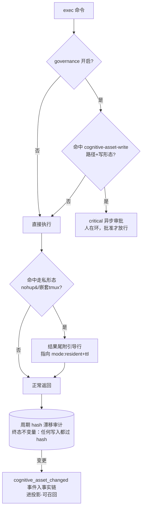

# 认知资产防线（cognitive-asset-guard）

> 定位：保护「认知资产真源」（`resources/prompts/**`、`skills/**`、`scripts/**` + 主配置 yaml）不被自治 agent 或外力静默污染。起因是 09-30 生产 desc-patch 事件——远端 agent 把归因错误的伪因果方法论写入工具描述真源，热重载下每代生效、系统内无纠错力量。

## 一、设计哲学：终态 / 脚手架二元结构

本能力严格区分两类构件，避免「补丁加不完、熵增致不稳」：

- **终态（不变量/权限模型，长期存在）**：不可绕过、成本恒定、随系统演化保持正确。
- **脚手架（过渡形态，预埋拆除条件）**：追赶症状、可被绕过，**条件触发即进入拆除队列，不允许滞留**。

评审尺（四判据）：J1 职责层修复 / J2 不变量优先 / J3 单层判定 / J4 消纳优先。补丁唯一合法形态 = 通往纯化终态的脚手架 + 显式拆除条件。

| 构件 | 类型 | 判据 | 默认态 | 拆除条件 |
|---|---|---|---|---|
| D1 漂移审计 | **终态** | J2 不变量观测 | 默认开（不依赖 governance） | 永不拆除 |
| D3 权限域分离 | **终态方向** | J2 物理不可写 | 文档确立（实现属运维变更） | — |
| D2 资产写审批 | 脚手架 | J1 过渡形态 | 随 DefaultRules 存在，仅 governance enabled 时评估 | 权限域分离落地验证 |
| D4 走私入舱引导 | 脚手架 | J4 依赖消纳 | 默认开（纯提示零拦截） | failure-polarity-passthrough 上线 + 两周观察走私未复发 |

## 二、防线构成

三层递进：D2 识别写意图（可绕）→ D4 教育合法形态（可绕）→ **D1 hash 审计（不可绕）** 兜底。D1 是「被看见」的底线保证，即使 D2/D4 全被绕过或未来拆除，漂移仍进事实链。

## 三、D1 漂移审计（终态）

- **实现**：`asset_drift.go`（`AssetAuditor`），wiring 于 `build_agent.go` entry 装配。
- **不变量**：「内容变则 hash 变」——无绕过路径（变量拼接/base64/外力直改皆捕获），成本恒定（文件数十级）。
- **文件集**：与 `evolution.DefaultProtectedPaths` **同源**（见下）+ 主配置 `ConfigPath`。
- **快照**：SHA-256，原子写（tmp+rename）至 `WorkingDir/.tagent/cognitive-assets.snapshot.json`，跨重启保留。
- **触发**：启动比对（捕获停机窗口）+ 独立 10min ticker（常量非配置）。
- **产出**：Diff 非空 → 一条 `cognitive_asset_changed` 批次事件（file、old/new hash8、size、mtime）入事实链 + Info 日志。
- **事件契约**（`event/registry.go`）：`{Role:user, Skeleton:true, TTLDays:30, Embeddable:true, Recallable:true}`，`NonProjection=false` **必须进投影**——被看见是审计的最低目标。不发 bus、不打断消息路由（可见但不打断）。
- **运行前提**：审计仅当部署设置 `working_dir` 时启动（资产相对路径的解析基准）。未设 `working_dir` 则跳过——绝不回退进程 cwd，否则审计会把快照写进意外的当前目录。生产部署（wechat-bot）应显式配置 `working_dir`。
- **非阻塞**：`Start()` 的启动比对与周期 ticker 均在后台 goroutine，不串入 agent 构造关键路径。

## 四、D3 权限域分离（终态方向，实现属独立运维变更）

使「写入认知资产」从「识别并拦截」问题变为「物理不可能」问题：exec 执行域与框架资产域物理隔离——资产目录对 exec 会话只读。落地形态：systemd 单元 `ReadOnlyPaths`/`ProtectSystem` + `ReadWritePaths` 白名单（`examples/wechat-bot/deploy` 已有此模式先例），或 exec 会话的 mount namespace 隔离。

**J2 论证**：物理不可写 > 识别写意图——不变量守恒，规则追赶。落地后 D2 拆除、D1 保留（审计对「合法变更」仍要可见）。

## 五、拆除账本（脚手架生命周期）

| 脚手架 | 拆除条件 | 触发动作 |
|---|---|---|
| D2 资产写审批规则 | 权限域分离（D3）落地验证 | 删除 `exec.cognitive-asset-write` 规则 + `asset_write.go`；相关测试降级为「规则不存在」断言；更新本页 |
| D4 走私提示 | failure-polarity-passthrough 上线 + 观察期（两周）走私形态未再现 | 删除 `smuggle_hint.go` 检测器与 Call 注入 + 更新本页 |

约定：账本随交付登记；条件触发时进入拆除队列（新变更或并入相邻变更），**不允许条件已满足而脚手架滞留**。

## 六、路径清单同源决策（0.2）

认知资产清单的**单一真源** = `evolution.DefaultProtectedPaths`（`evolution/evolve.go`）。三处消费方同源引用，禁止复制路径字面量：

1. **evolution** 登记边界（`cfg.ProtectedPaths` 缺省取此值）；
2. **cognitive-asset-guard 漂移审计** 文件集（`asset_drift.go` 经 `DefaultAssetPatterns()` 转发）；
3. **资产写审批规则** 路径匹配（`agent/governance/asset_write.go` 经 `cognitiveAssetPrefixes()` 派生）。

依赖方向核验：evolution 仅 import event/memory；governance 与 evolution 互不引用；`governance → evolution`、根包 `tagent → {evolution, agent}` 均无环。

## 七、默认态与零配置

- 漂移审计、走私引导：**默认开启**（纯附加行为：事件+日志、提示行，无拦截）。
- 资产写审批规则：随 `DefaultRules` 默认存在，仅在 governance enabled 时被评估；governance 关闭的部署零行为变化。
- 三者 MUST NOT 引入新的必填配置项（清单同源声明，间隔/路径均为常量）。

## 相关代码

- `asset_drift.go` / `asset_drift_test.go`（D1 审计器 + wiring 于 `build_agent.go`）
- `event/types.go`、`event/registry.go`（`TypeCognitiveAssetChanged` 登记）
- `agent/task_record_sink.go`（`RecordCognitiveAssetChange` 事实链入口）
- `agent/governance/asset_write.go`（D2 规则）、`agent/governance/classifier.go`（DefaultRules 插入）
- `tool/action/smuggle_hint.go`（D4 检测器）、`tool/action/action_tool.go`（Call 注入）
- `evolution/evolve.go`（`DefaultProtectedPaths` 单一真源）
