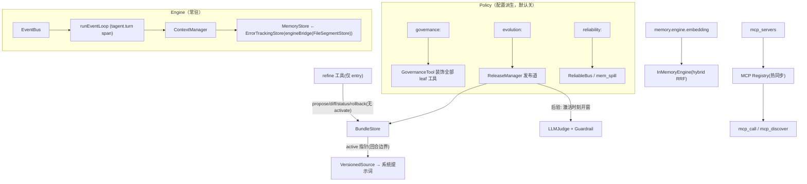

# 平台子系统（治理 · 自进化 · 可靠性 · 可观测 · 记忆引擎 · MCP）

## 一、模块定位

本篇覆盖 2026-09 大迭代新增的六个横切子系统。共同设计纪律：**全部配置门控、默认关闭 = 与既有行为逐字节一致**；不触碰任何工具 Declaration（prefix-cache 稳定）；失败以 result 渗透不中断 loop；观测点全部位于 Engine 侧。

## 二、文件清单

| 包 | 职责 |
|----|------|
| `agent/governance/` | RiskClassifier（C5 纯函数四级分级）、BudgetManager（滑窗+epoch 持久化）、ApprovalManager（digest 绑定+目录重扫）、DenialLedger（BindStore 延迟绑定持久审计）、GoalRegistry、GovernanceGate 决策管线、GovernanceTool leaf 装饰器 |
| `agent/reliability/` | DegradationManager（五依赖退化状态机）、SpillStore/ReliableBus（磁盘溢出全序）、AnchorStore（冥想锚点跨重启） |
| `evolution/` | BundleStore（不可变内容寻址+原子 active）、VersionedSource（prompt.Getter，回合边界生效）、ReleaseManager（风险分级发布道+双回滚）、refine 工具（无 activate）、Evidence/MetricGuardrail/LLMJudgeEvaluator（后验评估） |
| `memory/`（增量） | engine.go（C6 解耦缝契约：IndexBuilder/Retriever/MemoryEngine 及可选面，**居核心包**）、`engine/` 子包（适配器专区：engine_bridge 装饰器、engine_inmemory hybrid RRF、embedder zhipu/mock/traced、diagnostics）、`kv/` 子包（KV 存储后端专区：localfile/rustviking，契约 KVStore 居核心 `kv.go` 并附接入指南）、mem_spill、error_tracking、consolidation（服务端指纹） |
| `tool/mcp/` | Registry（YAML mcp_servers+热同步）、mcp_call 网关（声明恒定+DepMCP 上报） |
| `tool/memoryx/` | memory_consolidate、memory_health |
| `event/`（增量） | EventTypeSpec 注册表（类型元数据单点） |
| `agent/`（增量） | turn root span、trace.go、plugin/attribution.go |

## 三、组件关系总览

## 四、治理闸（governance）

全部 agent 的非 wrapper leaf 工具经 GovernanceTool 过闸：`classify → critical 批准 → goal → budget → 记账`。critical 未批准 → deny+Hold（外部落盘 `approvals/<id>.json` 即生效，Check 节流重扫目录）；预算滑窗按 agent 独立持久化；审计事件（DenialLedger）共享单实例、写 entry memStore 治理分区（durable）。`enforcement: warn` 只记账放行，`strict` 拒绝。

## 五、自进化（evolution）

refine 工具是 agent 的自我修改通道：**propose/diff/status/rollback 四 op，永无 activate**——激活只能经 ReleaseManager 发布道。DiffLaneRouter 按 diff 路由：仅提示词 → 快道（validate→canary→后验评估）；模型/参数/protected → 慢道（加人工批准门）。后验评估以 bundle **激活时刻**为证据窗起点（ActivationLog），MetricGuardrail 确定性闸 + LLMJudge 模型决策双回滚；judge 不可用/样本不足一律保守通过（不误回滚）。发布历史持久化 `releases.jsonl`，rollback 白名单 = 曾 Stage=active 的版本（含基线 seed）。

## 六、常驻可靠性（reliability）

- **ReliableBus**：channel 满则事件溢出落盘（channel 恒早于磁盘的全序 + pending 背压上限 + 重启恢复），at-least-once 不丢事件；
- **DegradationManager**：memory/disk/rustviking/model/mcp 五依赖退化-恢复状态机（ErrorTrackingStore 最外层装饰 + event_loop model 上报 + mcp_call DepMCP 上报）；
- **mem_spill**：StoreEvent 失败 → JSONL 兜底落盘，memory 恢复自动重放（重放前 GetEvent 预检幂等）；
- **AnchorStore**：冥想三锚点持久化，重启不误触发。

## 七、可观测（默认 noop 零开销）

turn root span（`tagent.turn`，含 EventKey/trigger_source 属性）为根，框架层 span（trpc llmflow/functioncall 自动埋点）挂为子树；trace_id/span_id 经 attribution 在**构造时**注入事件 Metadata（先于 StoreEvent，事件不可变保持）、写入 TrajectoryRecorder 的 LLMCallRecord（omitempty 向后兼容）、经 task Origin→settle Metadata 管道建立跨 turn span link。设 `OTEL_EXPORTER_OTLP_ENDPOINT` 导出。

## 八、记忆引擎与语义召回（memory.engine）

C6 解耦缝（IndexBuilder/Retriever/MemoryEngine）隔离引擎实现；engineBridge 装饰 store（未配置时原样返回）。异步嵌入 worker（选择性生成：external_input/agent_output）→ 向量 KV 持久化（独立键前缀）→ 启动异步重建（窗口期退化关键词）。recall query 模式融合：向量 topK ∪ 关键词 topK → RRF(k=60)，逐跳降级链保底关键词。实测（真实 zhipu embedding-3）：512 维分离度 ≈ 1024 维，默认推荐 512。

## 九、MCP 闭环（tool/mcp）

`mcp_servers` 顶层声明（transport 归一化兼容 streamable-http 等写法；api_key_env → Bearer header）；Registry 读时惰性 mtime 热同步（增删免重启，manual 条目不被配置同步删除）。`mcp_call` 网关声明恒定（server/tool/args 三参），失败返回自纠材料（可用清单/InputSchema 回显）；`mcp_discover` 实时读注册表输出如实调用指引。实测注意：zhipu web-search-prime 的真实工具名为下划线风格 `web_search_prime`。

## 十、与其他模块的关系

- 装饰器顺序（冻结契约 C2）：ErrorTrackingStore(engineBridge(FileSegmentStore))——退化追踪最外层，引擎旁路中间；
- 治理包裹在 refine 追加之后、OutputLimitTool 之前（治理先于执行，OutputLimit 封顶最终输出）；
- VersionedSource 与 prompt.Source 并存：未启用 evolution 走 mtime 热载（语义不变），启用后走 active bundle 回合边界生效。

## 已知缺口与演进方向

- ~~治理审计事件尚无来源 agent 字段~~ **已修(§8.1,postmerge-review-fixes 已归档)**:`DenialRecord.AgentName` + 事件 `metadata["agent"]`(omitempty),多子 agent 共享 Ledger 时治理审计可按来源区分;
- 慢道 replay/shadow 门为预留（nil 通过 + 审批门已实装默认拒）；bundle.Params/Model 仅存储就绪、无运行期应用点；
- Jaeger OTLP 实录与 AReaL reward 消费格式核对为环境实装项（非代码缺口）；
- **启用后 agent 在各复杂场景的行为反应**:见 [agent-behavior-matrix.md](./agent-behavior-matrix.md)(分场景分类,溯源代码);
- 完整裁决与修复账本：`openspec/changes/LEDGER.md`、`openspec/changes/tagent-evolution-roadmap/execution-dag.md`；行为契约：`openspec/specs/`（mcp-*、semantic-search、recall-hybrid-fusion、turn-tracing、trajectory-trace-correlation 等）。
