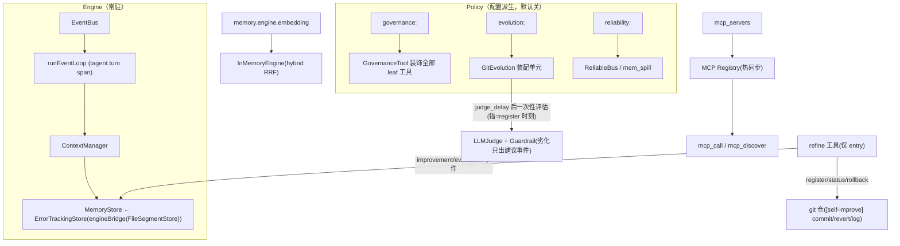

# 平台子系统（治理 · 自进化 · 可靠性 · 可观测 · 记忆引擎 · MCP）

## 一、模块定位

本篇覆盖 2026-09 大迭代新增的六个横切子系统。共同设计纪律：**全部配置门控、默认关闭 = 与既有行为逐字节一致**；不触碰任何工具 Declaration（prefix-cache 稳定）；失败以 result 渗透不中断 loop；观测点全部位于 Engine 侧。

## 二、文件清单

| 包 | 职责 |
|----|------|
| `agent/governance/` | RiskClassifier（C5 纯函数四级分级）、BudgetManager（滑窗+epoch 持久化）、ApprovalManager（digest 绑定+目录重扫+**ApprovalChannel 送达抽象**：Deliver 失败不阻塞门）、DenialLedger（BindStore 延迟绑定持久审计）、GoalRegistry（**BindStore 事件持久化+重启回放重建**）、GovernanceGate 决策管线、GovernanceTool leaf 装饰器；审批人工回应纯函数 RespondFile（digest 前缀匹配+幂等）/ParseApprovalReply（approve/reject 含中文动词） |
| `tool/govx/` | 治理面工具五件套（goal_declare/goal_list/goal_resolve/denial_query/approval_list）——**entry only**（与 refine 同槽位，先于治理包裹追加）；只登记/查询，批准权始终在人 |
| `agent/reliability/` | DegradationManager（五依赖退化状态机）、SpillStore/ReliableBus（磁盘溢出全序）、AnchorStore（冥想锚点跨重启） |
| `evolution/` | GitEvolution 装配单元（NewGitEvolution+BindRuntime 延迟绑定）、gitrefine 纯函数集（git exec+段匹配）、refine 工具（register/status/rollback）、improvement/evaluation 事件、Evidence/MetricGuardrail/LLMJudgeEvaluator（后验评估，劣化只出建议） |
| `memory/`（增量） | engine.go（C6 解耦缝契约：IndexBuilder/Retriever/MemoryEngine 及可选面，**居核心包**）、`engine/` 子包（适配器专区：engine_bridge 装饰器、engine_inmemory hybrid RRF、embedder zhipu/mock/traced、diagnostics）、`kv/` 子包（KV 存储后端专区：localfile/rustviking，契约 KVStore 居核心 `kv.go` 并附接入指南；**LocalFileKV 最小化裁决**（complete-resident-reliability-protocol §9.2：无 WAL/fsync 机——`Sync()`=全量快照 atomic tmp+rename，屏障成功后新进程可读回；`memory.fsync` 配置 accepted-and-ignored 仅兼容装载；掉电耐久不宣称，生产耐久档推迟 rustviking））、mem_spill（重放双写投影）、error_tracking、consolidation（服务端指纹+**建议式触发**：容量 hint 经 engineBridge 写入旁路计数→consolidation_hint 渗透+冥想 digest 候选清单，snooze 静默窗；counts/recent 为会话态，重启重积累（接受丢失）；min_source_events 硬门控）；feedback 事件（回执-反馈因果绑定，OnSettle/API 双来源，guardrail 负反馈判据） |
| `tool/mcp/` | Registry（YAML mcp_servers+热同步）、mcp_call 网关（声明恒定+DepMCP 上报） |
| `tool/memoryx/` | memory_consolidate、memory_health |
| `event/`（增量） | EventTypeSpec 注册表（类型元数据单点） |
| `agent/`（增量） | turn root span、trace.go、plugin/attribution.go |
| 根包（R4 热更） | `org_hotreload.go`（org 白名单子集指纹 + canonical 化）、`tagent.go`（WithConfigPath 懒检查接线 + Reload 编排 + ring 2 代际快照）、`build_agent.go`（buildMode 三谓词：isExecutorShell/ownsPersistentState/bindsProcessShared——build ownership 契约类型化）、`build_agent.go` 内 `buildRunner` 纯函数段（冷启动与热重建共用同一装配路径）、`org_hotreload.go` 的 `orgCoordinator`（版本簿记单一真源：current/prev ring-2 + `OrgStatus`/`OrgAgentApply`/`OrgFailure` 有界诊断快照）、`partition_collision.go` 的 `agentMemoryFingerprint`/`changedMemoryAgents`（逐 owner memory 先检）、`agent.ResidentTopology`（copy-on-write 不可变快照的常驻绑定表，热增删写入点）、`ContextManager.NewExecutorCandidate`/`PublishExecutor`/`BeginTurn`/`ExecutorRefs`（候选构造与发布分离 + turn 起点获取 + 引用面诊断） |

## 三、组件关系总览

```mermaid
graph TB
    subgraph Policy["Policy（配置派生，默认关）"]
        GOV["governance:"] --> GT["GovernanceTool 装饰全部 leaf 工具"]
        EVO["evolution:"] --> GE["GitEvolution 装配单元"]
        REL["reliability:"] --> RB["ReliableBus / mem_spill"]
    end
    subgraph Engine["Engine（常驻）"]
        BUS["EventBus"] --> LOOP["runEventLoop (tagent.turn span)"]
        LOOP --> CM["ContextManager"]
        CM --> STORE["MemoryStore ← ErrorTrackingStore(engineBridge(FileSegmentStore))"]
    end
    REFINE["refine 工具(仅 entry)"] -->|"register/status/rollback"| GIT["git 仓([self-improve] commit/revert/log)"]
    REFINE -->|"improvement/evaluation 事件"| STORE
    GE -->|"judge_delay 后一次性评估(锚=register 时刻)"| JUDGE["LLMJudge + Guardrail(劣化只出建议事件)"]
    EMB["memory.engine.embedding"] --> ENGINE["InMemoryEngine(hybrid RRF)"]
    MCPCFG["mcp_servers"] --> MREG["MCP Registry(热同步)"]
    MREG --> MCALL["mcp_call / mcp_discover"]
```

## 四、治理闸（governance）

全部 agent 的非 wrapper leaf 工具经 GovernanceTool 过闸：`classify → critical 批准 → goal → budget → 记账`。critical 未批准 → deny+Hold（外部落盘 `approvals/<id>.json` 即生效，Check 节流重扫目录）；预算滑窗按 agent 独立持久化；审计事件（DenialLedger）共享单实例、写 entry memStore 治理分区（durable）。`enforcement: warn` 只记账放行，`strict` 拒绝。

## 五、自进化（evolution · git 原生）

> self-evolution-git-native（设计返工，2026-09-07）：bundle 快照/发布道已退役——违反哲学四原则
> （文件即真源/复用 git/默认自迭代/信号建议式）。

自我改进循环 = **冥想（引擎：反思时机+产物生成）× refine（git 登记通道）× consolidation（记忆通道）**。
refine 三 op：**register**（产物落盘后登记：`[self-improve]` 标记 commit（仅 add 显式受控路径，
默认 `resources/prompts/**`,`skills/**`,`scripts/**`）+ improvement 事件即评估窗口锚）/
**status**（git log 过滤 + 窗口结论四态 join + 未登记产物提醒）/ **rollback**（安全 revert：
仅改进标记 commit，防误 revert 用户提交；回滚是终态不再评估）。后验评估：register 后
`judge_delay` 到期 guardrail（确定性）+ LLMJudge（质性）各评估一次，**劣化只写 evaluation 事件**
（verdict+证据+`refine rollback <sha>` 建议文案）——经冥想 digest/召回渗透，框架永不动手 revert；
样本不足显示「insufficient」不冒充健康。版本章：事件 Metadata 的 bundle_id 值=最新 improvement
的 commit sha（guardrail/feedback 沿因果边精确 join，缓存=性能层、事件=真源）。git 双轨台账：
git log（人审计）+ improvement/evaluation 事件（agent recall/join 控制面）。
⚠ 生产部署=独立 clone 部署仓；在源码仓内跑 example，改进 commit 会落入源码仓。

## 六、常驻可靠性（reliability）

四项各自独立的开关（全部空/false = 现状零行为变化）：

- **ReliableBus**（开关 `bus_spill_dir` 非空）：channel 满则事件溢出落盘（channel 恒早于磁盘的全序 + pending 背压上限 + 重启恢复），at-least-once 不丢事件；
- **DegradationManager**（开关 **`degradation_enabled`**，**独立布尔，与 governance 配置无耦合**）：memory/disk/rustviking/model/mcp 五依赖退化-恢复状态机（ErrorTrackingStore 最外层装饰 memStore + event_loop 上报 model 失败 + mcp_call 上报 DepMCP）；状态迁移写 governance degraded 事件（可观测/可 recall）；**降级行为层**（design-report-closeout 5.4，三项独立配置默认全关）：model 退化→turn 间退避（`degradation_model_backoff`）、mcp 退化→mcp_call 熔断+半开探测（`degradation_mcp_probe_every`）、disk 退化→禁新 spawn（`degradation_disk_block_spawn`，SpawnResult.Blocked 以可读 result 渗透，进行中任务不受影响）；
- **mem_spill**（开关 `mem_spill_dir` 非空，**且仅在 `degradation_enabled` 为真时接线**——它是退化状态机的存储兜底步）：StoreEvent 失败 → JSONL 兜底落盘，memory 恢复自动重放（重放前 GetEvent 预检幂等）；
- **AnchorStore**（开关 `meditation_anchor_dir` 非空）：冥想三锚点持久化，重启不误触发。

### 六.1 投递四态边界（volatile → durable → processed → delivered）

契约见 `persistent-event-loop` spec「输入处理确认与幂等」；四态**互不等价**，逐态诚实标注，绝不把前态冒充后态：

| 态 | 含义 | 代码锚点 | 崩溃存活 | 承诺边界 |
|----|------|---------|---------|---------|
| volatile accepted | 入内存 channel，未过 inbox 屏障 | `PublishReceipt{Durable:false}`（`agent/event_bus.go`） | 否 | 队列满/超时/存储失败 SHALL NOT 表示为 accepted |
| durable accepted | 文件+目录屏障完成后的回执 | `PublishReceipt{Durable:true}`、`Inbox.Enqueue`（fsync + 目录同步后才 durable，`agent/reliability/inbox.go`） | 是 | 202/accepted **只表示接收**，不表示已处理/已送达 |
| processed | turn 消费、事实链写处理回执并耐久后 ack inbox | `TypeInboxReceipt`（非投影、30d=去重窗口，`event/inbox_receipt.go`）；claim 不删原件，未 ack 崩溃可重试 | 是 | **至少一次**，不宣称 exactly-once；超 30d 同 request-id 不承诺幂等 |
| delivered | 经 outputCh 呈现给宿主/消费者 | outputCh（final 不回灌 EventBus）；慢消费者 2s 宽限→溢出落盘票据 | — | 投递仅经 outputCh，与 bus 自触发脉冲无关 |

> 未启用可靠模式（`bus_spill_dir` 空）= 纯 volatile：无 durable inbox，行为与旧 channel 逐字节一致（向后兼容）。

## 六·A、配置热重载（R4，非重启）

与上述 opt-in 子系统不同，R4 是运行机制层。版本获取点是**业务 turn 起点**（`ContextManager.BeginTurn`：先做一次配置检查，再取本 turn 钉定的执行器），**不再每次 LLM 迭代重编配置**；ops 入口 `CheckOrgReload` 与生产懒检查、回滚共用同一协调器入口。流程：

1. **memory 先检（逐 owner）**：`agentMemoryFingerprint` 对每个 agent 的 `memory.*` 段取指纹；`changedMemoryAgents` 的判定域是**已有 owner ∩ 本代可路由**——命中即 **拒绝** 并明示须重启（事实链/引擎接线不可热换）。两处排除：新 agent 自带 memory 段属全新 owner，不因此被误拒（否则热增删不可达）；「定义仍在 `agents:` 里但已被摘路由」的名字不进本代构造、无第二 writer 可防，也**不判**（否则一次无关的存储编辑会永久冻结整条热更路，审阅 H-1）。粘性未削：同名重入时它回到判定域、旧 fp 仍作基准，换存储照旧被拒。
2. **org 指纹对比**（`computeOrgFingerprint` 白名单子集：model/providers/tools/prompt wiring 等结构字段；数值参数经 `ApplyOrgHotParams` 原子热切换，不触发重建；`desired ≠ fingerprint` 是“改了没生效”的直接诊断（充分不必要：memory 轴被拒时二者相等，只有 `lastFailure` 说真话））；
3. **结构变更 → candidate-then-publish**：先 `fresh.Clone()` 取私有快照 → `buildModeExecutorShell` 重建 entry 壳（`NewExecutorCandidate`，逐身份借用常驻 `ResidentTopology` 的 store，不 Swap、不改在线执行器）→ 任一步失败 fail-closed 弃候选 → 成功才在常驻 cm 上 `PublishExecutor`（executorMu 写换入 + 退役旧 runner）。drain-free：进行中 turn 用旧 runner 跑完；
4. **子树热增删**（取代原「拓扑增减须重启」）：新增走 `buildModeResident`（原资源/恢复协议：自有 store + owner 登记 + 屏障 + 投影/registry 重建），以常驻表为构建缓存（同名依赖命中既有实例，绝不建第二 owner），`ResidentTopology.Add` 只并入新名后**随候选发布**；移除只摘除新代可路由集合与工具声明，原 owner **保留不提前退役**（旧代执行/后台任务仍可访问，也是同名重入复用的手段）；
5. **代际诊断 + ring 2 回滚**：`orgCoordinator` 是版本簿记单一真源（`OrgStatus{generation, fingerprint, desired, lastAppliedAt, lastFailure, agents[]}` 经 `OrgDiagnostics` 呈现，`ExecutorRefs{inFlightTurns, pendingRetirees}` 呈现退役引用/未收敛 owner；均只读，执行路径不依赖）；`Rollback()` 走 Clone→候选→发布同一回滚路径，发布为新序号。

边界：数值参数热切换 ⊂ 结构变更重建换执行器 ⊂ 子树热增删随候选发布 ⊂ `memory.*`（已有 owner）变更明确拒绝（阶段性取舍）。序号/指纹为不透明诊断标签，非应用可见 identity；无界历史被禁（常驻表/回执随拓扑定形，ring 仅两槽）。

## 七、可观测（默认 noop 零开销）

turn root span（`tagent.turn`，含 EventKey/trigger_source 属性）为根，框架层 span（trpc llmflow/functioncall 自动埋点）挂为子树；trace_id/span_id 经 attribution 在**构造时**注入事件 Metadata（先于 StoreEvent，事件不可变保持）、写入 TrajectoryRecorder 的 LLMCallRecord（omitempty 向后兼容）、经 task Origin→settle Metadata 管道建立跨 turn span link。设 `OTEL_EXPORTER_OTLP_ENDPOINT` 导出。

## 八、记忆引擎与语义召回（memory.engine）

C6 解耦缝（IndexBuilder/Retriever/MemoryEngine）隔离引擎实现；engineBridge 装饰 store（未配置时原样返回）。异步嵌入 worker（选择性生成：external_input/agent_output）→ 向量 KV 持久化（独立键前缀）→ 启动异步重建（窗口期退化关键词）。recall query 模式融合：向量 topK ∪ 关键词 topK → RRF(k=60)，逐跳降级链保底关键词。实测（真实 zhipu embedding-3）：512 维分离度 ≈ 1024 维，默认推荐 512。

## 九、MCP 闭环（tool/mcp）

`mcp_servers` 顶层声明（transport 归一化兼容 streamable-http 等写法；api_key_env → Bearer header）；Registry 读时惰性 mtime 热同步（增删免重启，manual 条目不被配置同步删除）。`mcp_call` 网关声明恒定（server/tool/args 三参），失败返回自纠材料（可用清单/InputSchema 回显）；`mcp_discover` 实时读注册表输出如实调用指引。实测注意：zhipu web-search-prime 的真实工具名为下划线风格 `web_search_prime`。

## 十、与其他模块的关系

- 装饰器顺序（冻结契约 C2）：ErrorTrackingStore(engineBridge(FileSegmentStore))——退化追踪最外层，引擎旁路中间；
- 治理包裹在 refine 追加之后、OutputLimitTool 之前（治理先于执行，OutputLimit 封顶最终输出）；
- 提示词真源唯一（git-native）：文件即真源——mtime 热载直生效；改进经 refine register 登记纳入评估保护，无版本遮蔽层。

## 已知缺口与演进方向

- ~~治理审计事件尚无来源 agent 字段~~ **已修**：`DenialRecord.AgentName`（json `agent,omitempty`）经 `GateDeps.AgentName` 由组合根按 agent 名注入 → 写事件 `metadata["agent"]`（omitempty，单 entry 场景不写噪声空键）→ `rebuildFromStore` 回读；多子 agent 共享同一 Ledger 时治理审计可按来源区分；
- 慢道 replay/shadow 门为预留（nil 通过 + 审批门已实装默认拒）；bundle.Params/Model 仅存储就绪、无运行期应用点；
- Jaeger OTLP 实录与 AReaL reward 消费格式核对为环境实装项（非代码缺口）；
- **启用后 agent 在各复杂场景的行为反应**:见 [agent-behavior-matrix.md](./agent-behavior-matrix.md)(分场景分类,溯源代码);
- 完整裁决与修复账本：`openspec/changes/LEDGER.md`、`openspec/changes/tagent-evolution-roadmap/execution-dag.md`；行为契约：`openspec/specs/`（mcp-*、semantic-search、recall-hybrid-fusion、turn-tracing、trajectory-trace-correlation 等）。
