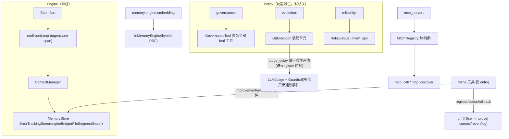

# 平台子系统（治理 · 自进化 · 可靠性 · 可观测 · 记忆引擎 · MCP）

## 一、模块定位

本篇覆盖六个横切子系统与配置热重载。共同设计纪律：**全部配置门控、默认关闭 = 与既有行为逐字节一致**；不触碰任何工具 Declaration（prefix-cache 稳定）；失败以 result 渗透不中断 loop；观测点全部位于 Engine 侧。

## 二、文件清单

| 包 | 职责 |
|----|------|
| `agent/governance/` | RiskClassifier（C5 纯函数四级分级）、BudgetManager（滑窗+epoch 持久化）、ApprovalManager（digest 绑定+目录重扫+**ApprovalChannel 送达抽象**：Deliver 失败不阻塞门）、DenialLedger（BindStore 延迟绑定持久审计）、GoalRegistry（**BindStore 事件持久化+重启回放重建**）、GovernanceGate 决策管线、GovernanceTool leaf 装饰器；审批人工回应纯函数 RespondFile（digest 前缀匹配+幂等）/ParseApprovalReply（approve/reject 含中文动词） |
| `tool/govx/` | 治理面工具五件套（goal_declare/goal_list/goal_resolve/denial_query/approval_list）——**entry only**（与 refine 同槽位，先于治理包裹追加）；只登记/查询，批准权始终在人 |
| `agent/reliability/` | DegradationManager（五依赖退化状态机）、SpillStore/ReliableBus（磁盘溢出全序）、AnchorStore（冥想锚点跨重启） |
| `evolution/` | GitEvolution 装配单元（NewGitEvolution+BindRuntime 延迟绑定）、gitrefine 纯函数集（git exec+段匹配）、refine 工具（register/status/rollback）、improvement/evaluation 事件、Evidence/MetricGuardrail/LLMJudgeEvaluator（后验评估，劣化只出建议） |
| `memory/`（增量） | engine.go（C6 解耦缝契约：IndexBuilder/Retriever/MemoryEngine 及可选面，**居核心包**）、`engine/` 子包（适配器专区：engine_bridge 装饰器、engine_inmemory hybrid RRF、embedder zhipu/mock/traced、diagnostics）、`kv/` 子包（KV 存储后端专区：localfile/rustviking，契约 KVStore 居核心 `kv.go` 并附接入指南；**LocalFileKV 最小化裁决**（无 WAL/fsync 机——`Sync()`=按分区桶的增量快照 atomic tmp+rename（仅脏桶落盘），屏障成功后新进程可读回；掉电耐久不宣称，生产耐久档推迟 rustviking））、mem_spill（重放双写投影）、error_tracking、consolidation（服务端指纹+**建议式触发**：容量 hint 经 engineBridge 写入旁路计数→consolidation_hint 渗透+冥想 digest 候选清单，snooze 静默窗；counts/recent 为会话态，重启重积累（接受丢失）；min_source_events 硬门控）；feedback 事件（回执-反馈因果绑定，OnSettle/API 双来源，guardrail 负反馈判据） |
| `tool/mcp/` | Registry（YAML mcp_servers+热同步）、mcp_call 网关（声明恒定+DepMCP 上报） |
| `tool/memoryx/` | memory_consolidate、memory_health |
| `event/`（增量） | EventTypeSpec 注册表（类型元数据单点） |
| `agent/`（增量） | turn root span、trace.go、plugin/attribution.go |
| 根包（组织编排与热更） | `org_hotreload.go`（org 白名单子集指纹 canonical 化 + `orgCoordinator` 版本簿记单一真源：current/prev 双槽回滚环 + 有界诊断快照）、`tagent.go`（WithConfigPath 懒检查接线 + reload/rollback 编排 + 唯一已提交应用记录 `appliedRecord` 的发布事务）、`org_candidate_overlay.go`/`org_candidate_txn.go`（候选私有 overlay 与有序责任表——reload/rollback 共用一次候选事务，失败逆序回收）、`owner_retirement.go`（owner 义务轴与退役账：诊断与回收判据的数据源）、`build_agent.go`（常驻构建纯函数段——冷启动/热新增/换代共用同一装配路径）、`partition_collision.go` 的 `agentMemoryFingerprint`/`changedMemoryAgents`（逐 owner memory 先检）、`agent.ResidentTopology`（copy-on-write 常驻绑定表，热增删写入点）、`agent` 侧 `NewExecutorCandidate`/`StageExecutor`/`ActivateExecutor`/`PublishExecutor`/`BeginTurnLease`/`ExecutorRefs`（候选构造与发布分离、组织纳管、turn 起点取代、引用面诊断）、`event/wf_facts.go`（工作流事实与被动排除） |

## 三、组件关系总览

```mermaid
graph TB
    subgraph Policy["Policy（配置派生，默认关）"]
        GOV["governance:"] --> GT["GovernanceTool 装饰全部 leaf 工具"]
        EVO["evolution:"] --> GE["GitEvolution 装配单元"]
        REL["reliability:"] --> RB["ReliableBus / mem_spill"]
    end
    subgraph Engine["Engine（常驻）"]
        BUS["EventBus"] --> LOOP["runEventLoop (tagent.turn span)"]
        LOOP --> CM["ContextManager"]
        CM --> STORE["MemoryStore ← ErrorTrackingStore(engineBridge(FileSegmentStore))"]
    end
    REFINE["refine 工具(仅 entry)"] -->|"register/status/rollback"| GIT["git 仓([self-improve] commit/revert/log)"]
    REFINE -->|"improvement/evaluation 事件"| STORE
    GE -->|"judge_delay 后一次性评估(锚=register 时刻)"| JUDGE["LLMJudge + Guardrail(劣化只出建议事件)"]
    EMB["memory.engine.embedding"] --> ENGINE["InMemoryEngine(hybrid RRF)"]
    MCPCFG["mcp_servers"] --> MREG["MCP Registry(热同步)"]
    MREG --> MCALL["mcp_call / mcp_discover"]
```

### 模型解析与轨迹包裹

`wiring.go` 的 `resolveAgentModel` 返回单个 agent 的 LLM 调用所用模型实例，按 provider+model 对缓存。解析顺序：`rc.modelOverrides` 的按名实例 → agent 自己的模型（按其 provider 查找，未声明时落全局 `cfg.Provider`）→ 全局默认模型 → `WithModel` 注入的 `rc.model`。启用时 `TrajectoryRecorder` 包裹每个返回实例（含 override 命中）：包裹位于 `SwappableModel` 之外，因此记录器观察换后流量；包裹按 `buildAgent` 调用构造，重复解析不会在同一实例上叠层。全局默认经 provider 注册表解析，纯 yaml 声明的模型同样可用。

### 工作区暂存与清理

`workspace` 包集中管理磁盘暂存：`Root` 归一暂存根，`ToolOutputPath` 给出超限工具输出的落盘位置（`<root>/tool-output/`，服务 OutputLimitTool 与 ActionTool）。`Cleaner` 周期回收按年龄与文件数双重上界封顶累积。命令工作目录不属于暂存面：exec 继承进程工作目录，其相对路径语义与暂存根无关。

## 四、治理闸（governance）

全部 agent 的非 wrapper leaf 工具经 GovernanceTool 过闸：`classify → critical 批准 → goal → budget → 记账`。critical 未批准 → deny+Hold（外部落盘 `approvals/<id>.json` 即生效，Check 节流重扫目录）；预算滑窗按 agent 独立持久化；审计事件（DenialLedger）共享单实例、写 entry memStore 治理分区（durable）。`enforcement: warn` 只记账放行，`strict` 拒绝。

账本共享而预算独立，因此一次拒绝必须自带来源：记录带 `DenialRecord.AgentName`，由组合根按 agent 名注入 → 写入治理事件 `metadata["agent"]` → 回读时仍在。共享账本之下多 agent 的拒绝按来源可区分，否则账本只反映"有东西被拒"而回答不了"谁被拒"。

**分级判据取工具声明名，不取注册 ID**：`GovernanceTool` 用内层工具 `Declaration().Name` 构造 `RiskContext`，注册时的装配别名（注册 ID）根本不进分级面——换个注册名逃不掉分级，声明叫什么就按什么分级。

**认知资产写审批**：`DefaultRules` 含 `exec.cognitive-asset-write` → critical（写形态命中 `resources/prompts/`、`skills/`、`scripts/` 时人在环批准，refine 登记不豁免）。这是 cognitive-asset-guard 的**脚手架**（文本匹配可绕），其上有默认开启、不依赖 governance 的 **D1 hash 漂移审计**（不可绕兜底），终态方向是**权限域分离**（资产目录对 exec 物理只读）。全貌、拆除账本与同源清单见 [cognitive-asset-guard.md](./cognitive-asset-guard.md)。

**拒绝以工具结果回给模型，而不是 Go error**：`warn` 放行只记账；`strict` 与批准挂起都返回一段以 `[governance_denied]` 开头的**结果文本**（带原因、风险级别、命中规则，并指引"调整操作或走批准/goal 登记后重试"），调用本身不执行、也不作为错误抛出。被拒的理由必须出现在模型读得到的地方，否则它既看不见为什么失败，也没有自纠的入口。

## 五、自进化（evolution · git 原生）

> 自进化不采用 bundle 快照/发布道——违反哲学四原则（文件即真源/复用 git/默认自迭代/信号建议式）。

开关 `evolution.enabled`（默认关 → 零行为变化）决定这套装配是否存在。启用时构造 git 原生自进化单元，`refine` 由 buildAgent 直接追加（不经注册表、仅 entry）；启动自检 git 仓**只 Warn 不阻断**——不在仓里时改文件仍然生效，只是没有留痕与评估保护。

启用后这个单元挂在 entry 身上的三处：`refine` 工具（每次 entry 构建都追加）、bundle id 提供者（取最近一次改进 commit）、Stop closer（agent 关停时回收自进化的后台工作）。后两者属**进程级 once 绑定**——热重建壳不重复绑，与 ReliableBus 的"壳不重复登记"同一门（见[资源所有权](./resource-ownership.md)）。

自我改进循环 = **冥想（引擎：反思时机+产物生成）× refine（git 登记通道）× consolidation（记忆通道）**。
refine 三 op：**register**（产物落盘后登记：`[self-improve]` 标记 commit（仅 add 显式受控路径，
默认 `resources/prompts/**`,`skills/**`,`scripts/**`）+ improvement 事件即评估窗口锚）/
**status**（git log 过滤 + 窗口结论四态 join + 未登记产物提醒）/ **rollback**（安全 revert：
仅改进标记 commit，防误 revert 用户提交；回滚是终态不再评估）。后验评估：register 后
`judge_delay` 到期 guardrail（确定性）+ LLMJudge（质性）各评估一次，**劣化只写 evaluation 事件**
（verdict+证据+`refine rollback <sha>` 建议文案）——经冥想 digest/召回渗透，框架永不动手 revert；
样本不足显示「insufficient」不冒充健康。版本章：事件 Metadata 的 bundle_id 值=最新 improvement
的 commit sha（guardrail/feedback 沿因果边精确 join，缓存=性能层、事件=真源）。git 双轨台账：
git log（人审计）+ improvement/evaluation 事件（agent recall/join 控制面）。
⚠ 生产部署=独立 clone 部署仓；在源码仓内跑 example，改进 commit 会落入源码仓。

## 六、常驻可靠性（reliability）

四项各自独立的开关（全部空/false = 现状零行为变化）：

- **ReliableBus**（开关 `bus_spill_dir` 非空）：channel 满则事件溢出落盘（channel 恒早于磁盘的全序 + pending 背压上限 + 重启恢复），at-least-once 不丢事件；每个 agent 只用自己的子目录 `<bus_spill_dir>/<agent>`（防多 agent 事件串流），该目录**在构建期就存在**，不必等第一次溢出；开关为空则回退纯 channel；
- **DegradationManager**（开关 **`degradation_enabled`**，**独立布尔，与 governance 配置无耦合**）：memory/disk/rustviking/model/mcp 五依赖退化-恢复状态机（ErrorTrackingStore 最外层装饰 memStore + event_loop 上报 model 失败 + mcp_call 上报 DepMCP）；状态迁移写 governance degraded 事件（可观测/可 recall）；**降级行为层**（三项独立配置默认全关）：model 退化→turn 间退避（`degradation_model_backoff`）、mcp 退化→mcp_call 熔断+半开探测（`degradation_mcp_probe_every`）、disk 退化→禁新 spawn（`degradation_disk_block_spawn`，SpawnResult.Blocked 以可读 result 渗透，进行中任务不受影响）；
- **mem_spill**（开关 `mem_spill_dir` 非空，**且仅在 `degradation_enabled` 为真时接线**——它是退化状态机的存储兜底步）：StoreEvent 失败 → JSONL 兜底落盘，memory 恢复自动重放（重放前 GetEvent 预检幂等）；
- **AnchorStore**（开关 `meditation_anchor_dir` 非空）：冥想三锚点持久化，重启不误触发。

### 六.1 投递四态边界（volatile → durable → processed → delivered）

契约见 `openspec/specs/persistent-event-loop`「输入处理确认与幂等」；四态**互不等价**，逐态诚实标注，绝不把前态冒充后态：

| 态 | 含义 | 代码锚点 | 崩溃存活 | 承诺边界 |
|----|------|---------|---------|---------|
| volatile accepted | 入内存 channel，未过 inbox 屏障 | `PublishReceipt{Durable:false}`（`agent/event_bus.go`） | 否 | 队列满/超时/存储失败 SHALL NOT 表示为 accepted |
| durable accepted | 文件+目录屏障完成后的回执 | `PublishReceipt{Durable:true}`、`Inbox.Enqueue`（fsync + 目录同步后才 durable，`agent/reliability/inbox.go`） | 是 | 202/accepted **只表示接收**，不表示已处理/已送达 |
| processed | turn 消费、事实链写处理回执并耐久后 ack inbox | `TypeInboxReceipt`（非投影、30d=去重窗口，`event/inbox_receipt.go`）；claim 不删原件，未 ack 崩溃可重试 | 是 | **至少一次**，不宣称 exactly-once；超 30d 同 request-id 不承诺幂等 |
| delivered | 经 outputCh 呈现给宿主/消费者 | outputCh（final 不回灌 EventBus）；慢消费者 2s 宽限→溢出落盘票据 | — | 投递仅经 outputCh，与 bus 自触发脉冲无关 |

> 未启用可靠模式（`bus_spill_dir` 空）= 纯 volatile：无 durable inbox，行为与旧 channel 逐字节一致（向后兼容）。

## 六·A、配置热重载（非重启）

与上述 opt-in 子系统不同，热重载是运行机制层，默认启用。版本获取点是**业务 turn 起点**（`ContextManager.BeginTurnLease`：先做一次非阻塞配置检查，再钉定本 turn 的执行代），不在每次 LLM 迭代重编配置；ops 入口 `CheckOrgReload` 与生产懒检查、回滚共用同一协调器入口，不形成第二生效路径。reload 与 rollback 只是配置来源不同，共用**一次候选事务**（取私有快照 → 候选构造 → 单闸门提交；任一步失败按责任表获取逆序回收，fail-closed 服务旧代）。

流程与门（按序）：

1. **entry 身份先拒**：常驻入口改名在任何候选资源构建之前拒绝并明示须重启——后续解析一律以启动时 `cfg.Entry` 为基准；
2. **memory 先检（逐 owner）**：`agentMemoryFingerprint` 对每个 agent 的 `memory.*` 段取指纹；`changedMemoryAgents` 的判定域是**已有 owner ∩ 本代可路由**——命中即拒绝并明示须重启（运行时存储不可热迁）。新 agent 自带 memory 段属全新 owner，不因此被误拒；「定义仍在 `agents:` 里但已被摘路由」的名字不进本代构造，也不判（无第二 writer 可防）。粘性保留：同名重入回到判定域，旧指纹仍作基准；
3. **退役中同名重入先拒**：本代想要的名字若其 owner 已开始关闭，则在构建前拒绝（复用不可能、新 owner 会开第二 writer）；
4. **org 指纹对比**（`computeOrgFingerprint` 白名单子集：model/providers/tools/prompt wiring 等结构字段）。指纹不变＝数值热更：五个热参（压缩阈值/预算/保留数/任务 TTL 两值）随唯一已提交应用记录轮转，**消费边界现读**，无 push、无逐实例广播；`desired ≠ effective` 是「改了没生效」的直接诊断（memory 轴被拒时二者相等，`lastFailure` 说真话）；
5. **结构变更 → 候选事务**：候选解析域＝在线 owner 快照＋本候选新增者（remote-only 引用不创建本地 owner，混合可达仍显式失败）。remote-only 这一格必须让发布循环也认：可达性判据在校验与构造器处都已遵守，唯独发布循环不认时，一份冷启动能正常加载的配置会在**第一次热更被永久封死**——每次检查都拒绝它，而它本来从未出过问题→ 已存在 agent 只换执行面（`NewExecutorCandidate` 装配 → `StageExecutor` 纳管声明持有与工具接线），热新增 agent 完整常驻构造（自有 store/owner 登记/投影与 registry 重建）→ 单闸门提交：换 runner、发布执行面、轮转应用记录、激活各 owner 代并重接任务监视（tracker 重挂与激活同一时机）→ 失败逆序回收。drain-free：进行中 turn 持旧代跑完；
6. **移除≠退役**：摘除只去掉新代可路由集合与工具声明；原 owner 保留至其义务（在途引用、自有任务、结果回流）清零后由排空面退役，存储身份基准不因实例退役丢弃（同名重入按基准拒绝换存储）；换代装配产生的**声明持有**（`heldBy`）不属于这三项义务，不计入义务轴——它只是代际引用的登记，单独存在时不构成阻断退役的理由。
7. **代际诊断与回滚**：`orgCoordinator` 是版本簿记单一真源——`OrgStatus{generation, fingerprint, desired, lastAppliedAt, lastFailure, agents[]}`、实时引用债（在途执行器引用/待退役列表）与关闭相位（已发起/资源已退出）经 `OrgDiagnostics` 分组呈现，均只读、执行路径不依赖；`Rollback()` 取回滚环（双槽）里的上一份完整有效配置，走同一候选事务发布为新序号（仅影响之后开始的调用）。

边界：数值热更 ⊂ 结构变更换代 ⊂ 子树热增删随候选发布 ⊂ `memory.*`（已有 owner）变更明确拒绝。序号/指纹为不透明诊断标签；无界历史被禁（常驻表/回执随拓扑定形，回滚环仅双槽）。

## 六·B、配置解码的严格度契约（internal/strictyaml）

**所有配置入口共用同一个严格解码实现**：未知字段一律让加载**明确失败**，而不是静默忽略一个拼错的关键字。新增配置入口必须走这个包，不得另立第二套严格度——多套严格度迟早出现"某条路径静默接受拼错的键"，那类缺陷的表现是配置看起来生效了而实际没有。

| 输入 | 行为 | 为什么 |
|---|---|---|
| 未知字段 | 失败，并在错误里点名该字段 | 拼错的键若被忽略，用户会以为改动了行为 |
| YAML 首个文档之后的**尾随文档** | 失败 | 静默忽略第二个文档会让用户以为其中配置已生效 |
| JSON 首个值之后的**尾随内容** | 失败 | 同上：拼接两份配置绝不可能是用户意图 |
| 完全空的文档 | 成功，解出零值 | "没写"与"写错"必须区分；空配置是合法的默认起点 |
| 票据的 `0x` 前缀形式 | 正常解析 | 这是模型复述标识符的合法形式（宽容是设计，不是巧合） |

同一处还守护工具面的**路由白名单**：未列入白名单的操作名一律显式拒绝——已退役的旧操作名重新出现时，宁可报错也不静默接管。

## 七、可观测（默认 noop 零开销）

turn root span（`tagent.turn`，含 EventKey/trigger_source 属性）为根，框架层 span（trpc llmflow/functioncall 自动埋点）挂为子树；trace_id/span_id 经 attribution 在**构造时**注入事件 Metadata（先于 StoreEvent，事件不可变保持）、写入 TrajectoryRecorder 的 LLMCallRecord（omitempty 向后兼容）、经 task Origin→settle Metadata 管道建立跨 turn span link。设 `OTEL_EXPORTER_OTLP_ENDPOINT` 导出。

## 八、记忆引擎与语义召回（memory.engine）

C6 解耦缝（IndexBuilder/Retriever/MemoryEngine）隔离引擎实现；engineBridge 装饰 store（未配置时原样返回）。异步嵌入 worker（选择性生成：external_input/agent_output）→ 向量 KV 持久化（独立键前缀）→ 启动异步重建（窗口期退化关键词）。recall query 模式融合：向量 topK ∪ 关键词 topK → RRF(k=60)，逐跳降级链保底关键词。实测（真实 zhipu embedding-3）：512 维分离度 ≈ 1024 维，默认推荐 512。

## 九、MCP 闭环（tool/mcp）

`mcp_servers` 顶层声明（transport 归一化兼容 streamable-http 等写法；api_key_env → Bearer header）；Registry 读时惰性 mtime 热同步（增删免重启，manual 条目不被配置同步删除）。`mcp_call` 网关声明恒定（server/tool/args 三参），失败返回自纠材料（可用清单/InputSchema 回显）；`mcp_discover` 实时读注册表输出如实调用指引。实测注意：zhipu web-search-prime 的真实工具名为下划线风格 `web_search_prime`。

## 十、与其他模块的关系

- 装饰器顺序（冻结契约 C2）：ErrorTrackingStore(engineBridge(FileSegmentStore))——退化追踪最外层，引擎旁路中间；
- 治理包裹在 refine 追加之后、OutputLimitTool 之前（治理先于执行，OutputLimit 封顶最终输出）；
- 提示词真源唯一（git-native）：文件即真源——mtime 热载直生效；改进经 refine register 登记纳入评估保护，无版本遮蔽层。

## 已知缺口与演进方向

- 治理审计带来源 agent 字段：`DenialRecord.AgentName`（json `agent,omitempty`）经 `GateDeps.AgentName` 由组合根按 agent 名注入 → 写事件 `metadata["agent"]` → `rebuildFromStore` 回读；多子 agent 共享同一 Ledger 时审计可按来源区分；
- 慢道 replay/shadow 门为预留（nil 通过 + 审批门默认拒）；bundle.Params/Model 仅存储就绪、无运行期应用点；
- Jaeger OTLP 实录与 AReaL reward 消费格式核对为环境实装项（非代码缺口）；
- **启用后 agent 在各复杂场景的行为反应**:见 [agent-behavior-matrix.md](./agent-behavior-matrix.md)(分场景分类,溯源代码);
- 完整裁决与修复账本：`openspec/changes/LEDGER.md`、`openspec/changes/archive/2026-09-06-tagent-evolution-roadmap/execution-dag.md`；行为契约：`openspec/specs/`（mcp-*、semantic-search、recall-hybrid-fusion、turn-tracing、trajectory-trace-correlation 等）。
