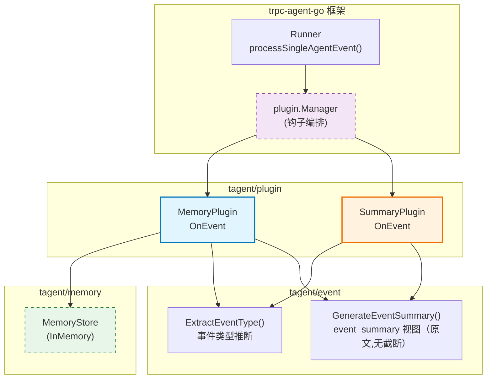
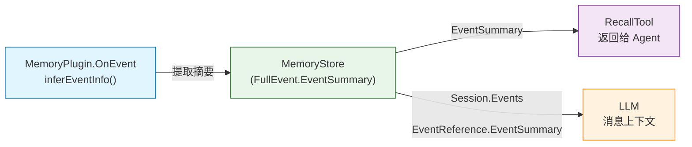
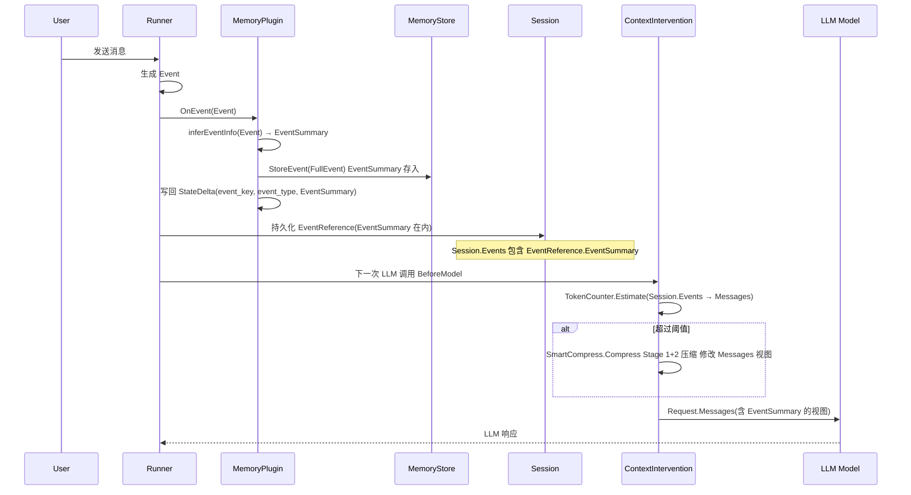
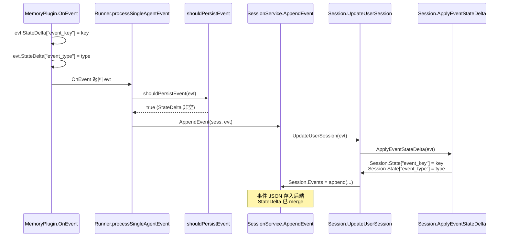
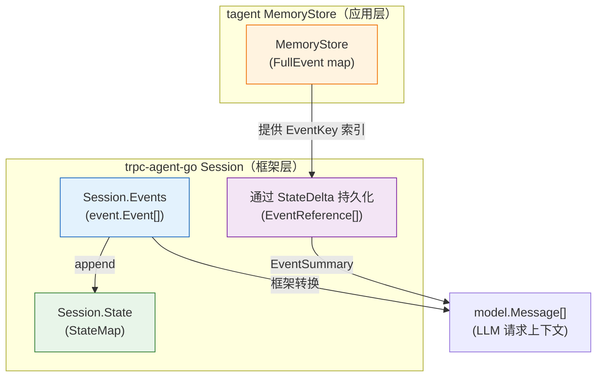

# tagent/plugin 模块架构文档

## 一、模块定位

`tagent/plugin` 是 tagent 为 trpc-agent-go Runner 提供的一组**事件钩子插件**。

**核心职责**：通过 `plugin.Plugin` 接口将 tagent 的差异化能力（持久化、摘要）注入到框架的事件流中。

**设计原则**：
- **每个 Plugin 职责单一**：MemoryPlugin 专注持久化 + 因果链 + 同点投影（ProjectionSink），SummaryPlugin 专注 Tag 与 `event_summary` 元数据标注（**原文视图，非内容总结**——内容级总结收归压缩固化时刻）
- **严格拒绝非设计折损**：摘要中完全禁止任何形式的截断，内容超限由 SmartCompress 处理
- **通过 OnEvent 而非 Before/After Model**：在事件层面处理，不侵入 LLM 调用流程

---

## 二、文件清单

| 文件 | 行数 | 职责 |
|------|------|------|
| `memory_plugin.go` | 222 | 事件持久化：推断类型、生成 EventKey、构建因果链、写入 StateDelta |
| `summary_plugin.go` | 76 | 事件摘要：生成 Tag 并追加到事件 |
| `memory_plugin_test.go` | 165 | 单元测试：覆盖类型推断、因果链、摘要策略 |

---

## 三、组件关系总览图



---

## 四、Plugin 注册机制

### 4.1 tagent 与框架的集成点

`plugin.Plugin` 接口（`trpc-agent-go/plugin/manager.go:33-39`）：

```go
type Plugin interface {
    Name() string
    Register(r *Registry)
}
```

tagent 在 `NewTagentAgent` 中注册两个 Plugin：

```go
// tagent_agent.go:118-122
r := runner.NewRunner("tagent", llmAgent, runner.WithPlugins(
    tagentplugin.NewSummaryPlugin(),  // 先注册：Tag 注入
    memPlugin,                        // 后注册：持久化
))
```

**注册顺序有意义**：`SummaryPlugin` 先注册先执行，先注入 Tag；`MemoryPlugin` 后注册后执行，持久化时事件已包含 Tag。

### 4.2 OnEvent 的调用时机

`Runner.processSingleAgentEvent` 在处理每个事件时调用 OnEvent（`trpc-agent-go/runner/runner.go:756-794`）：

```go
func (r *runner) processSingleAgentEvent(ctx context.Context, loop *eventLoopContext, agentEvent *event.Event) error {
    // Step 1: 通过所有 Plugin 的 OnEvent 钩子
    agentEvent = r.applyEventPlugins(ctx, loop.invocation, agentEvent)

    // Step 2: 持久化到 Session
    r.handleEventPersistence(ctx, loop.invocation, loop.sess, agentEvent)

    // Step 3: 发送到输出 channel
    event.EmitEvent(ctx, loop.processedEventCh, agentEvent)
}
```

**关键**：OnEvent 在持久化 Session **之前**被调用。`MemoryPlugin` 持久化时，事件已经包含 `SummaryPlugin` 注入的 Tag。

### 4.3 链式传递机制

`Manager.OnEvent` 按注册顺序依次执行钩子，链式传递事件对象（`trpc-agent-go/plugin/manager.go:275-295`）：

```go
func (m *Manager) OnEvent(ctx context.Context, invocation *agent.Invocation, e *event.Event) (*event.Event, error) {
    curr := e
    for _, h := range m.eventHooks {
        next, err := h.hook(ctx, invocation, curr)
        if err != nil {
            return nil, fmt.Errorf("plugin %q: %w", h.name, err)
        }
        if next != nil {
            curr = next  // 链式传递
        }
    }
    return curr, nil
}
```

---

## 五、MemoryPlugin — 事件持久化

### 5.1 数据结构

```go
// memory_plugin.go:28-42
type MemoryPlugin struct {
    memStore      memory.MemoryStore  // 存储后端
    mu            sync.Mutex          // 保护 lastEventKeys 并发安全
    lastEventKeys map[string]int64   // "partitionID:sessionID" → 前驱 EventKey（分区+会话级因果链）
}
```

### 5.2 OnEvent 钩子 — 10 步详解

源码位置：`memory_plugin.go:63-131`

```go
func (p *MemoryPlugin) onEvent(ctx context.Context, inv *agent.Invocation, evt *event.Event) (*event.Event, error) {
    if evt == nil {
        return nil, nil
    }

    // Step 1: 从 AgentName 派生 PartitionID（框架概念 → 存储概念）
    agentName := p.extractAgentName(inv)
    partitionID := memory.PartitionIDFromName(agentName)

    // Step 2: 生成 Snowflake EventKey（int64，编码 PartitionID）
    eventKey := memory.NewSnowflakeEventKey(partitionID, 0)

    // Step 3: 使用 tagent/event 包统一推断事件类型并生成 event_summary 视图
    eventType, eventSummary := p.inferEventInfo(evt)

    // Step 4: 从分区+会话级因果链获取前驱 Key
    sessionID := ""
    if inv != nil && inv.Session != nil {
        sessionID = inv.Session.ID
    }
    causalKey := fmt.Sprintf("%d:%s", partitionID, sessionID)
    p.mu.Lock()
    parentKey := p.lastEventKeys[causalKey]
    p.mu.Unlock()

    // Step 5: 提取时间戳
    timestamp := extractTimestamp(evt)

    // Step 6: 构建 FullEvent 基础字段
    fullEvent := memory.FullEvent{
        EventKey:     eventKey,
        PartitionID:  partitionID,
        EventType:    eventType,
        EventSummary: eventSummary,
        Timestamp:    timestamp,
    }

    // Step 7: 条件性填充 Response 相关字段
    if evt.Response != nil && len(evt.Response.Choices) > 0 {
        msg := evt.Response.Choices[0].Message
        fullEvent.Content = msg.Content
        fullEvent.ToolCalls = msg.ToolCalls
        fullEvent.Response = evt.Response
    }

    // Step 8: 持久化到 MemoryStore，并在存储成功后**同点投影**（D1：
    // 存储 ⇔ 投影恰好一次）——ctx 携带当前 invocation 的 ProjectionSink，
    // Append(EventReference) 与 StoreEvent 在同一点完成
    if p.memStore != nil {
        if err := p.memStore.StoreEvent(eventKey, fullEvent); err != nil {
            log.Errorf("[Memory] store failed key=%d partition=%d: %v", eventKey, partitionID, err)
        } else {
            if sink, ok := ProjectionSinkFrom(ctx); ok {
                sink.Append(ref) // 同点投影（unified-event-projection D1）
            }
        }
    }

    // Step 9: 写回 StateDelta（event_key 转为字符串后写入，确保框架持久化）
    if evt.StateDelta == nil {
        evt.StateDelta = make(map[string][]byte)
    }
    evt.StateDelta[tagentevent.MetaKeyEventKey] = []byte(tagentevent.FormatEventKey(eventKey)) // hex 契约
    evt.StateDelta[tagentevent.MetaKeyPartitionID] = []byte(strconv.Itoa(partitionID))
    evt.StateDelta[tagentevent.MetaKeyEventType] = []byte(eventType)

    // Step 10: 更新分区+会话级因果链，并通过 RelationStore 维护因果关系
    p.mu.Lock()
    p.lastEventKeys[causalKey] = eventKey
    p.mu.Unlock()
    if parentKey > 0 {
        // 通过 RelationStoreProvider type assertion 访问因果关系
        if rsp, ok := p.memStore.(memory.RelationStoreProvider); ok {
            rsp.RelationStore().SetParent(eventKey, parentKey)
        }
    }

    return evt, nil
}
```

### 5.3 因果链机制

每个事件通过 `RelationStore.SetParent(childKey, parentKey)` 维护因果关系，构成一条有向事件链：

```
1777198738547555000 (事件1)
  RelationStore: parent=0  (无前驱)

1777198739574803000 (事件2)
  RelationStore: parent=1777198738547555000  → 父 = 事件1

1777198739760667000 (事件3)
  RelationStore: parent=1777198739574803000  → 父 = 事件2
```

**作用**：
- 支持按因果顺序回溯事件历史
- 为 RecallTool 提供结构化检索能力
- 压缩通知中可引用被丢弃的因果链

**并发安全**：`p.mu` 保护 `lastEventKeys map[int]int64` 的读写（按 PartitionID 独立跟踪，互不影响）。

### 5.4 StateDelta 写回

`MemoryPlugin` 写入 `StateDelta` 是为了**确保 Runner 持久化事件**。Runner 的 `shouldPersistEvent` 规则（`trpc-agent-go/runner/runner.go:997-1003`）：

```go
func (r *runner) shouldPersistEvent(agentEvent *event.Event) bool {
    return len(agentEvent.StateDelta) > 0 ||
        (agentEvent.Response != nil && !agentEvent.IsPartial && agentEvent.IsValidContent())
}
```

只要 `StateDelta` 非空，即使 `Response` 为空或 partial，事件也会被持久化到 Session。

---

## 六、SummaryPlugin — Tag 与元数据标注（退位后职责）

### 6.1 职责定位

SummaryPlugin 在 `MemoryPlugin` 之前执行，负责给事件附加**可读的 Tag**，供下游消费者（如日志、调试、UI）理解事件语义。

### 6.2 OnEvent 钩子详解

源码位置：`summary_plugin.go:38-76`

```go
func (p *SummaryPlugin) onEvent(ctx context.Context, inv *agent.Invocation, evt *event.Event) (*event.Event, error) {
    // nil 检查
    if evt == nil {
        return nil, nil
    }

    // 无 Response 的事件不生成 Tag
    if evt.Response == nil || len(evt.Response.Choices) == 0 {
        return evt, nil
    }

    msg := evt.Response.Choices[0].Message

    // 推断事件类型
    eventType := tagentevent.ExtractEventType(msg)

    // 生成 event_summary 视图（原文,无截断）
    opts := tagentevent.DefaultOptionsForLLMContext()
    summary := tagentevent.GenerateEventSummary(msg, eventType, opts)

    // 构造 Tag: "event_type:summary"
    tag := eventType
    if summary != "" {
        tag = eventType + ":" + summary
    }

    // 追加到事件 Tag 字段（支持多个 Plugin 追加）
    if evt.Tag != "" {
        evt.Tag += ";" + tag
    } else {
        evt.Tag = tag
    }

    log.Debugf("[Summary] enriched type=%s summary_len=%d", eventType, len(summary))

    return evt, nil
}
```

### 6.3 Tag 格式

```
{event_type}:{summary}

示例：
  external_input:你好，我想了解...
  thinking_plan:调用工具: echo(hello)
  agent_output:好的，这里是...
  action_command:echo 执行完成
```

**追加语义**：`evt.Tag += ";" + tag` 支持多个 Plugin 追加 Tag。`MemoryPlugin` 在此之后执行，不会覆盖 Tag。

---

## 七、事件类型推断

### 7.1 RoleSystem 的特殊处理

| 来源 | Message.Role | 参与事件流 | 说明 |
|------|-------------|-----------|------|
| System Prompt | `RoleSystem` | **不参与** | 初始化时由 InstructionProcessor 注入 Request，与事件流隔离，不因压缩丢失 |
| TmuxMonitor 注入 | `RoleSystem` | **参与** | 通过 `Runner.Run()` 进入事件流，分类为 `external_input` |

### 7.2 事件类型推断规则

| Message.Role | EventType | 说明 |
|-------------|-----------|------|
| `RoleUser` | `external_input` | 用户输入 |
| `RoleSystem` | `external_input` | TmuxMonitor 注入（通过 Runner.Run() 进入事件流） |
| `RoleAssistant` + `ToolCalls` | `thinking_plan` | Agent 思考/计划（带工具调用） |
| `RoleAssistant` | `agent_output` | Agent 最终输出 |
| `RoleTool` | `action_command` | 工具执行结果 |
| 无 Response 或无 Choices | `external_input` | 默认 fallback |

---

## 八、event_summary 视图策略

### 8.1 严格拒绝非设计折损

`event/types.go` 中完全移除了截断逻辑：

```go
// 截断已移除。以下常量已被删除：
// - DefaultMaxContentLength = 500
// - DefaultMaxArgsLength = 200
// - MaxContentLength int
// - MaxArgsLength int
// - formatContent() 函数
```

**设计原则**：摘要本身已是设计内的信息折损（从原始文本到摘要文本），截断是设计外的双重折损，会破坏 SmartCompress 的压缩质量。内容超限通过**多次 SmartCompress 循环**处理。

### 8.2 摘要策略表

| EventType | 摘要策略 | 原因 |
|-----------|---------|------|
| `external_input` | **原文全文** | 保留用户意图，不丢失信息 |
| `agent_output` | **原文全文** | 保留 Agent 回复，不丢失信息 |
| `thinking_plan` | **原文全文** | Agent 完整思考过程，含工具调用决策 |
| `action_command` | 工具调用摘要 | 工具执行结果信息密度高，格式化为 `"调用工具: name(args)"` |
| 其他 | **原文全文** | fallback 保安全 |

### 8.3 工具调用摘要格式

```go
// formatToolCallSummary() 输出示例
"调用工具: echo(hello world)"
"调用工具: search(query=\"golang\"), read_file(path=\"/a/b.go\")"
```

多个工具调用时逗号分隔，单行格式节省 token。

---

## 九、关键设计决策

### 9.1 为什么拆成两个 Plugin 而不是合并？

| 对比 | 合并方案 | 拆分方案 |
|------|----------|----------|
| **关注点分离** | 持久化 + Tag 注入混在一起 | 各司其职 |
| **可测试性** | 需要 mock MemoryStore + Tag 双重逻辑 | 独立测试 |
| **可复用性** | 无法单独使用 Tag 注入 | SummaryPlugin 可独立使用 |
| **扩展性** | 新增功能需修改同一个插件 | 新增 Plugin 只需实现接口 |

### 9.2 为什么用 OnEvent 而不是 BeforeModel/AfterModel？

| 方案 | 优点 | 缺点 |
|------|------|------|
| **OnEvent（tagent 选型）** | 事件层面处理，不侵入 LLM 调用流程；Session 和 MemoryStore 同步 | 需要处理 nil / partial 事件 |
| BeforeModel | 可修改 LLM 请求 | 只能处理请求，不能处理响应 |
| AfterModel | 可修改 LLM 响应 | 只能处理响应，不能处理事件流 |

tagent 的差异化能力（持久化、因果链、Tag）都是**事件层面的需求**，OnEvent 是最自然的注入点。

### 9.3 StateDelta 写回的目的

`MemoryPlugin` 写入 `StateDelta` 是为了**触发 Runner 的 Session 持久化**。Runner 只在以下条件满足时持久化事件：

```go
shouldPersistEvent(agentEvent) = len(agentEvent.StateDelta) > 0 ||
    (agentEvent.Response != nil && !agentEvent.IsPartial && agentEvent.IsValidContent())
```

对于 `Response` 为空的事件（如 tool_call 开始事件），只有 `StateDelta` 非空才能保证持久化。

---

## 十、Event Schema

> **说明**：`FullEvent`、`EventReference`、`EventKey`（Snowflake int64）等核心数据结构定义在 `memory` 模块。详细说明请参阅 [memory-architecture.md](../memory/memory-architecture.md)。本章仅列出插件直接使用的字段。

### 10.1 EventKey — Snowflake int64 唯一标识符

```go
// memory/types.go:164-186
// Snowflake-like int64，编码 PartitionID + Timestamp + Sequence
func NewSnowflakeEventKey(partitionID int, nowMs int64) int64
```

- 从 AgentName 通过 `PartitionIDFromName` 哈希映射得到分区 ID
- 内部 mutex 保护的 per-partition 序列计数器保证同秒内唯一
- 第二个参数 `nowMs` 为毫秒时间戳提示（0 = 使用当前时间）

### 10.2 FullEvent — 完整事件

```go
// FullEvent 在 plugin 中的构建（memory_plugin.go:91-105）
// 基础字段始终填充，Content/ToolCalls/Response 仅在 evt.Response 非空时填充
type FullEvent struct {
    EventKey     int64                // Snowflake int64
    PartitionID  int                  // 存储分区
    // ParentKey 已移除：因果关系由 RelationStore 维护
    EventType    string
    EventSummary string
    Timestamp    int64                // Unix 毫秒
    Content      string               // 条件性填充
    ToolCalls    []model.ToolCall     // 条件性填充
    ToolResults  map[string]interface{}
    Metadata     map[string]string
    Response     *model.Response
}
```

### 10.3 EventReference — 轻量引用

```go
// memory/types.go:15-21
type EventReference struct {
    EventKey     int64  `json:"event_key"`
    PartitionID  int    `json:"partition_id,omitempty"`
    EventType    string `json:"event_type"`
    EventSummary string `json:"event_summary"`
    Timestamp    int64  `json:"timestamp"`
}
```

### 10.4 数据流

```
MemoryPlugin.OnEvent → 构建 FullEvent → StoreEvent(int64 Key)
                    → StateDelta[key→string] → Session.State
```

详细架构参见 [memory-architecture.md](../memory/memory-architecture.md) §四~§六。

---

## 十一、MemoryStore 存储方式

> **说明**：MemoryStore 的完整接口定义、InMemoryStore 和 FileSegmentStore 的实现细节、RAG 向量搜索支持等，请参阅 [memory-architecture.md](../memory/memory-architecture.md) §六~§十。

### 11.1 当前实现要点

| 存储 | Key 类型 | 结构 | 分区 |
|------|---------|------|------|
| InMemoryStore | `int64` | `map[int]map[int64]FullEvent` | 按 PartitionID 双层 map |
| FileSegmentStore | `int64` | `{dataDir}/{partitionID}/{eventKey}.json` | 按 PartitionID 子目录 |

### 11.2 存储分区的隔离语义

- MemoryStore 不感知 Agent（纯存储概念），仅通过 `PartitionID` 区分分区
- `PartitionIDFromName(agentName)` 将 Agent 映射到稳定的分区 ID（FNV-1a 哈希）
- 每个分区维护独立的因果链（`lastEventKeys[PartitionID]`），防止子 Agent 事件破坏父 Agent 因果链

### 11.3 QueryOptions

```go
// memory/types.go:96-109
type QueryOptions struct {
    PartitionID  int
    PartitionIDs []int
    EventTypes   []string
    StartTime    int64
    EndTime      int64
    Limit        int
    Offset       int
    OrderBy      string
}
```

返回 `[]EventReference`（轻量），调用方按需通过 `GetEvent(key)` 获取完整 `FullEvent`。

---

## 十二、EventSummary 对 LLM 上下文的影响

### 12.1 摘要的双重用途

`EventSummary` 字段同时服务于两个不同的消费者：



| 消费者 | 用途 | 数据来源 |
|--------|------|----------|
| **LLM** | 理解历史事件的语义（进入 Request.Messages） | `EventReference.EventSummary` |
| **RecallTool** | 返回给 Agent 进行详细检索 | `FullEvent.EventSummary` |

### 12.2 Summary 进入 LLM 上下文的完整路径

**Step 1 — 生成**：`MemoryPlugin.inferEventInfo()` 根据事件类型生成 event_summary 视图（见第八章）

**Step 2 — 持久化**：`FullEvent.EventSummary` 存入 MemoryStore；`EventReference.EventSummary` 通过 `StateDelta` 持久化到 Session

**Step 3 — 构建 LLM 上下文**：trpc-agent-go Runner 的 Session 在每次 LLM 调用前，将 `Session.Events`（`EventReference[]`）转换为 `model.Message[]`（具体转换逻辑在 trpc-agent-go 框架层）：

```
Session.Events (EventReference[])
  ↓
 框架层转换
  ↓
Request.Messages (model.Message[])
  - RoleUser: EventSummary 作为 Content
  - RoleAssistant: EventSummary 作为 Content
  - RoleTool: 工具结果作为 Content
  ↓
LLM 看到的就是 EventSummary
```

**关键点**：

- `Session.Events` 中每个 `EventReference.EventSummary` 对应 LLM 看到的一条消息内容
- LLM **只看到摘要**，不直接看到完整原始文本（除非事件类型是 `external_input` / `agent_output`，此时摘要=原文）
- **这是设计内的信息折损**：压缩质量由 SmartCompress 两阶段机制保证

### 12.3 SmartCompress 与 EventSummary 的关系

**两者作用于不同层次**：

| 层次 | 机制 | 处理对象 |
|------|------|----------|
| **事件层** | `inferEventInfo()` | 单个 Event → EventSummary |
| **消息层** | `SmartCompress` | model.Message[] → 按 task boundary 压缩 + LLM 生成摘要 |

**SmartCompress 两阶段**：

```
Stage 1: 按 task boundary 切分
  model.Message[] → TaskSegment[]
  保留最近的 N 个 segment（默认 2 个）
  丢弃旧的 segment

Stage 2: 丢弃的 segment 生成摘要
  oldSegments → LLM → "[对话历史摘要] ..."
  摘要作为 system message 插入
```


**SmartCompress 在 BeforeModel 执行**（`context_intervention.go`）：

```go
func (ci *ContextIntervention) BeforeModel(ctx, args) {
    usedTokens := ci.tokenCounter.Estimate(args.Request.Messages)
    threshold := int(float64(ci.maxTokens) * ci.thresholdPct)

    if usedTokens > threshold {
        compressed := ci.compressor.Compress(ctx, args.Request.Messages)
        args.Request.Messages = compressed  // 修改发给 LLM 的消息
    }
}
```

**视图转换原则**：SmartCompress **只修改发给 LLM 的 messages 视图**，不修改 Session 原始数据。Session.Events（EventReference[]）保持不变，MemoryStore 中的 FullEvent 也保持不变。

### 12.4 Token 估算公式

```go
// agent/token_counter.go
Estimate(messages []model.Message) int {
    // 1. 所有消息内容的字符数
    totalChars := sum(len(msg.Content) for msg in messages)
    // 2. 加上每个消息的固定 overhead（role + 分隔符）
    totalChars += len(messages) * 10  // overhead per message
    // 3. 加上 tool_calls 的 overhead
    toolCallChars := sum(len(json(tc)) for tc in all_tool_calls)
    totalChars += toolCallChars
    // 4. 字符数 / chars_per_token
    return (totalChars + overhead) / CharsPerToken
}
```

**`CharsPerToken`**：经验值约 3.5~4.0（中英文混合场景约 2.5）。TokenCounter 是估算，不是精确计算，误差在 10-20%。

### 12.5 完整数据流总览



---

## 十三、StateDelta 机制与 Session 持久化

### 13.1 StateDelta 的定位

`Event.StateDelta`（`trpc-agent-go/event/event.go:95`）是框架提供的事件级状态传递机制：

```go
type Event struct {
    StateDelta map[string][]byte `json:"stateDelta,omitempty"`
    // ...
}
```

**核心语义**：Plugin 或 Agent 在处理事件时，向 `Event.StateDelta` 写入 key-value 对，框架在持久化事件时自动将其合并到 `Session.State`。

**设计意图**：
- **解耦 Plugin 与 Session**：Plugin 不需要持有 Session 引用，只需向 Event 写入 StateDelta，框架负责合并
- **原子性保证**：StateDelta 和 Event 的持久化在同一个原子操作中完成（Redis 后端通过 Lua 脚本实现）
- **跨事件累积**：`Session.State` 是累积的，所有事件的 StateDelta 都会被 merge 进去（相同 key 后者覆盖前者）

### 13.2 MemoryPlugin 写入 StateDelta 的目的

```go
// memory_plugin.go:118-123
if evt.StateDelta == nil {
    evt.StateDelta = make(map[string][]byte)
}
evt.StateDelta[tagentevent.MetaKeyEventKey] = []byte(tagentevent.FormatEventKey(eventKey)) // hex 契约
evt.StateDelta[tagentevent.MetaKeyPartitionID] = []byte(strconv.Itoa(partitionID))
evt.StateDelta[tagentevent.MetaKeyEventType] = []byte(eventType)
```

| StateDelta Key | Value | 用途 |
|---------------|-------|------|
| `event_key` | EventKey int64 → **hex 字符串**（`FormatEventKey`） | 关联 MemoryStore 中的 FullEvent |
| `partition_id` | PartitionID int → 字符串 | 存储分区标识 |
| `event_type` | EventType 字符串 | 事件类型元数据 |

**为什么需要写入 StateDelta**：`Session.State` 是跨事件的 key-value 累积存储。`event_key` 写入 StateDelta 后，Session.State 中就会保留每个事件的 EventKey，后续可通过 `Session.GetState("event_key")` 检索最近事件的 Key。

### 13.3 Session 持久化完整流程

**源码路径**：`trpc-agent-go/runner/runner.go:756-794`

```go
func (r *runner) processSingleAgentEvent(ctx, loop, agentEvent) error {
    // Step 1: 通过所有 Plugin 的 OnEvent 钩子（MemoryPlugin 在此写入 StateDelta）
    agentEvent = r.applyEventPlugins(ctx, loop.invocation, agentEvent)

    // Step 2: 持久化到 Session（包含 StateDelta 的 merge）
    r.handleEventPersistence(ctx, loop.invocation, loop.sess, agentEvent)

    // Step 3: 发送到输出 channel
    event.EmitEvent(ctx, loop.processedEventCh, agentEvent)
}
```

**handleEventPersistence** 内部（`runner.go:920-995`）：

```go
func (r *runner) handleEventPersistence(ctx, invocation, sess, agentEvent) {
    if !r.shouldPersistEvent(agentEvent) {
        return
    }
    r.sessionService.AppendEvent(ctx, sess, persistEvent)
}
```

### 13.4 shouldPersistEvent — 持久化条件

**源码**（`runner.go:997-1003`）：

```go
func (r *runner) shouldPersistEvent(agentEvent *event.Event) bool {
    return len(agentEvent.StateDelta) > 0 ||
        (agentEvent.Response != nil && !agentEvent.IsPartial && agentEvent.IsValidContent())
}
```

**结论**：
- **条件 1**：`StateDelta` 非空 → 持久化（即使 Response 为 nil/partial）
- **条件 2**：Response 有效且非 partial → 持久化
- **MemoryPlugin 的作用**：对于 Response 为 nil/partial 的事件，写入 `StateDelta` 是确保持久化的唯一手段

### 13.5 Session.UpdateUserSession — StateDelta merge

**源码**（`session/session.go:454-470`）：

```go
func (sess *Session) UpdateUserSession(event *event.Event, opts ...Option) {
    // 1. 如果有有效 Response，追加到 Session.Events
    if event.Response != nil && !event.IsPartial && event.IsValidContent() {
        sess.Events = append(sess.Events, *event)
        sess.ApplyEventFiltering(opts...)
    }

    // 2. 无论 Response 是否有效，StateDelta 都会被 merge
    sess.UpdatedAt = time.Now()
    sess.ApplyEventStateDelta(event)
}
```

**关键**：`StateDelta` merge 不依赖 Response 有效性。只要有 StateDelta，就会 merge 到 Session.State。

### 13.6 Session.ApplyEventStateDelta — 合并逻辑

**源码**（`session/session.go:522-543`）：

```go
func (sess *Session) ApplyEventStateDelta(e *event.Event) {
    if sess.State == nil {
        sess.State = make(StateMap)
    }
    for key, value := range e.StateDelta {
        if value == nil {
            sess.State[key] = nil
        } else {
            val := make([]byte, len(value))
            copy(val, value)
            sess.State[key] = val
        }
    }
}
```

**语义**：相同 key 后者覆盖前者（last-write-wins）。所有事件的 StateDelta 累积在 Session.State 中。

### 13.7 Redis 后端的原子性保证

Redis 后端通过 Lua 脚本实现 AppendEvent 的原子性（`session/redis/internal/hashidx/lua.go:14-69`）：

```lua
-- Step 1: 检查 session 存在
-- Step 2: 如果 shouldStoreEvent，存储 event JSON + 时间索引
-- Step 3: 解码 event JSON，提取 stateDelta，合并到 session meta 的 state 中
-- Step 4: 刷新 TTL
-- 整个过程在单次 Redis 操作中完成
```

**关键**：StateDelta 的 merge 和 Event 的存储在同一个 Lua 事务中，不会出现 Event 持久化但 StateDelta 未 merge 的情况。

### 13.8 StateDelta 与 Session.State 的全流程



---

## 十四、Session 与 MemoryStore 的差异

### 14.1 根本定位不同

| 维度 | trpc-agent-go Session | tagent MemoryStore |
|------|----------------------|-------------------|
| **所属层级** | 框架层（trpc-agent-go） | 应用层（tagent） |
| **存储粒度** | 整个 `event.Event` 对象（包含完整 Response） | `FullEvent`（完整细节）+ `EventReference`（轻量引用） |
| **用途** | LLM 请求上下文构建、事件回放 | 因果链追踪、按需检索、精确查找 |
| **是否跨 Session** | 单 Session 内（按 AppName:UserID:SessionID） | 可跨 Session 检索（按 UserID 等维度） |
| **持久化方式** | 框架 SessionService（MySQL/Redis/PostgreSQL 等） | tagent 自定义后端（InMemoryStore / FileSegmentStore） |
| **数据是否压缩** | Session.Events 保留原始事件（Summaries 机制做摘要） | MemoryStore 中 FullEvent 不压缩（压缩在 LLM 视图层处理） |

### 14.2 Session 数据结构

```go
// trpc-agent-go/session/session.go:46-73
type Session struct {
    ID        string           // AppName:UserID:SessionID
    AppName   string
    UserID    string
    State     StateMap         // map[key][]byte — 跨事件累积的 key-value 状态
    Events    []event.Event    // 事件列表（完整 event.Event 对象）
    Tracks    map[Track]*TrackEvents  // 分支追踪
    Summaries map[string]*Summary      // 过滤感知的摘要
    UpdatedAt time.Time
    CreatedAt time.Time
}
```

**Session.Events** 存储的是完整的 `event.Event` 对象，框架在每次 LLM 调用前将这些 Event 转换为 `model.Message[]` 构建请求上下文。

**Session.State** 是一个累积的 key-value map，所有事件的 `StateDelta` 都会被 merge 进去。tagent 在其中写入 `event_key` 和 `event_type`，可用于后续快速检索最近事件的 Key。

### 14.3 MemoryStore 数据结构

```go
// memory/types.go
// 存储层：FullEvent（完整，int64 Key）
type FullEvent struct {
    EventKey     int64              // Snowflake int64 唯一标识符
    PartitionID  int                // 存储分区
    // ParentKey 已移除：因果关系由 RelationStore 维护
    EventType    string
    EventSummary string             // 用于 LLM 推理的摘要
    Content      string             // 原始内容
    ToolCalls    []model.ToolCall
    ToolResults  map[string]interface{}
    Metadata     map[string]string
    Response     *model.Response
}

// 引用层：EventReference（轻量，int64 Key）
type EventReference struct {
    EventKey     int64  // 关联 MemoryStore
    PartitionID  int
    EventType    string
    EventSummary string // 直接进入 LLM 上下文
    Timestamp    int64
}
```

### 14.4 数据流向对比



### 14.5 Session 与 MemoryStore 的协同关系

**协同点**：

1. **MemoryPlugin 是连接两者的桥梁**：
   - 将 `FullEvent` 存入 MemoryStore
   - 将 `EventKey/EventType` 写入 `Event.StateDelta` → merge 到 `Session.State`
   - `StateDelta` 触发框架将 Event 追加到 `Session.Events`

2. **Session.State 提供快速索引**：
   - `Session.State["event_key"]` = 最近一个事件的 EventKey
   - `Session.State["event_type"]` = 最近一个事件的 EventType
   - 可通过 `Session.GetState("event_key")` 快速定位 MemoryStore 中的 FullEvent

3. **SmartCompress 只修改 LLM 视图，不修改两者**：
   - `Session.Events` 中的 `event.Event` 保持不变
   - `MemoryStore` 中的 `FullEvent` 保持不变
   - 仅修改 `Request.Messages`（发给 LLM 的消息列表）

### 14.6 核心设计决策：为什么需要 MemoryStore？

Session 已有的 `Session.Events`（完整 event.Event）和框架的 Summaries 机制，为什么 tagent 还需要独立的 MemoryStore？

| 需求 | Session 能满足吗 | MemoryStore 提供的能力 |
|------|----------------|----------------------|
| **因果链** | Session.Events 是线性列表，无因果链 | RelationStore 构建有向因果图 |
| **精确 FullEvent 检索** | Session.Events 需遍历所有事件 | GetEvent(key) O(1) 直接定位 |
| **按类型/时间范围检索** | 框架 Summaries 支持有限 | QueryEvents 支持多维度过滤 |
| **跨 Session 检索** | 单 Session 范围 | 可按 UserID 跨 Session 检索 |
| **tool_calls 原始数据** | Session.Events.Response 有 | FullEvent.ToolCalls 有，且不随 LLM 视图变化 |
| **因果回溯** | 无 | RelationStore.GetParent() 支持按因果链回溯历史 |

**结论**：Session 是框架提供的通用会话管理，MemoryStore 是 tagent 的差异化能力（结构化因果记忆 + 按需精确检索）。两者互补而非替代。
