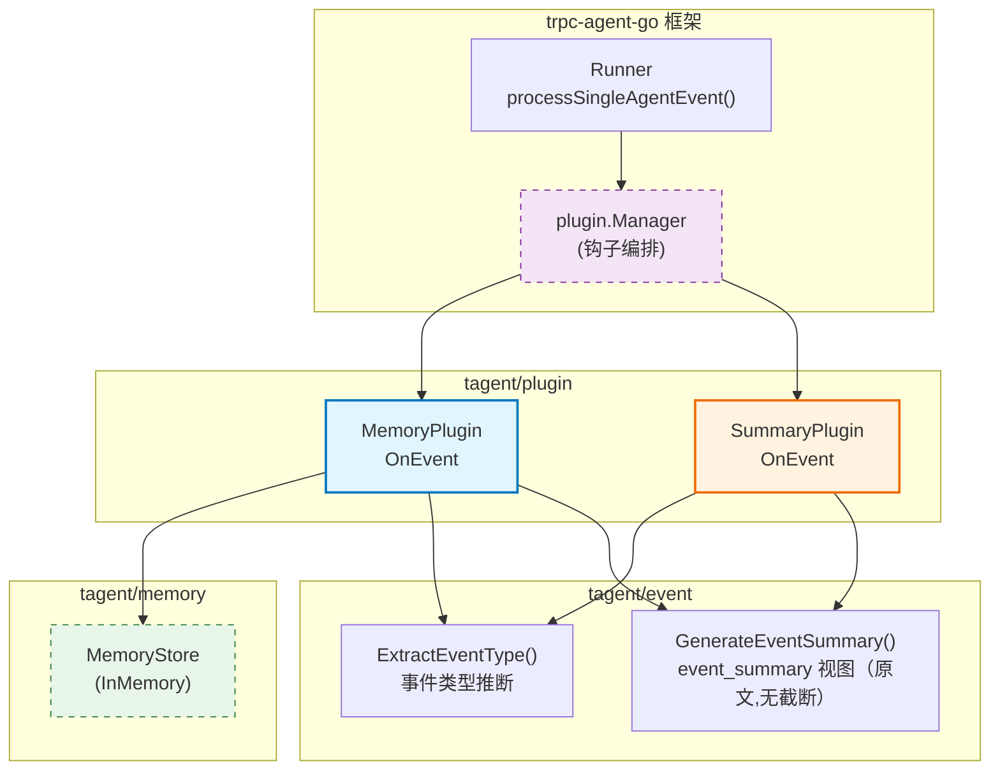
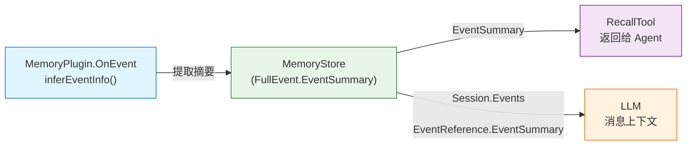
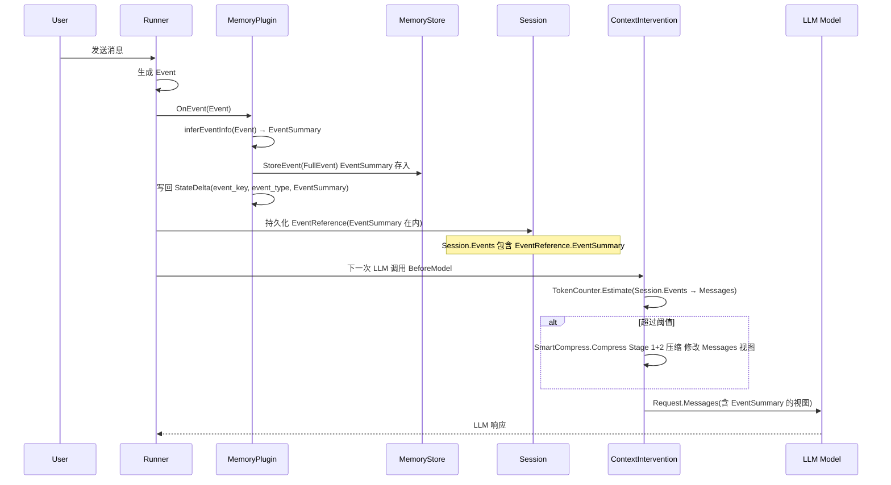
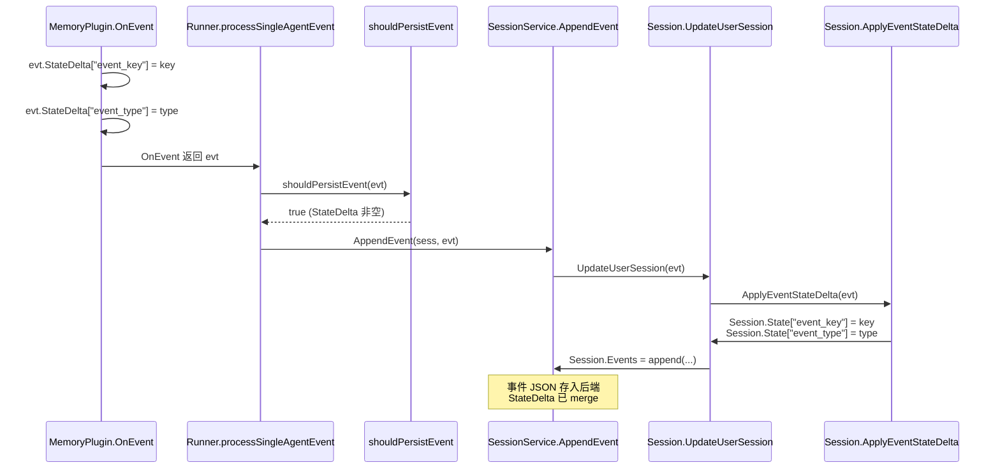
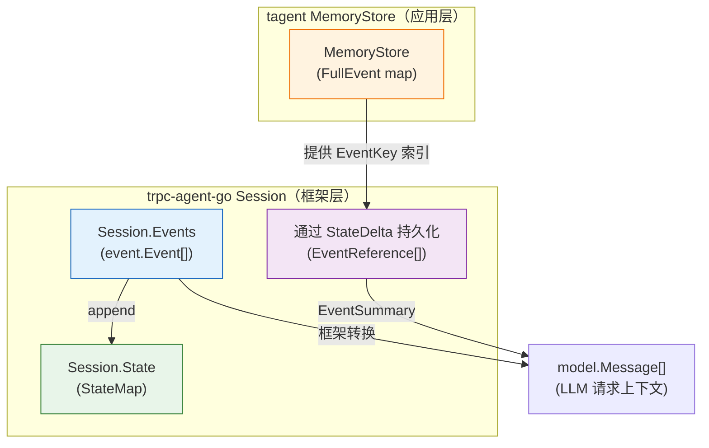

# tagent/plugin 模块架构文档

<a id="overview"></a>
## 一、模块定位

`tagent/plugin` 是 tagent 为 trpc-agent-go Runner 提供的一组**事件钩子插件**。

**核心职责**：通过 `plugin.Plugin` 接口将 tagent 的差异化能力（持久化、摘要）注入到框架的事件流中。

**设计原则**：
- **每个 Plugin 职责单一**：MemoryPlugin 专注持久化 + 因果链 + 同点投影（ProjectionSink）+ 归因盖章（FullEvent.Metadata：agent_name 基线 + ctx Attribution 叠加 rollout_id/trace_id/span_id，构造期先于 StoreEvent；细节见 [platform 篇](../platform/platform-subsystems.md)），SummaryPlugin 专注 Tag 与 `event_summary` 元数据标注（**原文视图，非内容总结**——内容级总结收归压缩固化时刻）
- **严格拒绝非设计折损**：摘要中完全禁止任何形式的截断，内容超限由 SmartCompress 处理
- **通过 OnEvent 而非 Before/After Model**：在事件层面处理，不侵入 LLM 调用流程

---

## 二、文件清单

| 文件 | 职责 |
|------|------|
| `memory_plugin.go` | 事件持久化：推断类型、生成 EventKey、归因盖章、构建因果链、写入 StateDelta |
| `summary_plugin.go` | 事件摘要：生成 Tag 并追加到事件 |
| `attribution.go` | 归因章 ctx 载体：WithAttribution/AttributionFrom，MemoryPlugin 存储前盖章 FullEvent.Metadata |
| `projection_sink.go` | ProjectionSink 接口：存储⇔投影同一同步点 |
| `memory_plugin_test.go` / `attribution_test.go` / `projection_sink_test.go` | 单元测试：类型推断、因果链、摘要策略、归因盖章、同点投影 |

---

## 三、组件关系总览图


```mermaid
graph TB
    subgraph "trpc-agent-go 框架"
        Runner["Runner\nprocessSingleAgentEvent()"]
        PM["plugin.Manager\n(钩子编排)"]
    end

    subgraph "tagent/plugin"
        MP["MemoryPlugin\nOnEvent"]
        SP["SummaryPlugin\nOnEvent"]
    end

    subgraph "tagent/memory"
        MS["MemoryStore\n(InMemory)"]
    end

    subgraph "tagent/event"
        ET["ExtractEventType()\n事件类型推断"]
        ES["GenerateEventSummary()\nevent_summary 视图（原文,无截断）"]
    end

    Runner --> PM
    PM --> MP
    PM --> SP

    MP --> MS
    MP --> ET
    MP --> ES

    SP --> ET
    SP --> ES

    style MP fill:#e1f5ff,stroke:#0277bd,stroke-width:2px
    style SP fill:#fff3e0,stroke:#ef6c00,stroke-width:2px
    style PM fill:#f3e5f5,stroke:#7b1fa2,stroke-width:1px,stroke-dasharray:5,5
    style MS fill:#e8f5e9,stroke:#2e7d32,stroke-width:1px,stroke-dasharray:5,5
```

---

## 四、Plugin 注册机制

### 4.1 tagent 与框架的集成点

`plugin.Plugin` 接口（`trpc-agent-go/plugin/manager.go`）：

```go
type Plugin interface {
    Name() string
    Register(r *Registry)
}
```

tagent 在构建 `ContextManager`（统一 Runner）时注册两个 Plugin：

```go
// agent/context_manager.go
fwAgent := llmagent.New(cfg.Name, agentOpts...)

// Create unified Runner: LLMAgent + MemoryPlugin + SummaryPlugin + SessionService.
runnerOpts := []runner.Option{}
if cfg.MemPlugin != nil {
    runnerOpts = append(runnerOpts, runner.WithPlugins(
        plugin.NewSummaryPlugin(), // 先注册：Tag 注入
        cfg.MemPlugin,             // 后注册：持久化
    ))
}
if cfg.SessionSvc != nil {
    runnerOpts = append(runnerOpts, runner.WithSessionService(cfg.SessionSvc))
}
cm.runner = runner.NewRunner(cfg.Name, fwAgent, runnerOpts...)
```

**注册顺序有意义**：`SummaryPlugin` 先注册先执行，先注入 Tag；`MemoryPlugin` 后注册后执行，持久化时事件已包含 Tag。`cfg.MemPlugin == nil` 时整条 Plugin 装配跳过（无持久化的轻量调用路径）；`SessionSvc` 非空时 Runner 走注入的 session 服务（含 AppendEventHook），否则用框架默认。

### 4.2 OnEvent 的调用时机

`Runner.processSingleAgentEvent` 在处理每个事件时调用 OnEvent（`trpc-agent-go/runner/runner.go`）：

```go
func (r *runner) processSingleAgentEvent(ctx context.Context, loop *eventLoopContext, agentEvent *event.Event) error {
    // Step 1: 通过所有 Plugin 的 OnEvent 钩子
    agentEvent = r.applyEventPlugins(ctx, loop.invocation, agentEvent)

    // Step 2: 持久化到 Session
    r.handleEventPersistence(ctx, loop.invocation, loop.sess, agentEvent)

    // Step 3: 发送到输出 channel
    event.EmitEvent(ctx, loop.processedEventCh, agentEvent)
}
```

**关键**：OnEvent 在持久化 Session **之前**被调用。`MemoryPlugin` 持久化时，事件已经包含 `SummaryPlugin` 注入的 Tag。

### 4.3 链式传递机制

`Manager.OnEvent` 按注册顺序依次执行钩子，链式传递事件对象（`trpc-agent-go/plugin/manager.go`）：

```go
func (m *Manager) OnEvent(ctx context.Context, invocation *agent.Invocation, e *event.Event) (*event.Event, error) {
    curr := e
    for _, h := range m.eventHooks {
        next, err := h.hook(ctx, invocation, curr)
        if err != nil {
            return nil, fmt.Errorf("plugin %q: %w", h.name, err)
        }
        if next != nil {
            curr = next  // 链式传递
        }
    }
    return curr, nil
}
```

---

<a id="memory-plugin"></a>
## 五、MemoryPlugin — 事件持久化

### 5.1 数据结构

```go
// memory_plugin.go
type MemoryPlugin struct {
    memStore      memory.MemoryStore  // 存储后端
    mu            sync.Mutex          // 保护 lastEventKeys 并发安全
    lastEventKeys map[string]int64   // "partitionID:sessionID" → 前驱 EventKey（分区+会话级因果链）
}
```

### 5.2 提交序列 — 四道跳过闸在任何分配之前

入口顺序做完四道跳过判定，全部发生在**分配 EventKey 之前**：无 `Response`/无 `Choices`、`IsPartial` 流式分片、退化空 `agent_output` 终答（无正文也无工具调用）、以及本次尝试期望的输入回显（`EchoCredential` 命中即绑定 invocationID 并认领）。任何一道命中就直接返回原事件——不落库、不投影、不发票据。回显因此不会被双写成两条事实，半条事件也不会占据因果链的一格。

分配之后的整段落在**同一条因果键的锁段内**串行：

| 序 | 动作 | 失败/缺失时的行为 |
|---|---|---|
| 1 | 读该因果域最后已提交的键作父（无记录返回 0） | 0＝首次／重启后／游标被淘汰：**不猜父**，缺口由回溯端具名报出 |
| 2 | 分配 Snowflake EventKey，构造 `FullEvent`（assistant 正文经 `sanitizeAssistantContent` 剥模型伪造的 `[evt_...]` 前缀，其余角色逐字存） | — |
| 3 | 盖归因章：先 `agent_name`，再叠加 `AttributionFrom(ctx)` 的 rollout_id/trace_id/span_id/bundle_id；装了 call_id 解析器且命中时追加（见 5.6） | 归因缺失不阻断提交 |
| 4 | `StoreEvent` | 失败即 `stored=false`：ERROR 留痕；带凭据的回合 `MarkRejected`（让调用方知道这一轮没有持久事实） |
| 5 | 仅 `stored`：`RelationStore.SetParent` | 关系失败**不回滚内容**（见 5.3） |
| 6 | 仅 `stored`：向本调用的 `ProjectionSink` `Append` EventReference | 未接 sink 时跳过——投影与存储同点，绝不先投影后存储 |
| 7 | 提交闸：按 `stored` 发布或撤回持久票据（见 5.5） | — |
| 8 | 仅 `stored`：推进因果游标 | 失败键永不成为下一条的父 |

四道跳过闸的判定条件都经真实框架回显验证：少跳会双写，多跳会丢真事实，因此 `isExpectedInputEcho` 要求根调用、`Author=="user"`、消息角色为 user 且去空白后与凭据里的合并输入逐字相等——子调用与助手/工具事件一律不满足，走正常存储路径。

<a id="causal-mech"></a>
### 5.3 因果链机制

每个事件通过 `RelationStore.SetParent(childKey, parentKey)` 维护因果关系，构成一条有向事件链：

```
1777198738547555000 (事件1)
  RelationStore: parent=0  (无前驱)

1777198739574803000 (事件2)
  RelationStore: parent=1777198738547555000  → 父 = 事件1

1777198739760667000 (事件3)
  RelationStore: parent=1777198739574803000  → 父 = 事件2
```

**作用**：
- 支持按因果顺序回溯事件历史
- 为 RecallTool 提供结构化检索能力
- 压缩通知中可引用被丢弃的因果链

**同因果键线性化与锁序**：父键读取、事件键分配、落库、关系写入、游标推进必须落在同一条顺序里——两条并发提交若各读各的父，会造出分叉链或指向虚事件的父引用。串行单元是 `causalGuard`（每个 `<partition>:<session>` 一条），**不同因果键互不阻塞**。锁序固定为「持 `p.mu` 只登记引用计数 → 放 `p.mu` → 取键锁」，反向禁止：`p.mu` 是叶锁，绝不横跨存储 I/O。`refs` 同时是淘汰保护的凭据——游标 map 超上界（`maxLastEventKeys`）回收最久未更新的键时跳过 `refs>0` 的因果键，淘汰一条在途链的锚等于让它失去父。

**关系写失败不回滚内容**：`SetParent` 失败时事实与票据照常有效（内容已提交这件事为真），只缺一条因果边；把它说成"提交失败"要撤回一条真实存在的事实。回溯端读到断边时以具名 partial 报出（见[记忆架构](../memory/memory-architecture.md#causal-chain)）。

### 5.4 StateDelta 写回

`MemoryPlugin` 写入 `StateDelta` 是为了**确保 Runner 持久化事件**。Runner 的 `shouldPersistEvent` 规则（`trpc-agent-go/runner/runner.go`）：

```go
func (r *runner) shouldPersistEvent(agentEvent *event.Event) bool {
    return len(agentEvent.StateDelta) > 0 ||
        (agentEvent.Response != nil && !agentEvent.IsPartial && agentEvent.IsValidContent())
}
```

只要 `StateDelta` 非空，即使 `Response` 为空或 partial，事件也会被持久化到 Session。

---

<a id="commit-gate"></a>
### 5.5 提交闸：票据、投影与游标只在提交成功之后发布

`event_key` 与 `partition_id` 写在 `StateDelta` 里是**持久票据**——下游拿它去 `GetEvent` 取原文、拿它作"这条历史可以回补"的承诺。所以它们只能随成功的提交发布：

| 发布物 | `stored=true` | `stored=false`（写失败或未接存储） |
|---|---|---|
| `StateDelta[event_key]`、`StateDelta[partition_id]` | 写入（hex 契约） | **连本插件此前可能写入的同名字段一并 delete**，只 Debugf 留痕 |
| 本调用投影 `sink.Append` | 追加 | 不追加（投影里永不出现取不回的事实） |
| 因果游标 `lastEventKeys` | 推进到本键 | 不推进（失败键从未落库，作父即断链） |
| `event_type` / `event_summary` | 写入 | **照常写入** |
| `call_id`（若命中） | 随 FullEvent 本体一次落库 | 从未产生记录，自然不存在 |

难点全在最后两行的分界：票据与分类同处一个 map、同一次落库调用，很容易一并发布或一并撤回。判据不是"哪个字段重要"，而是**该字段是否主张"已持久"**——主张的走闸，只作分类的照旧返回。若把分类也一并撤掉，读者会把"存储故障"误读成"这条事件没有类型"，反而更难诊断。

写失败也不回滚已成功的部分：内容提交成功而关系失败时（第 5 步），事实与票据仍然成立，只有因果边缺失。把它表达成"提交失败"要撤回一条真实存在的事实，代价更大。

### 5.6 call_id：可选注入面，命中才盖

`CallIDResolver` 是 `NewMemoryPlugin` 的变参选项（`WithCallIDResolver`）：不传选项即维持接线前形态，所有老调用点逐字节同旧。它把**事件自带的 SDK 响应 ID** 对到采集器为那一次调用记下的 `call_id`。

- **只在解析器已装、且 `evt.Response.ID` 非空时问一次**。返回 false（作用域里没有绑定）、返回空串、未装配——三种情况一律**不写这个键**。取"最近一次调用"会把反馈挂到一次从未产生它的调用上；关联因此只能是精确键命中，不能是邻近猜测。
- 写在 `FullEvent.Metadata` 上，**不进 `StateDelta`**：它是已提交事实的附加归因，不是投递给下游的契约键；也不带 `meta_` 透传前缀，所以事件解析面不消费它。
- 盖章发生在提交闸**之前**（构造 FullEvent 时），所以 `call_id` 随事实本体一次落库，不是事后补写——补写等于修改已存记录，而正 key 事实永不被修改。
- 由组合根注入（`tagent.go`／`agent/testsupport.go` 桥到 `rl.CallIDForResponse`），使 `rl` 保持叶子包、不 import `plugin`。

键归属与读侧见[元数据键的归属](../event/event-architecture.md#metadata-keys)；把关联用于离线训练事实导出的契约见 [RL 授权导出](../rl/rl-architecture.md#training-export)。

<a id="summary-plugin"></a>
## 六、SummaryPlugin — Tag 与元数据标注（退位后职责）

### 6.1 职责定位

SummaryPlugin 在 `MemoryPlugin` 之前执行，负责给事件附加**可读的 Tag**，供下游消费者（如日志、调试、UI）理解事件语义。

### 6.2 OnEvent 钩子详解

源码位置：`summary_plugin.go`

```go
func (p *SummaryPlugin) onEvent(ctx context.Context, inv *agent.Invocation, evt *event.Event) (*event.Event, error) {
    // nil 检查
    if evt == nil {
        return nil, nil
    }

    // 无 Response 的事件不生成 Tag
    if evt.Response == nil || len(evt.Response.Choices) == 0 {
        return evt, nil
    }

    msg := evt.Response.Choices[0].Message

    // 推断事件类型
    eventType := tagentevent.ExtractEventType(msg)

    // 生成 event_summary 视图（原文,无截断）
    opts := tagentevent.DefaultOptionsForLLMContext()
    summary := tagentevent.GenerateEventSummary(msg, eventType, opts)

    // 构造 Tag: "event_type:summary"
    tag := eventType
    if summary != "" {
        tag = eventType + ":" + summary
    }

    // 追加到事件 Tag 字段（支持多个 Plugin 追加）
    if evt.Tag != "" {
        evt.Tag += ";" + tag
    } else {
        evt.Tag = tag
    }

    log.Debugf("[Summary] enriched type=%s summary_len=%d", eventType, len(summary))

    return evt, nil
}
```

### 6.3 Tag 格式

```
{event_type}:{summary}

示例：
  external_input:你好，我想了解...
  thinking_plan:调用工具: echo(hello)
  agent_output:好的，这里是...
  action_command:echo 执行完成
```

**追加语义**：`evt.Tag += ";" + tag` 支持多个 Plugin 追加 Tag。`MemoryPlugin` 在此之后执行，不会覆盖 Tag。

---

## 七、事件类型推断

### 7.1 RoleSystem 的特殊处理

| 来源 | Message.Role | 参与事件流 | 说明 |
|------|-------------|-----------|------|
| System Prompt | `RoleSystem` | **不参与** | 初始化时由 InstructionProcessor 注入 Request，与事件流隔离，不因压缩丢失 |
| TmuxMonitor 注入 | `RoleSystem` | **参与** | 通过 `Runner.Run()` 进入事件流，分类为 `external_input` |

### 7.2 事件类型推断规则

| Message.Role | EventType | 说明 |
|-------------|-----------|------|
| `RoleUser` | `external_input` | 用户输入 |
| `RoleSystem` | `external_input` | TmuxMonitor 注入（通过 Runner.Run() 进入事件流） |
| `RoleAssistant` + `ToolCalls` | `thinking_plan` | Agent 思考/计划（带工具调用） |
| `RoleAssistant` | `agent_output` | Agent 最终输出 |
| `RoleTool` | `action_command` | 工具执行结果 |
| 无 Response 或无 Choices | `external_input` | 默认 fallback |

---

## 八、event_summary 视图策略

### 8.1 严格拒绝非设计折损

`event/types.go` 中完全移除了截断逻辑：

```go
// 截断已移除。以下常量已被删除：
// - DefaultMaxContentLength = 500
// - DefaultMaxArgsLength = 200
// - MaxContentLength int
// - MaxArgsLength int
// - formatContent() 函数
```

**设计原则**：摘要本身已是设计内的信息折损（从原始文本到摘要文本），截断是设计外的双重折损，会破坏 SmartCompress 的压缩质量。内容超限通过**多次 SmartCompress 循环**处理。

### 8.2 摘要策略表

| EventType | 摘要策略 | 原因 |
|-----------|---------|------|
| `external_input` | **原文全文** | 保留用户意图，不丢失信息 |
| `agent_output` | **原文全文** | 保留 Agent 回复，不丢失信息 |
| `thinking_plan` | **原文全文** | Agent 完整思考过程，含工具调用决策 |
| `action_command` | 工具调用摘要 | 工具执行结果信息密度高，格式化为 `"调用工具: name(args)"` |
| 其他 | **原文全文** | fallback 保安全 |

### 8.3 工具调用摘要格式

```go
// formatToolCallSummary() 输出示例
"调用工具: echo(hello world)"
"调用工具: search(query=\"golang\"), read_file(path=\"/a/b.go\")"
```

多个工具调用时逗号分隔，单行格式节省 token。

---

## 九、关键设计决策

### 9.1 为什么拆成两个 Plugin 而不是合并？

| 对比 | 合并方案 | 拆分方案 |
|------|----------|----------|
| **关注点分离** | 持久化 + Tag 注入混在一起 | 各司其职 |
| **可测试性** | 需要 mock MemoryStore + Tag 双重逻辑 | 独立测试 |
| **可复用性** | 无法单独使用 Tag 注入 | SummaryPlugin 可独立使用 |
| **扩展性** | 新增功能需修改同一个插件 | 新增 Plugin 只需实现接口 |

### 9.2 为什么用 OnEvent 而不是 BeforeModel/AfterModel？

| 方案 | 优点 | 缺点 |
|------|------|------|
| **OnEvent（tagent 选型）** | 事件层面处理，不侵入 LLM 调用流程；Session 和 MemoryStore 同步 | 需要处理 nil / partial 事件 |
| BeforeModel | 可修改 LLM 请求 | 只能处理请求，不能处理响应 |
| AfterModel | 可修改 LLM 响应 | 只能处理响应，不能处理事件流 |

tagent 的差异化能力（持久化、因果链、Tag）都是**事件层面的需求**，OnEvent 是最自然的注入点。

### 9.3 StateDelta 写回的目的

`MemoryPlugin` 写入 `StateDelta` 是为了**触发 Runner 的 Session 持久化**。Runner 只在以下条件满足时持久化事件：

```go
shouldPersistEvent(agentEvent) = len(agentEvent.StateDelta) > 0 ||
    (agentEvent.Response != nil && !agentEvent.IsPartial && agentEvent.IsValidContent())
```

对于 `Response` 为空的事件（如 tool_call 开始事件），只有 `StateDelta` 非空才能保证持久化。

---

## 十、Event Schema

> **说明**：`FullEvent`、`EventReference`、`EventKey`（Snowflake int64）等核心数据结构定义在 `memory` 模块。详细说明请参阅 [memory-architecture.md](../memory/memory-architecture.md)。本章仅列出插件直接使用的字段。

### 10.1 EventKey — Snowflake int64 唯一标识符

```go
// memory/types.go
// Snowflake-like int64，编码 PartitionID + Timestamp + Sequence
func NewSnowflakeEventKey(partitionID int, nowMs int64) int64
```

- 从 AgentName 通过 `PartitionIDFromName` 哈希映射得到分区 ID
- 内部 mutex 保护的 per-partition 序列计数器保证同秒内唯一
- 第二个参数 `nowMs` 为毫秒时间戳提示（0 = 使用当前时间）

### 10.2 FullEvent — 完整事件

```go
// FullEvent 在 plugin 中的构建（memory_plugin.go）
// 基础字段始终填充，Content/ToolCalls/Response 仅在 evt.Response 非空时填充
type FullEvent struct {
    EventKey     int64                // Snowflake int64
    PartitionID  int                  // 存储分区
    // ParentKey 已移除：因果关系由 RelationStore 维护
    EventType    string
    EventSummary string
    Timestamp    int64                // Unix 毫秒
    Content      string               // 条件性填充
    ToolCalls    []model.ToolCall     // 条件性填充
    ToolResults  map[string]interface{}
    Metadata     map[string]string
    Response     *model.Response
}
```

### 10.3 EventReference — 轻量引用

```go
// memory/types.go
type EventReference struct {
    EventKey     int64  `json:"event_key"`
    PartitionID  int    `json:"partition_id,omitempty"`
    EventType    string `json:"event_type"`
    EventSummary string `json:"event_summary"`
    Timestamp    int64  `json:"timestamp"`
}
```

### 10.4 数据流

```
MemoryPlugin.OnEvent → 构建 FullEvent → StoreEvent(int64 Key)
                    → StateDelta[key→string] → Session.State
```

详细架构参见 [memory-architecture.md](../memory/memory-architecture.md) §四~§六。

---

## 十一、MemoryStore 存储方式

> **说明**：MemoryStore 的完整接口定义、InMemoryStore 和 FileSegmentStore 的实现细节、RAG 向量搜索支持等，请参阅 [memory-architecture.md](../memory/memory-architecture.md) §六~§十。

### 11.1 当前实现要点

| 存储 | Key 类型 | 结构 | 分区 |
|------|---------|------|------|
| InMemoryStore | `int64` | `map[int]map[int64]FullEvent` | 按 PartitionID 双层 map |
| FileSegmentStore | `int64` | `{dataDir}/{partitionID}/{eventKey}.json` | 按 PartitionID 子目录 |

### 11.2 存储分区的隔离语义

- MemoryStore 不感知 Agent（纯存储概念），仅通过 `PartitionID` 区分分区
- `PartitionIDFromName(agentName)` 将 Agent 映射到稳定的分区 ID（FNV-1a 哈希）
- 每个分区+会话维护独立因果链（`lastEventKeys["partitionID:sessionID"]`），防止子 Agent 与跨会话事件互相破坏因果链

### 11.3 QueryOptions

```go
// memory/types.go
type QueryOptions struct {
    PartitionID  int
    PartitionIDs []int
    EventTypes   []string
    StartTime    int64
    EndTime      int64
    Limit        int
    Offset       int
    OrderBy      string
}
```

返回 `[]EventReference`（轻量），调用方按需通过 `GetEvent(key)` 获取完整 `FullEvent`。

---

## 十二、EventSummary 对 LLM 上下文的影响

### 12.1 摘要的双重用途

`EventSummary` 字段同时服务于两个不同的消费者：


```mermaid
graph LR
    Plugin["MemoryPlugin.OnEvent
    inferEventInfo()"]
    MS["MemoryStore
    (FullEvent.EventSummary)"]
    RT["RecallTool
    返回给 Agent"]
    LLM["LLM
    消息上下文"]

    Plugin -->|提取摘要| MS
    MS -->|EventSummary| RT
    MS -->|Session.Events
    EventReference.EventSummary| LLM

    style Plugin fill:#e1f5ff,stroke:#0277bd
    style MS fill:#e8f5e9,stroke:#2e7d32
    style RT fill:#f3e5f5,stroke:#7b1fa2
    style LLM fill:#fff3e0,stroke:#ef6c00
```

| 消费者 | 用途 | 数据来源 |
|--------|------|----------|
| **LLM** | 理解历史事件的语义（进入 Request.Messages） | `EventReference.EventSummary` |
| **RecallTool** | 返回给 Agent 进行详细检索 | `FullEvent.EventSummary` |

### 12.2 Summary 进入 LLM 上下文的完整路径

**Step 1 — 生成**：`MemoryPlugin.inferEventInfo()` 根据事件类型生成 event_summary 视图（见第八章）

**Step 2 — 持久化**：`FullEvent.EventSummary` 存入 MemoryStore；`EventReference.EventSummary` 通过 `StateDelta` 持久化到 Session

**Step 3 — 构建 LLM 上下文**：trpc-agent-go Runner 的 Session 在每次 LLM 调用前，将 `Session.Events`（`EventReference[]`）转换为 `model.Message[]`（具体转换逻辑在 trpc-agent-go 框架层）：

```
Session.Events (EventReference[])
  ↓
 框架层转换
  ↓
Request.Messages (model.Message[])
  - RoleUser: EventSummary 作为 Content
  - RoleAssistant: EventSummary 作为 Content
  - RoleTool: 工具结果作为 Content
  ↓
LLM 看到的就是 EventSummary
```

**关键点**：

- `Session.Events` 中每个 `EventReference.EventSummary` 对应 LLM 看到的一条消息内容
- LLM **只看到摘要**，不直接看到完整原始文本（除非事件类型是 `external_input` / `agent_output`，此时摘要=原文）
- **这是设计内的信息折损**：压缩质量由 SmartCompress 两阶段机制保证

### 12.3 SmartCompress 与 EventSummary 的关系

**两者作用于不同层次**：

| 层次 | 机制 | 处理对象 |
|------|------|----------|
| **事件层** | `inferEventInfo()` | 单个 Event → EventSummary |
| **消息层** | `SmartCompress` | model.Message[] → 按任务回合切段 + 骨架压缩 |

**SmartCompress 骨架模型（task-skeleton-compression，默认）**：

| 步骤 | 行为 |
|------|------|
| 切段 | 以 `agent_output` 为界切分完整任务回合（`SegmentMessages`） |
| 定级 | 段龄纯函数 L0-L3（零 LLM），保留最近 keepRecent 个回合（默认 2） |
| 段内丢弃 | `tool > assistant` 序：L1 丢 `action_command`，L2 仅留骨架 |
| 归档 | L3 整段移出时间线，骨架事件经卡片行汇入滚动 summary（user 级〔历史归档〕注记，**永不插入 system**） |

骨架管线为唯一压缩路径（定级/丢弃纯工程；L3 折叠 = 工程票据层恒在 + 可选 LLM 滚动综述叠加）。

**SmartCompress 在 BeforeModel 执行**（由 `agent/context_manager.go` 的装配回调经 `compress.ContextCompressor` 调用）：投影 refs 解析为消息后估算 token，超 `max_tokens × compress_threshold` 阈值时调用 `SmartCompressor.Compress` 重写消息视图，并以 `RetainedRefs` 替换投影。

**视图转换原则**：SmartCompress **只修改发给 LLM 的 messages 视图**，不修改 Session 原始数据，MemoryStore 中的 FullEvent 也保持不变（投影的 EventReference 替换由 ContextCompressor 的返回值驱动，是引用层的有界化，非事件本体修改）。

### 12.4 Token 估算公式

```go
// agent/compress/token_counter.go
Estimate(messages []model.Message) int {
    // 空集特判返回 0（L3 移出段不计成本）
    // 每条消息：rune 数 / CharsPerToken + 10 固定 overhead
    // 每个 tool_call：+20
}
```

**`CharsPerToken`**：默认 2.0（中英混合场景的保守估值）。TokenCounter 是估算，不是精确计算，误差在 10-20%。

### 12.5 完整数据流总览


```mermaid
sequenceDiagram
    participant U as User
    participant R as Runner
    participant MP as MemoryPlugin
    participant MSS as MemoryStore
    participant SS as Session
    participant CI as ContextIntervention
    participant LLM as LLM Model

    U->>R: 发送消息
    R->>R: 生成 Event
    R->>MP: OnEvent(Event)
    MP->>MP: inferEventInfo(Event) → EventSummary
    MP->>MSS: StoreEvent(FullEvent) EventSummary 存入
    MP->>MP: 写回 StateDelta(event_key, event_type, EventSummary)
    R->>SS: 持久化 EventReference(EventSummary 在内)
    Note over SS: Session.Events 包含 EventReference.EventSummary

    R->>CI: 下一次 LLM 调用 BeforeModel
    CI->>CI: TokenCounter.Estimate(Session.Events → Messages)
    alt 超过阈值
        CI->>CI: SmartCompress.Compress Stage 1+2 压缩 修改 Messages 视图
    end
    CI->>LLM: Request.Messages(含 EventSummary 的视图)
    LLM-->>R: LLM 响应
```

---

## 十三、StateDelta 机制与 Session 持久化

### 13.1 StateDelta 的定位

`Event.StateDelta`（`trpc-agent-go/event/event.go`）是框架提供的事件级状态传递机制：

```go
type Event struct {
    StateDelta map[string][]byte `json:"stateDelta,omitempty"`
    // ...
}
```

**核心语义**：Plugin 或 Agent 在处理事件时，向 `Event.StateDelta` 写入 key-value 对，框架在持久化事件时自动将其合并到 `Session.State`。

**设计意图**：
- **解耦 Plugin 与 Session**：Plugin 不需要持有 Session 引用，只需向 Event 写入 StateDelta，框架负责合并
- **原子性保证**：StateDelta 和 Event 的持久化在同一个原子操作中完成（Redis 后端通过 Lua 脚本实现）
- **跨事件累积**：`Session.State` 是累积的，所有事件的 StateDelta 都会被 merge 进去（相同 key 后者覆盖前者）

### 13.2 MemoryPlugin 写入 StateDelta 的目的

```go
// memory_plugin.go
if evt.StateDelta == nil {
    evt.StateDelta = make(map[string][]byte)
}
evt.StateDelta[tagentevent.MetaKeyEventKey] = []byte(tagentevent.FormatEventKey(eventKey)) // hex 契约
evt.StateDelta[tagentevent.MetaKeyPartitionID] = []byte(strconv.Itoa(partitionID))
evt.StateDelta[tagentevent.MetaKeyEventType] = []byte(eventType)
```

| StateDelta Key | Value | 用途 |
|---------------|-------|------|
| `event_key` | EventKey int64 → **hex 字符串**（`FormatEventKey`） | 关联 MemoryStore 中的 FullEvent |
| `partition_id` | PartitionID int → 字符串 | 存储分区标识 |
| `event_type` | EventType 字符串 | 事件类型元数据 |

**为什么需要写入 StateDelta**：`Session.State` 是跨事件的 key-value 累积存储。`event_key` 写入 StateDelta 后，Session.State 中就会保留每个事件的 EventKey，后续可通过 `Session.GetState("event_key")` 检索最近事件的 Key。

### 13.3 Session 持久化完整流程

**源码路径**：`trpc-agent-go/runner/runner.go`

```go
func (r *runner) processSingleAgentEvent(ctx, loop, agentEvent) error {
    // Step 1: 通过所有 Plugin 的 OnEvent 钩子（MemoryPlugin 在此写入 StateDelta）
    agentEvent = r.applyEventPlugins(ctx, loop.invocation, agentEvent)

    // Step 2: 持久化到 Session（包含 StateDelta 的 merge）
    r.handleEventPersistence(ctx, loop.invocation, loop.sess, agentEvent)

    // Step 3: 发送到输出 channel
    event.EmitEvent(ctx, loop.processedEventCh, agentEvent)
}
```

**handleEventPersistence** 内部（`runner.go`）：

```go
func (r *runner) handleEventPersistence(ctx, invocation, sess, agentEvent) {
    if !r.shouldPersistEvent(agentEvent) {
        return
    }
    r.sessionService.AppendEvent(ctx, sess, persistEvent)
}
```

### 13.4 shouldPersistEvent — 持久化条件

**源码**（`runner.go`）：

```go
func (r *runner) shouldPersistEvent(agentEvent *event.Event) bool {
    return len(agentEvent.StateDelta) > 0 ||
        (agentEvent.Response != nil && !agentEvent.IsPartial && agentEvent.IsValidContent())
}
```

**结论**：
- **条件 1**：`StateDelta` 非空 → 持久化（即使 Response 为 nil/partial）
- **条件 2**：Response 有效且非 partial → 持久化
- **MemoryPlugin 的作用**：对于 Response 为 nil/partial 的事件，写入 `StateDelta` 是确保持久化的唯一手段

### 13.5 Session.UpdateUserSession — StateDelta merge

**源码**（`session/session.go`）：

```go
func (sess *Session) UpdateUserSession(event *event.Event, opts ...Option) {
    // 1. 如果有有效 Response，追加到 Session.Events
    if event.Response != nil && !event.IsPartial && event.IsValidContent() {
        sess.Events = append(sess.Events, *event)
        sess.ApplyEventFiltering(opts...)
    }

    // 2. 无论 Response 是否有效，StateDelta 都会被 merge
    sess.UpdatedAt = time.Now()
    sess.ApplyEventStateDelta(event)
}
```

**关键**：`StateDelta` merge 不依赖 Response 有效性。只要有 StateDelta，就会 merge 到 Session.State。

### 13.6 Session.ApplyEventStateDelta — 合并逻辑

**源码**（`session/session.go`）：

```go
func (sess *Session) ApplyEventStateDelta(e *event.Event) {
    if sess.State == nil {
        sess.State = make(StateMap)
    }
    for key, value := range e.StateDelta {
        if value == nil {
            sess.State[key] = nil
        } else {
            val := make([]byte, len(value))
            copy(val, value)
            sess.State[key] = val
        }
    }
}
```

**语义**：相同 key 后者覆盖前者（last-write-wins）。所有事件的 StateDelta 累积在 Session.State 中。

### 13.7 Redis 后端的原子性保证

Redis 后端通过 Lua 脚本实现 AppendEvent 的原子性（`session/redis/internal/hashidx/lua.go`）：

```lua
-- Step 1: 检查 session 存在
-- Step 2: 如果 shouldStoreEvent，存储 event JSON + 时间索引
-- Step 3: 解码 event JSON，提取 stateDelta，合并到 session meta 的 state 中
-- Step 4: 刷新 TTL
-- 整个过程在单次 Redis 操作中完成
```

**关键**：StateDelta 的 merge 和 Event 的存储在同一个 Lua 事务中，不会出现 Event 持久化但 StateDelta 未 merge 的情况。

### 13.8 StateDelta 与 Session.State 的全流程


```mermaid
sequenceDiagram
    participant MP as MemoryPlugin.OnEvent
    participant R as Runner.processSingleAgentEvent
    participant SD as shouldPersistEvent
    participant SS as SessionService.AppendEvent
    participant SU as Session.UpdateUserSession
    participant ASD as Session.ApplyEventStateDelta

    MP->>MP: evt.StateDelta["event_key"] = key
    MP->>MP: evt.StateDelta["event_type"] = type
    MP->>R: OnEvent 返回 evt
    R->>SD: shouldPersistEvent(evt)
    SD-->>R: true (StateDelta 非空)
    R->>SS: AppendEvent(sess, evt)
    SS->>SU: UpdateUserSession(evt)
    SU->>ASD: ApplyEventStateDelta(evt)
    ASD->>SU: Session.State["event_key"] = key<br/>Session.State["event_type"] = type
    SU->>SS: Session.Events = append(...)
    Note over SS: 事件 JSON 存入后端<br/>StateDelta 已 merge
```

---

## 十四、Session 与 MemoryStore 的差异

### 14.1 根本定位不同

| 维度 | trpc-agent-go Session | tagent MemoryStore |
|------|----------------------|-------------------|
| **所属层级** | 框架层（trpc-agent-go） | 应用层（tagent） |
| **存储粒度** | 整个 `event.Event` 对象（包含完整 Response） | `FullEvent`（完整细节）+ `EventReference`（轻量引用） |
| **用途** | LLM 请求上下文构建、事件回放 | 因果链追踪、按需检索、精确查找 |
| **是否跨 Session** | 单 Session 内（按 AppName:UserID:SessionID） | 可跨 Session 检索（按 UserID 等维度） |
| **持久化方式** | 框架 SessionService（MySQL/Redis/PostgreSQL 等） | tagent 自定义后端（InMemoryStore / FileSegmentStore） |
| **数据是否压缩** | Session.Events 保留原始事件（Summaries 机制做摘要） | MemoryStore 中 FullEvent 不压缩（压缩在 LLM 视图层处理） |

### 14.2 Session 数据结构

```go
// trpc-agent-go/session/session.go
type Session struct {
    ID        string           // AppName:UserID:SessionID
    AppName   string
    UserID    string
    State     StateMap         // map[key][]byte — 跨事件累积的 key-value 状态
    Events    []event.Event    // 事件列表（完整 event.Event 对象）
    Tracks    map[Track]*TrackEvents  // 分支追踪
    Summaries map[string]*Summary      // 过滤感知的摘要
    UpdatedAt time.Time
    CreatedAt time.Time
}
```

**Session.Events** 存储的是完整的 `event.Event` 对象，框架在每次 LLM 调用前将这些 Event 转换为 `model.Message[]` 构建请求上下文。

**Session.State** 是一个累积的 key-value map，所有事件的 `StateDelta` 都会被 merge 进去。tagent 在其中写入 `event_key` 和 `event_type`，可用于后续快速检索最近事件的 Key。

### 14.3 MemoryStore 数据结构

```go
// memory/types.go
// 存储层：FullEvent（完整，int64 Key）
type FullEvent struct {
    EventKey     int64              // Snowflake int64 唯一标识符
    PartitionID  int                // 存储分区
    // ParentKey 已移除：因果关系由 RelationStore 维护
    EventType    string
    EventSummary string             // 用于 LLM 推理的摘要
    Content      string             // 原始内容
    ToolCalls    []model.ToolCall
    ToolResults  map[string]interface{}
    Metadata     map[string]string
    Response     *model.Response
}

// 引用层：EventReference（轻量，int64 Key）
type EventReference struct {
    EventKey     int64  // 关联 MemoryStore
    PartitionID  int
    EventType    string
    EventSummary string // 直接进入 LLM 上下文
    Timestamp    int64
}
```

### 14.4 数据流向对比


```mermaid
graph TB
    subgraph "trpc-agent-go Session（框架层）"
        S["Session.Events
        (event.Event[])"]
        ST["Session.State
        (StateMap)"]
        ER["通过 StateDelta 持久化
        (EventReference[])"]
    end

    subgraph "tagent MemoryStore（应用层）"
        MS["MemoryStore
        (FullEvent map)"]
    end

    S -->|框架转换| MSG["model.Message[]
        (LLM 请求上下文)"]
    ER -->|EventSummary| MSG
    S -->|append| ST
    MS -->|提供 EventKey 索引| ER

    style S fill:#e3f2fd,stroke:#1565c0
    style ST fill:#e8f5e9,stroke:#2e7d32
    style MS fill:#fff3e0,stroke:#ef6c00
    style ER fill:#f3e5f5,stroke:#7b1fa2
```

### 14.5 Session 与 MemoryStore 的协同关系

**协同点**：

1. **MemoryPlugin 是连接两者的桥梁**：
   - 将 `FullEvent` 存入 MemoryStore
   - 将 `EventKey/EventType` 写入 `Event.StateDelta` → merge 到 `Session.State`
   - `StateDelta` 触发框架将 Event 追加到 `Session.Events`

2. **Session.State 提供快速索引**：
   - `Session.State["event_key"]` = 最近一个事件的 EventKey
   - `Session.State["event_type"]` = 最近一个事件的 EventType
   - 可通过 `Session.GetState("event_key")` 快速定位 MemoryStore 中的 FullEvent

3. **SmartCompress 只修改 LLM 视图，不修改两者**：
   - `Session.Events` 中的 `event.Event` 保持不变
   - `MemoryStore` 中的 `FullEvent` 保持不变
   - 仅修改 `Request.Messages`（发给 LLM 的消息列表）

### 14.6 核心设计决策：为什么需要 MemoryStore？

Session 已有的 `Session.Events`（完整 event.Event）和框架的 Summaries 机制，为什么 tagent 还需要独立的 MemoryStore？

| 需求 | Session 能满足吗 | MemoryStore 提供的能力 |
|------|----------------|----------------------|
| **因果链** | Session.Events 是线性列表，无因果链 | RelationStore 构建有向因果图 |
| **精确 FullEvent 检索** | Session.Events 需遍历所有事件 | GetEvent(key) O(1) 直接定位 |
| **按类型/时间范围检索** | 框架 Summaries 支持有限 | QueryEvents 支持多维度过滤 |
| **跨 Session 检索** | 单 Session 范围 | 可按 UserID 跨 Session 检索 |
| **tool_calls 原始数据** | Session.Events.Response 有 | FullEvent.ToolCalls 有，且不随 LLM 视图变化 |
| **因果回溯** | 无 | RelationStore.GetParent() 支持按因果链回溯历史 |

**结论**：Session 是框架提供的通用会话管理，MemoryStore 是 tagent 的差异化能力（结构化因果记忆 + 按需精确检索）。两者互补而非替代。


---

## 十五、存储管线的契约：跳过集、精确回显与因果链边界

<a id="skip-set"></a>
### 哪些事件不入存储也不进投影

`MemoryPlugin.onEvent` 在分配任何 key、做任何写入**之前**先过四道闸，顺序即语义：

| 闸 | 条件 | 为什么必须跳 |
|---|---|---|
| 无载荷 | `evt == nil`，或 `Response == nil`、`Choices` 为空 | runner/flow 会发同步用的屏障事件；若入库会被推断成空内容的 external_input，在投影里变成误导性的 user 占位，挤掉真实上下文 |
| 流式分片 | `Response.IsPartial` | 只有聚合后的事件才入库/进投影；中间 delta 内容为空、tool_calls 未聚合 |
| 退化空终态 | 推断为 `agent_output` 且 `Content` 为空 | 不带任何信息；入库会在投影与历史里留一条空 assistant 消息。工具调用轮（有 tool_calls）与非空终态不受影响 |
| 精确回显 | 见下 | 事件循环已把该输入作为事实提交，重复入库即双写 |

**跳过与持久化/投影是同一同步点**：存储成功之后才在相同位置调用 `ProjectionSink.Append`，因此"投影完成于 `BeforeModel`"由构造保证而非时序巧合；投影自身按 EventKey 幂等，重投递无害。存储标识（EventKey/PartitionID/EventType/EventSummary）随后写回 `Event.StateDelta`，键名由 `tagent/event` 一处定义。

<a id="echo-credential"></a>
### 精确回显凭据 `EchoCredential`

事件循环在调模型前提交本批的逐消息事实，框架随后把**合并后的输入**经插件管线回显。只有这一次回显应当跳过入库，因此按**每次 runner 尝试**新造一枚凭据（不再有"整回合/首个信封/任意 user"这类粗粒度状态）：

- 字段：`AttemptToken`（重试即新造，事实复用）、`Agent`、`Session`、`MergedMessage`（循环构造的规范合并输入，作为规范化比较目标）、`CommittedKeys`（本批已持久化的事实键）。
- `isExpectedInputEcho` 要求同时满足：**根调用**（无父调用，只有根会回显回合输入）、`Author == "user"`、消息角色为 user、内容与 `MergedMessage` 在去空白规范化后相等。子调用、assistant、tool 及其他 user 消息一律走正常存储路径。
- 有意的取舍：仅图无文的 durable 输入其 `Content` 为空，上述内容相等也会匹配到"空的 user 事件"。这是**可接受且必要**的——不跳会把循环已提交的合并图像输入回显重复写入；被多跳掉的只是不含信息的空事件。非文本回显的 parts 级精确性由端到端测验证，不在此猜测（未经验证的 parts 匹配会带来"少跳"→双写风险）。
- `Bind` 记录首次匹配所在的**根调用 id**（幂等，后续匹配不覆盖）。框架的 `event.Event` 不携带逐事件 id（内嵌 `*model.Response` 与 `InvocationID`），因此"本次尝试的输入回显"的精确稳定身份只能是根调用 id；验证必须落在这一粒度而非逐事件粒度。
- `Verified()` 为真要求"已绑定且未被拒绝"。**门禁语义**：本回合装入了凭据但 `Verified()` 为假时，模型入口被挡住——已提交的输入从未被确认就是框架实际运行的那份。`MarkRejected(reason)` 把已装好的凭据降级为不可验证（粘滞，首个原因胜出）：框架对插件错误只记日志并继续，所以被吞掉的存储失败必须让本回合**过不了提交门**（fail-closed）。`nil` store 的旁路场景不算错误，不触发降级。

<a id="attribution-carrier"></a>
### 归因章与其载体

`Attribution` 是回合级键值对，写入 `FullEvent.Metadata`，使任意产出事件可回溯到产生它的版本上下文（`bundle_id`/`rollout_id`/`agent`）。它填补了"`FullEvent.Metadata` 在生产代码中从未被填充"这一事实缺口，是"可归因/可回滚"的自我改进与事件维度可观测的共同地基。

- 载体模式与 `ProjectionSink` 相同：`RunFlow` 每回合绑定，插件在存储同步点读取并写入；**两条持久化路径**（插件管线 `onEvent` 与 `persistBusEvent`）都必须盖章，否则出现归因盲区。
- 基线章为 `agent_name`（来自 invocation，立即可用）；ctx 归因叠加其上。未注入归因时只盖基线，行为向后兼容；空归因不写入 ctx（省一次分配）。
- 子 ctx 的归因不污染父 ctx：每次调用的绑定由各自 call-chain ctx 隔离。

<a id="causal-chain"></a>
### 因果链是**按 (partition, session) 独立且必须有界**

`lastEventKeys` 以 `"partitionID:sessionID"` 为键维护各自的因果链，避免子 agent 与跨会话事件互相破坏父子关系。父关系不放在事件字段里，而经 `RelationStore.SetParent` 写入（内容关系与因果关系统一由关系存储承载）。

该 map **必须有上界**（`maxLastEventKeys` = 4096）：长寿命 agent 会不断累积会话键，无上界即泄漏。溢出时按事件 key 淘汰**最小值**者——分区内 int64 事件 key 随时间单调，最小 key 即最久未更新的因果链，最不可能再成为后续事件的父。淘汰后旧会话再写入时重新起链（父为 0），保留项的父值必须始终等于该键最后一次写入值。

这条查找语义是整个因果存储的承重契约：**查找一个因果键，只能返回该键最后一次写入的 key，或者 0（不存在）——绝不返回别的会话的 key**。淘汰只允许把一条链降级为「无父的新链」，绝不允许把它悄悄接到某个不相关的前驱上；否则投影与召回会拿着错父链去回溯，破坏的是链式结构本身。因此"被驱逐后再复活"的会话必须从 0 起链。

### 助手内容的存储边界

模型会在输出里**编造** `[evt_...]` 前缀（模仿投影呈现格式）。这类伪造前缀若被存下，会在后续压缩/召回里被当作真实引用参与解析。故在存储边界统一剥离伪造前缀（只作用于 assistant 正文，其他角色逐字保留），并记 warn 以便发现提示词被模仿的情况。


## 已知缺口与演进方向

> 本章主动声明当前设计尚未闭合的环。

| 缺口 | 现状与防线 | 候选方向 |
|------|-----------|---------|
| **插件顺序契约隐式** | MemoryPlugin 写 StateDelta 必须先于消费方，当前靠注册顺序保证，无显式依赖声明——新增插件时需人工核对顺序 | 插件注册时声明 requires/provides，装配期校验 |
| **summary 双计算** | 见 event 篇同条——MemoryPlugin/SummaryPlugin 各计算一次（纯函数结果一致） | StateDelta 复用 |
