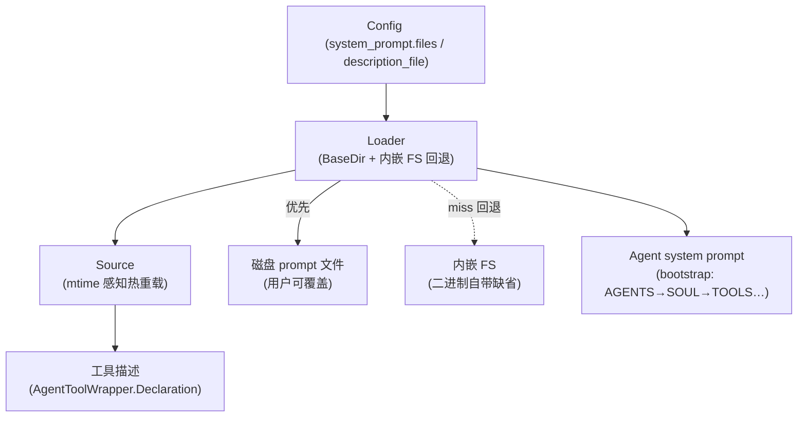
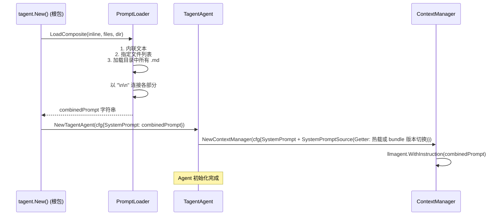

# tagent/prompt 模块架构文档

## 一、模块定位

`tagent/prompt` 是 tagent 的 **Prompt 模板加载层**，负责从文件系统加载 prompt 文件（.md），并组装为完整的 prompt 字符串供 Agent 使用。

**核心职责**：
- 从文件加载 prompt 内容
- 支持多种加载方式：单文件、目录、多文件组合
- 按特定顺序加载 bootstrap 文件（Agent 系统提示词）

**设计原则**：
- **纯加载，无生成**：不依赖 LLM，仅做文件 IO 和字符串组装
- **确定性顺序**：目录加载时按文件名排序，bootstrap 按预定义顺序
- **容错性**：空文件不报错，跳过而非中断

---

## 二、文件清单

| 文件 | 职责 |
|------|------|
| `loader.go` | Prompt 加载器：单文件/目录/组合/bootstrap 加载 + 内嵌 FS 回退（`WithFallback`） |
| `source.go` | `Source`：mtime 感知的热重载 prompt 源（工具描述热更新用；nil-receiver 守卫） |
| `getter.go` | `Getter` 接口（`Get() (string, error)` + `IsEmpty() bool` 两方法）：热配置提示词源抽象缝；`*Source` 编译期满足 |
| `loader_test.go` / `loader_fallback_test.go` | 加载器单元测试 + 内嵌 FS 回退专项（磁盘优先、miss 回退、绝对路径不回退） |
| `source_test.go` | 热重载 Source 单元测试（mtime 变更重读、inline-only 只加载一次） |

---

## 三、组件关系总览图



## 四、Loader — 核心数据结构

### 4.1 数据结构

```go
// prompt/loader.go
type Loader struct {
    // BaseDir: 所有相对路径的基准目录
    BaseDir string

    // fallbackFS: 内嵌缺省 prompt FS（经 WithFallback 注入）。磁盘 BaseDir 下
    // 文件/目录缺失时回退到它——磁盘永远优先。
    // fallbackPrefix: FS 内 prompt 根路径（如 resources/prompts），正斜杠分隔。
    fallbackFS     fs.FS
    fallbackPrefix string
}
```

`Loader` 是一个轻量结构，`BaseDir` 为所有相对路径提供基准路径解析；两个私有 fallback
字段承载内嵌缺省（详见 §十）。

### 4.2 工厂函数

```go
// prompt/loader.go
func NewLoader(baseDir string, opts ...LoaderOption) *Loader {
    l := &Loader{
        BaseDir: baseDir,
    }
    for _, opt := range opts {
        opt(l) // WithFallback 等选项在此生效
    }
    return l
}
```

无选项时只读磁盘 `BaseDir`（行为与引入 fallback 前一致）；传 `WithFallback(fsys, prefix)`
才启用内嵌缺省回退。

---

## 五、加载方法详解

### 5.1 LoadFromFile — 单文件加载

```go
// prompt/loader.go
func (l *Loader) LoadFromFile(path string) (string, error) {
    if path == "" {
        return "", errors.New("prompt file path is empty")
    }

    orig := path // 保留原始路径，供内嵌回退按 base name 查找

    if !filepath.IsAbs(path) && l.BaseDir != "" {
        path = filepath.Join(l.BaseDir, path)
    }

    path = strings.TrimSpace(path)
    if path == "" {
        return "", errors.New("prompt file path is empty after trimming")
    }

    data, err := os.ReadFile(path)
    if err != nil {
        // 磁盘 miss + 已配内嵌 FS → 回退内嵌缺省（磁盘永远优先；绝对路径不回退）
        if content, ok := l.fallbackFile(orig, err); ok {
            return content, nil
        }
        return "", fmt.Errorf("read prompt file %s: %w", path, err)
    }

    content := strings.TrimSpace(string(data))
    if content == "" {
        return "", nil
    }
    return content, nil
}
```

**特点**：
- 支持绝对路径和相对路径（相对路径以 `BaseDir` 为基准）
- 路径 trim 空格，避免意外空格导致的路径错误
- 空文件返回空字符串（`nil` 错误），而非报错
- 磁盘读失败时先试内嵌 FS 回退（`fallbackFile`，仅 `os.ErrNotExist` 且非绝对路径），未配置回退或回退也 miss 才返回 `fmt.Errorf` 包装的错误，调用方可通过 `errors.Is` 解包

### 5.2 LoadFromDir — 目录加载

```go
// prompt/loader.go
func (l *Loader) LoadFromDir(dir string) (string, error) {
    if dir == "" {
        return "", errors.New("prompt directory path is empty")
    }

    orig := dir // 保留原始路径，供内嵌回退按 base name 查找

    if !filepath.IsAbs(dir) && l.BaseDir != "" {
        dir = filepath.Join(l.BaseDir, dir)
    }

    dir = strings.TrimSpace(dir)
    if dir == "" {
        return "", errors.New("prompt directory path is empty after trimming")
    }

    entries, err := os.ReadDir(dir)
    if err != nil {
        // 整目录回退：磁盘目录缺失时扫内嵌同名目录（不与磁盘做逐文件合并）
        if content, ok := l.fallbackDir(orig, err); ok {
            return content, nil
        }
        return "", fmt.Errorf("read prompt directory %s: %w", dir, err)
    }

    files := make([]string, 0, len(entries))
    for _, entry := range entries {
        if entry.IsDir() {
            continue
        }
        if strings.ToLower(filepath.Ext(entry.Name())) != ".md" {
            continue
        }
        files = append(files, filepath.Join(dir, entry.Name()))
    }

    if len(files) == 0 {
        return "", fmt.Errorf("no .md prompt files in directory %s", dir)
    }

    sort.Strings(files)

    parts := make([]string, 0, len(files))
    for _, file := range files {
        content, err := l.LoadFromFile(file)
        if err != nil {
            return "", err
        }
        if content != "" {
            parts = append(parts, content)
        }
    }

    return strings.Join(parts, "\n\n"), nil
}
```

**特点**：
- **确定性顺序**：文件名排序保证每次加载顺序一致
- **非递归**：不递归子目录，仅处理当前目录文件
- **仅 .md**：加载 `.md` 文件（大小写不敏感）
- **严格错误处理**：任何文件加载失败都会中断整个目录加载
- **整目录回退**：磁盘目录不存在时回退内嵌同名目录（`fallbackDir`，同样排序 + `\n\n` 拼接）；不与磁盘内容做逐文件合并——磁盘目录存在即完全以磁盘为准

### 5.3 LoadFiles — 多文件加载

```go
// prompt/loader.go
func (l *Loader) LoadFiles(paths []string) (string, error) {
    parts := make([]string, 0, len(paths))

    for _, path := range paths {
        path = strings.TrimSpace(path)
        if path == "" {
            continue
        }

        content, err := l.LoadFromFile(path)
        if err != nil {
            return "", err
        }

        if content != "" {
            parts = append(parts, content)
        }
    }

    return strings.Join(parts, "\n\n"), nil
}
```

**与 LoadFromDir 的区别**：
| 对比 | `LoadFiles` | `LoadFromDir` |
|------|-----------|---------------|
| 来源 | 显式指定文件列表 | 目录遍历 |
| 顺序 | 按 `paths` 参数顺序 | 按文件名排序 |
| 失败行为 | 遇到错误中断 | 遇到错误中断（同样严格） |

### 5.4 LoadComposite — 组合加载

```go
// prompt/loader.go
func (l *Loader) LoadComposite(inline string, files []string, dir string) (string, error) {
    parts := make([]string, 0, 1+len(files))

    if v := strings.TrimSpace(inline); v != "" {
        parts = append(parts, v)
    }

    if len(files) > 0 {
        fileContent, err := l.LoadFiles(files)
        if err != nil {
            return "", err
        }
        if fileContent != "" {
            parts = append(parts, fileContent)
        }
    }

    dir = strings.TrimSpace(dir)
    if dir != "" {
        dirContent, err := l.LoadFromDir(dir)
        if err != nil {
            return "", err
        }
        if dirContent != "" {
            parts = append(parts, dirContent)
        }
    }

    return strings.Join(parts, "\n\n"), nil
}
```

**优先级**：`inline > files > dir`，三者用 `"\n\n"` 连接。

**典型用途**：加载 Agent 系统提示词：
```
// 加载 inline prompt（可能来自配置）
// 加载 files 列表（指定文件）
// 加载 dir（目录下的所有 .md）
```

---

## 六、Bootstrap 加载 — Agent 系统提示词

### 6.1 BootstrapLoadOrder — 加载顺序

```go
// prompt/loader.go
var BootstrapLoadOrder = []string{
    "AGENTS.md",     // 1. Agent 自身定义
    "SOUL.md",       // 2. 核心价值观/灵魂
    "USER.md",       // 3. 用户信息
    "TOOLS.md",      // 4. 工具定义
    "HEARTBEAT.md",  // 5. 心跳配置
    "MEMORY.md",     // 6. 记忆配置
}
```

### 6.2 LoadBootstrap — Bootstrap 加载逻辑

```go
// prompt/loader.go
func (l *Loader) LoadBootstrap(dir string) (string, error) {
    if dir == "" {
        return "", errors.New("bootstrap directory is empty")
    }

    if !filepath.IsAbs(dir) && l.BaseDir != "" {
        dir = filepath.Join(l.BaseDir, dir)
    }

    if _, err := os.Stat(dir); os.IsNotExist(err) {
        return "", fmt.Errorf("bootstrap directory %s does not exist", dir)
    }

    var results []string

    for _, filename := range BootstrapLoadOrder {
        path := filepath.Join(dir, filename)
        content, err := l.LoadFromFile(path)
        if err != nil {
            if errors.Is(errors.Unwrap(err), os.ErrNotExist) ||
                strings.Contains(err.Error(), "no such file") ||
                strings.Contains(err.Error(), "file does not exist") {
                continue
            }
            return "", err
        }
        if content != "" {
            results = append(results, content)
        }
    }

    entries, err := os.ReadDir(dir)
    if err == nil {
        loaded := make(map[string]bool)
        for _, name := range BootstrapLoadOrder {
            loaded[name] = true
        }

        for _, entry := range entries {
            if entry.IsDir() || strings.ToLower(filepath.Ext(entry.Name())) != ".md" {
                continue
            }
            if loaded[entry.Name()] {
                continue
            }

            path := filepath.Join(dir, entry.Name())
            content, err := l.LoadFromFile(path)
            if err == nil && content != "" {
                results = append(results, content)
            }
        }
    }

    return strings.Join(results, "\n\n"), nil
}
```

### 6.3 Bootstrap 文件语义

| 文件 | 语义 | 典型内容 |
|------|------|---------|
| `AGENTS.md` | Agent 自身定义 | 角色、能力边界、行为准则 |
| `SOUL.md` | 核心价值观 | 决策优先级、伦理底线 |
| `USER.md` | 用户信息 | 用户偏好、上下文 |
| `TOOLS.md` | 工具定义 | 可用工具列表和使用说明 |
| `HEARTBEAT.md` | 心跳配置 | 健康检查机制 |
| `MEMORY.md` | 记忆配置 | 记忆策略、压缩阈值 |

**组装后的结构**：

```
[AGENTS.md 内容]

[SOUL.md 内容]

[USER.md 内容]

[TOOLS.md 内容]

[HEARTBEAT.md 内容]

[MEMORY.md 内容]
```

---

## 七、辅助函数

### 7.1 SplitCSV — CSV 解析

```go
// prompt/loader.go
func SplitCSV(s string) []string {
    if s == "" {
        return nil
    }

    parts := strings.Split(s, ",")
    result := make([]string, 0, len(parts))
    for _, part := range parts {
        part = strings.TrimSpace(part)
        if part != "" {
            result = append(result, part)
        }
    }
    return result
}
```

将逗号分隔的字符串（如 `"a.md, b.md, c.md"`）拆分为 slice，过滤空元素并 trim 空格。

---

## 八、与其他模块的关系

### 8.1 依赖关系

```
tagent/prompt（加载层）
    ↑
    │  提供组装后的 prompt 字符串
    │
tagent/agent
    └── ContextManager
        └── llmagent.WithInstruction（将 prompt 注入 system message）
```

### 8.2 在 Agent 初始化中的位置

实际调用链：`tagent.New()` → `buildAgent()` → `loader.LoadComposite(inline, files, dir)`。
`LoadComposite` 支持三种来源的灵活组装：内联文本、指定文件列表、整个目录。



> **补充**：`LoadBootstrap()` 提供了按 `BootstrapLoadOrder` 顺序加载指定文件的备选路径，
> 适合固定的 bootstrap 文件约定场景。当前主流程使用 `LoadComposite` 以获得更大灵活性。

### 8.3 BaseDir 的作用

`BaseDir` 使得 prompt 文件可以使用相对路径引用：

```go
// 示例：BaseDir = 部署目录下的 prompt 根
loader := prompt.NewLoader("resources/prompts")

// 加载相对路径 "recall_tool_desc.md"
// 实际读取 "resources/prompts/recall_tool_desc.md"
loader.LoadFromFile("recall_tool_desc.md")
```

这使得 prompt 文件的路径引用与部署环境解耦。

---

## 九、关键设计决策

### 9.1 为什么用 `"\n\n"` 而不是其他分隔符？

`"\n\n"`（两个换行）在 Markdown 中通常表示段落分隔，视觉效果清晰：
- **可读性**：在源文件中是自然的段落分隔
- **LLM 友好**：大多数 LLM 能正确理解段落边界的语义
- **无歧义**：不会与单换行或代码块内的换行混淆

### 9.2 为什么空文件不报错？

```go
if content == "" {
    return "", nil  // 而不是 return "", fmt.Errorf("empty file")
}
```

**原因**：Bootstrap 场景中某些可选文件（如 `HEARTBEAT.md`）可能不存在。不存在和存在但为空都应该跳过，不中断整个加载过程。

### 9.3 为什么目录加载不递归子目录？

**原因**：
- 避免意外的加载顺序（子目录深度不确定）
- 鼓励显式的目录结构设计
- 保持 `BootstrapLoadOrder` 的可控性

如需加载子目录，显式使用 `LoadFiles` 指定完整路径。

---

## 十、内嵌 FS 回退（prompt-loader-fallback）

`NewLoader(baseDir, WithFallback(fsys, prefix))` 注入内嵌 prompt FS：磁盘 `BaseDir` 下找不到文件/目录时回退到 embed FS（`prefix` 为 FS 内 prompt 根路径，如 `resources/prompts`）。**磁盘永远优先**——用户可覆盖任意内置 prompt，二进制单文件分发时又不缺省。`fallbackFile/fallbackDir` 在 `LoadFromFile/LoadFromDir` 的 miss 路径内生效，调用方无感知。

## 十一、Source — 热重载 prompt 源

```go
// prompt/source.go
src := prompt.NewSource(loader, prompt.CompositeConfig{Files: []string{"recall_tool_desc.md"}})
content, _ := src.Get() // 读盘并缓存
// 文件被修改后：
content, _ = src.Get() // mtime 变化 → 自动重读
```

用途：`AgentToolWrapper.SetDescriptionSource` 使工具描述**热更新**——`Declaration()` 每次经 Source 取描述，改 prompt 文件立即生效，无需重启进程。inline-only（无 files）配置只加载一次并缓存。

**Getter 缝与热配置（TC0）**：`Source` 满足 `Getter`（两方法：`Get() (string, error)` / `IsEmpty() bool`）。ContextManager 的 `SystemPromptSource` 与 MeditationConfig 的 `PromptSource` 字段已迁为 `prompt.Getter` 接口——可注入 `evolution.VersionedSource`（从 active bundle 读、无 active 回退 base、**回合边界生效**），未启用 evolution 时仍注入 `*prompt.Source` 走 mtime 热载（语义零变化）。bundle 版本化与发布道详见 [platform 篇](../platform/platform-subsystems.md)。注意例外：工具描述路径未迁 Getter（`SetDescriptionSource(src *prompt.Source)` 仍具体类型）。


---

## 已知缺口与演进方向

> 本章主动声明当前设计尚未闭合的环。

| 缺口 | 现状与防线 | 候选方向 |
|------|-----------|---------|
| **参数/模型热切换仅存储就绪** | TC0 起 BundleStore+VersionedSource 提供 bundle 版本化（仅 prompts 有运行期应用点，回合边界生效）；refine 白名单现仅 prompts——bundle.Params/Model 无运行期应用点 | 接线 BeforeModel 读 active.Params/Model，或收窄宣称为「提示词热配置」 |
| **bootstrap 顺序固定** | AGENTS→SOUL→TOOLS… 顺序编码在 LoadBootstrap，不可配置 | 保持固定（顺序即契约）；如需自定义走 system_prompt.files 显式列表 |
