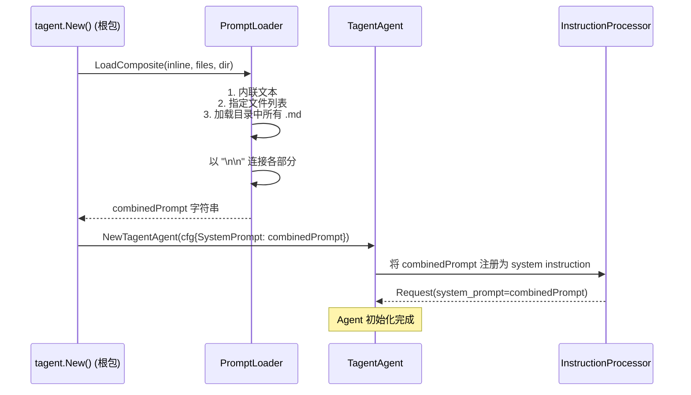

# tagent/prompt 模块架构文档

## 一、模块定位

`tagent/prompt` 是 tagent 的 **Prompt 模板加载层**，负责从文件系统加载 prompt 文件（.md），并组装为完整的 prompt 字符串供 Agent 使用。

**核心职责**：
- 从文件加载 prompt 内容
- 支持多种加载方式：单文件、目录、多文件组合
- 按特定顺序加载 bootstrap 文件（Agent 系统提示词）

**设计原则**：
- **纯加载，无生成**：不依赖 LLM，仅做文件 IO 和字符串组装
- **确定性顺序**：目录加载时按文件名排序，bootstrap 按预定义顺序
- **容错性**：空文件不报错，跳过而非中断

---

## 二、文件清单

| 文件 | 行数 | 职责 |
|------|------|------|
| `loader.go` | 273 | Prompt 加载器：单文件、目录、组合加载、bootstrap 加载 |
| `loader_test.go` | 10.1KB | 单元测试 |

---

## 三、Loader — 核心数据结构

### 3.1 数据结构

```go
// prompt/loader.go:12-16
type Loader struct {
    // BaseDir: 所有相对路径的基准目录
    BaseDir string
}
```

`Loader` 是一个轻量结构，`BaseDir` 为所有相对路径提供基准路径解析。

### 3.2 工厂函数

```go
// prompt/loader.go:18-23
func NewLoader(baseDir string) *Loader {
    return &Loader{BaseDir: baseDir}
}
```

---

## 四、加载方法详解

### 4.1 LoadFromFile — 单文件加载

```go
// prompt/loader.go:41-70
func (l *Loader) LoadFromFile(path string) (string, error) {
    // Step 1: 空路径检查
    if path == "" {
        return "", errors.New("prompt file path is empty")
    }

    // Step 2: 相对路径 → 绝对路径
    if !filepath.IsAbs(path) && l.BaseDir != "" {
        path = filepath.Join(l.BaseDir, path)
    }

    // Step 3: Trim空格
    path = strings.TrimSpace(path)

    // Step 4: 读取文件
    data, err := os.ReadFile(path)
    if err != nil {
        return "", fmt.Errorf("read prompt file %s: %w", path, err)
    }

    // Step 5: Trim 并返回（空文件返回空字符串，不报错）
    content := strings.TrimSpace(string(data))
    if content == "" {
        return "", nil
    }
    return content, nil
}
```

**特点**：
- 支持绝对路径和相对路径（相对路径以 `BaseDir` 为基准）
- 路径 trim 空格，避免意外空格导致的路径错误
- 空文件返回空字符串（`nil` 错误），而非报错
- 文件不存在时返回 `fmt.Errorf` 包装的错误，调用方可通过 `errors.Is` 解包

### 4.2 LoadFromDir — 目录加载

```go
// prompt/loader.go:75-127
func (l *Loader) LoadFromDir(dir string) (string, error) {
    // Step 1: 路径解析（同 LoadFromFile）
    if !filepath.IsAbs(dir) && l.BaseDir != "" {
        dir = filepath.Join(l.BaseDir, dir)
    }

    dir = strings.TrimSpace(dir)
    if dir == "" {
        return "", errors.New("prompt directory path is empty after trimming")
    }

    // Step 2: 遍历目录，收集 .md 文件
    entries, err := os.ReadDir(dir)
    if err != nil {
        return "", fmt.Errorf("read prompt directory %s: %w", dir, err)
    }

    for _, entry := range entries {
        if entry.IsDir() {
            continue  // 跳过子目录
        }
        if strings.ToLower(filepath.Ext(entry.Name())) != ".md" {
            continue  // 跳过非 .md 文件
        }
        files = append(files, filepath.Join(dir, entry.Name()))
    }

    if len(files) == 0 {
        return "", fmt.Errorf("no .md prompt files in directory %s", dir)
    }

    // Step 3: 按文件名排序（确定性顺序）
    sort.Strings(files)

    // Step 4: 逐个加载并用 "\n\n" 连接（遇到错误立即返回）
    for _, file := range files {
        content, err := l.LoadFromFile(file)
        if err != nil {
            return "", err  // 不跳过错误，直接返回
        }
        if content != "" {
            parts = append(parts, content)
        }
    }

    return strings.Join(parts, "\n\n"), nil
}
```

**特点**：
- **确定性顺序**：文件名排序保证每次加载顺序一致
- **非递归**：不递归子目录，仅处理当前目录文件
- **仅 .md**：加载 `.md` 文件（大小写不敏感）
- **严格错误处理**：任何文件加载失败都会中断整个目录加载

### 4.3 LoadFiles — 多文件加载

```go
// prompt/loader.go:116-136
func (l *Loader) LoadFiles(paths []string) (string, error) {
    parts := make([]string, 0, len(paths))

    for _, path := range paths {
        path = strings.TrimSpace(path)
        if path == "" {
            continue  // 跳过空路径
        }
        content, err := l.LoadFromFile(path)
        if err != nil {
            return "", err  // 这里会中断
        }
        if content != "" {
            parts = append(parts, content)
        }
    }

    return strings.Join(parts, "\n\n"), nil
}
```

**与 LoadFromDir 的区别**：
| 对比 | `LoadFiles` | `LoadFromDir` |
|------|-----------|---------------|
| 来源 | 显式指定文件列表 | 目录遍历 |
| 顺序 | 按 `paths` 参数顺序 | 按文件名排序 |
| 失败行为 | 遇到错误中断 | 遇到错误中断（同样严格） |

### 4.4 LoadComposite — 组合加载

```go
// prompt/loader.go:154-192
func (l *Loader) LoadComposite(inline string, files []string, dir string) (string, error) {
    parts := make([]string, 0, 1+len(files))

    // 1. Inline prompt（最高优先级）
    if v := strings.TrimSpace(inline); v != "" {
        parts = append(parts, v)
    }

    // 2. 多个文件（按顺序，遇错中断）
    if len(files) > 0 {
        fileContent, err := l.LoadFiles(files)
        if err != nil {
            return "", err
        }
        if fileContent != "" {
            parts = append(parts, fileContent)
        }
    }

    // 3. 目录（最低优先级，遇错中断）
    dir = strings.TrimSpace(dir)
    if dir != "" {
        dirContent, err := l.LoadFromDir(dir)
        if err != nil {
            return "", err
        }
        if dirContent != "" {
            parts = append(parts, dirContent)
        }
    }

    return strings.Join(parts, "\n\n"), nil
}
```

**优先级**：`inline > files > dir`，三者用 `"\n\n"` 连接。

**典型用途**：加载 Agent 系统提示词：
```
// 加载 inline prompt（可能来自配置）
// 加载 files 列表（指定文件）
// 加载 dir（目录下的所有 .md）
```

---

## 五、Bootstrap 加载 — Agent 系统提示词

### 5.1 BootstrapLoadOrder — 加载顺序

```go
// prompt/loader.go:265-273
var BootstrapLoadOrder = []string{
    "AGENTS.md",     // 1. Agent 自身定义
    "SOUL.md",       // 2. 核心价值观/灵魂
    "USER.md",       // 3. 用户信息
    "TOOLS.md",      // 4. 工具定义
    "HEARTBEAT.md",  // 5. 心跳配置
    "MEMORY.md",     // 6. 记忆配置
}
```

### 5.2 LoadBootstrap — Bootstrap 加载逻辑

```go
// prompt/loader.go:199-262
func (l *Loader) LoadBootstrap(dir string) (string, error) {
    var results []string

    // Step 1: 按 BootstrapLoadOrder 顺序加载
    for _, filename := range BootstrapLoadOrder {
        path := filepath.Join(dir, filename)
        content, err := l.LoadFromFile(path)
        if errors.Is(err, os.ErrNotExist) {
            continue  // 文件不存在 → 跳过
        }
        if content != "" {
            results = append(results, content)
        }
    }

    // Step 2: 加载剩余的 .md 文件（不在 BootstrapLoadOrder 中的）
    entries, _ := os.ReadDir(dir)
    for _, entry := range entries {
        if entry.IsDir() { continue }
        if !strings.HasSuffix(entry.Name(), ".md") { continue }
        if alreadyLoaded(entry.Name()) { continue }  // 跳过已加载的

        content, _ := l.LoadFromFile(entry.Name())
        if content != "" {
            results = append(results, content)
        }
    }

    return strings.Join(results, "\n\n"), nil
}
```

### 5.3 Bootstrap 文件语义

| 文件 | 语义 | 典型内容 |
|------|------|---------|
| `AGENTS.md` | Agent 自身定义 | 角色、能力边界、行为准则 |
| `SOUL.md` | 核心价值观 | 决策优先级、伦理底线 |
| `USER.md` | 用户信息 | 用户偏好、上下文 |
| `TOOLS.md` | 工具定义 | 可用工具列表和使用说明 |
| `HEARTBEAT.md` | 心跳配置 | 健康检查机制 |
| `MEMORY.md` | 记忆配置 | 记忆策略、压缩阈值 |

**组装后的结构**：

```
[AGENTS.md 内容]

[SOUL.md 内容]

[USER.md 内容]

[TOOLS.md 内容]

[HEARTBEAT.md 内容]

[MEMORY.md 内容]
```

---

## 六、辅助函数

### 6.1 SplitCSV — CSV 解析

```go
// prompt/loader.go:180-194
func SplitCSV(s string) []string {
    parts := strings.Split(s, ",")
    for _, part := range parts {
        part = strings.TrimSpace(part)
        if part != "" {
            result = append(result, part)
        }
    }
    return result
}
```

将逗号分隔的字符串（如 `"a.md, b.md, c.md"`）拆分为 slice，过滤空元素并 trim 空格。

---

## 七、与其他模块的关系

### 7.1 依赖关系

```
tagent/prompt（加载层）
    ↑
    │  提供组装后的 prompt 字符串
    │
tagent/agent
    └── TagentAgent
        └── InstructionProcessor（将 prompt 注入 system message）
```

### 7.2 在 Agent 初始化中的位置

实际调用链：`tagent.New()` → `buildAgent()` → `loader.LoadComposite(inline, files, dir)`。
`LoadComposite` 支持三种来源的灵活组装：内联文本、指定文件列表、整个目录。



> **补充**：`LoadBootstrap()` 提供了按 `BootstrapLoadOrder` 顺序加载指定文件的备选路径，
> 适合固定的 bootstrap 文件约定场景。当前主流程使用 `LoadComposite` 以获得更大灵活性。

### 7.3 BaseDir 的作用

`BaseDir` 使得 prompt 文件可以使用相对路径引用：

```go
// 示例：BaseDir = "/path/to/openclaw"
loader := prompt.NewLoader("/path/to/openclaw")

// 加载相对路径 "docs/skills/python.md"
// 实际读取 "/path/to/openclaw/docs/skills/python.md"
loader.LoadFromFile("docs/skills/python.md")
```

这使得 prompt 文件的路径引用与部署环境解耦。

---

## 八、关键设计决策

### 8.1 为什么用 `"\n\n"` 而不是其他分隔符？

`"\n\n"`（两个换行）在 Markdown 中通常表示段落分隔，视觉效果清晰：
- **可读性**：在源文件中是自然的段落分隔
- **LLM 友好**：大多数 LLM 能正确理解段落边界的语义
- **无歧义**：不会与单换行或代码块内的换行混淆

### 8.2 为什么空文件不报错？

```go
if content == "" {
    return "", nil  // 而不是 return "", fmt.Errorf("empty file")
}
```

**原因**：Bootstrap 场景中某些可选文件（如 `HEARTBEAT.md`）可能不存在。不存在和存在但为空都应该跳过，不中断整个加载过程。

### 8.3 为什么目录加载不递归子目录？

**原因**：
- 避免意外的加载顺序（子目录深度不确定）
- 鼓励显式的目录结构设计
- 保持 `BootstrapLoadOrder` 的可控性

如需加载子目录，显式使用 `LoadFiles` 指定完整路径。
