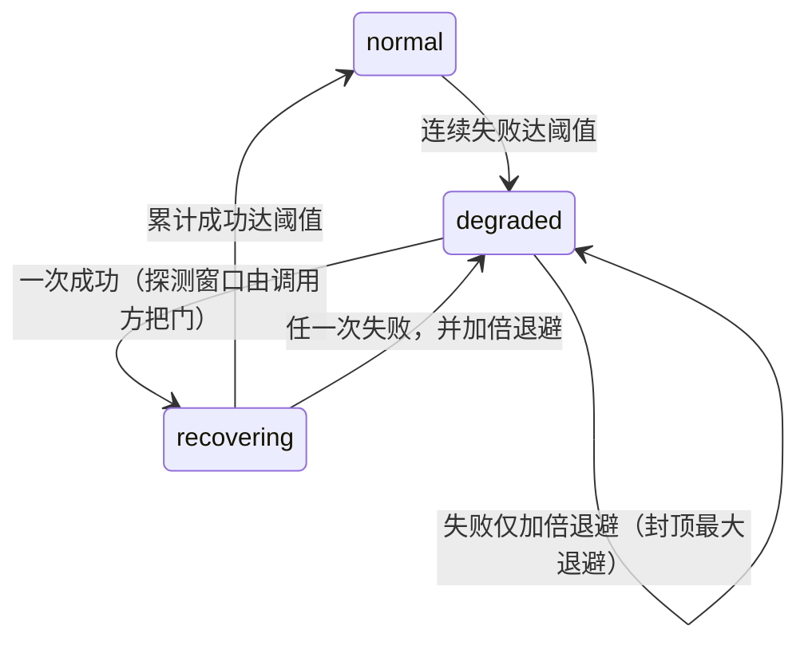

# 持久投递与依赖退化

本页承载 `agent/reliability` 这一叶的判据：信封在崩溃与重启之间如何不丢不重，以及外部依赖失效时"降级—恢复"如何可证伪。这两件事的失效表现都不是报错，而是**重复消费**、**静默丢失**或**永久降级**。

## 一、信封的三段状态：pending → claimed → receipted →（ack）

| 状态 | 含义 | 关键约束 |
|---|---|---|
| `pending` | 待领取 | 只有它参与"按严格序号领取" |
| `claimed` | 已被某次 Pull 领取 | 持有者独占处理权，其它领取者看不到它 |
| `receipted` | 已写下回执但尚未 ack | **必须在重复领取扫描中原样存活**：既不删除也不重投；删除与容量/租约释放只属于 ack |

"有回执但未确认"是一种需要被尊重的中间态：把扫描当成垃圾回收来顺手清理，就会让已经对外承诺过的处理证据消失。

## 二、退回待取：瞬时失败不消耗输入

提交门在**瞬时 I/O 失败**时把已领取的信封退回 `pending`（不 ack、不丢弃、不消费输入），使后续领取能按严格序号重来。这样做的直接后果是**顺序与有界背压都成立**：最旧的那个卡住的信封一定先于任何较晚到达者被重新领取。

与之相对，**确定性冲突**（同一预留位上出现不同内容）属另一类：批次必须全有或全无，同批里合法的那条也不能借此提交。
"发布不确定"是第三种情形，需要单独判据：**重命名已落地、目录同步失败**时原件必须保留、其预留容量继续占有，且**序号不得回滚复用**——一旦回滚，下一条输入会写进同一个路径，把已经落地的原件覆盖掉。

## 三、重开时的两类"拒绝"，含义完全不同

| 情形 | 打开时 | 为什么这样设计 |
|---|---|---|
| 存在**当前格式**的隔离项（不可读或版本未知、且未被运维处置） | **拒绝重开** | 若允许打开，就等于每次启动都静默忽略一批未知数据，损坏永远不会被看见 |
| 存在**前代格式**数据（散落的溢出文件、旧版本收件树） | **不阻止启动** | 只加载当前格式；旧数据保持惰性（不猜测解析、不消费），直到一次显式的受管重置 |

受管重置是这一叶**唯一**具破坏性的路径，因此有四条约束：必须显式确认；只删除打开时枚举到的前代格式文件（与在用树互不相交、且不被任何当前事实引用，故清掉不留悬空引用）；绝不触碰在用树与其隔离区；仍有未确认信封时拒绝执行（重置需要独占写入权，不能插进一个进行中的回合）。

## 四、依赖退化阶梯：恢复必须是可证伪的

每个受监控依赖（存储栈、外部后端、MCP 工具来源、模型调用、磁盘写入）各自独立计状态，以便一次后端抖动只降级到它实际影响的能力。

三条容易被写反的规则：

1. **进入 degraded 需要连续失败达到阈值**，期间的成功只把失败计数清零——偶发一次失败不足以判定依赖坏了；
2. **degraded 下的失败只加倍退避**（封顶在最大退避），状态不变；一次成功即进入 recovering，而"探测窗口是否已到"由调用方把门，不在状态机里猜；
3. **recovering 中任何一次失败立刻退回 degraded 并加倍退避**。宁可多等一轮，也不要在"看着像好了"的时候把能力放回去。

分开的依赖各有下游后果：模型依赖降级时回合之间按退避暂停，而不是把失败当正常答复往下走；工具来源依赖降级时对相应调用熔断。

## 五、门控锚点必须跨重启持久

冥想一类的时间性门控依赖"上一次用户输入/回合结束"的锚点。锚点跨重启持久，缺失一律按 0 处理：**不持久化的后果是双向的**——空闲时长可能被算成从 epoch 起而立即误触发，也可能因看起来"刚刚有输入"而被长期压制。静默（长期活着但没写入）同样要保持活性，否则重启后无法区分它和真正的空闲。

## 已知缺口与演进方向

- 隔离项的处置目前只有"运维显式处理"一条路，缺一个把处置动作本身记录下来的通道；
- 退化阶梯的阈值与退避都是命名常量，缺一次跨依赖的实测标定（不同依赖的失败节奏差别很大）；
- 受管重置只报告删了多少文件，没有"为什么这些可以删"的可核查清单输出。
