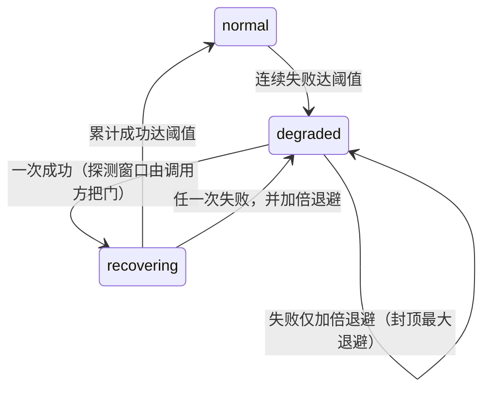

# 持久投递与依赖退化

本页承载 `agent/reliability` 这一叶的判据：信封在崩溃与重启之间如何不丢不重，以及外部依赖失效时"降级—恢复"如何可证伪。这两件事的失效表现都不是报错，而是**重复消费**、**静默丢失**或**永久降级**。

## 一、信封的三段状态：pending → claimed → receipted →（ack）

| 状态 | 含义 | 关键约束 |
|---|---|---|
| `pending` | 待领取 | 只有它参与"按严格序号领取" |
| `claimed` | 已被某次 Pull 领取 | 持有者独占处理权，其它领取者看不到它 |
| `receipted` | 已写下回执但尚未 ack | **必须在重复领取扫描中原样存活**：既不删除也不重投；删除与容量/租约释放只属于 ack |

"有回执但未确认"是一种需要被尊重的中间态：把扫描当成垃圾回收来顺手清理，就会让已经对外承诺过的处理证据消失。

批量提交门返回的是**分类结论**而不是布尔值，因此调用方永远不会把"第一个输入"当成整批的代表：先对整批跑 write-before-prepare 屏障（冻结每一个已认领信封的规范化 prepared 事实并预留 receipt_key），然后才逐个存储所选事实。

| 结论 | 含义 | 调用方动作 |
|---|---|---|
| `submitOK` | 全部所选事实既 prepared 又 stored | 可以启动模型 |
| `submitConflict` | 确定性的身份/格式冲突 | 隔离（quarantine）该信封，停止自动消费 |
| `submitTransient` | 可重试的 I/O 失败，**什么都没提交** | 以有界退避重试同一批 |
| `submitCancelled` | 提交途中上下文取消，认领已退回 | 按瞬时失败处理，不消耗输入 |

回执（claimed → receipted）只在**三门都成立**时耐久写入，任何一门都不是描述字符串或请求 id：

1. **合法完成已被耐久冻结**：存在、是合法 JSON、且足够符合本 schema-agnostic 叶子的结构约定——完全解码与校验由 agent 层在签发任何凭据之前完成；
2. **两阶段预留确实建立**：信封携带来自 `PrepareFacts` 的非空 reserved receipt key；
3. **调用方出示的 `ReceiptCredential` 与该预留匹配**——回执身份只在事实链的 receipt 提交被确认之后才铸造。

被拒绝的回执绝不推进状态：认领留在原地并可重放，而不是让一次裸的状态跳转成立。

**启动期直接对账以每份信封自己的回执为准**：盘点所有未收口的信封时，判定依据是**该信封固定回执键**的在册情况，绝不能用另一趟收件箱扫描收集来的清单去反推——清单会因扫描边界而漏项，漏项会让已冻结的回执被当成没发生。

四种结果各有处置，且不合并：**只有 prepared** 的接着把输入交下去；**只有 completion** 的只重提交那份已冻结的回执，不再重跑动作；两者都在且一致就清理收口；两者都在却矛盾（同一信封两个不同结论）一律**隔离**交人工；读取本身失败（I/O 故障）**阻塞启动**——对账没做完就放行，等于用未知状态服务。

## 二、退回待取：瞬时失败不消耗输入

提交门在**瞬时 I/O 失败**时把已领取的信封退回 `pending`（不 ack、不丢弃、不消费输入），使后续领取能按严格序号重来。这样做的直接后果是**顺序与有界背压都成立**：最旧的那个卡住的信封一定先于任何较晚到达者被重新领取。

与之相对，**确定性冲突**（同一预留位上出现不同内容）属另一类：批次必须全有或全无，同批里合法的那条也不能借此提交。
"发布不确定"是第三种情形，需要单独判据：**重命名已落地、目录同步失败**时原件必须保留、其预留容量继续占有，且**序号不得回滚复用**——一旦回滚，下一条输入会写进同一个路径，把已经落地的原件覆盖掉。

## 三、重开时的两类"拒绝"，含义完全不同

| 情形 | 打开时 | 为什么这样设计 |
|---|---|---|
| 存在**当前格式**的隔离项（不可读或版本未知、且未被运维处置） | **拒绝重开** | 若允许打开，就等于每次启动都静默忽略一批未知数据，损坏永远不会被看见 |
| 存在**前代格式**数据（散落的溢出文件、旧版本收件树） | **不阻止启动** | 只加载当前格式；旧数据保持惰性（不猜测解析、不消费），直到一次显式的受管重置 |

受管重置是这一叶**唯一**具破坏性的路径，因此有四条约束：必须显式确认；只删除打开时枚举到的前代格式文件（与在用树互不相交、且不被任何当前事实引用，故清掉不留悬空引用）；绝不触碰在用树与其隔离区；仍有未确认信封时拒绝执行（重置需要独占写入权，不能插进一个进行中的回合）。

受管重置的作用域是一个**恢复单元**：同一份记忆事实所依赖的存储、收件树与门控锚点必须一起回到干净态——只清其中一部分，重启后就会面对半新半旧的不一致，比不清更危险。

## 四、依赖退化阶梯：恢复必须是可证伪的

每个受监控依赖（存储栈、外部后端、MCP 工具来源、模型调用、磁盘写入）各自独立计状态，以便一次后端抖动只降级到它实际影响的能力。

三条容易被写反的规则：

1. **进入 degraded 需要连续失败达到阈值**，期间的成功只把失败计数清零——偶发一次失败不足以判定依赖坏了；
2. **degraded 下的失败只加倍退避**（封顶在最大退避），状态不变；一次成功即进入 recovering，而"探测窗口是否已到"由调用方把门，不在状态机里猜；
3. **recovering 中任何一次失败立刻退回 degraded 并加倍退避**。宁可多等一轮，也不要在"看着像好了"的时候把能力放回去。

分开的依赖各有下游后果：模型依赖降级时回合之间按退避暂停，而不是把失败当正常答复往下走；工具来源依赖降级时对相应调用熔断。

## 五、门控锚点必须跨重启持久

冥想一类的时间性门控依赖"上一次用户输入／回合结束／上次冥想"三枚锚点（外部观察形态下判据只读 last-meditation 水位，另两锚仍照常更新——形态与锚点关系见 [agent 引擎篇 §2.14](../agent/agent-architecture.md#meditation-two-forms)）。锚点跨重启持久，缺失一律按 0 处理：**不持久化的后果是双向的**——空闲时长可能被算成从 epoch 起而立即误触发，也可能因看起来"刚刚有输入"而被长期压制。静默（长期活着但没写入）同样要保持活性，否则重启后无法区分它和真正的空闲。

## 六、谱系投递白名单：宿主可见与自管理是两层语义

`event` 包是谱系投递策略的**单一真源**：宿主投递门、结算外显判定与跨分区新鲜度判据同源消费同一个白名单，消费者一律从谓词推导，绝不私存副本。两层语义的正交组合有三种真实落点：`user`（可投递、非自管）、`meditation`（可投递、自管）、`consolidation_hint` 与一切未知值（不可投递、自管）。

- **可投递（宿主可见）**：`user`、`task`、`reincarnation`、`system_alert`、`meditation`。携带这些触发电源的回收，其逐字通知可以被投递给宿主，因而也才允许老化出局。
- **白名单之外一律 fail-closed 扣留**：未知值永不投递——这与"未知即扣留"的整体保守方向一致，宁可少说，不可误说。
- **`meditation` 是两层语义的典型**：它的产物可以外发给宿主，但在遥测审计里仍算**自管理**流量——自治回合不计入宿主侧的输入新颖性，也不 re-arm 任何观察者的新鲜度门（新颖锚只在 `source=="user"` 的注入点写）。新增一个宿主可见谱系，唯一落点就是这个白名单函数。
- **`consolidation_hint` 必须显式登记，不能靠"未登记即扣留"的隐式默认**：它是容量压力发出的内部唤醒信号，载荷是一份可巩固候选清单而非宿主可见产物，语义是**自管理且不可投递**（常量 `LineageConsolidationHint`）。未登记时 `SelfManagedLineage` 确实派生为真、`DeliverableLineage` 确实为假——但那两层保护只是同一个巧合：有人把它加进投递白名单的那一刻，"自管理"仍然成立而"不计入新鲜度"就地失效，判据在别处、无人报错。显式登记把两层语义钉在同一处，装配侧注入与新鲜度判据引用同一个符号。

### 投递缝：进程内跨 agent 的窄投递面

外部化冥想（见 [agent 引擎篇](../agent/agent-architecture.md#meditation-two-forms)）的产出要回到别的 agent，走的仍是这条谱系语义，不新开通道：`DeliverToAgent(from, targetAgent, sessionID, msg)`（`delivery.go`）把消息经目标的 `InjectMessageWithSource(event.LineageMeditation, …)` 送进它的 mailbox——目标侧零新代码。四道前置裁决按序生效，任一失败都返回**具名错误**（一律 `%w` 包裹，`errors.Is` 可判别），无一静默丢：

| 拒绝 | 错误 | 判据 |
|---|---|---|
| 未获授权 | `ErrDeliveryNotAllowed` | 目标名 ∈ 投递方 `meditation.deliver_to`；白名单缺省为空，空＝装配期未登记＝**拒绝一切投递**（fail-closed） |
| 盲投 | `ErrDeliveryBlindTarget` | 白名单目标的分区必须落在投递方观察面内；装配期同规则校验，声明盲投即具名拒启 |
| 未知目标 | `ErrUnknownDeliveryTarget` | 寻址只走同进程常驻表，报错带常驻表实况；不发生任何网络调用 |
| 目标未运行 | `ErrDeliveryTargetNotRunning` | 目标持久循环 `loopActive=false`：不起新 Run、不落盘等待（不绑可靠性开关），错误返回是唯一副作用 |

成功语义是**已进入 mailbox**，不是"已触发 turn"：投递与用户输入同批到达时，冥想谱系事件按既有混合批次条款被移除且不补偿（用户优先，`dropMeditationFromMixedBatch`）——让位是合法结局，不构成投递失败。消息自带来源头（`[delivery] 来源 agent：…`，给出目标会话时一并写入），目标无需回查即可理解来源。**范围钉死为进程内**：跨进程/跨机器投递不属这条缝，继续由既有 HTTPAPI 面承担。

## 七、受管重置：本叶子内唯一具破坏性的路径

`ResetTransitional` 是对前代格式数据的**一次性受管重置**。它的边界不可被推导成"任意删除"的能力：

| 约束 | 内容 |
|---|---|
| 显式确认 | 必须 confirm 才执行——重置是运维动作，绝不自动发生 |
| 删除范围 | 只删打开时枚举到的前代格式文件（散落的 `*.spill` 与 `inbox-v1/*.json`）；它们与在用的 inbox-v2 树互不相交、不被任何当前事实引用，因此清掉不留悬空引用 |
| 绝不可触 | inbox-v2 及其隔离区（当前格式损坏必须暴露而不是被抹掉），以及本叶子目录树之外的任何路径 |
| 独占写入 | 已关闭、或仍有信封未 ack（`pending>0`）时拒绝执行：受管重置需要独占写入权，而不是在进行中的回合里插队 |

当前格式损坏与一般 I/O 失败都**不属于**过渡数据，这里绝不清理它们；返回值是被删除的前代格式文件数。

## 八、隔离移动：三种结果对应三种后续义务

`quarantineFile` 把一条收件项移入隔离目录，同时如实报告"是否真的移动了"与每一次失败，调用方据此决定容量的记账与退避：

| 情形 | 返回 | 语义与义务 |
|---|---|---|
| 已经不在这条路径上（前次尝试已移动） | `(false, nil)` | 处置已完整，可当作幂等重入 |
| rename 失败 | `(false, err)` | 什么都没移动，容量**必须**继续占用 |
| 已移动但目录屏障失败 | `(true, err)` | 该项已离开认领路径；掉电回滚可能使它复活，下一次扫描会再次隔离（ENOENT 视为已不在），墓碑则拒绝复活，因此这一泄漏自愈；错误仍然上报，因为 rename 尚未耐久 |

调用方必须把容量递减绑定到 `moved == true`，而不是绑定到"调用发生了"——把二者混同曾导致 pending 被丢弃而占用失去主人。

## 九、重放时那份事实从哪来：三种认领状态

同一个事件在重放路径上必须取到**同一份**事实，否则会写出两份身份不同的记录。取法只由"认领状态 + prepared 事实是否存在"决定，三条互斥：

| 状态 | 取法 | 为什么 |
|---|---|---|
| 有 durable 认领**且**带已冻结的 `prepared_fact` | **逐字复用** | 它的 EventKey、摘要与归属在首次认领时被 write-before-prepare 屏障冻结；重放不得重新盖章时间/rollout/bundle，也不会二次写入 |
| 上一种情形里那些字节**不可解码或不完整** | 门住存储并上报（返回 false） | 这是当前格式损坏。"重新生成 key 再存一遍"的弱回退分支已删除：铸造新 key 会把同一条输入以新身份静默写两次；认领留在原地重放 |
| 有 durable 认领但**没有** `prepared_fact` | 什么都不写（返回 false） | 屏障对本信封未成功，按"准备失败不调用 StoreEvent"处理；半成品输入绝不静默进入事实链，认领留在原地重放 |
| 无认领（瞬态路径/直连调用） | 新建一份规范化事实 | 没有可复用的冻结事实，也没有需要保护的认领 |

## 十、写者身份与目录单属主

信封的每次落盘都走"临时文件 + fsync + rename"。临时文件名必须携带**写者身份**：只到 pid 粒度是不够的——同一进程里的两个 inbox 实例共享 pid，会算出同一个临时名，于是 `O_EXCL` 把后来者堵死（`file exists`），而失败路径的清理删除的是**对端正在用的那个临时文件**，对端随后 rename 得到 `no such file`。这是同一个缺陷的两段式症状，不是两个巧合。

- **写者身份**：pid + 实例随机标识 + 写者内序号。任何对端残骸都不再能把一个合法写入者堵死；
- **清理边界**：错误路径只删除自己刚创建的那个临时文件，绝不"顺手"清理看起来同族的残留。

一个 spillDir 只有**一个属主**。这不是约定而是语义要求：`NewInbox` 的打开动作本身就带写副作用（把 claimed 重排回 pending），而且每个实例各自从目录里推导 seq 起点——两个实例并发分配会得到同一个最终路径，后者**静默覆盖**前者的信封。因此 `NewInbox` 以非阻塞文件锁声明目录独占，第二个打开者得到具名拒绝；属主进程死亡时内核释放锁，重启接管无需人工清理残留。

诊断与测试探针因此必须走唯一属主：要么先释放前一属主再打开（`Close` 明确不动盘上未确认项，落盘状态保真），要么用只读面（`DurablePending()`）。把活跃实例的句柄导出给调用方不是答案——那等于把属主写权发给任意人。

生产侧本就满足单属主：装配只在**常驻 owner** 上领 `BusSpillDir`，执行壳（executor shell）不领目录，所以热更换代不会产生第二个属主。

## 已知缺口与演进方向

- 隔离项的处置目前只有"运维显式处理"一条路，缺一个把处置动作本身记录下来的通道；
- 退化阶梯的阈值与退避都是命名常量，缺一次跨依赖的实测标定（不同依赖的失败节奏差别很大）；
- 受管重置只报告删了多少文件，没有"为什么这些可以删"的可核查清单输出。
