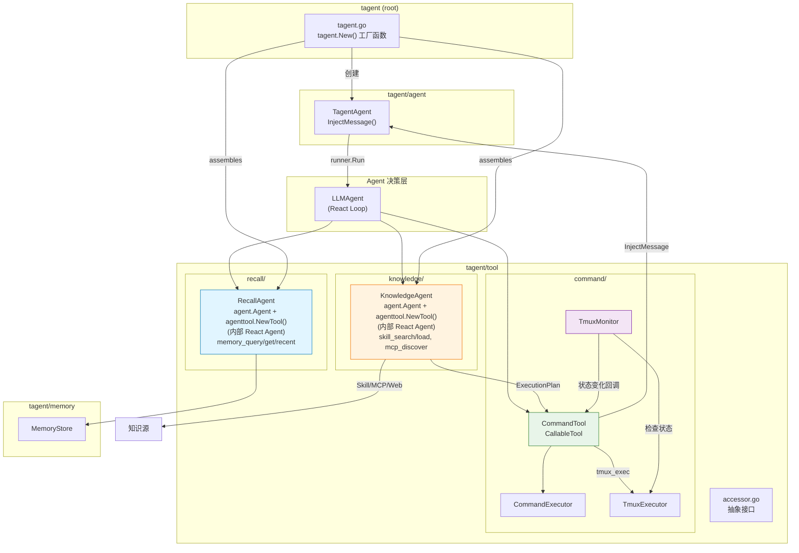
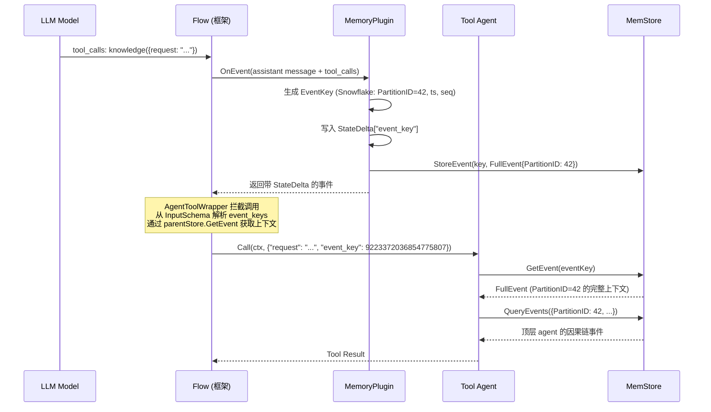
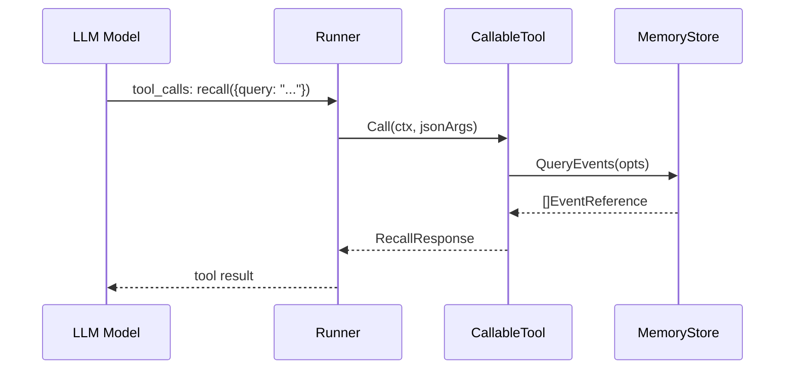
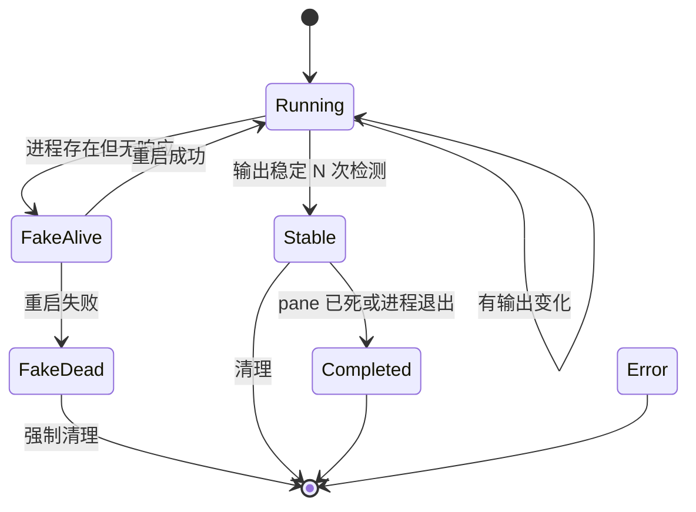
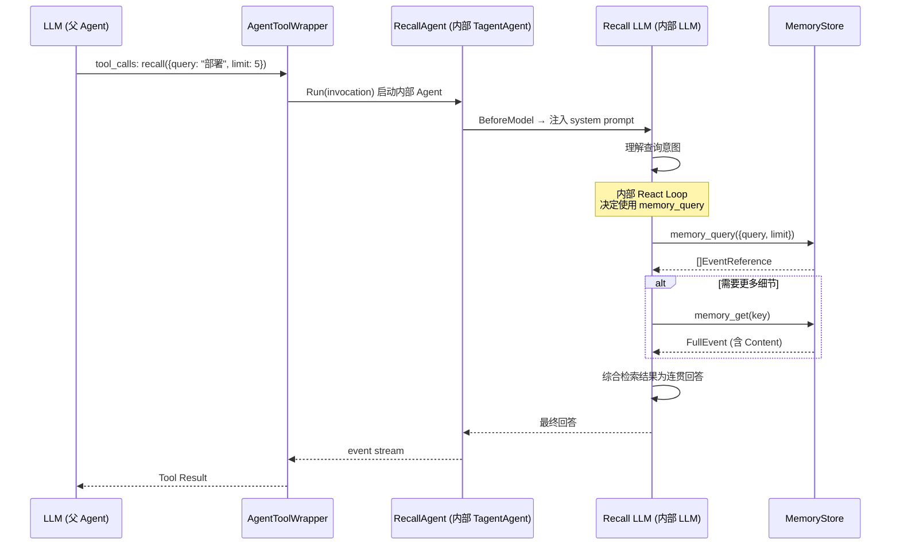
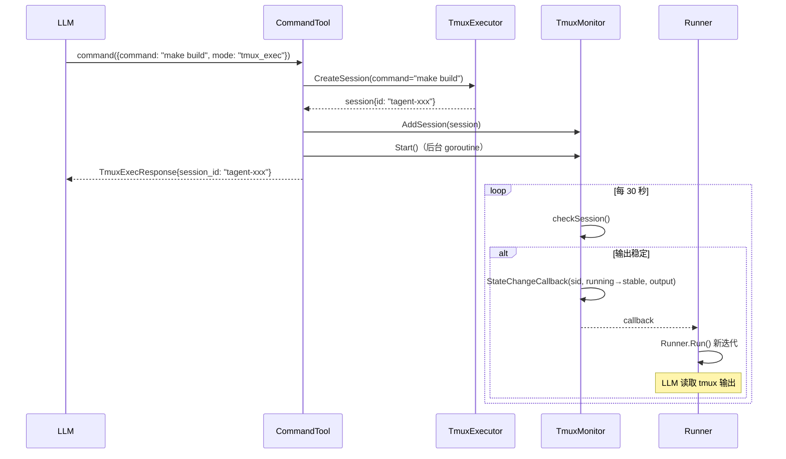

# tagent/tool 模块架构文档

## 一、模块定位

`tagent/tool` 是 tagent 为 trpc-agent-go Runner 提供的一组 **CallableTool 工具实现**，也是 Agent 与外部世界交互的唯一通道。

**核心职责**：
- **KnowledgeAgent**：知识获取与翻译 — 发现/理解/翻译能力（Skill/MCP）为可执行计划，实现为 agent.Agent + agenttool.NewTool() 包装
- **RecallAgent**：智能记忆召回 — 使用内部 LLM React 循环理解查询意图，综合历史事件为连贯回答
- **CommandTool**：命令执行（同步 exec / 异步 tmux_exec），纯执行器，不关心命令来源
- **TmuxMonitor**：后台监控 tmux session 状态，状态变更时触发新的 Agent 迭代

**设计原则**：
- **职责分离**：理解层（KnowledgeAgent, RecallAgent）和执行层（CommandTool）分离，Agent 负责决策
- **架构统一**：KnowledgeAgent 和 RecallAgent 都是 TagentAgent 实例 + agenttool.NewTool() 包装，复用框架能力
- **按需 React**：KnowledgeAgent 和 RecallAgent 有内部 React 循环（多子工具协作 + 翻译）；CommandTool 不需要
- **Prompt 文件化**：System prompt 通过 prompt.Loader 动态加载，支持 PromptConfig bootstrap 风格
- **配置声明式**：所有 tool 通过 Config + ToolConfig 声明，kind 区分 agent/tool，description 支持文件加载
- **事件上下文传递**：tool agent 通过父 agent 的 MemStore + EventKey 获取完整事件上下文；tool 参数声明中必须包含 `event_key`，由 AgentToolWrapper 从调用参数中解析，通过 parentStore.GetEvent 获取完整上下文
- **后台异步**：TmuxMonitor 通过 callback 触发 Agent 迭代，不阻塞主循环
- **包编排**：agent 包不依赖 tool 包，根包 tagent.go 封装 agent 实例化过程
- **CommandTool 闭环**：tmux 状态变更通知通过 MessageInjector 接口闭环在 command 包内，不暴露给外部
- **注册扩展**：agent 包开放 ToolAgentFactory / PlainToolFactory 注册接口，支持自定义 tool 扩展；注册 API 需确保 tool 参数中包含 `event_key` 以支持上下文获取

---

## 二、文件清单

### 2.1 包结构

```
# 根包 (tagent)
├── tagent.go           # New() 工厂函数：声明式 Config + Option 创建 TagentAgent
├── config.go           # Config / ToolConfig / PromptConfig 声明式配置 + LoadConfig
├── builtin.go          # init() 注册内置 tool agent / plain tool factory

# agent 包
├── tagent_agent.go     # TagentAgent 组合根
├── tool_agent.go       # ToolAgentFactory / PlainToolFactory 注册接口
├── context_intervention.go
├── smart_compress.go
└── token_counter.go

# tool 包
tool/
├── accessor.go          # 抽象接口定义
├── command/            # command 子包
│   ├── command_tool.go     # CommandTool 实现 (支持配置化 description)
│   ├── command_executor.go  # 命令执行器
│   ├── tmux_executor.go     # Tmux 执行器
│   ├── tmux_monitor.go      # Tmux 监控器
│   └── command_test.go      # CommandTool 测试
├── recall/              # recall 子包
│   ├── recall_agent.go      # RecallAgent 组装 (支持 PromptConfig + DescriptionFile)
│   └── recall_subtools.go   # 子工具实现
└── knowledge/          # knowledge 子包
    ├── knowledge_agent.go   # KnowledgeAgent 组装 (支持 PromptConfig + DescriptionFile)
    ├── knowledge_subtools.go# 子工具实现
    └── websearch.go         # Web 搜索工具 (HTML scraping)

# prompt 包
prompt/
├── loader.go            # Loader + CompositeConfig (bootstrap 风格 prompt 加载)

# resources/prompts/
├── knowledge_agent.md    # KnowledgeAgent system prompt
├── knowledge_tool_desc.md  # Knowledge tool 描述
├── recall_agent.md      # RecallAgent system prompt
├── recall_tool_desc.md  # Recall tool 描述
├── command_tool_desc.md # Command tool 描述
└── bootstrap/           # 顶层 agent bootstrap prompt 目录
```

### 2.2 详细文件列表

| 文件 | 行数 | 职责 |
|------|------|------|
| `tagent.go` (根) | ~230 | New() 工厂函数：声明式 Config + Option，按 ToolConfig 列表创建 tool |
| `config.go` (根) | ~245 | Config / ToolConfig / PromptConfig + LoadConfig + DefaultConfig + ApplyDefaults + Validate |
| `builtin.go` (根) | ~85 | init() 注册 knowledge/recall/command factory + wrapToolAgent |
| `agent/tool_agent.go` | ~160 | ToolAgentFactory / PlainToolFactory 注册接口 + ToolAgentFactoryConfig |
| `accessor.go` | 33 | 抽象接口定义（MemoryStoreAccessor, SkillRepository） |
| `recall/recall_agent.go` | ~190 | RecallAgent 组装：TagentAgent + 子工具 + PromptConfig + DescriptionFile |
| `recall/recall_subtools.go` | ~340 | RecallAgent 子工具：memory_query, memory_get, memory_recent, memory_trace |
| `knowledge/knowledge_agent.go` | ~145 | KnowledgeAgent 组装：TagentAgent + 子工具 + PromptConfig + DescriptionFile |
| `knowledge/knowledge_subtools.go` | ~368 | KnowledgeAgent 子工具：skill_search, skill_load, mcp_discover, duckduckgo_search, web_search, memory_query |
| `knowledge/websearch.go` | ~560 | Web 搜索工具实现（HTML scraping 方式获取网页内容） |
| `command/command_tool.go` | ~300 | CommandTool：exec / tmux_exec 双模式 + 配置化 description |
| `command/command_executor.go` | ~250 | 命令执行器：安全隔离执行 |
| `command/tmux_monitor.go` | ~330 | Tmux 监控器：后台状态检测 + callback 触发 |
| `command/tmux_executor.go` | ~300 | Tmux 执行器：tmux session 管理 |
| `prompt/loader.go` | ~290 | Loader + CompositeConfig：bootstrap 风格 prompt 加载 |

> **注意**：KnowledgeAgent 和 RecallAgent 的组装层代码在各子包中（tool/knowledge, tool/recall）。
> 根包通过 `tagent.New(cfg, opts...)` 工厂函数封装完整的 agent 实例化过程，
> 按 `Config.Tools` 声明式列表创建并注册所有 tool。

---

## 三、组件关系总览图



---

## 四、事件上下文传递机制（EventKey 注入 + 数据隔离）

### 4.0 核心设计

按照 tagent 的架构设计，顶层 agent 直接送 LLM 的 context 是一条**事件组成的记录流**（由 MemoryPlugin 追踪）。tool 与顶层 agent 交互时，需要依赖顶层 agent 传入的关键 `event_key` 从 MemStore 中获取完整上下文。

**问题**：tool agent 被调用时，LLM 只能传递文本参数（如 `request`），但 tool agent 需要访问触发其调用的完整事件上下文（因果链、完整事件详情），这需要 `event_key`。

**设计决策**：tool 的 Declaration InputSchema 中必须声明 `event_key` 参数，由 AgentToolWrapper 从调用参数中自解析（InputSchema 声明 `event_keys` 参数），通过父级的 MemoryStore 获取上下文。

### 4.1 EventKey Snowflake 设计（已实现）

EventKey 已从字符串格式迁移到 Snowflake int64（详见 [memory-architecture.md](../memory/memory-architecture.md) §4.1）。以下记录迁移前的历史 API 作为参考。

#### 4.1.1 旧版 EventKey（已废弃）

旧版使用 `evt_{timestamp}_{sequence}` 字符串格式：

```go
// 旧版 API（已废弃）
func NewEventKey(timestamp int64, sequence int) string {
    return fmt.Sprintf("evt_%d_%03d", timestamp, sequence)
}
```

存在以下问题（已通过 Snowflake int64 全面解决）：
- 不包含分区信息，无法从 Key 反推数据归属
- 单机时钟依赖，分布式场景可能冲突
- 无法支持按分区查询
- 不适合云原生场景（需要跨实例全局唯一）

#### 4.1.2 Snowflake 风格 EventKey（当前实现）

参考 Snowflake 算法，设计 64-bit 整数 EventKey，编码 PartitionID、时间戳和序列号：

```
┌──────────────────────────────────────────────────────────────────┐
│ 63       53 │ 52            22 │ 21       12 │ 11             0 │
│  PartitionID│   Timestamp      │  Sequence   │   Reserved     │
│  (11 bits)  │   (31 bits)      │  (10 bits)  │   (12 bits)    │
└──────────────────────────────────────────────────────────────────┘
```

| 字段 | 位数 | 说明 |
|------|------|------|
| PartitionID | 11 bits | 存储分区键（0-2047），由 FNV-1a(AgentName) 派生 |
| Timestamp | 31 bits | 秒级时间戳偏移（相对 epoch），可用 ~68 年 |
| Sequence | 10 bits | 同秒内序列号（0-1023），单分区每秒可产生 1024 个事件 |
| Reserved | 12 bits | 预留位，未来可用于分布式 worker ID 或扩展 |

**核心优势**：

1. **Key 内含 PartitionID** → 直接从 EventKey 提取分区归属，无需额外索引
2. **按分区有序** → 同一分区的事件在时间上连续，便于范围查询
3. **全局唯一** → PartitionID + Timestamp + Sequence 组合保证
4. **分布式友好** → Reserved 位可用于 worker ID，支持多实例部署
5. **可排序** → int64 天然支持按时间排序
6. **存储高效** → 8 字节整数 vs 24+ 字符串

```go
// NewSnowflakeEventKey generates a Snowflake-style EventKey.
func NewSnowflakeEventKey(partitionID int, nowMs int64) int64 {
    ts := nowMs/1000 - snowflakeEpoch
    // ... sequence counter per partitionID ...
    return (int64(partitionID&partitionIDMask) << partitionIDShift) |
           ((ts & timestampMask) << timestampShift) |
           (int64(seq&sequenceMask) << sequenceShift)
}

// PartitionIDFromEventKey extracts the PartitionID from an EventKey.
func PartitionIDFromEventKey(key int64) int {
    return int((key >> partitionIDShift) & partitionIDMask)
}

// PartitionIDFromName computes a stable PartitionID from a name string.
// AgentName (framework) → PartitionID (storage), deterministic FNV-1a.
func PartitionIDFromName(name string) int {
    h := fnv.New32a()
    h.Write([]byte(name))
    return int(h.Sum32() & 0x7FF)
}
```

### 4.2 Memory 数据隔离设计

#### 4.2.1 设计原则

**核心原则：Memory 不感知 agent，但从存储角度实现数据隔离。**

- FilterKey 是 trpc-agent-go 框架的概念，属于 LLM context 层面的隔离
- Memory 从**存储分区**角度思考隔离，使用 **PartitionID** 作为分区键（纯整数，纯存储概念）
- 框架已有的 **AgentName**（`agent.Info().Name`）是稳定的 agent 身份标识
- **PartitionID = FNV-1a(AgentName) & 0x7FF**，由 MemoryPlugin 在 tagent 层计算，Memory 层完全不知道 AgentName 的存在
- 三层分离：框架概念（AgentName/FilterKey）→ tagent 层映射 → 存储概念（PartitionID）

```
框架层 (AgentName/FilterKey)     tagent 层 (MemoryPlugin)          Memory 层 (PartitionID)
┌──────────────────────┐      ┌───────────────────────┐      ┌─────────────────┐
│ AgentName = "tagent" │──────→│ FNV-1a("tagent")=42  │──────→│ partition=42    │
│ FilterKey = "tagent" │      │ FNV-1a("knowledge")=85│──────→│ partition=85    │
├──────────────────────┤      │ FNV-1a("recall")=123 │──────→│ partition=123   │
│ AgentName = "know"   │──────→│                       │      │                 │
│ FilterKey = "tagent/ │      │ AgentName → PartitionID│      │ 纯整数分区键    │
│              know-xx"│      │ Memory 不感知 agent   │      │ 无 agent 语义   │
└──────────────────────┘      └───────────────────────┘      └─────────────────┘
  框架身份 + LLM 隔离           身份 → 存储的桥梁             物理存储隔离
```

**关键统一**：不引入独立的 AgentID 概念。AgentName（框架已有）→ PartitionID（存储），
语义一致，零映射表成本。FNV-1a hash 是确定性的，同名字永远映射到同分区。

#### 4.2.2 PartitionID 作为存储分区键

**FullEvent 使用 PartitionID 字段**：

```go
type FullEvent struct {
    EventKey     int64  `json:"event_key"`            // Snowflake int64
    PartitionID  int    `json:"partition_id"`         // 存储分区键
    ParentKey    int64  `json:"parent_key,omitempty"`// 因果链
    EventType    string `json:"event_type"`
    EventSummary string `json:"event_summary"`
    Timestamp    int64  `json:"timestamp"`
    Content      string `json:"content"`
    // ...
}
```

**QueryOptions 使用 PartitionID 过滤**：

```go
type QueryOptions struct {
    PartitionID  int      `json:"partition_id"`   // 按分区键过滤（0=所有）
    PartitionIDs []int    `json:"partition_ids"`  // 多分区键过滤
    EventTypes   []string `json:"event_types"`
    StartTime    int64    `json:"start_time"`
    EndTime      int64    `json:"end_time"`
    Limit        int      `json:"limit"`
    Offset       int      `json:"offset"`
    OrderBy      string   `json:"order_by"`
}
```

#### 4.2.3 存储实现

**InMemoryStore** — 按 PartitionID 分区：

```go
type InMemoryStore struct {
    mu      sync.RWMutex
    events  map[int]map[int64]FullEvent  // PartitionID → EventKey → FullEvent
}
```

**FileBackend** — 按 PartitionID 分目录：

```
data/
├── 42/              ← PartitionID=42 (tagent: FNV-1a("tagent"))
│   ├── 9223372036854775807.json
│   └── 9223372036854775808.json
├── 85/              ← PartitionID=85 (knowledge: FNV-1a("knowledge"))
│   └── ...
└── 123/             ← PartitionID=123 (recall: FNV-1a("recall"))
    └── ...
```

**云原生扩展**：PartitionID 作为分区键天然支持：
- 分布式存储：不同 PartitionID 分片到不同节点
- 多租户隔离：不同用户/租户的 agent 使用不同 PartitionID 段
- 水平扩展：按 PartitionID range 分片，无需跨分片查询

#### 4.2.4 MemoryPlugin 按 PartitionID 维护独立因果链

**当前问题**：`lastEventKey` 全局单例，子 agent 事件打断顶层因果链。

**改进**：按 PartitionID 维护因果链：

```go
type MemoryPlugin struct {
    memStore      memory.MemoryStore
    mu            sync.Mutex
    lastEventKeys map[int]int64  // PartitionID → lastEventKey (独立因果链)
}
```

**因果链隔离效果**：

```
PartitionID=42 (tagent):     E0 → E1 → E2 ──────────────────→ E5
                                                 ↑ 因果链跨越子 agent
PartitionID=85 (knowledge):                     E3 → E4
                                                 ↑ 独立因果链
```

- 顶层 agent 的因果链只包含自身事件（E0→E1→E2→E5）
- 子 agent 有独立因果链（E3→E4）
- tool agent 通过 `event_key` 获取触发事件 E2，通过 E2.ParentKey 追溯顶层因果链

### 4.3 EventKey 注入流程



### 4.4 EventKey 注入机制

**注入位置**：trpc-agent-go Flow 层的 `postprocess` 阶段（tool_call 执行前）。

**注入方式**：
1. MemoryPlugin.OnEvent 处理 assistant 的 tool_call 消息，生成 Snowflake EventKey 并写入 `StateDelta`
2. Flow 在执行 tool_call 时，从当前事件的 `StateDelta` 中提取 `event_key`
3. AgentToolWrapper 从 `event_keys` 参数中解析 EventKey，通过 `parentStore.GetEvent` 获取完整上下文注入到 tool 调用中
4. Tool agent 收到完整的参数（含 `event_key`），可用于查询 MemStore

**Tool Declaration 约束**：
- 所有 tool agent 的 Declaration InputSchema 必须声明 `event_key` 参数（optional）
- 参数描述应说明：由 AgentToolWrapper 自解析，tool agent 通过此 key 从父级 MemStore 获取时间上下文
- 纯执行器 tool（如 CommandTool）可选择不声明此参数

```go
// Declaration 中的 event_key 声明示例
"event_key": {
    Type:        "string",
    Description: "[auto-injected] Snowflake EventKey of the triggering event. Use this to retrieve full context from memory.",
}
```

### 4.5 Tool Agent 使用 EventKey 获取上下文

Tool agent 收到 `event_key` 后，可通过 `MemoryStoreAccessor` 执行以下操作：

| 操作 | 方法 | 用途 |
|------|------|------|
| 获取触发事件详情 | `GetEvent(eventKey)` | 获取完整的 tool_call 事件内容 |
| 提取分区归属 | `PartitionIDFromEventKey(eventKey)` | 从 EventKey 反推 PartitionID |
| 按分区查询 | `QueryEvents({PartitionID: id})` | 查询同分区的事件流 |
| 追溯因果链 | `GetEvent(event.ParentKey)` | 获取前驱事件，理解上下文脉络 |
| 跨分区查询 | `QueryEvents({PartitionIDs: [42, 85]})` | 查询顶层+子 agent 事件（PartitionIDs 由 ReadNamespaces 注入，LLM 无感知） |

> **与 ReadPartitionIDs 的关系**：`event_key` 提供单事件上下文入口，`ReadPartitionIDs` 控制子工具（`memory_query`、`memory_recent`）的跨分区查询范围。两者互补：event_key 精准定位单个事件，ReadPartitionIDs 限定批量查询的分区范围。详见 §六 和 [agent-architecture.md](../agent/agent-architecture.md) §12.5.8。

---

## 五、工具的 trpc-agent-go 集成

### 5.1 CallableTool 接口

所有 tagent 工具都实现了 `trpc-agent-go/tool.CallableTool` 接口（编译时断言）：

```go
// recall/recall_agent.go
var _ tool.CallableTool = (*RecallTool)(nil)

// command/command_tool.go
var _ tool.CallableTool = (*CommandTool)(nil)
```

KnowledgeAgent 不再是 CallableTool，而是通过 `agenttool.NewTool()` 包装（组装在 tool/knowledge 子包）：

```go
// tagent.go
func NewKnowledgeTool(cfg KnowledgeAgentConfig) (tagenttool.Tool, error) {
    knowledgeAgent, err := NewKnowledgeAgent(cfg)
    if err != nil {
        return nil, err
    }

    return agenttool.NewTool(knowledgeAgent,
        agenttool.WithDescription("Knowledge acquisition and translation tool..."),
    ), nil
}
```

接口定义（`trpc-agent-go/tool`）：

```go
type CallableTool interface {
    Declaration() *Declaration   // 返回工具声明（名称、描述、参数 Schema）
    Call(ctx context.Context, jsonArgs []byte) (any, error)  // 执行工具
}
```

### 5.2 工具注册到 Runner

在 `tagent.New()` 中通过 `agent.TagentConfig.Tools` 注册。工厂函数封装了完整的实例化过程：

```go
// tagent.go (root package) — tagent.New() 工厂函数
ta, err := tagent.New(tagent.Config{
    Model:       model,
    PromptDir:   "resources/prompts",
})
// 返回已绑定 knowledge/recall/command 三个 core tool 的 *agent.TagentAgent
```

### 5.3 工具调用流程



---

## 六、RecallAgent — 智能记忆召回

### 6.1 核心职责

**智能记忆召回** — RecallAgent 是 Agent 查询内部知识的窗口。它使用内部 LLM React 循环理解查询意图，综合历史事件为连贯回答。

**设计决策**：RecallAgent 使用 TagentAgent + agenttool.NewTool() 包装架构（与 KnowledgeAgent 统一），而非简单的 CallableTool。理由：需要 LLM 理解查询意图、综合多个子工具结果、提供结构化的记忆摘要。

### 6.2 配置结构

```go
// recall/recall_agent.go:25-46
type Config struct {
    Model           model.Model                // 必填：内部 React 循环的 LLM 模型
    MemStore        tagentpkg.MemoryStoreAccessor // 必填：记忆存储访问器
    ReadPartitionIDs []int                     // 可选：跨命名空间读权限，由 buildAgent() 从 ReadNamespaces 注入
    PromptDir       string                     // 可选：prompt 文件目录（默认 "resources/prompts"）
    Prompt          PromptConfig               // 可选：覆盖默认 prompt 加载
    Description     string                     // 可选：tool 描述（覆盖默认）
    DescriptionFile string                     // 可选：从文件加载描述
    MaxToolIterations int                      // 默认：5
    MaxTokens         int                      // 默认：4096
}
```

### 6.3 工厂函数

```go
// recall/recall_agent.go:51-95
func NewAgent(cfg Config) (*agent.TagentAgent, error)
```

创建 TagentAgent 实例，通过 `buildRecallSubTools(accessor, cfg.ReadPartitionIDs)` 组装以下子工具：
- `memory_query`：按查询条件检索事件列表，支持时间范围过滤（`since`/`until`），自动注入 `ReadPartitionIDs`
- `memory_get`：根据 event_key 获取完整事件详情，支持 `include_parent` 参数自动包含父事件摘要
- `memory_recent`：快速获取最近的 N 条事件，支持时间范围过滤（`since`/`until`），自动注入 `ReadPartitionIDs`
- `memory_trace`：沿 ParentKey 因果链回溯，从指定事件追溯最多 20 步历史

> **自动注入机制**：`memory_query` 和 `memory_recent` 的 handler 内部自动将配置的 `ReadPartitionIDs` 注入到 `QueryOptions.PartitionIDs`。LLM 调用时只需传语义参数（如 `{query: "部署"}`），无需感知分区号。`ReadPartitionIDs` 由 `buildAgent()` 从 `MemoryConfig.ReadNamespaces` 解析而来，经 `ToolAgentFactoryConfig` → `recall.Config` → `buildRecallSubTools` 链路传递。详见 [agent-architecture.md](../agent/agent-architecture.md) §12.5.8。

### 6.4 Tool 包装

```go
// recall/recall_agent.go:121-135
func NewTool(cfg Config) (tagenttool.Tool, error)
```

使用 `agent.NewAgentToolWrapper()` 包装 TagentAgent 为 CallableTool，注册到父 Agent。

---

## 七、KnowledgeAgent — 知识获取与翻译

### 7.1 核心职责

KnowledgeAgent 发现和加载外部技能文件（skills 目录中的 .md 等文件），并将能力描述翻译为 ExecutionPlan。

**设计原则**：
- **理解层，非执行层**：KnowledgeAgent 负责"理解"技能（搜索和加载内容），执行由 CommandTool 负责
- **架构统一**：TagentAgent 实例 + agenttool.NewTool() 包装，复用框架的 React 循环、事件收集、Session 管理
- **Skill 和 MCP 统一为"capabilities"**：统一为 skills 文件系统管理
- **Prompt 文件化**：通过 prompt.Loader 加载 resources/prompts/knowledge_agent.md
- **组装在子包**：KnowledgeAgent 和 RecallAgent 的组装代码在各自的子包中（tool/knowledge, tool/recall），根包 tagent.go 只负责工厂函数

### 7.2 工厂函数（tagent.go — 根包）

`tagent.New()` 封装了完整的 agent 实例化过程：

```go
// tagent.go (root package)
func New(cfg Config) (*agent.TagentAgent, error) {
    // 1. Create KnowledgeTool
    // 2. Create RecallTool
    // 3. Create CommandTool
    // 4. Create main TagentAgent with all three tools
    // 5. Wire CommandTool's tmux notifications via MessageInjector
}
```

使用者只需调用 `tagent.New()` 即可获得一个完整的 agent 实例，无需了解内部 tool 的组装细节。

### 7.3 子工具（tool/knowledge/knowledge_subtools.go）

| 子工具 | 工厂函数 | 说明 |
|--------|---------|------|
| `skill_search` | `NewSkillSearchTool(repo)` | 搜索本地技能库 |
| `skill_load` | `NewSkillLoadTool(repo)` | 加载技能完整内容（含执行指令） |
| `mcp_discover` | `NewMCPDiscoverTool(toolSets)` | 发现 MCP 工具 |
| `duckduckgo_search` | `duckduckgo.NewTool()` | 搜索事实性知识（Instant Answer API） |
| `web_search` | `NewWebSearchTool()` | 搜索通用网页内容（HTML scraping） |
| `memory_query` | `NewMemoryQueryTool(accessor)` | 查询历史知识记录 |

### 7.4 Prompt 文件化

System prompt 存储在 `resources/prompts/knowledge_agent.md`：
- 通过 `prompt.Loader` 动态加载
- 包含工具使用指南、exec-plan 规范、执行原则
- 支持运行时更新，消除硬编码 prompt 常量

---

## 八、CommandTool — 命令执行

### 8.1 双模式设计

CommandTool 支持两种执行模式：

| 模式 | 执行方式 | 返回时机 | 适用场景 |
|------|---------|---------|---------|
| `exec` | 同步，等待命令完成 | 命令结束 | 短期命令（< 60s） |
| `tmux_exec` | 异步，立即返回 session ID | 立即返回 | 长期交互命令 |

### 8.2 CommandTool 的组合结构

```go
// command/command_tool.go:25-36
type CommandTool struct {
    workspace    string
    runAsUser    string
    runAsGroup   string
    executor     *CommandExecutor   // 同步执行器
    tmuxExecutor *TmuxExecutor      // tmux 执行器
    tmuxMonitor  *TmuxMonitor        // tmux 监控器

    // TmuxMonitor 状态变化时的回调
    // TagentAgent 设置为调用 Runner.Run() 触发新迭代
    onStateChange func(sessionID, oldStatus, newStatus, output string)
}
```

### 8.3 exec 模式 — 同步执行

```go
// command/command_tool.go:162-190
func (ct *CommandTool) executeSync(ctx context.Context, args CommandArgs) (any, error) {
    spec := CommandSpec{
        Command:    "sh",
        Args:       []string{"-c", args.Command},
        Env:        args.Env,
        Dir:        args.WorkDir,
        Workspace:  ct.workspace,
        Timeout:    time.Duration(args.Timeout) * time.Second,
        RunAsUser:  ct.runAsUser,
        RunAsGroup: ct.runAsGroup,
    }

    result, err := ct.executor.Execute(ctx, spec)
    return &CommandExecResult{
        ExitCode: result.ExitCode,
        Stdout:   result.Stdout,
        Stderr:   result.Stderr,
    }, nil
}
```

### 8.4 tmux_exec 模式 — 异步执行

```go
// command/command_tool.go:192-229
func (ct *CommandTool) executeAsync(ctx context.Context, args CommandArgs) (any, error) {
    // Step 1: 创建 tmux session
    session, err := ct.tmuxExecutor.CreateSession(ctx, TmuxCreateOptions{
        Command: args.Command,
        WorkDir: args.WorkDir,
        Env:     args.Env,
    })

    // Step 2: 注册到 TmuxMonitor
    if ct.tmuxMonitor != nil {
        ct.tmuxMonitor.AddSession(&TmuxSession{
            ID: session.ID, ...
        })
        if !ct.tmuxMonitor.running {
            ct.tmuxMonitor.Start()  // 启动后台监控循环
        }
    }

    // Step 3: 立即返回 session ID
    return &TmuxExecResponse{
        SessionID: session.ID,
        Status:    "running",
    }, nil
}
```

### 8.5 CommandTool 的 MessageInjector 机制

CommandTool 通过 `MessageInjector` 接口闭环处理 tmux 状态变更通知，
不需要外部（如 tagent.go）参与格式化和注入逻辑：

```go
// command/command_tool.go

// MessageInjector injects a system message to trigger agent re-evaluation.
type MessageInjector interface {
    InjectMessage(msg model.Message)
}

func (ct *CommandTool) handleStateChange(sessionID, oldStatus, newStatus, output string) {
    if ct.injector == nil {
        return
    }
    // Build and format the state change message internally
    content := fmt.Sprintf("[system] tmux session %s state changed: %s -> %s", ...)
    if output != "" {
        // Truncate long output - keep the tail (last 2000 chars)
        if len(output) > 2000 {
            output = "...(truncated)" + output[len(output)-2000:]
        }
        content += fmt.Sprintf("\nOutput:\n%s", output)
    }
    ct.injector.InjectMessage(model.Message{Role: model.RoleSystem, Content: content})
}
```

`TagentAgent` 天然实现了 `MessageInjector` 接口（有 `InjectMessage(msg model.Message)` 方法），
因此在 `tagent.New()` 中只需 `cmdTool.SetMessageInjector(ta)` 即可完成接线。

---

## 九、CommandExecutor — 安全命令执行

### 9.1 Execute 流程

```go
// command/command_executor.go:86-154
func (ce *CommandExecutor) Execute(ctx context.Context, spec CommandSpec) (CommandResult, error) {
    // Step 1: 通过 context 设置 timeout
    if timeout > 0 {
        ctx, cancel = context.WithTimeout(ctx, timeout)
        defer cancel()
    }

    // Step 2: 构建命令（用户隔离）
    cmd := ce.buildCommand(spec)

    // Step 3: 启动并等待
    cmd.Start()
    doneCh := make(chan error, 1)
    go func() { doneCh <- cmd.Wait() }()

    select {
    case err = <-doneCh:
        // 正常结束
    case <-ctx.Done():
        // Timeout：杀死整个进程组
        syscall.Kill(-cmd.Process.Pid, syscall.SIGKILL)
    }

    return CommandResult{ExitCode, Stdout, Stderr, Duration}, nil
}
```

### 9.2 buildCommand — 用户隔离

```go
// command/command_executor.go:156-213
func (ce *CommandExecutor) buildCommand(spec CommandSpec) (*exec.Cmd, error) {
    if spec.RunAsUser != "" {
        // 使用 sudo -u runAsUser 执行
        args := []string{"-n", "-u", spec.RunAsUser}
        if spec.RunAsGroup != "" {
            args = append(args, "-g", spec.RunAsGroup)
        }
        args = append(args, spec.Command)
        args = append(args, spec.Args...)
        cmd = exec.Command("sudo", args...)
    } else {
        cmd = exec.Command(spec.Command, spec.Args...)
    }

    // 设置工作目录
    cmd.Dir = spec.Dir || spec.Workspace || ce.workspace

    // 设置进程组（用于清理）
    cmd.SysProcAttr = &syscall.SysProcAttr{Setpgid: true}

    return cmd, nil
}
```

**安全隔离**：通过 `sudo -u` 实现用户隔离，通过 `Setpgid` 实现进程组管理（超时清理）。

---

## 十、TmuxMonitor — 状态监控

### 10.1 监控状态机



### 10.2 状态常量

```go
// command/tmux_executor.go:72-81
const (
    SessionRunning   SessionStatus = "running"    // 正在运行
    SessionStable    SessionStatus = "stable"     // 输出稳定（适合读取）
    SessionCompleted SessionStatus = "completed"  // 已完成
    SessionError     SessionStatus = "error"      // 错误
    SessionFakeDead  SessionStatus = "fake_dead" // 假死（进程存在但无响应）
    SessionFakeAlive SessionStatus = "fake_alive" // 假活（无输出但进程存活）
)
```

### 10.3 detectSessionState — 状态检测逻辑

```go
// command/tmux_monitor.go:227-292
func (tm *TmuxMonitor) detectSessionState(session *TmuxSession) SessionStatus {
    // Step 1: 检查进程和 pane 状态
    processExists := tm.executor.ProcessExists(session.ID)
    isPaneDead := tm.executor.IsPaneDead(session.ID)

    // Step 2: 检查输出是否变化（MD5 对比）
    currentMD5 := md5.Sum([]byte(currentOutput))

    if processExists && !isPaneDead {
        if currentMD5 == session.LastOutputMD5 {
            session.StableCount++
            // 超过 fakeDeadThreshold 且心跳无响应 → fake_dead
            // 超过 fakeDeadThreshold 但心跳响应 → fake_alive
        } else {
            session.StableCount = 0  // 有输出变化，重置稳定计数
        }
    }

    // Step 3: 判断最终状态
    if !processExists || isPaneDead {
        return SessionCompleted
    }
    if session.StableCount >= threshold {
        return SessionStable
    }
    return SessionRunning
}
```

### 10.4 FakeAlive / FakeDead 处理

| 状态 | 触发条件 | 处理方式 |
|------|---------|---------|
| `fake_alive` | 进程存在、pane 存活、输出稳定超过阈值，但心跳有响应 | 重启 session |
| `fake_dead` | 进程存在、pane 存活、输出稳定超过阈值，心跳也无响应 | 强制 kill session |

**场景**：长时间运行的构建命令，进程存在但不产生新输出——此时需要通过心跳检测判断是"真的还在运行"还是"假死了"。

### 10.5 配置参数

```go
// command/tmux_monitor.go:43-52
func DefaultMonitorConfig() MonitorConfig {
    return MonitorConfig{
        Interval:             30 * time.Second,  // 检测间隔
        StableThreshold:      2,                // 普通命令稳定阈值
        InteractiveThreshold: 3,                // 交互命令稳定阈值
        FakeDeadThreshold:    5,                // fake 检测阈值
        HeartbeatCommand:    "echo ping",
        HeartbeatTimeout:     5 * time.Second,
    }
}
```

---

## 十一、TmuxExecutor — Tmux Session 管理

### 11.1 核心操作

| 方法 | 说明 |
|------|------|
| `CreateSession(opts)` | 创建 detached tmux session |
| `KillSession(id)` | 终止 session |
| `SessionExists(id)` | 检查 session 是否存在 |
| `GetSessionOutput(id)` | 捕获 pane 内容 |
| `IsPaneDead(id)` | 检查 pane 是否已死 |
| `ProcessExists(id)` | 检查主进程是否存活（通过 kill -0） |
| `SendHeartbeat(id)` | 发送心跳检测进程响应 |
| `RestartSession(id, opts)` | 重启 session |
| `SendKeys(id, keys)` | 向 session 发送按键（交互） |

### 11.2 Session 唯一命名

```go
// command/tmux_executor.go:92-94
func (te *TmuxExecutor) CreateSession(...) (*TmuxSession, error) {
    sessionName := fmt.Sprintf("%s-%d", te.prefix, time.Now().UnixNano())
    // prefix 默认值："tagent"
    // 示例：tagent-1712000001000000000
}
```

通过纳秒时间戳保证 session 名称唯一。

---

## 十二、完整数据流

### 12.1 RecallTool 完整数据流



### 12.2 CommandTool tmux_exec 完整数据流



---

## 十三、关键设计决策

### 13.1 为什么 RecallAgent 和 KnowledgeAgent 都需要内部 LLM React 循环？

**设计决策**：RecallAgent 和 KnowledgeAgent 都使用 TagentAgent + AgentToolWrapper 包装架构，而非简单的 CallableTool。

| 工具 | 内部 React | 实现方式 | 理由 |
|------|-----------|---------|------|
| **RecallAgent** | ✅ 需要 | agent.Agent + AgentToolWrapper | 4 种子工具协作（memory_query, memory_get, memory_recent, memory_trace），需要 LLM 理解查询意图、综合多个子工具结果、提供结构化的记忆摘要 |
| **KnowledgeAgent** | ✅ 需要 | agent.Agent + AgentToolWrapper | 6 种子工具协作（skill_search, skill_load, mcp_discover, duckduckgo_search, web_search, memory_query），LLM 翻译能力为 ExecutionPlan |
| **CommandTool** | ❌ 不需要 | CallableTool | 纯执行器，无决策需求；tmux 通知通过 MessageInjector 接口闭环 |

判断标准：需要"思考-行动-观察"循环（多子工具协作、语义理解、结果综合） → TagentAgent + AgentToolWrapper；单一功能/执行器 → 简单 CallableTool。

**架构统一性**：RecallAgent 和 KnowledgeAgent 共享相同的三层结构：
```
Config → NewAgent() → TagentAgent (内部 LLM React) → 子工具集
                           ↓
                    AgentToolWrapper (对外表现为 CallableTool)
```

来源：trpcclaw 经过实践验证的分类决策。

### 13.2 为什么 KnowledgeAgent 和 RecallAgent 组装代码放在子包？

**包结构清晰**：KnowledgeAgent 和 RecallAgent 的组装代码（`NewAgent`、`NewTool`）在各自的子包中
（`tool/knowledge`、`tool/recall`），与子工具代码放在一起，内聚性强。

根包 tagent.go 只负责 `tagent.New()` 工厂函数，将三个 core tool 绑定到 agent 实例上。

```
tagent (根) → agent      ← tagent.New() 创建 TagentAgent
tagent (根) → tool/command  ← 创建 CommandTool
tagent (根) → tool/recall   ← 创建 RecallTool
tagent (根) → tool/knowledge← 创建 KnowledgeTool
tagent (根) → prompt       ← 子包各自加载 prompt

agent → plugin → memory   ← agent 不依赖 tool
tool/command → memory     ← command 不依赖 agent
tool/recall → memory      ← recall 不依赖 agent（通过 accessor 接口）
tool/knowledge → memory   ← knowledge 不依赖 agent
```

CommandTool 的 tmux 通知通过 `MessageInjector` 接口闭环在 command 包内，
`TagentAgent` 天然实现该接口，在 `tagent.New()` 中通过 `SetMessageInjector(ta)` 完成接线。

### 13.3 为什么 tool 参数必须包含 event_key？

**设计决策**：所有 tool agent 的 Declaration InputSchema 必须声明 `event_key` 参数，由 AgentToolWrapper 在调用时从参数中自动解析。

| 对比项 | 无 event_key（当前） | 有 event_key（目标） |
|--------|---------------------|---------------------|
| **上下文获取** | 只能依赖 LLM 传的文本 | 可从 MemStore 获取完整事件上下文 |
| **因果链追溯** | 无法追溯 | 通过 ParentKey 追溯事件脉络 |
| **LLM 依赖** | 完全依赖 LLM 传参 | AgentToolWrapper 自动解析，LLM 无需感知 |
| **扩展性** | 新 tool 需自行设计上下文获取 | 统一机制，新 tool 自动获得上下文 |

**选型理由**：
- 顶层 agent 的 LLM context 是事件记录流，tool 被调用时需要知道在流中的位置
- `event_key` 由 MemoryPlugin 生成，LLM 无法感知其值，必须框架注入
- tool agent 通过 `event_key` 可获取：触发事件详情、因果链前驱事件、同时间段相关事件
- 纯执行器 tool（如 CommandTool）可豁免，但 tool agent（如 KnowledgeAgent、RecallAgent）必须声明

**注入时机**：
1. LLM 生成 tool_call → 成为 assistant 事件
2. MemoryPlugin.OnEvent 处理该事件，生成 `event_key` 并写入 StateDelta
3. Flow 执行 tool_call 前，从 StateDelta 提取 `event_key`
4. Flow 将 `event_key` 合并到 tool 的 JSON 参数中
5. Tool agent 在 Call 方法中解析 `event_key`，用于查询 MemStore

### 13.4 为什么 TmuxMonitor 用 callback 而不是 channel？

**决策**：callback 让 TagentAgent 完全控制如何触发新迭代（通过 `Runner.Run()`）。

| 方案 | 优点 | 缺点 |
|------|------|------|
| **callback（tagent 选型）** | TagentAgent 完全控制触发逻辑 | 调用方需保存引用 |
| channel | 解耦更彻底 | 需要额外的 goroutine 消费 channel |

TagentAgent 需要在 callback 中注入 `RoleSystem` 消息并调用 `Runner.Run()`，使用 callback 比 channel 更直接。
