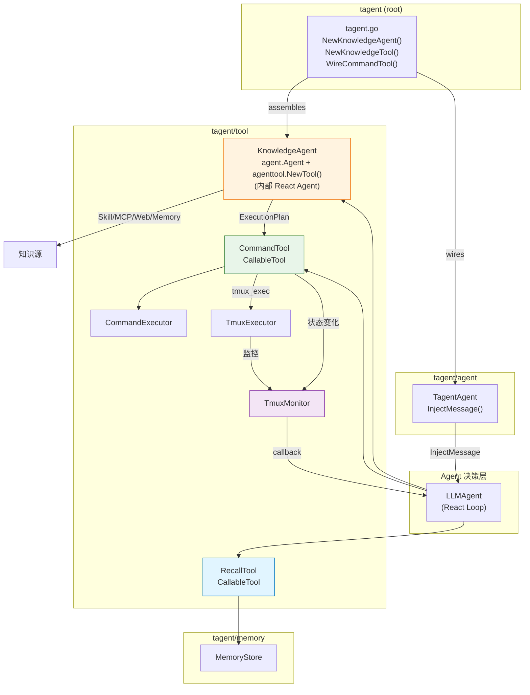
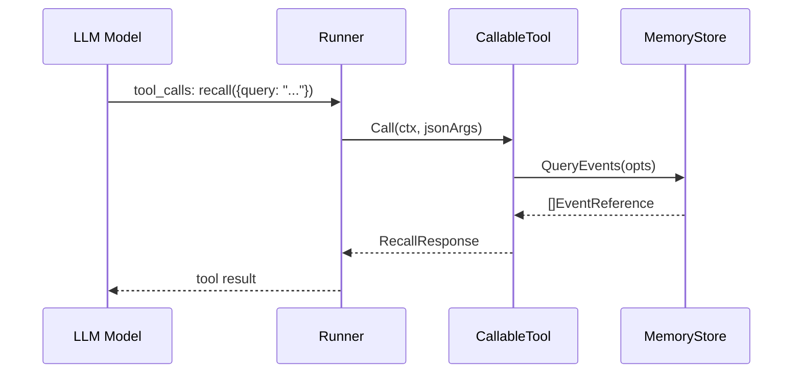
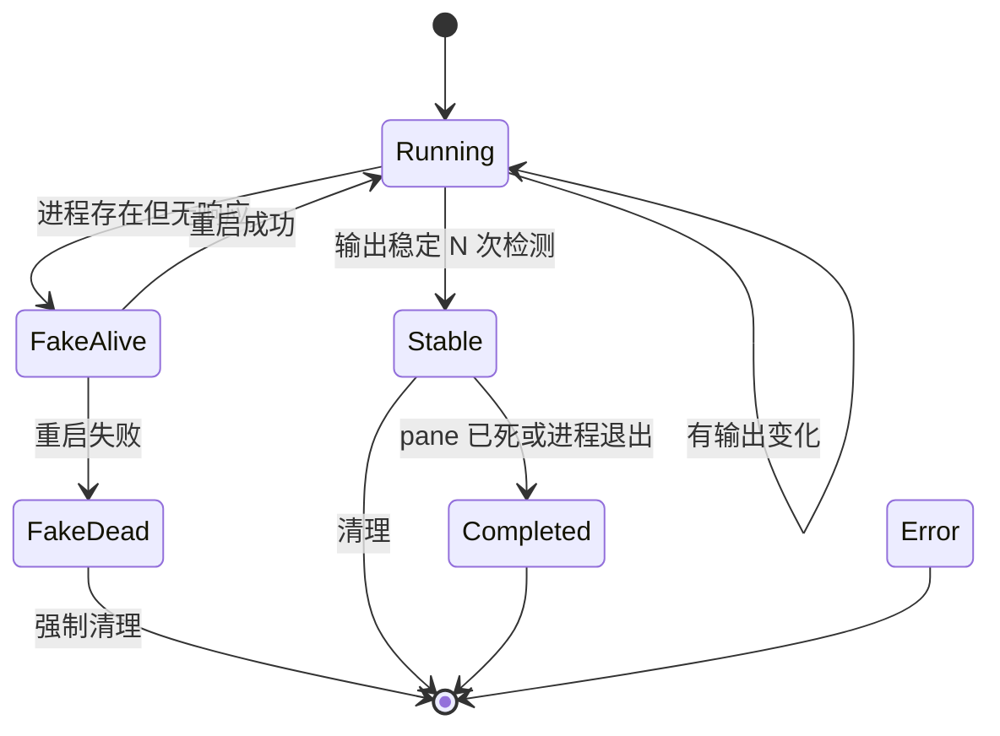
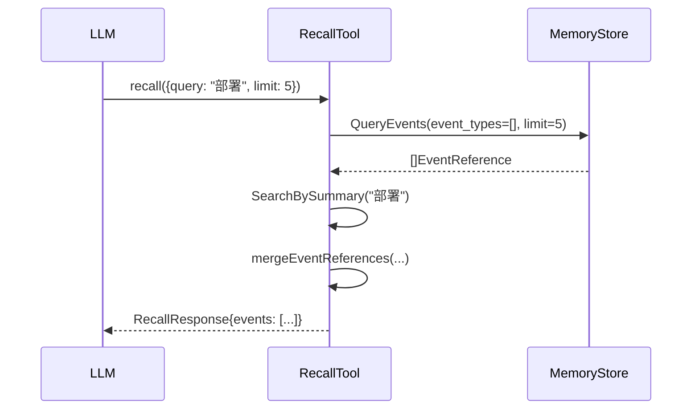
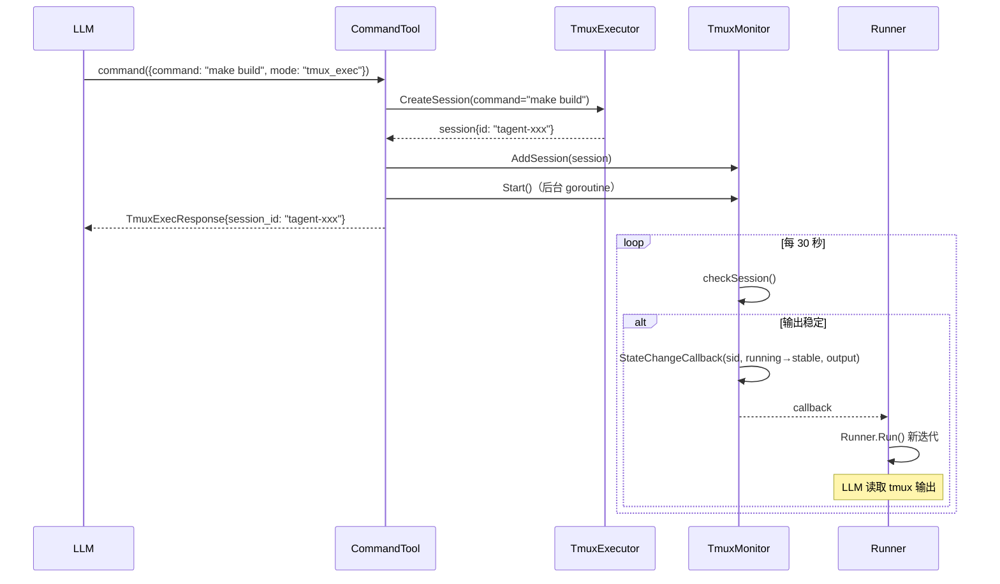

# tagent/tool 模块架构文档

## 一、模块定位

`tagent/tool` 是 tagent 为 trpc-agent-go Runner 提供的一组 **CallableTool 工具实现**，也是 Agent 与外部世界交互的唯一通道。

**核心职责**：
- **RecallTool**：智能记忆召回 — 查询历史事件、获取事件详情，提供对内部知识的结构化访问
- **KnowledgeAgent**：知识获取与翻译 — 发现/理解/翻译能力（Skill/MCP）为可执行计划，实现为 agent.Agent + agenttool.NewTool() 包装（组装代码在根包 tagent.go）
- **CommandTool**：命令执行（同步 exec / 异步 tmux_exec），纯执行器，不关心命令来源
- **TmuxMonitor**：后台监控 tmux session 状态，状态变更时触发新的 Agent 迭代

**设计原则**：
- **职责分离**：理解层（KnowledgeAgent）和执行层（CommandTool）分离，Agent 负责决策
- **架构统一**：KnowledgeAgent 是 TagentAgent 实例 + agenttool.NewTool() 包装，复用框架能力
- **按需 React**：KnowledgeAgent 有内部 React 循环（多子工具协作 + 翻译）；RecallTool 和 CommandTool 不需要
- **Prompt 文件化**：System prompt 通过 prompt.Loader 动态加载，消除硬编码常量
- **后台异步**：TmuxMonitor 通过 callback 触发 Agent 迭代，不阻塞主循环
- **包编排**：agent 包不依赖 tool 包，根包 tagent.go 负责跨包组装

---

## 二、文件清单

| 文件 | 行数 | 职责 |
|------|------|------|
| `recall_tool.go` | 192 | 记忆召回：查询历史事件、获取事件详情 |
| `subtools.go` | ~200 | 独立子工具工厂函数：NewSkillSearchTool, NewSkillLoadTool, NewMCPDiscoverTool, NewMemoryQueryTool |
| `command_tool.go` | 268 | 命令执行：exec / tmux_exec 双模式 |
| `command_executor.go` | 248 | 命令执行器：安全隔离执行 |
| `tmux_monitor.go` | 332 | Tmux 监控器：后台状态检测 + callback 触发 |
| `tmux_executor.go` | 298 | Tmux 执行器：tmux session 管理 |
| `tool_test.go` | 50.1KB | 单元测试 |

> **注意**：KnowledgeAgent 的组装层代码在根包 `tagent.go`（~200 行），不在 tool 包中。
> 这是因为组装代码需要同时 import agent 和 tool 包，放在任何子包都会导致循环依赖。
> 根包是唯一能看到所有子包的位置。

---

## 三、组件关系总览图



---

## 四、工具的 trpc-agent-go 集成

### 4.1 CallableTool 接口

所有 tagent 工具都实现了 `trpc-agent-go/tool.CallableTool` 接口（编译时断言）：

```go
// recall_tool.go:15-16
var _ tool.CallableTool = (*RecallTool)(nil)

// command_tool.go:13-14
var _ tool.CallableTool = (*CommandTool)(nil)
```

KnowledgeAgent 不再是 CallableTool，而是通过 `agenttool.NewTool()` 包装（组装在根包 tagent.go）：

```go
// tagent.go
func NewKnowledgeTool(cfg KnowledgeAgentConfig) (tagenttool.Tool, error) {
    knowledgeAgent, err := NewKnowledgeAgent(cfg)
    if err != nil {
        return nil, err
    }

    return agenttool.NewTool(knowledgeAgent,
        agenttool.WithDescription("Knowledge acquisition and translation tool..."),
    ), nil
}
```

接口定义（`trpc-agent-go/tool`）：

```go
type CallableTool interface {
    Declaration() *Declaration   // 返回工具声明（名称、描述、参数 Schema）
    Call(ctx context.Context, jsonArgs []byte) (any, error)  // 执行工具
}
```

### 4.2 工具注册到 Runner

在 `NewTagentAgent` 中通过 `runner.WithTools()` 注册。注意 KnowledgeTool 的创建在根包完成：

```go
// tagent.go (root package)
knowledgeTool, _ := tagent.NewKnowledgeTool(tagent.KnowledgeAgentConfig{
    Model:     model,
    SkillRepo: skillRepo,
    MemStore:  memStore,
})

mainAgent, _ := agent.NewTagentAgent(&agent.TagentConfig{
    Tools: []tool.Tool{
        knowledgeTool,
        tagenttool.NewRecallTool(...),
        tagenttool.NewCommandTool(...),
    },
})

// Wire tmux state change callback
Tagent.WireCommandTool(mainAgent, commandTool)
```

### 4.3 工具调用流程



---

## 五、RecallTool — 智能记忆召回

### 5.1 抽象职责

**智能记忆召回** — RecallTool 是 Agent 查询内部知识的窗口。
它提供对 MemoryStore 的结构化访问，但不对结果做智能解读。
解读是顶层 Agent 的职责。

**设计决策**（来自 trpcclaw 验证）：RecallTool 不需要内部 React 循环。
理由：功能单一（查询/获取事件），无多工具协作需求，“理解”结果是顶层 Agent 的工作。

### 5.2 Declaration

```go
// recall_tool.go:47-77
func (rt *RecallTool) Declaration() *tool.Declaration {
    return &tool.Declaration{
        Name:        "recall",
        Description: "Search and retrieve relevant memories from past interactions.",
        InputSchema: &tool.Schema{
            Type: "object",
            Properties: map[string]*tool.Schema{
                "query": {
                    Type:        "string",
                    Description: "Search query (keywords or natural language)",
                },
                "event_types": {
                    Type:        "array",
                    Description: "Filter by event types",
                },
                "limit": {
                    Type:        "integer",
                    Description: "Maximum results (default: 10)",
                },
                "event_key": {
                    Type:        "string",
                    Description: "Get a specific event by key (returns full details)",
                },
            },
            Required: []string{"query"},
        },
    }
}
```

### 5.3 Call — 双路径

```go
// recall_tool.go:79-97
func (rt *RecallTool) Call(ctx context.Context, jsonArgs []byte) (any, error) {
    var args RecallArgs
    if err := json.Unmarshal(jsonArgs, &args); err != nil {
        return nil, fmt.Errorf("recall: invalid args: %w", err)
    }

    // 路径 1: 指定 event_key → 获取完整事件详情
    if args.EventKey != "" {
        return rt.getEventDetails(args.EventKey)
    }

    // 路径 2: 关键词/过滤查询
    return rt.queryEvents(args)
}
```

### 5.4 queryEvents — 多层查询

```go
// recall_tool.go:121-159
func (rt *RecallTool) queryEvents(args RecallArgs) (any, error) {
    // Step 1: 按 event_types + limit 查询（使用 MemoryStore.QueryEvents）
    opts := memory.QueryOptions{
        EventTypes: args.EventTypes,
        Limit:      limit,
        OrderBy:    "timestamp_desc",  // 最新优先
    }
    events, err := rt.memStore.QueryEvents(opts)

    // Step 2: 如果是无过滤的关键词查询，
    // 尝试使用 SearchBySummary 做摘要全文搜索
    if args.Query != "" && len(args.EventTypes) == 0 {
        if searcher, ok := rt.memStore.(interface {
            SearchBySummary(string) []memory.EventReference
        }); ok {
            searchResults := searcher.SearchBySummary(args.Query)
            events = mergeEventReferences(events, searchResults, limit)
        }
    }

    return &RecallResponse{
        Events:  convertToRecallEvents(events),
        Message: fmt.Sprintf("找到 %d 个相关事件", len(events)),
    }, nil
}
```

**注意**：`SearchBySummary` 全文搜索仅在 `InMemoryStore`（实现了该接口）上生效。`FileBackend` 不实现该接口，会跳过全文搜索步骤。

### 5.5 mergeEventReferences — 结果合并去重

```go
// recall_tool.go:161-181
func mergeEventReferences(a, b []memory.EventReference, limit int) []memory.EventReference {
    seen := make(map[string]bool)
    var result []memory.EventReference
    // 先加入 QueryEvents 结果
    for _, ref := range a {
        if !seen[ref.EventKey] {
            seen[ref.EventKey] = true
            result = append(result, ref)
        }
    }
    // 再加入 SearchBySummary 结果（去重）
    for _, ref := range b {
        if !seen[ref.EventKey] {
            seen[ref.EventKey] = true
            result = append(result, ref)
        }
    }
    if limit > 0 && len(result) > limit {
        result = result[:limit]
    }
    return result
}
```

### 5.6 停用词过滤

```go
// recall_tool.go:196-224
func extractKeywords(query string) []string {
    var keywords []string
    for _, part := range strings.Fields(query) {
        // 过滤长度 < 2 和停用词
        if len(part) >= 2 && !stopWords[strings.ToLower(part)] {
            keywords = append(keywords, strings.ToLower(part))
        }
    }
    return keywords
}
```

停用词包含中英文常见虚词（"的"、"了"、"the"、"is" 等），避免干扰搜索。

### 5.7 返回数据结构

```go
// recall_tool.go:249-258
type RecallEventDetail struct {
    Key       string           // EventKey
    ParentKey string           // 因果链父 key
    Type      string           // EventType
    Summary   string           // EventSummary
    Content   string           // 原始内容
    ToolCalls []model.ToolCall // 工具调用
    Timestamp int64            // 时间戳
}
```

`RecallEventDetail` 对应 `FullEvent`，`RecallEvent` 对应 `EventReference`。

---

## 六、KnowledgeAgent — 知识获取与翻译

### 6.1 核心职责

KnowledgeAgent 发现和加载外部技能文件（skills 目录中的 .md 等文件），并将能力描述翻译为 ExecutionPlan。

**设计原则**：
- **理解层，非执行层**：KnowledgeAgent 负责"理解"技能（搜索和加载内容），执行由 CommandTool 负责
- **架构统一**：TagentAgent 实例 + agenttool.NewTool() 包装，复用框架的 React 循环、事件收集、Session 管理
- **Skill 和 MCP 统一为"capabilities"**：统一为 skills 文件系统管理
- **Prompt 文件化**：通过 prompt.Loader 加载 resources/prompts/knowledge_agent.md
- **组装在根包**：KnowledgeAgent 组装代码在 tagent.go，因为它需要同时 import agent 和 tool 包

### 6.2 组装层（tagent.go — 根包）

```go
// tagent.go (root package)
type KnowledgeAgentConfig struct {
    Model       model.Model
    MemStore    tool.MemoryStoreAccessor
    SkillRepo   tool.SkillRepository
    MCPToolSets []tagenttool.ToolSet
    PromptDir   string
    MaxToolIterations int
    MaxTokens         int
    Temperature       float64
}

func NewKnowledgeAgent(cfg KnowledgeAgentConfig) (*agent.TagentAgent, error) {
    // 1. Load prompt, 2. Build sub-tools, 3. Create TagentAgent
    ...
}

func NewKnowledgeTool(cfg KnowledgeAgentConfig) (tagenttool.Tool, error) {
    knowledgeAgent, err := NewKnowledgeAgent(cfg)
    return agenttool.NewTool(knowledgeAgent, ...), nil
}
```

### 6.3 子工具（tool/subtools.go）

| 子工具 | 工厂函数 | 说明 |
|--------|---------|------|
| `skill_search` | `NewSkillSearchTool(repo)` | 搜索本地技能库 |
| `skill_load` | `NewSkillLoadTool(repo)` | 加载技能完整内容（含执行指令） |
| `mcp_discover` | `NewMCPDiscoverTool(toolSets)` | 发现 MCP 工具 |
| `duckduckgo_search` | `duckduckgo.NewTool()` | 搜索事实性知识 |
| `memory_query` | `NewMemoryQueryTool(accessor)` | 查询历史知识记录 |

### 6.4 Prompt 文件化

System prompt 存储在 `resources/prompts/knowledge_agent.md`：
- 通过 `prompt.Loader` 动态加载
- 包含工具使用指南、exec-plan 规范、执行原则
- 支持运行时更新，消除硬编码 prompt 常量

---

## 七、CommandTool — 命令执行

### 7.1 双模式设计

CommandTool 支持两种执行模式：

| 模式 | 执行方式 | 返回时机 | 适用场景 |
|------|---------|---------|---------|
| `exec` | 同步，等待命令完成 | 命令结束 | 短期命令（< 60s） |
| `tmux_exec` | 异步，立即返回 session ID | 立即返回 | 长期交互命令 |

### 7.2 CommandTool 的组合结构

```go
// command_tool.go:25-36
type CommandTool struct {
    workspace    string
    runAsUser    string
    runAsGroup   string
    executor     *CommandExecutor   // 同步执行器
    tmuxExecutor *TmuxExecutor      // tmux 执行器
    tmuxMonitor  *TmuxMonitor        // tmux 监控器

    // TmuxMonitor 状态变化时的回调
    // TagentAgent 设置为调用 Runner.Run() 触发新迭代
    onStateChange func(sessionID, oldStatus, newStatus, output string)
}
```

### 7.3 exec 模式 — 同步执行

```go
// command_tool.go:162-190
func (ct *CommandTool) executeSync(ctx context.Context, args CommandArgs) (any, error) {
    spec := CommandSpec{
        Command:    "sh",
        Args:       []string{"-c", args.Command},
        Env:        args.Env,
        Dir:        args.WorkDir,
        Workspace:  ct.workspace,
        Timeout:    time.Duration(args.Timeout) * time.Second,
        RunAsUser:  ct.runAsUser,
        RunAsGroup: ct.runAsGroup,
    }

    result, err := ct.executor.Execute(ctx, spec)
    return &CommandExecResult{
        ExitCode: result.ExitCode,
        Stdout:   result.Stdout,
        Stderr:   result.Stderr,
    }, nil
}
```

### 7.4 tmux_exec 模式 — 异步执行

```go
// command_tool.go:192-229
func (ct *CommandTool) executeAsync(ctx context.Context, args CommandArgs) (any, error) {
    // Step 1: 创建 tmux session
    session, err := ct.tmuxExecutor.CreateSession(ctx, TmuxCreateOptions{
        Command: args.Command,
        WorkDir: args.WorkDir,
        Env:     args.Env,
    })

    // Step 2: 注册到 TmuxMonitor
    if ct.tmuxMonitor != nil {
        ct.tmuxMonitor.AddSession(&TmuxSession{
            ID: session.ID, ...
        })
        if !ct.tmuxMonitor.running {
            ct.tmuxMonitor.Start()  // 启动后台监控循环
        }
    }

    // Step 3: 立即返回 session ID
    return &TmuxExecResponse{
        SessionID: session.ID,
        Status:    "running",
    }, nil
}
```

### 7.5 TmuxMonitor 的 callback 机制

```go
// command_tool.go:231-237
func (ct *CommandTool) handleStateChange(sessionID, oldStatus, newStatus, output string) {
    if ct.onStateChange != nil {
        // TagentAgent 设置为调用 Runner.Run()
        // 在 tagent_agent.go 中：
        // ct.commandTool.SetOnStateChange(ct.handleTmuxStateChange)
        ct.onStateChange(sessionID, oldStatus, newStatus, output)
    }
}
```

**关键**：`onStateChange` 由 `TagentAgent` 设置，指向 `handleTmuxStateChange`。当 tmux session 状态变为 stable / completed / error 时，触发新的 Agent 迭代，实现**异步命令完成后的自动通知**。

---

## 八、CommandExecutor — 安全命令执行

### 8.1 Execute 流程

```go
// command_executor.go:86-154
func (ce *CommandExecutor) Execute(ctx context.Context, spec CommandSpec) (CommandResult, error) {
    // Step 1: 通过 context 设置 timeout
    if timeout > 0 {
        ctx, cancel = context.WithTimeout(ctx, timeout)
        defer cancel()
    }

    // Step 2: 构建命令（用户隔离）
    cmd := ce.buildCommand(spec)

    // Step 3: 启动并等待
    cmd.Start()
    doneCh := make(chan error, 1)
    go func() { doneCh <- cmd.Wait() }()

    select {
    case err = <-doneCh:
        // 正常结束
    case <-ctx.Done():
        // Timeout：杀死整个进程组
        syscall.Kill(-cmd.Process.Pid, syscall.SIGKILL)
    }

    return CommandResult{ExitCode, Stdout, Stderr, Duration}, nil
}
```

### 8.2 buildCommand — 用户隔离

```go
// command_executor.go:156-213
func (ce *CommandExecutor) buildCommand(spec CommandSpec) (*exec.Cmd, error) {
    if spec.RunAsUser != "" {
        // 使用 sudo -u runAsUser 执行
        args := []string{"-n", "-u", spec.RunAsUser}
        if spec.RunAsGroup != "" {
            args = append(args, "-g", spec.RunAsGroup)
        }
        args = append(args, spec.Command)
        args = append(args, spec.Args...)
        cmd = exec.Command("sudo", args...)
    } else {
        cmd = exec.Command(spec.Command, spec.Args...)
    }

    // 设置工作目录
    cmd.Dir = spec.Dir || spec.Workspace || ce.workspace

    // 设置进程组（用于清理）
    cmd.SysProcAttr = &syscall.SysProcAttr{Setpgid: true}

    return cmd, nil
}
```

**安全隔离**：通过 `sudo -u` 实现用户隔离，通过 `Setpgid` 实现进程组管理（超时清理）。

---

## 九、TmuxMonitor — 状态监控

### 9.1 监控状态机



### 9.2 状态常量

```go
// tmux_executor.go:72-81
const (
    SessionRunning   SessionStatus = "running"    // 正在运行
    SessionStable    SessionStatus = "stable"     // 输出稳定（适合读取）
    SessionCompleted SessionStatus = "completed"  // 已完成
    SessionError     SessionStatus = "error"      // 错误
    SessionFakeDead  SessionStatus = "fake_dead" // 假死（进程存在但无响应）
    SessionFakeAlive SessionStatus = "fake_alive" // 假活（无输出但进程存活）
)
```

### 9.3 detectSessionState — 状态检测逻辑

```go
// tmux_monitor.go:227-292
func (tm *TmuxMonitor) detectSessionState(session *TmuxSession) SessionStatus {
    // Step 1: 检查进程和 pane 状态
    processExists := tm.executor.ProcessExists(session.ID)
    isPaneDead := tm.executor.IsPaneDead(session.ID)

    // Step 2: 检查输出是否变化（MD5 对比）
    currentMD5 := md5.Sum([]byte(currentOutput))

    if processExists && !isPaneDead {
        if currentMD5 == session.LastOutputMD5 {
            session.StableCount++
            // 超过 fakeDeadThreshold 且心跳无响应 → fake_dead
            // 超过 fakeDeadThreshold 但心跳响应 → fake_alive
        } else {
            session.StableCount = 0  // 有输出变化，重置稳定计数
        }
    }

    // Step 3: 判断最终状态
    if !processExists || isPaneDead {
        return SessionCompleted
    }
    if session.StableCount >= threshold {
        return SessionStable
    }
    return SessionRunning
}
```

### 9.4 FakeAlive / FakeDead 处理

| 状态 | 触发条件 | 处理方式 |
|------|---------|---------|
| `fake_alive` | 进程存在、pane 存活、输出稳定超过阈值，但心跳有响应 | 重启 session |
| `fake_dead` | 进程存在、pane 存活、输出稳定超过阈值，心跳也无响应 | 强制 kill session |

**场景**：长时间运行的构建命令，进程存在但不产生新输出——此时需要通过心跳检测判断是"真的还在运行"还是"假死了"。

### 9.5 配置参数

```go
// tmux_monitor.go:43-52
func DefaultMonitorConfig() MonitorConfig {
    return MonitorConfig{
        Interval:             30 * time.Second,  // 检测间隔
        StableThreshold:      2,                // 普通命令稳定阈值
        InteractiveThreshold: 3,                // 交互命令稳定阈值
        FakeDeadThreshold:    5,                // fake 检测阈值
        HeartbeatCommand:    "echo ping",
        HeartbeatTimeout:     5 * time.Second,
    }
}
```

---

## 十、TmuxExecutor — Tmux Session 管理

### 10.1 核心操作

| 方法 | 说明 |
|------|------|
| `CreateSession(opts)` | 创建 detached tmux session |
| `KillSession(id)` | 终止 session |
| `SessionExists(id)` | 检查 session 是否存在 |
| `GetSessionOutput(id)` | 捕获 pane 内容 |
| `IsPaneDead(id)` | 检查 pane 是否已死 |
| `ProcessExists(id)` | 检查主进程是否存活（通过 kill -0） |
| `SendHeartbeat(id)` | 发送心跳检测进程响应 |
| `RestartSession(id, opts)` | 重启 session |
| `SendKeys(id, keys)` | 向 session 发送按键（交互） |

### 10.2 Session 唯一命名

```go
// tmux_executor.go:92-94
func (te *TmuxExecutor) CreateSession(...) (*TmuxSession, error) {
    sessionName := fmt.Sprintf("%s-%d", te.prefix, time.Now().UnixNano())
    // prefix 默认值："tagent"
    // 示例：tagent-1712000001000000000
}
```

通过纳秒时间戳保证 session 名称唯一。

---

## 十一、完整数据流

### 11.1 RecallTool 完整数据流



### 11.2 CommandTool tmux_exec 完整数据流



---

## 十二、关键设计决策

### 12.1 为什么 RecallTool 不用内部 LLM 循环，而 KnowledgeAgent 需要？

**设计决策**：RecallTool 保持简单 CallableTool，KnowledgeAgent 用 TagentAgent + agenttool.NewTool() 包装。

| 工具 | 内部 React | 实现方式 | 理由 |
|------|-----------|---------|------|
| **RecallTool** | ❌ 不需要 | CallableTool | 功能单一（查询/获取），无多工具协作，"理解"是顶层 Agent 的职责 |
| **KnowledgeAgent** | ✅ 需要 | agent.Agent + agenttool.NewTool() | 5 种子工具协作（skill_search/load, mcp_discover, web_search, memory_query），LLM 翻译能力为 ExecutionPlan |
| **CommandTool** | ❌ 不需要 | CallableTool | 纯执行器，无决策需求 |

判断标准：需要"思考-行动-观察"循环 → TagentAgent + agenttool.NewTool()；单一功能/执行器 → 简单 CallableTool。

来源：trpcclaw 经过实践验证的分类决策。

### 12.2 为什么 KnowledgeAgent 组装代码放在根包？

**循环依赖问题**：KnowledgeAgent 需要同时 import `agent`（创建 TagentAgent）和 `tool`（获取子工具）。
如果放在 `agent` 包中，则 agent→tool 形成 agent→tool 的依赖（agent 本身不需要 tool）。
如果放在 `tool` 包中，则 tool→agent 形成循环依赖（agent 已经导入 tool）。

**解决方案**：根包是唯一能同时看到所有子包的位置。

```
tagent (根) → agent    ← 可以调用 NewTagentAgent()
tagent (根) → tool      ← 可以调用 NewSkillSearchTool() 等
tagent (根) → prompt    ← 可以调用 prompt.Loader

agent → plugin → memory  ← agent 不依赖 tool
tool → memory             ← tool 不依赖 agent
```

同理，WireCommandTool 也放在根包：它需要同时看到 `TagentAgent`（注入消息）和 `CommandTool`（设置回调），
跨越 agent↔tool 边界。

### 12.2 为什么 TmuxMonitor 用 callback 而不是 channel？

**决策**：callback 让 TagentAgent 完全控制如何触发新迭代（通过 `Runner.Run()`）。

| 方案 | 优点 | 缺点 |
|------|------|------|
| **callback（tagent 选型）** | TagentAgent 完全控制触发逻辑 | 调用方需保存引用 |
| channel | 解耦更彻底 | 需要额外的 goroutine 消费 channel |

TagentAgent 需要在 callback 中注入 `RoleSystem` 消息并调用 `Runner.Run()`，使用 callback 比 channel 更直接。
