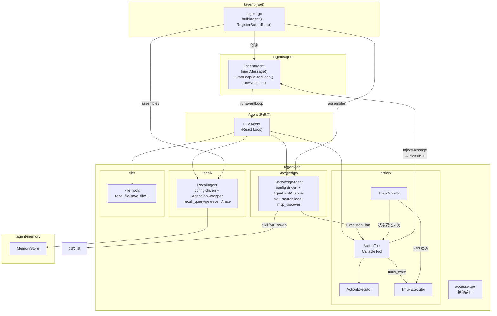
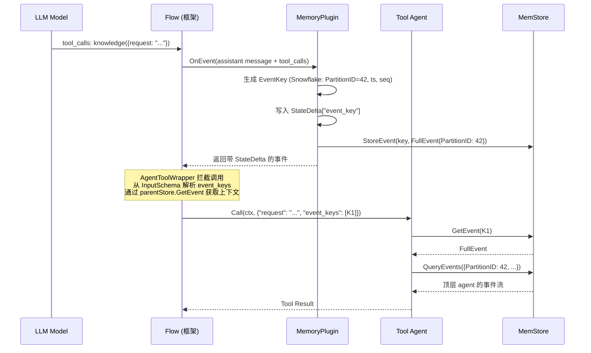
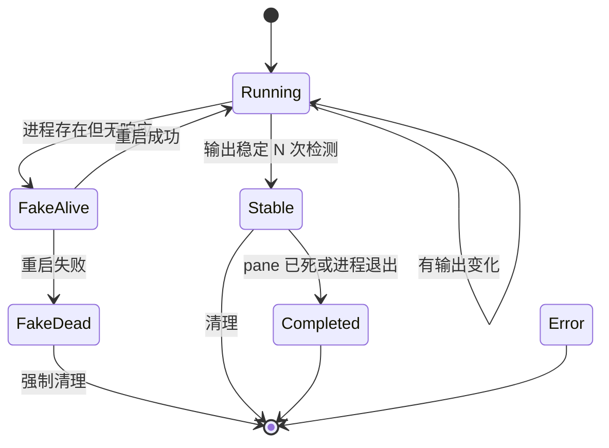
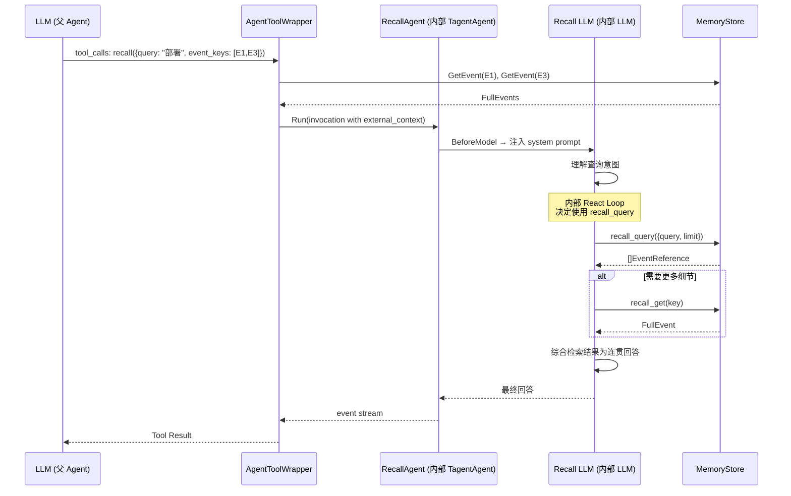
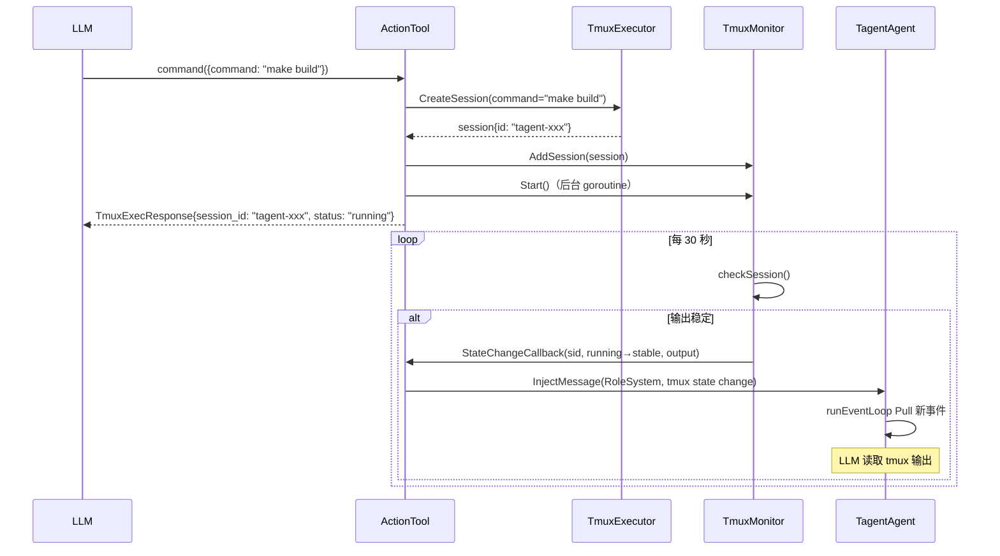
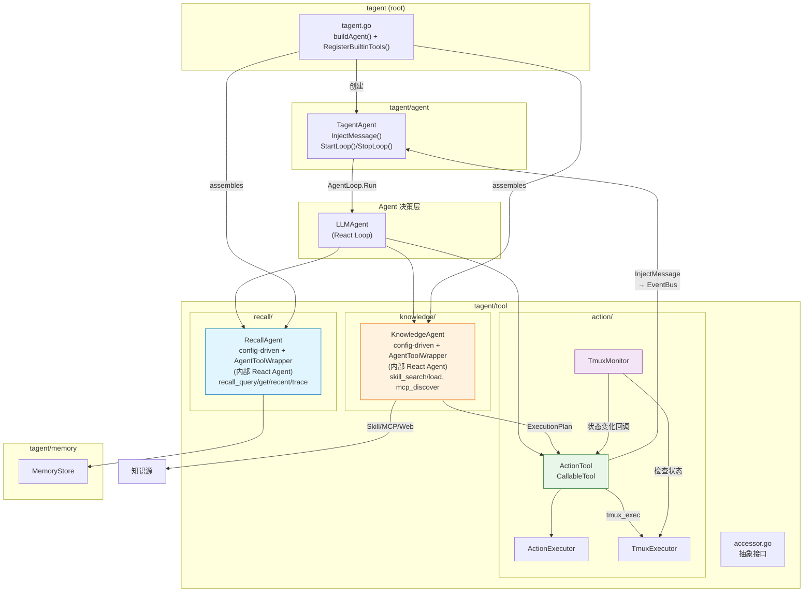
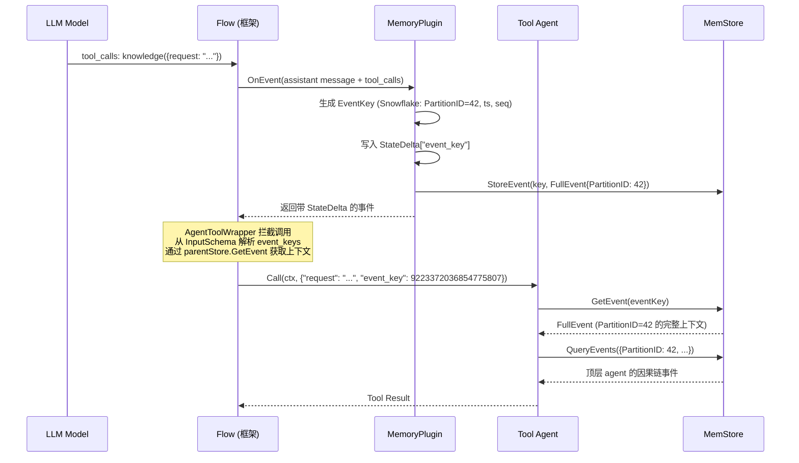
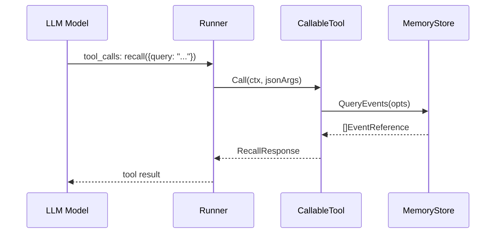
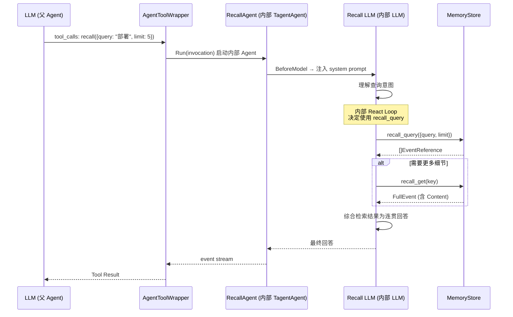

# tagent/tool 模块架构文档

## 一、模块定位

`tagent/tool` 是 tagent 为 trpc-agent-go Runner 提供的一组 **CallableTool 工具实现**，也是 Agent 与外部世界交互的主要通道。

**核心职责**：
- **KnowledgeAgent**：知识获取与翻译 — 发现/理解/翻译能力（Skill/MCP）为可执行计划，实现为 config-driven TagentAgent + AgentToolWrapper 包装
- **RecallAgent**：智能记忆召回 — 使用内部 LLM React 循环理解查询意图，综合历史事件为连贯回答
- **ActionTool**：命令执行（同步 exec / 异步 tmux_exec），纯执行器，不关心命令来源
- **TmuxMonitor**：后台监控 tmux session 状态，状态变更时通过 `InjectMessage` 触发新的 Agent 迭代
- **File Tools**：封装 trpc-agent-go 内置文件操作工具（read_file、save_file 等）

**设计原则**：
- **职责分离**：理解层（KnowledgeAgent, RecallAgent）和执行层（ActionTool）分离，Agent 负责决策
- **架构统一**：KnowledgeAgent 和 RecallAgent 都是 config-driven TagentAgent 实例 + AgentToolWrapper 包装，复用框架能力
- **按需 React**：KnowledgeAgent 和 RecallAgent 有内部 React 循环；ActionTool 不需要
- **Prompt 文件化**：System prompt 通过 `prompt.Loader` 动态加载
- **配置声明式**：所有 tool 通过 Config + ToolRef 声明，`kind` 区分 agent/tool
- **事件上下文传递**：tool agent 通过父 agent 的 MemStore + `event_keys` 获取完整事件上下文
- **后台异步**：TmuxMonitor 通过 callback 调用 `InjectMessage`，不阻塞主循环
- **ActionTool 闭环**：tmux 状态变更通知通过 `MessageInjector` 接口闭环在 action 包内
- **统一注册路径**：所有内置工具通过 `RegisterBuiltinTools()` 统一注册为 plain tool

---

## 二、文件清单

### 2.1 包结构

```
# 根包 (tagent)
├── tagent.go           # New() 工厂函数：声明式 Config + Option 创建 TagentAgent
├── config.go           # Config / ToolConfig / PromptConfig 声明式配置 + LoadConfig
├── registry.go         # ToolRegistry：统一工具注册/查询/校验（RegisterBuiltinTools）
├── builtin.go          # 内置 plain tool 工厂函数（actionFactory）

# agent 包
├── tagent_agent.go     # TagentAgent 组合根 + runEventLoop
├── tool_agent.go       # ToolAgentFactory / PlainToolFactory 注册接口 + AgentToolWrapper
├── context_manager.go  # ContextManager + TokenCounter + BeforeModel 回调链
├── smart_compress.go   # SmartCompressor
├── task_segmenter.go   # TaskSegmenter + Compactor
├── event_bus.go        # EventBus + AgentEvent
├── projection.go       # SessionProjection + BuildEventReference
├── meditation.go       # MeditationManager
├── trajectory_recorder.go # LLM 调用轨迹记录
├── http_api.go         # HTTP API（RL/AReaL 集成）
└── output_limit_tool.go # 工具输出截断

# tool 包
tool/
├── accessor.go          # 抽象接口定义
├── action/              # action 子包
│   ├── action_tool.go     # ActionTool 实现 (exec / tmux_exec 双模式)
│   ├── action_executor.go # 命令执行器
│   ├── tmux_executor.go   # Tmux 执行器
│   ├── tmux_monitor.go    # Tmux 监控器
│   └── action_test.go     # ActionTool 测试
├── recall/              # recall 子包
│   ├── recall_agent.go    # RecallAgent 组装
│   └── recall_subtools.go # 子工具实现 + RegisterSubTools()
├── knowledge/           # knowledge 子包
│   ├── knowledge_agent.go   # KnowledgeAgent 组装
│   ├── knowledge_subtools.go# 子工具实现 + RegisterSubTools()
│   └── websearch.go         # Web 搜索工具
├── file/                # file 子包
│   └── file.go              # 封装 trpc-agent-go 内置文件操作工具
├── speak/               # speak 子包 (stub)
│   └── speak_agent.go
└── draw/                # draw 子包 (stub)
    └── draw_agent.go

# prompt 包
prompt/
├── loader.go            # Loader + CompositeConfig
```

### 2.2 详细文件列表

| 文件 | 行数 | 职责 |
|------|------|------|
| `tagent.go` (根) | 677 | New() 工厂函数：声明式 Config + Option，按 ToolRef 列表创建 tool |
| `config.go` (根) | 546 | Config / AgentConfig / ToolRef / PromptConfig + LoadConfig + DefaultConfig |
| `registry.go` (根) | 99 | ToolRegistry：统一工具注册/查询/校验门面 + RegisterBuiltinTools |
| `builtin.go` (根) | 45 | 内置 plain tool 工厂函数：actionFactory（ActionTool） |
| `agent/tool_agent.go` | 459 | ToolAgentFactory / PlainToolFactory 注册接口 + AgentToolWrapper 实现 |
| `accessor.go` | 33 | 抽象接口定义（MemoryStoreAccessor, SkillRepository） |
| `recall/recall_agent.go` | ~190 | RecallAgent 组装 |
| `recall/recall_subtools.go` | 421 | RecallAgent 子工具 + RegisterSubTools |
| `knowledge/knowledge_agent.go` | ~145 | KnowledgeAgent 组装 |
| `knowledge/knowledge_subtools.go` | 423 | KnowledgeAgent 子工具 + RegisterSubTools |
| `knowledge/websearch.go` | ~560 | Web 搜索工具实现 |
| `action/action_tool.go` | 377 | ActionTool：exec / tmux_exec 双模式 |
| `action/action_executor.go` | ~250 | 命令执行器 |
| `action/tmux_monitor.go` | ~440 | Tmux 监控器 |
| `action/tmux_executor.go` | ~383 | Tmux 执行器 |
| `file/file.go` | 116 | 封装 trpc-agent-go 内置 8 个文件操作工具 |
| `prompt/loader.go` | 289 | Loader + CompositeConfig |

---

## 三、组件关系总览图



---

## 四、事件上下文传递机制（EventKeys 注入 + 数据隔离）

### 4.0 核心设计

顶层 Agent 直接送 LLM 的 context 是一条**事件组成的记录流**。tool 与顶层 Agent 交互时，需要依赖顶层 Agent 传入的关键 `event_keys` 从 MemStore 中获取完整上下文。

**问题**：tool agent 被调用时，LLM 只能传递文本参数（如 `request`），但 tool agent 需要访问触发其调用的完整事件上下文（因果链、完整事件详情），这需要 `event_keys`。

**设计决策**：tool agent 的 Declaration InputSchema 中声明 `event_keys` 参数（数组），由 `AgentToolWrapper` 从调用参数中解析，通过父级 MemoryStore 获取上下文。

### 4.1 EventKey Snowflake 设计

EventKey 为 Snowflake int64（详见 [memory-architecture.md](../memory/memory-architecture.md) §4.1）。

```
┌──────────────────────────────────────────────────────────────────┐
│ 63       53 │ 52            22 │ 21       12 │ 11             0 │
│  PartitionID│   Timestamp      │  Sequence   │   Reserved     │
│  (11 bits)  │   (31 bits)      │  (10 bits)  │   (12 bits)    │
└──────────────────────────────────────────────────────────────────┘
```

| 字段 | 位数 | 说明 |
|------|------|------|
| PartitionID | 11 bits | 存储分区键（0-2047），由 FNV-1a(AgentName) 派生 |
| Timestamp | 31 bits | 秒级时间戳偏移（相对 epoch），可用 ~68 年 |
| Sequence | 10 bits | 同秒内序列号（0-1023），单分区每秒可产生 1024 个事件 |
| Reserved | 12 bits | 预留位 |

### 4.2 Memory 数据隔离设计

**核心原则：Memory 不感知 agent，但从存储角度实现数据隔离。**

- FilterKey 是 trpc-agent-go 框架的概念，属于 LLM context 层面的隔离
- Memory 从**存储分区**角度思考隔离，使用 **PartitionID** 作为分区键
- 框架已有的 **AgentName** 是稳定的 agent 身份标识
- **PartitionID = FNV-1a(AgentName) & 0x7FF**，由 MemoryPlugin 在 tagent 层计算

```
框架层 (AgentName/FilterKey)     tagent 层 (MemoryPlugin)          Memory 层 (PartitionID)
┌──────────────────────┐      ┌───────────────────────┐      ┌─────────────────┐
│ AgentName = "tagent" │──────→│ FNV-1a("tagent")=42  │──────→│ partition=42    │
│ FilterKey = "tagent" │      │ FNV-1a("knowledge")=85│──────→│ partition=85    │
├──────────────────────┤      │ FNV-1a("recall")=123 │──────→│ partition=123   │
│ AgentName = "know"   │      │                       │      │                 │
└──────────────────────┘      │ AgentName → PartitionID│      │ 纯整数分区键    │
                              │ Memory 不感知 agent   │      │ 无 agent 语义   │
└──────────────────────┘      └───────────────────────┘      └─────────────────┘
```

### 4.3 EventKeys 注入流程



### 4.4 EventKeys 注入机制

**注入位置**：MemoryPlugin.OnEvent 处理 assistant 的 tool_call 消息时生成 Snowflake EventKey 并写入 `StateDelta`。

**调用流程**：
1. LLM 输出 tool_calls，选择相关 `event_keys`
2. `AgentToolWrapper.Call` 从参数中解析 `event_keys`（数组）和兼容单数的 `event_key`
3. 通过 `parentStore.GetEvent(key)` 逐个取出完整 `FullEvent`
4. 序列化为 `RuntimeState["external_context"]`
5. 调用 `agent.Run(ctx, inv)`，子 Agent 从 RuntimeState 读取上下文

**Tool Declaration 约束**：
- Agent-kind tool 的声明自动包含 `event_keys` 参数（当 `ToolRef.EventParams` 包含 `event_keys` 时）
- 纯执行器 tool（如 ActionTool、File Tools）不声明此参数

```go
// AgentToolWrapper.Declaration 中 event_keys 的声明
"event_keys": {
    Type:        "array",
    Description: "[LLM-selected] Array of Snowflake EventKeys for related events ...",
    Items: &tool.Schema{Type: "integer"},
}
```

### 4.5 Tool Agent 使用 EventKeys 获取上下文

Tool agent 收到 `event_keys` 后，可通过 MemoryStore 执行以下操作：

| 操作 | 方法 | 用途 |
|------|------|------|
| 获取触发事件详情 | `GetEvent(eventKey)` | 获取完整的 tool_call 事件内容 |
| 提取分区归属 | `PartitionIDFromEventKey(eventKey)` | 从 EventKey 反推 PartitionID |
| 按分区查询 | `QueryEvents({PartitionID: id})` | 查询同分区的事件流 |
| 追溯因果链 | `RelationStore.GetParent(event.EventKey)` | 获取前驱事件 |
| 跨分区查询 | `QueryEvents({PartitionIDs: [42, 85]})` | 查询顶层+子 agent 事件（PartitionIDs 由 ReadNamespaces 注入） |

### 4.6 远程上下文传递路径

当子 agent 部署为远程 tagent 服务时（`ToolRef.Remote` 配置），上下文传递链路通过 trpc 框架原生的 RuntimeState 机制自动完成：

```
AgentToolWrapper.Call
  → 解析 event_keys → parentStore.GetEvent → FullEvents
  → serializeExternalContext → ExternalContextEntry[] JSON (仅 EventKey/EventType/EventSummary)
  → Invocation.RunOptions.RuntimeState["external_context"] = JSON
  → agent.Run(ctx, inv)
      │
      ├── 本地: TagentAgent.Run 直接读取 RuntimeState
      └── 远程: A2AAgent.Run
            → WithTransferStateKey("external_context")
            → RuntimeState → A2A message.Metadata
            → HTTP 传输
            → A2A Server
            → agent.WithRuntimeState(message.Metadata)
            → RuntimeState → TagentAgent.Run
```

**序列化格式选择**：仅 EventKey + EventType + EventSummary，不含 Content。原因：
1. `injectExternalContext` 只用 EventSummary
2. A2A metadata 有大小限制
3. 远程子 agent 如需完整事件，可通过自身 MemoryStore 查询

---

## 五、工具的 trpc-agent-go 集成

### 5.1 CallableTool 接口

所有 tagent 工具都实现了 `trpc-agent-go/tool.CallableTool` 接口：

```go
// action/action_tool.go
var _ tool.CallableTool = (*ActionTool)(nil)
```

KnowledgeAgent 和 RecallAgent 不是直接的 CallableTool，而是通过 `AgentToolWrapper` 包装：

```go
// agent/tool_agent.go
wrapper := agent.NewAgentToolWrapper(subAgent, desc, tr.EventParams, parentMemStore)
// wrapper 实现 CallableTool 接口
```

接口定义（`trpc-agent-go/tool`）：

```go
type CallableTool interface {
    Declaration() *Declaration   // 返回工具声明
    Call(ctx context.Context, jsonArgs []byte) (any, error)  // 执行工具
}
```

### 5.2 工具注册机制（三阶段生命周期）

tagent 采用**三阶段工具生命周期**：实现层指定 → 注册层注册 → 配置层组织。

**阶段一：实现层**（各子包内）

每个工具包导出工厂函数，实现 `PlainToolFactory` 接口：

```go
// tool/knowledge/knowledge_subtools.go
func skillSearchFactory(cfg agent.PlainToolFactoryConfig) (tool.CallableTool, error) {
    return NewSkillSearchTool(cfg.SkillRepo), nil
}

// tool/recall/recall_subtools.go
func recallQueryFactory(cfg agent.PlainToolFactoryConfig) (tool.CallableTool, error) {
    return NewRecallQueryTool(accessor, cfg.ReadPartitionIDs), nil
}
```

**阶段二：注册层**（registry.go + builtin.go）

`RegisterBuiltinTools()` 统一注册所有内置 plain tool：

```go
// registry.go
func RegisterBuiltinTools() error {
    registerOnce.Do(func() {
        agent.RegisterPlainTool("exec", actionFactory)
        file.RegisterTools()
        knowledge.RegisterSubTools()
        recall.RegisterSubTools()
    })
    return nil
}
```

注册后 ToolRegistry 中可查询的 plain tool：

| Tool ID | 工厂位置 | 说明 |
|---------|---------|------|
| `exec` | builtin.go | ActionTool（shell/tmux 执行） |
| `read_file` | file/file.go | 读取文件 |
| `save_file` | file/file.go | 保存文件 |
| `list_file` | file/file.go | 列出目录 |
| `search_file` | file/file.go | 搜索文件 |
| `search_content` | file/file.go | 搜索内容 |
| `read_multiple_files` | file/file.go | 批量读取 |
| `replace_content` | file/file.go | 替换内容 |
| `skill_search` | knowledge/knowledge_subtools.go | 搜索技能库 |
| `skill_load` | knowledge/knowledge_subtools.go | 加载技能内容 |
| `mcp_discover` | knowledge/knowledge_subtools.go | 发现 MCP 工具 |
| `web_search` | knowledge/knowledge_subtools.go | 搜索通用网页 |
| `duckduckgo_search` | knowledge/knowledge_subtools.go | DuckDuckGo 事实搜索 |
| `memory_query` | knowledge/knowledge_subtools.go | 查询历史知识记录 |
| `recall_query` | recall/recall_subtools.go | 按条件检索事件 |
| `recall_get` | recall/recall_subtools.go | 获取完整事件详情 |
| `recall_recent` | recall/recall_subtools.go | 快速获取最近事件 |
| `recall_trace` | recall/recall_subtools.go | 因果链回溯 |

**阶段三：配置层**（YAML AgentConfig.Tools）

每个 agent 通过 `Tools []ToolRef` 声明使用哪些工具：

```yaml
agents:
  tagent:
    tools:
      - agent: knowledge
        description_file: knowledge_tool_desc.md
        event_params: [event_keys]
      - agent: recall
        description_file: recall_tool_desc.md
        event_params: [event_keys]
      - kind: tool
        id: exec
        description_file: action_tool_desc.md
      - kind: tool
        id: read_file
        description_file: read_file_tool_desc.md
        properties:
          base_dir: "./workspace"
  knowledge:
    tools:
      - kind: tool
        id: skill_search
      - kind: tool
        id: skill_load
      # ... 共 6 个 plain tools
  recall:
    tools:
      - kind: tool
        id: recall_query
      # ... 共 4 个 plain tools
```

**构建路径**（`tagent.go:buildToolFromRef`）：

```
ToolRef (kind=agent) → buildAgentToolRef → buildAgent() 递归创建子 Agent → AgentToolWrapper 包装
ToolRef (kind=tool)  → buildPlainToolRef → ToolRegistry.GetPlainToolFactory(id) → factory(PlainToolFactoryConfig) → CallableTool
```

`PlainToolFactoryConfig` 携带运行时依赖（MemStore、SkillRepo、MCPToolSets、ReadPartitionIDs、Properties），由 `buildPlainToolRef` 从当前 agent 的上下文注入。

---

## 六、RecallAgent — 智能记忆召回

### 6.1 核心职责

**智能记忆召回** — RecallAgent 是 Agent 查询内部知识的窗口。它使用内部 LLM React 循环理解查询意图，综合历史事件为连贯回答。

**设计决策**：RecallAgent 使用 config-driven TagentAgent + AgentToolWrapper 包装架构（与 KnowledgeAgent 统一），而非简单的 CallableTool。理由：需要 LLM 理解查询意图、综合多个子工具结果、提供结构化的记忆摘要。

### 6.2 配置结构

```go
// recall/recall_agent.go
type Config struct {
    Model             model.Model
    MemStore          tagentpkg.MemoryStoreAccessor
    ReadPartitionIDs  []int
    PromptDir         string
    Prompt            PromptConfig
    Description       string
    DescriptionFile   string
    MaxToolIterations int   // 默认：5
    MaxTokens         int   // 默认：4096
}
```

### 6.3 子工具注册

子工具通过 `RegisterSubTools()` 统一注册为 plain tool：

| 子工具 | 工厂函数 | 说明 |
|--------|---------|------|
| `recall_query` | `recallQueryFactory(cfg)` | 按查询条件检索事件列表，支持时间范围过滤，自动注入 `ReadPartitionIDs` |
| `recall_get` | `recallGetFactory(cfg)` | 根据 event_key 获取完整事件详情，支持 `include_parent` |
| `recall_recent` | `recallRecentFactory(cfg)` | 快速获取最近的 N 条事件，自动注入 `ReadPartitionIDs` |
| `recall_trace` | `recallTraceFactory(cfg)` | 沿 RelationStore 因果链回溯，最多 20 步 |

### 6.4 构建路径

RecallAgent 与 KnowledgeAgent 一致走 config-driven 路径：

```
tagent.New()
  → buildAgent("recall", recallCfg, ...)
    → 从 recallCfg.Tools 构建 4 个 plain tool
    → 每个 plain tool 从 ToolRegistry.GetPlainToolFactory(id) 创建
    → PlainToolFactoryConfig 携带 MemStore + ReadPartitionIDs
  → buildAgentToolRef() 用 AgentToolWrapper 包装为 CallableTool
```

---

## 七、KnowledgeAgent — 知识获取与翻译

### 7.1 核心职责

KnowledgeAgent 发现和加载外部技能文件（skills 目录中的 .md 等文件），并将能力描述翻译为 ExecutionPlan。

**设计原则**：
- **理解层，非执行层**：KnowledgeAgent 负责"理解"技能，执行由 ActionTool 负责
- **架构统一**：TagentAgent 实例 + AgentToolWrapper 包装

**AgentToolWrapper.Call() 实现要点**：
1. 从 `args` 中解析 `event_keys` 参数（`[]int64`）
2. 通过 `parentStore.GetEvent(key)` 逐个获取完整 `FullEvent`
3. 序列化为 `RuntimeState["external_context"]`，通过 `agent.Run(ctx, inv)` 传递给子 Agent
4. `Response.Clone()` 防御层：确保子 Agent 读取的 Response 与 Session 存储的 Response 不共享指针
5. 提取 `finalOutput`（子 Agent 最后一个 `agent_output` 事件的内容）作为 tool result 返回给顶层 LLM

### 7.2 构建路径（config-driven）

```
tagent.New()
  → buildAgent("knowledge", knowledgeCfg, ...)
    → 从 knowledgeCfg.Tools 列表构建 6 个 plain tool
    → 每个 plain tool 从 ToolRegistry.GetPlainToolFactory(id) 创建
    → 创建 TagentAgent + 6 个 plain tool
  → buildAgentToolRef() 用 AgentToolWrapper 包装为 CallableTool
```

**子工具声明**（`DefaultConfig()` 中 knowledge agent 的 Tools）：

```go
"knowledge": {
    Tools: []ToolRef{
        {Kind: ToolKindTool, ID: "skill_search"},
        {Kind: ToolKindTool, ID: "skill_load"},
        {Kind: ToolKindTool, ID: "mcp_discover"},
        {Kind: ToolKindTool, ID: "web_search"},
        {Kind: ToolKindTool, ID: "duckduckgo_search"},
        {Kind: ToolKindTool, ID: "memory_query"},
    },
}
```

### 7.3 子工具注册

| 子工具 | 工厂函数 | 说明 |
|--------|---------|------|
| `skill_search` | `skillSearchFactory(cfg)` | 搜索本地技能库 |
| `skill_load` | `skillLoadFactory(cfg)` | 加载技能完整内容 |
| `mcp_discover` | `mcpDiscoverFactory(cfg)` | 发现 MCP 工具 |
| `duckduckgo_search` | `duckDuckGoSearchFactory(cfg)` | 搜索事实性知识 |
| `web_search` | `webSearchFactory(cfg)` | 搜索通用网页内容 |
| `memory_query` | `memoryQueryFactory(cfg)` | 查询历史知识记录 |

### 7.4 Prompt 文件化

System prompt 存储在 `resources/prompts/knowledge_agent.md`：
- 通过 `prompt.Loader` 动态加载
- 包含工具使用指南、exec-plan 规范、执行原则
- 支持运行时更新

---

## 八、ActionTool — 命令执行

### 8.1 双模式设计

ActionTool 支持两种执行模式：

| 模式 | 执行方式 | 返回时机 | 适用场景 |
|------|---------|---------|---------|
| `exec` | 优先 tmux 异步；tmux 不可用时同步回退 | 立即返回 session ID（tmux）或命令结束（sync） | 所有命令 |
| `tmux_exec` | 同 exec（当前实现统一走 tmux 异步） | 立即返回 session ID | 长期交互命令 |

> **当前实现**：所有 ActionTool 调用优先走 tmux 异步路径。若 tmux 不可用，才回退到同步 exec。

### 8.1.1 Properties 配置

`exec`（ActionTool）通过 `ToolRef.Properties` 接收以下配置：

| 字段 | 类型 | 说明 |
|------|------|------|
| `work_dir` | string | 命令执行的默认工作目录 |
| `run_as_user` | string | 通过 `sudo -u` 执行命令时使用的用户 |
| `run_as_group` | string | 通过 `sudo -g` 执行命令时使用的用户组 |

```yaml
tools:
  - kind: tool
    id: exec
    description_file: action_tool_desc.md
    properties:
      work_dir: /tmp/tagent-workspace
      run_as_user: tagent-runner
      run_as_group: tagent-runner
```

### 8.2 ActionTool 的组合结构

```go
// action/action_tool.go:37-50
type ActionTool struct {
    workspace    string
    runAsUser    string
    runAsGroup   string
    description  string
    executor     *ActionExecutor
    tmuxExecutor *TmuxExecutor
    tmuxMonitor  *TmuxMonitor
    injector     MessageInjector
    closeOnce    sync.Once
}
```

### 8.3 Declaration

```go
// action/action_tool.go:138-166
func (ct *ActionTool) Declaration() *tool.Declaration {
    return &tool.Declaration{
        Name:        "action",
        Description: ct.description,
        InputSchema: &tool.Schema{
            Type: "object",
            Properties: map[string]*tool.Schema{
                "command": {Type: "string", Description: "..."},
                "work_dir": {Type: "string", Description: "..."},
                "env": {Type: "object", AdditionalProperties: true},
                "is_tui": {Type: "boolean", Description: "..."},
            },
            Required: []string{"command"},
        },
    }
}
```

> **注意**：工具在注册表中 ID 为 `exec`，但 LLM 看到的工具名是 `action`。

### 8.4 exec 模式 — 同步执行（tmux 不可用时的回退）

```go
// action/action_tool.go:199-227
func (ct *ActionTool) executeSync(ctx context.Context, args ActionArgs) (any, error) {
    timeout := args.Timeout
    if timeout <= 0 {
        timeout = 60
    }

    spec := ActionSpec{
        Command:    "sh",
        Args:       []string{"-c", args.Command},
        Env:        args.Env,
        Dir:        args.WorkDir,
        Workspace:  ct.workspace,
        Timeout:    time.Duration(timeout) * time.Second,
        RunAsUser:  ct.runAsUser,
        RunAsGroup: ct.runAsGroup,
    }

    result, err := ct.executor.Execute(ctx, spec)
    if err != nil {
        return nil, fmt.Errorf("action: execution failed: %w", err)
    }

    return &ActionExecResult{
        ExitCode: result.ExitCode,
        Stdout:   result.Stdout,
        Stderr:   result.Stderr,
    }, nil
}
```

### 8.5 tmux_exec 模式 — 异步执行

```go
// action/action_tool.go:229-267
func (ct *ActionTool) executeAsync(ctx context.Context, args ActionArgs) (any, error) {
    session, err := ct.tmuxExecutor.CreateSession(ctx, TmuxCreateOptions{
        Command: args.Command,
        WorkDir: args.WorkDir,
        Env:     args.Env,
    })
    if err != nil {
        return nil, fmt.Errorf("action: failed to create tmux session: %w", err)
    }

    if ct.tmuxMonitor != nil {
        ct.tmuxMonitor.AddSession(&TmuxSession{
            ID:        session.ID,
            Name:      session.Name,
            Command:   args.Command,
            WorkDir:   args.WorkDir,
            Status:    SessionRunning,
            CreatedAt: time.Now(),
            IsTUI:     args.IsTUI,
        })
        if !ct.tmuxMonitor.IsRunning() {
            ct.tmuxMonitor.Start()
        }
    }

    return &TmuxExecResponse{
        SessionID: session.ID,
        Status:    "running",
    }, nil
}
```

### 8.6 ActionTool 的 MessageInjector 机制（已废弃）

> ⚠️ **已过时**：此 `MessageInjector`/`handleStateChange` 机制已随 ActionTool 的**无状态重写**移除。当前 ActionTool 不再持有 injector/waiter，而是经调用上下文的 `TaskSpawner`（`TaskSpawnerFromContext`）接入**异步任务层**：状态变更由 `TmuxMonitor` 的按会话回调驱动 `TmuxSettleDetector`，dense 阶段内 settle → 内联返回、越界 → ack 并经 `task_settled` 事件回收 turn。详见 `agent-architecture.md` §2.10 任务层。以下代码块仅为历史留存。

ActionTool 通过 `MessageInjector` 接口闭环处理 tmux 状态变更通知：

```go
// action/action_tool.go:18-23
type MessageInjector interface {
    InjectMessage(msg model.Message)
}
```

```go
// action/action_tool.go:269-
func (ct *ActionTool) handleStateChange(sessionID, oldStatus, newStatus, output string) {
    if ct.injector == nil {
        return
    }
    content := fmt.Sprintf("[system] tmux session %s state changed: %s -> %s", ...)
    if output != "" {
        if len(output) > 2000 {
            output = "...(truncated)" + output[len(output)-2000:]
        }
        content += fmt.Sprintf("\nOutput:\n%s", output)
    }
    ct.injector.InjectMessage(model.Message{Role: model.RoleSystem, Content: content})
}
```

`TagentAgent` 实现了 `MessageInjector` 接口，`buildAgent()` 中通过 `cmdTool.SetMessageInjector(ta)` 完成接线。`InjectMessage` 将消息发布到 active EventBus，由 `runEventLoop` 下一轮消费。

---

## 九、ActionExecutor — 安全命令执行

### 9.1 Execute 流程

```go
// action/action_executor.go
func (ce *ActionExecutor) Execute(ctx context.Context, spec ActionSpec) (ActionResult, error) {
    if timeout > 0 {
        ctx, cancel = context.WithTimeout(ctx, timeout)
        defer cancel()
    }

    cmd := ce.buildCommand(spec)
    cmd.Start()
    doneCh := make(chan error, 1)
    go func() { doneCh <- cmd.Wait() }()

    select {
    case err = <-doneCh:
        // 正常结束
    case <-ctx.Done():
        syscall.Kill(-cmd.Process.Pid, syscall.SIGKILL)
    }

    return ActionResult{ExitCode, Stdout, Stderr, Duration}, nil
}
```

### 9.2 buildCommand — 用户隔离

```go
// action/action_executor.go
func (ce *ActionExecutor) buildCommand(spec ActionSpec) (*exec.Cmd, error) {
    if spec.RunAsUser != "" {
        args := []string{"-n", "-u", spec.RunAsUser}
        if spec.RunAsGroup != "" {
            args = append(args, "-g", spec.RunAsGroup)
        }
        args = append(args, spec.Command)
        args = append(args, spec.Args...)
        cmd = exec.Command("sudo", args...)
    } else {
        cmd = exec.Command(spec.Command, spec.Args...)
    }

    cmd.Dir = spec.Dir || spec.Workspace || ce.workspace
    cmd.SysProcAttr = &syscall.SysProcAttr{Setpgid: true}

    return cmd, nil
}
```

**安全隔离**：通过 `sudo -u` 实现用户隔离，通过 `Setpgid` 实现进程组管理（超时清理）。

---

## 十、TmuxMonitor — 状态监控

### 10.1 监控状态机



### 10.2 状态常量

```go
// action/tmux_executor.go
const (
    SessionRunning   SessionStatus = "running"
    SessionStable    SessionStatus = "stable"
    SessionCompleted SessionStatus = "completed"
    SessionError     SessionStatus = "error"
    SessionFakeDead  SessionStatus = "fake_dead"
    SessionFakeAlive SessionStatus = "fake_alive"
)
```

### 10.3 detectSessionState — 状态检测逻辑

```go
// action/tmux_monitor.go
func (tm *TmuxMonitor) detectSessionState(session *TmuxSession) SessionStatus {
    processExists := tm.executor.ProcessExists(session.ID)
    isPaneDead := tm.executor.IsPaneDead(session.ID)
    currentMD5 := md5.Sum([]byte(currentOutput))

    if processExists && !isPaneDead {
        if currentMD5 == session.LastOutputMD5 {
            session.StableCount++
        } else {
            session.StableCount = 0
        }
    }

    if !processExists || isPaneDead {
        return SessionCompleted
    }
    if session.StableCount >= threshold {
        return SessionStable
    }
    return SessionRunning
}
```

### 10.4 FakeAlive / FakeDead 处理

| 状态 | 触发条件 | 处理方式 |
|------|---------|---------|
| `fake_alive` | 进程存在、pane 存活、输出稳定超过阈值，但心跳有响应 | 重启 session |
| `fake_dead` | 进程存在、pane 存活、输出稳定超过阈值，心跳也无响应 | 强制 kill session |

### 10.5 配置参数

```go
// action/tmux_monitor.go
func DefaultMonitorConfig() MonitorConfig {
    return MonitorConfig{
        Interval:             30 * time.Second,
        StableThreshold:      2,
        InteractiveThreshold: 3,
        FakeDeadThreshold:    5,
        HeartbeatCommand:    "echo ping",
        HeartbeatTimeout:     5 * time.Second,
    }
}
```

---

## 十一、TmuxExecutor — Tmux Session 管理

### 11.1 核心操作

| 方法 | 说明 |
|------|------|
| `CreateSession(opts)` | 创建 detached tmux session |
| `KillSession(id)` | 终止 session |
| `SessionExists(id)` | 检查 session 是否存在 |
| `GetSessionOutput(id)` | 捕获 pane 内容 |
| `IsPaneDead(id)` | 检查 pane 是否已死 |
| `ProcessExists(id)` | 检查主进程是否存活 |
| `SendHeartbeat(id)` | 发送心跳检测 |
| `RestartSession(id, opts)` | 重启 session |
| `SendKeys(id, keys)` | 向 session 发送按键 |

### 11.2 Session 唯一命名

```go
// action/tmux_executor.go
func (te *TmuxExecutor) CreateSession(...) (*TmuxSession, error) {
    sessionName := fmt.Sprintf("%s-%d", te.prefix, time.Now().UnixNano())
    // prefix 默认值："tagent"
}
```

---

## 十二、File Tools — 文件操作工具

### 12.1 定位

`tool/file` 封装 trpc-agent-go 内置文件操作工具，作为 plain tool 注册到 ToolRegistry，可直接在 YAML 中引用。

### 12.2 注册的 8 个工具

| Tool ID | 说明 |
|---------|------|
| `read_file` | 读取文件内容 |
| `save_file` | 保存文件 |
| `list_file` | 列出目录内容 |
| `search_file` | 按文件名搜索 |
| `search_content` | 按内容搜索 |
| `read_multiple_files` | 批量读取文件 |
| `replace_content` | 替换文件内容 |

### 12.3 Properties 配置

| 字段 | 类型 | 说明 |
|------|------|------|
| `base_dir` | string | 文件操作的根目录（默认当前工作目录 `.`） |

```yaml
tools:
  - kind: tool
    id: read_file
    description_file: read_file_tool_desc.md
    properties:
      base_dir: "./workspace"
```

### 12.4 实现方式

`file.NewToolSet(baseDir)` 创建 trpc-agent-go 内置 file toolset，`makeFileToolFactory` 根据工具名从 toolset 中取出对应的 `CallableTool`。

---

## 十三、完整数据流

### 13.1 RecallTool 完整数据流



### 13.2 ActionTool tmux_exec 完整数据流



---

## 十四、关键设计决策

### 14.1 为什么 RecallAgent 和 KnowledgeAgent 都需要内部 LLM React 循环？

| 工具 | 内部 React | 实现方式 | 理由 |
|------|-----------|---------|------|
| **RecallAgent** | 需要 | config-driven TagentAgent + AgentToolWrapper | 4 种 plain tool 协作，需要 LLM 理解查询意图、综合结果 |
| **KnowledgeAgent** | 需要 | config-driven TagentAgent + AgentToolWrapper | 6 种 plain tool 协作，LLM 翻译能力为 ExecutionPlan |
| **ActionTool** | 不需要 | CallableTool (PlainToolFactory) | 纯执行器，无决策需求 |
| **File Tools** | 不需要 | CallableTool (PlainToolFactory) | 纯执行器 |

判断标准：需要"思考-行动-观察"循环 → TagentAgent + AgentToolWrapper；单一功能/执行器 → 简单 CallableTool。

### 14.2 为什么 KnowledgeAgent 和 RecallAgent 是 config-driven？

| 维度 | 旧架构（ToolAgentFactory） | 新架构（config-driven） |
|------|---------------------------|------------------------|
| knowledge/recall 创建 | 注册 `RegisterToolAgent("knowledge", factory)` | `buildAgent()` 通用路径 |
| 子工具注册 | 在 factory 内部硬编码组装 | `RegisterSubTools()` 注册为 plain tool |
| 子工具配置 | 不可配置 | YAML 声明式 |
| 扩展性 | 需修改 factory 代码 | 只需在 YAML 中添加 tool ref |

### 14.3 为什么 tool 参数必须包含 event_keys？

| 对比项 | 无 event_keys | 有 event_keys |
|--------|--------------|---------------|
| **上下文获取** | 只能依赖 LLM 传的文本 | 可从 MemStore 获取完整事件上下文 |
| **因果链追溯** | 无法追溯 | 通过 RelationStore 追溯事件脉络 |
| **LLM 依赖** | 完全依赖 LLM 传参 | AgentToolWrapper 自动解析 |

**注入时机**：
1. MemoryPlugin.OnEvent 生成 `event_key` 并写入 StateDelta
2. ContextManager.InjectEventKeys 为消息添加 `[evt_<KEY>|<type>]` 前缀
3. LLM 选择相关 `event_keys` 作为 tool 参数传递
4. AgentToolWrapper.Call 解析 `event_keys`，通过 `parentStore.GetEvent` 获取完整事件数据

### 14.4 为什么 TmuxMonitor 用 callback 而不是 channel？

**决策**：callback 让 TagentAgent 完全控制如何触发新迭代（通过 `InjectMessage`）。

| 方案 | 优点 | 缺点 |
|------|------|------|
| **callback（tagent 选型）** | TagentAgent 完全控制触发逻辑 | 调用方需保存引用 |
| channel | 解耦更彻底 | 需要额外的 goroutine 消费 channel |

TagentAgent 需要在 callback 中注入 `RoleSystem` 消息到 EventBus，使用 callback 比 channel 更直接。

### 14.5 为什么用 RuntimeState 而非 struct 字段传递上下文？

**设计决策**：AgentToolWrapper 通过 `Invocation.RunOptions.RuntimeState["external_context"]` 传递外部事件上下文。

| 对比项 | struct 字段 | RuntimeState |
|--------|------------|-------------|
| **本地调用** | 进程内有效 | 直接读取 |
| **远程调用** | 无法跨越 A2A 边界 | 自动映射到 A2A metadata |
| **额外代码** | 需要 ProcessMessageHook | 零额外代码 |

### 14.6 为什么 AgentToolWrapper 持有 agent.Agent 接口而非 *TagentAgent？

**设计决策**：`AgentToolWrapper.agent` 字段类型为 `agent.Agent`（接口）。

**理由**：
1. `TagentAgent` 已实现 `agent.Agent` 接口
2. `a2aagent.A2AAgent` 也实现 `agent.Agent` 接口
3. Wrapper 只需调用 `agent.Run(ctx, inv)`，不关心是本地还是远程
4. 统一接口消除了本地/远程的代码分支

### 14.7 为什么 exec 工具注册 ID 是 exec，但 Declaration Name 是 action？

**设计决策**：
- 注册表 ID `exec`：标识这是一个执行器工具，在 YAML 配置中使用 `id: exec`
- LLM 看到的工具名 `action`：语义上表示"执行行为动作"，与执行器职责一致

```yaml
tools:
  - kind: tool
    id: exec                 # 注册表 ID
    description_file: action_tool_desc.md
```

LLM 调用时使用 `action` 作为 tool name：

```json
{"name": "action", "arguments": {"command": "ls -la"}}
```
# tagent/tool 模块架构文档

## 一、模块定位

`tagent/tool` 是 tagent 为 trpc-agent-go Runner 提供的一组 **CallableTool 工具实现**，也是 Agent 与外部世界交互的唯一通道。

**核心职责**：
- **KnowledgeAgent**：知识获取与翻译 — 发现/理解/翻译能力（Skill/MCP）为可执行计划，实现为 config-driven TagentAgent + AgentToolWrapper 包装
- **RecallAgent**：智能记忆召回 — 使用内部 LLM React 循环理解查询意图，综合历史事件为连贯回答
- **ActionTool**：命令执行（同步 exec / 异步 tmux_exec），纯执行器，不关心命令来源
- **TmuxMonitor**：后台监控 tmux session 状态，状态变更时触发新的 Agent 迭代

**设计原则**：
- **职责分离**：理解层（KnowledgeAgent, RecallAgent）和执行层（ActionTool）分离，Agent 负责决策
- **架构统一**：KnowledgeAgent 和 RecallAgent 都是 config-driven TagentAgent 实例 + AgentToolWrapper 包装，复用框架能力
- **按需 React**：KnowledgeAgent 和 RecallAgent 有内部 React 循环（多子工具协作 + 翻译）；ActionTool 不需要
- **Prompt 文件化**：System prompt 通过 prompt.Loader 动态加载，支持 PromptConfig bootstrap 风格
- **配置声明式**：所有 tool 通过 Config + ToolConfig 声明，kind 区分 agent/tool，description 支持文件加载
- **事件上下文传递**：tool agent 通过父 agent 的 MemStore + EventKey 获取完整事件上下文；tool 参数声明中必须包含 `event_key`，由 AgentToolWrapper 从调用参数中解析，通过 parentStore.GetEvent 获取完整上下文
- **后台异步**：TmuxMonitor 通过 callback 触发 Agent 迭代，不阻塞主循环
- **包编排**：agent 包不依赖 tool 包，根包 tagent.go 封装 agent 实例化过程
- **ActionTool 闭环**：tmux 状态变更通知通过 MessageInjector 接口闭环在 action 包内，不暴露给外部
- **注册扩展**：agent 包开放 ToolAgentFactory / PlainToolFactory 注册接口，支持自定义 tool 扩展；注册 API 需确保 tool 参数中包含 `event_key` 以支持上下文获取
- **统一注册路径**：所有内置工具（exec + knowledge/recall sub-tools）通过 `RegisterBuiltinTools()` 统一注册为 plain tool。knowledge/recall 本身是 config-driven agent，与其他 agent 一致走 `AgentConfig.Tools` 路径

---

## 二、文件清单

### 2.1 包结构

```
# 根包 (tagent)
├── tagent.go           # New() 工厂函数：声明式 Config + Option 创建 TagentAgent
├── config.go           # Config / ToolConfig / PromptConfig 声明式配置 + LoadConfig
├── registry.go         # ToolRegistry：统一工具注册/查询/校验（RegisterBuiltinTools）
├── builtin.go          # 内置 plain tool 工厂函数（actionFactory）

# agent 包
├── tagent_agent.go     # TagentAgent 组合根
├── tool_agent.go       # ToolAgentFactory / PlainToolFactory 注册接口 + AgentToolWrapper
├── context_intervention.go
├── smart_compress.go
└── token_counter.go

# tool 包
tool/
├── accessor.go          # 抽象接口定义
├── action/              # action 子包
│   ├── action_tool.go     # ActionTool 实现 (exec / tmux_exec 双模式)
│   ├── action_executor.go   # 命令执行器
│   ├── tmux_executor.go     # Tmux 执行器
│   ├── tmux_monitor.go      # Tmux 监控器
│   └── action_test.go      # ActionTool 测试
├── recall/              # recall 子包
│   ├── recall_agent.go      # RecallAgent 组装 (config-driven + PromptConfig)
│   └── recall_subtools.go   # 子工具实现 + RegisterSubTools()
├── knowledge/           # knowledge 子包
│   ├── knowledge_agent.go   # KnowledgeAgent 组装 (config-driven + PromptConfig)
│   ├── knowledge_subtools.go# 子工具实现 + RegisterSubTools()
│   └── websearch.go         # Web 搜索工具 (HTML scraping)
├── file/                # file 子包
│   └── file.go              # 封装 trpc-agent-go 内置文件操作工具
├── speak/               # speak 子包 (stub)
│   └── speak_agent.go
└── draw/                # draw 子包 (stub)
    └── draw_agent.go

# prompt 包
prompt/
├── loader.go            # Loader + CompositeConfig (bootstrap 风格 prompt 加载)

# resources/prompts/
├── knowledge_agent.md    # KnowledgeAgent system prompt
├── knowledge_tool_desc.md  # Knowledge tool 描述
├── recall_agent.md      # RecallAgent system prompt
├── recall_tool_desc.md  # Recall tool 描述
├── command_tool_desc.md # Command tool 描述
└── bootstrap/           # 顶层 agent bootstrap prompt 目录
```

### 2.2 详细文件列表

| 文件 | 行数 | 职责 |
|------|------|------|
| `tagent.go` (根) | 581 | New() 工厂函数：声明式 Config + Option，按 ToolRef 列表创建 tool |
| `config.go` (根) | 546 | Config / AgentConfig / ToolRef / PromptConfig + LoadConfig + DefaultConfig + ApplyDefaults + Validate |
| `registry.go` (根) | 94 | ToolRegistry：统一工具注册/查询/校验门面 + RegisterBuiltinTools |
| `builtin.go` (根) | 45 | 内置 plain tool 工厂函数：actionFactory（ActionTool）|
| `agent/tool_agent.go` | 458 | ToolAgentFactory / PlainToolFactory 注册接口 + PlainToolFactoryConfig + AgentToolWrapper 实现 |
| `accessor.go` | 33 | 抽象接口定义（MemoryStoreAccessor, SkillRepository） |
| `recall/recall_agent.go` | ~190 | RecallAgent 组装：TagentAgent + 子工具 + PromptConfig + DescriptionFile |
| `recall/recall_subtools.go` | 421 | RecallAgent 子工具 + RegisterSubTools：recall_query, recall_get, recall_recent, recall_trace |
| `knowledge/knowledge_agent.go` | ~145 | KnowledgeAgent 组装：config-driven TagentAgent + PromptConfig |
| `knowledge/knowledge_subtools.go` | 423 | KnowledgeAgent 子工具 + RegisterSubTools：skill_search, skill_load, mcp_discover, duckduckgo_search, web_search, memory_query |
| `knowledge/websearch.go` | ~560 | Web 搜索工具实现（HTML scraping 方式获取网页内容） |
| `action/action_tool.go` | 373 | ActionTool：exec / tmux_exec 双模式 + option pattern |
| `action/action_executor.go` | ~250 | 命令执行器：安全隔离执行 |
| `action/tmux_monitor.go` | ~440 | Tmux 监控器：后台状态检测 + callback 触发 |
| `action/tmux_executor.go` | ~383 | Tmux 执行器：tmux session 管理 |
| `prompt/loader.go` | 288 | Loader + CompositeConfig：bootstrap 风格 prompt 加载 |

> **注意**：KnowledgeAgent 和 RecallAgent 的组装层代码在各子包中（tool/knowledge, tool/recall）。
> 根包通过 `tagent.New(cfg, opts...)` 工厂函数封装完整的 agent 实例化过程，
> 按 `Config.Tools` 声明式列表构建所有 tool。内置子工具通过 `RegisterBuiltinTools()` 注册为 plain tool。

---

## 三、组件关系总览图



---

## 四、事件上下文传递机制（EventKey 注入 + 数据隔离）

### 4.0 核心设计

按照 tagent 的架构设计，顶层 agent 直接送 LLM 的 context 是一条**事件组成的记录流**（由 MemoryPlugin 追踪）。tool 与顶层 agent 交互时，需要依赖顶层 agent 传入的关键 `event_key` 从 MemStore 中获取完整上下文。

**问题**：tool agent 被调用时，LLM 只能传递文本参数（如 `request`），但 tool agent 需要访问触发其调用的完整事件上下文（因果链、完整事件详情），这需要 `event_key`。

**设计决策**：tool 的 Declaration InputSchema 中必须声明 `event_key` 参数，由 AgentToolWrapper 从调用参数中自解析（InputSchema 声明 `event_keys` 参数），通过父级的 MemoryStore 获取上下文。

### 4.1 EventKey Snowflake 设计

EventKey 为 Snowflake int64（详见 [memory-architecture.md](../memory/memory-architecture.md) §4.1）。

#### 4.1.1 Snowflake 风格 EventKey

参考 Snowflake 算法，设计 64-bit 整数 EventKey，编码 PartitionID、时间戳和序列号：

```
┌──────────────────────────────────────────────────────────────────┐
│ 63       53 │ 52            22 │ 21       12 │ 11             0 │
│  PartitionID│   Timestamp      │  Sequence   │   Reserved     │
│  (11 bits)  │   (31 bits)      │  (10 bits)  │   (12 bits)    │
└──────────────────────────────────────────────────────────────────┘
```

| 字段 | 位数 | 说明 |
|------|------|------|
| PartitionID | 11 bits | 存储分区键（0-2047），由 FNV-1a(AgentName) 派生 |
| Timestamp | 31 bits | 秒级时间戳偏移（相对 epoch），可用 ~68 年 |
| Sequence | 10 bits | 同秒内序列号（0-1023），单分区每秒可产生 1024 个事件 |
| Reserved | 12 bits | 预留位，未来可用于分布式 worker ID 或扩展 |

**核心优势**：

1. **Key 内含 PartitionID** → 直接从 EventKey 提取分区归属，无需额外索引
2. **按分区有序** → 同一分区的事件在时间上连续，便于范围查询
3. **全局唯一** → PartitionID + Timestamp + Sequence 组合保证
4. **分布式友好** → Reserved 位可用于 worker ID，支持多实例部署
5. **可排序** → int64 天然支持按时间排序
6. **存储高效** → 8 字节整数 vs 24+ 字符串

```go
// NewSnowflakeEventKey generates a Snowflake-style EventKey.
func NewSnowflakeEventKey(partitionID int, nowMs int64) int64 {
    ts := nowMs/1000 - snowflakeEpoch
    // ... sequence counter per partitionID ...
    return (int64(partitionID&partitionIDMask) << partitionIDShift) |
           ((ts & timestampMask) << timestampShift) |
           (int64(seq&sequenceMask) << sequenceShift)
}

// PartitionIDFromEventKey extracts the PartitionID from an EventKey.
func PartitionIDFromEventKey(key int64) int {
    return int((key >> partitionIDShift) & partitionIDMask)
}

// PartitionIDFromName computes a stable PartitionID from a name string.
// AgentName (framework) → PartitionID (storage), deterministic FNV-1a.
func PartitionIDFromName(name string) int {
    h := fnv.New32a()
    h.Write([]byte(name))
    return int(h.Sum32() & 0x7FF)
}
```

### 4.2 Memory 数据隔离设计

#### 4.2.1 设计原则

**核心原则：Memory 不感知 agent，但从存储角度实现数据隔离。**

- FilterKey 是 trpc-agent-go 框架的概念，属于 LLM context 层面的隔离
- Memory 从**存储分区**角度思考隔离，使用 **PartitionID** 作为分区键（纯整数，纯存储概念）
- 框架已有的 **AgentName**（`agent.Info().Name`）是稳定的 agent 身份标识
- **PartitionID = FNV-1a(AgentName) & 0x7FF**，由 MemoryPlugin 在 tagent 层计算，Memory 层完全不知道 AgentName 的存在
- 三层分离：框架概念（AgentName/FilterKey）→ tagent 层映射 → 存储概念（PartitionID）

```
框架层 (AgentName/FilterKey)     tagent 层 (MemoryPlugin)          Memory 层 (PartitionID)
┌──────────────────────┐      ┌───────────────────────┐      ┌─────────────────┐
│ AgentName = "tagent" │──────→│ FNV-1a("tagent")=42  │──────→│ partition=42    │
│ FilterKey = "tagent" │      │ FNV-1a("knowledge")=85│──────→│ partition=85    │
├──────────────────────┤      │ FNV-1a("recall")=123 │──────→│ partition=123   │
│ AgentName = "know"   │──────→│                       │      │                 │
│ FilterKey = "tagent/ │      │ AgentName → PartitionID│      │ 纯整数分区键    │
│              know-xx"│      │ Memory 不感知 agent   │      │ 无 agent 语义   │
└──────────────────────┘      └───────────────────────┘      └─────────────────┘
  框架身份 + LLM 隔离           身份 → 存储的桥梁             物理存储隔离
```

**关键统一**：不引入独立的 AgentID 概念。AgentName（框架已有）→ PartitionID（存储），
语义一致，零映射表成本。FNV-1a hash 是确定性的，同名字永远映射到同分区。

#### 4.2.2 PartitionID 作为存储分区键

**FullEvent 使用 PartitionID 字段**：

```go
type FullEvent struct {
    EventKey     int64  `json:"event_key"`            // Snowflake int64
    PartitionID  int    `json:"partition_id"`         // 存储分区键
    EventType    string `json:"event_type"`
    EventSummary string `json:"event_summary"`
    Timestamp    int64  `json:"timestamp"`
    Content      string `json:"content"`
    // ...
}
```

**QueryOptions 使用 PartitionID 过滤**：

```go
type QueryOptions struct {
    PartitionID  int      `json:"partition_id"`   // 按分区键过滤（0=所有）
    PartitionIDs []int    `json:"partition_ids"`  // 多分区键过滤
    EventTypes   []string `json:"event_types"`
    StartTime    int64    `json:"start_time"`
    EndTime      int64    `json:"end_time"`
    Limit        int      `json:"limit"`
    Offset       int      `json:"offset"`
    OrderBy      string   `json:"order_by"`
}
```

#### 4.2.3 存储实现

**InMemoryStore** — 按 PartitionID 分区：

```go
type InMemoryStore struct {
    mu      sync.RWMutex
    events  map[int]map[int64]FullEvent  // PartitionID → EventKey → FullEvent
}
```

**FileSegmentStore** — 基于 KV store 的分层存储（L0/L1 hourly → L2 daily → L3 weekly），按 PartitionID 分区。详见 memory-architecture.md。

```
data/
├── 42/              ← PartitionID=42 (tagent: FNV-1a("tagent"))
│   ├── 9223372036854775807.json
│   └── 9223372036854775808.json
├── 85/              ← PartitionID=85 (knowledge: FNV-1a("knowledge"))
│   └── ...
└── 123/             ← PartitionID=123 (recall: FNV-1a("recall"))
    └── ...
```

**云原生扩展**：PartitionID 作为分区键天然支持：
- 分布式存储：不同 PartitionID 分片到不同节点
- 多租户隔离：不同用户/租户的 agent 使用不同 PartitionID 段
- 水平扩展：按 PartitionID range 分片，无需跨分片查询

#### 4.2.4 MemoryPlugin 按 PartitionID + SessionID 维护独立因果链

**当前问题**：`lastEventKey` 全局单例，子 agent 事件打断顶层因果链。

**改进**：按 PartitionID 维护因果链：

```go
type MemoryPlugin struct {
    memStore      memory.MemoryStore
    mu            sync.Mutex
    lastEventKeys map[string]int64  // "partitionID:sessionID" → lastEventKey
}
```

**因果链隔离效果**：

```
PartitionID=42 (tagent):     E0 → E1 → E2 ──────────────────→ E5
                                                 ↑ 因果链跨越子 agent
PartitionID=85 (knowledge):                     E3 → E4
                                                 ↑ 独立因果链
```

- 顶层 agent 的因果链只包含自身事件（E0→E1→E2→E5）
- 子 agent 有独立因果链（E3→E4）
- tool agent 通过 `event_key` 获取触发事件 E2，通过 `RelationStore.GetParent(E2)` 追溯顶层因果链

### 4.3 EventKey 注入流程



### 4.4 EventKey 注入机制

**注入位置**：trpc-agent-go Flow 层的 `postprocess` 阶段（tool_call 执行前）。

**注入方式**：
1. MemoryPlugin.OnEvent 处理 assistant 的 tool_call 消息，生成 Snowflake EventKey 并写入 `StateDelta`
2. Flow 在执行 tool_call 时，从当前事件的 `StateDelta` 中提取 `event_key`
3. AgentToolWrapper 从 `event_keys` 参数中解析 EventKey，通过 `parentStore.GetEvent` 获取完整上下文注入到 tool 调用中
4. Tool agent 收到完整的参数（含 `event_key`），可用于查询 MemStore

**Tool Declaration 约束**：
- 所有 tool agent 的 Declaration InputSchema 必须声明 `event_key` 参数（optional）
- 参数描述应说明：由 AgentToolWrapper 自解析，tool agent 通过此 key 从父级 MemStore 获取时间上下文
- 纯执行器 tool（如 ActionTool）可选择不声明此参数

```go
// Declaration 中的 event_key 声明示例
"event_key": {
    Type:        "string",
    Description: "[auto-injected] Snowflake EventKey of the triggering event. Use this to retrieve full context from memory.",
}
```

### 4.5 Tool Agent 使用 EventKey 获取上下文

Tool agent 收到 `event_key` 后，可通过 `MemoryStoreAccessor` 执行以下操作：

| 操作 | 方法 | 用途 |
|------|------|------|
| 获取触发事件详情 | `GetEvent(eventKey)` | 获取完整的 tool_call 事件内容 |
| 提取分区归属 | `PartitionIDFromEventKey(eventKey)` | 从 EventKey 反推 PartitionID |
| 按分区查询 | `QueryEvents({PartitionID: id})` | 查询同分区的事件流 |
| 追溯因果链 | `RelationStore.GetParent(event.EventKey)` | 获取前驱事件，理解上下文脉络 |
| 跨分区查询 | `QueryEvents({PartitionIDs: [42, 85]})` | 查询顶层+子 agent 事件（PartitionIDs 由 ReadNamespaces 注入，LLM 无感知） |

> **与 ReadPartitionIDs 的关系**：`event_key` 提供单事件上下文入口，`ReadPartitionIDs` 控制子工具（`recall_query`、`recall_recent`）的跨分区查询范围。两者互补：event_key 精准定位单个事件，ReadPartitionIDs 限定批量查询的分区范围。详见 §六 和 [agent-architecture.md](../agent/agent-architecture.md) §12.5.8。

### 4.6 远程上下文传递路径

当子 agent 部署为远程 tagent 服务时（`ToolRef.Remote` 配置），上下文传递链路通过 trpc 框架原生的 RuntimeState 机制自动完成：

```
AgentToolWrapper.Call
  → 解析 event_keys → parentStore.GetEvent → FullEvents
  → serializeExternalContext → ExternalContextEntry[] JSON (仅 EventKey/EventType/EventSummary)
  → Invocation.RunOptions.RuntimeState["external_context"] = JSON
  → agent.Run(ctx, inv)
      │
      ├── 本地: TagentAgent.Run 直接读取 RuntimeState
      └── 远程: A2AAgent.Run
            → WithTransferStateKey("external_context")
            → RuntimeState → A2A message.Metadata
            → HTTP 传输
            → A2A Server (server.go:377)
            → agent.WithRuntimeState(message.Metadata)
            → RuntimeState → TagentAgent.Run
```

**远程化后的设计哲学保持不变**：
- LLM 仍只输出数字 event_key（不知道远程/本地区别）
- Wrapper 仍负责 event_key 解析和上下文投递（只是投递载体从 struct 字段变为 RuntimeState）
- 子 agent 仍只收到已还原的上下文摘要（通过 injectExternalContext 注入）

**序列化格式选择**：仅 EventKey + EventType + EventSummary，不含 Content。原因：
1. `injectExternalContext` 只用 EventSummary
2. A2A metadata 有大小限制
3. 远程子 agent 如需完整事件，可通过自身 MemoryStore 查询

---

## 五、工具的 trpc-agent-go 集成

### 5.1 CallableTool 接口

所有 tagent 工具都实现了 `trpc-agent-go/tool.CallableTool` 接口：

```go
// action/action_tool.go
var _ tool.CallableTool = (*ActionTool)(nil)
```

KnowledgeAgent 和 RecallAgent 不是直接的 CallableTool，而是通过 `AgentToolWrapper` 包装（由 `buildAgentToolRef` 创建）：

```go
// agent/tool_agent.go
wrapper := agent.NewAgentToolWrapper(subAgent, desc, tr.EventParams, parentMemStore)
// wrapper 实现 CallableTool 接口
```

接口定义（`trpc-agent-go/tool`）：

```go
type CallableTool interface {
    Declaration() *Declaration   // 返回工具声明（名称、描述、参数 Schema）
    Call(ctx context.Context, jsonArgs []byte) (any, error)  // 执行工具
}
```

### 5.2 工具注册机制（三阶段生命周期）

tagent 采用**三阶段工具生命周期**：实现层指定 → 注册层注册 → 配置层组织。

**阶段一：实现层**（各子包内）

每个工具包导出工厂函数，实现 `PlainToolFactory` 接口：

```go
// tool/knowledge/knowledge_subtools.go
func skillSearchFactory(cfg agent.PlainToolFactoryConfig) (tool.CallableTool, error) {
    return NewSkillSearchTool(cfg.SkillRepo), nil
}

// tool/recall/recall_subtools.go
func recallQueryFactory(cfg agent.PlainToolFactoryConfig) (tool.CallableTool, error) {
    return NewRecallQueryTool(accessor, cfg.ReadPartitionIDs), nil
}
```

**阶段二：注册层**（registry.go + builtin.go）

`RegisterBuiltinTools()` 统一注册所有内置 plain tool：

```go
// registry.go
func RegisterBuiltinTools() error {
    registerOnce.Do(func() {
        agent.RegisterPlainTool("exec", actionFactory)       // builtin.go
        knowledge.RegisterSubTools()                          // 6 sub-tools
        recall.RegisterSubTools()                             // 4 sub-tools
    })
    return nil
}
```

注册后 ToolRegistry 中可查询的 plain tool：

| Tool ID | 工厂位置 | 说明 |
|---------|---------|------|
| `exec` | builtin.go | ActionTool（shell/tmux 执行） |
| `skill_search` | knowledge/knowledge_subtools.go | 搜索技能库 |
| `skill_load` | knowledge/knowledge_subtools.go | 加载技能内容 |
| `mcp_discover` | knowledge/knowledge_subtools.go | 发现 MCP 工具 |
| `web_search` | knowledge/knowledge_subtools.go | 搜索通用网页 |
| `duckduckgo_search` | knowledge/knowledge_subtools.go | DuckDuckGo 事实搜索 |
| `memory_query` | knowledge/knowledge_subtools.go | 查询历史知识记录 |
| `recall_query` | recall/recall_subtools.go | 按条件检索事件 |
| `recall_get` | recall/recall_subtools.go | 获取完整事件详情 |
| `recall_recent` | recall/recall_subtools.go | 快速获取最近事件 |
| `recall_trace` | recall/recall_subtools.go | 因果链回溯 |

**阶段三：配置层**（YAML AgentConfig.Tools）

每个 agent 通过 `Tools []ToolRef` 声明使用哪些工具：

```yaml
agents:
  tagent:
    tools:
      - agent: knowledge        # kind: agent → buildAgentToolRef
        description_file: knowledge_tool_desc.md
      - agent: recall           # kind: agent → buildAgentToolRef
        description_file: recall_tool_desc.md
      - kind: tool              # kind: tool → buildPlainToolRef
        id: exec
  knowledge:
    tools:
      - kind: tool
        id: skill_search        # → buildPlainToolRef → ToolRegistry
      - kind: tool
        id: skill_load
      - kind: tool
        id: mcp_discover
      # ... 共 6 个 plain tools
  recall:
    tools:
      - kind: tool
        id: recall_query        # → buildPlainToolRef → ToolRegistry
      # ... 共 4 个 plain tools
```

**构建路径**（`tagent.go:buildToolFromRef`）：

```
ToolRef (kind=agent) → buildAgentToolRef → buildAgent() 递归创建子 Agent → AgentToolWrapper 包装
ToolRef (kind=tool)  → buildPlainToolRef → ToolRegistry.GetPlainToolFactory(id) → factory(PlainToolFactoryConfig) → CallableTool
```

`PlainToolFactoryConfig` 携带运行时依赖（MemStore、SkillRepo、MCPToolSets、ReadPartitionIDs），
由 `buildPlainToolRef` 从当前 agent 的上下文注入。

**使用者视角**：

```go
// tagent.go (root package) — tagent.New() 工厂函数
ta, err := tagent.New(tagent.Config{
    Model:       model,
    PromptDir:   "resources/prompts",
})
// RegisterBuiltinTools() 自动调用
// 按 Config.Agents[entry].Tools 构建所有 tool
// 返回完整的 *agent.TagentAgent
```

### 5.3 工具调用流程



---

## 六、RecallAgent — 智能记忆召回

### 6.1 核心职责

**智能记忆召回** — RecallAgent 是 Agent 查询内部知识的窗口。它使用内部 LLM React 循环理解查询意图，综合历史事件为连贯回答。

**设计决策**：RecallAgent 使用 config-driven TagentAgent + AgentToolWrapper 包装架构（与 KnowledgeAgent 统一），而非简单的 CallableTool。理由：需要 LLM 理解查询意图、综合多个子工具结果、提供结构化的记忆摘要。

### 6.2 配置结构

```go
// recall/recall_agent.go:25-46
type Config struct {
    Model           model.Model                // 必填：内部 React 循环的 LLM 模型
    MemStore        tagentpkg.MemoryStoreAccessor // 必填：记忆存储访问器
    ReadPartitionIDs []int                     // 可选：跨命名空间读权限，由 buildAgent() 从 ReadNamespaces 注入
    PromptDir       string                     // 可选：prompt 文件目录（默认 "resources/prompts"）
    Prompt          PromptConfig               // 可选：覆盖默认 prompt 加载
    Description     string                     // 可选：tool 描述（覆盖默认）
    DescriptionFile string                     // 可选：从文件加载描述
    MaxToolIterations int                      // 默认：5
    MaxTokens         int                      // 默认：4096
}
```

### 6.3 子工具注册

子工具通过 `RegisterSubTools()` 统一注册为 plain tool（由 `RegisterBuiltinTools()` 调用）：

| 子工具 | 工厂函数 | 说明 |
|--------|---------|------|
| `recall_query` | `recallQueryFactory(cfg)` | 按查询条件检索事件列表，支持时间范围过滤，自动注入 `ReadPartitionIDs` |
| `recall_get` | `recallGetFactory(cfg)` | 根据 event_key 获取完整事件详情，支持 `include_parent` |
| `recall_recent` | `recallRecentFactory(cfg)` | 快速获取最近的 N 条事件，自动注入 `ReadPartitionIDs` |
| `recall_trace` | `recallTraceFactory(cfg)` | 沿 RelationStore 因果链回溯，最多 20 步 |

> **自动注入机制**：`recall_query` 和 `recall_recent` 的 factory 从 `PlainToolFactoryConfig.ReadPartitionIDs` 获取分区列表，handler 内部自动注入到 `QueryOptions.PartitionIDs`。LLM 调用时只需传语义参数，无需感知分区号。`ReadPartitionIDs` 由 `buildAgent()` 从 `MemoryConfig.ReadNamespaces` 解析，通过 `buildPlainToolRef` → `PlainToolFactoryConfig` 链路传递。

### 6.4 构建路径

RecallAgent 与 KnowledgeAgent 一致走 config-driven 路径：

```
tagent.New()
  → buildAgent("recall", recallCfg, ...)
    → 从 recallCfg.Tools 构建 4 个 plain tool
    → 每个 plain tool 从 ToolRegistry.GetPlainToolFactory(id) 创建
    → PlainToolFactoryConfig 携带 MemStore + ReadPartitionIDs
  → buildAgentToolRef() 用 AgentToolWrapper 包装为 CallableTool
```

---

## 七、KnowledgeAgent — 知识获取与翻译

### 7.1 核心职责

KnowledgeAgent 发现和加载外部技能文件（skills 目录中的 .md 等文件），并将能力描述翻译为 ExecutionPlan。

**设计原则**：
- **理解层，非执行层**：KnowledgeAgent 负责"理解"技能（搜索和加载内容），执行由 ActionTool 负责
- **架构统一**：TagentAgent 实例 + AgentToolWrapper 包装，复用框架的 React 循环、事件收集、Session 管理

**AgentToolWrapper.Call() 实现要点**：
1. 从 `args` 中解析 `event_keys` 参数（`[]int64`）
2. 通过 `parentStore.GetEvent(key)` 逐个获取完整 `FullEvent`
3. 序列化为 `RuntimeState["external_context"]`，通过 `agent.Run(ctx, inv)` 传递给子 Agent
4. `Response.Clone()` 防御层：确保子 Agent 读取的 Response 与 Session 存储的 Response 不共享指针
5. 提取 `finalOutput`（子 Agent 最后一个 `agent_output` 事件的内容）作为 tool result 返回给顶层 LLM
- **Skill 和 MCP 统一为"capabilities"**：统一为 skills 文件系统管理
- **Prompt 文件化**：通过 prompt.Loader 加载 resources/prompts/knowledge_agent.md
- **Config-driven 组装**：KnowledgeAgent 和 RecallAgent 是 config-driven agent，通过 `AgentConfig.Tools` 声明子工具列表，`buildAgent()` 统一构建

### 7.2 构建路径（config-driven）

KnowledgeAgent 不再通过专门的工厂函数创建，而是走与其他 agent 一致的 config-driven 路径：

```
tagent.New()
  → buildAgent("knowledge", knowledgeCfg, ...)
    → 无 ToolAgentFactory 注册（GetToolAgentFactory("knowledge") 返回 false）
    → 从 knowledgeCfg.Tools 列表构建 6 个 plain tool
    → 每个 plain tool 从 ToolRegistry.GetPlainToolFactory(id) 创建
    → 创建 TagentAgent + 6 个 plain tool
  → buildAgentToolRef() 用 AgentToolWrapper 包装为 CallableTool
```

**子工具声明**（`DefaultConfig()` 中 knowledge agent 的 Tools）：

```go
"knowledge": {
    Tools: []ToolRef{
        {Kind: ToolKindTool, ID: "skill_search"},
        {Kind: ToolKindTool, ID: "skill_load"},
        {Kind: ToolKindTool, ID: "mcp_discover"},
        {Kind: ToolKindTool, ID: "web_search"},
        {Kind: ToolKindTool, ID: "duckduckgo_search"},
        {Kind: ToolKindTool, ID: "memory_query"},
    },
}
```

使用者只需调用 `tagent.New()` 即可获得一个完整的 agent 实例，无需了解内部 tool 的组装细节。

### 7.3 子工具注册（tool/knowledge/knowledge_subtools.go）

子工具通过 `RegisterSubTools()` 统一注册为 plain tool（由 `RegisterBuiltinTools()` 调用）：

| 子工具 | 工厂函数 | 说明 |
|--------|---------|------|
| `skill_search` | `skillSearchFactory(cfg)` | 搜索本地技能库 |
| `skill_load` | `skillLoadFactory(cfg)` | 加载技能完整内容（含执行指令） |
| `mcp_discover` | `mcpDiscoverFactory(cfg)` | 发现 MCP 工具 |
| `duckduckgo_search` | `duckDuckGoSearchFactory(cfg)` | 搜索事实性知识（Instant Answer API） |
| `web_search` | `webSearchFactory(cfg)` | 搜索通用网页内容（HTML scraping） |
| `memory_query` | `memoryQueryFactory(cfg)` | 查询历史知识记录 |

### 7.4 Prompt 文件化

System prompt 存储在 `resources/prompts/knowledge_agent.md`：
- 通过 `prompt.Loader` 动态加载
- 包含工具使用指南、exec-plan 规范、执行原则
- 支持运行时更新，消除硬编码 prompt 常量

---

## 八、ActionTool — 命令执行

### 8.1 双模式设计

ActionTool 支持两种执行模式：

| 模式 | 执行方式 | 返回时机 | 适用场景 |
|------|---------|---------|---------|
| `exec` | 同步，等待命令完成 | 命令结束 | 短期命令（< 60s） |
| `tmux_exec` | 异步，立即返回 session ID | 立即返回 | 长期交互命令 |

### 8.1.1 Properties 配置

`exec`（ActionTool）通过 `ToolRef.Properties` 接收以下配置（由 `actionFactory` 解析）：

| 字段 | 类型 | 说明 |
|------|------|------|
| `work_dir` | string | 命令执行的默认工作目录（覆盖 ActionTool 默认 workspace） |
| `run_as_user` | string | 通过 `sudo -u` 执行命令时使用的用户 |
| `run_as_group` | string | 通过 `sudo -g` 执行命令时使用的用户组 |

```yaml
# tagent.yaml 示例
tools:
  - kind: tool
    id: exec
    description_file: exec_tool_desc.md
    properties:
      work_dir: /tmp/tagent-workspace
      run_as_user: tagent-runner
      run_as_group: tagent-runner
```

### 8.2 ActionTool 的组合结构

```go
// action/action_tool.go:25-36
type ActionTool struct {
    workspace    string
    runAsUser    string
    runAsGroup   string
    executor     *ActionExecutor   // 同步执行器
    tmuxExecutor *TmuxExecutor      // tmux 执行器
    tmuxMonitor  *TmuxMonitor        // tmux 监控器

    // TmuxMonitor 状态变化时的回调
    // TagentAgent 设置为调用 Runner.Run() 触发新迭代
    onStateChange func(sessionID, oldStatus, newStatus, output string)
}
```

### 8.3 exec 模式 — 同步执行

```go
// action/action_tool.go:162-190
func (ct *ActionTool) executeSync(ctx context.Context, args ActionArgs) (any, error) {
    spec := ActionSpec{
        Command:    "sh",
        Args:       []string{"-c", args.Command},
        Env:        args.Env,
        Dir:        args.WorkDir,
        Workspace:  ct.workspace,
        Timeout:    time.Duration(args.Timeout) * time.Second,
        RunAsUser:  ct.runAsUser,
        RunAsGroup: ct.runAsGroup,
    }

    result, err := ct.executor.Execute(ctx, spec)
    return &ActionExecResult{
        ExitCode: result.ExitCode,
        Stdout:   result.Stdout,
        Stderr:   result.Stderr,
    }, nil
}
```

### 8.4 tmux_exec 模式 — 异步执行

```go
// action/action_tool.go:192-229
func (ct *ActionTool) executeAsync(ctx context.Context, args ActionArgs) (any, error) {
    // Step 1: 创建 tmux session
    session, err := ct.tmuxExecutor.CreateSession(ctx, TmuxCreateOptions{
        Command: args.Command,
        WorkDir: args.WorkDir,
        Env:     args.Env,
    })

    // Step 2: 注册到 TmuxMonitor
    if ct.tmuxMonitor != nil {
        ct.tmuxMonitor.AddSession(&TmuxSession{
            ID: session.ID, ...
        })
        if !ct.tmuxMonitor.running {
            ct.tmuxMonitor.Start()  // 启动后台监控循环
        }
    }

    // Step 3: 立即返回 session ID
    return &TmuxExecResponse{
        SessionID: session.ID,
        Status:    "running",
    }, nil
}
```

### 8.5 ActionTool 的 MessageInjector 机制（已废弃）

> ⚠️ **已过时**：此 `MessageInjector`/`handleStateChange` 机制已随 ActionTool 的**无状态重写**移除。当前 ActionTool 经调用上下文的 `TaskSpawner` 接入**异步任务层**（settle-or-detach + task_settled 回收 turn），不再自行注入状态变更消息。详见 `agent-architecture.md` §2.10 任务层。以下代码块仅为历史留存。

ActionTool 通过 `MessageInjector` 接口闭环处理 tmux 状态变更通知，
不需要外部（如 tagent.go）参与格式化和注入逻辑：

```go
// action/action_tool.go

// MessageInjector injects a system message to trigger agent re-evaluation.
type MessageInjector interface {
    InjectMessage(msg model.Message)
}

func (ct *ActionTool) handleStateChange(sessionID, oldStatus, newStatus, output string) {
    if ct.injector == nil {
        return
    }
    // Build and format the state change message internally
    content := fmt.Sprintf("[system] tmux session %s state changed: %s -> %s", ...)
    if output != "" {
        // Truncate long output - keep the tail (last 2000 chars)
        if len(output) > 2000 {
            output = "...(truncated)" + output[len(output)-2000:]
        }
        content += fmt.Sprintf("\nOutput:\n%s", output)
    }
    ct.injector.InjectMessage(model.Message{Role: model.RoleSystem, Content: content})
}
```

`TagentAgent` 天然实现了 `MessageInjector` 接口（有 `InjectMessage(msg model.Message)` 方法），
因此在 `tagent.New()` 中只需 `cmdTool.SetMessageInjector(ta)` 即可完成接线。

> **InjectMessage 行为**：ActionTool 调用 `InjectMessage` 时将消息包装为 `AgentEvent{type:external_input}` 发布到 EventBus，
> AgentLoop 在下一轮 Pull 中消费。
> ActionTool 的代码无需感知 Agent 的 Loop 状态——行为切换由 `TagentAgent` 内部处理。

---

## 九、ActionExecutor — 安全命令执行

### 9.1 Execute 流程

```go
// action/action_executor.go:86-154
func (ce *ActionExecutor) Execute(ctx context.Context, spec ActionSpec) (ActionResult, error) {
    // Step 1: 通过 context 设置 timeout
    if timeout > 0 {
        ctx, cancel = context.WithTimeout(ctx, timeout)
        defer cancel()
    }

    // Step 2: 构建命令（用户隔离）
    cmd := ce.buildCommand(spec)

    // Step 3: 启动并等待
    cmd.Start()
    doneCh := make(chan error, 1)
    go func() { doneCh <- cmd.Wait() }()

    select {
    case err = <-doneCh:
        // 正常结束
    case <-ctx.Done():
        // Timeout：杀死整个进程组
        syscall.Kill(-cmd.Process.Pid, syscall.SIGKILL)
    }

    return ActionResult{ExitCode, Stdout, Stderr, Duration}, nil
}
```

### 9.2 buildCommand — 用户隔离

```go
// action/action_executor.go:156-213
func (ce *ActionExecutor) buildCommand(spec ActionSpec) (*exec.Cmd, error) {
    if spec.RunAsUser != "" {
        // 使用 sudo -u runAsUser 执行
        args := []string{"-n", "-u", spec.RunAsUser}
        if spec.RunAsGroup != "" {
            args = append(args, "-g", spec.RunAsGroup)
        }
        args = append(args, spec.Command)
        args = append(args, spec.Args...)
        cmd = exec.Command("sudo", args...)
    } else {
        cmd = exec.Command(spec.Command, spec.Args...)
    }

    // 设置工作目录
    cmd.Dir = spec.Dir || spec.Workspace || ce.workspace

    // 设置进程组（用于清理）
    cmd.SysProcAttr = &syscall.SysProcAttr{Setpgid: true}

    return cmd, nil
}
```

**安全隔离**：通过 `sudo -u` 实现用户隔离，通过 `Setpgid` 实现进程组管理（超时清理）。

---

## 十、TmuxMonitor — 状态监控

### 10.1 监控状态机


### 10.2 状态常量

```go
// action/tmux_executor.go:72-81
const (
    SessionRunning   SessionStatus = "running"    // 正在运行
    SessionStable    SessionStatus = "stable"     // 输出稳定（适合读取）
    SessionCompleted SessionStatus = "completed"  // 已完成
    SessionError     SessionStatus = "error"      // 错误
    SessionFakeDead  SessionStatus = "fake_dead" // 假死（进程存在但无响应）
    SessionFakeAlive SessionStatus = "fake_alive" // 假活（无输出但进程存活）
)
```

### 10.3 detectSessionState — 状态检测逻辑

```go
// action/tmux_monitor.go:227-292
func (tm *TmuxMonitor) detectSessionState(session *TmuxSession) SessionStatus {
    // Step 1: 检查进程和 pane 状态
    processExists := tm.executor.ProcessExists(session.ID)
    isPaneDead := tm.executor.IsPaneDead(session.ID)

    // Step 2: 检查输出是否变化（MD5 对比）
    currentMD5 := md5.Sum([]byte(currentOutput))

    if processExists && !isPaneDead {
        if currentMD5 == session.LastOutputMD5 {
            session.StableCount++
            // 超过 fakeDeadThreshold 且心跳无响应 → fake_dead
            // 超过 fakeDeadThreshold 但心跳响应 → fake_alive
        } else {
            session.StableCount = 0  // 有输出变化，重置稳定计数
        }
    }

    // Step 3: 判断最终状态
    if !processExists || isPaneDead {
        return SessionCompleted
    }
    if session.StableCount >= threshold {
        return SessionStable
    }
    return SessionRunning
}
```

### 10.4 FakeAlive / FakeDead 处理

| 状态 | 触发条件 | 处理方式 |
|------|---------|---------|
| `fake_alive` | 进程存在、pane 存活、输出稳定超过阈值，但心跳有响应 | 重启 session |
| `fake_dead` | 进程存在、pane 存活、输出稳定超过阈值，心跳也无响应 | 强制 kill session |

**场景**：长时间运行的构建命令，进程存在但不产生新输出——此时需要通过心跳检测判断是"真的还在运行"还是"假死了"。

### 10.5 配置参数

```go
// action/tmux_monitor.go:43-52
func DefaultMonitorConfig() MonitorConfig {
    return MonitorConfig{
        Interval:             30 * time.Second,  // 检测间隔
        StableThreshold:      2,                // 普通命令稳定阈值
        InteractiveThreshold: 3,                // 交互命令稳定阈值
        FakeDeadThreshold:    5,                // fake 检测阈值
        HeartbeatCommand:    "echo ping",
        HeartbeatTimeout:     5 * time.Second,
    }
}
```

---

## 十一、TmuxExecutor — Tmux Session 管理

### 11.1 核心操作

| 方法 | 说明 |
|------|------|
| `CreateSession(opts)` | 创建 detached tmux session |
| `KillSession(id)` | 终止 session |
| `SessionExists(id)` | 检查 session 是否存在 |
| `GetSessionOutput(id)` | 捕获 pane 内容 |
| `IsPaneDead(id)` | 检查 pane 是否已死 |
| `ProcessExists(id)` | 检查主进程是否存活（通过 kill -0） |
| `SendHeartbeat(id)` | 发送心跳检测进程响应 |
| `RestartSession(id, opts)` | 重启 session |
| `SendKeys(id, keys)` | 向 session 发送按键（交互） |

### 11.2 Session 唯一命名

```go
// action/tmux_executor.go:92-94
func (te *TmuxExecutor) CreateSession(...) (*TmuxSession, error) {
    sessionName := fmt.Sprintf("%s-%d", te.prefix, time.Now().UnixNano())
    // prefix 默认值："tagent"
    // 示例：tagent-1712000001000000000
}
```

通过纳秒时间戳保证 session 名称唯一。

---

## 十二、完整数据流

### 12.1 RecallTool 完整数据流



### 12.2 ActionTool tmux_exec 完整数据流


---

## 十三、关键设计决策

### 13.1 为什么 RecallAgent 和 KnowledgeAgent 都需要内部 LLM React 循环？

**设计决策**：RecallAgent 和 KnowledgeAgent 都使用 TagentAgent + AgentToolWrapper 包装架构，而非简单的 CallableTool。

| 工具 | 内部 React | 实现方式 | 理由 |
|------|-----------|---------|------|
| **RecallAgent** | ✅ 需要 | config-driven TagentAgent + AgentToolWrapper | 4 种 plain tool 协作（recall_query, recall_get, recall_recent, recall_trace），需要 LLM 理解查询意图、综合多个子工具结果、提供结构化的记忆摘要 |
| **KnowledgeAgent** | ✅ 需要 | config-driven TagentAgent + AgentToolWrapper | 6 种 plain tool 协作（skill_search, skill_load, mcp_discover, duckduckgo_search, web_search, memory_query），LLM 翻译能力为 ExecutionPlan |
| **ActionTool** | ❌ 不需要 | CallableTool (PlainToolFactory) | 纯执行器，无决策需求；tmux 通知通过 MessageInjector 接口闭环 |

判断标准：需要"思考-行动-观察"循环（多子工具协作、语义理解、结果综合） → TagentAgent + AgentToolWrapper；单一功能/执行器 → 简单 CallableTool。

**架构统一性**：RecallAgent 和 KnowledgeAgent 共享相同的 config-driven 结构：
```
AgentConfig.Tools → buildAgent() → TagentAgent (内部 LLM React) → plain tool 集
                                          ↓
                                   AgentToolWrapper (对外表现为 CallableTool)
```

**统一注册路径**：所有子工具（RecallAgent 的 4 个 + KnowledgeAgent 的 6 个 + exec）通过 `RegisterBuiltinTools()` 统一注册为 plain tool，存储在 ToolRegistry 中。

### 13.2 为什么 KnowledgeAgent 和 RecallAgent 是 config-driven？

**设计决策**：KnowledgeAgent 和 RecallAgent 不再通过专门的工厂函数创建，而是与其他 agent（action、speak、draw）一致走 config-driven 路径。子工具通过 `RegisterBuiltinTools()` 注册为 plain tool，通过 `AgentConfig.Tools` 声明使用。

**与旧架构的对比**：

| 维度 | 旧架构（ToolAgentFactory） | 新架构（config-driven） |
|------|---------------------------|------------------------|
| knowledge/recall 创建 | 注册 `RegisterToolAgent("knowledge", factory)` | `buildAgent()` 通用路径 |
| 子工具注册 | 在 factory 内部硬编码组装 | `RegisterSubTools()` 注册为 plain tool |
| 子工具配置 | 不可配置（factory 内部控制） | YAML 声明式（`Tools []ToolRef`） |
| 扩展性 | 需修改 factory 代码 | 只需在 YAML 中添加 tool ref |

**包结构清晰**：KnowledgeAgent 和 RecallAgent 的子工具代码（`RegisterSubTools()` + 工厂函数）在各自的子包中（`tool/knowledge`、`tool/recall`），与 agent 组装代码（`NewAgent`）放在一起，内聚性强。

```
tagent (根) → agent           ← buildAgent() 创建 TagentAgent
tagent (根) → tool/action     ← RegisterBuiltinTools() 注册 exec
tagent (根) → tool/recall     ← RegisterSubTools() 注册 4 个 plain tool
tagent (根) → tool/knowledge  ← RegisterSubTools() 注册 6 个 plain tool
tagent (根) → prompt          ← 子包各自加载 prompt

agent → plugin → memory       ← agent 不依赖 tool
tool/action → memory          ← action 不依赖 agent
tool/recall → memory          ← recall 不依赖 agent（通过 accessor 接口）
tool/knowledge → memory       ← knowledge 不依赖 agent
```

ActionTool 的 tmux 通知通过 `MessageInjector` 接口闭环在 action 包内，
`TagentAgent` 天然实现该接口，在 `buildAgent()` 中通过 `SetMessageInjector(ta)` 完成接线。

### 13.3 为什么 tool 参数必须包含 event_key？

**设计决策**：所有 tool agent 的 Declaration InputSchema 必须声明 `event_key` 参数，由 AgentToolWrapper 在调用时从参数中自动解析。

| 对比项 | 无 event_key（当前） | 有 event_key（目标） |
|--------|---------------------|---------------------|
| **上下文获取** | 只能依赖 LLM 传的文本 | 可从 MemStore 获取完整事件上下文 |
| **因果链追溯** | 无法追溯 | 通过 RelationStore 追溯事件脉络 |
| **LLM 依赖** | 完全依赖 LLM 传参 | AgentToolWrapper 自动解析，LLM 无需感知 |
| **扩展性** | 新 tool 需自行设计上下文获取 | 统一机制，新 tool 自动获得上下文 |

**选型理由**：
- 顶层 agent 的 LLM context 是事件记录流，tool 被调用时需要知道在流中的位置
- `event_key` 通过 BeforeModel 前缀注入到消息中，LLM 可感知 key 值并自行选择传递
- tool agent 通过 `event_key` 可获取：触发事件详情、因果链前驱事件、同时间段相关事件
- 纯执行器 tool（如 ActionTool）可豁免，但 tool agent（如 KnowledgeAgent、RecallAgent）必须声明

**注入时机**：
1. MemoryPlugin.OnEvent 生成 `event_key` 并写入 StateDelta
2. BeforeModel 中 `injectEventKeyPrefixes` 按位置匹配 Session.Events，为消息添加 `[evt_<KEY>|<type>]` 前缀
3. SmartCompressor 压缩时 `collectCompressedKeys` 解析前缀提取 key，`buildCompressEvent` 输出 key 列表给 LLM
4. LLM 选择相关 `event_keys` 作为 tool 参数传递
5. AgentToolWrapper.Call 解析 `event_keys`，通过 `parentStore.GetEvent` 获取完整事件数据

### 13.4 为什么 TmuxMonitor 用 callback 而不是 channel？

**决策**：callback 让 TagentAgent 完全控制如何触发新迭代（通过 `Runner.Run()`）。

| 方案 | 优点 | 缺点 |
|------|------|------|
| **callback（tagent 选型）** | TagentAgent 完全控制触发逻辑 | 调用方需保存引用 |
| channel | 解耦更彻底 | 需要额外的 goroutine 消费 channel |

TagentAgent 需要在 callback 中注入 `RoleSystem` 消息并调用 `Runner.Run()`，使用 callback 比 channel 更直接。

### 13.5 为什么用 RuntimeState 而非 struct 字段传递上下文？

**设计决策**：AgentToolWrapper 通过 `Invocation.RunOptions.RuntimeState["external_context"]` 传递外部事件上下文，替代 `IngestExternalEvents` struct 字段赋值。

| 对比项 | struct 字段（IngestExternalEvents） | RuntimeState |
|--------|--------------------------------------|-------------|
| **本地调用** | ✅ 进程内有效 | ✅ 直接读取 |
| **远程调用** | ❌ 无法跨越 A2A 边界 | ✅ 自动映射到 A2A metadata |
| **额外代码** | 需要 ProcessMessageHook | 零额外代码（框架自动） |
| **设计哲学** | wrapper 直接操作子 agent 内部 | wrapper 通过 Invocation 声明式传递 |

**选型理由**：
1. trpc-agent-go 的 A2AAgent 通过 `WithTransferStateKey` 自动将 RuntimeState key 传递到 A2A metadata
2. A2A Server 通过 `agent.WithRuntimeState(message.Metadata)` 自动将 metadata 映射回 RuntimeState（server.go:377）
3. 整个远程链路零额外代码——RuntimeState 是 trpc 框架原生的上下文传递机制
4. 远程化后 wrapper 仍负责 event_key 解析和上下文投递，只是投递载体从 struct 字段变为 RuntimeState，LLM 和子 agent 的世界观不变

### 13.6 为什么 AgentToolWrapper 持有 agent.Agent 接口而非 *TagentAgent？

**设计决策**：`AgentToolWrapper.agent` 字段类型为 `agent.Agent`（接口），而非 `*TagentAgent`（具体类型）。

**理由**：
1. `TagentAgent` 已实现 `agent.Agent` 接口（含 Run/Tools/Info/SubAgents/FindSubAgent）
2. `a2aagent.A2AAgent` 也实现 `agent.Agent` 接口
3. Wrapper 只需调用 `agent.Run(ctx, inv)`，不关心是本地还是远程
4. 统一接口消除了本地/远程的代码分支，`buildAgentToolRef` 根据 `ToolRef.Remote` 选择创建哪种 agent，但产出的都是 `agent.Agent`
