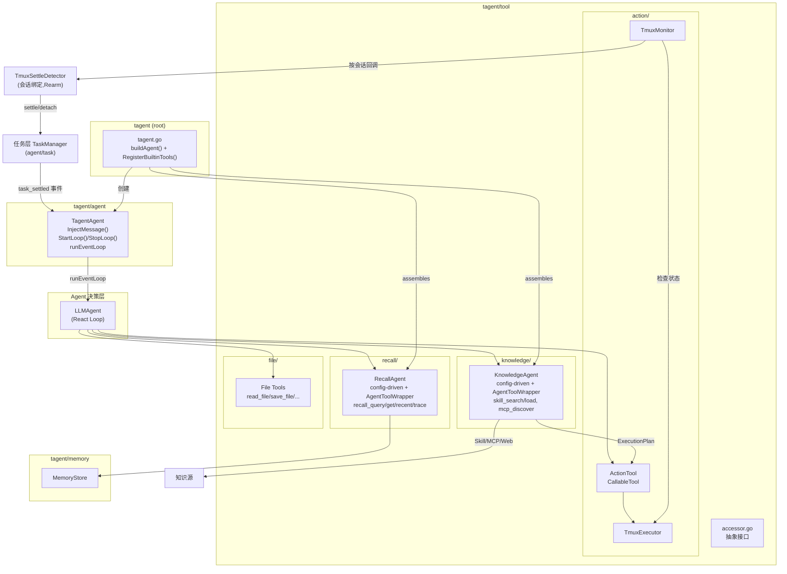
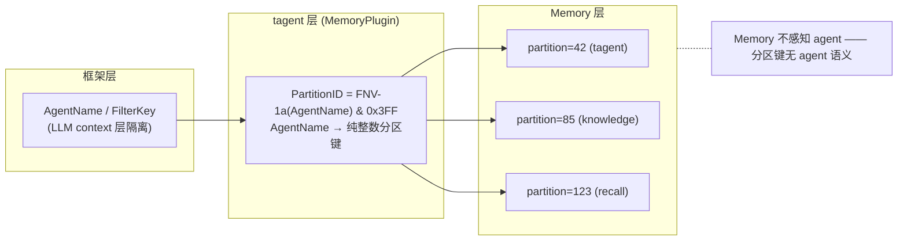
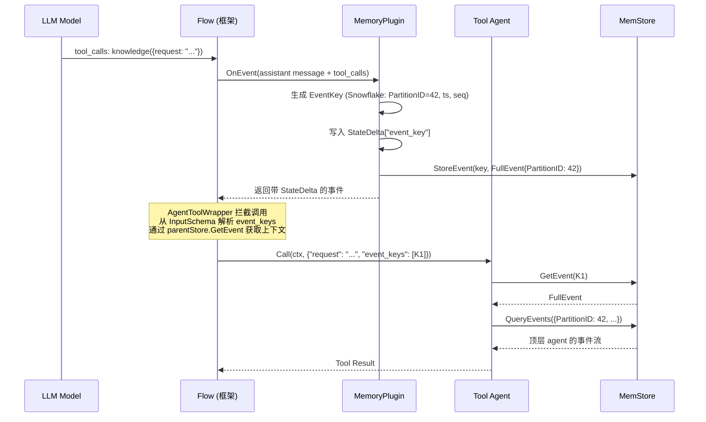
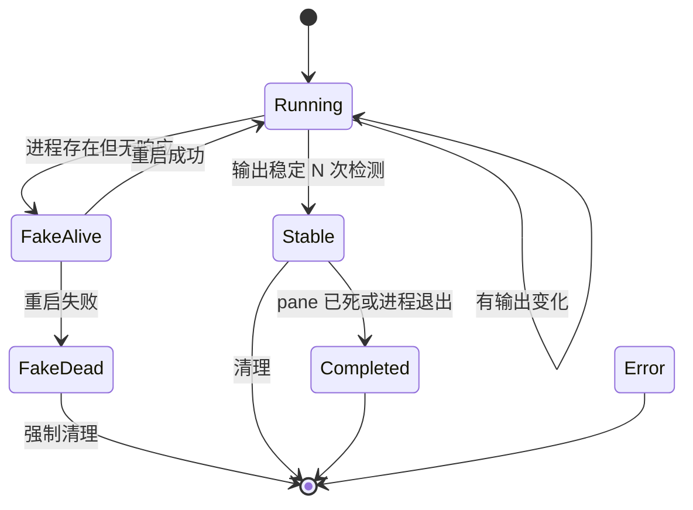
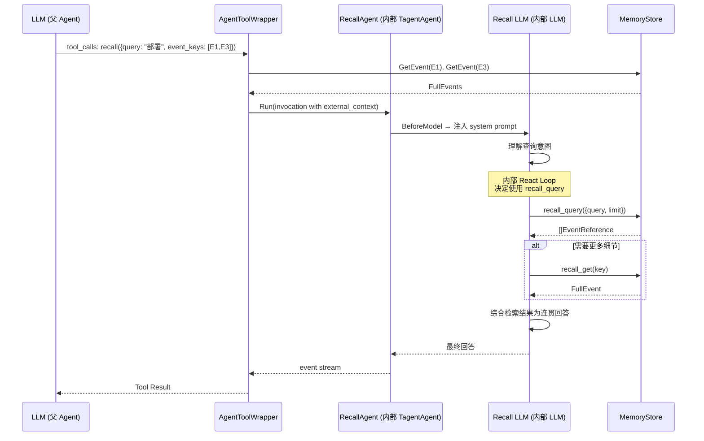
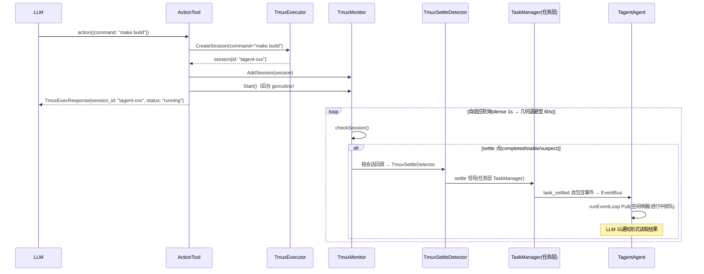
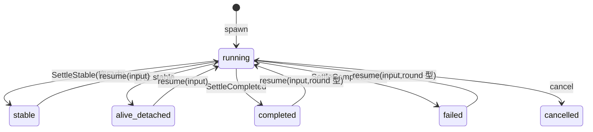

# tagent/tool 模块架构文档

## 一、模块定位

`tagent/tool` 是 tagent 为 trpc-agent-go Runner 提供的一组 **CallableTool 工具实现**，也是 Agent 与外部世界交互的主要通道。

**核心职责**：
- **KnowledgeAgent**：知识获取与翻译 — 发现/理解/翻译能力（Skill/MCP）为可执行计划，实现为 config-driven TagentAgent + AgentToolWrapper 包装
- **RecallAgent**：智能记忆召回 — 使用内部 LLM React 循环理解查询意图，综合历史事件为连贯回答
- **ActionTool**：命令执行（注册 ID `exec`，声明名 `action`，统一走 tmux + 任务层；tmux 不可用时同步降级），纯执行器，不关心命令来源
- **TmuxMonitor**：自适应轮询 tmux session（dense→几何退避），状态变更经按会话回调驱动 `TmuxSettleDetector` → 任务层 settle
- **File Tools**：封装 trpc-agent-go 内置文件操作工具（read_file、save_file 等）
- **memory_recall**：召回标准协议纯函数工具（见 §六）；**任务工具族**（tool/task/）：list/get/cancel/relaunch/resume
- **PlanAgent**（tool/plan/）：openspec 计划管理的双模式子 agent

**设计原则**：
- **职责分离**：理解层（KnowledgeAgent, RecallAgent）和执行层（ActionTool）分离，Agent 负责决策
- **架构统一**：KnowledgeAgent 和 RecallAgent 都是 config-driven TagentAgent 实例 + AgentToolWrapper 包装，复用框架能力
- **按需 React**：KnowledgeAgent 和 RecallAgent 有内部 React 循环；ActionTool 不需要
- **Prompt 文件化**：System prompt 通过 `prompt.Loader` 动态加载
- **配置声明式**：所有 tool 通过 Config + ToolRef 声明，`kind` 区分 agent/tool
- **事件上下文传递**：tool agent 通过父 agent 的 MemStore + `event_keys` 获取完整事件上下文
- **异步任务层（当前）**：`action`（tmux）等长耗时工具经调用上下文注入的 `TaskSpawner` 接入**异步任务层**——settle-or-detach + `task_settled` 回收 turn，ActionTool 本身无状态。详见 `agent-architecture.md` §2.10。（旧的 `MessageInjector` 闭环已移除，见 §8.4 历史注记）
- **统一注册路径**：所有内置工具通过 `RegisterBuiltinTools()` 统一注册为 plain tool

---

## 二、文件清单

### 2.1 包结构（分包后现状）

```
# 根包 (tagent)
├── tagent.go           # New() 工厂：声明式 Config + Option 装配
├── config.go           # Config / AgentConfig / ToolRef / MemoryConfig / CompressConfig
├── registry.go         # ToolRegistry + RegisterBuiltinTools()
├── builtin.go          # 内置 plain tool 工厂（actionFactory + monitor 配置解析）

# agent 包（引擎）+ 子包
agent/
├── tool_agent.go       # AgentToolWrapper + 任务链还原器 + Plain/ToolAgentFactory 注册接口
├── task/               # 任务域（叶子包）：TaskManager/看板/settle 契约/resume/fixture
└── compress/           # 压缩域：SmartCompressor/卡片序列/SessionProjection/TokenCounter

# tool 包
tool/
├── accessor.go          # 抽象接口（MemoryStoreAccessor, SkillRepository）
├── action/              # 命令执行
│   ├── action_tool.go     # ActionTool（tmux + 任务层；resume closure）
│   ├── tmux_executor.go   # tmux 会话管理（创建/SendKeys/capture/孤儿清扫）
│   ├── tmux_monitor.go    # 自适应轮询监控（按会话回调/TouchSession）
│   ├── settle.go          # TmuxSettleDetector（会话绑定,Rearm）+ 三档分类
│   └── poll_schedule.go   # dense→几何退避调度参数
├── recall/              # 召回
│   ├── memory_recall.go   # 召回标准协议（纯函数,items/query 分流）
│   ├── recall_agent.go    # RecallAgent 组装（多跳编排）
│   └── recall_subtools.go # recall_query/get/recent/trace + RegisterSubTools()
├── knowledge/           # 知识获取（knowledge_agent/subtools/websearch）
├── task/                # 任务工具族：list_tasks/get_task_result/cancel/relaunch/resume_task
├── plan/                # PlanAgent（openspec 计划,双模式 Run）
├── file/                # trpc-agent-go 内置文件工具封装
├── speak/ draw/         # stub
```

> 行数不列入文档（必然腐化）；以 `wc -l` 实测为准。

## 三、组件关系总览图



---

## 四、事件上下文传递机制（EventKeys 注入 + 数据隔离）

### 4.0 核心设计

顶层 Agent 直接送 LLM 的 context 是一条**事件组成的记录流**。tool 与顶层 Agent 交互时，需要依赖顶层 Agent 传入的关键 `event_keys` 从 MemStore 中获取完整上下文。

**问题**：tool agent 被调用时，LLM 只能传递文本参数（如 `request`），但 tool agent 需要访问触发其调用的完整事件上下文（因果链、完整事件详情），这需要 `event_keys`。

**设计决策**：tool agent 的 Declaration InputSchema 中声明 `event_keys` 参数（数组），由 `AgentToolWrapper` 从调用参数中解析，通过父级 MemoryStore 获取上下文。

### 4.1 EventKey Snowflake 设计

EventKey 为 Snowflake int64（详见 [memory-architecture.md](../memory/memory-architecture.md) §4.1）。

```
┌────┬─────────────┬──────────────────┬─────────────┬────────────────┐
│ 63 │ 62       53 │ 52            22 │ 21       12 │ 11           0 │
│sign│ PartitionID │   Timestamp      │  Sequence   │   Reserved     │
│ =0 │ (10 bits)   │   (31 bits)      │  (10 bits)  │   (12 bits)    │
└────┴─────────────┴──────────────────┴─────────────┴────────────────┘
```

| 字段 | 位数 | 说明 |
|------|------|------|
| sign | 1 bit | 恒 0（正 key=真实事件；负 key 保留给投影内摘要引用） |
| PartitionID | 10 bits | 存储分区键（0-1023），由 FNV-1a(AgentName) 派生 |
| Timestamp | 31 bits | 秒级时间戳偏移（相对 epoch），可用 ~68 年 |
| Sequence | 10 bits | 同秒内序列号（0-1023） |
| Reserved | 12 bits | 预留位 |

对 LLM/工具的字符串形态统一为 **16 进制**（`event.FormatEventKey/ParseEventKey`）。

### 4.2 Memory 数据隔离设计

**核心原则：Memory 不感知 agent，但从存储角度实现数据隔离。**

- FilterKey 是 trpc-agent-go 框架的概念，属于 LLM context 层面的隔离
- Memory 从**存储分区**角度思考隔离，使用 **PartitionID** 作为分区键
- 框架已有的 **AgentName** 是稳定的 agent 身份标识
- **PartitionID = FNV-1a(AgentName) & 0x3FF**（0-1023），由 MemoryPlugin 在 tagent 层计算



### 4.3 EventKeys 注入流程



### 4.4 EventKeys 注入机制

**注入位置**：MemoryPlugin.OnEvent 处理 assistant 的 tool_call 消息时生成 Snowflake EventKey 并写入 `StateDelta`。

**调用流程**：
1. LLM 输出 tool_calls，选择相关 `event_keys`
2. `AgentToolWrapper.Call` 从参数中解析 `event_keys`（数组）和兼容单数的 `event_key`
3. 通过 `parentStore.GetEvent(key)` 逐个取出完整 `FullEvent`
4. 序列化为 `RuntimeState["external_context"]`
5. 调用 `agent.Run(ctx, inv)`，子 Agent 从 RuntimeState 读取上下文

**Tool Declaration 约束**：
- Agent-kind tool 的声明自动包含 `event_keys` 参数（当 `ToolRef.EventParams` 包含 `event_keys` 时）
- 纯执行器 tool（如 ActionTool、File Tools）不声明此参数

```go
// AgentToolWrapper.Declaration 中 event_keys 的声明（hex 契约）
"event_keys": {
    Type:        "array",
    Description: "[LLM-selected] Array of event keys (canonical hex strings, exactly as shown in [evt_...] prefixes and archive cards) ...",
    Items: &tool.Schema{Type: "string"},
}
```

> 解析侧 `toInt64Key` 以 hex 为第一优先（容忍 `evt_` 前缀回显），十进制仅作老转写兼容——见 `TestToInt64Key_HexContract` 回归。

### 4.5 Tool Agent 使用 EventKeys 获取上下文

Tool agent 收到 `event_keys` 后，可通过 MemoryStore 执行以下操作：

| 操作 | 方法 | 用途 |
|------|------|------|
| 获取触发事件详情 | `GetEvent(eventKey)` | 获取完整的 tool_call 事件内容 |
| 提取分区归属 | `PartitionIDFromEventKey(eventKey)` | 从 EventKey 反推 PartitionID |
| 按分区查询 | `QueryEvents({PartitionID: id})` | 查询同分区的事件流 |
| 追溯因果链 | `RelationStore.GetParent(event.EventKey)` | 获取前驱事件 |
| 跨分区查询 | `QueryEvents({PartitionIDs: [42, 85]})` | 查询顶层+子 agent 事件（PartitionIDs 由 ReadNamespaces 注入） |

### 4.6 远程上下文传递路径

当子 agent 部署为远程 tagent 服务时（`ToolRef.Remote` 配置），上下文传递链路通过 trpc 框架原生的 RuntimeState 机制自动完成：

```
AgentToolWrapper.Call
  → 解析 event_keys → parentStore.GetEvent → FullEvents
  → serializeExternalContext → ExternalContextEntry[] JSON (仅 EventKey/EventType/EventSummary)
  → Invocation.RunOptions.RuntimeState["external_context"] = JSON
  → agent.Run(ctx, inv)
      │
      ├── 本地: TagentAgent.Run 直接读取 RuntimeState
      └── 远程: A2AAgent.Run
            → WithTransferStateKey("external_context")
            → RuntimeState → A2A message.Metadata
            → HTTP 传输
            → A2A Server
            → agent.WithRuntimeState(message.Metadata)
            → RuntimeState → TagentAgent.Run
```

**序列化格式选择**：仅 EventKey + EventType + EventSummary，不含 Content。原因：
1. `injectExternalContext` 只用 EventSummary
2. A2A metadata 有大小限制
3. 远程子 agent 如需完整事件，可通过自身 MemoryStore 查询

---

## 五、工具的 trpc-agent-go 集成

### 5.1 CallableTool 接口

所有 tagent 工具都实现了 `trpc-agent-go/tool.CallableTool` 接口：

```go
// action/action_tool.go
var _ tool.CallableTool = (*ActionTool)(nil)
```

KnowledgeAgent 和 RecallAgent 不是直接的 CallableTool，而是通过 `AgentToolWrapper` 包装：

```go
// agent/tool_agent.go
wrapper := agent.NewAgentToolWrapper(subAgent, desc, tr.EventParams, parentMemStore)
// wrapper 实现 CallableTool 接口
```

接口定义（`trpc-agent-go/tool`）：

```go
type CallableTool interface {
    Declaration() *Declaration   // 返回工具声明
    Call(ctx context.Context, jsonArgs []byte) (any, error)  // 执行工具
}
```

### 5.2 工具注册机制（三阶段生命周期）

tagent 采用**三阶段工具生命周期**：实现层指定 → 注册层注册 → 配置层组织。

**阶段一：实现层**（各子包内）

每个工具包导出工厂函数，实现 `PlainToolFactory` 接口：

```go
// tool/knowledge/knowledge_subtools.go
func skillSearchFactory(cfg agent.PlainToolFactoryConfig) (tool.CallableTool, error) {
    return NewSkillSearchTool(cfg.SkillRepo), nil
}

// tool/recall/recall_subtools.go
func recallQueryFactory(cfg agent.PlainToolFactoryConfig) (tool.CallableTool, error) {
    return NewRecallQueryTool(accessor, cfg.ReadPartitionIDs), nil
}
```

**阶段二：注册层**（registry.go + builtin.go）

`RegisterBuiltinTools()` 统一注册所有内置 plain tool：

```go
// registry.go
func RegisterBuiltinTools() error {
    registerOnce.Do(func() {
        agent.RegisterPlainTool("exec", actionFactory)
        file.RegisterTools()
        knowledge.RegisterSubTools()
        recall.RegisterSubTools()
    })
    return nil
}
```

注册后 ToolRegistry 中可查询的 plain tool：

| Tool ID | 工厂位置 | 说明 |
|---------|---------|------|
| `exec` | builtin.go | ActionTool（shell/tmux 执行） |
| `read_file` | file/file.go | 读取文件 |
| `save_file` | file/file.go | 保存文件 |
| `list_file` | file/file.go | 列出目录 |
| `search_file` | file/file.go | 搜索文件 |
| `search_content` | file/file.go | 搜索内容 |
| `read_multiple_files` | file/file.go | 批量读取 |
| `replace_content` | file/file.go | 替换内容 |
| `skill_search` | knowledge/knowledge_subtools.go | 搜索技能库 |
| `skill_load` | knowledge/knowledge_subtools.go | 加载技能内容 |
| `mcp_discover` | knowledge/knowledge_subtools.go | 发现 MCP 工具 |
| `web_search` | knowledge/knowledge_subtools.go | 搜索通用网页 |
| `duckduckgo_search` | knowledge/knowledge_subtools.go | DuckDuckGo 事实搜索 |
| `memory_query` | knowledge/knowledge_subtools.go | 查询历史知识记录 |
| `recall_query` | recall/recall_subtools.go | 按条件检索事件 |
| `recall_get` | recall/recall_subtools.go | 获取完整事件详情 |
| `recall_recent` | recall/recall_subtools.go | 快速获取最近事件 |
| `recall_trace` | recall/recall_subtools.go | 因果链回溯 |

**阶段三：配置层**（YAML AgentConfig.Tools）

每个 agent 通过 `Tools []ToolRef` 声明使用哪些工具：

```yaml
agents:
  tagent:
    tools:
      - agent: knowledge
        description_file: knowledge_tool_desc.md
        event_params: [event_keys]
      - agent: recall
        description_file: recall_tool_desc.md
        event_params: [event_keys]
      - kind: tool
        id: exec
        description_file: action_tool_desc.md
      - kind: tool
        id: read_file
        description_file: read_file_tool_desc.md
        properties:
          base_dir: "./workspace"
  knowledge:
    tools:
      - kind: tool
        id: skill_search
      - kind: tool
        id: skill_load
      # ... 共 6 个 plain tools
  recall:
    tools:
      - kind: tool
        id: recall_query
      # ... 共 4 个 plain tools
```

**构建路径**（`tagent.go:buildToolFromRef`）：

```
ToolRef (kind=agent) → buildAgentToolRef → buildAgent() 递归创建子 Agent → AgentToolWrapper 包装
ToolRef (kind=tool)  → buildPlainToolRef → ToolRegistry.GetPlainToolFactory(id) → factory(PlainToolFactoryConfig) → CallableTool
```

`PlainToolFactoryConfig` 携带运行时依赖（MemStore、SkillRepo、MCPToolSets、ReadPartitionIDs、Properties），由 `buildPlainToolRef` 从当前 agent 的上下文注入。

---

## 六、召回体系：memory_recall（协议入口）+ RecallAgent（多跳编排）

### 6.0 memory_recall — 召回标准协议（纯函数，主 agent 直持）

**文件**：`tool/recall/memory_recall.go`。索引卡即召回票据，按输入形态分流：

| 输入形态 | 路径 | 特性 |
|---|---|---|
| `items=[{key,hint?}]` | 批量 `GetEvent` 精确回补（原序） | 零幻觉；未命中显式 `miss`；hint 回显对账；items 优先 |
| `query`(+since/until/event_types) | `QueryOptions` 关键词检索 | 检索层可独立演进（→向量），入口协议不变 |

确定性路径上无 LLM 中间层；滚动压缩摘要卡片行里的 `[hex]` key 可直接抠出构造 items。

### 6.1 RecallAgent — 复杂检索与多跳编排（定位收窄）

RecallAgent 使用内部 LLM React 循环理解查询意图，综合历史事件为连贯回答——适用于多跳因果追溯（trace）、跨轮收窄等复杂场景；简单精确/关键词召回请走 memory_recall。

**设计决策**：RecallAgent 使用 config-driven TagentAgent + AgentToolWrapper 包装架构（与 KnowledgeAgent 统一），而非简单的 CallableTool。理由：需要 LLM 理解查询意图、综合多个子工具结果、提供结构化的记忆摘要。

### 6.2 配置结构

```go
// recall/recall_agent.go
type Config struct {
    Model             model.Model
    MemStore          tagentpkg.MemoryStoreAccessor
    ReadPartitionIDs  []int
    PromptDir         string
    Prompt            PromptConfig
    Description       string
    DescriptionFile   string
    MaxToolIterations int   // 默认：5
    MaxTokens         int   // 默认：4096
}
```

### 6.3 子工具注册

子工具通过 `RegisterSubTools()` 统一注册为 plain tool：

| 子工具 | 工厂函数 | 说明 |
|--------|---------|------|
| `recall_query` | `recallQueryFactory(cfg)` | 按查询条件检索事件列表，支持时间范围过滤，自动注入 `ReadPartitionIDs` |
| `recall_get` | `recallGetFactory(cfg)` | 根据 event_key 获取完整事件详情，支持 `include_parent` |
| `recall_recent` | `recallRecentFactory(cfg)` | 快速获取最近的 N 条事件，自动注入 `ReadPartitionIDs` |
| `recall_trace` | `recallTraceFactory(cfg)` | 沿 RelationStore 因果链回溯，最多 20 步 |

### 6.4 构建路径

RecallAgent 与 KnowledgeAgent 一致走 config-driven 路径：

```
tagent.New()
  → buildAgent("recall", recallCfg, ...)
    → 从 recallCfg.Tools 构建 4 个 plain tool
    → 每个 plain tool 从 ToolRegistry.GetPlainToolFactory(id) 创建
    → PlainToolFactoryConfig 携带 MemStore + ReadPartitionIDs
  → buildAgentToolRef() 用 AgentToolWrapper 包装为 CallableTool
```

---

## 七、KnowledgeAgent — 知识获取与翻译

### 7.1 核心职责

KnowledgeAgent 发现和加载外部技能文件（skills 目录中的 .md 等文件），并将能力描述翻译为 ExecutionPlan。

**设计原则**：
- **理解层，非执行层**：KnowledgeAgent 负责"理解"技能，执行由 ActionTool 负责
- **架构统一**：TagentAgent 实例 + AgentToolWrapper 包装

**AgentToolWrapper.Call() 实现要点**：
1. 从 `args` 中解析 `event_keys` 参数（`[]int64`）
2. 通过 `parentStore.GetEvent(key)` 逐个获取完整 `FullEvent`
3. 序列化为 `RuntimeState["external_context"]`，通过 `agent.Run(ctx, inv)` 传递给子 Agent
4. `Response.Clone()` 防御层：确保子 Agent 读取的 Response 与 Session 存储的 Response 不共享指针
5. 提取 `finalOutput`（子 Agent 最后一个 `agent_output` 事件的内容）作为 tool result 返回给顶层 LLM

### 7.2 构建路径（config-driven）

```
tagent.New()
  → buildAgent("knowledge", knowledgeCfg, ...)
    → 从 knowledgeCfg.Tools 列表构建 6 个 plain tool
    → 每个 plain tool 从 ToolRegistry.GetPlainToolFactory(id) 创建
    → 创建 TagentAgent + 6 个 plain tool
  → buildAgentToolRef() 用 AgentToolWrapper 包装为 CallableTool
```

**子工具声明**（`DefaultConfig()` 中 knowledge agent 的 Tools）：

```go
"knowledge": {
    Tools: []ToolRef{
        {Kind: ToolKindTool, ID: "skill_search"},
        {Kind: ToolKindTool, ID: "skill_load"},
        {Kind: ToolKindTool, ID: "mcp_discover"},
        {Kind: ToolKindTool, ID: "web_search"},
        {Kind: ToolKindTool, ID: "duckduckgo_search"},
        {Kind: ToolKindTool, ID: "memory_query"},
    },
}
```

### 7.3 子工具注册

| 子工具 | 工厂函数 | 说明 |
|--------|---------|------|
| `skill_search` | `skillSearchFactory(cfg)` | 搜索本地技能库 |
| `skill_load` | `skillLoadFactory(cfg)` | 加载技能完整内容 |
| `mcp_discover` | `mcpDiscoverFactory(cfg)` | 发现 MCP 工具 |
| `duckduckgo_search` | `duckDuckGoSearchFactory(cfg)` | 搜索事实性知识 |
| `web_search` | `webSearchFactory(cfg)` | 搜索通用网页内容 |
| `memory_query` | `memoryQueryFactory(cfg)` | 查询历史知识记录 |

### 7.4 Prompt 文件化

System prompt 存储在 `resources/prompts/knowledge_agent.md`：
- 通过 `prompt.Loader` 动态加载
- 包含工具使用指南、exec-plan 规范、执行原则
- 支持运行时更新

---

## 八、ActionTool — 命令执行

### 8.1 执行模型（tmux + 任务层）

ActionTool 是**无状态执行器**：`Call` 创建 tmux 会话与会话绑定的 `TmuxSettleDetector`，经调用上下文注入的 `TaskSpawner` spawn 为任务——dense 窗口内结算则内联返回，越窗返回 ACK（含 task id），后台结算经 `task_settled` 事件回收 turn。

| 路径 | 条件 | 行为 |
|------|------|------|
| 任务层（主路径） | ctx 内有 TaskSpawner | spawn + settle-or-detach（见 `agent-architecture.md` §2.10） |
| 同步兜底 | 无 spawner（独立使用/无任务层） | 阻塞等待首个 settle 或 ctx 取消 |

注册 ID 为 `exec`、Declaration Name 为 `action`（见 §13.7）；不存在独立的 `tmux_exec` 工具。resume 走同一 detector 的 `Rearm`（见 §十四）。

### 8.1.1 Properties 配置

`exec`（ActionTool）通过 `ToolRef.Properties` 接收以下配置：

| 字段 | 类型 | 说明 |
|------|------|------|
| `workspace` | string | 命令工作目录；**默认继承进程运行目录**（与 file tools 的相对路径基准一致，避免路径分裂诱发模型幻觉） |
| `run_as_user` | string | 通过 `sudo -u` 执行命令时使用的用户 |
| `run_as_group` | string | 通过 `sudo -g` 执行命令时使用的用户组 |

```yaml
tools:
  - kind: tool
    id: exec
    description_file: action_tool_desc.md
    properties:
      run_as_user: tagent-runner
      run_as_group: tagent-runner
```

> 另：大输出经 `WithActionOutputDir` 落盘 `tool-output/`；启动时 `CleanupOrphanSessions` 按前缀清扫上代孤儿会话（可经 `WithOrphanCleanupDisabled` 关闭，多实例共用 tmux server 时用独立前缀）。

### 8.2 ActionTool 的组合结构

```go
// action/action_tool.go
type ActionTool struct {
    workspace     string
    runAsUser     string
    runAsGroup    string
    description   string
    outputDir     string         // 大输出落盘目录（tool-output/）
    tmuxExecutor  *TmuxExecutor
    tmuxMonitor   *TmuxMonitor
    monitorConfig *MonitorConfig // 可选覆盖
    orphanCleanupDisabled bool   // 跳过启动孤儿清扫（多实例场景）
    closeOnce     sync.Once
}
```

### 8.3 Declaration

```go
// action/action_tool.go:138-166
func (ct *ActionTool) Declaration() *tool.Declaration {
    return &tool.Declaration{
        Name:        "action",
        Description: ct.description,
        InputSchema: &tool.Schema{
            Type: "object",
            Properties: map[string]*tool.Schema{
                "command": {Type: "string", Description: "..."},
                "work_dir": {Type: "string", Description: "..."},
                "env": {Type: "object", AdditionalProperties: true},
                "is_tui": {Type: "boolean", Description: "..."},
            },
            Required: []string{"command"},
        },
    }
}
```

> **注意**：工具在注册表中 ID 为 `exec`，但 LLM 看到的工具名是 `action`。

### 8.4 生命周期钩子

- **启动**：`NewActionTool` 若 tmux 可用则创建 executor/monitor，并执行**孤儿会话清扫**（`CleanupOrphanSessions`，上代实例残留按前缀回收——每个孤儿占一个 pty）。
- **关闭**：`Close()` 停止 monitor 并**收编全部存活会话**（优雅退出不留孤儿）。
- **会话回收**：completed/error 即 kill 会话；服务型 alive-detached 会话由 cancel/进程死亡结束。

> 历史注记：早期的 `MessageInjector` 闭环（ActionTool 直接向 EventBus 注入消息）与同步 `ActionExecutor`（`sh -c` 直接执行）已在任务层重构中移除，相应代码已删除；本文档不再保留其代码留存。

## 九、TmuxMonitor — 状态监控

### 9.1 监控状态机



### 9.2 状态常量

```go
// action/tmux_executor.go
const (
    SessionRunning   SessionStatus = "running"
    SessionStable    SessionStatus = "stable"
    SessionCompleted SessionStatus = "completed"
    SessionError     SessionStatus = "error"
    SessionFakeDead  SessionStatus = "fake_dead"
    SessionFakeAlive SessionStatus = "fake_alive"
)
```

### 9.3 detectSessionState — 状态检测逻辑

```go
// action/tmux_monitor.go
func (tm *TmuxMonitor) detectSessionState(session *TmuxSession) SessionStatus {
    processExists := tm.executor.ProcessExists(session.ID)
    isPaneDead := tm.executor.IsPaneDead(session.ID)
    currentMD5 := md5.Sum([]byte(currentOutput))

    if processExists && !isPaneDead {
        if currentMD5 == session.LastOutputMD5 {
            session.StableCount++
        } else {
            session.StableCount = 0
        }
    }

    if !processExists || isPaneDead {
        return SessionCompleted
    }
    if session.StableCount >= threshold {
        return SessionStable
    }
    return SessionRunning
}
```

### 9.4 FakeAlive / FakeDead 处理

| 状态 | 触发条件 | 处理方式 |
|------|---------|---------|
| `fake_alive` | 进程存在、pane 存活、输出稳定超过阈值，但心跳有响应 | 重启 session |
| `fake_dead` | 进程存在、pane 存活、输出稳定超过阈值，心跳也无响应 | 强制 kill session |

### 9.5 配置参数

```go
// action/tmux_monitor.go
func DefaultMonitorConfig() MonitorConfig {
    return MonitorConfig{
        Interval:                  3 * time.Second,   // 基础轮询节奏（自适应调度基础上限见 poll_schedule）
        StableDuration:            60 * time.Second,  // 输出稳定判定
        InteractiveStableDuration: 90 * time.Second,  // TUI 会话稳定判定
        FakeDeadDuration:          150 * time.Second, // 假死判定
        HeartbeatCommand:          "echo ping",
        HeartbeatTimeout:          5 * time.Second,
    }
}

// 自适应轮询叠加参数（poll_schedule.go）：DenseInterval 1s / DenseDuration 10s /
// BackoffFactor 2 / MaxInterval 60s——dense→sparse 边界即同步→异步 ack 点。
```

---

## 十、TmuxExecutor — Tmux Session 管理

### 10.1 核心操作

| 方法 | 说明 |
|------|------|
| `CreateSession(opts)` | 创建 detached tmux session |
| `KillSession(id)` | 终止 session |
| `SessionExists(id)` | 检查 session 是否存在 |
| `GetSessionOutput(id)` | 捕获 pane 内容 |
| `IsPaneDead(id)` | 检查 pane 是否已死 |
| `ProcessExists(id)` | 检查主进程是否存活 |
| `SendHeartbeat(id)` | 发送心跳检测 |
| `RestartSession(id, opts)` | 重启 session |
| `SendKeys(id, keys)` | 向 session 发送按键 |

### 10.2 Session 唯一命名

```go
// action/tmux_executor.go
func (te *TmuxExecutor) CreateSession(...) (*TmuxSession, error) {
    sessionName := fmt.Sprintf("%s-%d", te.prefix, time.Now().UnixNano())
    // prefix 默认值："tagent"
}
```

---

## 十一、File Tools — 文件操作工具

### 11.1 定位

`tool/file` 封装 trpc-agent-go 内置文件操作工具，作为 plain tool 注册到 ToolRegistry，可直接在 YAML 中引用。

### 11.2 注册的 8 个工具

| Tool ID | 说明 |
|---------|------|
| `read_file` | 读取文件内容 |
| `save_file` | 保存文件 |
| `list_file` | 列出目录内容 |
| `search_file` | 按文件名搜索 |
| `search_content` | 按内容搜索 |
| `read_multiple_files` | 批量读取文件 |
| `replace_content` | 替换文件内容 |

### 11.3 Properties 配置

| 字段 | 类型 | 说明 |
|------|------|------|
| `base_dir` | string | 文件操作的根目录（默认当前工作目录 `.`） |

```yaml
tools:
  - kind: tool
    id: read_file
    description_file: read_file_tool_desc.md
    properties:
      base_dir: "./workspace"
```

### 11.4 实现方式

`file.NewToolSet(baseDir)` 创建 trpc-agent-go 内置 file toolset，`makeFileToolFactory` 根据工具名从 toolset 中取出对应的 `CallableTool`。

---

## 十二、完整数据流

### 12.1 RecallTool 完整数据流



### 12.2 ActionTool（tmux + 任务层）完整数据流



---

## 十三、关键设计决策

### 13.1 为什么 RecallAgent 和 KnowledgeAgent 都需要内部 LLM React 循环？

| 工具 | 内部 React | 实现方式 | 理由 |
|------|-----------|---------|------|
| **RecallAgent** | 需要 | config-driven TagentAgent + AgentToolWrapper | 4 种 plain tool 协作，需要 LLM 理解查询意图、综合结果 |
| **KnowledgeAgent** | 需要 | config-driven TagentAgent + AgentToolWrapper | 6 种 plain tool 协作，LLM 翻译能力为 ExecutionPlan |
| **ActionTool** | 不需要 | CallableTool (PlainToolFactory) | 纯执行器，无决策需求 |
| **File Tools** | 不需要 | CallableTool (PlainToolFactory) | 纯执行器 |

判断标准：需要"思考-行动-观察"循环 → TagentAgent + AgentToolWrapper；单一功能/执行器 → 简单 CallableTool。

### 13.2 为什么 KnowledgeAgent 和 RecallAgent 是 config-driven？

| 维度 | 旧架构（ToolAgentFactory） | 新架构（config-driven） |
|------|---------------------------|------------------------|
| knowledge/recall 创建 | 注册 `RegisterToolAgent("knowledge", factory)` | `buildAgent()` 通用路径 |
| 子工具注册 | 在 factory 内部硬编码组装 | `RegisterSubTools()` 注册为 plain tool |
| 子工具配置 | 不可配置 | YAML 声明式 |
| 扩展性 | 需修改 factory 代码 | 只需在 YAML 中添加 tool ref |

### 13.3 为什么 tool 参数必须包含 event_keys？

| 对比项 | 无 event_keys | 有 event_keys |
|--------|--------------|---------------|
| **上下文获取** | 只能依赖 LLM 传的文本 | 可从 MemStore 获取完整事件上下文 |
| **因果链追溯** | 无法追溯 | 通过 RelationStore 追溯事件脉络 |
| **LLM 依赖** | 完全依赖 LLM 传参 | AgentToolWrapper 自动解析 |

**注入时机**：
1. MemoryPlugin.OnEvent 生成 `event_key` 并写入 StateDelta
2. ContextManager.InjectEventKeys 为消息添加 `[evt_<KEY>|<type>]` 前缀
3. LLM 选择相关 `event_keys` 作为 tool 参数传递
4. AgentToolWrapper.Call 解析 `event_keys`，通过 `parentStore.GetEvent` 获取完整事件数据

### 13.4 为什么 TmuxMonitor 用 callback 而不是 channel？

**决策**：callback 让 TagentAgent 完全控制如何触发新迭代（通过 `InjectMessage`）。

| 方案 | 优点 | 缺点 |
|------|------|------|
| **callback（tagent 选型）** | TagentAgent 完全控制触发逻辑 | 调用方需保存引用 |
| channel | 解耦更彻底 | 需要额外的 goroutine 消费 channel |

TagentAgent 需要在 callback 中注入 `RoleSystem` 消息到 EventBus，使用 callback 比 channel 更直接。

### 13.5 为什么用 RuntimeState 而非 struct 字段传递上下文？

**设计决策**：AgentToolWrapper 通过 `Invocation.RunOptions.RuntimeState["external_context"]` 传递外部事件上下文。

| 对比项 | struct 字段 | RuntimeState |
|--------|------------|-------------|
| **本地调用** | 进程内有效 | 直接读取 |
| **远程调用** | 无法跨越 A2A 边界 | 自动映射到 A2A metadata |
| **额外代码** | 需要 ProcessMessageHook | 零额外代码 |

### 13.6 为什么 AgentToolWrapper 持有 agent.Agent 接口而非 *TagentAgent？

**设计决策**：`AgentToolWrapper.agent` 字段类型为 `agent.Agent`（接口）。

**理由**：
1. `TagentAgent` 已实现 `agent.Agent` 接口
2. `a2aagent.A2AAgent` 也实现 `agent.Agent` 接口
3. Wrapper 只需调用 `agent.Run(ctx, inv)`，不关心是本地还是远程
4. 统一接口消除了本地/远程的代码分支

### 13.7 为什么 exec 工具注册 ID 是 exec，但 Declaration Name 是 action？

**设计决策**：
- 注册表 ID `exec`：标识这是一个执行器工具，在 YAML 配置中使用 `id: exec`
- LLM 看到的工具名 `action`：语义上表示"执行行为动作"，与执行器职责一致

```yaml
tools:
  - kind: tool
    id: exec                 # 注册表 ID
    description_file: action_tool_desc.md
```

LLM 调用时使用 `action` 作为 tool name：

```json
{"name": "action", "arguments": {"command": "ls -la"}}
```

## 十四、任务重入（resume_task）与会话回收

### resume 状态机



合法源状态按**轮次边界**定义（存活类=会话重入；完成态=round 型执行器自然续行点），running/suspect/cancelled 拒绝并引导。并发 resume 占坑单胜（task.mu 内置 running 再调 ResumeFn，失败回滚）。

### 特异出入口

| 执行器 | resume 实现 | 关键机制 |
|---|---|---|
| tmux | 同一 detector `Rearm(baseline)` + `SendKeys` | detector 绑会话而非轮次——回调/watch 永不换手，零换绑零竞态；输出=基线后增量；TouchSession 重回 dense 轮询；TUI 拒绝 |
| subagent | 新 Run + 任务链还原器 | 本任务前序轮次链（上次 settle 结果为首，`resume_context_rounds` 封顶）注入 external_context；只含本任务内容；无进程复活 |

任务层 `detector != task.detector` 一行区分两形态：同 detector 不退役 watch；新 detector 走 watchDone 退役（防泄漏与陈旧信号串轮）。

### 会话回收闭环

| 时机 | 机制 |
|---|---|
| 运行时 | completed/error → 自动 kill session |
| 优雅退出 | `ActionTool.Close()` 收编 monitor 内全部存活 session |
| 崩溃/强杀后 | 下次启动 `CleanupOrphanSessions()` 按前缀清扫孤儿（每个孤儿占一个 pty，实机曾因此耗尽系统 pty 池）；多实例场景 `WithOrphanCleanupDisabled` 或独立前缀 |


---

## 已知缺口与演进方向

> 本章主动声明当前设计尚未闭合的环——供使用者评估适用边界，也供外部分析引用。

| 缺口 | 现状与防线 | 候选方向 |
|------|-----------|---------|
| **action 成功空输出无明确文案** | exit 0 且无输出时返回内容不明确，模型可能误判失败而重发（实机：探测命令 15 连发撞迭代上限） | 返回"命令成功，无输出"显式文案（一行改动，待做） |
| **长文档任务迭代预算** | PlanAgent 等写作型任务轮次消耗大，撞上限时无收尾机会（见 agent 篇收尾轮缺口） | 收尾轮机制 / 写作型任务独立预算 |
| **tmux 不可用时的同步兜底无任务层语义** | 降级路径可执行命令但无 resume/看板/后台通知 | 明确文档化为受限模式（已声明）；不投入补齐 |
| **websearch 可靠性** | duckduckgo 无鉴权接口，限流/结构变化敏感 | 多 provider 回退链 |
| **路径沙箱只覆盖 file 工具族** | file 工具 `base_dir` 是真沙箱（上游 ToolSet 拒绝 `../` 与绝对路径，已实证）；**exec 是 shell 全权**，无法工具级限制写路径——目录级禁写（如 plan 仅限 openspec/）依赖 prompt 禁令 + 部署层容器只读根兜底 | exec 增加可选 allowlist 包装（受限模式） |
