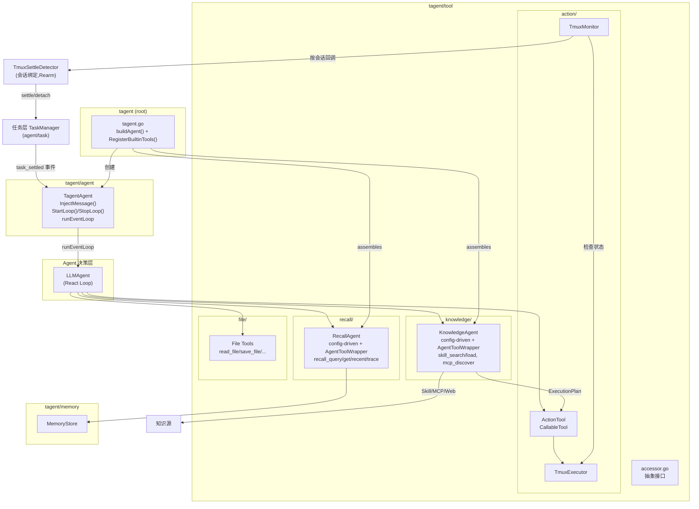
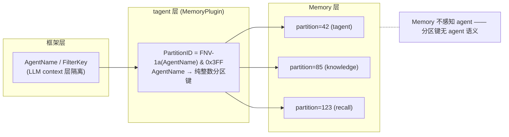
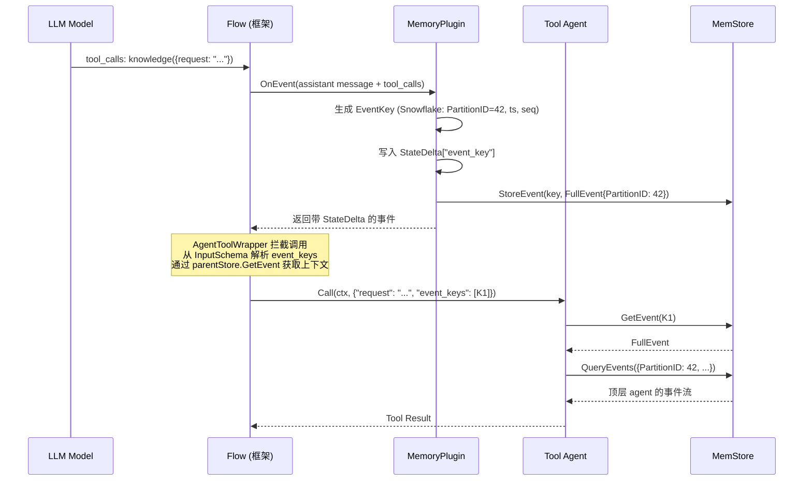
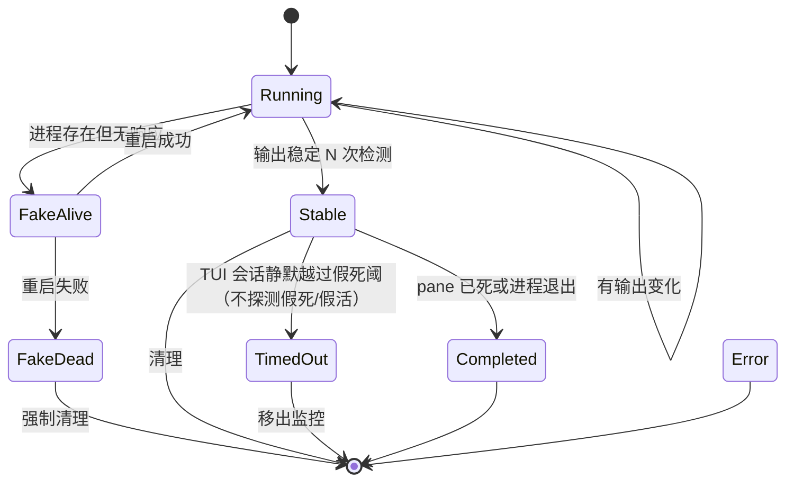
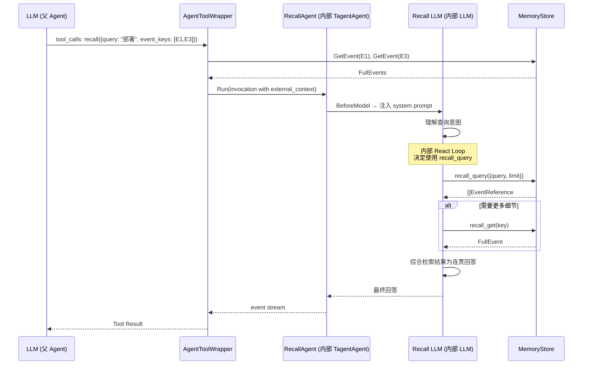
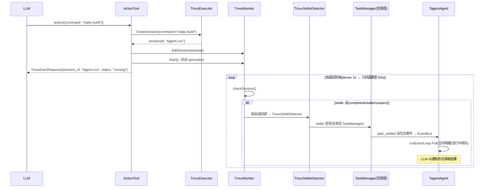
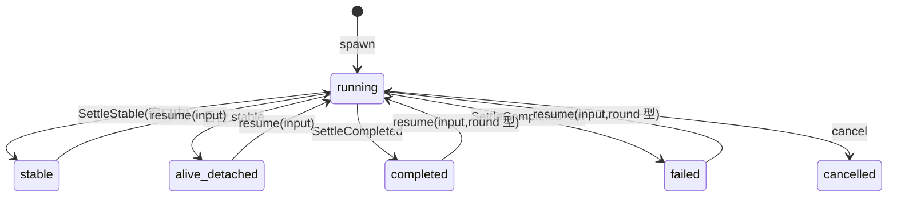

# tagent/tool 模块架构文档

## 一、模块定位

`tagent/tool` 是 tagent 为 trpc-agent-go Runner 提供的一组 **CallableTool 工具实现**，也是 Agent 与外部世界交互的主要通道。

**核心职责**：
- **KnowledgeAgent**：知识获取与翻译 — 发现/理解/翻译能力（Skill/MCP）为可执行计划，实现为 config-driven TagentAgent + AgentToolWrapper 包装
- **RecallAgent**：智能记忆召回 — 使用内部 LLM React 循环理解查询意图，综合历史事件为连贯回答
- **ActionTool**：命令执行（注册 ID `exec`，声明名 `action`，统一走 tmux + 任务层；tmux 不可用时同步降级），纯执行器，不关心命令来源
- **TmuxMonitor**：自适应轮询 tmux session（dense→几何退避），状态变更经按会话回调驱动 `TmuxSettleDetector` → 任务层 settle
- **File Tools**：封装 trpc-agent-go 内置文件操作工具（read_file、save_file 等）
- **recall**：统一召回入口（纯函数参数路由：items 票据/turn_key 因果链/query 检索/orchestrate 保留形态，见 §六）；**任务工具族**（tool/task/）：list/cancel/relaunch/resume（结果消费不走专用工具：小结果随 settle 内联，大结果转储文件经 read_file 分页）
- **PlanAgent**（tool/plan/）：openspec 计划管理的双模式子 agent（交互契约见 §5.y）

**设计原则**：
- **职责分离**：理解层（KnowledgeAgent, RecallAgent）和执行层（ActionTool）分离，Agent 负责决策
- **架构统一**：KnowledgeAgent 和 RecallAgent 都是 config-driven TagentAgent 实例 + AgentToolWrapper 包装，复用框架能力
- **按需 React**：KnowledgeAgent 和 RecallAgent 有内部 React 循环；ActionTool 不需要
- **Prompt 文件化**：System prompt 通过 `prompt.Loader` 动态加载
- **配置声明式**：所有 tool 通过 Config + ToolRef 声明，`kind` 区分 agent/tool
- **事件上下文传递**：tool agent 通过父 agent 的 MemStore + `event_keys` 获取完整事件上下文
- **异步任务层（当前）**：`action`（tmux）等长耗时工具经调用上下文注入的 `TaskSpawner` 接入**异步任务层**——settle-or-detach + `task_settled` 回收 turn，ActionTool 本身无状态。详见 `agent-architecture.md` §2.10。（旧的 `MessageInjector` 闭环已移除，见 §8.4 历史注记）
- **统一注册路径**：所有内置工具通过 `RegisterBuiltinTools()` 统一注册为 plain tool

---

## 二、文件清单

### 2.1 包结构（分包后现状）

```
# 根包 (tagent)
├── tagent.go           # New() 工厂：声明式 Config + Option 装配
├── config.go           # Config / AgentConfig / ToolRef / MemoryConfig（含 Lifecycle/MemoryEngine/Embedding）
│                       #   / CompressConfig / MeditationConfig / ProviderConfig / MCPServerConfig
│                       #   / GovernanceConfig / EvolutionConfig / ReliabilityConfig；WorkingDir 统一工作根
├── registry.go         # ToolRegistry + RegisterBuiltinTools()
├── builtin.go          # 内置 plain tool 工厂（actionFactory + monitor 配置解析 + WorkingDir→exec cwd 回退）

# agent 包（引擎）+ 子包
agent/
├── tool_agent.go       # AgentToolWrapper + 任务链还原器 + Plain/ToolAgentFactory 注册接口
├── task/               # 任务域（叶子包）：TaskManager/看板/settle 契约/resume/fixture
└── compress/           # 压缩域：SmartCompressor/卡片序列/SessionProjection/TokenCounter

# tool 包
tool/
├── accessor.go          # 抽象接口（MemoryStoreAccessor, SkillRepository）
├── action/              # 命令执行
│   ├── action_tool.go     # ActionTool（tmux + 任务层；resume closure）
│   ├── tmux_executor.go   # tmux 会话管理（创建/SendKeys/capture/孤儿清扫）
│   ├── tmux_monitor.go    # 自适应轮询监控（按会话回调/TouchSession）
│   ├── settle.go          # TmuxSettleDetector（会话绑定,Rearm）+ 三档分类
│   └── poll_schedule.go   # dense→几何退避调度参数
├── recall/              # 召回
│   ├── recall.go          # 统一召回入口（参数即路由：items/turn_key/query/orchestrate，stable-context-compaction D7）
│   ├── memory_recall.go   # 召回协议实现（recall 的 items/query 路由目标，纯函数）
│   ├── recall_agent.go    # RecallAgent 组装（orchestrate 分支内部编排引擎）
│   └── recall_subtools.go # recall_query/get/recent/trace + walkTurnChain + 统一注册（memory_recall/memory_turn 注册名已退役）
├── knowledge/           # 知识获取（knowledge_agent/subtools/websearch/query_error 信号）
├── mcp/                 # MCP server Registry（YAML mcp_servers + mtime 热同步）+ mcp_call 网关（声明恒定）
├── memoryx/             # 记忆策展工具（memory_consolidate 服务端指纹 / memory_health 维度诊断）
├── task/                # 任务工具族：list_tasks/cancel/relaunch/resume_task（结果消费经 settle 内联/转储文件+read_file，无专用查询工具）
├── plan/                # PlanAgent（openspec 计划,双模式 Run）
├── spec/                # spec 工具：类型化计划管理（op 白名单,openspec 后端可替换,无 shell）
├── file/                # trpc-agent-go 内置文件工具封装
```

> 行数不列入文档（必然腐化）；以 `wc -l` 实测为准。

## 三、组件关系总览图


```mermaid
graph TB
    subgraph "tagent (root)"
        KA["tagent.go\nbuildAgent() + RegisterBuiltinTools()"]
    end

    subgraph "tagent/agent"
        TA["TagentAgent\nInjectMessage()\nStartLoop()/StopLoop()\nrunEventLoop"]
    end

    subgraph "tagent/tool"
        subgraph "recall/"
            RA["RecallAgent\nconfig-driven + AgentToolWrapper\nrecall_query/get/recent/trace"]
        end
        subgraph "knowledge/"
            KT["KnowledgeAgent\nconfig-driven + AgentToolWrapper\nskill_search/load, mcp_discover"]
        end
        subgraph "action/"
            CT["ActionTool\nCallableTool"]
            TE["TmuxExecutor"]
            TM["TmuxMonitor"]
        end
        subgraph "file/"
            FT["File Tools\nread_file/save_file/..."]
        end
        AC["accessor.go\n抽象接口"]
    end

    subgraph "tagent/memory"
        MS["MemoryStore"]
    end

    subgraph "Agent 决策层"
        LLMA["LLMAgent\n(React Loop)"]
    end

    LLMA --> RA
    LLMA --> KT
    LLMA --> CT
    LLMA --> FT

    RA --> MS
    KT -->|Skill/MCP/Web| SRC["知识源"]
    KT -->|ExecutionPlan| CT
    CT --> TE
    TM -->|检查状态| TE
    TM -->|按会话回调| SD["TmuxSettleDetector\n(会话绑定,Rearm)"]
    SD -->|settle/detach| TL["任务层 TaskManager\n(agent/task)"]
    TL -->|task_settled 事件| TA
    TA -->|runEventLoop| LLMA
    KA -->|创建| TA
    KA -->|assembles| RA
    KA -->|assembles| KT
```

---

## 四、事件上下文传递机制（EventKeys 注入 + 数据隔离）

### 4.0 核心设计

顶层 Agent 直接送 LLM 的 context 是一条**事件组成的记录流**。tool 与顶层 Agent 交互时，需要依赖顶层 Agent 传入的关键 `event_keys` 从 MemStore 中获取完整上下文。

**问题**：tool agent 被调用时，LLM 只能传递文本参数（如 `request`），但 tool agent 需要访问触发其调用的完整事件上下文（因果链、完整事件详情），这需要 `event_keys`。

**设计决策**：tool agent 的 Declaration InputSchema 中声明 `event_keys` 参数（数组），由 `AgentToolWrapper` 从调用参数中解析，通过父级 MemoryStore 获取上下文。

### 4.1 EventKey Snowflake 设计

EventKey 为 Snowflake int64（详见 [memory-architecture.md](../memory/memory-architecture.md) §4.1）。

```
┌────┬─────────────┬──────────────────┬─────────────┬────────────────┐
│ 63 │ 62       53 │ 52            22 │ 21       12 │ 11           0 │
│sign│ PartitionID │   Timestamp      │  Sequence   │   Reserved     │
│ =0 │ (10 bits)   │   (31 bits)      │  (10 bits)  │   (12 bits)    │
└────┴─────────────┴──────────────────┴─────────────┴────────────────┘
```

| 字段 | 位数 | 说明 |
|------|------|------|
| sign | 1 bit | 恒 0（正 key=真实事件；负 key 保留给投影内摘要引用） |
| PartitionID | 10 bits | 存储分区键（0-1023），由 FNV-1a(AgentName) 派生 |
| Timestamp | 31 bits | 秒级时间戳偏移（相对 epoch），可用 ~68 年 |
| Sequence | 10 bits | 同秒内序列号（0-1023） |
| Reserved | 12 bits | 预留位 |

对 LLM/工具的字符串形态统一为 **16 进制**（`event.FormatEventKey/ParseEventKey`）。

### 4.2 Memory 数据隔离设计

**核心原则：Memory 不感知 agent，但从存储角度实现数据隔离。**

- FilterKey 是 trpc-agent-go 框架的概念，属于 LLM context 层面的隔离
- Memory 从**存储分区**角度思考隔离，使用 **PartitionID** 作为分区键
- 框架已有的 **AgentName** 是稳定的 agent 身份标识
- **PartitionID = FNV-1a(AgentName) & 0x3FF**（0-1023），由 MemoryPlugin 在 tagent 层计算


```mermaid
graph LR
    subgraph fw["框架层"]
        AN["AgentName / FilterKey<br/>(LLM context 层隔离)"]
    end
    subgraph tg["tagent 层 (MemoryPlugin)"]
        FNV["PartitionID = FNV-1a(AgentName) & 0x3FF<br/>AgentName → 纯整数分区键"]
    end
    subgraph mem["Memory 层"]
        P1["partition=42 (tagent)"]
        P2["partition=85 (knowledge)"]
        P3["partition=123 (recall)"]
    end
    AN --> FNV
    FNV --> P1 & P2 & P3
    note["Memory 不感知 agent —— 分区键无 agent 语义"]
    mem -.- note
```

### 4.3 EventKeys 注入流程


```mermaid
sequenceDiagram
    participant LLM as LLM Model
    participant Flow as Flow (框架)
    participant MP as MemoryPlugin
    participant Tool as Tool Agent
    participant MS as MemStore

    LLM->>Flow: tool_calls: knowledge({request: "..."})
    Flow->>MP: OnEvent(assistant message + tool_calls)
    MP->>MP: 生成 EventKey (Snowflake: PartitionID=42, ts, seq)
    MP->>MP: 写入 StateDelta["event_key"]
    MP->>MS: StoreEvent(key, FullEvent{PartitionID: 42})
    MP-->>Flow: 返回带 StateDelta 的事件

    Note over Flow: AgentToolWrapper 拦截调用<br/>从 InputSchema 解析 event_keys<br/>通过 parentStore.GetEvent 获取上下文

    Flow->>Tool: Call(ctx, {"request": "...", "event_keys": [K1]})
    Tool->>MS: GetEvent(K1)
    MS-->>Tool: FullEvent
    Tool->>MS: QueryEvents({PartitionID: 42, ...})
    MS-->>Tool: 顶层 agent 的事件流
    Tool-->>Flow: Tool Result
```

### 4.4 EventKeys 注入机制

**注入位置**：MemoryPlugin.OnEvent 处理 assistant 的 tool_call 消息时生成 Snowflake EventKey 并写入 `StateDelta`。

**调用流程**：
1. LLM 输出 tool_calls，选择相关 `event_keys`
2. `AgentToolWrapper.Call` 从参数中解析 `event_keys`（数组）和兼容单数的 `event_key`
3. 通过 `parentStore.GetEvent(key)` 逐个取出完整 `FullEvent`
4. 序列化为 `RuntimeState["external_context"]`
5. 调用 `agent.Run(ctx, inv)`，子 Agent 从 RuntimeState 读取上下文

**Tool Declaration 约束**：
- Agent-kind tool 的声明自动包含 `event_keys` 参数（当 `ToolRef.EventParams` 包含 `event_keys` 时）
- 纯执行器 tool（如 ActionTool、File Tools）不声明此参数

```go
// AgentToolWrapper.Declaration 中 event_keys 的声明（hex 契约）
"event_keys": {
    Type:        "array",
    Description: "[LLM-selected] Array of event keys (canonical hex strings, exactly as shown in [evt_...] prefixes and archive cards) ...",
    Items: &tool.Schema{Type: "string"},
}
```

> 解析侧 `toInt64Key` 以 hex 为第一优先（容忍 `evt_` 前缀回显），十进制仅作老转写兼容——见 `TestToInt64Key_HexContract` 回归。

### 4.5 Tool Agent 使用 EventKeys 获取上下文

Tool agent 收到 `event_keys` 后，可通过 MemoryStore 执行以下操作：

| 操作 | 方法 | 用途 |
|------|------|------|
| 获取触发事件详情 | `GetEvent(eventKey)` | 获取完整的 tool_call 事件内容 |
| 提取分区归属 | `PartitionIDFromEventKey(eventKey)` | 从 EventKey 反推 PartitionID |
| 按分区查询 | `QueryEvents({PartitionID: id})` | 查询同分区的事件流 |
| 追溯因果链 | `RelationStore.GetParent(event.EventKey)` | 获取前驱事件 |
| 跨分区查询 | `QueryEvents({PartitionIDs: [42, 85]})` | 查询顶层+子 agent 事件（PartitionIDs 由 ReadNamespaces 注入） |

### 4.6 远程上下文传递路径

当子 agent 部署为远程 tagent 服务时（`ToolRef.Remote` 配置），上下文传递链路通过 trpc 框架原生的 RuntimeState 机制自动完成：

```
AgentToolWrapper.Call
  → 解析 event_keys → parentStore.GetEvent → FullEvents
  → serializeExternalContext → ExternalContextEntry[] JSON (仅 EventKey/EventType/EventSummary)
  → Invocation.RunOptions.RuntimeState["external_context"] = JSON
  → agent.Run(ctx, inv)
      │
      ├── 本地: TagentAgent.Run 直接读取 RuntimeState
      └── 远程: A2AAgent.Run
            → WithTransferStateKey("external_context")
            → RuntimeState → A2A message.Metadata
            → HTTP 传输
            → A2A Server
            → agent.WithRuntimeState(message.Metadata)
            → RuntimeState → TagentAgent.Run
```

**序列化格式选择**：仅 EventKey + EventType + EventSummary，不含 Content。原因：
1. `injectExternalContext` 只用 EventSummary
2. A2A metadata 有大小限制
3. 远程子 agent 如需完整事件，可通过自身 MemoryStore 查询

---

**父投影的兜底注入**：委派工具没带 `event_keys` 时，包装器要能用**父 agent 的投影**自行补上上下文，所以每个委派 wrapper 都必须持有父投影的引用；这条接线只能在 agent 构造完成之后做——投影是在构造内部才出现的，提前接会拿到空引用，兜底路径静默失效。

## 五、工具的 trpc-agent-go 集成

### 5.1 CallableTool 接口

所有 tagent 工具都实现了 `trpc-agent-go/tool.CallableTool` 接口：

> **装配期两道包裹**（配置门控，默认零行为变化）：① GovernanceTool（治理启用时）装饰**所有 agent** 的非 wrapper leaf 工具（链式 `OutputLimitTool(GovernanceTool(raw))`，Declaration 透传保 prefix-cache）；② OutputLimitTool（恒定）封顶 `toolOutputCapChars`=60K（与 MaxTokens 解耦，防长 budget 下 MaxTokens/2×4 形同虚设），超大输出落盘 `tool-output/` + read_file 票据。详见 [platform 篇](../platform/platform-subsystems.md)。

```go
// action/action_tool.go
var _ tool.CallableTool = (*ActionTool)(nil)
```

KnowledgeAgent 和 RecallAgent 不是直接的 CallableTool，而是通过 `AgentToolWrapper` 包装：

```go
// agent/tool_agent.go
wrapper := agent.NewAgentToolWrapper(subAgent, desc, tr.EventParams, parentMemStore)
// wrapper 实现 CallableTool 接口
```

接口定义（`trpc-agent-go/tool`）：

```go
type CallableTool interface {
    Declaration() *Declaration   // 返回工具声明
    Call(ctx context.Context, jsonArgs []byte) (any, error)  // 执行工具
}
```

<a id="tool-registry"></a>
### 5.2 工具注册机制（三阶段生命周期）

tagent 采用**三阶段工具生命周期**：实现层指定 → 注册层注册 → 配置层组织。

**阶段一：实现层**（各子包内）

每个工具包导出工厂函数，实现 `PlainToolFactory` 接口：

```go
// tool/knowledge/knowledge_subtools.go
func skillSearchFactory(cfg agent.PlainToolFactoryConfig) (tool.CallableTool, error) {
    return NewSkillSearchTool(cfg.SkillRepo), nil
}

// tool/recall/recall_subtools.go
func recallQueryFactory(cfg agent.PlainToolFactoryConfig) (tool.CallableTool, error) {
    return NewRecallQueryTool(accessor, cfg.ReadPartitionIDs), nil
}
```

**阶段二：注册层**（registry.go + builtin.go）

`RegisterBuiltinTools()` 统一注册所有内置 plain tool：

```go
// registry.go
func RegisterBuiltinTools() error {
    registerOnce.Do(func() {
        agent.RegisterPlainTool("exec", actionFactory)
        file.RegisterTools()
        knowledge.RegisterSubTools()  // skill_search/skill_load/mcp_discover/web_search/duckduckgo_search/memory_query
        recall.RegisterSubTools()     // recall_query/get/recent/trace（统一入口本体）
        task.RegisterSubTools()       // list_tasks/cancel/relaunch/resume
        spec.RegisterTool()           // spec（openspec 后端）
        toolmcp.RegisterTool()        // mcp_call（MCP 网关，声明恒定）
        memoryx.RegisterSubTools()    // memory_consolidate/memory_health
    })
    return nil
}
```

> refine 工具**不走注册表**：仅 entry agent 且 `evolution.enabled` 时由 buildAgent 直接追加（register/status/rollback，git 原生），且先于治理包裹——rollback 改受控产物须过治理闸（critical）。配置门控默认关闭时 YAML 引用会被 ValidateToolAccess 拒绝。

注册后 ToolRegistry 中可查询的 plain tool：

| Tool ID | 工厂位置 | 说明 |
|---------|---------|------|
| `exec` | builtin.go | ActionTool（shell/tmux 执行） |
| `read_file` | file/file.go | 读取文件 |
| `save_file` | file/file.go | 保存文件 |
| `list_file` | file/file.go | 列出目录 |
| `search_file` | file/file.go | 搜索文件 |
| `search_content` | file/file.go | 搜索内容 |
| `read_multiple_files` | file/file.go | 批量读取 |
| `replace_content` | file/file.go | 替换内容 |
| `skill_search` | knowledge/knowledge_subtools.go | 搜索技能库 |
| `skill_load` | knowledge/knowledge_subtools.go | 加载技能内容 |
| `mcp_discover` | knowledge/knowledge_subtools.go | 发现 MCP 工具（live registry 调用时读取 + 分词 AND 匹配，运行时注册即时可见） |
| `mcp_call` | tool/mcp/call.go | MCP 网关（声明恒定 server/tool/args；失败返回自纠材料含可用清单/InputSchema；上报 DepMCP） |
| `memory_consolidate` | tool/memoryx/register.go | 证据门控巩固（服务端 SHA1 指纹，YAML 声明挂载） |
| `memory_health` | tool/memoryx/register.go | 记忆维度诊断快照 |
| `web_search` | knowledge/knowledge_subtools.go | 搜索通用网页 |
| `duckduckgo_search` | knowledge/knowledge_subtools.go | DuckDuckGo 事实搜索 |
| `memory_query` | knowledge/knowledge_subtools.go | 查询历史知识记录 |
| `recall` | recall/recall_subtools.go | **统一召回入口**（参数即路由：`items` 票据直达 / `turn_key` 因果链重建整轮 / `query` 工程检索 / `orchestrate` LLM 多跳编排） |
| `recall_query` | recall/recall_subtools.go | 按条件检索事件（`recall` 的 query 路由目标） |
| `recall_get` | recall/recall_subtools.go | 获取完整事件详情 |
| `recall_recent` | recall/recall_subtools.go | 快速获取最近事件 |
| `recall_trace` | recall/recall_subtools.go | 因果链回溯 |
| `list_tasks` | task/register.go | 任务看板（活跃/终态任务清单） |
| `cancel_task` | task/register.go | 取消任务（杀 tmux 会话 / 标记子 agent 任务取消） |
| `relaunch_task` | task/register.go | 重新启动已结束的任务 |
| `resume_task` | task/register.go | 任务重入（存活服务续输入 / 完成的子 agent 续指令，自动还原上下文） |
| `spec` | spec/spec_tool.go | 类型化规格/计划管理（op 白名单，openspec 后端可替换，无 shell 逃逸面） |

**阶段三：配置层**（YAML AgentConfig.Tools）

每个 agent 通过 `Tools []ToolRef` 声明使用哪些工具：

```yaml
agents:
  tagent:
    tools:
      - agent: knowledge
        description_file: knowledge_tool_desc.md
        event_params: [event_keys]
      # 统一召回入口（收敛自 memory_recall + memory_turn + recall 子 agent 三挂载）
      - kind: tool
        id: recall
      - kind: tool
        id: exec
        description_file: action_tool_desc.md
      - kind: tool
        id: read_file
        description_file: read_file_tool_desc.md
        properties:
          base_dir: "./workspace"
  knowledge:
    tools:
      - kind: tool
        id: skill_search
      - kind: tool
        id: skill_load
      # ... 共 6 个 plain tools
  recall:
    tools:
      - kind: tool
        id: recall_query
      # ... 共 4 个 plain tools
```

**构建路径**（`tagent.go:buildToolFromRef`）：

```
ToolRef (kind=agent) → buildAgentToolRef → buildAgent() 递归创建子 Agent → AgentToolWrapper 包装
ToolRef (kind=tool)  → buildPlainToolRef → ToolRegistry.GetPlainToolFactory(id) → factory(PlainToolFactoryConfig) → CallableTool
```

`PlainToolFactoryConfig` 携带运行时依赖（MemStore、SkillRepo、MCPRegistry（live，优先）/MCPToolSets（legacy）、Degradation（per-agent 退化状态机，mcp_call 据此上报 DepMCP）、ReadPartitionIDs、WorkspaceRoot、Properties），由 `buildPlainToolRef` 从当前 agent 的上下文注入。

<a id="extra-params"></a>
### 5.x 附加参数通道（ToolRef.extra_params）

子 agent 工具默认只有 `request`（+ `event_keys`）两个参数。需要**路由级小参数**（如 plan 的 `action`/`name`）时，经 ToolRef 声明：

```yaml
- agent: plan
  extra_params:
    - name: action
      enum: [create, update, archive, progress]
    - name: name
```

语义（plan-interaction-contract D2）：

| 阶段 | 行为 |
|------|------|
| 声明 | `AgentToolWrapper.Declaration()` 将声明参数并入 InputSchema（含 enum）；`request`/`event_keys` 不可被遮蔽 |
| 透传 | `Call()` 收集本次调用中出现的声明参数，打包为 `{params..., request}` JSON 作为子 agent 的消息体 |
| 未声明/未传 | 消息体仍为纯文本 `request`——其余子 agent 行为零影响 |
| 幂等键 | 携带非空 `name` 时任务 Key = `agentName:name`（同名单飞）；否则 `agentName:request` |

为何走消息体而非 RuntimeState：消息体是子 agent 的 LLM 与自定义 `Run`（如 `PlanAgent.extractAction`）**共同可见**的唯一位置；ReAct 路径需要模型自己也知道 action/name。

### 5.y PlanAgent 交互契约（报账–审计）

| 角色 | 身份 | 干 | 不干 |
|------|------|-----|------|
| 顶层 agent | 所有者/执行者/信息桥 | 决策、补信息、按计划执行、带证据报账 | 不拆计划、不直写 openspec/ |
| plan | 规划师/记账员/审计员 | 拆解工件、勾选记账、归档审计 | **不产出工作成果**（派活请求转化为计划） |

一个 change 对应一个 task id：`create` 用新调用（返回首行 `计划已创建: <name>`），其后 `update`/`progress`/`archive` 经 `resume_task` 续行（任务链还原器自动注入前序轮次，含 name 与上轮结论）。create 未 settle 期间的后续操作被任务层“轮次在飞”错误拒绝（拿到 ACK ≠ 计划已建立）；超出 `task_terminal_ttl` 后改用带 `name` 的新调用。

**双模式与多计划并行**：`action=progress` 零 LLM 直读 tasks.md——有 `name` 直取；无 name 且恰一个活跃 change 取之；否则返回活跃清单（含各计划完成度）请调用方指定，**不猜**。

**创建收尾按级别分派**：A 级（仅 proposal+tasks）用 `spec(op="status", json=true)` 结构自检；**A 级禁用 validate**——openspec validate 无论是否 strict 都要求 specs deltas，A 级结构上必然失败（该矛盾曾致生产迭代耗尽 51>50；`hintFor` 现已在该报错上回指正确收尾）。B 级（含 specs/design）维持 `validate --strict`。

**路径基准不对称**（读全工程 vs 写锁沙箱，安全上不退让）：读类工具基准 = cwd（`openspec/changes/...`），写类工具基准 = `openspec/` 沙箱根（`changes/...`）——prompt 以**双列对照表**同时声明两侧，避免双向踩错（单侧声明曾产生 `openspec/openspec/` 幽灵目录）。

---


---

<a id="govx-entry-only"></a>
## 附：治理面工具五件套（tool/govx）

`goal_declare` / `goal_list` / `goal_resolve` / `denial_query` / `approval_list`——
有界自治的**治理面入口**（entry only，与 refine 同槽位由 buildAgent 追加，先于治理包裹；
新包 `tool/govx/`，不经注册表）：

- **goal_declare/goal_resolve**：goal 门的凭证管理——high+ 风险操作要求存在活跃 goal；
  声明/关闭**双写 governance 事件**（重启经事件回放重建，goal 门不因重启静默重开）；
- **goal_list**：活跃/全部目标清单；
- **denial_query**：最近治理拒绝记录（工具/原因/风险级/来源 agent）——自省材料；
- **approval_list**：待人工批准的 critical 项（digest/工具/摘要/批准方式）——
  **只列不批**，批准权始终在人（消息回复 approve/reject <digest> 或 CLI）。

classifier 规则 `govface.readonly` 将五工具判 **low**（登记/查询无副作用）——
避免 strict 模式预算耗尽时 goal_declare 自我拒绝的死锁。

## 六、召回体系：recall（统一入口，参数即路由）+ RecallAgent（orchestrate 内部引擎）

<a id="recall-unified-entry"></a>
### 6.0 recall — 统一召回入口（stable-context-compaction D7）

**文件**：`tool/recall/recall.go`。模型侧单工具，**参数形态即路由**；确定性形态零 LLM：

| 参数形态 | 路径 | 特性 |
|---|---|---|
| `items=[{key,hint?}]` | 批量 `GetEvent` 精确回补（原序） | 零幻觉；未命中显式 `miss`；hint 回显对账；确定性优先级最高 |
| `turn_key`(+max_steps) | 因果链回走（walkTurnChain，至 external_input 停） | 重建整轮执行过程（含被压缩丢弃的工具步骤），时间序 |
| `query`(+since/until/event_types) | 引擎就绪时 hybrid（关键词∪向量 RRF，引擎内融合），否则纯关键词 | 入口协议与 Declaration 恒定（prefix-cache 不变）；逐跳降级保底关键词 |
| `orchestrate: true` | LLM 多跳编排保留形态 | 未接线时返回明确指引，不静默降级；确定性形态永不进 LLM 路径 |

输出协议统一：条目 `{key(hex), type, summary, content, time}`；优先级 orchestrate > items > turn_key > query。收敛自 `memory_recall`+`memory_turn`+recall 子 agent 三张脸（注册名已退役，内部实现保留为路由目标）；超大内容防复发由事件本体有界保证（见 memory 架构 §16.10 转储）。

### 工具自访问的抽象接口面（accessor）

`tool/accessor.go` 定义 `MemoryStoreAccessor` 与 `SkillRepository`：工具经最小接口自访问记忆与技能，不耦合具体存储实现——这是“工具自访问”设计原则的落点，引擎能力位判定见 6.0 节。

<a id="tool-accessor"></a>
<a id="declaration-stability"></a>
### 声明区与向量能力隔离（前缀缓存稳定性）

recall 一族工具对模型呈现的 `Declaration` 里**没有任何向量或嵌入参数**：四个工具（`recall_query`/`recall_get`/`recall_recent`/`memory_recall`）的声明在两次独立构造之间逐字节一致，与"这份部署有没有开向量"完全无关。

是否做引擎融合在**运行期的召回路径**判定，判据是 accessor 暴露的引擎能力位 `MemoryEngine().Capabilities().Vector`（`tool/recall/memory_recall.go`）。注意存储侧另有一个 `SupportsVectorSearch()` 探测面（见[记忆架构](../memory/memory-architecture.md)的接口表），**召回路径不看它**——两者混淆会把"能力探测"错写成召回分支的前提。

声明文本还不得出现 `embedding`／向量存储／索引结构／融合算法一类实现字样。理由：声明是模型侧请求前缀的一部分，一旦随部署配置漂移，整段前缀缓存失效，且模型在两次会话里看到的是同一个工具的两种签名。

<a id="recall-agent"></a>
### 6.1 RecallAgent — orchestrate 分支的内部编排引擎（定位收窄）

RecallAgent 使用内部 LLM React 循环理解查询意图，综合历史事件为连贯回答——适用于多跳因果追溯（trace）、跨轮收窄等复杂场景；作为统一 `recall` 工具 `orchestrate` 分支的编排引擎（接线后），其子工具不再对主 agent 直接暴露；确定性召回经参数形态直达，不绕行编排。

**设计决策**：RecallAgent 使用 config-driven TagentAgent + AgentToolWrapper 包装架构（与 KnowledgeAgent 统一），而非简单的 CallableTool。理由：需要 LLM 理解查询意图、综合多个子工具结果、提供结构化的记忆摘要。

### 6.2 配置结构

```go
// recall/recall_agent.go
type Config struct {
    Model             model.Model
    MemStore          tagentpkg.MemoryStoreAccessor
    ReadPartitionIDs  []int
    PromptDir         string
    Prompt            PromptConfig
    Description       string
    DescriptionFile   string
    MaxToolIterations int   // 默认：5
    MaxTokens         int   // 默认：4096
}
```

### 6.3 子工具注册

子工具通过 `RegisterSubTools()` 统一注册为 plain tool：

| 子工具 | 工厂函数 | 说明 |
|--------|---------|------|
| `recall` | `recallFactory(cfg)` | **统一召回入口**（参数即路由，见 6.0；主 agent 装配形态） |
| `recall_query` | `recallQueryFactory(cfg)` | 按查询条件检索事件列表，支持时间范围过滤，自动注入 `ReadPartitionIDs`（编排引擎内部） |
| `recall_get` | `recallGetFactory(cfg)` | 根据 event_key 获取完整事件详情，支持 `include_parent`（编排引擎内部） |
| `recall_recent` | `recallRecentFactory(cfg)` | 快速获取最近的 N 条事件，自动注入 `ReadPartitionIDs`（编排引擎内部） |
| `recall_trace` | `recallTraceFactory(cfg)` | 沿 RelationStore 因果链回溯，最多 20 步（编排引擎内部） |

### 6.4 构建路径

RecallAgent 与 KnowledgeAgent 一致走 config-driven 路径：

```
tagent.New()
  → buildAgent("recall", recallCfg, ...)
    → 从 recallCfg.Tools 构建 4 个 plain tool
    → 每个 plain tool 从 ToolRegistry.GetPlainToolFactory(id) 创建
    → PlainToolFactoryConfig 携带 MemStore + ReadPartitionIDs
  → buildAgentToolRef() 用 AgentToolWrapper 包装为 CallableTool
```

---

## 七、KnowledgeAgent — 知识获取与翻译

### 7.1 核心职责

KnowledgeAgent 发现和加载外部技能文件（skills 目录中的 .md 等文件），并将能力描述翻译为 ExecutionPlan。

**设计原则**：
- **理解层，非执行层**：KnowledgeAgent 负责"理解"技能，执行由 ActionTool 负责
- **架构统一**：TagentAgent 实例 + AgentToolWrapper 包装

**AgentToolWrapper.Call() 实现要点**：
1. 从 `args` 中解析 `event_keys` 参数（`[]int64`）
2. 通过 `parentStore.GetEvent(key)` 逐个获取完整 `FullEvent`
3. 序列化为 `RuntimeState["external_context"]`，通过 `agent.Run(ctx, inv)` 传递给子 Agent
4. `Response.Clone()` 防御层：确保子 Agent 读取的 Response 与 Session 存储的 Response 不共享指针
5. 提取 `finalOutput`（子 Agent 最后一个 `agent_output` 事件的内容）作为 tool result 返回给顶层 LLM

### 7.2 构建路径（config-driven）

```
tagent.New()
  → buildAgent("knowledge", knowledgeCfg, ...)
    → 从 knowledgeCfg.Tools 列表构建 6 个 plain tool
    → 每个 plain tool 从 ToolRegistry.GetPlainToolFactory(id) 创建
    → 创建 TagentAgent + 6 个 plain tool
  → buildAgentToolRef() 用 AgentToolWrapper 包装为 CallableTool
```

**子工具声明**（`DefaultConfig()` 中 knowledge agent 的 Tools）：

```go
"knowledge": {
    Tools: []ToolRef{
        {Kind: ToolKindTool, ID: "skill_search"},
        {Kind: ToolKindTool, ID: "skill_load"},
        {Kind: ToolKindTool, ID: "mcp_discover"},
        {Kind: ToolKindTool, ID: "web_search"},
        {Kind: ToolKindTool, ID: "duckduckgo_search"},
        {Kind: ToolKindTool, ID: "memory_query"},
    },
}
```

### 7.3 子工具注册

| 子工具 | 工厂函数 | 说明 |
|--------|---------|------|
| `skill_search` | `skillSearchFactory(cfg)` | 搜索本地技能库 |
| `skill_load` | `skillLoadFactory(cfg)` | 加载技能完整内容 |
| `mcp_discover` | `mcpDiscoverFactory(cfg)` | 发现 MCP 工具 |
| `duckduckgo_search` | `duckDuckGoSearchFactory(cfg)` | 搜索事实性知识 |
| `web_search` | `webSearchFactory(cfg)` | 搜索通用网页内容 |
| `memory_query` | `memoryQueryFactory(cfg)` | 查询历史知识记录；存储故障显式返回 `query_error` 结果项（区分「存储故障」与「确实无历史」，防信号倒置） |

### 7.4 Prompt 文件化

System prompt 存储在 `resources/prompts/knowledge_agent.md`：
- 通过 `prompt.Loader` 动态加载
- 包含工具使用指南、exec-plan 规范、执行原则
- 支持运行时更新

---

<a id="action-tool"></a>
## 八、ActionTool — 命令执行

### 8.1 执行模型（tmux + 任务层）

ActionTool 是**无状态执行器**：`Call` 创建 tmux 会话与会话绑定的 `TmuxSettleDetector`，经调用上下文注入的 `TaskSpawner` spawn 为任务——dense 窗口内结算则内联返回，越窗返回 ACK（含 task id），后台结算经 `task_settled` 事件回收 turn。

| 路径 | 条件 | 行为 |
|------|------|------|
| 任务层（主路径） | ctx 内有 TaskSpawner | spawn + settle-or-detach（见 `agent-architecture.md` §2.10） |
| 同步兜底 | 无 spawner（独立使用/无任务层） | 阻塞等待首个 settle 或 ctx 取消 |

注册 ID 为 `exec`、Declaration Name 为 `action`（见 §13.7）；不存在独立的 `tmux_exec` 工具。resume 走同一 detector 的 `Rearm`（见 §十四）。

### 8.1.1 Properties 配置

`exec`（ActionTool）通过 `ToolRef.Properties` 接收以下配置：

| 字段 | 类型 | 说明 |
|------|------|------|
| `workspace` | string | 命令工作目录。缺省时回退全局 `working_dir`（`config.working_dir` / `$TAGENT_WORKING_DIR`），再回退**继承进程运行目录**——与 file tools 的 `base_dir` 走同一优先级链，二者恒一致，避免路径分裂诱发模型幻觉 |
| `run_as_user` | string | 通过 `sudo -u` 执行命令时使用的用户 |
| `run_as_group` | string | 通过 `sudo -g` 执行命令时使用的用户组 |

```yaml
tools:
  - kind: tool
    id: exec
    description_file: action_tool_desc.md
    properties:
      run_as_user: tagent-runner
      run_as_group: tagent-runner
```

> 另：大输出经 `WithActionOutputDir` 落盘 `tool-output/`；启动时 `CleanupOrphanSessions` 按前缀清扫上代孤儿会话（可经 `WithOrphanCleanupDisabled` 关闭，多实例共用 tmux server 时用独立前缀）。

### 8.2 ActionTool 的组合结构

```go
// action/action_tool.go
type ActionTool struct {
    workspace     string
    runAsUser     string
    runAsGroup    string
    description   string
    outputDir     string         // 大输出落盘目录（tool-output/）
    tmuxExecutor  *TmuxExecutor
    tmuxMonitor   *TmuxMonitor
    monitorConfig *MonitorConfig // 可选覆盖
    orphanCleanupDisabled bool   // 跳过启动孤儿清扫（多实例场景）
    closeOnce     sync.Once
}
```

### 8.3 Declaration

```go
// action/action_tool.go
func (ct *ActionTool) Declaration() *tool.Declaration {
    return &tool.Declaration{
        Name:        "action",
        Description: ct.description,
        InputSchema: &tool.Schema{
            Type: "object",
            Properties: map[string]*tool.Schema{
                "command": {Type: "string", Description: "..."},
                "work_dir": {Type: "string", Description: "..."},
                "env": {Type: "object", AdditionalProperties: true},
                "is_tui": {Type: "boolean", Description: "..."},
            },
            Required: []string{"command"},
        },
    }
}
```

> **注意**：工具在注册表中 ID 为 `exec`，但 LLM 看到的工具名是 `action`。

### 8.4 生命周期钩子

- **启动**：`NewActionTool` 若 tmux 可用则创建 executor/monitor，并执行**孤儿会话清扫**（`CleanupOrphanSessions`，上代实例残留按前缀回收——每个孤儿占一个 pty）。
- **关闭**：`Close()` 停止 monitor 并**收编全部存活会话**（优雅退出不留孤儿）。
- **会话回收**：completed/error 即 kill 会话；服务型 alive-detached 会话由 cancel/进程死亡结束。

> 历史注记：早期的 `MessageInjector` 闭环（ActionTool 直接向 EventBus 注入消息）与同步 `ActionExecutor`（`sh -c` 直接执行）已在任务层重构中移除，相应代码已删除；本文档不再保留其代码留存。

<a id="tmux-monitor"></a>
## 九、TmuxMonitor — 状态监控

### 9.1 监控状态机


```mermaid
stateDiagram-v2
    [*] --> Running
    Running --> Running: 有输出变化
    Running --> Stable: 输出稳定 N 次检测
    Running --> FakeAlive: 进程存在但无响应
    FakeAlive --> Running: 重启成功
    FakeAlive --> FakeDead: 重启失败
    FakeDead --> [*]: 强制清理
    Stable --> Completed: pane 已死或进程退出
    Stable --> TimedOut: TUI 会话静默越过假死阈（不探测假死/假活）
    Stable --> [*]: 清理
    TimedOut --> [*]: 移出监控
    Completed --> [*]
    Error --> [*]
```

### 9.2 状态常量

状态取值与各态的语义以**码面常量 `SessionStatus` 的 go doc 为唯一真源**（`tool/action/tmux_executor.go`，7 个态各带一行说明），本页只描述跃迁关系、不复制枚举清单——复制一份枚举就必然随着码面增删而失真。

### 9.3 detectSessionState — 状态检测逻辑（三态化）

探测单源化：`SessionAlive3(sessionID) (alive, known bool)`（list-sessions 单源）。`has-session` 的 exit code 无法区分 dead/unknown（实测 tmux 3.6a 同为非零），故改用 list-sessions 输出判定；命令不可辨时返回 `known=false`：

```go
// action/tmux_monitor.go
alive, known := tm.executor.SessionAlive3(session.ID)
if !known {
    session.ProbeUnknownCount++
    if session.ProbeUnknownCount < tm.probeUnknownLimit() { // 默认 3（fail-dead 加闸）
        return SessionRunning // 连续 unknown 未达阈：保持现状，不误杀
    }
    // 达阈才按 dead 处理（tmux 抖动不再屠杀常驻会话）
}
session.ProbeUnknownCount = 0 // 可辨探测到达——重置连续计数
```

探测失败不直接判死：命令不可辨返回 unknown，连续达阈（默认 3 次）才按 dead 处理——三态化与加闸构成双层防线。

### 9.4 FakeAlive / FakeDead 处理

| 状态 | 触发条件 | 处理方式 |
|------|---------|---------|
| `fake_alive` | 进程存在、pane 存活、输出稳定超过阈值，但心跳有响应 | 重启 session |
| `fake_dead` | 进程存在、pane 存活、输出稳定超过阈值，心跳也无响应 | 强制 kill session |

### 9.5 配置参数

取值与逐项语义以**码面为唯一真源**，本页不复制数值清单，也不另存一份常数：基础六项
见 `tool/action/tmux_monitor.go` 的 `DefaultMonitorConfig`（各字段的一行语义就在
`MonitorConfig` 的字段 doc 上），自适应叠加四项（dense 阶段与退避上限）见
`tool/action/poll_schedule.go` 的 `DefaultPollSchedule` 与 `PollSchedule`。

需要在此记住的只有一条语义：**dense→sparse 的边界，就是同步等待转异步 ack 的点**。

---

<a id="resident-continuity"></a>
## 九·A、跨重启连续（R2/R3，resident-continuity）— ActionTool 的声明式投影与重挂

任务与常驻会话的跨重启语义在本模块落地（事实链 fold 的数据源与闭包工厂均在 `tool/action`）：

### 九·A.1 Declarative — TaskSpec 的声明式投影

`TaskSpec` 的三个生命周期钩子（Relaunch/ResumeFn/Alive）是闭包，不可序列化。`declarative.go` 提供 `DeclarativeFromArgs(args, sessionID)`：把 command spawn 的 `ActionArgs` 投影为可序列化的 `task.Declarative`（params 为白名单键全集，严格解码——未知键拒绝，防半重建 spec 静默变行为），随 `task_spawned` 事件入事实链；重启后 `SpecFromDeclarative` / `SubagentSpecFromDeclarative` 按**承诺表**重建闭包：

| Kind | Relaunch | Alive | Resume |
|------|----------|-------|--------|
| command | ✅ fresh startSession | ✅ TaskID 会话核查 | ✅ `rebuiltResumeClosure`（镜像 resumeClosure 主体新建 detector；重挂前返回引导） |
| subagent | ✅ 经 `SubagentRedispatcher`（spawnKey 幂等去重） | ✅ | ❌ rounds 链无事件源，返回引导 |
| generic | 展示 | — | — |

### 九·A.2 ResidentMeta 与常驻会话事实链

- `ResidentMeta`（command/origin/task_id/…）持久化于 `resident_meta_dir`（可配，离 /tmp 的持久卷）；旧记录零值容错
- spawn 全参 / 终态结局经 `SetResidentRecordSink` 写 `resident_session` 事件（**记录-only：不发 bus、不进投影**）
- **汇接线归各 owner 自己**：换代时把该 sink 重挂到**所属 agent 自己**（早期形态只挂入口一处，其余 agent 的记录落不到自己的投影上），spawner 的 TTL 源因此读所属 agent 自己的记录投影，不到祖先。工厂分支只产配置、不产句柄，这条接线对它自然为空操作——同一条规则，无需特判

### 九·A.3 ReattachResidentSessions — 存活重挂

冷启动/rebuild 壳显式重入（幂等，已跟踪会话跳过）：以 **tmux list 为 liveness 真源**对账 ResidentMeta 目录，逐会话 `reattachOne`（新 detector 入 monitor 回调链）→ 任务板 suspect 任务经 **TaskID 桥**（`IsTrackedSession`）确定性提升回 running。`CleanupOrphanSessions` 的 orphan 语义重定义：**仅无主生成名会话**——`n-` named 会话排除（否则 cleanup 先于 reattach 屠杀常驻）。

## 十、TmuxExecutor — Tmux Session 管理

### 10.1 核心操作

| 方法 | 说明 |
|------|------|
| `CreateSession(opts)` | 创建 detached tmux session |
| `KillSession(id)` | 终止 session |
| `SessionExists(id)` | 检查 session 是否存在 |
| `GetSessionOutput(id)` | 捕获 pane 内容 |
| `IsPaneDead(id)` | 检查 pane 是否已死 |
| `ProcessExists(id)` | 检查主进程是否存活 |
| `SendHeartbeat(id)` | 发送心跳检测 |
| `RestartSession(id, opts)` | 重启 session |
| `SendKeys(id, keys)` | 向 session 发送按键 |

### 10.2 Session 唯一命名

```go
// action/tmux_executor.go
func (te *TmuxExecutor) CreateSession(...) (*TmuxSession, error) {
    sessionName := fmt.Sprintf("%s-%d", te.prefix, time.Now().UnixNano())
    // prefix 默认值："tagent"
}
```

---

## 十一、File Tools — 文件操作工具

### 11.1 定位

`tool/file` 封装 trpc-agent-go 内置文件操作工具，作为 plain tool 注册到 ToolRegistry，可直接在 YAML 中引用。

### 11.2 注册的 8 个工具

| Tool ID | 说明 |
|---------|------|
| `read_file` | 读取文件内容 |
| `save_file` | 保存文件 |
| `list_file` | 列出目录内容 |
| `search_file` | 按文件名搜索 |
| `search_content` | 按内容搜索 |
| `read_multiple_files` | 批量读取文件 |
| `replace_content` | 替换文件内容 |

### 11.3 Properties 配置

| 字段 | 类型 | 说明 |
|------|------|------|
| `base_dir` | string | 文件操作的根目录（沙箱边界）。缺省时回退全局 `working_dir`，再回退进程工作目录 `.` |

**根目录解析优先级**（`resolveBaseDir`，与 exec 命令 cwd 走同一优先级链，二者恒一致 → 模型看到单一文件系统视图）：

```
properties.base_dir  >  config.working_dir / $TAGENT_WORKING_DIR  >  "."（进程 cwd）
```

```yaml
tools:
  - kind: tool
    id: read_file
    description_file: read_file_tool_desc.md
    properties:
      base_dir: "./workspace"
```

> 只想统一改 file 与 exec 的工作根（如设为项目 clone 根）时，用全局 `working_dir` 一处配置即可，无需逐工具写 `base_dir`。`working_dir` 只影响 agent 的文件/命令路径基准，tagent 自身的配置/资源/数据路径仍相对进程 cwd。

### 11.4 实现方式

`makeFileToolFactory` 先经 `resolveBaseDir(cfg.Properties, cfg.WorkingDir)` 定根目录，再以
`file.NewToolSet(file.WithBaseDir(baseDir))`（上游 trpc-agent-go 的 file toolset）按工具名取出对应
`CallableTool`。ToolSet 按 baseDir 缓存（`toolSetCache`）——相同根目录的多个 file 工具复用同一实例。

---

## 十二、完整数据流

### 12.1 RecallTool 完整数据流


```mermaid
sequenceDiagram
    participant LLM as LLM (父 Agent)
    participant ATW as AgentToolWrapper
    participant RA as RecallAgent (内部 TagentAgent)
    participant RL as Recall LLM (内部 LLM)
    participant MS as MemoryStore

    LLM->>ATW: tool_calls: recall({query: "部署", event_keys: [E1,E3]})
    ATW->>MS: GetEvent(E1), GetEvent(E3)
    MS-->>ATW: FullEvents
    ATW->>RA: Run(invocation with external_context)
    RA->>RL: BeforeModel → 注入 system prompt
    RL->>RL: 理解查询意图

    Note over RL: 内部 React Loop<br/>决定使用 recall_query
    RL->>MS: recall_query({query, limit})
    MS-->>RL: []EventReference

    alt 需要更多细节
        RL->>MS: recall_get(key)
        MS-->>RL: FullEvent
    end

    RL->>RL: 综合检索结果为连贯回答
    RL-->>RA: 最终回答
    RA-->>ATW: event stream
    ATW-->>LLM: Tool Result
```

### 12.2 ActionTool（tmux + 任务层）完整数据流


```mermaid
sequenceDiagram
    participant LLM as LLM
    participant CT as ActionTool
    participant TE as TmuxExecutor
    participant TM as TmuxMonitor
    participant SD as TmuxSettleDetector
    participant TL as TaskManager(任务层)
    participant TA as TagentAgent

    LLM->>CT: action({command: "make build"})
    CT->>TE: CreateSession(command="make build")
    TE-->>CT: session{id: "tagent-xxx"}
    CT->>TM: AddSession(session)
    CT->>TM: Start()（后台 goroutine）
    CT-->>LLM: TmuxExecResponse{session_id: "tagent-xxx", status: "running"}

    loop 自适应轮询(dense 1s → 几何退避至 60s)
        TM->>TM: checkSession()
        alt settle 点(completed/stable/suspect)
            TM->>SD: 按会话回调 → TmuxSettleDetector
            SD->>TL: settle 信号(任务层 TaskManager)
            TL->>TA: task_settled 自包含事件 → EventBus
            TA->>TA: runEventLoop Pull(空闲唤醒/进行中排队)
            Note over TA: LLM 以通知形式读取结果
        end
    end
```

---

## 十三、关键设计决策

### 13.1 为什么 RecallAgent 和 KnowledgeAgent 都需要内部 LLM React 循环？

| 工具 | 内部 React | 实现方式 | 理由 |
|------|-----------|---------|------|
| **RecallAgent** | 需要 | config-driven TagentAgent + AgentToolWrapper | 4 种 plain tool 协作，需要 LLM 理解查询意图、综合结果 |
| **KnowledgeAgent** | 需要 | config-driven TagentAgent + AgentToolWrapper | 6 种 plain tool 协作，LLM 翻译能力为 ExecutionPlan |
| **ActionTool** | 不需要 | CallableTool (PlainToolFactory) | 纯执行器，无决策需求 |
| **File Tools** | 不需要 | CallableTool (PlainToolFactory) | 纯执行器 |

判断标准：需要"思考-行动-观察"循环 → TagentAgent + AgentToolWrapper；单一功能/执行器 → 简单 CallableTool。

### 13.2 为什么 KnowledgeAgent 和 RecallAgent 是 config-driven？

| 维度 | 旧架构（ToolAgentFactory） | 新架构（config-driven） |
|------|---------------------------|------------------------|
| knowledge/recall 创建 | 注册 `RegisterToolAgent("knowledge", factory)` | `buildAgent()` 通用路径 |
| 子工具注册 | 在 factory 内部硬编码组装 | `RegisterSubTools()` 注册为 plain tool |
| 子工具配置 | 不可配置 | YAML 声明式 |
| 扩展性 | 需修改 factory 代码 | 只需在 YAML 中添加 tool ref |

工厂一旦被采用就必须交回声明：交回空声明**直接报错终止构建**，绝不静默回落到 config-driven 路径——回落会去服务另一个 agent，与操作者注册的并不是同一个，比构建失败更难发现。

内置名（`knowledge`/`recall`/`action` 等）始终走 config-driven 路径：即便有人对内置名调用 `RegisterToolAgent`，装配也不采用该工厂——否则操作者在 YAML 里声明的 `Tools` 会被注册表**静默改写**，实际服务的 agent 与声明不一致。

工厂分支不读取配置里的 `Tools`：工厂属主的工具面完全由它交回的声明决定，所以配置里写了不存在或被漏用的工具项，在这条分支上不会报错。两条分支的这一点差异必须由声明本身承载，不能指望工具表校验兜住。

### 13.3 为什么 tool 参数必须包含 event_keys？

| 对比项 | 无 event_keys | 有 event_keys |
|--------|--------------|---------------|
| **上下文获取** | 只能依赖 LLM 传的文本 | 可从 MemStore 获取完整事件上下文 |
| **因果链追溯** | 无法追溯 | 通过 RelationStore 追溯事件脉络 |
| **LLM 依赖** | 完全依赖 LLM 传参 | AgentToolWrapper 自动解析 |

**注入时机**：
1. MemoryPlugin.OnEvent 生成 `event_key` 并写入 StateDelta
2. ContextManager.InjectEventKeys 为消息添加 `[evt_<KEY>|<type>]` 前缀
3. LLM 选择相关 `event_keys` 作为 tool 参数传递
4. AgentToolWrapper.Call 解析 `event_keys`，通过 `parentStore.GetEvent` 获取完整事件数据

### 13.4 为什么 TmuxMonitor 用 callback 而不是 channel？

**决策**：callback 让 TagentAgent 完全控制如何触发新迭代（通过 `InjectMessage`）。

| 方案 | 优点 | 缺点 |
|------|------|------|
| **callback（tagent 选型）** | TagentAgent 完全控制触发逻辑 | 调用方需保存引用 |
| channel | 解耦更彻底 | 需要额外的 goroutine 消费 channel |

TagentAgent 需要在 callback 中注入 `RoleSystem` 消息到 EventBus，使用 callback 比 channel 更直接。

### 13.5 为什么用 RuntimeState 而非 struct 字段传递上下文？

**设计决策**：AgentToolWrapper 通过 `Invocation.RunOptions.RuntimeState["external_context"]` 传递外部事件上下文。

| 对比项 | struct 字段 | RuntimeState |
|--------|------------|-------------|
| **本地调用** | 进程内有效 | 直接读取 |
| **远程调用** | 无法跨越 A2A 边界 | 自动映射到 A2A metadata |
| **额外代码** | 需要 ProcessMessageHook | 零额外代码 |

### 13.6 为什么 AgentToolWrapper 持有 agent.Agent 接口而非 *TagentAgent？

**设计决策**：`AgentToolWrapper.agent` 字段类型为 `agent.Agent`（接口）。

**理由**：
1. `TagentAgent` 已实现 `agent.Agent` 接口
2. `a2aagent.A2AAgent` 也实现 `agent.Agent` 接口
3. Wrapper 只需调用 `agent.Run(ctx, inv)`，不关心是本地还是远程
4. 统一接口消除了本地/远程的代码分支

### 13.7 为什么 exec 工具注册 ID 是 exec，但 Declaration Name 是 action？

**设计决策**：
- 注册表 ID `exec`：标识这是一个执行器工具，在 YAML 配置中使用 `id: exec`
- LLM 看到的工具名 `action`：语义上表示"执行行为动作"，与执行器职责一致

```yaml
tools:
  - kind: tool
    id: exec                 # 注册表 ID
    description_file: action_tool_desc.md
```

LLM 调用时使用 `action` 作为 tool name：

```json
{"name": "action", "arguments": {"command": "ls -la"}}
```

## 十四、任务重入（resume_task）与会话回收

### resume 状态机


```mermaid
stateDiagram-v2
    [*] --> running: spawn
    running --> stable: SettleStable(窗口内)
    running --> alive_detached: 后台 stable
    running --> completed: SettleCompleted
    running --> failed: SettleCompleted+Err
    stable --> running: resume(input)
    alive_detached --> running: resume(input)
    completed --> running: resume(input,round 型)
    failed --> running: resume(input,round 型)
    running --> cancelled: cancel
```

合法源状态按**轮次边界**定义（存活类=会话重入；完成态=round 型执行器自然续行点），running/suspect/cancelled 拒绝并引导。并发 resume 占坑单胜（task.mu 内置 running 再调 ResumeFn，失败回滚）。

### 特异出入口

| 执行器 | resume 实现 | 关键机制 |
|---|---|---|
| tmux | 同一 detector `Rearm(baseline)` + `SendKeys` | detector 绑会话而非轮次——回调/watch 永不换手，零换绑零竞态；输出=基线后增量；TouchSession 重回 dense 轮询；TUI 拒绝 |
| subagent | 新 Run + 任务链还原器 | 本任务前序轮次链（上次 settle 结果为首，`resume_context_rounds` 封顶）注入 external_context；只含本任务内容；无进程复活 |

任务层 `detector != task.detector` 一行区分两形态：同 detector 不退役 watch；新 detector 走 watchDone 退役（防泄漏与陈旧信号串轮）。

### 会话回收闭环

| 时机 | 机制 |
|---|---|
| 运行时 | completed/error → 自动 kill session |
| 优雅退出 | `ActionTool.Close()` 收编 monitor 内全部存活 session |
| 崩溃/强杀后 | 下次启动 `CleanupOrphanSessions()` 按前缀清扫孤儿（每个孤儿占一个 pty，实机曾因此耗尽系统 pty 池）；多实例场景 `WithOrphanCleanupDisabled` 或独立前缀 |


---

<a id="recall-contract"></a>
## 十六、`memory_recall` 的检索、降级与诚实回报契约

### 两种输入形态与优先级
`items`（索引卡/时间线上的 `[evt_…]` hex 票据）优先于 `query`：手里有票据时精确回补，只有模糊线索时才走关键词/语义检索。两者皆缺时返回明确的用法错误，不做猜测试图。

票据的**写法宽容**也是契约的一部分：索引卡上印的是 `[evt_HEX|type]`，模型会原样回显，也可能剥掉方括号写成 `evt_HEX`，或只给裸 `HEX`——三种形态都必须落到同一个事件（解析以 hex 为先，十进制转写仅作老兼容）。从卡片行里整段切出的字符串必须可直接当票据使用，不要求调用方再做任何清洗。

### 检索路径的分层与降级
1. **引擎混合检索**（关键词 ∪ 向量，RRF 融合闭环在引擎内）：仅当查询词非空且 accessor 暴露记忆引擎且引擎声明支持向量时启用。协议与工具声明因此零变化，prefix-cache 不受影响。
2. **纯关键词检索**：引擎不可用、引擎报错或引擎路径**零命中/全部悬挂**时降级到此，不向调用方报错，行为与未启用引擎时一致。

两段式保持：引擎只返回排序票据（`EventKey`），全文再经批量水合取得；因此悬挂票据与已删除（墓碑）命中会**自然消失**，不会返回半条内容。

### 三条放大与泄漏防线

| 防线 | 规则 | 为什么 |
|---|---|---|
| 入参上界 | `limit` 钳到 `maxRecallLimit`(100)；`items` 水合条数钳到 `maxRecallItems`(50) | 模型一次投数百票据不得变成无界的 `GetEvent` 风暴 |
| 超取补偿 | 引擎按 `limit*2` 返候选，水合过滤后再裁到 `limit` | 死键若占据 topK 会造成**静默少返回** |
| 分区二次防线 | 水合前先按 `EventKey` 高位推出的分区过滤（`partitionAllowed`） | 分区 ID 是零成本可得的事实；持久化/重建链路一旦缺 pid，只靠存储侧过滤会**跨命名空间泄漏** |

### 结果必须诚实，不得静默
- 被上界丢弃的票据与命中数不足上限的截断，都写进 `Message` 报出（截断绝不静默）。
- 未命中的票据逐条标记 `miss`，不静默省略——模型不能误以为自己"取到了"。
- **零结果不等于"没有历史"**：空列表会让模型误判后端无记忆（生产环境实际观察到）。因此零结果时必须回报检索范围（本 agent 可读命名空间 = 自身 + `read_namespaces`）并给出确定性的下一步形态：改用 1~3 个更短关键词、加时间范围，或用手里的 `[evt_…]` 票据走 `items`。
- 批量水合优先走 `GetEvents` 一次取回（文件段存储后端下避免 N 次 CLI 子进程），不支持批量时退化为逐键取回；水合保持入参顺序。
- 可观测：`tagent.recall.query` 内部 span 只携带元数据（模式/分区数/查询长度/命中数），**查询内容零入 span**，避免敏感文本进入 trace 后端；未配置 OTLP 时零开销。

### `orchestrate` 未接线时的回报
`orchestrate` 形态是预留的多跳编排入口，其 LLM 编排引擎**尚未接线**本入口。此时必须显式回报"未接线"，并给出可自助完成的确定性迭代路径（`query` 取线索 → `items` 精确回补 → `turn_key` 重建整轮执行），**不得静默降级成单一形态**让模型误以为编排已执行。

<a id="recall-subtools"></a>
### 召回子工具的读回语义

recall agent 内部用四个子工具做读回，它们与顶层 `memory_recall` 共用同一套存储与协议：

| 子工具 | 语义 |
|---|---|
| `memory_query` | 按时间范围（`since`/`until`，Unix 毫秒）与关键词过滤；**最新优先**返回；关键词是摘要与内容的**大小写无关子串匹配** |
| `memory_get` | 按 key 取全文，可选 `include_parent` 一并带回父事件摘要（父关系存于关系存储，不占事件字段） |
| `memory_recent` | 取最近的若干条，可加时间范围；条数有上限，超限即截断 |
| `memory_trace` | 从给定 key 沿父链**回溯**，步数有上界 |

**回溯与整轮重建的三条硬语义**：

1. **断链即止**：回溯途中遇到取不到的事件就停止并保持已取到的部分——首事件即取不到才报错。绝不跨过断点猜测父链，否则会把不相干的事件接成一条链。
2. **整轮重建以 `external_input` 为界**：从回合内任一事件往回走，记录到该回合的 `external_input`（回合起点）即停，然后**反转为时间正序**输出；这条边界保证返回的是"这一轮"而不是跨轮拼贴。摘要与内容同样受长度裁剪（`external_input` 的摘要本身就是全文，必须与内容一起裁，否则单条就能撑爆上下文）。
3. **上界截断与"完整"分家**：`max_steps` 用尽而尚未走到 `external_input` 时，`capped` 为真而 `complete` 必为假——已取到的部分照常返回，但绝不把被截断的回溯说成整轮；只给一步时结果就只剩锚点事件本身。

### `recall` 入口的两种形态

顶层 `recall` 工具是确定性形态的入口（纯函数，不绕子 agent）；需要多跳编排时走 `orchestrate` 形态。其 LLM 编排引擎尚未接线该入口时的回报规则见「`memory_recall` 的检索、降级与诚实回报契约」。把 recall 作为**子 agent** 注册时，配置里的记忆存储必须与主 agent 同一个：写入由 `MemoryPlugin` 落在该存储，子工具也从该存储读，不同存储会让刚写入的事件召不回来。

提示词与工具描述都是"文件优先、内嵌兜底"：解析顺序为 `PromptConfig` → `PromptDir` 下的 `recall_agent.md` → 内嵌默认提示词；描述同理取内联值 → 描述文件 → 内置默认。迭代与 token 上限有默认值，未显式配置即取默认（见 `Config` 字段注释）。

<a id="knowledge-agent"></a>
## 知识获取子 agent 的契约

### 三层渐进披露（技能）

技能内容**绝不整篇倾倒**，按需要的深度逐层给：

| 层 | 工具 | 给什么 |
|---|---|---|
| 1 | `skill_search` | 名称＋描述（取自 YAML front matter） |
| 2 | `skill_load` | 名称＋描述＋用法摘要（正文上限约 2500 字符，**按章节边界裁剪**） |
| 3 | `command` | 需要更深细节时由调用方自己读技能文件 |

裁剪只在限制区间的**后半段**里找最后一个 `## ` 章节标题下刀：否则会把正文在它第一个真实章节之前就切断。截断时必须把"原文总长＋完整文件路径＋如何继续读"一并回报，让调用方知道自己看到的是节选。文档清单只列路径不带内容，同样是为了不撑爆上下文。

<a id="mcp-live-registry"></a>
### MCP 工具发现读的是活注册表

`mcp_discover` 在服务端集合来自**活注册表**时，是在**每次调用时**读取的：运行期新注册的服务立刻可被发现的，无需重建任何 agent；被移除的服务也立刻消失。静态 toolset 切片的变体只为兼容路径保留。一个服务工具为空（例如连接失败被框架吞掉而 yielded 无工具）**不得阻塞**其他服务的发现结果。

发现结果必须**如实给出调用方式**：内容里带 `mcp_call(server=..., tool=...)` 的确切形式与输入 schema，且**不得**给出 exec 命令式的假调用路径——那会让模型照着不存在的方式去调。

匹配策略除子串包含外还有 **token-AND 回退**（按空格/下划线/连字符切词，逐词命中即可）：模型发出的查询几乎不会是精确子串，`web search` 必须能匹配 `web_search_prime` 或描述里词序不同的表达。

<a id="mcp-gateway-injection"></a>
### `mcp_call` 网关用的是注入的那一份活注册表

`mcp_call` 从配置面取得注册表（`PlainToolFactoryConfig.MCPRegistry`，见 `agent/tool_agent.go`）后交给 `NewCallTool`，因此它看见的服务集合与装配根同一份——运行期新注册的服务对已经建好的 agent 立刻可用。没有注册表可注入时**仍然必须构建成功**：注册表缺席只改变调用结果，不改变 agent 能否建立。

调用侧的失败一律**以结果形态返回，而不是 Go error**，且带足以自纠的清单（`tool/mcp/call.go`）：

| 情形 | 返回 |
|---|---|
| 一个服务都没注册 | 显式空态，并提示两条来源（配置文件声明／运行期注册） |
| server 名不认识 | 具名报错 **＋ 当前可用服务清单** |
| tool 不在该 server 上 | 具名报错 **＋ 该 server 的工具名清单**（服务枚举为空时上报 MCP 依赖故障） |
| 内层调用失败 | 具名报错 **＋ 输入 schema**，让模型改参数重试而不是重复同一个名字 |

只有清单可列时才列：空清单不会伪装成"可用服务为空"的成功结果。

注册表从配置面取用时有一条语言层面的坑必须防：把一个 **typed nil**（类型化空指针）赋给接口字段，接口本身**并不等于 nil**，于是工厂里「有注册表就启用」的判断会假判成立，直到调用期才炸。装配侧必须在赋值之前判空——宁可不注入，也不要塞一个带类型的空指针进去。

<a id="memory-query-hard"></a>
### `memory_query` 的两条硬要求

1. **必须注入可读分区**：在按分区隔离的存储上，空分区列表意味着**什么都不扫**。因此分区范围（自身命名空间优先 ＋ `read_namespaces`）必须在构造期注入。
2. **存储故障不得塌缩成"没有历史"**：查询失败是强信号，若静默返回空集，agent 会误判"无相关知识"而去做冗余搜索，故障同时变得不可观测。因此失败时返回一条显式的 `query_error` 结果项，与"确实没有历史"可区分——这与召回侧对同一查询显式报错的语义对齐。

### 两个 web 搜索工具是互补而非冗余

`duckduckgo_search` 取即时答案类的事实/百科信息（快、结构化）；`web_search` 面向一般网页内容（时事、教程、文档），是**主用且最可靠**的那个。知识子 agent 默认同时挂上两者。

### 子 agent 的装配默认与提示词解析

知识获取只需很少迭代，故迭代上限默认 5；要的是准确而非创造性，故温度默认 0.3；输出上限默认 4096。提示词与工具描述都是文件优先、内嵌兜底（`PromptConfig` → `PromptDir/knowledge_agent.md` → 报错或内置默认）。记忆存储必须与主 agent 同源，否则刚写入的知识召不回。便捷包装 `NewTool` 用的是不含 `event_key` 解析的简单外壳；需要完整能力应走从 `Config` 构建 agent 的路径。

<a id="websearch-backend"></a>
### `web_search` 的后端与降级语义

后端是**结构化搜索 API**（智谱 Web Search），取代早期"抓取多个搜索引擎 HTML"的实现：API 返回标题/链接/摘要/媒体/发布日期并自带意图识别，而引擎 HTML 随时会改版导致抓取无声失效。要点：

| 情形 | 行为 |
|---|---|
| 未配置 API key | 返回带 `Message` 的空结果而**不报错**（缺配置不该中断 agent 回合）；key 取自环境变量，变量名由工具 `api_key_env` 属性配置，默认与模型 provider 共用 |
| 空查询 | 直接返回 `Message: empty query`，不发请求 |
| HTTP 非 200 或响应体带 API error 对象 | 组装成人类可读的 `Message` 返回，同样**不报错** |
| 请求条数 | 钳进 1..50（API 上界） |
| 响应条目 | 标题与链接都为空的条目丢弃；`media` 为空时来源回退为固定标签；发布日期追加进摘要 |
| 响应体积 | **不做**读取大小限制：框架的输出限额工具会把超大返回自动转储成文件，且条数与 30s 超时已经约束了体积 |

配置面（工具 `properties`）识别 `endpoint`、`api_key_env`、`search_engine`、`count` 四个键，未给的一律取默认。


## 已知缺口与演进方向

> 本章主动声明当前设计尚未闭合的环——供使用者评估适用边界，也供外部分析引用。

| 缺口 | 现状与防线 | 候选方向 |
|------|-----------|---------|
| **action 成功空输出无明确文案** | exit 0 且无输出时返回内容不明确，模型可能误判失败而重发（实机：探测命令 15 连发撞迭代上限） | 返回"命令成功，无输出"显式文案（一行改动，待做） |
| **长文档任务迭代预算** | PlanAgent 等写作型任务轮次消耗大，撞上限时无收尾机会（见 agent 篇收尾轮缺口） | 收尾轮机制 / 写作型任务独立预算 |
| **tmux 不可用时的同步兜底无任务层语义** | 降级路径可执行命令但无 resume/看板/后台通知 | 明确文档化为受限模式（已声明）；不投入补齐 |
| **websearch 可靠性** | duckduckgo 无鉴权接口，限流/结构变化敏感 | 多 provider 回退链 |
| **路径沙箱只覆盖 file 工具族** | file 工具 `base_dir` 是真沙箱（上游 ToolSet 拒绝 `../` 与绝对路径，已实证）。**plan 已结构性闭合**：移除 exec，计划管理走 `spec` 类型化工具（`tool/spec`，op 白名单 + exec.Command 直调 argv，无 shell 逃逸面）+ file 沙箱，"仅限 openspec/" 为结构事实（C9 真实 LLM 契约守护）。**action 等仍需通用 shell 的 agent**：exec 依旧 shell 全权，目录级禁写依赖 prompt + 容器只读根兜底 | 通用 exec 的可选 allowlist 包装（受限模式）；可按需为其他 agent 做专用工具收口 |
