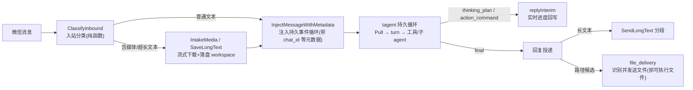

# tagent WeChat Bot — 完整示例

tagent 框架的**全机制实战示例**：一个常驻的微信机器人，把持久事件循环、记忆三原语、异步任务层、
子 Agent 编排、冥想心跳与四大平台子系统（治理 / 自进化 / 可靠性 / 语义召回）全部跑在真实消息链路上。
不是最小 demo——`tagent.yaml` 即一份可直接用于个人助手部署的生产配置。

> 部署（裸机 systemd / 容器）见 [deploy/README.md](deploy/README.md)；机制原理见 [../../docs/wiki/](../../docs/wiki/)。

---

## 快速开始

```bash
./wizard.sh    # 七步向导：依赖检查 → 密钥(不回显) → 工作根 → .env → ACL 权限 → 连通性验证 → 指引
./run.sh       # 前台启动（./run.sh --help 看全部命令）
```

需要 Go ≥ 1.24、tmux、以及一把 `ZAI_API_KEY`（GLM Coding Plan）。密钥写入 `.env`（chmod 600，
被本目录白名单式 `.gitignore` 天然忽略）。`run.sh` 启动时自动加载 `.env`，已导出的环境变量优先。

## Agent 编排（五个，`tagent.yaml`）

| Agent | 角色 | 工具面与权限边界 |
|---|---|---|
| `tagent` | **entry**：接收用户消息、编排全局、直接回复 | 子 agent `knowledge`/`plan` + 统一 `recall` 入口 + 7 个 file 工具 + `exec` |
| `knowledge` | 知识获取与翻译 | `skill_search`/`skill_load`/`mcp_discover`/`mcp_call`/`duckduckgo_search`/`memory_query` + **只读** `read_file`（刻意不扩权：无 list/search/write/exec） |
| `recall` | 记忆召回执行体 | `recall_query`/`recall_get`/`recall_recent`/`recall_trace`（entry 侧经统一 `recall` 工具按参数路由到此） |
| `action` | 命令与文件执行 | 7 个 file 工具 + `exec`（tmux 异步任务层）+ `mcp_call` |
| `plan` | 工作计划管理（拆解 / 记账 / 归档审计，**不代工**） | `spec` 类型化工具（openspec 后端，op 白名单，无 shell 逃逸面） |

四大子系统在本配置中**已启用**：治理闸 `enforcement=warn`（记账放行 + critical 恒审批）、自进化
（refine 发布道，`SOUL.md`/`AGENTS.md` 走慢道人工批准）、常驻可靠性（溢出 / 兜底 / 退化状态机 /
冥想锚点）、语义引擎（zhipu embedding-3，512 维，三个共享存储的 agent 共用同一引擎实例）。
启用后 agent 在各复杂场景的实际反应见 [agent-behavior-matrix.md](../../docs/wiki/platform/agent-behavior-matrix.md)。

## 消息链路



入站与出站两层都依赖**窄接口**（`MediaDownloader` / `FileSender`，`*wechat.Bot` 天然满足），
故可脱离真实微信登录、CDN 与 LLM 做单元测试（见 `file_intake_test.go` / `file_delivery_test.go`）。

## 目录导览

**入库的源码与配置**（clone 后即可见）：

| 路径 | 说明 |
|---|---|
| `main.go` | 消息链路装配：配置加载 → `tagent.New` → `StartLoop` → HTTPAPI → 微信 bot 事件绑定 |
| `file_intake.go` / `file_delivery.go` | 入站接收层 / 出站投递层（各配 `_test.go`） |
| `tagent.yaml` | 主配置（五 agent + 四子系统 + `mcp_servers` + `app.wechat`） |
| `tagent.rl.yaml` / `train_rl_config.yaml` / `train_tagent.py` | RL 训练模式配置与脚本 |
| `wizard.sh` / `run.sh` / `.env.example` | 部署向导 / 运行入口 / 环境变量模板 |
| `resources/prompts/` | 系统提示词（`AGENTS.md`/`SOUL.md`/`USER.md`/`TOOLS.md`/`meditation.md`/`plan_*`） |
| `deploy/` | systemd 单元模板 + 部署指南 |
| `Dockerfile` / `docker-compose.yml` / `entrypoint.sh` | 容器形态（podman/docker 兼容） |
| `skills/README.md`、`skills/url-fetcher/` | 技能体系说明 + 唯一入库的技能源码 |

**运行时生成、不入库**（白名单式 `.gitignore` 刻意忽略；clone 后看不到属正常）：
`.env`（密钥）、`.wechat-config/`（微信登录态与记忆存储）、`.wechat-context-tokens/`、
`workspace/`、`data/`（治理 / 自进化 / 可靠性 / 轨迹状态）、`logs/`、`incoming/`、
`knowledge_base/`（约 500 篇本地知识库文章）、`skills/` 下除 `url-fetcher` 外的技能、
`.tagent-workspace/`（超大工具输出与 tmux 暂存）、`wechat-bot`（构建产物）。

## 三种运行形态

| 形态 | 命令 | 适用 |
|---|---|---|
| 前台 / 后台 | `./run.sh` / `./run.sh start`（`status`/`log`/`stop`/`restart`） | 本地开发调试 |
| **裸机 systemd 常驻** | `./run.sh build` → 装 `deploy/tagent-wechat.service` → `systemctl enable --now` | 远端服务器（推荐，见 [deploy/README.md](deploy/README.md)） |
| 容器 | `docker-compose up -d`（或 podman） | 已有容器编排基建 |

## RL 训练模式

`./run.sh rl` 以 `tagent.rl.yaml` 启动 rollout worker（HTTPAPI + SwappableModel + TrajectoryRecorder），
另一终端 `./run.sh areal` 起 AReaL 侧；`train_tagent.py` + `train_rl_config.yaml` 为训练入口与配置。
轨迹 JSONL 落 `data/trajectories/`，含 `trace_id`/`span_id` 可回跳 OTel trace。

## 深入阅读

| 主题 | 位置 |
|---|---|
| 部署、数据目录备份、工作根与 ACL、故障排查 | [deploy/README.md](deploy/README.md) |
| 框架机制（记忆 / 事件 / 工具 / 插件 / prompt） | [../../docs/wiki/](../../docs/wiki/) |
| 平台子系统与启用后的行为反应 | [platform-subsystems.md](../../docs/wiki/platform/platform-subsystems.md) · [agent-behavior-matrix.md](../../docs/wiki/platform/agent-behavior-matrix.md) |
| 行为契约（SHALL 级规格） | [../../openspec/specs/](../../openspec/specs/) |
| 真实 LLM 契约守护矩阵 | [../../tests/README.md](../../tests/README.md) |
