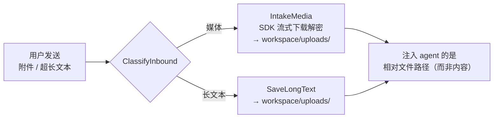
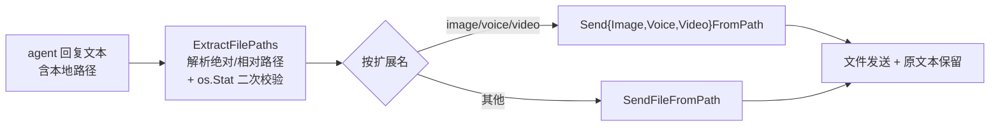

# WeChat Bot 示例

tagent 的完整实战示例：一个常驻运行的微信机器人，把[根 README](../../README.md) 描述的全部机制（持久事件循环、异步任务层、记忆压缩/召回、子 Agent 编排、冥想心跳、RL 轨迹采集）跑在真实 IM 通道上。

> 面向使用者——如何跑起来、能配什么。机制怎么工作见 [docs/wiki/](../../docs/wiki/)；行为契约见 [openspec/specs/](../../openspec/specs/)。

## 前置条件

- Go 1.21+
- 一个 OpenAI 兼容的 LLM 端点与 API Key（示例 `tagent.yaml` 默认用智谱 GLM，通过 `providers` 注册表切换 DeepSeek / Moonshot / 腾讯混元等）
- 微信收发依赖 [`wechat-robot-go`](https://github.com/SpellingDragon/wechat-robot-go) **v1.5.0**（已在 `go.mod` 固定，`go run` 自动拉取）

## 快速运行

```bash
cd examples/wechat-bot

# 设置入口 agent 所用 provider 的 API Key（环境变量名见 tagent.yaml 的 api_key_env）
export ZAI_API_KEY=<your-key>          # 默认 provider=zhipu → 智谱 GLM

go run .                                # 首次运行按提示扫码登录，token 存入 .wechat-config/
```

可选环境变量覆盖：

| 变量 | 作用 |
|------|------|
| `TAGENT_CONFIG` | 指定配置文件路径（默认 `tagent.yaml`） |
| `TAGENT_API_ENDPOINT` | 覆盖入口 agent 的 LLM 端点 |
| `TAGENT_WECHAT_WORKSPACE_DIR` | 覆盖 `app.wechat.workspace_dir`（容器内常指向 tmpfs，如 `workspace`） |
| `LOG_LEVEL` | 覆盖 `log_level`（`debug` 会打印 LLM 上下文明文、工具调用、压缩细节） |

## 配置：`app.wechat` 段

`tagent.yaml` 的 `agents` / `providers` / `compress` 等段与框架通用（见[根 README 配置参考](../../README.md#-配置参考)）。本示例专属配置在 `app.wechat`：

```yaml
app:
  wechat:
    config_dir: ".wechat-config"            # 登录态/token 存储目录
    token_file: "token.json"                # token 文件名（位于 config_dir 下）
    context_token_dir: ".wechat-context-tokens"
    workspace_dir: ".tagent-workspace"      # 入站附件/长文本落盘根目录（相对进程 cwd）
```

`workspace_dir` 与 file 工具的基准目录一致，因此 agent 读写文件与收发文件共享同一文件系统视图。未配置 `workspace_dir` 时，入站附件会被降级为"暂不支持"，但伴随文本仍正常注入。

## 文件收发（本示例的两个方向）

普通聊天机器人只在文本通道传消息；本示例把**文件**作为一等公民，两个方向都让文件内容绕开 LLM 的 token 通道。

### 入站：附件/长文本落盘为 agent 可读路径

用户发来的图片/语音/视频/文件，或超长文本，不会被塞进 LLM 上下文，而是：



- 媒体经 SDK **流式**下载（边下边解密写入，`MaxSize` 由 SDK 在传输中强制），落到 `workspace_dir/uploads/`。
- agent 收到的是一条带**相对路径**的消息，需要时用 file 工具（`read_file` 等）按路径读取——上下文只花路径字符串的 token。
- 需配置 `workspace_dir`；未配置时附件降级提示、文本照常注入。

### 出站：回复中的本地路径自动发为真实文件

agent 只需在最终回复里**输出本地文件路径**，投递层自动把真实文件发给用户：



- 相对路径按 `workspace_dir` 解析为绝对路径；裸文件名（无 `/`）与误匹配（版本号、域名）由 `os.Stat` 过滤。
- 策略是**发文件 + 保留文本**：原始回复文本照常发送，不做改写。
- 可执行文件扩展名硬性拒绝发送（安全规则，不可配置）。
- 单个文件发送失败不阻断文本与其他文件。

> 这样 agent 生成图片/报告/数据文件后，只需回复其路径，用户即收到可下载/预览的真实文件，LLM 输出 token 不被文件内容占用。

## 相关源码

| 文件 | 职责 |
|------|------|
| `main.go` | 装配：加载配置、解析 provider/model、`OnMessage` 入站分类、`StartLoop` 持久循环、RL SwappableModel/HTTPAPI 接线 |
| `file_intake.go` | 入站接收：`ClassifyInbound` / `IntakeMedia` / `SaveLongText` / `ComposeMediaInject` |
| `file_delivery.go` | 出站投递：`ExtractFilePaths` / `DeliverFiles`（窄接口 `FileSender`，可 mock 测试） |
| `resources/prompts/` | 该示例 agent 的 prompt（`AGENTS.md`/`SOUL.md`/`TOOLS.md`/`plan_agent.md` 等）|

## 延伸阅读

- 框架总览与配置参考：[根 README](../../README.md)
- 机制详解（记忆/工具/事件/压缩）：[docs/wiki/](../../docs/wiki/)
- 行为契约（本示例的文件收发规格）：[openspec/specs/example-local-file-delivery/](../../openspec/specs/example-local-file-delivery/spec.md)
